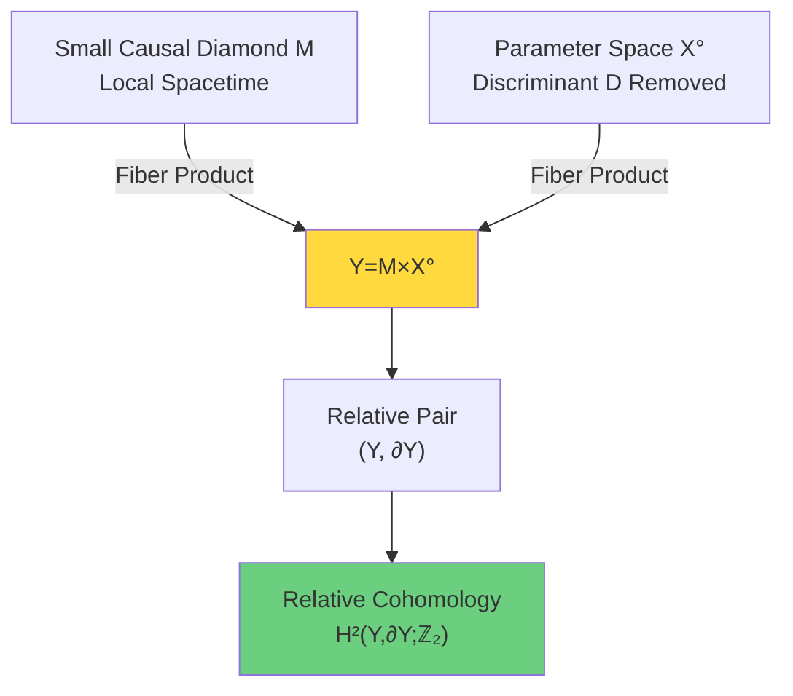
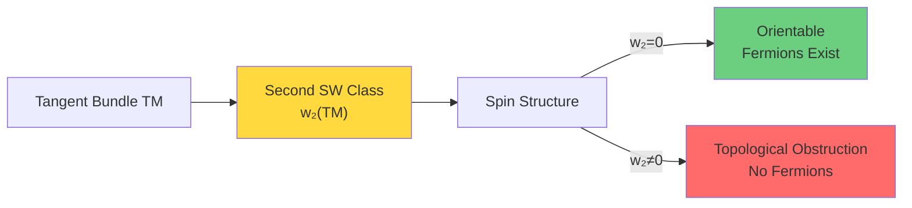
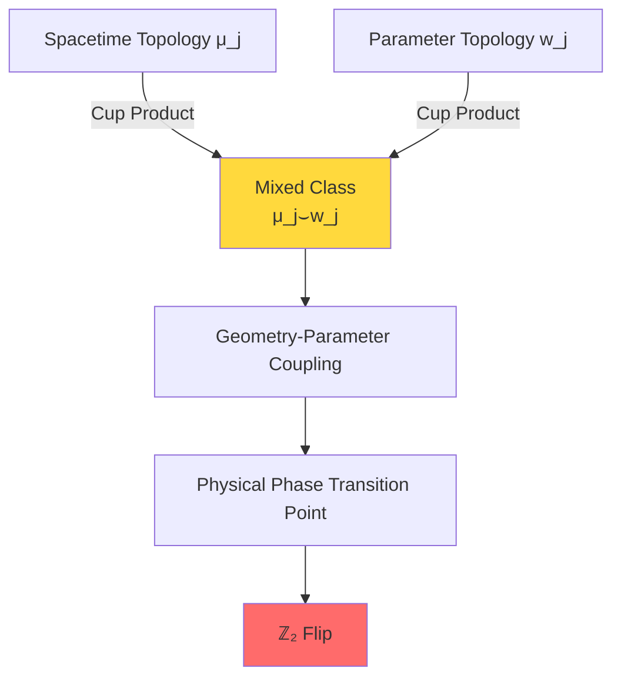
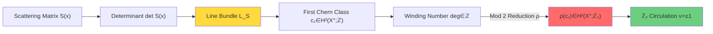
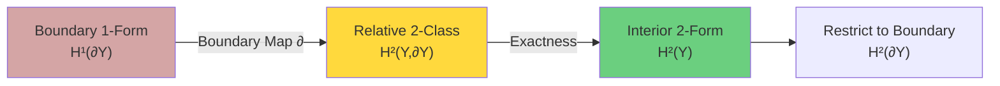
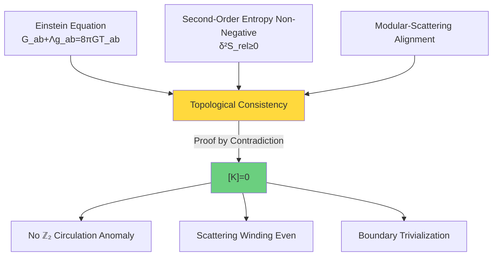

# Relative Cohomology Class [K]: Precise Language of Topological Constraints

In previous section, we understood why punctured domain and relative topology are needed. Now we give precise definition of core object of topological constraints—relative cohomology class $[K]$.

## Construction of Pair Space

### Total Space Y: Fiber Product of Spacetime and Parameters

Relative cohomology class is defined on pair space $(Y, \partial Y)$, where:

$$Y = M \times X^\circ$$

Here:
- **$M$**: Small causal diamond domain, local spacetime patch
  - Usually intersection of causal future $I^+(p)$ and causal past $I^-(q)$
  - Boundary decomposes into timelike slices and null slices

- **$X^\circ$**: Parameter space with discriminant removed
  - For scattering theory: frequency/energy/momentum parameters
  - For density matrices: state space with degeneracy set removed
  - $X^\circ = X \setminus D$, where $D$ is discriminant set

### Structure of Boundary ∂Y

Boundary $\partial Y$ has two contributions:

1. **Spacetime Boundary**: $\partial M \times X^\circ$
   - Null boundaries (light cones)
   - Timelike boundaries (waist cross-sections)

2. **Parameter Boundary**: $M \times \partial X^\circ$
   - Tubular neighborhood boundary of discriminant set
   - For example: $\partial \mathrm{Tub}_\varepsilon(\Sigma_{3|2})$

Complete boundary:
$$\partial Y = (\partial M \times X^\circ) \cup (M \times \partial X^\circ)$$

On boundary, topological classes may "trivialize", this is meaning of "relative".

## Three-Term Decomposition of Relative Cohomology Class [K]

### Complete Expression

Relative cohomology class $[K] \in H^2(Y, \partial Y; \mathbb{Z}_2)$ has three-term decomposition:

$$[K] = \pi_M^* w_2(TM) + \sum_j \pi_M^* \mu_j \smile \pi_X^* \mathfrak{w}_j + \pi_X^* \rho(c_1(\mathcal{L}_S))$$

Let's analyze term by term.

### First Term: Geometric Term $\pi_M^* w_2(TM)$

**Mathematical Definition**:
- $w_2(TM)$: Second Stiefel-Whitney class of spacetime tangent bundle $TM$
- $w_2 \in H^2(M; \mathbb{Z}_2)$
- $\pi_M: Y = M \times X^\circ \to M$: Projection to spacetime factor
- $\pi_M^* w_2$: Pullback to total space $Y$

**Physical Meaning**:

1. **Existence of Spin Structure**
   - $w_2(TM) = 0$ $\iff$ $TM$ is orientable and spin structure exists
   - In four-dimensional spacetime, this determines whether fermion fields can be defined

2. **Global Topology of Spacetime**
   - Non-orientable manifolds: $w_2 \neq 0$
   - Möbius strip is simplest example: $w_2(E) \neq 0$

3. **Topological Origin of Quantum Anomalies**
   - Anomaly of spin current relates to $w_2$
   - Chiral anomaly partially encoded in $w_2 \wedge \mathrm{tr}F^2$ term

**Calculation Example**: Real Projective Plane $\mathbb{RP}^2$

On $\mathbb{RP}^2$ (two-dimensional non-orientable surface):
- First SW class of tangent bundle $T\mathbb{RP}^2$: $w_1 \neq 0$ (non-orientable)
- Second SW class: $w_2 = w_1 \smile w_1 = w_1^2 \neq 0$ (ℤ₂ coefficients)
- Therefore **no spin structure exists** on $\mathbb{RP}^2$

### Second Term: Mixed Term $\sum_j \pi_M^* \mu_j \smile \pi_X^* \mathfrak{w}_j$

**Mathematical Definition**:
- $\mu_j \in H^{a_j}(M; \mathbb{Z}_2)$: Cohomology classes of spacetime
- $\mathfrak{w}_j \in H^{b_j}(X^\circ; \mathbb{Z}_2)$: Cohomology classes of parameter space
- $a_j + b_j = 2$ (degree matching)
- $\smile$: Cup product (multiplication of cohomology)

**Physical Meaning**:

This term encodes **coupling of spacetime topology and parameter topology**.

**Case 1**: ℤ₂ Index of Magnetic Monopole

Consider ℤ₂ version of Aharonov-Bohm effect:
- $M$: Two-dimensional spatial plane (origin removed)
- $X^\circ$: Magnetic flux parameter $\alpha \in [0,1) \setminus \{1/2\}$
- When $\alpha = 1/2$, ℤ₂ circulation flips

Mixed term captures:
$$\mu_1 \smile \mathfrak{w}_1 \sim [\text{spatial loop}] \smile [\text{path through}\ \alpha = 1/2]$$

**Case 2**: θ Angle of QCD

In Yang-Mills theory:
- Spacetime $M$ has instanton configurations ($\pi_3(G) = \mathbb{Z}$)
- Parameter $\theta \in [0, 2\pi)$ (θ vacuum angle)
- At $\theta = \pi$ there is ℤ₂ symmetry breaking

Mixed term relates to topological structure of $\mathbb{CP}$ violation.

### Third Term: Scattering Term $\pi_X^* \rho(c_1(\mathcal{L}_S))$

**Mathematical Definition**:
- $\mathcal{L}_S$: Scattering determinant line bundle
- $c_1(\mathcal{L}_S) \in H^2(X^\circ; \mathbb{Z})$: First Chern class (integer coefficients)
- $\rho: H^2(X^\circ; \mathbb{Z}) \to H^2(X^\circ; \mathbb{Z}_2)$: Mod 2 reduction map
- $\pi_X^* \rho(c_1)$: Pullback to $Y$

**Physical Meaning**:

This is most "physical" term, directly encoding **winding number of scattering phase**.

#### Construction of Scattering Determinant Line Bundle

For parameter $x \in X^\circ$ (e.g., frequency $\omega$), scattering matrix $S(x)$ is unitary, therefore:
$$\det S(x) \in U(1) \subset \mathbb{C}$$

On $X^\circ$, $\{\det S(x)\}$ defines a $U(1)$ principal bundle. Associated complex line bundle is denoted $\mathcal{L}_S$.

**Physical Meaning of First Chern Class**:

For closed surface $\Sigma$ on two-dimensional parameter space $X^\circ$:
$$\langle c_1(\mathcal{L}_S), [\Sigma] \rangle = \frac{1}{2\pi} \int_\Sigma F_{\mathcal{L}_S} = \deg(\det S|_\Sigma) \in \mathbb{Z}$$

This is exactly **winding number** of scattering determinant along $\Sigma$!

#### Mod 2 Reduction and ℤ₂ Circulation

Reduction map $\rho$ projects integer winding number to ℤ₂:
$$\rho(n) = n \mod 2 \in \{0, 1\}$$

Physically, this corresponds to **branch selection of scattering square root**:
- If $\deg(\det S|_\gamma) = 2k$ (even), square root is single-valued along $\gamma$
- If $\deg(\det S|_\gamma) = 2k+1$ (odd), square root flips branch

Define ℤ₂ circulation:
$$\nu_{\sqrt{\det S}}(\gamma) = (-1)^{\deg(\det S|_\gamma)} = \begin{cases}
+1 & \text{even winding} \\
-1 & \text{odd winding}
\end{cases}$$

#### Example: π Phase Jump in One-Dimensional Scattering

Consider one-dimensional potential scattering, reflection amplitude $r(\omega)$ has **π phase jump** at some frequency $\omega_0$:
$$\arg r(\omega) = \begin{cases}
0 & \omega < \omega_0 \\
\pi & \omega > \omega_0
\end{cases}$$

Scattering matrix $S = \begin{pmatrix} r & t' \\ t & r' \end{pmatrix}$, its determinant:
$$\det S(\omega) = r(\omega) r'(\omega) - t(\omega) t'(\omega)$$

If $\det S(\omega)$ winds once around small loop $\gamma$ around $\omega_0$:
$$\deg(\det S|_\gamma) = 1 \quad (\text{odd})$$

Therefore:
$$\nu_{\sqrt{\det S}}(\gamma) = -1$$

This $-1$ is exactly ℤ₂ circulation anomaly!

## Long Exact Sequence of Relative Cohomology

### From Absolute to Relative

Given pair $(Y, \partial Y)$, relative cohomology connects to absolute cohomology through long exact sequence:

$$\cdots \to H^1(Y) \to H^1(\partial Y) \xrightarrow{\partial} H^2(Y,\partial Y) \to H^2(Y) \to H^2(\partial Y) \to \cdots$$

**Physical Meaning of Boundary Map** $\partial$:
- 1-forms on boundary $\partial Y$ (e.g., scattering phase)
- Map through $\partial$ to relative 2-classes in interior $Y$
- This is **cohomological version of Stokes theorem**

### Exactness Condition

If $[K] = 0$, it means:
1. **Interior primitive exists**: $K = \delta A$ for some $A \in C^1(Y,\partial Y)$
2. **Boundary trivialization**: $K|_{\partial Y} = 0$

Conversely, if $[K] \neq 0$:
- There is "source" on boundary
- Cannot find consistent primitive in interior

## Equivalent Characterizations of [K]=0

### Theorem (Three Equivalent Conditions for Trivialization of Relative Class)

Following three conditions are equivalent:

**Condition 1 (Cohomology)**: Relative class trivial
$$[K] = 0 \in H^2(Y,\partial Y; \mathbb{Z}_2)$$

**Condition 2 (Loops)**: ℤ₂ circulation trivial on all allowed loops
$$\forall \gamma \in \mathcal{C}_{\mathrm{adm}}:\ \nu_{\sqrt{\det S}}(\gamma) = +1$$

**Condition 3 (2-Cycles)**: Chern number even on all allowed 2-cycles
$$\forall \Sigma \in Z_2(Y,\partial Y):\ \langle c_1(\mathcal{L}_S), [\Sigma] \rangle = 0 \mod 2$$

**Proof Idea**:
- Condition 1 $\Rightarrow$ Condition 2: Poincaré-Lefschetz duality
- Condition 2 $\Rightarrow$ Condition 3: Stokes theorem and boundary integration
- Condition 3 $\Rightarrow$ Condition 1: Definition of relative cohomology

### Physical Meaning

Three equivalent conditions correspond to three physical levels:

| Condition | Mathematics | Physics |
|-----------|-------------|---------|
| Condition 1 | Relative cohomology class | Topological consistency |
| Condition 2 | ℤ₂ circulation | Quantum phase single-valued |
| Condition 3 | Chern number mod 2 | Scattering winding quantization |

## Calculation Example: [K] for 5D Density Matrix

### Setup

Consider $N=5$ density matrix manifold, punctured domain:
$$\mathcal{D}^{\mathrm{exc}} = \{\rho : \lambda_3 - \lambda_4 \geq 2\delta\}$$

Boundary:
$$\partial \mathcal{D}^{\mathrm{exc}} = \{\rho : \lambda_3 - \lambda_4 = 2\delta\}$$

### First Term: w₂(TM) = 0

For real density matrix manifold, tangent bundle $TM$ is orientable rank $d$ real vector bundle ($d = \dim \mathcal{D}^{\mathrm{exc}}$).

Since manifold is orientable, first Stiefel-Whitney class $w_1 = 0$. Further, density matrix manifold is symmetric space with natural positive definite metric, therefore spin structure exists:
$$w_2(TM) = 0$$

**Physical Conclusion**: Spacetime geometric term contributes nothing to [K].

### Second Term: Mixed Term (Case-Dependent)

Mixed term $\sum_j \mu_j \smile \mathfrak{w}_j$ depends on specific parameter space $X^\circ$.

**Simplified Case**: If parameter space is only one-dimensional (e.g., single frequency $\omega$), then:
$$H^{b_j}(X^\circ; \mathbb{Z}_2) = 0 \quad \text{for}\ b_j \geq 2$$

Therefore mixed term vanishes.

### Third Term: Scattering Winding (Main Contribution)

On density matrix manifold, "scattering" can be understood as **phase evolution**.

Consider unitary evolution $U(t) = e^{-iHt}$, scattering matrix is:
$$S(\omega) = \lim_{t \to \infty} e^{i H_0 t} e^{-i H t}$$

For density matrix $\rho$, eigenvalue evolution near degeneracy may produce phase jumps.

**Key Observation**: When parameter path winds once around $\Sigma_{3|2}$, determinant of Riesz projection $P_3$ may acquire $-1$ factor:
$$\det P_3|_{\gamma} = e^{i\pi} = -1$$

This corresponds to odd winding number $\deg = 1$, therefore:
$$\rho(c_1) \neq 0 \in H^2(X^\circ; \mathbb{Z}_2)$$

**Physical Conclusion**: Topological non-triviality from puncturing mainly comes from scattering term.

### Summary: [K] for Density Matrix Manifold

$$[K] = \pi_X^* \rho(c_1(\mathcal{L}_{P_3}))$$

where $\mathcal{L}_{P_3}$ is line bundle of Riesz projection determinant.

$[K] = 0$ if and only if on all loops around degeneracy set, projection determinant winds even number of times.

## Connection with IGVP: Geometry-Energy Derives [K]=0

### Theorem (Geometry-Energy Consistency Implies Topological Triviality)

On small causal diamond, if following hold:

1. **First-Order Condition**: Einstein equation
   $$G_{ab} + \Lambda g_{ab} = 8\pi G T_{ab}$$

2. **Second-Order Condition**: Relative entropy non-negative
   $$\delta^2 S_{\mathrm{rel}} = \mathcal{E}_{\mathrm{can}} \geq 0$$

3. **Alignment Condition**: Mod 2 alignment of modular-scattering

then necessarily:
$$[K] = 0$$

**Proof Idea** (see Section 08-04 for details):

Assume $[K] \neq 0$, i.e., there exists loop $\gamma$ such that $\nu_{\sqrt{\det S}}(\gamma) = -1$.

1. By modular-scattering alignment, this ℤ₂ circulation corresponds to linear functional on covariant phase space
2. This functional produces negative direction in quadratic form kernel
3. Therefore $\mathcal{E}_{\mathrm{can}}[h,h] < 0$ for some $h$
4. Contradiction!

Therefore $[K] = 0$ is **inevitable result** of geometry-energy consistency.

## Summary: Triple Identity of [K]

Relative cohomology class $[K]$ has triple identity:

1. **Mathematics**: Element of $H^2(Y,\partial Y;\mathbb{Z}_2)$
2. **Geometry**: Mixed topological invariant of spacetime-parameters
3. **Physics**: Criterion for ℤ₂ circulation anomaly

Its three-term decomposition:
$$[K] = \underbrace{\pi_M^* w_2(TM)}_{\text{spin structure}} + \underbrace{\sum_j \pi_M^* \mu_j \smile \pi_X^* \mathfrak{w}_j}_{\text{spacetime-parameter coupling}} + \underbrace{\pi_X^* \rho(c_1(\mathcal{L}_S))}_{\text{scattering winding}}$$

respectively encodes three types of topological obstructions.

$[K] = 0$ is sign of physical consistency:
- No spin anomaly
- No mixed topological jumps
- No scattering phase branch switching

## Next Step: Precise Definition and Calculation of ℤ₂ Circulation

Next section will give precise definition of ℤ₂ circulation $\nu_{\sqrt{\det S}}(\gamma)$, introduce "small semicircle/return" rule, and show how to calculate it in actual systems.

This will translate abstract cohomology class $[K]$ into operational physical criterion.

