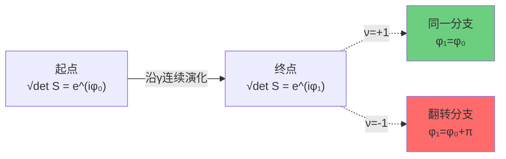
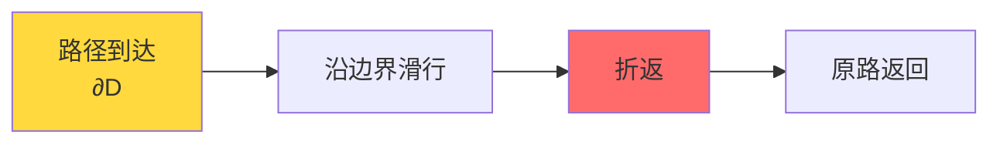
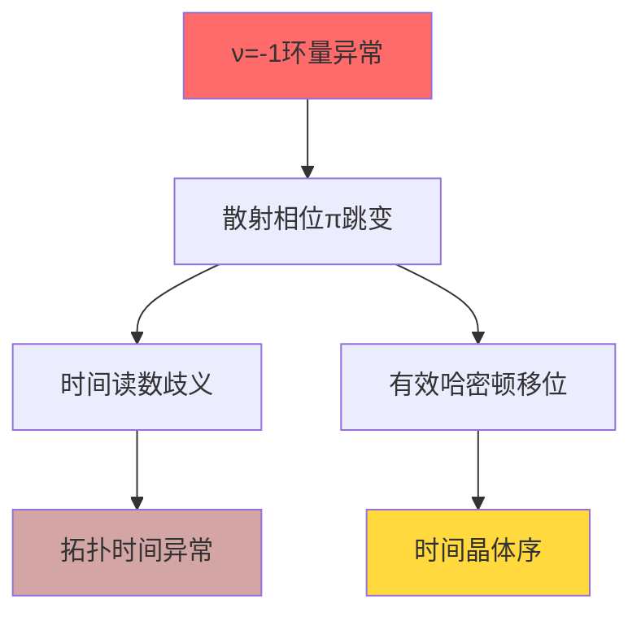
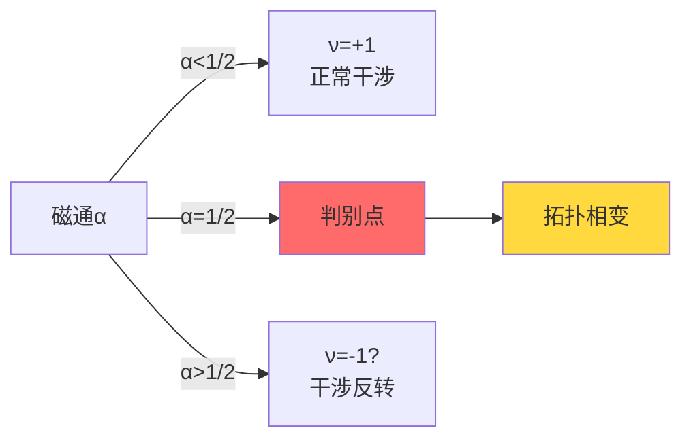
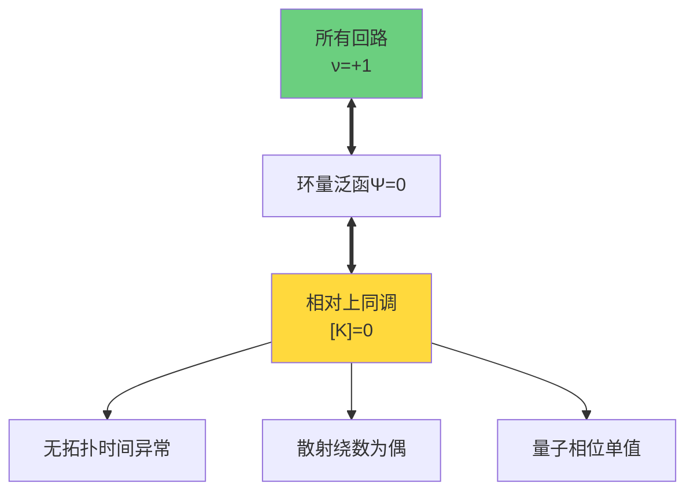

# ℤ₂环量：拓扑时间异常的可观测标志

在上一节中，我们定义了相对上同调类$[K]$并给出了其三项分解。现在我们将焦点转向$[K]=0$的最直接物理判据——**ℤ₂环量**。

ℤ₂环量是一个简单的±1值量，但它编码了深刻的拓扑信息：量子相位沿回路的模2跳变。

## ℤ₂环量的精确定义

### 散射行列式的平方根问题

给定散射矩阵$S(\omega)$（幺正的），其行列式：
$$
\det S(\omega) \in U(1) \subset \mathbb{C}
$$

可以写成相位形式：
$$
\det S(\omega) = e^{2i\phi(\omega)}
$$

**问题**：如何定义$\sqrt{\det S(\omega)}$？

天真的选择：
$$
\sqrt{\det S(\omega)} = e^{i\phi(\omega)}
$$

但这有一个问题：$\phi(\omega)$本身不是单值的！它在$\phi \to \phi + 2\pi n$下有整数n的自由度。

### 平方根的分支选择

数学上，$\sqrt{\det S}$是一个**双值函数**：
- 如果选择了一个分支$e^{i\phi(\omega)}$
- 另一个分支是$e^{i(\phi(\omega)+\pi)} = -e^{i\phi(\omega)}$

沿参数空间的闭路径$\gamma$，当我们连续地选择平方根时，可能发生**分支切换**：
$$
\sqrt{\det S}|_{\gamma \text{终点}} = \pm \sqrt{\det S}|_{\gamma \text{起点}}
$$

定义**ℤ₂环量**（ℤ₂ holonomy）：
$$
\nu_{\sqrt{\det S}}(\gamma) := \frac{\sqrt{\det S}|_{\gamma \text{终点}}}{\sqrt{\det S}|_{\gamma \text{起点}}} = \pm 1
$$

### 与绕数的关系

ℤ₂环量$\nu_{\sqrt{\det S}}(\gamma)$与行列式的绕数直接相关：

**定理**：设$\deg(\det S|_\gamma) = \frac{1}{2\pi} \oint_\gamma d(\arg \det S)$为绕数（整数），则：
$$
\nu_{\sqrt{\det S}}(\gamma) = (-1)^{\deg(\det S|_\gamma)}
$$

**证明**：
沿$\gamma$一周，相位变化：
$$
\Delta \phi = \phi(\text{终点}) - \phi(\text{起点}) = \frac{1}{2} \Delta(2\phi) = \frac{1}{2} \cdot 2\pi \deg(\det S|_\gamma) = \pi \deg(\det S|_\gamma)
$$

因此：
$$
e^{i\Delta\phi} = e^{i\pi \deg(\det S|_\gamma)} = (-1)^{\deg(\det S|_\gamma)}
$$

这正是$\nu_{\sqrt{\det S}}(\gamma)$的定义。

**物理含义**：
- 偶绕数：$\deg = 2k$ → $\nu = +1$ → 平方根单值
- 奇绕数：$\deg = 2k+1$ → $\nu = -1$ → 平方根翻转分支

## 小半圆/折返规则

### 判别集的处理：不可穿越的奇点

在参数空间$X^\circ$中，判别集$D$（例如简并点$\Sigma_{3|2}$）是我们**移除**的部分。因此，物理上允许的路径**不能穿越**$D$。

但在定义环量时，我们需要回路。如果回路必须绕过判别点，如何规范地选择路径？

### 小半圆规则

**规定**：当闭路$\gamma$接近判别点$p \in D$时，在局部采用**小半圆绕行**：
- 在$p$附近取法向方向的小圆盘$B_\varepsilon(p)$
- 路径绕$\partial B_\varepsilon(p)$半圆
- 方向由右手法则确定

**数学表述**：
设$\gamma: [0,1] \to X^\circ$是闭路径，$\gamma(t)$在$t = t_0$处接近$D$。则在$(t_0 - \delta, t_0 + \delta)$内：
$$
\gamma(t) = p + \varepsilon e^{i\theta(t)} n(p)
$$

其中$n(p)$是$D$的法向量，$\theta(t)$从0变到π（半圆）。

### 折返规则

对于**开路径**（起点和终点不同），如果需要在判别点处反向：

**规定**：在判别点处**折返而不穿越**：
- 路径到达判别集边界
- 沿边界滑行小段
- 原路折返

### 规则的物理意义

小半圆/折返规则确保：
1. **连续性**：路径在$X^\circ$中连续
2. **可微性**：避免在判别点的不可微行为
3. **拓扑稳定性**：小的扰动不改变环量值

**定理（环量的鲁棒性）**：
在小半圆/折返规则下，ℤ₂环量$\nu_{\sqrt{\det S}}(\gamma)$对路径的小扰动（不穿越$D$）保持不变。

## 拓扑时间异常：π相位跳变的物理后果

### 什么是拓扑时间异常？

在统一时间刻度框架中，时间由散射相位导数$\kappa(\omega) = \varphi'(\omega)/\pi$定义。如果散射相位沿某回路获得π跳变，会导致：

**时间的符号翻转**：
$$
\Delta \tau = \int_\gamma \kappa(\omega) d\omega = \int_\gamma \frac{\varphi'(\omega)}{\pi} d\omega = \frac{1}{\pi} [\varphi]_\gamma
$$

如果$[\varphi]_\gamma = \pi$（模$2\pi$），则：
$$
\Delta \tau = 1 \quad \text{（时间单位）}
$$

但如果我们换一个等价的路径$\gamma'$（同伦于$\gamma$但绕判别点另一侧），可能得到：
$$
[\varphi]_{\gamma'} = \pi + \pi = 2\pi \Rightarrow \Delta \tau' = 2
$$

**矛盾**！时间读数依赖于路径选择。

### 时间箭头的拓扑反常

更深刻的问题：如果$\nu_{\sqrt{\det S}}(\gamma) = -1$，意味着沿$\gamma$，"未来"和"过去"的量子权重发生**符号翻转**。

在量子力学中，时间演化算符：
$$
U(t) = e^{-iHt}
$$

如果散射行列式的平方根翻转：
$$
\sqrt{\det S} \to -\sqrt{\det S}
$$

则有效哈密顿量获得$\pi/T$的移位（$T$是周期）：
$$
H_{\text{eff}} \to H_{\text{eff}} + \pi/T
$$

这是**时间晶体现象**的拓扑根源！

### [K]=0消除异常

要求$[K] = 0$等价于：
$$
\forall \gamma \in \mathcal{C}_{\text{adm}}:\ \nu_{\sqrt{\det S}}(\gamma) = +1
$$

这确保：
- **时间读数单值**：不依赖路径选择
- **因果一致**：未来-过去方向无拓扑翻转
- **热力学箭头**：熵增方向全局一致

## 计算示例

### 示例1：一维δ势散射

考虑一维δ势：
$$
V(x) = g\delta(x)
$$

散射矩阵（反射振幅$r$）：
$$
r(\omega) = \frac{-ig}{2\omega - ig}
$$

当$\omega$绕复平面极点$\omega_0 = ig/2$一圈时：

**计算绕数**：
极点在上半平面，取逆时针小圆$\gamma$绕$\omega_0$。

$$
\deg(r|_\gamma) = \frac{1}{2\pi i} \oint_\gamma \frac{dr}{r} = \frac{1}{2\pi i} \oint_\gamma d(\log r)
$$

由留数定理：
$$
\log r(\omega) = \log(-ig) + \log\frac{1}{2\omega - ig}
$$

绕$\omega_0$一圈，对数获得$2\pi i$：
$$
\deg(r|_\gamma) = 1 \quad \text{（奇数）}
$$

**ℤ₂环量**：
$$
\nu_{\sqrt{r}}(\gamma) = (-1)^1 = -1
$$

**物理意义**：
在复平面绕束缚态极点，散射平方根翻转分支！这个$-1$正是拓扑时间异常的标志。

### 示例2：Aharonov-Bohm效应的ℤ₂版本

考虑二维平面（移除原点）中的磁通：
$$
A_\theta = \frac{\alpha}{r},\quad \alpha \in [0,1)
$$

围绕原点的圆形路径$\gamma$，散射相位：
$$
\Delta \phi = \oint_\gamma A_\theta d\theta = 2\pi \alpha
$$

**半通量点**$\alpha = 1/2$：
$$
\Delta \phi = \pi \Rightarrow \deg(\det S|_\gamma) = 1
$$

因此：
$$
\nu_{\sqrt{\det S}}(\gamma) = -1 \quad \text{当}\quad \alpha = 1/2
$$

**物理现象**：
当磁通精确为半通量子时，量子干涉图样反转！这在Aharonov-Bohm实验中可以观测到。

### 示例3：拓扑超导端点的ℤ₂指标

在拓扑超导体（Class D）的一维端点，反射矩阵$r(\omega)$：
$$
r(\omega) = \frac{\omega - i\Delta}{\omega + i\Delta}
$$

其中$\Delta$是配对能隙。

**零能点**$\omega = 0$：
$$
r(0) = \frac{-i\Delta}{i\Delta} = -1
$$

相位跳变π！

**绕零点的环量**：
取小圆$\gamma$绕$\omega = 0$：
$$
\deg(r|_\gamma) = 1
$$

$$
\nu_{\sqrt{r}}(\gamma) = -1
$$

**拓扑解释**：
这个$-1$正是Majorana零模的拓扑不变量$\mathbb{Z}_2$指标！

## ℤ₂环量与相对上同调的字典

### 从环量到上同调类

给定一族闭路$\{\gamma_\alpha\}$生成$H_1(X^\circ, \partial X^\circ; \mathbb{Z}_2)$（相对同调），定义映射：
$$
\Psi: H_1(X^\circ, \partial X^\circ; \mathbb{Z}_2) \to \mathbb{Z}_2
$$
$$
\Psi([\gamma]) = \begin{cases}
0 & \text{if}\ \nu_{\sqrt{\det S}}(\gamma) = +1 \\
1 & \text{if}\ \nu_{\sqrt{\det S}}(\gamma) = -1
\end{cases}
$$

**定理（Poincaré-Lefschetz对偶）**：
$\Psi$是线性泛函，对应于$H^1(X^\circ, \partial X^\circ; \mathbb{Z}_2)$的元素。

通过边界映射$\partial: H^1(\partial X^\circ) \to H^2(X^\circ, \partial X^\circ)$，这个1-上同调类提升为2-上同调类，正是$[K]$的一部分！

### [K]=0的环量判据

**定理（环量判据）**：
$$
[K] = 0 \iff \forall \gamma \in H_1(X^\circ, \partial X^\circ; \mathbb{Z}_2):\ \Psi([\gamma]) = 0
$$

即：
$$
[K] = 0 \iff \text{所有允许回路上}\ \nu_{\sqrt{\det S}}(\gamma) = +1
$$

## 实验检测ℤ₂环量的方案

### 方案1：纯化干涉环

**设定**：量子态$\rho(\lambda)$随参数$\lambda$演化，形成闭路$\gamma$。

**步骤**：
1. 制备初始纯化$|\psi(\lambda_0)\rangle$
2. 沿$\gamma$绝热演化
3. 测量Berry相位：$\phi_B = i\oint_\gamma \langle \psi | d\psi \rangle$
4. 如果$e^{i\phi_B} = -1$，则$\nu = -1$

**精度要求**：
- 相位噪声$\delta \phi \lesssim 0.25$rad
- 采样次数$N_{\text{shots}} \gtrsim 30$

### 方案2：时间晶体序参量

**设定**：周期驱动系统，Floquet算符$F = e^{-iH_{\text{eff}}T}$。

**步骤**：
1. 调制驱动参数沿闭路$\gamma$
2. 测量次谐响应的$2T$峰强度$I_{2T}$
3. 比较不同路径：如果$I_{2T}(\gamma) \neq I_{2T}(\gamma')$，提示$\nu$翻转

**判据**：
- ℤ₂时间晶体：$I_{2T}/I_T > 0.1$
- 环量翻转：$\Delta I_{2T}/I_{2T} \gtrsim 0.5$

### 方案3：拓扑量子比特的相位读出

**设定**：Majorana零模或拓扑超导量子比特。

**步骤**：
1. 编码量子信息到拓扑子空间
2. 绝热输运沿$\gamma$
3. 读出量子态：如果翻转，则$\nu = -1$

**优势**：
- 拓扑保护，低退相干
- 直接读出ℤ₂指标

## 小结：ℤ₂环量的三重角色

ℤ₂环量$\nu_{\sqrt{\det S}}(\gamma)$在拓扑约束中扮演三重角色：

| 层面 | 数学 | 物理 |
|------|------|------|
| **几何** | 散射平方根的分支选择 | 量子相位的模2跳变 |
| **代数** | ℤ₂主丛的环量 | 离散对称性的破缺 |
| **拓扑** | 相对上同调的对偶 | 拓扑时间异常的标志 |

**核心洞察**：

> ℤ₂环量将抽象的拓扑约束$[K]$翻译成可观测的物理量——路径相位的±1符号。
>
> 要求所有物理回路上$\nu = +1$，正是$[K] = 0$的实验判据。

## 下一步：标准模型群结构S(U(3)×U(2))

现在我们已经理解了拓扑约束的数学语言（相对上同调$[K]$）和物理判据（ℤ₂环量$\nu$）。

下一节将展示拓扑约束的**最震撼应用**：从5维密度矩阵流形的穿孔结构，直接推导出标准模型的规范群！

$$
S(U(3) \times U(2)) \cong \frac{SU(3) \times SU(2) \times U(1)}{\mathbb{Z}_6}
$$

这不是巧合，而是拓扑必然性的结果。
