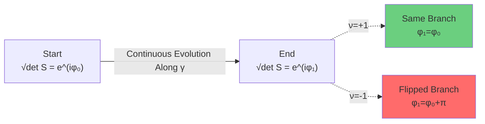
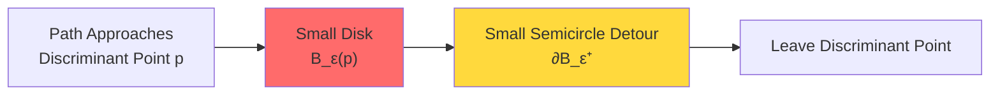
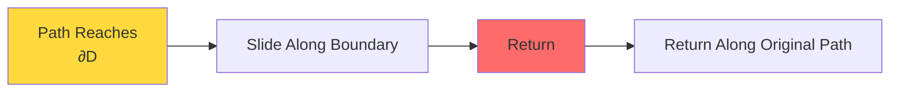
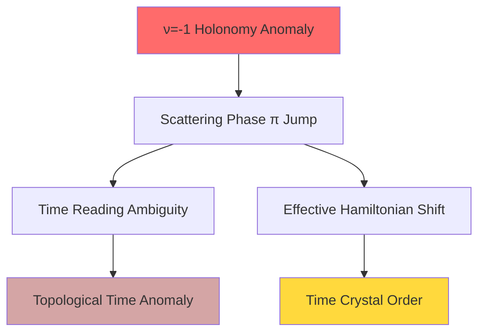
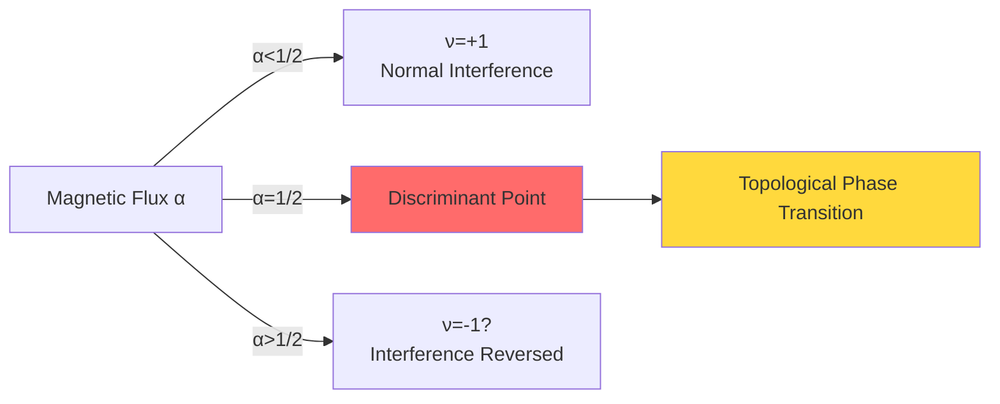
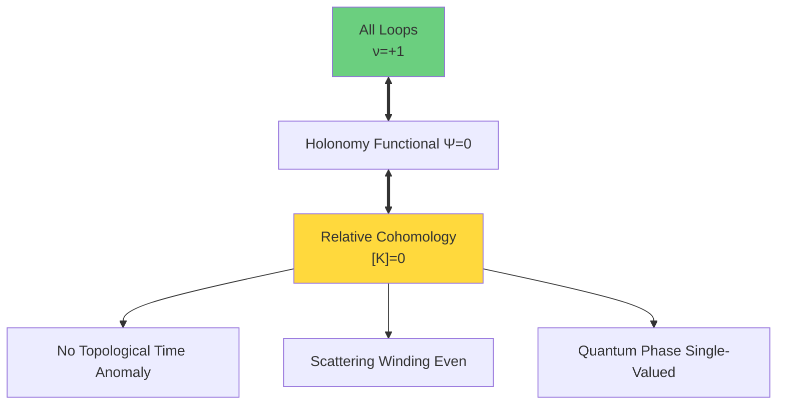

# ℤ₂ Holonomy: Observable Sign of Topological Time Anomaly

In previous section, we defined relative cohomology class $[K]$ and gave its three-term decomposition. Now we turn focus to most direct physical criterion for $[K]=0$—**ℤ₂ holonomy**.

ℤ₂ holonomy is a simple ±1-valued quantity, but it encodes profound topological information: mod 2 jump of quantum phase along loops.

## Precise Definition of ℤ₂ Holonomy

### Square Root Problem of Scattering Determinant

Given scattering matrix $S(\omega)$ (unitary), its determinant:
$$\det S(\omega) \in U(1) \subset \mathbb{C}$$

Can be written in phase form:
$$\det S(\omega) = e^{2i\phi(\omega)}$$

**Problem**: How to define $\sqrt{\det S(\omega)}$?

Naive choice:
$$\sqrt{\det S(\omega)} = e^{i\phi(\omega)}$$

But this has a problem: $\phi(\omega)$ itself is not single-valued! It has integer $n$ freedom under $\phi \to \phi + 2\pi n$.

### Branch Selection of Square Root

Mathematically, $\sqrt{\det S}$ is a **two-valued function**:
- If one branch $e^{i\phi(\omega)}$ is chosen
- Other branch is $e^{i(\phi(\omega)+\pi)} = -e^{i\phi(\omega)}$

Along closed path $\gamma$ in parameter space, when continuously choosing square root, **branch switching** may occur:
$$\sqrt{\det S}|_{\gamma \text{end}} = \pm \sqrt{\det S}|_{\gamma \text{start}}$$

Define **ℤ₂ holonomy**:
$$\nu_{\sqrt{\det S}}(\gamma) := \frac{\sqrt{\det S}|_{\gamma \text{end}}}{\sqrt{\det S}|_{\gamma \text{start}}} = \pm 1$$

### Relationship with Winding Number

ℤ₂ holonomy $\nu_{\sqrt{\det S}}(\gamma)$ directly relates to winding number of determinant:

**Theorem**: Let $\deg(\det S|_\gamma) = \frac{1}{2\pi} \oint_\gamma d(\arg \det S)$ be winding number (integer), then:
$$\nu_{\sqrt{\det S}}(\gamma) = (-1)^{\deg(\det S|_\gamma)}$$

**Proof**:
Along one cycle of $\gamma$, phase change:
$$\Delta \phi = \phi(\text{end}) - \phi(\text{start}) = \frac{1}{2} \Delta(2\phi) = \frac{1}{2} \cdot 2\pi \deg(\det S|_\gamma) = \pi \deg(\det S|_\gamma)$$

Therefore:
$$e^{i\Delta\phi} = e^{i\pi \deg(\det S|_\gamma)} = (-1)^{\deg(\det S|_\gamma)}$$

This is exactly definition of $\nu_{\sqrt{\det S}}(\gamma)$.

**Physical Meaning**:
- Even winding: $\deg = 2k$ → $\nu = +1$ → square root single-valued
- Odd winding: $\deg = 2k+1$ → $\nu = -1$ → square root flips branch

## Small Semicircle/Return Rule

### Handling Discriminant Set: Non-Crossable Singularities

In parameter space $X^\circ$, discriminant set $D$ (e.g., degeneracy points $\Sigma_{3|2}$) is part we **removed**. Therefore, physically allowed paths **cannot cross** $D$.

But in defining holonomy, we need loops. If loops must bypass discriminant points, how to canonically choose paths?

### Small Semicircle Rule

**Rule**: When closed path $\gamma$ approaches discriminant point $p \in D$, locally adopt **small semicircle detour**:
- Take small disk $B_\varepsilon(p)$ in normal direction near $p$
- Path goes around half circle of $\partial B_\varepsilon(p)$
- Direction determined by right-hand rule

**Mathematical Formulation**:
Let $\gamma: [0,1] \to X^\circ$ be closed path, $\gamma(t)$ approaches $D$ at $t = t_0$. Then in $(t_0 - \delta, t_0 + \delta)$:
$$\gamma(t) = p + \varepsilon e^{i\theta(t)} n(p)$$

where $n(p)$ is normal vector of $D$, $\theta(t)$ changes from 0 to π (semicircle).

### Return Rule

For **open paths** (start and end different), if need to reverse at discriminant point:

**Rule**: **Return without crossing** at discriminant point:
- Path reaches boundary of discriminant set
- Slide along boundary for small segment
- Return along original path

### Physical Meaning of Rules

Small semicircle/return rule ensures:
1. **Continuity**: Path is continuous in $X^\circ$
2. **Differentiability**: Avoids non-differentiable behavior at discriminant points
3. **Topological Stability**: Small perturbations don't change holonomy value

**Theorem (Robustness of Holonomy)**:
Under small semicircle/return rule, ℤ₂ holonomy $\nu_{\sqrt{\det S}}(\gamma)$ remains unchanged under small perturbations of path (not crossing $D$).

## Topological Time Anomaly: Physical Consequences of π Phase Jump

### What Is Topological Time Anomaly?

In unified time scale framework, time is defined by scattering phase derivative $\kappa(\omega) = \varphi'(\omega)/\pi$. If scattering phase acquires π jump along some loop, it causes:

**Sign Flip of Time**:
$$\Delta \tau = \int_\gamma \kappa(\omega) d\omega = \int_\gamma \frac{\varphi'(\omega)}{\pi} d\omega = \frac{1}{\pi} [\varphi]_\gamma$$

If $[\varphi]_\gamma = \pi$ (mod $2\pi$), then:
$$\Delta \tau = 1 \quad \text{(time unit)}$$

But if we take equivalent path $\gamma'$ (homotopic to $\gamma$ but around other side of discriminant point), we might get:
$$[\varphi]_{\gamma'} = \pi + \pi = 2\pi \Rightarrow \Delta \tau' = 2$$

**Contradiction**! Time reading depends on path choice.

### Topological Anomaly of Time Arrow

Deeper problem: If $\nu_{\sqrt{\det S}}(\gamma) = -1$, it means along $\gamma$, quantum weights of "future" and "past" undergo **sign flip**.

In quantum mechanics, time evolution operator:
$$U(t) = e^{-iHt}$$

If square root of scattering determinant flips:
$$\sqrt{\det S} \to -\sqrt{\det S}$$

then effective Hamiltonian acquires shift of $\pi/T$ ($T$ is period):
$$H_{\text{eff}} \to H_{\text{eff}} + \pi/T$$

This is **topological origin of time crystal phenomenon**!

### [K]=0 Eliminates Anomaly

Requiring $[K] = 0$ is equivalent to:
$$\forall \gamma \in \mathcal{C}_{\text{adm}}:\ \nu_{\sqrt{\det S}}(\gamma) = +1$$

This ensures:
- **Time reading single-valued**: Independent of path choice
- **Causal consistency**: No topological flip of future-past direction
- **Thermodynamic arrow**: Entropy increase direction globally consistent

## Calculation Examples

### Example 1: One-Dimensional δ Potential Scattering

Consider one-dimensional δ potential:
$$V(x) = g\delta(x)$$

Scattering matrix (reflection amplitude $r$):
$$r(\omega) = \frac{-ig}{2\omega - ig}$$

When $\omega$ winds once around complex plane pole $\omega_0 = ig/2$:

**Calculate Winding Number**:
Pole is in upper half plane, take counterclockwise small circle $\gamma$ around $\omega_0$.

$$\deg(r|_\gamma) = \frac{1}{2\pi i} \oint_\gamma \frac{dr}{r} = \frac{1}{2\pi i} \oint_\gamma d(\log r)$$

By residue theorem:
$$\log r(\omega) = \log(-ig) + \log\frac{1}{2\omega - ig}$$

Winding once around $\omega_0$, logarithm acquires $2\pi i$:
$$\deg(r|_\gamma) = 1 \quad \text{(odd)}$$

**ℤ₂ Holonomy**:
$$\nu_{\sqrt{r}}(\gamma) = (-1)^1 = -1$$

**Physical Meaning**:
Winding around bound state pole in complex plane, scattering square root flips branch! This $-1$ is exactly sign of topological time anomaly.

### Example 2: ℤ₂ Version of Aharonov-Bohm Effect

Consider magnetic flux in two-dimensional plane (origin removed):
$$A_\theta = \frac{\alpha}{r},\quad \alpha \in [0,1)$$

Circular path $\gamma$ around origin, scattering phase:
$$\Delta \phi = \oint_\gamma A_\theta d\theta = 2\pi \alpha$$

**Half-Flux Point** $\alpha = 1/2$:
$$\Delta \phi = \pi \Rightarrow \deg(\det S|_\gamma) = 1$$

Therefore:
$$\nu_{\sqrt{\det S}}(\gamma) = -1 \quad \text{when}\quad \alpha = 1/2$$

**Physical Phenomenon**:
When magnetic flux is exactly half quantum, quantum interference pattern reverses! This can be observed in Aharonov-Bohm experiments.

### Example 3: ℤ₂ Index of Topological Superconductor Endpoint

At one-dimensional endpoint of topological superconductor (Class D), reflection matrix $r(\omega)$:
$$r(\omega) = \frac{\omega - i\Delta}{\omega + i\Delta}$$

where $\Delta$ is pairing gap.

**Zero Energy Point** $\omega = 0$:
$$r(0) = \frac{-i\Delta}{i\Delta} = -1$$

Phase jump π!

**Holonomy Around Zero Point**:
Take small circle $\gamma$ around $\omega = 0$:
$$\deg(r|_\gamma) = 1$$

$$\nu_{\sqrt{r}}(\gamma) = -1$$

**Topological Interpretation**:
This $-1$ is exactly topological invariant ℤ₂ index of Majorana zero mode!

## Dictionary Between ℤ₂ Holonomy and Relative Cohomology

### From Holonomy to Cohomology Class

Given family of closed loops $\{\gamma_\alpha\}$ generating $H_1(X^\circ, \partial X^\circ; \mathbb{Z}_2)$ (relative homology), define map:
$$\Psi: H_1(X^\circ, \partial X^\circ; \mathbb{Z}_2) \to \mathbb{Z}_2$$
$$\Psi([\gamma]) = \begin{cases}
0 & \text{if}\ \nu_{\sqrt{\det S}}(\gamma) = +1 \\
1 & \text{if}\ \nu_{\sqrt{\det S}}(\gamma) = -1
\end{cases}$$

**Theorem (Poincaré-Lefschetz Duality)**:
$\Psi$ is linear functional, corresponds to element of $H^1(X^\circ, \partial X^\circ; \mathbb{Z}_2)$.

Through boundary map $\partial: H^1(\partial X^\circ) \to H^2(X^\circ, \partial X^\circ)$, this 1-cohomology class lifts to 2-cohomology class, exactly part of $[K]$!

### Holonomy Criterion for [K]=0

**Theorem (Holonomy Criterion)**:
$$[K] = 0 \iff \forall \gamma \in H_1(X^\circ, \partial X^\circ; \mathbb{Z}_2):\ \Psi([\gamma]) = 0$$

That is:
$$[K] = 0 \iff \text{On all allowed loops}\ \nu_{\sqrt{\det S}}(\gamma) = +1$$

## Experimental Detection Schemes for ℤ₂ Holonomy

### Scheme 1: Purification Interference Loop

**Setup**: Quantum state $\rho(\lambda)$ evolves with parameter $\lambda$, forming closed loop $\gamma$.

**Steps**:
1. Prepare initial purification $|\psi(\lambda_0)\rangle$
2. Adiabatic evolution along $\gamma$
3. Measure Berry phase: $\phi_B = i\oint_\gamma \langle \psi | d\psi \rangle$
4. If $e^{i\phi_B} = -1$, then $\nu = -1$

**Precision Requirements**:
- Phase noise $\delta \phi \lesssim 0.25$ rad
- Number of shots $N_{\text{shots}} \gtrsim 30$

### Scheme 2: Time Crystal Order Parameter

**Setup**: Periodically driven system, Floquet operator $F = e^{-iH_{\text{eff}}T}$.

**Steps**:
1. Modulate driving parameters along closed loop $\gamma$
2. Measure subharmonic response $2T$ peak intensity $I_{2T}$
3. Compare different paths: If $I_{2T}(\gamma) \neq I_{2T}(\gamma')$, suggests $\nu$ flip

**Criteria**:
- ℤ₂ time crystal: $I_{2T}/I_T > 0.1$
- Holonomy flip: $\Delta I_{2T}/I_{2T} \gtrsim 0.5$

### Scheme 3: Phase Readout of Topological Qubit

**Setup**: Majorana zero mode or topological superconductor qubit.

**Steps**:
1. Encode quantum information into topological subspace
2. Adiabatic transport along $\gamma$
3. Readout quantum state: If flipped, then $\nu = -1$

**Advantages**:
- Topologically protected, low decoherence
- Direct readout of ℤ₂ index

## Summary: Triple Role of ℤ₂ Holonomy

ℤ₂ holonomy $\nu_{\sqrt{\det S}}(\gamma)$ plays triple role in topological constraints:

| Level | Mathematics | Physics |
|-------|-------------|---------|
| **Geometry** | Branch selection of scattering square root | Mod 2 jump of quantum phase |
| **Algebra** | Holonomy of ℤ₂ principal bundle | Breaking of discrete symmetry |
| **Topology** | Duality of relative cohomology | Sign of topological time anomaly |

**Core Insight**:

> ℤ₂ holonomy translates abstract topological constraint $[K]$ into observable physical quantity—±1 sign of path phase.
>
> Requiring $\nu = +1$ on all physical loops is exactly experimental criterion for $[K] = 0$.

## Next Step: Standard Model Group Structure S(U(3)×U(2))

Now we understand mathematical language of topological constraints (relative cohomology $[K]$) and physical criterion (ℤ₂ holonomy $\nu$).

Next section will show **most stunning application** of topological constraints: Direct derivation of gauge group of Standard Model from punctured structure of 5D density matrix manifold!

$$S(U(3) \times U(2)) \cong \frac{SU(3) \times SU(2) \times U(1)}{\mathbb{Z}_6}$$

This is not coincidence, but result of topological necessity.

