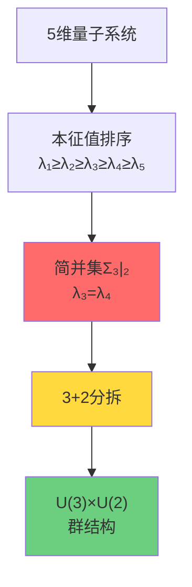
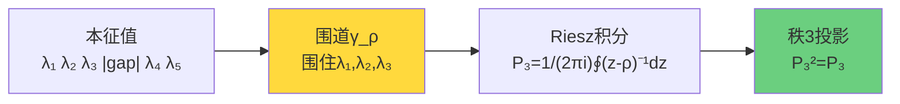
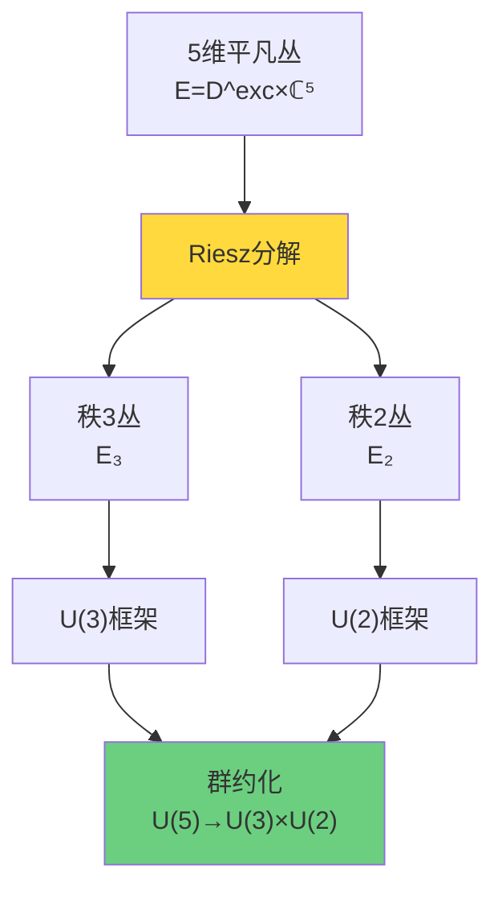
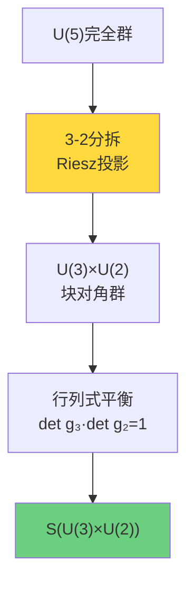
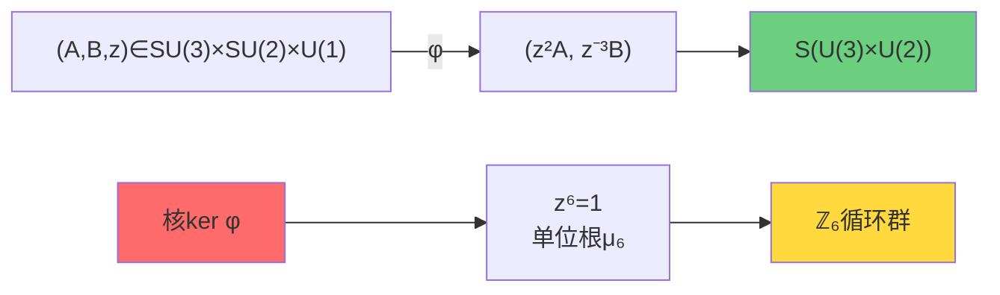
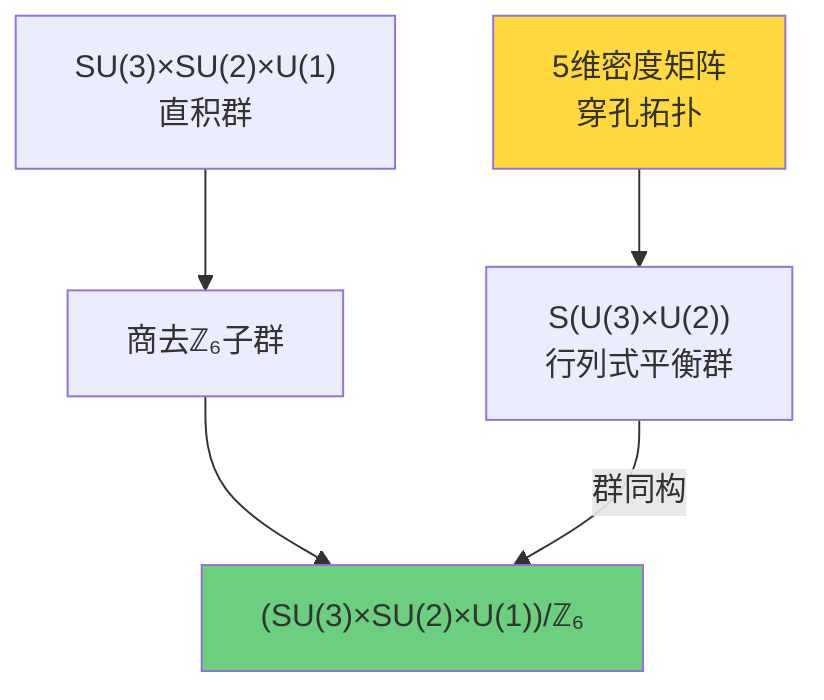
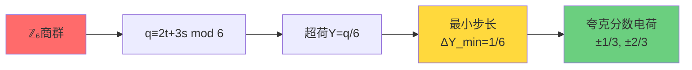
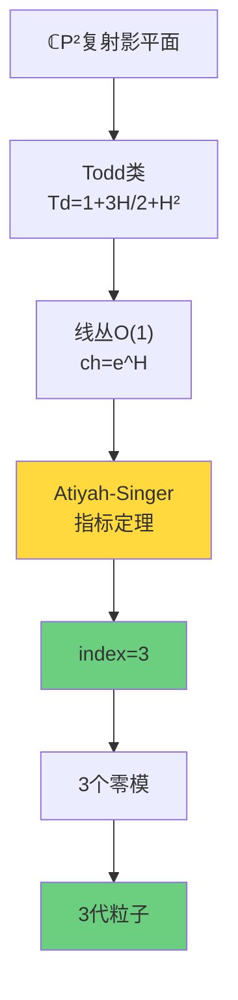
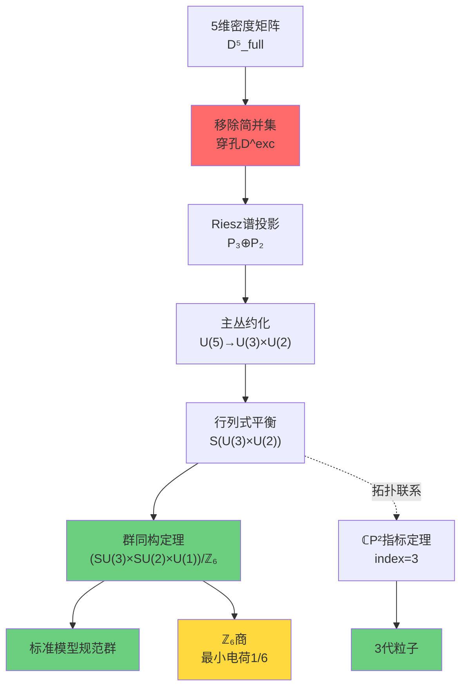

# S(U(3)×U(2))：标准模型群结构的拓扑起源

在前几节中，我们建立了拓扑约束的数学框架（相对上同调$[K]$）和物理判据（ℤ₂环量$\nu$）。现在我们来到最令人震撼的结论：

> **标准模型的规范群$(SU(3)\times SU(2)\times U(1))/\mathbb{Z}_6$不是偶然的选择，而是5维密度矩阵流形穿孔拓扑的必然结果。**

这一节将给出严格的推导。

## 从量子态到规范对称：5维密度矩阵的特殊性

### 为什么是5维？

宇宙中的基本粒子按代(generation)组织：
- 每代包含一对轻子和一对夸克
- 观测显示**恰好3代**
- 每代的量子数结构相似但质量不同

如果我们将"代"看作某种内部自由度的本征态，自然的问题是：**什么数学结构编码了3代？**

**关键洞察**：考虑**5维密度矩阵流形**$\mathcal{D}_5^{\mathrm{full}}$。

为什么是5而不是其他维数？因为5可以分拆为：
$$
5 = 3 + 2
$$

而且在满足特定约束下，**这是唯一的分拆**（见后文命题4.1）。

### 穿孔操作的物理动机

回顾第01节，满秩密度矩阵流形$\mathcal{D}_5^{\mathrm{full}}$是**可缩的**，因此没有非平凡的绝对拓扑不变量。

要获得拓扑约束，我们必须**穿孔**——移除简并集$\Sigma_{3|2} = \{\rho : \lambda_3 = \lambda_4\}$的管状邻域：
$$
\mathcal{D}^{\mathrm{exc}} = \{\rho \in \mathcal{D}_5^{\mathrm{full}} : \lambda_3 - \lambda_4 \geq 2\delta\}
$$

**物理解释**：
- 简并点$\lambda_3 = \lambda_4$对应"相变点"
- 在简并处，量子态的3-2分拆模糊
- 移除简并确保3-2分拆**全局良定**

## Riesz谱投影：从本征值到子空间

### 统一围道的构造

在穿孔域$\mathcal{D}^{\mathrm{exc}}$上，谱隙$g(\rho) = \lambda_3 - \lambda_4 \geq 2\delta > 0$确保我们可以构造**统一围道族**。

**引理（统一围道）**：
对任意紧致$K \subset \mathcal{D}^{\mathrm{exc}}$，存在$\delta > 0$和闭曲线族$\{\gamma_\rho\}$使得：
- 每个$\gamma_\rho$围住上3个本征值$\{\lambda_1, \lambda_2, \lambda_3\}$
- $\gamma_\rho$与余谱$\{\lambda_4, \lambda_5\}$的距离$\geq \delta$
- $\gamma_\rho$在$\rho$上$C^\infty$依赖

**构造**：
取$\gamma_\rho$为以$\bar{\lambda}_3 = (\lambda_2 + \lambda_3 + \lambda_4)/3$为心、半径$r = (\lambda_3 - \lambda_4)/3$的圆。

由于$\lambda_3 - \lambda_4 \geq 2\delta$，有$r \geq 2\delta/3$，确保$\gamma_\rho$与$\{\lambda_1, \lambda_2\}$和$\{\lambda_4, \lambda_5\}$都保持有限距离。

### Riesz谱投影的定义

**定义**：秩3和秩2的谱投影
$$
P_3(\rho) = \frac{1}{2\pi i} \oint_{\gamma_\rho} (z - \rho)^{-1} dz
$$
$$
P_2(\rho) = I - P_3(\rho)
$$

**性质**：
1. **幂等性**：$P_3^2 = P_3$，$P_2^2 = P_2$
2. **正交性**：$P_3 P_2 = 0$
3. **分解**：$I = P_3 + P_2$
4. **光滑性**：$P_3(\rho)$在$\mathcal{D}^{\mathrm{exc}}$上$C^\infty$

**物理意义**：
$P_3(\rho)$投影到"高能3个本征态"的子空间，$P_2(\rho)$投影到"低能2个本征态"的子空间。

这个3-2分拆在整个$\mathcal{D}^{\mathrm{exc}}$上**光滑且连续**，这是穿孔的关键作用！

### 秩3和秩2向量丛的诱导

Riesz投影诱导两个向量丛：
$$
\mathcal{E}_3 = \{(\rho, v) : \rho \in \mathcal{D}^{\mathrm{exc}},\ v \in \mathrm{Im}(P_3(\rho))\}
$$
$$
\mathcal{E}_2 = \{(\rho, v) : \rho \in \mathcal{D}^{\mathrm{exc}},\ v \in \mathrm{Im}(P_2(\rho))\}
$$

**丛的性质**：
- $\mathcal{E}_3$：秩3复向量丛
- $\mathcal{E}_2$：秩2复向量丛
- $\mathcal{E}_3 \oplus \mathcal{E}_2 \cong \underline{\mathbb{C}}^5$（平凡5维丛）

## 主丛约化：从U(5)到U(3)×U(2)

### Uhlmann主丛的结构

Uhlmann主丛定义为：
$$
P = \{w = \sqrt{\rho} U : \rho \in \mathcal{D}^{\mathrm{full}}_5,\ U \in U(5)\}
$$

投影映射：
$$
\pi: P \to \mathcal{D}^{\mathrm{full}}_5,\quad \pi(w) = w w^\dagger = \rho
$$

**群作用**：$U(5)$从右作用于$P$：
$$
w \cdot V = w V,\quad V \in U(5)
$$

**关键事实**：在满域$\mathcal{D}^{\mathrm{full}}_5$上，Uhlmann丛是**平凡的**（有全局截面$\sigma(\rho) = \sqrt{\rho}$）。

但在穿孔域$\mathcal{D}^{\mathrm{exc}}$上，Riesz投影诱导**非平凡的结构群约化**！

### 主丛约化定理

**定理4.1（主丛约化）**：
Riesz投影$P_3, P_2$诱导Uhlmann主丛的结构群约化：
$$
U(5) \to U(3) \times U(2)
$$

具体地，存在子丛$P_H \subset P$，其结构群为$U(3) \times U(2)$，且：
$$
P_H = \{w \in P : w P_3(\rho) = P_3(\rho) w,\ w P_2(\rho) = P_2(\rho) w\}
$$

**证明思路**：
1. 给定$\rho \in \mathcal{D}^{\mathrm{exc}}$，$P_3(\rho)$定义子空间$V_3 = \mathrm{Im}(P_3) \subset \mathbb{C}^5$
2. 类似地$P_2(\rho)$定义$V_2 = \mathrm{Im}(P_2)$
3. 分解$\mathbb{C}^5 = V_3 \oplus V_2$
4. 保持分解的幺正算符恰为$U(3) \times U(2)$的元素

**物理含义**：
在穿孔域上，量子态的演化**尊重3-2分拆**。这种尊重3-2分拆的对称性形成$U(3) \times U(2)$群。

### 行列式平衡：从U(3)×U(2)到S(U(3)×U(2))

背景5维空间有自然的**体积形式**（由标准度规诱导）。密度矩阵$\rho$满足$\mathrm{tr}\rho = 1$意味着**迹归一化**。

对分解$\mathbb{C}^5 = V_3 \oplus V_2$，体积形式分解为：
$$
\mathrm{vol}_5 = \mathrm{vol}_3 \wedge \mathrm{vol}_2
$$

**体积守恒条件**：
$$
\det P_3 \cdot \det P_2 = \det I = 1
$$

这强制行列式平衡：
$$
\det(g_3) \cdot \det(g_2) = 1,\quad (g_3, g_2) \in U(3) \times U(2)
$$

定义**特殊幺正群**：
$$
S(U(3) \times U(2)) = \{(g_3, g_2) \in U(3) \times U(2) : \det(g_3) \det(g_2) = 1\}
$$

这正是我们需要的结构群！

## 群同构定理：S(U(3)×U(2)) ≅ (SU(3)×SU(2)×U(1))/ℤ₆

现在来到最关键的部分：证明$S(U(3) \times U(2))$同构于标准模型规范群！

### 定理的精确陈述

**定理4.2（群同构）**：
令$m=3, n=2$，$g = \gcd(m,n) = 1$，$\ell = \mathrm{lcm}(m,n) = 6$。则存在群同构：
$$
S(U(3) \times U(2)) \cong \frac{SU(3) \times SU(2) \times U(1)}{\mathbb{Z}_6}
$$

### 同态的构造

定义映射：
$$
\varphi: SU(3) \times SU(2) \times U(1) \to S(U(3) \times U(2))
$$
$$
\varphi(A, B, z) = (\mathrm{diag}(z^{n/g} A),\ \mathrm{diag}(z^{-m/g} B))
$$

对$(m,n) = (3,2)$，$g=1$：
$$
\varphi(A, B, z) = (z^2 A,\ z^{-3} B)
$$

**验证同态性**：
$$
\varphi(A_1 A_2, B_1 B_2, z_1 z_2) = ((z_1 z_2)^2 A_1 A_2,\ (z_1 z_2)^{-3} B_1 B_2)
$$
$$
= (z_1^2 A_1,\ z_1^{-3} B_1) \cdot (z_2^2 A_2,\ z_2^{-3} B_2) = \varphi(A_1, B_1, z_1) \cdot \varphi(A_2, B_2, z_2)
$$

**验证行列式平衡**：
$$
\det(z^2 A) \cdot \det(z^{-3} B) = (z^2)^3 \det A \cdot (z^{-3})^2 \det B = z^6 \cdot 1 \cdot z^{-6} \cdot 1 = 1
$$

### 核的计算

**命题**：$\ker \varphi \cong \mathbb{Z}_6$

**证明**：
设$(A, B, z) \in \ker \varphi$，即：
$$
z^2 A = I_3,\quad z^{-3} B = I_2
$$

从第一式：$A = z^{-2} I_3$。由于$A \in SU(3)$，有$\det A = 1$：
$$
\det(z^{-2} I_3) = (z^{-2})^3 = z^{-6} = 1
$$

因此$z^6 = 1$，即$z \in \mu_6 = \{e^{2\pi i k/6} : k = 0,1,\ldots,5\}$（6次单位根）。

反代入第二式：$B = z^3 I_2$。检验$\det B = 1$：
$$
\det(z^3 I_2) = (z^3)^2 = z^6 = 1 \quad \checkmark
$$

因此$\ker \varphi = \{(z^{-2} I_3,\ z^3 I_2,\ z) : z^6 = 1\} \cong \mu_6 \cong \mathbb{Z}_6$。

**生成元**：
取$z_0 = e^{2\pi i/6} = e^{i\pi/3}$，则核的生成元为：
$$
(\omega_3^{-1} I_3,\ -I_2,\ z_0),\quad \omega_3 = e^{2\pi i/3}
$$

其中$\omega_3^{-1} = e^{-2\pi i/3} = z_0^{-2}$，$-1 = e^{i\pi} = z_0^3$。

### 满射性：选根的技巧

**命题**：$\varphi$是满射

这是证明中最巧妙的部分：给定$(g_3, g_2) \in S(U(3) \times U(2))$（即$\det g_3 \det g_2 = 1$），如何找到$(A, B, z)$使得$\varphi(A,B,z) = (g_3, g_2)$？

**关键步骤**："选根"

1. 设$\lambda = \det g_3 \in U(1)$
2. 由行列式平衡：$\det g_2 = \lambda^{-1}$
3. **选择**$z \in U(1)$使得：
   $$
   z^6 = \lambda
   $$
   （这总是可能的，因为$U(1) \cong \mathbb{R}/\mathbb{Z}$，任何元素都有6次方根）

4. 定义：
   $$
   A = z^{-2} g_3,\quad B = z^{3} g_2
   $$

5. **验证$A \in SU(3)$**：
   $$
   \det A = \det(z^{-2} g_3) = (z^{-2})^3 \det g_3 = z^{-6} \lambda = \lambda^{-1} \lambda = 1 \quad \checkmark
   $$

6. **验证$B \in SU(2)$**：
   $$
   \det B = \det(z^3 g_2) = (z^3)^2 \det g_2 = z^6 \lambda^{-1} = \lambda \lambda^{-1} = 1 \quad \checkmark
   $$

7. **验证$\varphi(A,B,z) = (g_3, g_2)$**：
   $$
   \varphi(A,B,z) = (z^2 A,\ z^{-3} B) = (z^2 z^{-2} g_3,\ z^{-3} z^3 g_2) = (g_3, g_2) \quad \checkmark
   $$

**结论**：$\varphi$是满射！

### 第一同构定理

由群论第一同构定理：
$$
\frac{SU(3) \times SU(2) \times U(1)}{\ker \varphi} \cong \mathrm{Im}\, \varphi = S(U(3) \times U(2))
$$

而$\ker \varphi \cong \mathbb{Z}_6$，因此：
$$
\boxed{S(U(3) \times U(2)) \cong \frac{SU(3) \times SU(2) \times U(1)}{\mathbb{Z}_6}}
$$

**这正是标准模型的规范群结构！**

## 5=3+2分拆的唯一性

**命题4.3（分拆唯一性）**：
在"简单因子恰为$SU(3), SU(2)$且仅保留一个$U(1)$"的约束下，$5 = 3+2$是**唯一可行的分拆**。

**证明**（排除其他分拆）：

| 分拆 | 简单部 | $S$-约束后$U(1)$个数 | 结论 |
|------|-------|---------------------|------|
| $4+1$ | $SU(4)$ | 1 | 无$SU(2)$因子 ❌ |
| $3+1+1$ | $SU(3)$ | 2 | 违反"一个$U(1)$" ❌ |
| $2+2+1$ | $SU(2) \times SU(2)$ | 2 | 违反"一个$U(1)$" ❌ |
| **$3+2$** | **$SU(3) \times SU(2)$** | **1** | **唯一满足** ✓ |

**物理结论**：
如果我们要求：
1. 规范群包含$SU(3)$（强相互作用）
2. 规范群包含$SU(2)$（弱相互作用）
3. 恰有一个$U(1)$（电磁+超荷）

那么**5维密度矩阵流形的3-2分拆是唯一选择**！

## ℤ₆商的物理意义

### 电荷量子化与最小电荷1/6

ℤ₆商群有深刻的物理后果。考虑核的生成元：
$$
g_* = (\omega_3^{-1} I_3,\ -I_2,\ e^{2\pi i/6})
$$

在标准模型中，这对应于triality、parity和超荷的组合变换。

**作用在表示上**：
对量子态$(t, s, q)$（分别为$SU(3)$ triality、$SU(2)$ parity、$U(1)$荷），$g_*$作用为：
$$
\omega_3^{-t} \cdot (-1)^s \cdot e^{2\pi i q/6}
$$

**降到商群的条件**：
要求$g_*$作用为恒等，即：
$$
\omega_3^{-t} (-1)^s e^{2\pi i q/6} = 1
$$

展开：
$$
e^{-2\pi i t/3} \cdot e^{i\pi s} \cdot e^{2\pi i q/6} = 1
$$

$$
q \equiv 2t + 3s \pmod{6}
$$

**超荷的量子化**：
定义归一化超荷$Y = q/6$，则：
$$
Y \equiv \frac{t}{3} + \frac{s}{2} \pmod{\mathbb{Z}}
$$

**最小分数步长**：
由上式，$Y$的最小非零变化为$\min(1/3, 1/2) = 1/3$的某个分数。

结合$q$的模6量子化，$Y$的最小步长为：
$$
\Delta Y_{\min} = \frac{1}{6}
$$

**夸克的分数电荷**：
这正解释了为什么夸克带有$\pm 1/3, \pm 2/3$的分数电荷！

电荷$Q$与超荷$Y$的关系：
$$
Q = I_3 + \frac{Y}{2}
$$

其中$I_3$是弱同位旋第三分量（取值$\pm 1/2, 0$）。

对上夸克：$I_3 = +1/2$，$Y = 1/3$ → $Q = +2/3$
对下夸克：$I_3 = -1/2$，$Y = 1/3$ → $Q = -1/3$

### Dirac电磁对偶与磁单极子

ℤ₆量子化还与Dirac电磁对偶条件相关。

Dirac条件要求电荷$e$与磁荷$g$满足：
$$
eg = 2\pi n,\quad n \in \mathbb{Z}
$$

如果最小电荷为$e_0 = e/6$（归一化单位），则：
$$
e_0 g = \frac{2\pi n}{6} = \frac{\pi n}{3}
$$

对$n=2$：$e_0 g = 2\pi/3$，恰好对应$\omega_3 = e^{2\pi i/3}$的相位！

这暗示ℤ₆拓扑与**磁单极子的存在性**相关。

## 三代粒子的拓扑起源

### ℂP²上的指标定理

考虑复射影平面$\mathbb{CP}^2$，它是一个紧致复曲面（实维数4）。

在$\mathbb{CP}^2$上，取线丛$\mathcal{O}(1)$（超平面丛），定义$\mathrm{spin}^c$ Dirac算符：
$$
\not{D}^{\mathcal{O}(1)}: \Gamma(\mathbb{CP}^2, S \otimes \mathcal{O}(1)) \to \Gamma(\mathbb{CP}^2, S \otimes \mathcal{O}(1))
$$

**Atiyah-Singer指标定理**：
$$
\mathrm{index}(\not{D}^{\mathcal{O}(1)}) = \int_{\mathbb{CP}^2} \mathrm{Td}(T\mathbb{CP}^2) \wedge \mathrm{ch}(\mathcal{O}(1))
$$

**计算**：

Todd类：
$$
\mathrm{Td}(T\mathbb{CP}^2) = 1 + \frac{3}{2} H + H^2
$$

Chern特征：
$$
\mathrm{ch}(\mathcal{O}(1)) = e^H = 1 + H + \frac{H^2}{2}
$$

其中$H = c_1(\mathcal{O}(1))$，$\int_{\mathbb{CP}^2} H^2 = 1$。

顶维系数：
$$
1 + \frac{3}{2} + \frac{1}{2} = 3
$$

因此：
$$
\boxed{\mathrm{index}(\not{D}^{\mathcal{O}(1)}) = 3}
$$

**物理解释**：
这个指标3正好对应**零模的个数**。在Dolbeault复形中，$h^0 = 3$而$h^1 = 0$（由Kodaira消失定理）。

### 零模与粒子代

**深刻联系**：
- $\mathbb{CP}^2$的零模数3 ←→ 粒子的3代
- $\mathcal{O}(1)$线丛 ←→ 超荷$Y$的量子化
- $\mathrm{spin}^c$结构 ←→ 费米子的自旋

**拓扑不可避免性**：
由于$\mathbb{CP}^2$的Euler示性数$\chi = 3$，零模数**至少**为3。这是拓扑的硬约束！

### 穿孔5维流形与ℂP²的联系

更深的数学联系：5维密度矩阵流形的某个商空间同胚于$\mathbb{CP}^4$的子流形，而3-2分拆诱导的纤维化与$\mathbb{CP}^2$相关。

具体地，Grassmannian $\mathrm{Gr}_3(\mathbb{C}^5)$（5维空间中3维子空间的参数空间）可嵌入$\mathbb{CP}^9$，而其某个截面同构于$\mathbb{CP}^2$。

这个拓扑联系暗示：
> **3代不是巧合，而是5维穿孔流形的3-2分拆在$\mathbb{CP}^2$上的投影，其零模数由Euler示性数$\chi = 3$刚性固定。**

## 小结：从拓扑到标准模型的完整链条

我们已经建立了一条严格的推导链：

**核心洞察**：

1. **5维的必然性**：要同时包含$SU(3), SU(2)$和一个$U(1)$，5=3+2是唯一分拆
2. **穿孔的必然性**：满域可缩无拓扑约束，必须移除简并集
3. **群结构的必然性**：Riesz投影诱导$U(3) \times U(2)$约化，行列式平衡给出$S$-群
4. **ℤ₆商的必然性**：群同构定理强制核$\cong \mathbb{Z}_6$
5. **分数电荷的必然性**：ℤ₆量子化给出最小电荷步长1/6
6. **3代的必然性**：$\mathbb{CP}^2$的Euler示性数$\chi = 3$刚性固定零模数

## 下一步：因果版Gauss-Bonnet定理

标准模型群结构展示了拓扑约束的"代数"一面——群论同构。

下一节将展示拓扑约束的"几何"一面——Euler示性数与曲率的关系。我们将看到，在因果结构框架下，经典的Gauss-Bonnet定理获得全新的物理诠释：

> **曲率不是外加的几何量，而是因果约束的冗余密度。**

这将完成拓扑约束的几何-代数统一图景。
