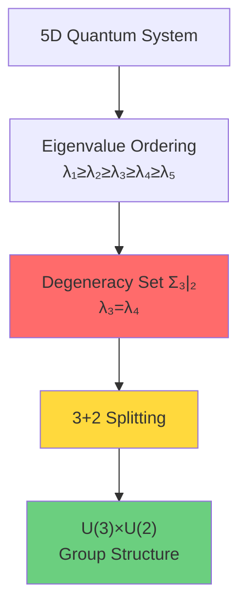
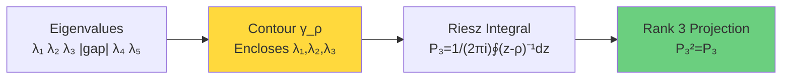
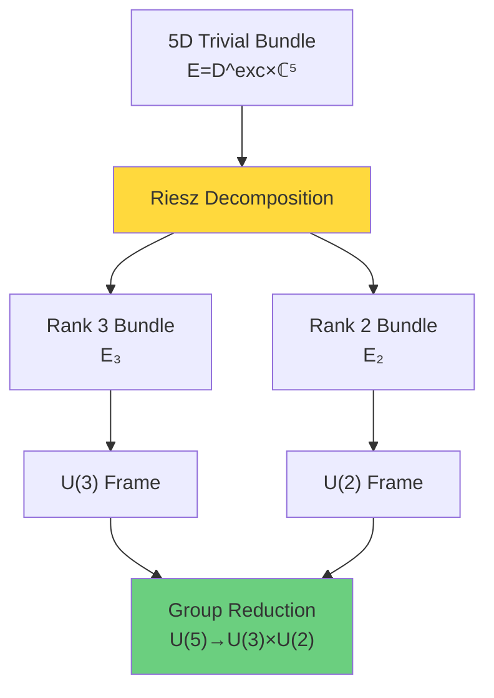
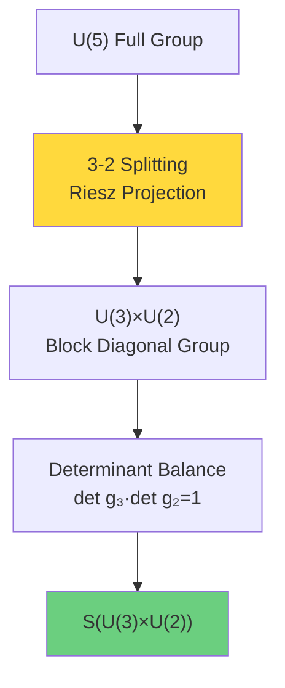
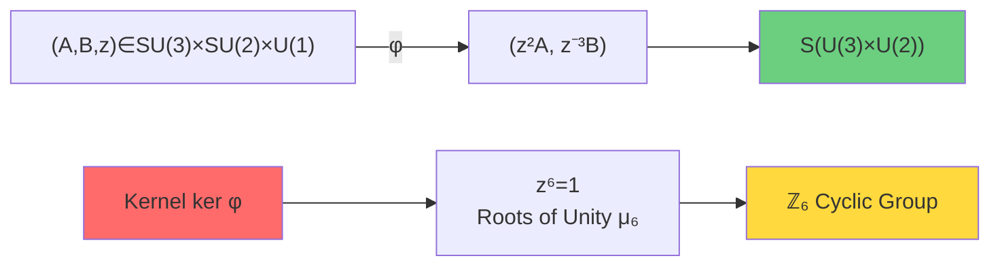
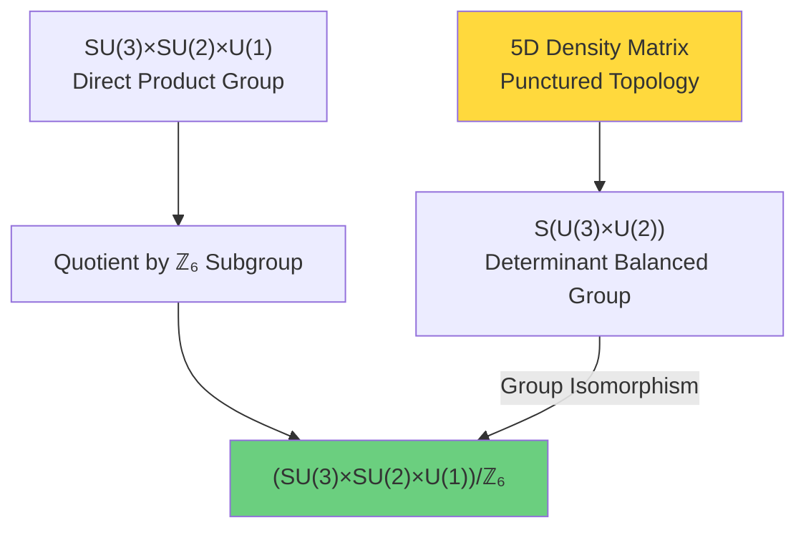
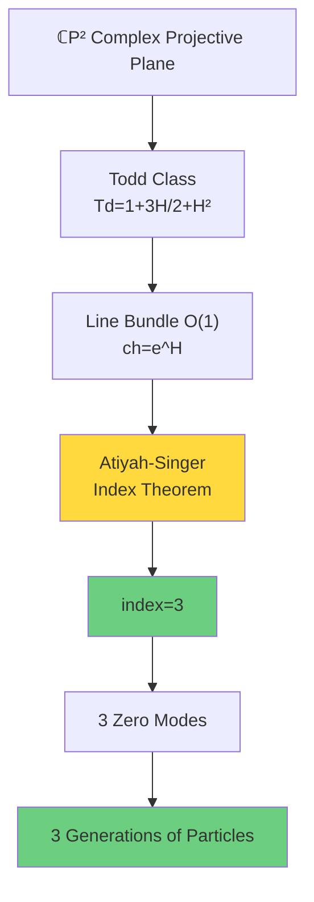
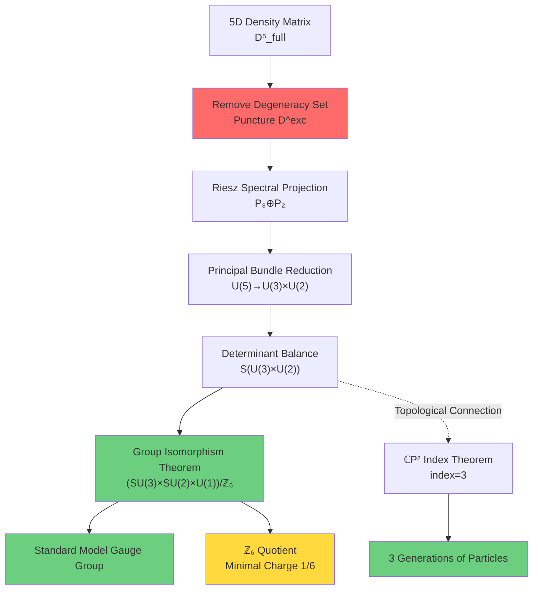

# S(U(3)×U(2)): Topological Origin of Standard Model Group Structure

In previous sections, we established mathematical framework of topological constraints (relative cohomology $[K]$) and physical criterion (ℤ₂ holonomy $\nu$). Now we arrive at most stunning conclusion:

> **Gauge group of Standard Model $(SU(3)\times SU(2)\times U(1))/\mathbb{Z}_6$ is not accidental choice, but inevitable result of punctured topology of 5D density matrix manifold.**

This section will give rigorous derivation.

## From Quantum States to Gauge Symmetry: Special Nature of 5D Density Matrix

### Why 5 Dimensions?

Fundamental particles in universe are organized by generation:
- Each generation contains one pair of leptons and one pair of quarks
- Observations show **exactly 3 generations**
- Quantum number structure of each generation similar but masses different

If we view "generation" as eigenstates of some internal degree of freedom, natural question is: **What mathematical structure encodes 3 generations?**

**Key Insight**: Consider **5D density matrix manifold** $\mathcal{D}_5^{\mathrm{full}}$.

Why 5 instead of other dimensions? Because 5 can be split as:
$$5 = 3 + 2$$

And under certain constraints, **this is unique splitting** (see Proposition 4.1 below).

### Physical Motivation for Puncturing

Recall Section 01, full-rank density matrix manifold $\mathcal{D}_5^{\mathrm{full}}$ is **contractible**, therefore has no non-trivial absolute topological invariants.

To obtain topological constraints, we must **puncture**—remove tubular neighborhood of degeneracy set $\Sigma_{3|2} = \{\rho : \lambda_3 = \lambda_4\}$:
$$\mathcal{D}^{\mathrm{exc}} = \{\rho \in \mathcal{D}_5^{\mathrm{full}} : \lambda_3 - \lambda_4 \geq 2\delta\}$$

**Physical Interpretation**:
- Degeneracy point $\lambda_3 = \lambda_4$ corresponds to "phase transition point"
- At degeneracy, 3-2 splitting of quantum state is ambiguous
- Removing degeneracy ensures 3-2 splitting is **globally well-defined**

## Riesz Spectral Projection: From Eigenvalues to Subspaces

### Construction of Unified Contour

On punctured domain $\mathcal{D}^{\mathrm{exc}}$, spectral gap $g(\rho) = \lambda_3 - \lambda_4 \geq 2\delta > 0$ ensures we can construct **unified contour family**.

**Lemma (Unified Contour)**:
For any compact $K \subset \mathcal{D}^{\mathrm{exc}}$, there exists $\delta > 0$ and family of closed curves $\{\gamma_\rho\}$ such that:
- Each $\gamma_\rho$ encloses upper 3 eigenvalues $\{\lambda_1, \lambda_2, \lambda_3\}$
- Distance of $\gamma_\rho$ from co-spectrum $\{\lambda_4, \lambda_5\}$ $\geq \delta$
- $\gamma_\rho$ depends $C^\infty$ on $\rho$

**Construction**:
Take $\gamma_\rho$ as circle centered at $\bar{\lambda}_3 = (\lambda_2 + \lambda_3 + \lambda_4)/3$ with radius $r = (\lambda_3 - \lambda_4)/3$.

Since $\lambda_3 - \lambda_4 \geq 2\delta$, we have $r \geq 2\delta/3$, ensuring $\gamma_\rho$ maintains finite distance from both $\{\lambda_1, \lambda_2\}$ and $\{\lambda_4, \lambda_5\}$.

### Definition of Riesz Spectral Projection

**Definition**: Spectral projections of rank 3 and rank 2
$$P_3(\rho) = \frac{1}{2\pi i} \oint_{\gamma_\rho} (z - \rho)^{-1} dz$$
$$P_2(\rho) = I - P_3(\rho)$$

**Properties**:
1. **Idempotency**: $P_3^2 = P_3$, $P_2^2 = P_2$
2. **Orthogonality**: $P_3 P_2 = 0$
3. **Decomposition**: $I = P_3 + P_2$
4. **Smoothness**: $P_3(\rho)$ is $C^\infty$ on $\mathcal{D}^{\mathrm{exc}}$

**Physical Meaning**:
$P_3(\rho)$ projects onto subspace of "upper 3 eigenstates", $P_2(\rho)$ projects onto subspace of "lower 2 eigenstates".

This 3-2 splitting is **smooth and continuous** throughout $\mathcal{D}^{\mathrm{exc}}$, this is key role of puncturing!

### Induced Rank 3 and Rank 2 Vector Bundles

Riesz projection induces two vector bundles:
$$\mathcal{E}_3 = \{(\rho, v) : \rho \in \mathcal{D}^{\mathrm{exc}},\ v \in \mathrm{Im}(P_3(\rho))\}$$
$$\mathcal{E}_2 = \{(\rho, v) : \rho \in \mathcal{D}^{\mathrm{exc}},\ v \in \mathrm{Im}(P_2(\rho))\}$$

**Bundle Properties**:
- $\mathcal{E}_3$: Rank 3 complex vector bundle
- $\mathcal{E}_2$: Rank 2 complex vector bundle
- $\mathcal{E}_3 \oplus \mathcal{E}_2 \cong \underline{\mathbb{C}}^5$ (trivial 5D bundle)

## Principal Bundle Reduction: From U(5) to U(3)×U(2)

### Structure of Uhlmann Principal Bundle

Uhlmann principal bundle is defined as:
$$P = \{w = \sqrt{\rho} U : \rho \in \mathcal{D}^{\mathrm{full}}_5,\ U \in U(5)\}$$

Projection map:
$$\pi: P \to \mathcal{D}^{\mathrm{full}}_5,\quad \pi(w) = w w^\dagger = \rho$$

**Group Action**: $U(5)$ acts on $P$ from right:
$$w \cdot V = w V,\quad V \in U(5)$$

**Key Fact**: On full domain $\mathcal{D}^{\mathrm{full}}_5$, Uhlmann bundle is **trivial** (has global section $\sigma(\rho) = \sqrt{\rho}$).

But on punctured domain $\mathcal{D}^{\mathrm{exc}}$, Riesz projection induces **non-trivial structure group reduction**!

### Principal Bundle Reduction Theorem

**Theorem 4.1 (Principal Bundle Reduction)**:
Riesz projections $P_3, P_2$ induce structure group reduction of Uhlmann principal bundle:
$$U(5) \to U(3) \times U(2)$$

Specifically, there exists subbundle $P_H \subset P$ with structure group $U(3) \times U(2)$, and:
$$P_H = \{w \in P : w P_3(\rho) = P_3(\rho) w,\ w P_2(\rho) = P_2(\rho) w\}$$

**Proof Idea**:
1. Given $\rho \in \mathcal{D}^{\mathrm{exc}}$, $P_3(\rho)$ defines subspace $V_3 = \mathrm{Im}(P_3) \subset \mathbb{C}^5$
2. Similarly $P_2(\rho)$ defines $V_2 = \mathrm{Im}(P_2)$
3. Decomposition $\mathbb{C}^5 = V_3 \oplus V_2$
4. Unitary operators preserving decomposition are exactly elements of $U(3) \times U(2)$

**Physical Meaning**:
On punctured domain, evolution of quantum states **respects 3-2 splitting**. Symmetry respecting 3-2 splitting forms $U(3) \times U(2)$ group.

### Determinant Balance: From U(3)×U(2) to S(U(3)×U(2))

Background 5D space has natural **volume form** (induced by standard metric). Density matrix $\rho$ satisfying $\mathrm{tr}\rho = 1$ means **trace normalization**.

For decomposition $\mathbb{C}^5 = V_3 \oplus V_2$, volume form decomposes as:
$$\mathrm{vol}_5 = \mathrm{vol}_3 \wedge \mathrm{vol}_2$$

**Volume Conservation Condition**:
$$|\det P_3 \cdot \det P_2 = \det I = 1$$

This forces determinant balance:
$$\det(g_3) \cdot \det(g_2) = 1,\quad (g_3, g_2) \in U(3) \times U(2)$$

Define **special unitary group**:
$$S(U(3) \times U(2)) = \{(g_3, g_2) \in U(3) \times U(2) : \det(g_3) \det(g_2) = 1\}$$

This is exactly structure group we need!

## Group Isomorphism Theorem: S(U(3)×U(2)) ≅ (SU(3)×SU(2)×U(1))/ℤ₆

Now we come to most crucial part: proving $S(U(3) \times U(2))$ is isomorphic to Standard Model gauge group!

### Precise Statement of Theorem

**Theorem 4.2 (Group Isomorphism)**:
Let $m=3, n=2$, $g = \gcd(m,n) = 1$, $\ell = \mathrm{lcm}(m,n) = 6$. Then there exists group isomorphism:
$$S(U(3) \times U(2)) \cong \frac{SU(3) \times SU(2) \times U(1)}{\mathbb{Z}_6}$$

### Construction of Homomorphism

Define map:
$$\varphi: SU(3) \times SU(2) \times U(1) \to S(U(3) \times U(2))$$
$$\varphi(A, B, z) = (\mathrm{diag}(z^{n/g} A),\ \mathrm{diag}(z^{-m/g} B))$$

For $(m,n) = (3,2)$, $g=1$:
$$\varphi(A, B, z) = (z^2 A,\ z^{-3} B)$$

**Verify Homomorphism Property**:
$$\varphi(A_1 A_2, B_1 B_2, z_1 z_2) = ((z_1 z_2)^2 A_1 A_2,\ (z_1 z_2)^{-3} B_1 B_2)$$
$$= (z_1^2 A_1,\ z_1^{-3} B_1) \cdot (z_2^2 A_2,\ z_2^{-3} B_2) = \varphi(A_1, B_1, z_1) \cdot \varphi(A_2, B_2, z_2)$$

**Verify Determinant Balance**:
$$\det(z^2 A) \cdot \det(z^{-3} B) = (z^2)^3 \det A \cdot (z^{-3})^2 \det B = z^6 \cdot 1 \cdot z^{-6} \cdot 1 = 1$$

### Calculation of Kernel

**Proposition**: $\ker \varphi \cong \mathbb{Z}_6$

**Proof**:
Let $(A, B, z) \in \ker \varphi$, i.e.:
$$z^2 A = I_3,\quad z^{-3} B = I_2$$

From first equation: $A = z^{-2} I_3$. Since $A \in SU(3)$, we have $\det A = 1$:
$$\det(z^{-2} I_3) = (z^{-2})^3 = z^{-6} = 1$$

Therefore $z^6 = 1$, i.e. $z \in \mu_6 = \{e^{2\pi i k/6} : k = 0,1,\ldots,5\}$ (6th roots of unity).

Substitute back into second equation: $B = z^3 I_2$. Check $\det B = 1$:
$$\det(z^3 I_2) = (z^3)^2 = z^6 = 1 \quad \checkmark$$

Therefore $\ker \varphi = \{(z^{-2} I_3,\ z^3 I_2,\ z) : z^6 = 1\} \cong \mu_6 \cong \mathbb{Z}_6$.

**Generator**:
Take $z_0 = e^{2\pi i/6} = e^{i\pi/3}$, then generator of kernel is:
$$(\omega_3^{-1} I_3,\ -I_2,\ z_0),\quad \omega_3 = e^{2\pi i/3}$$

where $\omega_3^{-1} = e^{-2\pi i/3} = z_0^{-2}$, $-1 = e^{i\pi} = z_0^3$.

### Surjectivity: Root Selection Trick

**Proposition**: $\varphi$ is surjective

This is most clever part of proof: Given $(g_3, g_2) \in S(U(3) \times U(2))$ (i.e. $\det g_3 \det g_2 = 1$), how to find $(A, B, z)$ such that $\varphi(A,B,z) = (g_3, g_2)$?

**Key Step**: "Root Selection"

1. Let $\lambda = \det g_3 \in U(1)$
2. By determinant balance: $\det g_2 = \lambda^{-1}$
3. **Choose** $z \in U(1)$ such that:
   $$z^6 = \lambda$$
   (This is always possible, since $U(1) \cong \mathbb{R}/\mathbb{Z}$, any element has 6th root)

4. Define:
   $$A = z^{-2} g_3,\quad B = z^{3} g_2$$

5. **Verify $A \in SU(3)$**:
   $$\det A = \det(z^{-2} g_3) = (z^{-2})^3 \det g_3 = z^{-6} \lambda = \lambda^{-1} \lambda = 1 \quad \checkmark$$

6. **Verify $B \in SU(2)$**:
   $$\det B = \det(z^3 g_2) = (z^3)^2 \det g_2 = z^6 \lambda^{-1} = \lambda \lambda^{-1} = 1 \quad \checkmark$$

7. **Verify $\varphi(A,B,z) = (g_3, g_2)$**:
   $$\varphi(A,B,z) = (z^2 A,\ z^{-3} B) = (z^2 z^{-2} g_3,\ z^{-3} z^3 g_2) = (g_3, g_2) \quad \checkmark$$

**Conclusion**: $\varphi$ is surjective!

### First Isomorphism Theorem

By group theory first isomorphism theorem:
$$\frac{SU(3) \times SU(2) \times U(1)}{\ker \varphi} \cong \mathrm{Im}\, \varphi = S(U(3) \times U(2))$$

And $\ker \varphi \cong \mathbb{Z}_6$, therefore:
$$\boxed{S(U(3) \times U(2)) \cong \frac{SU(3) \times SU(2) \times U(1)}{\mathbb{Z}_6}}$$

**This is exactly gauge group structure of Standard Model!**

## Uniqueness of 5=3+2 Splitting

**Proposition 4.3 (Splitting Uniqueness)**:
Under constraint "simple factors exactly $SU(3), SU(2)$ and only one $U(1)$ retained", $5 = 3+2$ is **unique feasible splitting**.

**Proof** (exclude other splittings):

| Splitting | Simple Part | Number of $U(1)$ After $S$-Constraint | Conclusion |
|-----------|-------------|--------------------------------------|------------|
| $4+1$ | $SU(4)$ | 1 | No $SU(2)$ factor ❌ |
| $3+1+1$ | $SU(3)$ | 2 | Violates "one $U(1)$" ❌ |
| $2+2+1$ | $SU(2) \times SU(2)$ | 2 | Violates "one $U(1)$" ❌ |
| **$3+2$** | **$SU(3) \times SU(2)$** | **1** | **Only Satisfies** ✓ |

**Physical Conclusion**:
If we require:
1. Gauge group contains $SU(3)$ (strong interaction)
2. Gauge group contains $SU(2)$ (weak interaction)
3. Exactly one $U(1)$ (electromagnetic + hypercharge)

then **3-2 splitting of 5D density matrix manifold is unique choice**!

## Physical Meaning of ℤ₆ Quotient

### Charge Quantization and Minimal Charge 1/6

ℤ₆ quotient group has profound physical consequences. Consider generator of kernel:
$$g_* = (\omega_3^{-1} I_3,\ -I_2,\ e^{2\pi i/6})$$

In Standard Model, this corresponds to combination of triality, parity, and hypercharge transformations.

**Action on Representations**:
For quantum state $(t, s, q)$ (respectively $SU(3)$ triality, $SU(2)$ parity, $U(1)$ charge), $g_*$ acts as:
$$\omega_3^{-t} \cdot (-1)^s \cdot e^{2\pi i q/6}$$

**Condition for Descending to Quotient Group**:
Require $g_*$ acts as identity, i.e.:
$$\omega_3^{-t} (-1)^s e^{2\pi i q/6} = 1$$

Expanding:
$$e^{-2\pi i t/3} \cdot e^{i\pi s} \cdot e^{2\pi i q/6} = 1$$

$$q \equiv 2t + 3s \pmod{6}$$

**Quantization of Hypercharge**:
Define normalized hypercharge $Y = q/6$, then:
$$Y \equiv \frac{t}{3} + \frac{s}{2} \pmod{\mathbb{Z}}$$

**Minimal Fractional Step**:
From above, minimal non-zero change of $Y$ is some fraction of $\min(1/3, 1/2) = 1/3$.

Combined with mod 6 quantization of $q$, minimal step of $Y$ is:
$$\Delta Y_{\min} = \frac{1}{6}$$

**Fractional Charges of Quarks**:
This exactly explains why quarks carry fractional charges $\pm 1/3, \pm 2/3$!

Relationship between charge $Q$ and hypercharge $Y$:
$$Q = I_3 + \frac{Y}{2}$$

where $I_3$ is third component of weak isospin (takes values $\pm 1/2, 0$).

For up quark: $I_3 = +1/2$, $Y = 1/3$ → $Q = +2/3$
For down quark: $I_3 = -1/2$, $Y = 1/3$ → $Q = -1/3$

### Dirac Electromagnetic Duality and Magnetic Monopoles

ℤ₆ quantization also relates to Dirac electromagnetic duality condition.

Dirac condition requires charge $e$ and magnetic charge $g$ satisfy:
$$eg = 2\pi n,\quad n \in \mathbb{Z}$$

If minimal charge is $e_0 = e/6$ (normalized unit), then:
$$e_0 g = \frac{2\pi n}{6} = \frac{\pi n}{3}$$

For $n=2$: $e_0 g = 2\pi/3$, exactly corresponds to phase of $\omega_3 = e^{2\pi i/3}$!

This suggests ℤ₆ topology relates to **existence of magnetic monopoles**.

## Topological Origin of Three Generations

### Index Theorem on ℂP²

Consider complex projective plane $\mathbb{CP}^2$, it is a compact complex surface (real dimension 4).

On $\mathbb{CP}^2$, take line bundle $\mathcal{O}(1)$ (hyperplane bundle), define $\mathrm{spin}^c$ Dirac operator:
$$|\not{D}^{\mathcal{O}(1)}: \Gamma(\mathbb{CP}^2, S \otimes \mathcal{O}(1)) \to \Gamma(\mathbb{CP}^2, S \otimes \mathcal{O}(1))$$

**Atiyah-Singer Index Theorem**:
$$\mathrm{index}(\not{D}^{\mathcal{O}(1)}) = \int_{\mathbb{CP}^2} \mathrm{Td}(T\mathbb{CP}^2) \wedge \mathrm{ch}(\mathcal{O}(1))$$

**Calculation**:

Todd class:
$$\mathrm{Td}(T\mathbb{CP}^2) = 1 + \frac{3}{2} H + H^2$$

Chern character:
$$\mathrm{ch}(\mathcal{O}(1)) = e^H = 1 + H + \frac{H^2}{2}$$

where $H = c_1(\mathcal{O}(1))$, $\int_{\mathbb{CP}^2} H^2 = 1$.

Top degree coefficient:
$$1 + \frac{3}{2} + \frac{1}{2} = 3$$

Therefore:
$$\boxed{\mathrm{index}(\not{D}^{\mathcal{O}(1)}) = 3}$$

**Physical Interpretation**:
This index 3 exactly corresponds to **number of zero modes**. In Dolbeault complex, $h^0 = 3$ and $h^1 = 0$ (by Kodaira vanishing theorem).

### Zero Modes and Particle Generations

**Profound Connection**:
- Number of zero modes on $\mathbb{CP}^2$ is 3 ←→ 3 generations of particles
- Line bundle $\mathcal{O}(1)$ ←→ Quantization of hypercharge $Y$
- $\mathrm{spin}^c$ structure ←→ Spin of fermions

**Topological Inevitability**:
Since Euler characteristic of $\mathbb{CP}^2$ is $\chi = 3$, number of zero modes is **at least** 3. This is hard topological constraint!

### Connection Between Punctured 5D Manifold and ℂP²

Deeper mathematical connection: Some quotient space of 5D density matrix manifold is homeomorphic to submanifold of $\mathbb{CP}^4$, and fibration induced by 3-2 splitting relates to $\mathbb{CP}^2$.

Specifically, Grassmannian $\mathrm{Gr}_3(\mathbb{C}^5)$ (parameter space of 3D subspaces in 5D space) can be embedded in $\mathbb{CP}^9$, and some section is isomorphic to $\mathbb{CP}^2$.

This topological connection suggests:
> **3 generations is not coincidence, but projection of 3-2 splitting of punctured 5D manifold onto $\mathbb{CP}^2$, whose number of zero modes is rigidly fixed by Euler characteristic $\chi = 3$.**

## Summary: Complete Chain from Topology to Standard Model

We have established a rigorous derivation chain:

**Core Insights**:

1. **Necessity of 5D**: To simultaneously contain $SU(3), SU(2)$ and one $U(1)$, 5=3+2 is unique splitting
2. **Necessity of Puncturing**: Full domain contractible has no topological constraints, must remove degeneracy set
3. **Necessity of Group Structure**: Riesz projection induces $U(3) \times U(2)$ reduction, determinant balance gives $S$-group
4. **Necessity of ℤ₆ Quotient**: Group isomorphism theorem forces kernel $\cong \mathbb{Z}_6$
5. **Necessity of Fractional Charges**: ℤ₆ quantization gives minimal charge step 1/6
6. **Necessity of 3 Generations**: Euler characteristic of $\mathbb{CP}^2$ $\chi = 3$ rigidly fixes number of zero modes

## Next Step: Causal Version of Gauss-Bonnet Theorem

Standard Model group structure shows "algebraic" side of topological constraints—group isomorphism.

Next section will show "geometric" side of topological constraints—relationship between Euler characteristic and curvature. We will see that under causal structure framework, classical Gauss-Bonnet theorem acquires new physical interpretation:

> **Curvature is not externally added geometric quantity, but redundancy density of causal constraints.**

This will complete geometric-algebraic unified picture of topological constraints.

