# 因果版Gauss-Bonnet：曲率作为因果约束的冗余密度

在上一节中，我们看到拓扑约束如何从代数层面导出标准模型群结构。现在我们转向拓扑约束的**几何层面**——经典Gauss-Bonnet定理的因果重构。

这一节将揭示一个深刻的事实：

> **曲率不是外加的几何量，而是因果约束无法全局兼容时的"冗余密度"。**

## 经典Gauss-Bonnet定理：拓扑与几何的桥梁

### 二维曲面上的Gauss-Bonnet定理

经典Gauss-Bonnet定理是微分几何中最美丽的结果之一。对于紧致的二维可定向曲面$M$（无边界），它建立了**局域几何**（曲率）与**全局拓扑**（Euler示性数）的精确关系：

$$
\int_M K \, dA = 2\pi \chi(M)
$$

这里：
- **左边**：$K$是Gauss曲率，$dA$是面积元
  - 曲率是**局域几何量**，逐点定义
  - 积分遍历整个曲面

- **右边**：$\chi(M)$是Euler示性数，$\chi(M) = V - E + F$
  - $V$是顶点数，$E$是边数，$F$是面数
  - 这是**拓扑不变量**，与度规无关

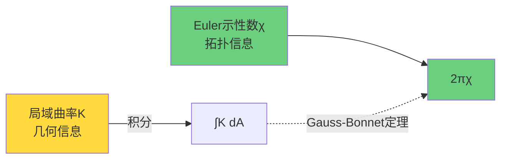

### 具体例子

**球面** $S^2$：
- 拓扑：$\chi(S^2) = 2$
- 几何：半径$R$的球面，$K = 1/R^2$（处处正曲率）
- 验证：$\int_{S^2} K \, dA = \frac{1}{R^2} \cdot 4\pi R^2 = 4\pi = 2\pi \cdot 2$ ✓

**环面** $T^2$：
- 拓扑：$\chi(T^2) = 0$
- 几何：可以构造平坦环面（$K=0$处处）
- 验证：$\int_{T^2} 0 \, dA = 0 = 2\pi \cdot 0$ ✓

**亏格$g$曲面**：
- 拓扑：$\chi(M_g) = 2 - 2g$（$g$个洞）
- $g=0$（球面）→ $\chi = 2$
- $g=1$（环面）→ $\chi = 0$
- $g=2$（二洞面）→ $\chi = -2$

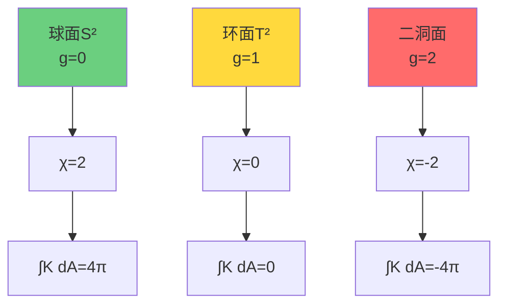

### Gauss-Bonnet定理的深刻性

这个定理之所以深刻，是因为：

1. **左边**（曲率积分）**似乎依赖**于如何在曲面上放置度规
   - 不同的度规给出不同的曲率分布
   - 例如：球面可以拉伸变形，局部曲率会变化

2. **右边**（Euler示性数）**完全独立**于度规
   - 只依赖于曲面的拓扑类型
   - 是一个**拓扑不变量**

3. **两者相等**意味着：
   - 曲率的总量（积分）被拓扑刚性固定
   - 无论如何变形度规，曲率总会"重新分配"以保持积分不变

**物理类比**：就像电荷守恒——你可以移动电荷，但总电量不变。这里，你可以移动曲率（改变度规），但总曲率（拓扑电荷）不变！

## 高维推广：Chern-Gauss-Bonnet定理

### 四维时空的情形

在四维流形$M$上，Gauss-Bonnet定理推广为：

$$
\int_M \left( R_{abcd}R^{abcd} - 4R_{ab}R^{ab} + R^2 \right) \sqrt{|g|} \, d^4x = 32\pi^2 \chi(M)
$$

这里：
- 左边是**Euler密度**（由Riemann曲率张量构成）
- 右边仍然是Euler示性数$\chi(M)$

对四维流形：
$$
\chi(M) = \sum_{k=0}^{4} (-1)^k b_k
$$
其中$b_k$是第$k$个Betti数（$k$维同调群的秩）。

### 拓扑示性数的意义

Euler示性数$\chi(M)$编码了流形的**全局拓扑形状**：
- $\chi > 0$：正曲率占主导（如球面）
- $\chi = 0$：曲率"平均"为零（如环面、平坦时空）
- $\chi < 0$：负曲率占主导（如双曲面）

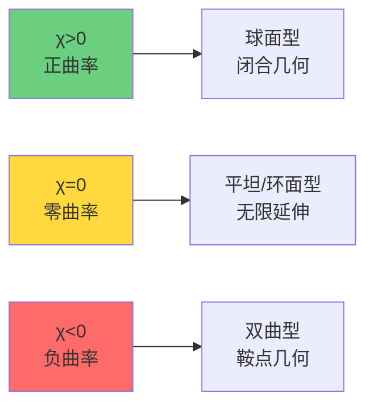

## 因果结构的视角：从偏序到拓扑

### 因果结构是什么？

在相对论中，**因果结构**编码了"哪些事件能影响哪些事件"：
- 对事件$p, q \in M$，如果$q$在$p$的因果未来中，记为$p \leq q$
- 这个关系$\leq$是一个**偏序**：自反、传递、反对称

**关键洞察**（Malament、Hawking等）：
> 在强因果时空中，因果偏序$\leq$几乎唯一确定了度规的共形类！

换句话说：
- **知道了因果关系** → 知道了光锥结构 → 知道了度规（差一个整体缩放）

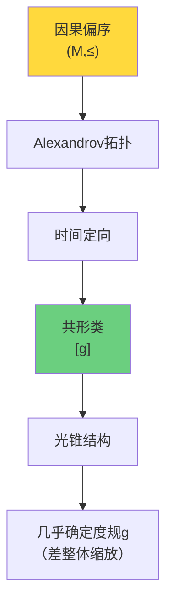

### Alexandrov拓扑

从因果偏序可以**重构拓扑**！

**定义**：对$p \ll q$（$q$在$p$的严格因果未来），定义**因果钻石**：
$$
A(p,q) = I^+(p) \cap I^-(q)
$$
（$p$的未来与$q$的过去的交集）

**Alexandrov拓扑**：以所有因果钻石$\{A(p,q)\}$为基的拓扑。

**定理**：在强因果时空中，Alexandrov拓扑 = 流形原有拓扑。

**物理意义**：
> 拓扑结构（哪些集合是"开的"）完全由因果可达性决定！

### 从拓扑到示性数

既然因果结构决定拓扑，而拓扑决定Euler示性数，那么：

$$
\text{因果结构} \Rightarrow \text{拓扑} \Rightarrow \chi(M)
$$

**问题**：如何从因果偏序**直接计算**$\chi(M)$，而不经过度规？

这就是**因果版Gauss-Bonnet定理**的目标！

## 曲率作为"因果约束冗余密度"

### 平坦时空：无冗余的因果结构

考虑Minkowski时空$(\mathbb{R}^4, \eta)$：
- 因果结构：所有光锥形状相同
- 曲率：$R_{abcd} = 0$处处
- Euler密度：$E = 0$处处

**直观解释**：
在平坦时空中，因果约束**完全兼容**——可以用全局惯性系统一描述，无需引入额外的"修正"或"冗余"。

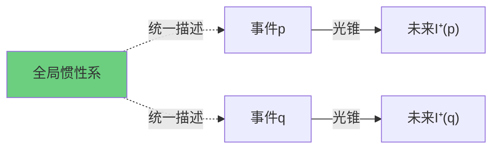

### 弯曲时空：不可消除的冗余

考虑球面$S^2$（嵌入三维空间）：
- 沿不同大圆"平行输运"向量
- 绕一个闭环后，向量方向改变
- 这个改变由**曲率**控制

**因果版本**：
在弯曲时空中，沿不同因果路径"组合"局域因果约束，会出现**闭合偏差**：
- 路径1：$p \to q \to r$
- 路径2：$p \to s \to r$
- 两条路径的"因果传播"略有不同

这个不一致性就是**曲率的来源**！

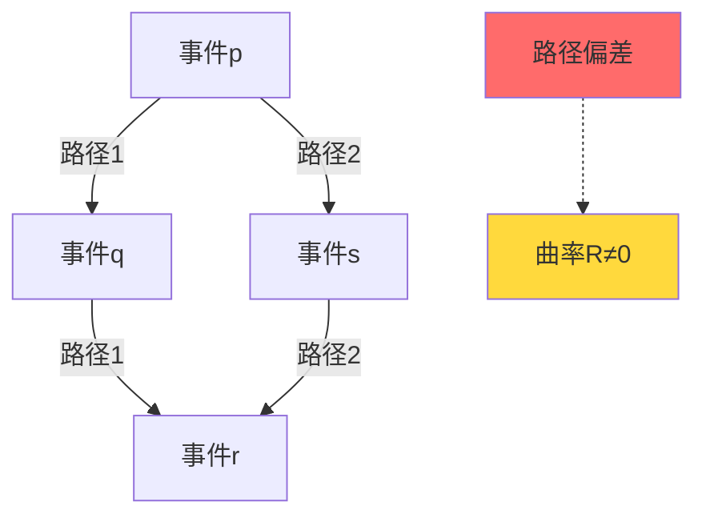

### 描述复杂度的解释

**定义**：因果可达图的**描述复杂度**$\mathcal{C}(\text{Reach}(g))$是"完整描述所有因果关系所需的最少信息量"。

**定理（因果压缩原理）**：
$$
\mathcal{C}(\text{Reach}(g)) = \mathcal{C}_{\text{top}}(\chi) + \int_M f(R_{abcd}) \sqrt{|g|} \, d^4x
$$

这里：
- $\mathcal{C}_{\text{top}}(\chi)$：拓扑信息（Euler示性数）
- $\int f(R)$：几何信息（曲率积分）

**物理解释**：
- **拓扑部分**：无法压缩的"全局形状"信息
- **曲率部分**：局域因果约束的"冗余"记账

**核心洞察**：
> 曲率$R_{abcd}$测量的是：在给定拓扑约束下，局域因果约束之间的"不可消除相关性"。

## 因果版Gauss-Bonnet的变分原理

### 描述长度-曲率泛函

定义泛函：
$$
\mathcal{F}[g] = \mathcal{C}(\text{Reach}(g)) + \lambda \int_M |R_{abcd}|^2 \sqrt{|g|} \, d^4x
$$

- 第一项：因果结构的描述复杂度
- 第二项：曲率的$L^2$范数（惩罚高曲率）
- $\lambda$：权重参数

**变分原理**：
物理上实现的几何是$\mathcal{F}[g]$在给定约束下的**极小解**。

### 极小化的两种趋势

1. **最小化描述复杂度** → 倾向于简单的因果结构
   - 例如：平坦时空$\mathbb{R}^{1,3}$
   - $\chi = 1$，$R = 0$

2. **最小化曲率** → 倾向于平坦的几何
   - Einstein方程的真空解：$R_{ab} = 0$

**矛盾？**
不！两者通过**拓扑约束**协调：
- 给定拓扑类$\chi(M)$
- Gauss-Bonnet固定曲率积分
- 剩余自由度：如何分配曲率

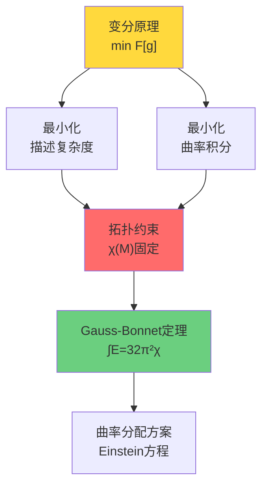

## 因果重构Euler示性数的步骤

### 步骤一：从因果偏序到Alexandrov拓扑

**输入**：因果偏序$(M, \leq)$

**输出**：拓扑空间$(M, \tau_A)$

**方法**：
1. 定义Alexandrov基：$\mathcal{B} = \{A(p,q) : p \ll q\}$
2. 生成拓扑：$\tau_A = \langle \mathcal{B} \rangle$
3. 在强因果下：$\tau_A = \tau_{\text{manifold}}$

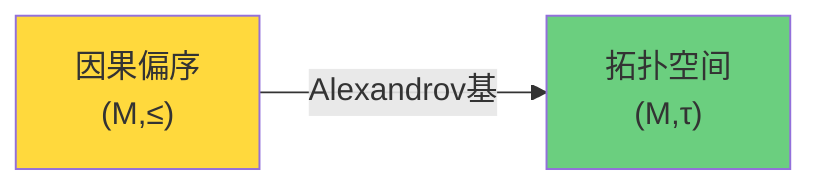

### 步骤二：从拓扑到同调群

**输入**：拓扑空间$(M, \tau)$

**输出**：同调群$H_k(M; \mathbb{Z})$

**方法**：
1. 构造单纯复形或CW复形近似
2. 计算边界算子$\partial_k: C_k \to C_{k-1}$
3. 同调群：$H_k = \ker \partial_k / \mathrm{Im}\, \partial_{k+1}$

**Betti数**：$b_k = \mathrm{rank}(H_k)$

### 步骤三：计算Euler示性数

**输入**：Betti数$\{b_0, b_1, b_2, \ldots\}$

**输出**：Euler示性数$\chi(M)$

**公式**：
$$
\chi(M) = \sum_{k=0}^{\dim M} (-1)^k b_k
$$

对四维流形：
$$
\chi(M) = b_0 - b_1 + b_2 - b_3 + b_4
$$

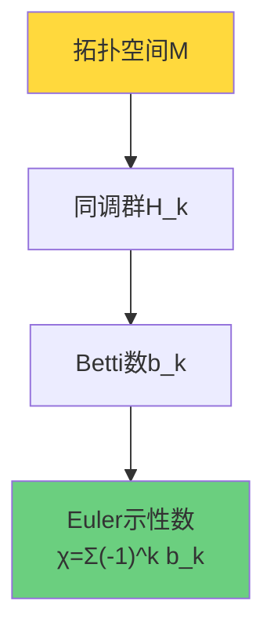

### 步骤四：因果版Gauss-Bonnet

**定理（因果Gauss-Bonnet）**：
$$
\int_M E(R) \sqrt{|g|} \, d^4x = 32\pi^2 \chi_{\text{causal}}(M, \leq)
$$

其中：
- 左边：Euler密度的积分（几何）
- 右边：从因果结构重构的Euler示性数（拓扑）

**等价性**：$\chi_{\text{causal}}(M, \leq) = \chi_{\text{topological}}(M)$

**深刻性**：
> 即使不知道度规$g$，只要知道因果偏序$\leq$，就能计算拓扑不变量$\chi$！

## 具体例子：de Sitter时空

### de Sitter度规

$$
ds^2 = -dt^2 + e^{2Ht} (dx^2 + dy^2 + dz^2)
$$

- 拓扑：$\mathbb{R} \times S^3$（紧致三球的时间演化）
- Euler示性数：$\chi(S^3) = 0$
- 曲率：常正曲率，$R = 12H^2$

### 因果结构

de Sitter时空有**宇宙学视界**：
- 观察者的可达未来有限
- 因果钻石$A(p,q)$的大小受限

**因果重构**：
1. 从因果偏序识别出"紧致化"结构
2. Alexandrov拓扑重现$\mathbb{R} \times S^3$的拓扑
3. 计算：$\chi = 0$

**Gauss-Bonnet验证**：
$$
\int_M E(R) \, dV = 0 = 32\pi^2 \cdot 0 \quad \checkmark
$$

虽然局域曲率$R > 0$非零，但Euler密度的积分恰好为零，与拓扑一致！

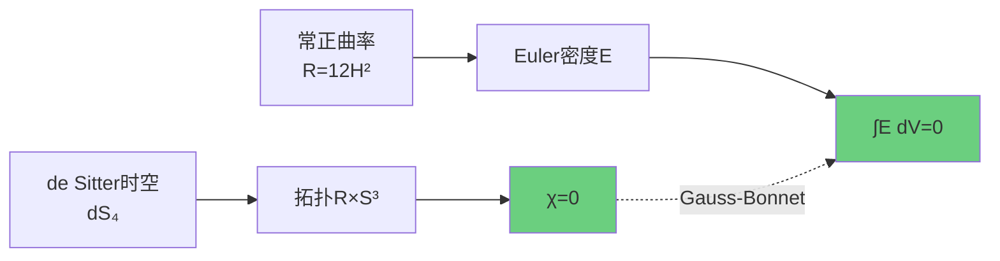

## 与Einstein方程的关系

### Gauss-Bonnet项作为拓扑不变量

在四维，Euler密度$E(R)$的积分是**拓扑不变量**，因此它对Einstein方程的变分**无贡献**：

$$
\delta \int_M E(R) \sqrt{|g|} \, d^4x = 0
$$

**推论**：
可以在作用量中添加Gauss-Bonnet项而不改变运动方程：
$$
S = \int_M (R + \alpha E(R)) \sqrt{|g|} \, d^4x
$$

$\alpha$项只是整体常数$32\pi^2 \alpha \chi(M)$，对场方程无影响。

### 在高维的情况

在$d > 4$维，Gauss-Bonnet项**不再是全导数**，对场方程有贡献！这导致**Lovelock引力理论**：

$$
S = \int_M \sum_{k=0}^{[d/2]} \alpha_k \mathcal{L}_k(R) \sqrt{|g|} \, d^dx
$$

其中$\mathcal{L}_k$是第$k$阶Lovelock项（$\mathcal{L}_1 = R$是Einstein-Hilbert项）。

## 拓扑约束与量子异常

### Euler示性数与量子反常

在量子场论中，Euler示性数与**拓扑异常**相关：

**Atiyah-Singer指标定理**：
$$
\mathrm{index}(\not{D}) = \int_M \hat{A}(M) \wedge \mathrm{ch}(E)
$$

对于旋量场，$\hat{A}(M)$包含Euler密度项。

**物理含义**：
- 零模数（量子真空的简并度）由拓扑固定
- $\chi \neq 0$ → 手征反常、引力反常

### [K]=0与拓扑一致性

回到我们的相对上同调类$[K]$：

**定理（拓扑一致性）**：
如果$[K] = 0$（无拓扑异常），则：

1. **Euler示性数可分解**：
   $$
   \chi(Y) = \chi(M) + \chi(X^\circ)
   $$
   （乘积拓扑的Künneth公式）

2. **曲率可局域化**：
   存在局域变分原理使得Einstein方程成立

3. **因果结构自洽**：
   从因果偏序重构的拓扑与从度规给出的拓扑一致

**反之**：
如果$[K] \neq 0$，会出现拓扑矛盾：
- 从因果重构的$\chi_{\text{causal}}$
- 与从度规计算的$\chi_{\text{metric}}$
- 不相等！

这正是拓扑异常的标志。

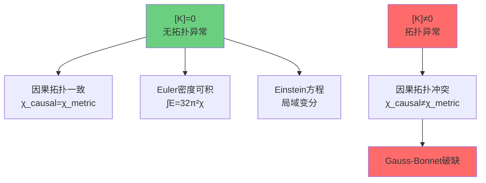

## 小结：曲率的三重身份

通过因果版Gauss-Bonnet定理，我们揭示了曲率的三重身份：

| 视角 | 曲率的含义 | 数学表达 |
|------|-----------|---------|
| **几何** | 时空的弯曲度 | Riemann张量$R_{abcd}$ |
| **因果** | 因果约束的冗余密度 | 描述复杂度梯度$\delta \mathcal{C}/\delta g$ |
| **拓扑** | Euler示性数的密度 | Euler密度$E(R)$，满足$\int E = 32\pi^2 \chi$ |

**核心洞察**：

1. **拓扑不可压缩**：
   $$
   \chi(M) = \text{常数（拓扑类）}
   $$

2. **曲率总量固定**：
   $$
   \int_M E(R) \, dV = 32\pi^2 \chi(M)
   $$

3. **因果结构决定拓扑**：
   $$
   (M, \leq) \xRightarrow{\text{Alexandrov}} (M, \tau) \xRightarrow{\text{同调}} \chi(M)
   $$

4. **局域变分优化分配**：
   Einstein方程决定如何在时空中"分配"固定总量的曲率

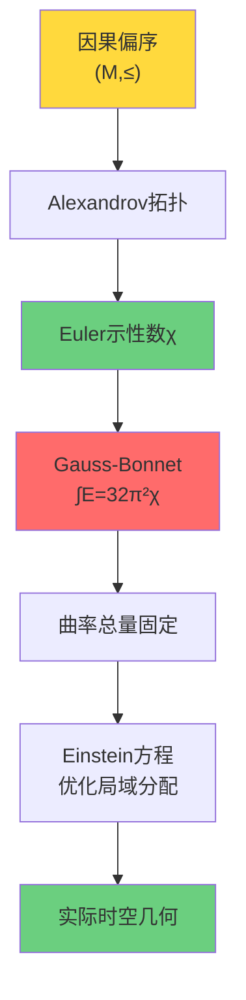

## 哲学反思：几何的因果起源

因果版Gauss-Bonnet定理告诉我们：

> **几何不是第一性的，因果结构才是。**

传统观点：
- 先有时空流形$(M, g)$
- 从度规$g$导出因果结构$\leq$
- 曲率$R$是度规的导数

**因果优先观点**：
- 先有因果偏序$(M, \leq)$
- 从因果结构重构拓扑$\tau$和共形类$[g]$
- 曲率$R$是因果约束的冗余编码

**物理含义**：
宇宙的"硬件"是因果可达性（谁能影响谁），时空几何只是这个因果网络的一种"软件表示"。

Gauss-Bonnet定理则保证：无论用什么"表示"（度规），拓扑"硬件"（Euler示性数）不变。

## 下一步：拓扑约束的总结

我们已经完成了拓扑约束的五个方面：
1. **为什么拓扑**（相对vs绝对）
2. **相对上同调类**（$[K]$的定义）
3. **ℤ₂环量**（物理判据）
4. **标准模型群**（代数应用）
5. **Gauss-Bonnet**（几何应用）

下一节将对整个拓扑约束篇进行总结，揭示：
- 拓扑、代数、几何的统一图景
- 从$[K]=0$到物理一致性的完整链条
- 拓扑约束在统一理论中的终极地位
