# Causal Version of Gauss-Bonnet: Curvature as Redundancy Density of Causal Constraints

In previous section, we saw how topological constraints derive Standard Model group structure from algebraic level. Now we turn to **geometric level** of topological constraints—causal reconstruction of classical Gauss-Bonnet theorem.

This section will reveal a profound fact:

> **Curvature is not externally added geometric quantity, but "redundancy density" when causal constraints cannot be globally compatible.**

## Classical Gauss-Bonnet Theorem: Bridge Between Topology and Geometry

### Gauss-Bonnet Theorem on Two-Dimensional Surfaces

Classical Gauss-Bonnet theorem is one of most beautiful results in differential geometry. For compact two-dimensional orientable surface $M$ (without boundary), it establishes exact relationship between **local geometry** (curvature) and **global topology** (Euler characteristic):

$$\int_M K \, dA = 2\pi \chi(M)$$

Here:
- **Left Side**: $K$ is Gauss curvature, $dA$ is area element
  - Curvature is **local geometric quantity**, defined pointwise
  - Integral covers entire surface

- **Right Side**: $\chi(M)$ is Euler characteristic, $\chi(M) = V - E + F$
  - $V$ is number of vertices, $E$ is number of edges, $F$ is number of faces
  - This is **topological invariant**, independent of metric

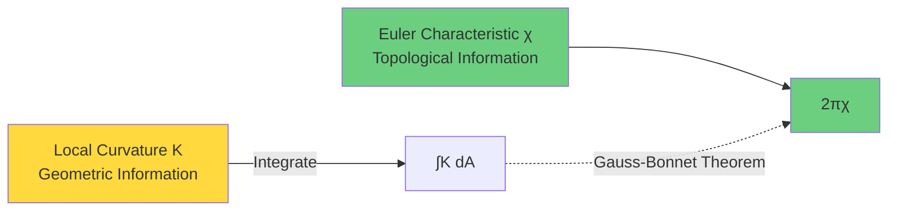

### Concrete Examples

**Sphere** $S^2$:
- Topology: $\chi(S^2) = 2$
- Geometry: Sphere of radius $R$, $K = 1/R^2$ (positive curvature everywhere)
- Verification: $\int_{S^2} K \, dA = \frac{1}{R^2} \cdot 4\pi R^2 = 4\pi = 2\pi \cdot 2$ ✓

**Torus** $T^2$:
- Topology: $\chi(T^2) = 0$
- Geometry: Can construct flat torus ($K=0$ everywhere)
- Verification: $\int_{T^2} 0 \, dA = 0 = 2\pi \cdot 0$ ✓

**Surface of Genus $g$**:
- Topology: $\chi(M_g) = 2 - 2g$ ($g$ holes)
- $g=0$ (sphere) → $\chi = 2$
- $g=1$ (torus) → $\chi = 0$
- $g=2$ (two-hole surface) → $\chi = -2$

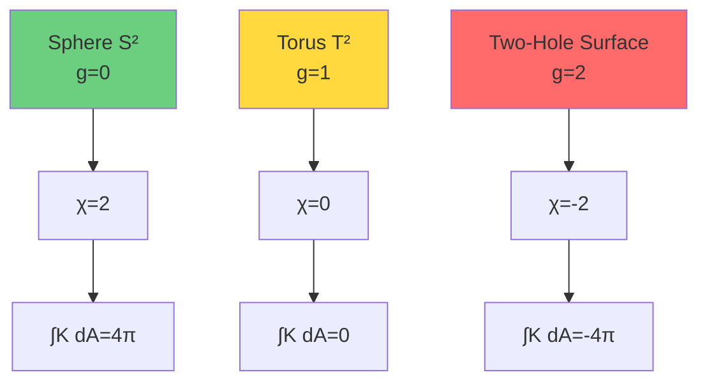

### Profundity of Gauss-Bonnet Theorem

This theorem is profound because:

1. **Left Side** (curvature integral) **seems to depend** on how metric is placed on surface
   - Different metrics give different curvature distributions
   - For example: Sphere can be stretched and deformed, local curvature changes

2. **Right Side** (Euler characteristic) **completely independent** of metric
   - Only depends on topological type of surface
   - Is a **topological invariant**

3. **Equality** means:
   - Total amount of curvature (integral) is rigidly fixed by topology
   - No matter how metric is deformed, curvature always "redistributes" to keep integral unchanged

**Physical Analogy**: Like charge conservation—you can move charges, but total charge unchanged. Here, you can move curvature (change metric), but total curvature (topological charge) unchanged!

## Higher-Dimensional Generalization: Chern-Gauss-Bonnet Theorem

### Case of Four-Dimensional Spacetime

On four-dimensional manifold $M$, Gauss-Bonnet theorem generalizes to:

$$\int_M \left( R_{abcd}R^{abcd} - 4R_{ab}R^{ab} + R^2 \right) \sqrt{|g|} \, d^4x = 32\pi^2 \chi(M)$$

Here:
- Left side is **Euler density** (constructed from Riemann curvature tensor)
- Right side is still Euler characteristic $\chi(M)$

For four-dimensional manifold:
$$\chi(M) = \sum_{k=0}^{4} (-1)^k b_k$$

where $b_k$ is $k$-th Betti number (rank of $k$-th homology group).

### Meaning of Topological Characteristic Number

Euler characteristic $\chi(M)$ encodes **global topological shape** of manifold:
- $\chi > 0$: Positive curvature dominates (like sphere)
- $\chi = 0$: Curvature "averages" to zero (like torus, flat spacetime)
- $\chi < 0$: Negative curvature dominates (like hyperboloid)

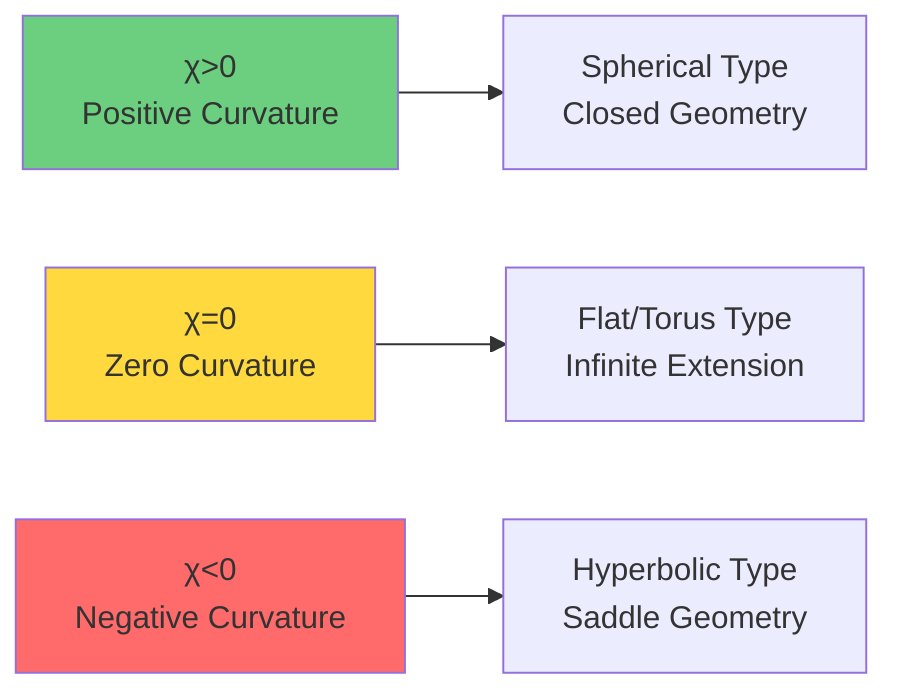

## Causal Structure Perspective: From Partial Order to Topology

### What Is Causal Structure?

In relativity, **causal structure** encodes "which events can affect which events":
- For events $p, q \in M$, if $q$ is in causal future of $p$, denote $p \leq q$
- This relation $\leq$ is a **partial order**: reflexive, transitive, antisymmetric

**Key Insight** (Malament, Hawking, etc.):
> In strongly causal spacetimes, causal partial order $\leq$ almost uniquely determines conformal class of metric!

In other words:
- **Knowing causal relations** → Knowing light cone structure → Knowing metric (up to overall scaling)

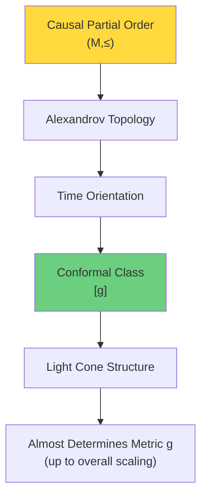

### Alexandrov Topology

From causal partial order we can **reconstruct topology**!

**Definition**: For $p \ll q$ ($q$ in strict causal future of $p$), define **causal diamond**:
$$A(p,q) = I^+(p) \cap I^-(q)$$
(intersection of future of $p$ and past of $q$)

**Alexandrov Topology**: Topology with all causal diamonds $\{A(p,q)\}$ as basis.

**Theorem**: In strongly causal spacetimes, Alexandrov topology = original manifold topology.

**Physical Meaning**:
> Topological structure (which sets are "open") is completely determined by causal reachability!

### From Topology to Characteristic Number

Since causal structure determines topology, and topology determines Euler characteristic, then:

$$\text{Causal Structure} \Rightarrow \text{Topology} \Rightarrow \chi(M)$$

**Question**: How to **directly calculate** $\chi(M)$ from causal partial order, without going through metric?

This is goal of **causal version of Gauss-Bonnet theorem**!

## Curvature as "Redundancy Density of Causal Constraints"

### Flat Spacetime: Causal Structure Without Redundancy

Consider Minkowski spacetime $(\mathbb{R}^4, \eta)$:
- Causal structure: All light cones have same shape
- Curvature: $R_{abcd} = 0$ everywhere
- Euler density: $E = 0$ everywhere

**Intuitive Explanation**:
In flat spacetime, causal constraints are **completely compatible**—can be uniformly described by global inertial frame, no need to introduce additional "corrections" or "redundancy".

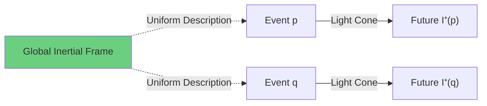

### Curved Spacetime: Ineliminable Redundancy

Consider sphere $S^2$ (embedded in 3D space):
- Parallel transport vector along different great circles
- After going around closed loop, vector direction changes
- This change is controlled by **curvature**

**Causal Version**:
In curved spacetime, "combining" local causal constraints along different causal paths produces **closed deviation**:
- Path 1: $p \to q \to r$
- Path 2: $p \to s \to r$
- "Causal propagation" of two paths slightly different

This inconsistency is **source of curvature**!

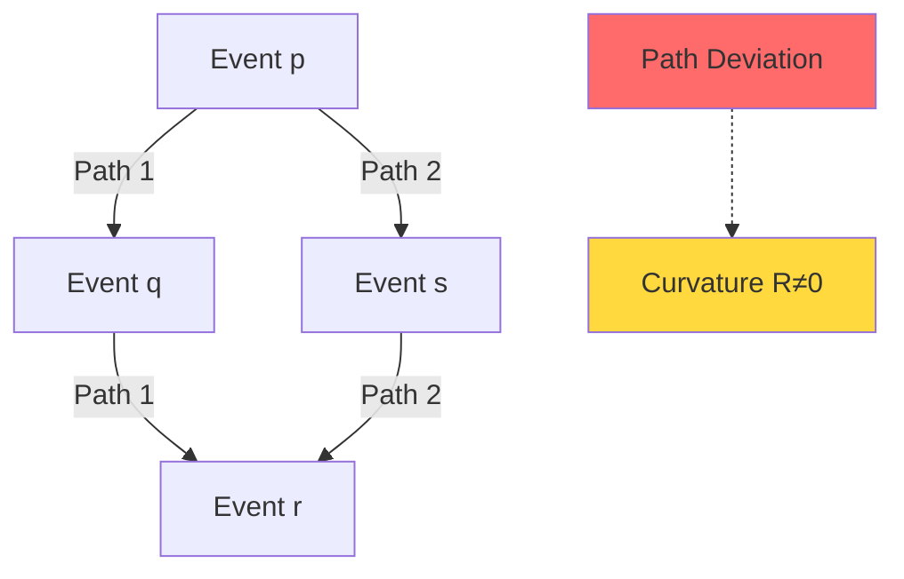

### Description Complexity Interpretation

**Definition**: **Description complexity** $\mathcal{C}(\text{Reach}(g))$ of causal reachability graph is "minimum information needed to completely describe all causal relations".

**Theorem (Causal Compression Principle)**:
$$\mathcal{C}(\text{Reach}(g)) = \mathcal{C}_{\text{top}}(\chi) + \int_M f(R_{abcd}) \sqrt{|g|} \, d^4x$$

Here:
- $\mathcal{C}_{\text{top}}(\chi)$: Topological information (Euler characteristic)
- $\int f(R)$: Geometric information (curvature integral)

**Physical Interpretation**:
- **Topological Part**: Incompressible "global shape" information
- **Curvature Part**: "Redundancy" accounting of local causal constraints

**Core Insight**:
> Curvature $R_{abcd}$ measures: "Ineliminable correlation" between local causal constraints under given topological constraints.

## Variational Principle for Causal Gauss-Bonnet

### Description Length-Curvature Functional

Define functional:
$$\mathcal{F}[g] = \mathcal{C}(\text{Reach}(g)) + \lambda \int_M |R_{abcd}|^2 \sqrt{|g|} \, d^4x$$

- First term: Description complexity of causal structure
- Second term: $L^2$ norm of curvature (penalizes high curvature)
- $\lambda$: Weight parameter

**Variational Principle**:
Physically realized geometry is **minimizer** of $\mathcal{F}[g]$ under given constraints.

### Two Trends of Minimization

1. **Minimize Description Complexity** → Tends toward simple causal structure
   - For example: Flat spacetime $\mathbb{R}^{1,3}$
   - $\chi = 1$, $R = 0$

2. **Minimize Curvature** → Tends toward flat geometry
   - Vacuum solutions of Einstein equation: $R_{ab} = 0$

**Contradiction?**
No! They coordinate through **topological constraints**:
- Given topological class $\chi(M)$
- Gauss-Bonnet fixes curvature integral
- Remaining freedom: How to distribute curvature

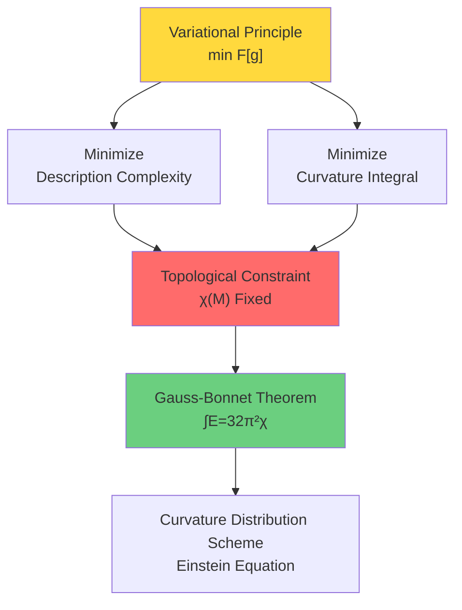

## Steps for Causal Reconstruction of Euler Characteristic

### Step 1: From Causal Partial Order to Alexandrov Topology

**Input**: Causal partial order $(M, \leq)$

**Output**: Topological space $(M, \tau_A)$

**Method**:
1. Define Alexandrov basis: $\mathcal{B} = \{A(p,q) : p \ll q\}$
2. Generate topology: $\tau_A = \langle \mathcal{B} \rangle$
3. Under strong causality: $\tau_A = \tau_{\text{manifold}}$

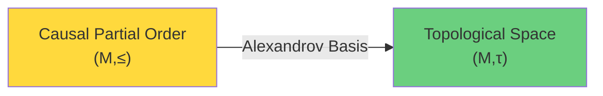

### Step 2: From Topology to Homology Groups

**Input**: Topological space $(M, \tau)$

**Output**: Homology groups $H_k(M; \mathbb{Z})$

**Method**:
1. Construct simplicial or CW complex approximation
2. Calculate boundary operators $\partial_k: C_k \to C_{k-1}$
3. Homology groups: $H_k = \ker \partial_k / \mathrm{Im}\, \partial_{k+1}$

**Betti Numbers**: $b_k = \mathrm{rank}(H_k)$

### Step 3: Calculate Euler Characteristic

**Input**: Betti numbers $\{b_0, b_1, b_2, \ldots\}$

**Output**: Euler characteristic $\chi(M)$

**Formula**:
$$\chi(M) = \sum_{k=0}^{\dim M} (-1)^k b_k$$

For four-dimensional manifold:
$$\chi(M) = b_0 - b_1 + b_2 - b_3 + b_4$$

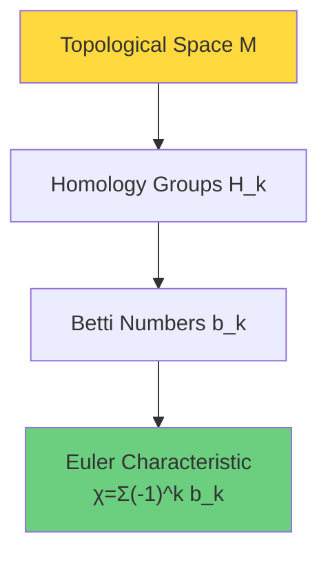

### Step 4: Causal Gauss-Bonnet

**Theorem (Causal Gauss-Bonnet)**:
$$\int_M E(R) \sqrt{|g|} \, d^4x = 32\pi^2 \chi_{\text{causal}}(M, \leq)$$

where:
- Left side: Integral of Euler density (geometry)
- Right side: Euler characteristic reconstructed from causal structure (topology)

**Equivalence**: $\chi_{\text{causal}}(M, \leq) = \chi_{\text{topological}}(M)$

**Profundity**:
> Even without knowing metric $g$, as long as we know causal partial order $\leq$, we can calculate topological invariant $\chi$!

## Concrete Example: de Sitter Spacetime

### de Sitter Metric

$$ds^2 = -dt^2 + e^{2Ht} (dx^2 + dy^2 + dz^2)$$

- Topology: $\mathbb{R} \times S^3$ (time evolution of compact 3-sphere)
- Euler characteristic: $\chi(S^3) = 0$
- Curvature: Constant positive curvature, $R = 12H^2$

### Causal Structure

de Sitter spacetime has **cosmological horizon**:
- Reachable future of observer is finite
- Size of causal diamonds $A(p,q)$ is limited

**Causal Reconstruction**:
1. Identify "compactification" structure from causal partial order
2. Alexandrov topology reproduces topology of $\mathbb{R} \times S^3$
3. Calculate: $\chi = 0$

**Gauss-Bonnet Verification**:
$$\int_M E(R) \, dV = 0 = 32\pi^2 \cdot 0 \quad \checkmark$$

Although local curvature $R > 0$ is non-zero, integral of Euler density is exactly zero, consistent with topology!

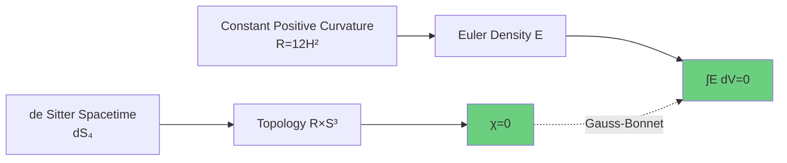

## Relationship with Einstein Equation

### Gauss-Bonnet Term as Topological Invariant

In four dimensions, integral of Euler density $E(R)$ is **topological invariant**, therefore it **contributes nothing** to variation of Einstein equation:

$$\delta \int_M E(R) \sqrt{|g|} \, d^4x = 0$$

**Corollary**:
Can add Gauss-Bonnet term to action without changing equations of motion:
$$S = \int_M (R + \alpha E(R)) \sqrt{|g|} \, d^4x$$

$\alpha$ term is just overall constant $32\pi^2 \alpha \chi(M)$, has no effect on field equations.

### Case in Higher Dimensions

In $d > 4$ dimensions, Gauss-Bonnet term **is no longer total derivative**, contributes to field equations! This leads to **Lovelock gravity theory**:

$$S = \int_M \sum_{k=0}^{[d/2]} \alpha_k \mathcal{L}_k(R) \sqrt{|g|} \, d^dx$$

where $\mathcal{L}_k$ is $k$-th Lovelock term ($\mathcal{L}_1 = R$ is Einstein-Hilbert term).

## Topological Constraints and Quantum Anomalies

### Euler Characteristic and Quantum Anomalies

In quantum field theory, Euler characteristic relates to **topological anomalies**:

**Atiyah-Singer Index Theorem**:
$$\mathrm{index}(\not{D}) = \int_M \hat{A}(M) \wedge \mathrm{ch}(E)$$

For spinor fields, $\hat{A}(M)$ contains Euler density term.

**Physical Meaning**:
- Number of zero modes (degeneracy of quantum vacuum) fixed by topology
- $\chi \neq 0$ → Chiral anomaly, gravitational anomaly

### [K]=0 and Topological Consistency

Returning to our relative cohomology class $[K]$:

**Theorem (Topological Consistency)**:
If $[K] = 0$ (no topological anomaly), then:

1. **Euler Characteristic Decomposable**:
   $$\chi(Y) = \chi(M) + \chi(X^\circ)$$
   (Künneth formula for product topology)

2. **Curvature Localizable**:
   Exists local variational principle such that Einstein equation holds

3. **Causal Structure Self-Consistent**:
   Topology reconstructed from causal partial order agrees with topology given by metric

**Conversely**:
If $[K] \neq 0$, topological contradiction appears:
- $\chi_{\text{causal}}$ reconstructed from causality
- $\chi_{\text{metric}}$ calculated from metric
- Not equal!

This is exactly sign of topological anomaly.

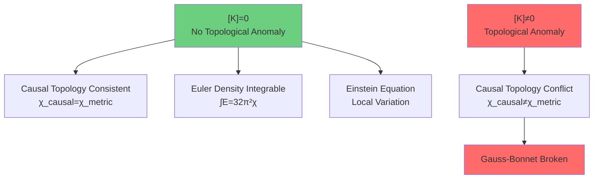

## Summary: Triple Identity of Curvature

Through causal version of Gauss-Bonnet theorem, we revealed triple identity of curvature:

| Perspective | Meaning of Curvature | Mathematical Expression |
|-------------|---------------------|------------------------|
| **Geometry** | Bending degree of spacetime | Riemann tensor $R_{abcd}$ |
| **Causality** | Redundancy density of causal constraints | Description complexity gradient $\delta \mathcal{C}/\delta g$ |
| **Topology** | Density of Euler characteristic | Euler density $E(R)$, satisfies $\int E = 32\pi^2 \chi$ |

**Core Insights**:

1. **Topology Incompressible**:
   $$\chi(M) = \text{constant (topological class)}$$

2. **Total Curvature Fixed**:
   $$\int_M E(R) \, dV = 32\pi^2 \chi(M)$$

3. **Causal Structure Determines Topology**:
   $$(M, \leq) \xRightarrow{\text{Alexandrov}} (M, \tau) \xRightarrow{\text{homology}} \chi(M)$$

4. **Local Variation Optimizes Distribution**:
   Einstein equation determines how to "distribute" fixed total curvature in spacetime

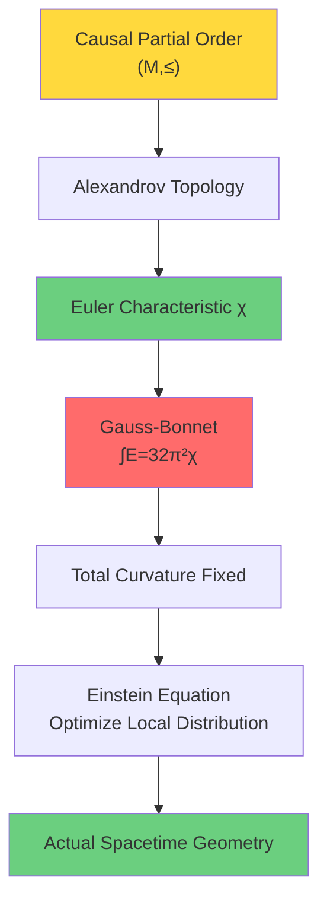

## Philosophical Reflection: Causal Origin of Geometry

Causal version of Gauss-Bonnet theorem tells us:

> **Geometry is not primary, causal structure is.**

Traditional view:
- First spacetime manifold $(M, g)$
- Derive causal structure $\leq$ from metric $g$
- Curvature $R$ is derivative of metric

**Causal Priority View**:
- First causal partial order $(M, \leq)$
- Reconstruct topology $\tau$ and conformal class $[g]$ from causal structure
- Curvature $R$ is redundancy encoding of causal constraints

**Physical Meaning**:
"Hardware" of universe is causal reachability (who can affect whom), spacetime geometry is just one "software representation" of this causal network.

Gauss-Bonnet theorem guarantees: No matter what "representation" (metric) is used, topological "hardware" (Euler characteristic) unchanged.

## Next Step: Summary of Topological Constraints

We have completed five aspects of topological constraints:
1. **Why Topology** (relative vs absolute)
2. **Relative Cohomology Class** (definition of $[K]$)
3. **ℤ₂ Holonomy** (physical criterion)
4. **Standard Model Group** (algebraic application)
5. **Gauss-Bonnet** (geometric application)

Next section will summarize entire topological constraints chapter, revealing:
- Unified picture of topology, algebra, geometry
- Complete chain from $[K]=0$ to physical consistency
- Ultimate position of topological constraints in unified theory

