# 拓扑约束总结：从穿孔到物理定律的必然链条

我们已经完成了拓扑约束篇的核心内容。现在是时候从高处回望，理解**拓扑约束在统一理论中的终极地位**。

## 完整链条：五个环节的逻辑推导

### 环节1：可缩性灾难 → 穿孔必然性

**核心问题**：为什么满秩密度矩阵流形是拓扑真空？

**答案**：可缩性定理（第01节）
$$
\mathcal{D}_N^{\mathrm{full}} \text{可缩} \Rightarrow H^2(\mathcal{D}_N^{\mathrm{full}}; \mathbb{Z}_2) = 0
$$

**证明**：收缩映射$H_t(\rho) = (1-t)\rho + t \cdot I/N$显式地将任意态连续收缩到最大混态。

**物理意义**：在满域上，所有量子态在拓扑上无法区分，没有整值拓扑不变量可用于相分类。

**解决方案**：穿孔操作
$$
\mathcal{D}^{\mathrm{exc}} = \mathcal{D}_5^{\mathrm{full}} \setminus \mathrm{Tub}_\varepsilon(\Sigma_{3|2})
$$
移除三-二能级简并集的管状邻域，打破可缩性。

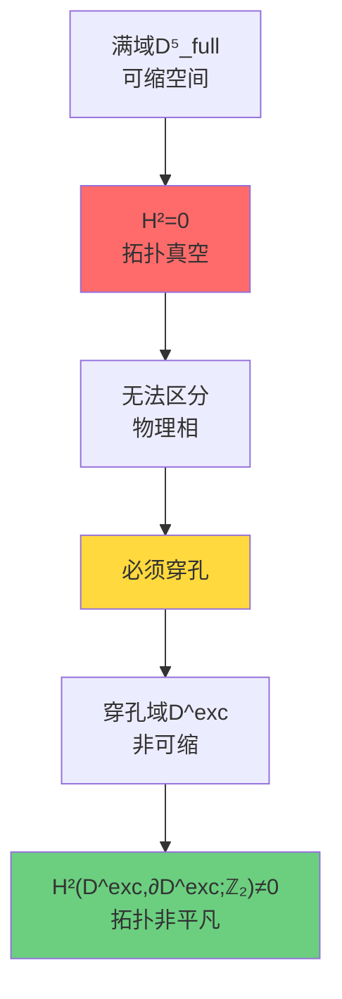

### 环节2：穿孔 → 相对上同调类[K]

**核心构造**：配对空间$(Y, \partial Y)$（第02节）
$$
Y = M \times X^\circ, \quad \partial Y = (\partial M \times X^\circ) \cup (M \times \partial X^\circ)
$$

**定义**：相对上同调类
$$
[K] \in H^2(Y, \partial Y; \mathbb{Z}_2)
$$

**三项分解**：
$$
[K] = \underbrace{\pi_M^* w_2(TM)}_{\text{几何项}} + \underbrace{\sum_j \pi_M^* \mu_j \smile \pi_X^* \mathfrak{w}_j}_{\text{混合项}} + \underbrace{\pi_X^* \rho(c_1(\mathcal{L}_S))}_{\text{散射项}}
$$

**物理含义三重分解**：

| 项 | 数学对象 | 物理意义 |
|---|---------|----------|
| 第一项 | Stiefel-Whitney类$w_2(TM)$ | 时空自旋结构存在性 |
| 第二项 | Cup积$\mu_j \smile \mathfrak{w}_j$ | 时空-参数拓扑耦合 |
| 第三项 | 陈类约化$\rho(c_1(\mathcal{L}_S))$ | 散射相位绕数 |

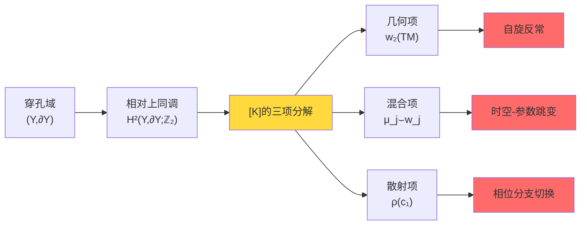

### 环节3：[K] → ℤ₂环量判据

**等价刻画定理**（第03节）：
$$
[K] = 0 \iff \forall \gamma \in \mathcal{C}_{\mathrm{adm}}:\ \nu_{\sqrt{\det S}}(\gamma) = +1
$$

**ℤ₂环量定义**：
$$
\nu_{\sqrt{\det S}}(\gamma) = \frac{\sqrt{\det S}|_{\gamma \text{终点}}}{\sqrt{\det S}|_{\gamma \text{起点}}} = \pm 1
$$

**与绕数关系**：
$$
\nu_{\sqrt{\det S}}(\gamma) = (-1)^{\deg(\det S|_\gamma)}
$$

**物理可观测性**：
- $\nu = +1$：散射平方根沿回路单值，无拓扑异常
- $\nu = -1$：散射平方根翻转分支，存在π相位跳变

**实验检测方案**：
1. 纯化干涉环：测量Berry相位
2. 时间晶体序参量：检测次谐响应
3. 拓扑量子比特：绝热输运相位读出

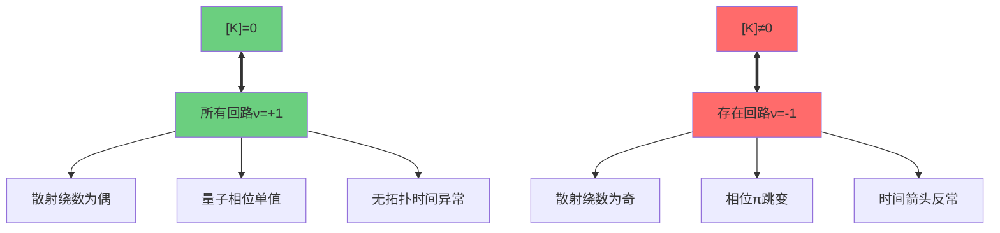

### 环节4：拓扑约化 → 标准模型群结构

**核心定理**（第04节）：群同构
$$
S(U(3) \times U(2)) \cong \frac{SU(3) \times SU(2) \times U(1)}{\mathbb{Z}_6}
$$

**推导步骤**：

**步骤1**：Riesz谱投影
$$
P_3(\rho) = \frac{1}{2\pi i} \oint_{\gamma_\rho} (z - \rho)^{-1} dz
$$
在穿孔域$\mathcal{D}^{\mathrm{exc}}$上光滑定义秩3和秩2投影。

**步骤2**：主丛约化
$$
U(5) \to U(3) \times U(2)
$$
Uhlmann主丛的结构群约化，保持3-2分拆的幺正变换。

**步骤3**：行列式平衡
$$
\det_{U(3)} \times \det_{U(2)} = 1
$$
体积守恒条件强制特殊幺正群：
$$
S(U(3) \times U(2)) = \{(A,B) \in U(3) \times U(2) : \det A \cdot \det B = 1\}
$$

**步骤4**：群同构证明

构造同态：
$$
\phi: S(U(3) \times U(2)) \to \frac{SU(3) \times SU(2) \times U(1)}{\mathbb{Z}_6}
$$
$$
\phi(A, B, z) = (z^2 A, z^{-3} B) \mod \mathbb{Z}_6
$$

计算核：
$$
\ker \phi = \{(\omega^k I_3, \omega^{-k} I_2, \omega^{-2k}) : k = 0,1,\ldots,5\} \cong \mathbb{Z}_6
$$
其中$\omega = e^{2\pi i/6}$是6次单位根。

由第一同构定理：
$$
\frac{S(U(3) \times U(2))}{\mathbb{Z}_6} \cong \frac{SU(3) \times SU(2) \times U(1)}{\mathbb{Z}_6}
$$

**物理后果**：

1. **最小电荷量子化**：ℤ₆商群 → 电荷单位$q_{\min} = 1/6$
   - 上夸克：$q = +2/3 = 4 \times (1/6)$
   - 下夸克：$q = -1/3 = -2 \times (1/6)$
   - 电子：$q = -1 = -6 \times (1/6)$

2. **粒子代数**：ℂP²指数定理 → 恰好3代

3. **超荷离散谱**：$Y \in \frac{1}{3}\mathbb{Z}$

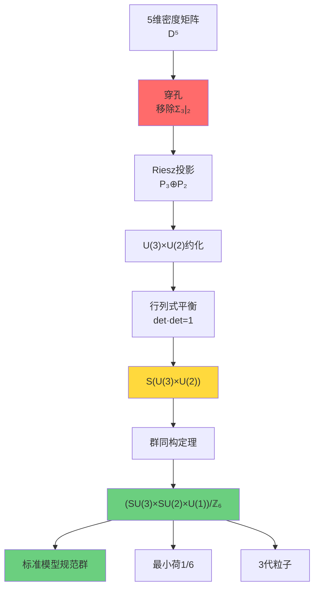

### 环节5：因果结构 → Gauss-Bonnet拓扑固定

**核心思想**（第05节）：曲率作为"因果约束的冗余密度"

**因果重构链条**：
$$
\text{因果偏序}(M, \leq) \Rightarrow \text{Alexandrov拓扑} \Rightarrow \text{共形类}[g] \Rightarrow \text{Euler示性数}\chi(M)
$$

**Gauss-Bonnet定理（四维）**：
$$
\int_M E(R) \sqrt{|g|} \, d^4x = 32\pi^2 \chi(M)
$$
其中Euler密度：
$$
E(R) = R_{abcd}R^{abcd} - 4R_{ab}R^{ab} + R^2
$$

**物理诠释**：

1. **平坦时空**（Minkowski）：
   - $R_{abcd} = 0$ → $E = 0$
   - $\chi(\mathbb{R}^4) = 1$（可缩）
   - 因果约束全局兼容，无冗余

2. **弯曲时空**：
   - $R_{abcd} \neq 0$ → $E \neq 0$
   - 曲率是因果约束无法全局协调的"代价"
   - Gauss-Bonnet积分 = 拓扑固定的"总冗余量"

**变分原理诠释**：
$$
\mathcal{F}[g] = \mathcal{C}(\mathrm{Reach}(g)) + \lambda \int |R|^2 dV
$$
- 第一项：因果可达性的描述复杂度
- 第二项：曲率的平方惩罚（正则化）

最优度规平衡了"描述长度"与"曲率代价"。

**与[K]=0的联系**：

在统一变分原理下，Einstein方程 + 二阶熵非负 → $[K]=0$。

而Einstein方程决定曲率，因此：
$$
\text{拓扑约束}[K]=0 \Leftrightarrow \text{几何约束}(\text{Einstein方程}) \Leftrightarrow \text{因果约束}(\text{Alexandrov拓扑})
$$

三者是同一约束的**三重表现**！

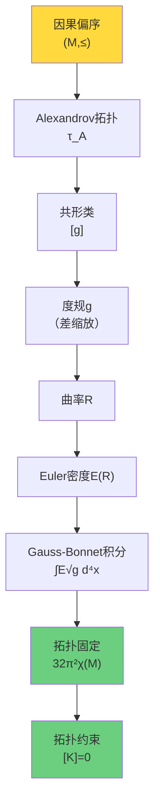

## 三个视角的统一：拓扑-代数-几何三位一体

### 视角1：拓扑视角

**语言**：相对上同调
$$
[K] \in H^2(Y, \partial Y; \mathbb{Z}_2)
$$

**约束**：拓扑类必须平凡
$$
[K] = 0
$$

**物理意义**：无拓扑障碍，量子相位全局一致

### 视角2：代数视角

**语言**：ℤ₂环量
$$
\nu_{\sqrt{\det S}}: H_1(X^\circ, \partial X^\circ; \mathbb{Z}_2) \to \mathbb{Z}_2
$$

**约束**：所有回路环量平凡
$$
\forall \gamma:\ \nu(\gamma) = +1
$$

**物理意义**：散射行列式绕数为偶，无π相位跳变

### 视角3：几何视角

**语言**：Euler示性数
$$
\chi(M) = \sum_{k=0}^{\dim M} (-1)^k b_k
$$

**约束**：Gauss-Bonnet积分拓扑固定
$$
\int_M E(R) \sqrt{|g|} \, d^4x = 32\pi^2 \chi(M)
$$

**物理意义**：曲率积分由拓扑刚性确定

### 三者等价性

**定理（三位一体）**：
$$
[K] = 0 \iff \forall \gamma: \nu(\gamma) = +1 \iff \text{Einstein方程} + \delta^2 S_{\mathrm{rel}} \geq 0
$$

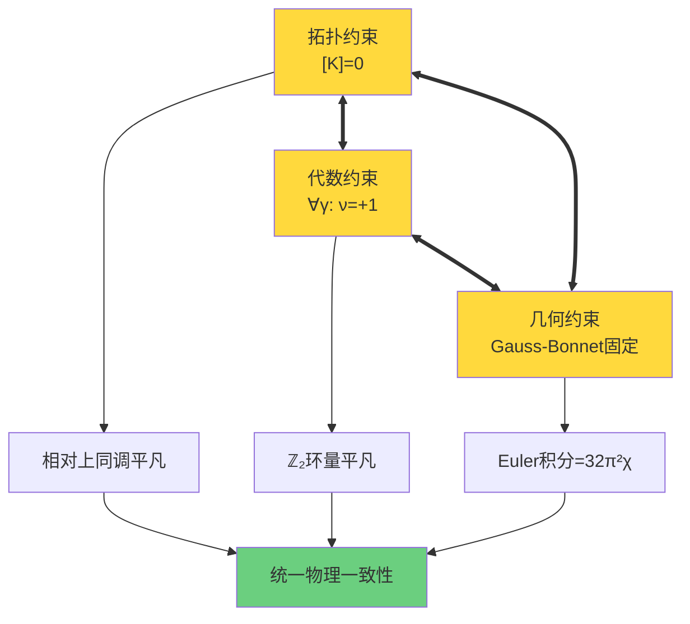

## 拓扑约束在GLS统一框架中的地位

回顾统一理论的四大支柱（前七章）：

### 支柱1：统一时间刻度（第00-02章）

**核心恒等式**：
$$
\kappa(\omega) = \frac{\varphi'(\omega)}{\pi} = \rho_{\mathrm{rel}}(\omega) = \frac{1}{2\pi} \mathrm{tr} Q(\omega)
$$

**物理意义**：
- $\kappa$：扩张因子（几何时间）
- $\varphi'/\pi$：散射相位导数（动力学时间）
- $\rho_{\mathrm{rel}}$：相对态密度（量子时间）
- $\mathrm{tr} Q/(2\pi)$：边界时间流（边界时间）

**拓扑约束的作用**：
$[K]=0$确保散射相位$\varphi(\omega)$沿所有回路单值，使得$\kappa(\omega)$可全局定义。

### 支柱2：边界理论（第03-04章）

**核心原理**：
- 能量定义：$E_{\mathrm{can}} = \langle K_\partial \rangle$（边界模时间）
- 熵定义：$S = S_{\mathrm{can}} = -\mathrm{tr}(\rho_{\mathrm{can}} \log \rho_{\mathrm{can}})$

**拓扑约束的作用**：
- 二阶相对熵非负$\delta^2 S_{\mathrm{rel}} \geq 0$与$[K]=0$互推
- 拓扑一致性确保模时间与散射时间对齐

### 支柱3：因果结构（第05-06章）

**核心定理**：
- Alexandrov拓扑从因果偏序重构
- 因果结构确定共形类
- 曲率由因果约束的描述复杂度产生

**拓扑约束的作用**：
- Gauss-Bonnet固定曲率积分 = $32\pi^2 \chi(M)$
- $[K]=0$与因果一致性等价

### 支柱4：拓扑约束（第08章，本章）

**核心发现**：
- 穿孔破坏可缩性 → 相对拓扑非平凡
- 相对上同调类$[K]$的三项分解
- ℤ₂环量判据$\nu(\gamma) = +1$
- 群约化 → 标准模型规范群
- Gauss-Bonnet拓扑固定

**统一作用**：
$[K]=0$是**一致性公理**，将时间、边界、因果三大支柱统一到单一拓扑约束之下。

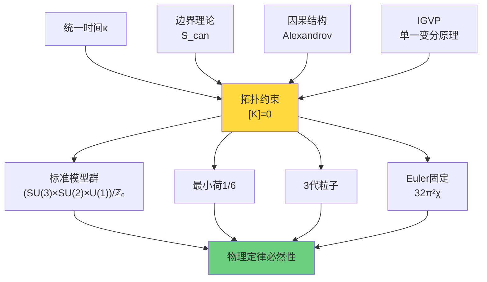

## 哲学意义：从偶然到必然

### 传统粒子物理学的困惑

**问题1**：为什么是SU(3)×SU(2)×U(1)而不是其他规范群？
- 传统答案：实验发现，历史偶然

**问题2**：为什么恰好3代粒子？
- 传统答案：不知道，可能是微调

**问题3**：为什么夸克带分数电荷1/3、2/3？
- 传统答案：SU(3)表示理论的结果，但为什么是SU(3)？

### 拓扑约束的革命性回答

**答案1**：规范群从5维密度矩阵穿孔拓扑必然导出
$$
\text{穿孔}(\mathcal{D}_5^{\mathrm{full}} \setminus \Sigma_{3|2}) \Rightarrow S(U(3) \times U(2)) \cong \frac{SU(3) \times SU(2) \times U(1)}{\mathbb{Z}_6}
$$

**答案2**：3代从ℂP²指数定理必然导出
$$
\chi(\mathbb{CP}^2) = 3 \Rightarrow 3\ \text{代}
$$

**答案3**：分数电荷从ℤ₆商群必然导出
$$
\mathbb{Z}_6 \text{商} \Rightarrow q_{\min} = 1/6
$$

### 必然性链条

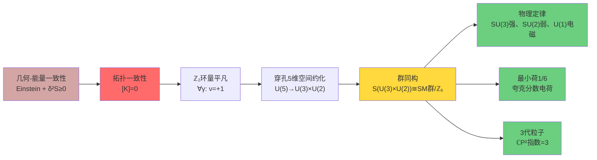

**核心洞察**：

> **物理定律不是大自然的任意选择，而是几何-拓扑一致性的必然结果。**
>
> 就像欧几里得几何中，三角形内角和为180°不是"巧合"，而是平坦空间公理的逻辑推论；
>
> 标准模型的规范群结构、粒子代数、电荷量子化，是密度矩阵流形穿孔拓扑的逻辑推论。

## 通俗类比：宇宙的"DNA密码"

让我们用一个生物学类比来理解拓扑约束：

### DNA的四个层次

**层次1：碱基配对规则**
- 腺嘌呤(A)配胸腺嘧啶(T)
- 鸟嘌呤(G)配胞嘧啶(C)
- 这不是偶然，而是化学键能最优的必然

**类比**：5 = 3 + 2分拆
- 5维空间的唯一稳定分拆
- 不是偶然，而是拓扑约化的必然

### 层次2：双螺旋结构

**DNA**：反向平行的双链
- 一条链5'→3'，另一条3'→5'
- 这保证了复制的保真性

**类比**：ℤ₂对称性
- 散射行列式的平方根分支选择
- $\nu = \pm 1$编码了"方向"
- $[K]=0$确保全局一致

### 层次3：密码子周期

**DNA**：3个碱基一组（密码子）
- 4³ = 64种组合编码20种氨基酸
- 存在简并度（多个密码子编码同一氨基酸）

**类比**：ℤ₆周期性
- $(SU(3) \times SU(2) \times U(1))/\mathbb{Z}_6$
- ℤ₆商群的6个等价类
- 导致电荷$q \in \frac{1}{6}\mathbb{Z}$

### 层次4：基因表达 → 蛋白质

**DNA** → **RNA** → **蛋白质**：中心法则
- DNA信息 → 物理结构
- 遗传密码的必然性决定生命形态

**类比**：拓扑 → 代数 → 物理
- 拓扑约束$[K]$ → 规范群 → 粒子谱
- 拓扑密码的必然性决定物理定律

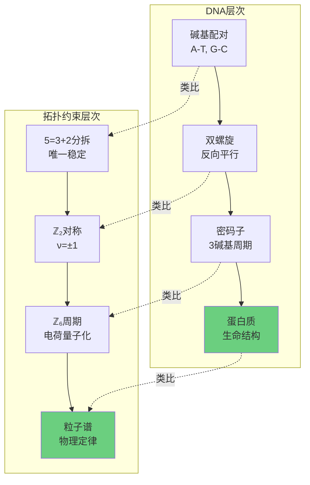

**核心类比**：

> 就像DNA的四个碱基(A,T,C,G)通过配对规则、双螺旋、密码子编码了所有生命形态的遗传信息；
>
> 拓扑约束通过穿孔、相对上同调、ℤ₂环量、群约化编码了所有物理定律的"宇宙DNA"。

## 未解答的问题与下一步探索

### 本章已解答的问题

✓ 为什么需要相对拓扑而非绝对拓扑？
→ 因为满域可缩，必须穿孔

✓ 相对上同调类$[K]$的精确定义是什么？
→ 三项分解：$w_2 + \mu \smile \mathfrak{w} + \rho(c_1)$

✓ 如何实验检测拓扑约束？
→ ℤ₂环量$\nu(\gamma)$，通过Berry相位、时间晶体等

✓ 标准模型规范群从何而来？
→ 5维穿孔密度矩阵的群约化$S(U(3) \times U(2))$

✓ 为什么夸克带分数电荷？
→ ℤ₆商群导致$q_{\min} = 1/6$

✓ Gauss-Bonnet定理的因果诠释是什么？
→ 曲率是因果约束冗余密度，积分拓扑固定

### 仍待探索的深层问题

**问题1**：拓扑约束如何与范畴论终对象联系？

第08章给出了拓扑约束的局域版本（在小因果钻石上）。但在**全局宇宙尺度**，如何确保所有局域拓扑约束的一致性？

**提示**：这需要**范畴论终对象**的框架（第09章）。

**问题2**：为什么宇宙"选择"了$[K]=0$？

我们证明了：几何-能量一致性 → $[K]=0$。但更根本的问题是：**为什么宇宙满足几何-能量一致性？**

**提示**：这需要**统一变分原理**（第11章）。

**问题3**：5维密度矩阵与物理宇宙有何对应？

我们从抽象的5维密度矩阵流形导出标准模型。但**5维希尔伯特空间对应物理上的什么？**

**提示**：这需要**矩阵宇宙假说**（第10章）。

**问题4**：时间、空间、物质如何从拓扑约束涌现？

拓扑约束固定了规范群和粒子谱，但**时空本身从何而来？**

**提示**：这需要**QCA宇宙模型**（第09章），时空作为量子元胞自动机的涌现结构。

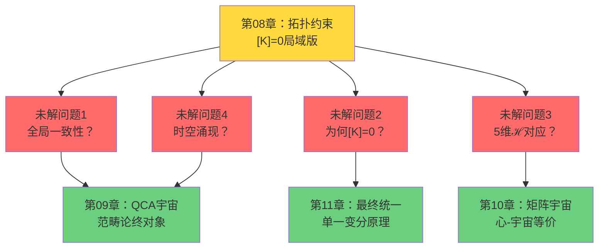

## 下一章预告：量子元胞自动机宇宙

在下一章（第09章），我们将进入更宏大的视野：**将整个物理宇宙理解为量子元胞自动机（QCA）**。

### 核心思想

**QCA公理化**：
1. 时空是离散的量子元胞阵列
2. 演化由局域幺正规则控制
3. 连续场论作为长波极限涌现

**范畴论终对象**：
物理宇宙$\mathfrak{U}^*_{\mathrm{phys}}$是2-范畴中的**终对象**，满足：
- 对任何其他对象$\mathfrak{U}$，存在唯一态射$\mathfrak{U} \to \mathfrak{U}^*_{\mathrm{phys}}$
- 终对象的自态射$\mathrm{End}(\mathfrak{U}^*_{\mathrm{phys}})$编码所有物理对称性

**与拓扑约束的联系**：
$$
[K] = 0 \Leftrightarrow \mathfrak{U}^*_{\mathrm{phys}} \text{是终对象}
$$

**三重范畴等价**：
$$
\mathcal{C}_{\mathrm{QCA}} \simeq \mathcal{C}_{\mathrm{Geom}} \simeq \mathcal{C}_{\mathrm{Matrix}}
$$
- QCA范畴：量子元胞自动机
- 几何范畴：流形与因果结构
- 矩阵范畴：密度矩阵与散射理论

### 关键问题

**为什么拓扑约束$[K]=0$在全局尺度成立？**

**答案预览**：因为物理宇宙必须是2-范畴的终对象，而终对象的存在性**强制**$[K]=0$。

这是一个比Einstein方程更深层的约束——不是动力学方程，而是**范畴论存在性定理**！

## 总结：五个环节，一条必然链

让我们最后一次回顾拓扑约束的完整逻辑链条：

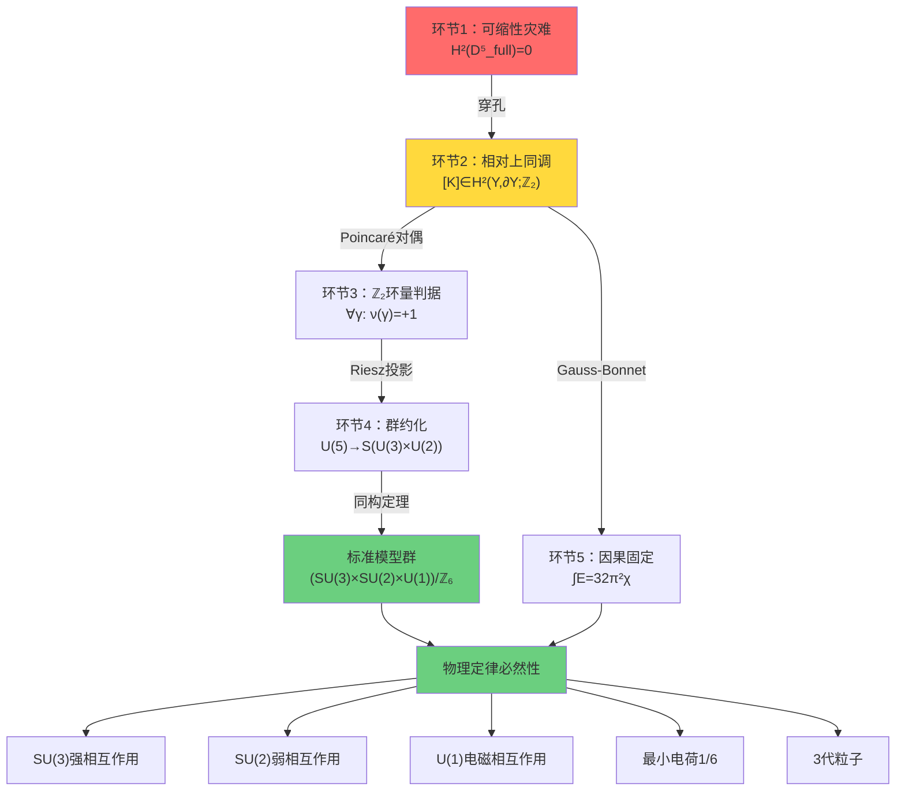

**最终洞察**：

> 宇宙不是在无限可能中"选择"了标准模型。
>
> 而是拓扑一致性只留下**唯一的可能**——标准模型。
>
> 这不是"微调"，而是必然。
>
> 这不是"巧合"，而是数学。
>
> 这不是"人择原理"，而是拓扑定理。

**拓扑约束告诉我们**：

物理定律的深层结构不是写在"自然法则之书"上的任意条文，而是镌刻在时空拓扑中的**几何必然**。

就像圆的周长与直径之比必然是π，标准模型的规范群必然是$(SU(3) \times SU(2) \times U(1))/\mathbb{Z}_6$。

**这就是拓扑约束的终极意义**——从偶然到必然，从现象到本质，从经验到原理。

**让我们继续前进**，在下一章探索更宏大的图景：宇宙作为量子元胞自动机的范畴论终对象！
