# Topological Constraints Summary: Inevitable Chain from Puncturing to Physical Laws

We have completed core content of topological constraints chapter. Now it's time to look back from high ground and understand **ultimate position of topological constraints in unified theory**.

## Complete Chain: Logical Derivation of Five Links

### Link 1: Contractibility Disaster → Necessity of Puncturing

**Core Question**: Why is full-rank density matrix manifold a topological vacuum?

**Answer**: Contractibility theorem (Section 01)
$$\mathcal{D}_N^{\mathrm{full}} \text{contractible} \Rightarrow H^2(\mathcal{D}_N^{\mathrm{full}}; \mathbb{Z}_2) = 0$$

**Proof**: Contraction map $H_t(\rho) = (1-t)\rho + t \cdot I/N$ explicitly continuously contracts any state to maximally mixed state.

**Physical Meaning**: On full domain, all quantum states are topologically indistinguishable, no integer-valued topological invariants available for phase classification.

**Solution**: Puncturing operation
$$\mathcal{D}^{\mathrm{exc}} = \mathcal{D}_5^{\mathrm{full}} \setminus \mathrm{Tub}_\varepsilon(\Sigma_{3|2})$$
Remove tubular neighborhood of three-two level degeneracy set, breaking contractibility.

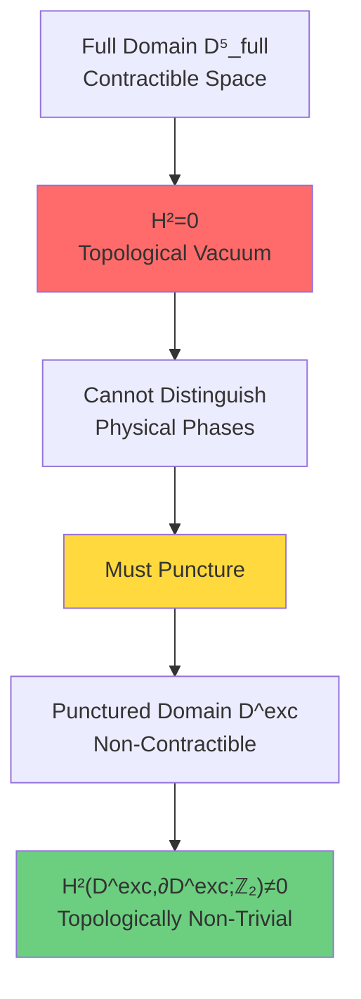

### Link 2: Puncturing → Relative Cohomology Class [K]

**Core Construction**: Pair space $(Y, \partial Y)$ (Section 02)
$$Y = M \times X^\circ, \quad \partial Y = (\partial M \times X^\circ) \cup (M \times \partial X^\circ)$$

**Definition**: Relative cohomology class
$$[K] \in H^2(Y, \partial Y; \mathbb{Z}_2)$$

**Three-Term Decomposition**:
$$[K] = \underbrace{\pi_M^* w_2(TM)}_{\text{geometric term}} + \underbrace{\sum_j \pi_M^* \mu_j \smile \pi_X^* \mathfrak{w}_j}_{\text{mixed term}} + \underbrace{\pi_X^* \rho(c_1(\mathcal{L}_S))}_{\text{scattering term}}$$

**Physical Meaning Triple Decomposition**:

| Term | Mathematical Object | Physical Meaning |
|------|-------------------|------------------|
| First Term | Stiefel-Whitney class $w_2(TM)$ | Existence of spacetime spin structure |
| Second Term | Cup product $\mu_j \smile \mathfrak{w}_j$ | Spacetime-parameter topology coupling |
| Third Term | Chern class reduction $\rho(c_1(\mathcal{L}_S))$ | Winding number of scattering phase |

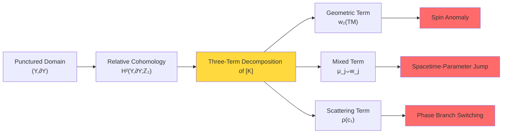

### Link 3: [K] → ℤ₂ Holonomy Criterion

**Equivalent Characterization Theorem** (Section 03):
$$[K] = 0 \iff \forall \gamma \in \mathcal{C}_{\mathrm{adm}}:\ \nu_{\sqrt{\det S}}(\gamma) = +1$$

**ℤ₂ Holonomy Definition**:
$$\nu_{\sqrt{\det S}}(\gamma) = \frac{\sqrt{\det S}|_{\gamma \text{end}}}{\sqrt{\det S}|_{\gamma \text{start}}} = \pm 1$$

**Relationship with Winding Number**:
$$\nu_{\sqrt{\det S}}(\gamma) = (-1)^{\deg(\det S|_\gamma)}$$

**Physical Observability**:
- $\nu = +1$: Scattering square root single-valued along loop, no topological anomaly
- $\nu = -1$: Scattering square root flips branch, π phase jump exists

**Experimental Detection Schemes**:
1. Purification interference loop: Measure Berry phase
2. Time crystal order parameter: Detect subharmonic response
3. Topological qubit: Adiabatic transport phase readout

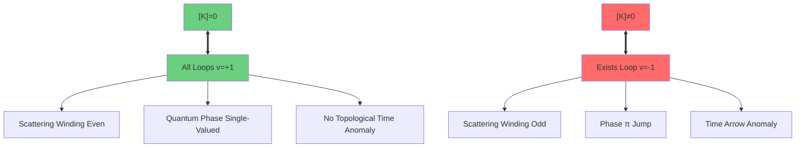

### Link 4: Topological Reduction → Standard Model Group Structure

**Core Theorem** (Section 04): Group isomorphism
$$S(U(3) \times U(2)) \cong \frac{SU(3) \times SU(2) \times U(1)}{\mathbb{Z}_6}$$

**Derivation Steps**:

**Step 1**: Riesz spectral projection
$$P_3(\rho) = \frac{1}{2\pi i} \oint_{\gamma_\rho} (z - \rho)^{-1} dz$$
Smoothly defines rank 3 and rank 2 projections on punctured domain $\mathcal{D}^{\mathrm{exc}}$.

**Step 2**: Principal bundle reduction
$$U(5) \to U(3) \times U(2)$$
Structure group reduction of Uhlmann principal bundle, unitary transformations preserving 3-2 splitting.

**Step 3**: Determinant balance
$$\det_{U(3)} \times \det_{U(2)} = 1$$
Volume conservation condition forces special unitary group:
$$S(U(3) \times U(2)) = \{(A,B) \in U(3) \times U(2) : \det A \cdot \det B = 1\}$$

**Step 4**: Group isomorphism proof

Construct homomorphism:
$$\phi: S(U(3) \times U(2)) \to \frac{SU(3) \times SU(2) \times U(1)}{\mathbb{Z}_6}$$
$$\phi(A, B, z) = (z^2 A, z^{-3} B) \mod \mathbb{Z}_6$$

Calculate kernel:
$$\ker \phi = \{(\omega^k I_3, \omega^{-k} I_2, \omega^{-2k}) : k = 0,1,\ldots,5\} \cong \mathbb{Z}_6$$
where $\omega = e^{2\pi i/6}$ is 6th root of unity.

By first isomorphism theorem:
$$\frac{S(U(3) \times U(2))}{\mathbb{Z}_6} \cong \frac{SU(3) \times SU(2) \times U(1)}{\mathbb{Z}_6}$$

**Physical Consequences**:

1. **Minimal Charge Quantization**: ℤ₆ quotient group → charge unit $q_{\min} = 1/6$
   - Up quark: $q = +2/3 = 4 \times (1/6)$
   - Down quark: $q = -1/3 = -2 \times (1/6)$
   - Electron: $q = -1 = -6 \times (1/6)$

2. **Particle Algebra**: ℂP² index theorem → exactly 3 generations

3. **Hypercharge Discrete Spectrum**: $Y \in \frac{1}{3}\mathbb{Z}$

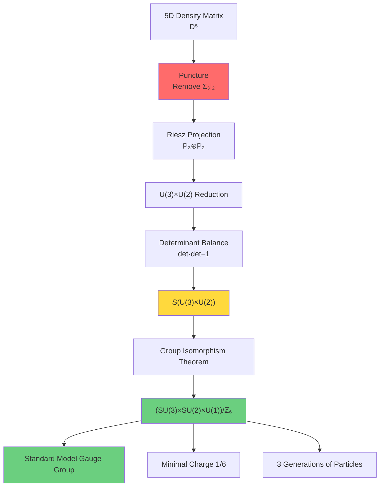

### Link 5: Causal Structure → Gauss-Bonnet Topological Fixation

**Core Idea** (Section 05): Curvature as "redundancy density of causal constraints"

**Causal Reconstruction Chain**:
$$\text{Causal Partial Order}(M, \leq) \Rightarrow \text{Alexandrov Topology} \Rightarrow \text{Conformal Class}[g] \Rightarrow \text{Euler Characteristic}\chi(M)$$

**Gauss-Bonnet Theorem (4D)**:
$$\int_M E(R) \sqrt{|g|} \, d^4x = 32\pi^2 \chi(M)$$
where Euler density:
$$E(R) = R_{abcd}R^{abcd} - 4R_{ab}R^{ab} + R^2$$

**Physical Interpretation**:

1. **Flat Spacetime** (Minkowski):
   - $R_{abcd} = 0$ → $E = 0$
   - $\chi(\mathbb{R}^4) = 1$ (contractible)
   - Causal constraints globally compatible, no redundancy

2. **Curved Spacetime**:
   - $R_{abcd} \neq 0$ → $E \neq 0$
   - Curvature is "cost" of causal constraints not globally reconcilable
   - Gauss-Bonnet integral = topologically fixed "total redundancy"

**Variational Principle Interpretation**:
$$\mathcal{F}[g] = \mathcal{C}(\mathrm{Reach}(g)) + \lambda \int |R|^2 dV$$
- First term: Description complexity of causal reachability
- Second term: Square penalty of curvature (regularization)

Optimal metric balances "description length" with "curvature cost".

**Connection with [K]=0**:

Under unified variational principle, Einstein equation + second-order entropy non-negative → $[K]=0$.

And Einstein equation determines curvature, therefore:
$$\text{Topological Constraint}[K]=0 \Leftrightarrow \text{Geometric Constraint}(\text{Einstein Equation}) \Leftrightarrow \text{Causal Constraint}(\text{Alexandrov Topology})$$

Three are **triple manifestations** of same constraint!

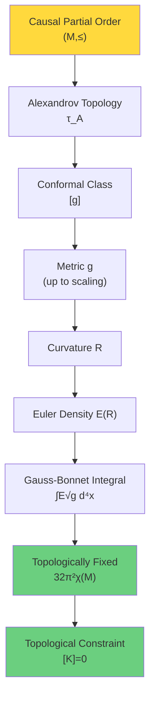

## Unification of Three Perspectives: Topology-Algebra-Geometry Trinity

### Perspective 1: Topological Perspective

**Language**: Relative cohomology
$$[K] \in H^2(Y, \partial Y; \mathbb{Z}_2)$$

**Constraint**: Topological class must be trivial
$$[K] = 0$$

**Physical Meaning**: No topological obstruction, quantum phase globally consistent

### Perspective 2: Algebraic Perspective

**Language**: ℤ₂ holonomy
$$\nu_{\sqrt{\det S}}: H_1(X^\circ, \partial X^\circ; \mathbb{Z}_2) \to \mathbb{Z}_2$$

**Constraint**: All loop holonomies trivial
$$\forall \gamma:\ \nu(\gamma) = +1$$

**Physical Meaning**: Scattering determinant winding even, no π phase jump

### Perspective 3: Geometric Perspective

**Language**: Euler characteristic
$$\chi(M) = \sum_{k=0}^{\dim M} (-1)^k b_k$$

**Constraint**: Gauss-Bonnet integral topologically fixed
$$\int_M E(R) \sqrt{|g|} \, d^4x = 32\pi^2 \chi(M)$$

**Physical Meaning**: Curvature integral rigidly determined by topology

### Equivalence of Three

**Theorem (Trinity)**:
$$[K] = 0 \iff \forall \gamma: \nu(\gamma) = +1 \iff \text{Einstein Equation} + \delta^2 S_{\mathrm{rel}} \geq 0$$

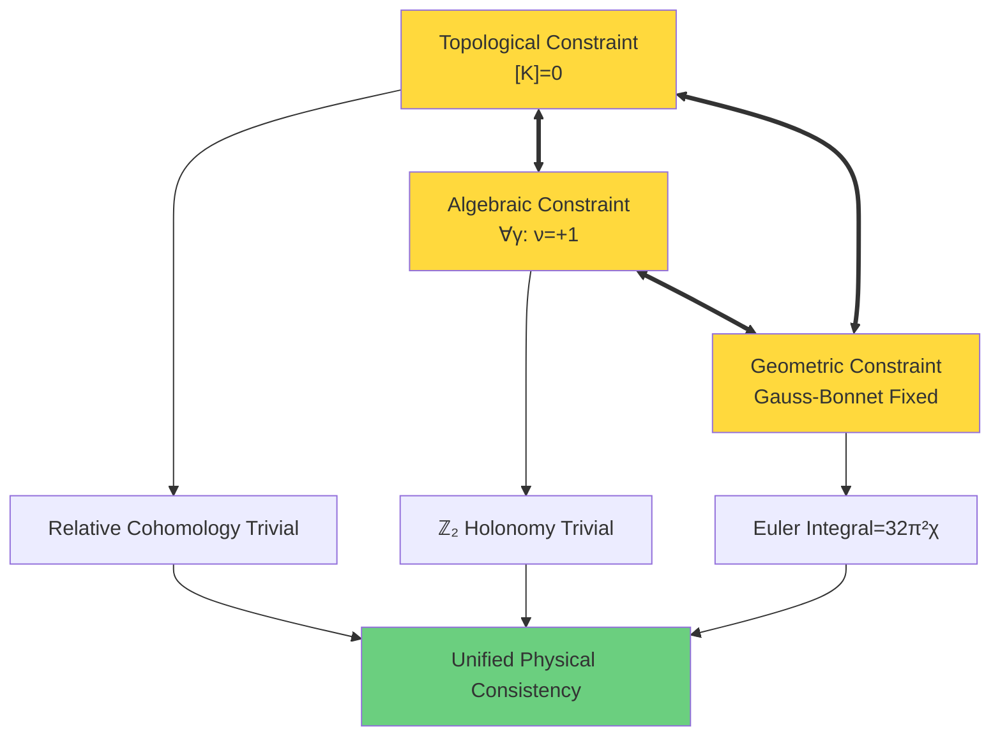

## Position of Topological Constraints in GLS Unified Framework

Reviewing four pillars of unified theory (previous seven chapters):

### Pillar 1: Unified Time Scale (Chapters 00-02)

**Core Identity**:
$$\kappa(\omega) = \frac{\varphi'(\omega)}{\pi} = \rho_{\mathrm{rel}}(\omega) = \frac{1}{2\pi} \mathrm{tr} Q(\omega)$$

**Physical Meaning**:
- $\kappa$: Expansion factor (geometric time)
- $\varphi'/\pi$: Scattering phase derivative (dynamical time)
- $\rho_{\mathrm{rel}}$: Relative state density (quantum time)
- $\mathrm{tr} Q/(2\pi)$: Boundary time flow (boundary time)

**Role of Topological Constraints**:
$[K]=0$ ensures scattering phase $\varphi(\omega)$ is single-valued along all loops, making $\kappa(\omega)$ globally definable.

### Pillar 2: Boundary Theory (Chapters 03-04)

**Core Principles**:
- Energy definition: $E_{\mathrm{can}} = \langle K_\partial \rangle$ (boundary modular time)
- Entropy definition: $S = S_{\mathrm{can}} = -\mathrm{tr}(\rho_{\mathrm{can}} \log \rho_{\mathrm{can}})$

**Role of Topological Constraints**:
- Second-order relative entropy non-negative $\delta^2 S_{\mathrm{rel}} \geq 0$ and $[K]=0$ mutually imply
- Topological consistency ensures modular time and scattering time align

### Pillar 3: Causal Structure (Chapters 05-06)

**Core Theorems**:
- Alexandrov topology reconstructed from causal partial order
- Causal structure determines conformal class
- Curvature generated from description complexity of causal constraints

**Role of Topological Constraints**:
- Gauss-Bonnet fixes curvature integral = $32\pi^2 \chi(M)$
- $[K]=0$ equivalent to causal consistency

### Pillar 4: Topological Constraints (Chapter 08, this chapter)

**Core Discoveries**:
- Puncturing breaks contractibility → relative topology non-trivial
- Three-term decomposition of relative cohomology class $[K]$
- ℤ₂ holonomy criterion $\nu(\gamma) = +1$
- Group reduction → Standard Model gauge group
- Gauss-Bonnet topological fixation

**Unifying Role**:
$[K]=0$ is **consistency axiom**, unifying three pillars of time, boundary, causality under single topological constraint.

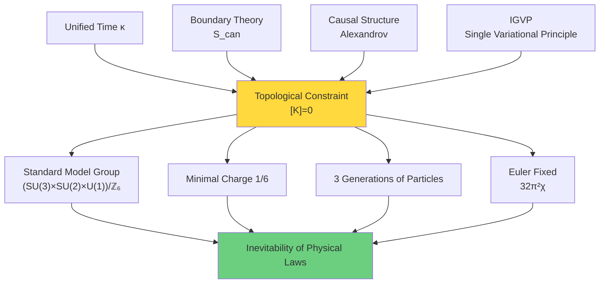

## Philosophical Meaning: From Accidental to Inevitable

### Confusion of Traditional Particle Physics

**Question 1**: Why SU(3)×SU(2)×U(1) instead of other gauge groups?
- Traditional answer: Experimentally discovered, historical accident

**Question 2**: Why exactly 3 generations of particles?
- Traditional answer: Don't know, possibly fine-tuning

**Question 3**: Why do quarks carry fractional charges 1/3, 2/3?
- Traditional answer: Result of SU(3) representation theory, but why SU(3)?

### Revolutionary Answer of Topological Constraints

**Answer 1**: Gauge group inevitably derived from punctured topology of 5D density matrix
$$\text{Puncture}(\mathcal{D}_5^{\mathrm{full}} \setminus \Sigma_{3|2}) \Rightarrow S(U(3) \times U(2)) \cong \frac{SU(3) \times SU(2) \times U(1)}{\mathbb{Z}_6}$$

**Answer 2**: 3 generations inevitably derived from ℂP² index theorem
$$\chi(\mathbb{CP}^2) = 3 \Rightarrow 3\ \text{generations}$$

**Answer 3**: Fractional charges inevitably derived from ℤ₆ quotient group
$$\mathbb{Z}_6 \text{quotient} \Rightarrow q_{\min} = 1/6$$

### Chain of Inevitability

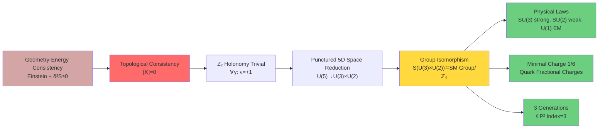

**Core Insight**:

> **Physical laws are not arbitrary choices of nature, but inevitable results of geometry-topology consistency.**
>
> Just as in Euclidean geometry, sum of triangle angles being 180° is not "coincidence", but logical consequence of flat space axioms;
>
> Standard Model gauge group structure, particle algebra, charge quantization are logical consequences of punctured topology of density matrix manifold.

## Popular Analogy: "DNA Code" of Universe

Let's use a biological analogy to understand topological constraints:

### Four Levels of DNA

**Level 1: Base Pairing Rules**
- Adenine (A) pairs with Thymine (T)
- Guanine (G) pairs with Cytosine (C)
- This is not accidental, but inevitable from optimal chemical bond energy

**Analogy**: 5 = 3 + 2 splitting
- Unique stable splitting of 5D space
- Not accidental, but inevitable from topological reduction

### Level 2: Double Helix Structure

**DNA**: Antiparallel double strands
- One strand 5'→3', other 3'→5'
- This ensures replication fidelity

**Analogy**: ℤ₂ Symmetry
- Branch selection of scattering determinant square root
- $\nu = \pm 1$ encodes "direction"
- $[K]=0$ ensures global consistency

### Level 3: Codon Period

**DNA**: 3 bases per group (codon)
- 4³ = 64 combinations encode 20 amino acids
- Degeneracy exists (multiple codons encode same amino acid)

**Analogy**: ℤ₆ Periodicity
- $(SU(3) \times SU(2) \times U(1))/\mathbb{Z}_6$
- 6 equivalence classes of ℤ₆ quotient group
- Leads to charge $q \in \frac{1}{6}\mathbb{Z}$

### Level 4: Gene Expression → Protein

**DNA** → **RNA** → **Protein**: Central dogma
- DNA information → Physical structure
- Inevitability of genetic code determines life forms

**Analogy**: Topology → Algebra → Physics
- Topological constraint $[K]$ → Gauge group → Particle spectrum
- Inevitability of topological code determines physical laws

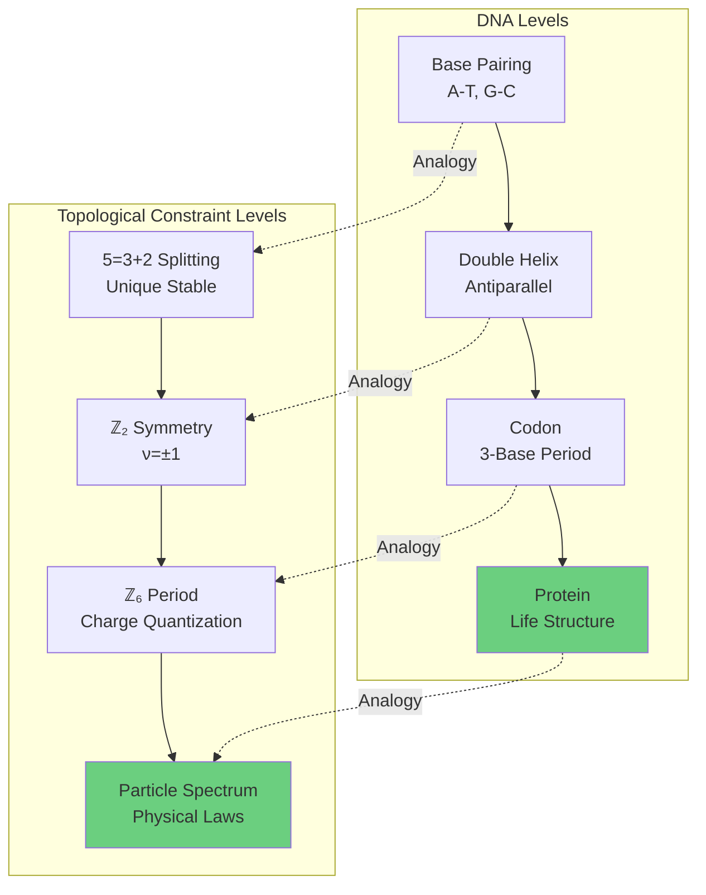

**Core Analogy**:

> Just as four bases of DNA (A,T,C,G) encode genetic information of all life forms through pairing rules, double helix, codons;
>
> Topological constraints encode "cosmic DNA" of all physical laws through puncturing, relative cohomology, ℤ₂ holonomy, group reduction.

## Unanswered Questions and Next Explorations

### Questions Answered in This Chapter

✓ Why relative topology instead of absolute topology?
→ Because full domain contractible, must puncture

✓ What is precise definition of relative cohomology class $[K]$?
→ Three-term decomposition: $w_2 + \mu \smile \mathfrak{w} + \rho(c_1)$

✓ How to experimentally detect topological constraints?
→ ℤ₂ holonomy $\nu(\gamma)$, through Berry phase, time crystals, etc.

✓ Where does Standard Model gauge group come from?
→ Group reduction of 5D punctured density matrix $S(U(3) \times U(2))$

✓ Why do quarks carry fractional charges?
→ ℤ₆ quotient group leads to $q_{\min} = 1/6$

✓ What is causal interpretation of Gauss-Bonnet theorem?
→ Curvature is redundancy density of causal constraints, integral topologically fixed

### Deep Questions Still to Explore

**Question 1**: How do topological constraints connect with categorical terminal object?

Chapter 08 gives local version of topological constraints (on small causal diamonds). But at **global cosmic scale**, how to ensure consistency of all local topological constraints?

**Hint**: This requires framework of **categorical terminal object** (Chapter 09).

**Question 2**: Why does universe "choose" $[K]=0$?

We proved: geometry-energy consistency → $[K]=0$. But more fundamental question: **Why does universe satisfy geometry-energy consistency?**

**Hint**: This requires **unified variational principle** (Chapter 11).

**Question 3**: What corresponds to 5D density matrix in physical universe?

We derived Standard Model from abstract 5D density matrix manifold. But **what does 5D Hilbert space correspond to physically?**

**Hint**: This requires **matrix universe hypothesis** (Chapter 10).

**Question 4**: How do time, space, matter emerge from topological constraints?

Topological constraints fix gauge group and particle spectrum, but **where does spacetime itself come from?**

**Hint**: This requires **QCA universe model** (Chapter 09), spacetime as emergent structure of quantum cellular automaton.

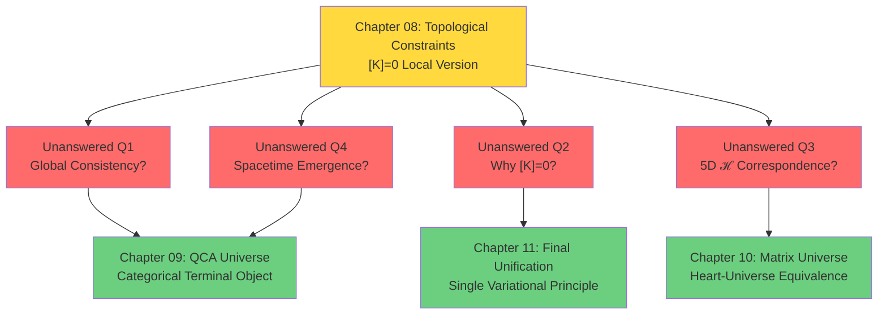

## Preview of Next Chapter: Quantum Cellular Automaton Universe

In next chapter (Chapter 09), we will enter grander vision: **Understanding entire physical universe as quantum cellular automaton (QCA)**.

### Core Ideas

**QCA Axiomatization**:
1. Spacetime is discrete quantum cellular array
2. Evolution controlled by local unitary rules
3. Continuous field theory emerges as long-wavelength limit

**Categorical Terminal Object**:
Physical universe $\mathfrak{U}^*_{\mathrm{phys}}$ is **terminal object** in 2-category, satisfying:
- For any other object $\mathfrak{U}$, exists unique morphism $\mathfrak{U} \to \mathfrak{U}^*_{\mathrm{phys}}$
- Endomorphisms $\mathrm{End}(\mathfrak{U}^*_{\mathrm{phys}})$ of terminal object encode all physical symmetries

**Connection with Topological Constraints**:
$$[K] = 0 \Leftrightarrow \mathfrak{U}^*_{\mathrm{phys}} \text{is terminal object}$$

**Triple Categorical Equivalence**:
$$\mathcal{C}_{\mathrm{QCA}} \simeq \mathcal{C}_{\mathrm{Geom}} \simeq \mathcal{C}_{\mathrm{Matrix}}$$
- QCA category: Quantum cellular automata
- Geometry category: Manifolds and causal structures
- Matrix category: Density matrices and scattering theory

### Key Question

**Why does topological constraint $[K]=0$ hold at global scale?**

**Answer Preview**: Because physical universe must be terminal object of 2-category, and existence of terminal object **forces** $[K]=0$.

This is deeper constraint than Einstein equation—not dynamical equation, but **categorical existence theorem**!

## Summary: Five Links, One Inevitable Chain

Let's review complete logical chain of topological constraints one last time:

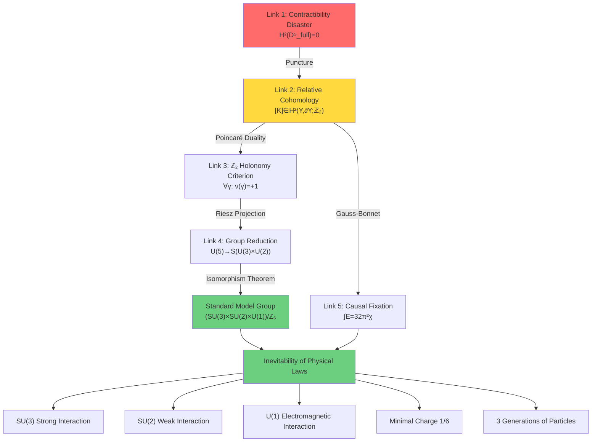

**Final Insight**:

> Universe did not "choose" Standard Model from infinite possibilities.
>
> Topological consistency leaves only **one possibility**—Standard Model.
>
> This is not "fine-tuning", but inevitability.
>
> This is not "coincidence", but mathematics.
>
> This is not "anthropic principle", but topological theorem.

**Topological Constraints Tell Us**:

Deep structure of physical laws is not arbitrary articles written in "book of natural laws", but **geometric inevitability** engraved in spacetime topology.

Just as ratio of circle's circumference to diameter must be π, gauge group of Standard Model must be $(SU(3) \times SU(2) \times U(1))/\mathbb{Z}_6$.

**This is ultimate meaning of topological constraints**—from accidental to inevitable, from phenomena to essence, from experience to principle.

**Let's continue forward**, exploring grander picture in next chapter: Universe as categorical terminal object of quantum cellular automaton!

