# QCA宇宙：从离散到连续的终极统一

在前八章中，我们建立了统一时间刻度、边界理论、因果结构和拓扑约束的框架。现在我们面临一个更根本的问题：

> **物理宇宙的本体是什么？时空、物质、场论从何而来？**

本章将给出一个震撼的答案：

> **宇宙本质上是一个量子元胞自动机（Quantum Cellular Automaton, QCA）。**所有连续的物理理论——量子场论、广义相对论、标准模型——都是QCA在长波极限下的**涌现**现象。

## 从连续到离散：范式的逆转

### 传统物理学的连续假设

在标准的物理学框架中：
- **时空是连续的**：实数坐标$(t, x, y, z) \in \mathbb{R}^4$
- **场是连续的**：$\phi(x)$在每个时空点都有定义
- **演化是连续的**：Schrödinger方程$i\hbar \partial_t |\psi\rangle = H|\psi\rangle$

这个连续框架极其成功，但在基础层面存在深刻问题：
1. 无穷大困难：紫外发散、黑洞奇点
2. 测量问题：连续Hilbert空间的无限维度
3. 本体论模糊：时空在量子引力中到底是什么？

### QCA范式的离散革命

量子元胞自动机提出完全不同的本体论：
- **时间是离散的**：整数时间步$n \in \mathbb{Z}$
- **空间是离散的**：可数格点集合$\Lambda$（如$\mathbb{Z}^d$）
- **状态是有限维的**：每个格点Hilbert空间$\mathcal{H}_{\text{cell}} \cong \mathbb{C}^d$
- **演化是局域幺正的**：单步演化$U$仅在有限邻域内作用

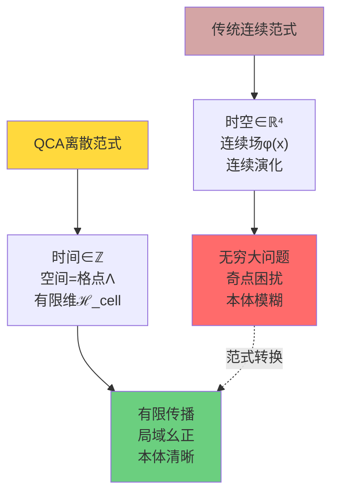

**关键洞察**：
> 连续物理不是基本的，而是离散QCA在适当极限$(格距 \to 0,\ 时间步 \to 0)$下的**有效描述**。

## QCA宇宙的五元组定义

### 宇宙对象$\mathfrak{U}_{\text{QCA}}$

一个宇宙QCA对象由五个成分组成：
$$
\mathfrak{U}_{\text{QCA}} = (\Lambda, \mathcal{H}_{\text{cell}}, \mathcal{A}, \alpha, \omega_0)
$$

让我们逐一理解：

**成分1：离散空间$\Lambda$**
- 可数无限连通图的顶点集合
- 通常取标准晶格$\Lambda = \mathbb{Z}^d$（$d$维空间）
- 图距离$\text{dist}(x,y)$定义"离散距离"

**成分2：元胞Hilbert空间$\mathcal{H}_{\text{cell}}$**
- 有限维复向量空间$\mathcal{H}_{\text{cell}} \cong \mathbb{C}^d$
- $d$是每个格点的**局域自由度维数**
- 例如：自旋$d=2$，色+味$d=18$

**成分3：准局域$C^*$代数$\mathcal{A}$**
- 全空间Hilbert空间：$\mathcal{H} = \overline{\bigotimes_{x \in \Lambda} \mathcal{H}_x}$（无限张量积）
- 局域代数：$\mathcal{A}_F = \mathcal{B}(\mathcal{H}_F)$对有限集$F \Subset \Lambda$
- 准局域代数：$\mathcal{A} = \overline{\bigcup_{F \Subset \Lambda} \mathcal{A}_F}$（完备化）

**成分4：QCA演化$\alpha$**
- $C^*$代数自同构$\alpha: \mathcal{A} \to \mathcal{A}$
- **有限传播半径**$R$：支撑在$F$上的算符，演化后支撑在$B_R(F)$内
- **平移协变**：与空间平移对易

**成分5：初始宇宙态$\omega_0$**
- 归一态$\omega_0: \mathcal{A} \to \mathbb{C}$
- 物理解释：宇宙在$n=0$时刻的量子态
- 时间演化：$\omega_n = \omega_0 \circ \alpha^{-n}$

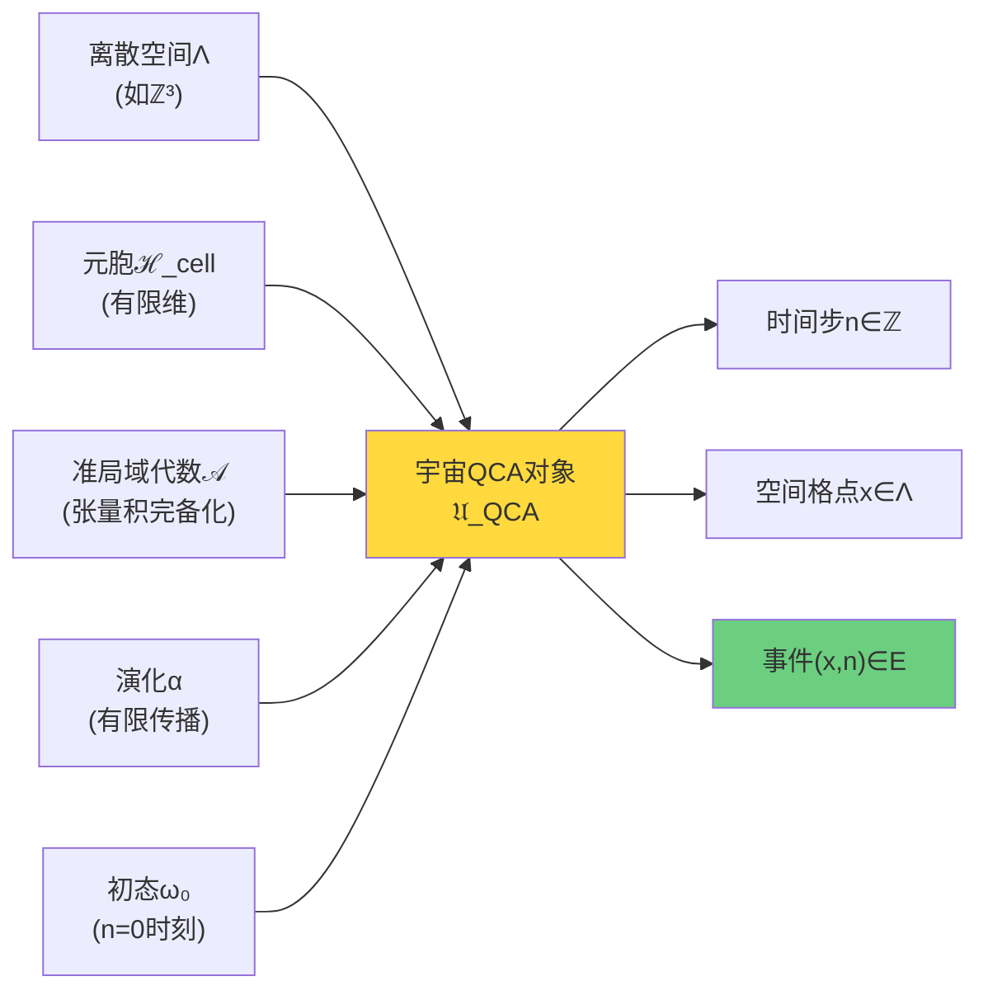

## QCA的三个核心性质

### 性质1：局域性与有限传播

**定义（有限传播半径）**：
存在$R \in \mathbb{N}$，使得对任意支撑在有限集$F$上的算符$A \in \mathcal{A}_F$：
$$
\text{supp}(\alpha^n(A)) \subset B_{nR}(F) := \{y : \text{dist}(y, F) \leq nR\}
$$

**物理意义**：
- 信息传播有最大速度$v_{\max} = R/\Delta t$（$\Delta t$为时间步长）
- 类似相对论的**光速极限**
- 因果结构从局域性自然涌现

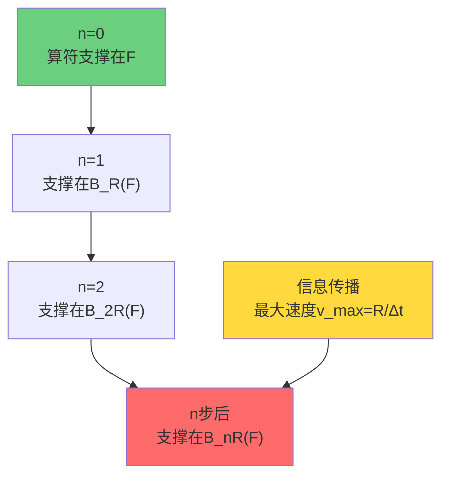

**定理（因果结构涌现）**：
定义事件集合$E = \Lambda \times \mathbb{Z}$，几何关系：
$$
(x,n) \leq_{\text{geo}} (y,m) \iff m \geq n \text{ 且 } \text{dist}(x,y) \leq R(m-n)
$$
则$\leq_{\text{geo}}$是$E$上的**局域有限偏序**，定义了QCA的因果结构。

### 性质2：平移协变与对称性

**定义（平移作用）**：
对$\Lambda = \mathbb{Z}^d$，平移$\tau_a: x \mapsto x + a$（$a \in \mathbb{Z}^d$）诱导代数自同构：
$$
\theta_a(A)(x_1, \ldots) = A(x_1 - a, \ldots)
$$

**平移协变条件**：
$$
\alpha \circ \theta_a = \theta_a \circ \alpha,\quad \forall a \in \mathbb{Z}^d
$$

**物理意义**：
- 宇宙在空间平移下不变（空间齐次性）
- 对应连续理论的**动量守恒**
- 允许傅里叶分析$\to$色散关系$E(k)$

### 性质3：幺正性与可逆性

**定理（Schumacher-Werner）**：
满足有限传播和平移协变的QCA $\alpha$可以由幺正算符$U$在某个GNS表示中实现：
$$
\alpha(A) = U^\dagger A U
$$

**物理含义**：
- QCA演化保持概率（幺正性）
- 演化完全可逆（信息守恒）
- 类似量子力学的**幺正演化**

## 从QCA到连续场论：连续极限的奇迹

### Dirac方程从QCA涌现

考虑一维QCA（$\Lambda = \mathbb{Z}$），元胞空间$\mathcal{H}_{\text{cell}} = \mathbb{C}^2$（两分量）。

**离散Dirac型QCA**：
定义单步演化（在动量空间）：
$$
\hat{U}(k) = \begin{pmatrix}
\cos\theta(k) & i\sin\theta(k) \\
i\sin\theta(k) & \cos\theta(k)
\end{pmatrix} e^{-iE(k)\Delta t}
$$
其中$\theta(k) = ka$（$a$为格距），$E(k) = mc^2/\hbar$（色散关系）。

**连续极限**：
取$a \to 0$，$\Delta t \to 0$，保持$c = a/\Delta t$固定。展开：
$$
\psi(x, t+\Delta t) \approx \psi(x,t) + i\Delta t H_{\text{Dirac}} \psi(x,t)
$$
其中
$$
H_{\text{Dirac}} = -i\hbar c \sigma_x \partial_x + mc^2 \sigma_z
$$

**惊人结果**：离散QCA在长波极限精确给出**Dirac方程**！
$$
i\hbar \partial_t \psi = H_{\text{Dirac}} \psi
$$

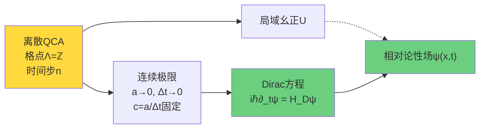

### 标准模型的QCA实现

**规范自由度的实现**：
在QCA的边自由度上引入规范Hilbert空间：
$$
\mathcal{H}_{\text{edge}} = \text{SU}(3) \times \text{SU}(2) \times \text{U}(1)
$$
对每条有向边$(x,y) \in \Lambda^1$。

**规范QCA定义**：
$$
\mathfrak{U}_{\text{QCA}}^{\text{gauge}} = (\Lambda, \mathcal{H}_{\text{cell}}, \mathcal{H}_{\text{gauge}}, \mathcal{A}, \alpha, \omega_0, \mathsf{G}_{\text{loc}})
$$
其中$\mathsf{G}_{\text{loc}}$是局域规范变换群。

**场论涌现定理**（第05节详细证明）：
在适当连续极限下，规范QCA给出**Yang-Mills理论**：
$$
\mathcal{L}_{\text{YM}} = -\frac{1}{4} F^a_{\mu\nu} F^{a\mu\nu}
$$
并与第08章的拓扑约束相容。

## 范畴论视角：终对象的必然性

### 为什么需要范畴论？

到目前为止，我们有多种描述"宇宙"的方式：
- **几何宇宙**：洛伦兹流形$(M, g)$
- **散射宇宙**：散射矩阵$S(\omega)$与统一时间刻度$\kappa(\omega)$
- **QCA宇宙**：离散QCA对象$\mathfrak{U}_{\text{QCA}}$
- **矩阵宇宙**：密度矩阵流形$\mathcal{D}_N$（第10章）

**问题**：这些描述是等价的吗？如果是，如何严格证明？

**答案**：范畴论的**终对象**概念提供了统一框架。

### 2-范畴$\mathbf{Univ}_{\mathcal{U}}$

**定义**：固定Grothendieck宇宙$\mathcal{U}$，定义2-范畴$\mathbf{Univ}_{\mathcal{U}}$：

- **对象**：多层宇宙结构
  $$
  \mathfrak{U} = (U_{\text{evt}}, U_{\text{geo}}, U_{\text{QFT}}, U_{\text{scat}}, U_{\text{QCA}}, U_{\text{top}}, \ldots)
  $$
  包含事件集合、几何、场论、散射、QCA、拓扑等层

- **1-态射**：保持结构的函子型映射
  - 例如：保因果偏序的嵌入
  - 例如：保散射刻度的酉等价

- **2-态射**：1-态射之间的自然同构

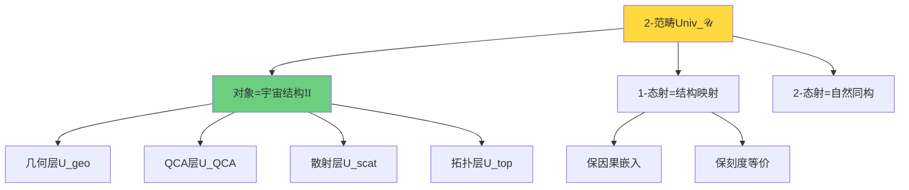

### 终对象定义与物理意义

**定义（2-范畴中的终对象）**：
对象$\mathfrak{U}^*_{\text{phys}} \in \mathbf{Univ}_{\mathcal{U}}$称为**终对象**，如果：

1. **唯一性**：对任意$\mathfrak{U} \in \mathbf{Univ}_{\mathcal{U}}$，存在唯一（至2-同构）的1-态射：
   $$
   \Phi_{\mathfrak{U}}: \mathfrak{U} \to \mathfrak{U}^*_{\text{phys}}
   $$

2. **自态射自明性**：自同态群$\text{End}(\mathfrak{U}^*_{\text{phys}})$恰为物理对称性群

**物理诠释**：

| 数学概念 | 物理意义 |
|---------|---------|
| 终对象$\mathfrak{U}^*_{\text{phys}}$ | 唯一的物理宇宙 |
| 唯一态射$\Phi$ | 任何物理描述必然嵌入物理宇宙 |
| 自态射群$\text{End}$ | 物理对称性（Poincaré群等） |

**哲学含义**：
> 如果$\mathfrak{U}^*_{\text{phys}}$是终对象，则不存在"多个等价但不同"的物理宇宙——物理定律的唯一性由**范畴论存在性定理**保证，而非经验归纳！

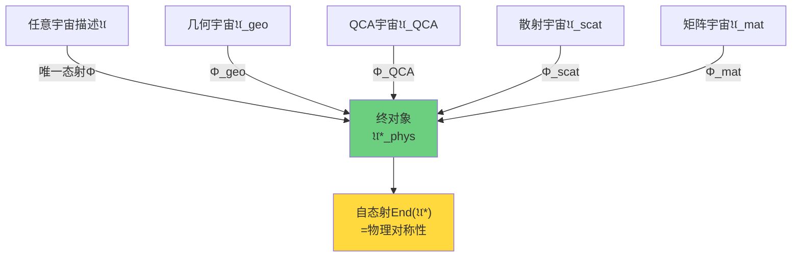

## 三重范畴等价：统一的完整图景

### 三种表象范畴

定义三个子范畴：

**几何宇宙范畴$\mathbf{Univ}^{\text{phys}}_{\text{geo}}$**：
- 对象：洛伦兹流形$(M, g)$+因果结构+广义熵
- 态射：保因果共形嵌入

**矩阵宇宙范畴$\mathbf{Univ}^{\text{phys}}_{\text{mat}}$**：
- 对象：密度矩阵流形$\mathcal{D}_N$+散射$S(\omega)$+统一时间$\kappa$
- 态射：保散射刻度的酉等价

**QCA宇宙范畴$\mathbf{Univ}^{\text{phys}}_{\text{QCA}}$**：
- 对象：QCA对象$\mathfrak{U}_{\text{QCA}}$+连续极限数据
- 态射：保局域性的QCA映射

### 等价定理

**定理（三重范畴等价，第04节详细证明）**：
存在保持统一刻度、因果与熵结构的函子：
$$
\mathbf{Univ}^{\text{phys}}_{\text{geo}} \simeq \mathbf{Univ}^{\text{phys}}_{\text{mat}} \simeq \mathbf{Univ}^{\text{phys}}_{\text{QCA}}
$$

**构造函子**：

1. **$\mathcal{F}_{\text{QCA}\to\text{geo}}$**：QCA → 几何
   - 从QCA局域性重构因果偏序
   - Alexandrov拓扑给出流形
   - 连续极限给出洛伦兹度规

2. **$\mathcal{F}_{\text{geo}\to\text{mat}}$**：几何 → 矩阵
   - 从小因果钻石构造边界代数
   - Tomita-Takesaki模流$\to$密度矩阵
   - Einstein方程$\to$散射矩阵

3. **$\mathcal{F}_{\text{mat}\to\text{QCA}}$**：矩阵 → QCA
   - 密度矩阵谱分解$\to$元胞态
   - 散射幺正$S(\omega) \to$QCA演化$U$
   - 统一时间刻度$\to$离散时间步

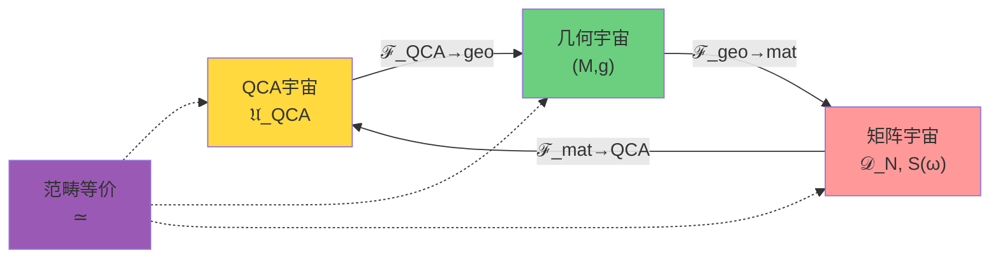

**物理含义**：
> 三种宇宙描述不是"不同的理论"，而是**同一终对象的不同投影**。
>
> 就像3D物体的三视图：正视、侧视、俯视看似不同，但描述同一对象。

## 终对象的一致性条件

### 为什么终对象必然存在？

**定理3.6（终对象存在性，第03节详细证明）**：
在2-范畴$\mathbf{Univ}_{\mathcal{U}}$中，满足以下公理的对象$\mathfrak{U}^*_{\text{phys}}$是唯一的终对象：

**公理1（统一时间刻度）**：
$$
\kappa(\omega) = \frac{\varphi'(\omega)}{\pi} = \rho_{\text{rel}}(\omega) = \frac{1}{2\pi} \text{tr} Q(\omega)
$$
散射、谱移、群延迟三者统一。

**公理2（广义熵单调性）**：
在null边界上：
$$
\delta^2 S_{\text{gen}} = \mathcal{E}_{\text{can}} \geq 0
$$
二阶相对熵非负。

**公理3（拓扑无异常）**：
$$
[K] = 0 \in H^2(Y, \partial Y; \mathbb{Z}_2)
$$
相对上同调类平凡。

**公理4（因果偏序局域有限）**：
事件集合$(E, \preceq)$的因果偏序是局域有限的。

**证明思路**：
1. 公理1-3由前八章已经建立
2. 公理4由QCA有限传播自动满足
3. 这四个公理**强制**唯一的终对象存在
4. 任何违反公理的对象无法嵌入$\mathfrak{U}^*_{\text{phys}}$

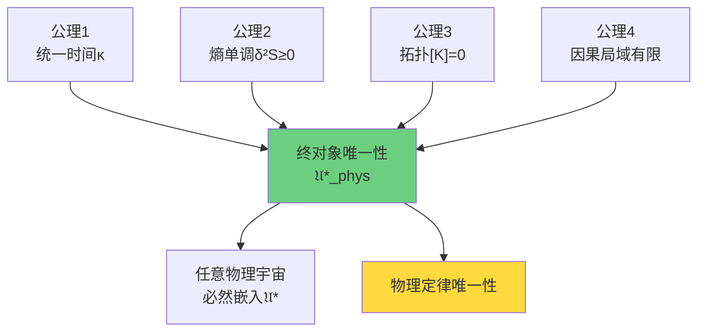

### 与前八章的联系

**第00-02章：统一时间刻度**
- QCA中的刻度密度$\kappa(\omega)$
- Floquet散射$S(\omega)$在QCA上的定义
- 连接：QCA离散时间步$\to$连续时间参数

**第03-04章：边界理论**
- QCA边界代数$\mathcal{A}_{\partial}$
- 小因果钻石在QCA上的实现
- 连接：边界时间生成元$\to$模Hamiltonian

**第05-06章：因果结构**
- QCA因果偏序$(E, \preceq)$
- Alexandrov拓扑从QCA涌现
- 连接：局域有限性$\leftrightarrow$有限传播

**第07章：统一变分原理**
- QCA上的离散广义熵
- 信息几何变分$\to$ Einstein方程
- 连接：离散熵极值$\to$连续几何

**第08章：拓扑约束**
- 穿孔密度矩阵$\to$ QCA规范自由度
- $[K]=0 \leftrightarrow$QCA可实现性
- 连接：拓扑一致性$\leftrightarrow$终对象存在性

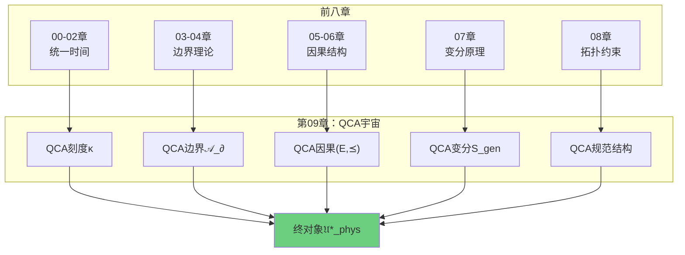

## 本章内容概览

### 第1节：QCA公理化

深入讲解QCA的五元组定义：
- 格点集合$\Lambda$与图结构
- 元胞Hilbert空间$\mathcal{H}_{\text{cell}}$
- 准局域$C^*$代数$\mathcal{A}$的构造
- 有限传播半径的严格定义
- Schumacher-Werner结构定理

### 第2节：因果结构从QCA涌现

证明从QCA局域性导出因果偏序：
- 事件集合$E = \Lambda \times \mathbb{Z}$
- 几何关系$\leq_{\text{geo}}$的定义
- 统计因果关系$\preceq_{\text{stat}}$
- **定理**：$\leq_{\text{geo}} = \preceq_{\text{stat}}$
- Alexandrov拓扑的构造

### 第3节：2-范畴中的终对象（核心）

范畴论框架的完整建立：
- 2-范畴$\mathbf{Univ}_{\mathcal{U}}$的精确定义
- 终对象的数学定义与证明
- 一致性公理的推导
- **定理**：终对象$\mathfrak{U}^*_{\text{phys}}$在四公理下唯一存在
- 物理对称性$=$自态射群

### 第4节：三重范畴等价

构造三种表象的范畴等价：
- 函子$\mathcal{F}_{\text{QCA}\to\text{geo}}$的显式构造
- 函子$\mathcal{F}_{\text{geo}\to\text{mat}}$的显式构造
- 函子$\mathcal{F}_{\text{mat}\to\text{QCA}}$的显式构造
- **定理**：三重范畴等价$\mathbf{Univ}^{\text{phys}}_{\text{QCA}} \simeq \mathbf{Univ}^{\text{phys}}_{\text{geo}} \simeq \mathbf{Univ}^{\text{phys}}_{\text{mat}}$
- 等价保持刻度、因果、熵

### 第5节：场论从QCA涌现

连续极限的详细分析：
- Dirac型QCA的构造
- 连续极限$(a \to 0, \Delta t \to 0)$
- **定理**：长波极限给出Dirac方程
- 规范QCA与Yang-Mills理论
- 标准模型的QCA实现

### 第6节：QCA宇宙总结

综合整个章节：
- 从离散到连续的完整图景
- 终对象的哲学意义
- 与前八章的统一
- 与第10-11章的预告

## 通俗类比：宇宙是"量子Game of Life"

### Conway的Game of Life

考虑经典的元胞自动机"生命游戏"：
- 二维格子$\Lambda = \mathbb{Z}^2$
- 每个格点有两个状态：生$1$或死$0$
- 局域规则：根据8邻居的状态决定下一步
- 复杂涌现：滑翔机、振荡子、稳定结构

**类比QCA宇宙**：

| Game of Life | QCA宇宙 | 物理意义 |
|-------------|---------|---------|
| 二维格子 | $d$维格点$\Lambda$ | 离散空间 |
| 经典比特$\{0,1\}$ | 量子态$\mathbb{C}^d$ | 量子自由度 |
| 确定性规则 | 幺正演化$U$ | 量子演化 |
| 滑翔机 | Dirac粒子 | 相对论粒子 |
| 复杂结构涌现 | 时空+场论涌现 | 连续物理 |

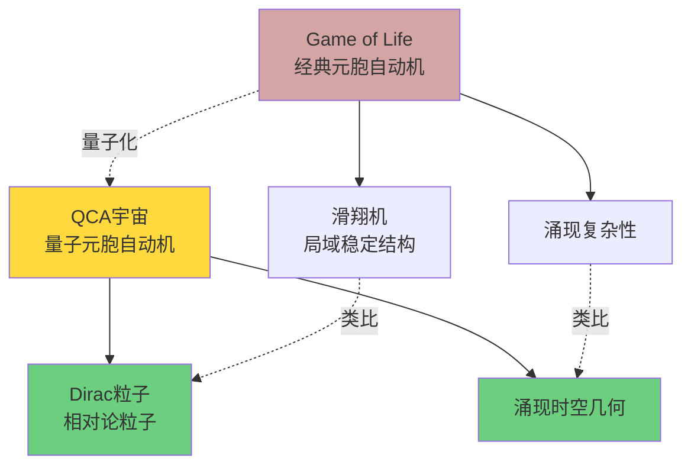

**核心洞察**：
> 就像Game of Life中的滑翔机不是"基本对象"，而是局域规则的涌现现象；
>
> 电子、光子、引力场也不是"基本实体"，而是QCA离散规则在长波极限的涌现模式！

### 从像素到图像

另一个类比：数字图像。

**像素层面**（离散）：
- 有限分辨率：$N \times M$像素
- 每个像素RGB值：$(r,g,b) \in \{0,1,\ldots,255\}^3$
- 离散数据结构

**图像层面**（连续假象）：
- "看起来连续"的曲线和色彩
- 分辨率足够高时，像素不可见
- 但本质仍是离散的

**类比**：

| 数字图像 | QCA宇宙 |
|---------|---------|
| 像素 | 格点$x \in \Lambda$ |
| RGB值 | 量子态$|\psi_x\rangle \in \mathbb{C}^d$ |
| 分辨率$N \times M$ | 格距$a$ |
| 连续图像假象 | 连续时空假象 |
| 足够高分辨率 | 极限$a \to 0$ |

**哲学启示**：
> 连续时空可能只是我们的"粗粒化感知"。
>
> 真实宇宙在Planck尺度$\ell_P \sim 10^{-35}$ m是离散的，就像图像放大到极限会看到像素。

## 未解答的问题与下一步

### 本章将解答的问题

✓ QCA如何精确定义？公理系统是什么？
→ 第1节给出五元组$(\Lambda, \mathcal{H}_{\text{cell}}, \mathcal{A}, \alpha, \omega_0)$

✓ 因果结构从何而来？
→ 第2节证明从有限传播导出偏序$(E, \preceq)$

✓ 为什么物理宇宙唯一？
→ 第3节证明终对象$\mathfrak{U}^*_{\text{phys}}$在四公理下唯一存在

✓ QCA、几何、矩阵三种描述如何等价？
→ 第4节构造三重范畴等价

✓ 连续场论如何从离散QCA涌现？
→ 第5节给出Dirac方程的QCA导出

### 仍待探索的深层问题

**问题1**：为什么宇宙选择了特定的$\Lambda$、$\mathcal{H}_{\text{cell}}$和$\alpha$？

QCA框架告诉我们宇宙是QCA，但没有告诉我们**哪个**QCA。这需要更深层的原理——**矩阵宇宙假说**（第10章）。

**问题2**：观察者与测量在QCA中如何定义？

QCA是全局幺正演化，但我们看到的是测量结果的"崩塌"。这需要**观察者理论**（第10章）。

**问题3**：所有这些结构（QCA、拓扑、因果、边界）如何从单一原理导出？

这需要**终极统一变分原理**（第11章）。

**问题4**：QCA宇宙如何解释量子引力的具体问题（黑洞熵、奇点等）？

这需要**应用与检验**（第12章）。

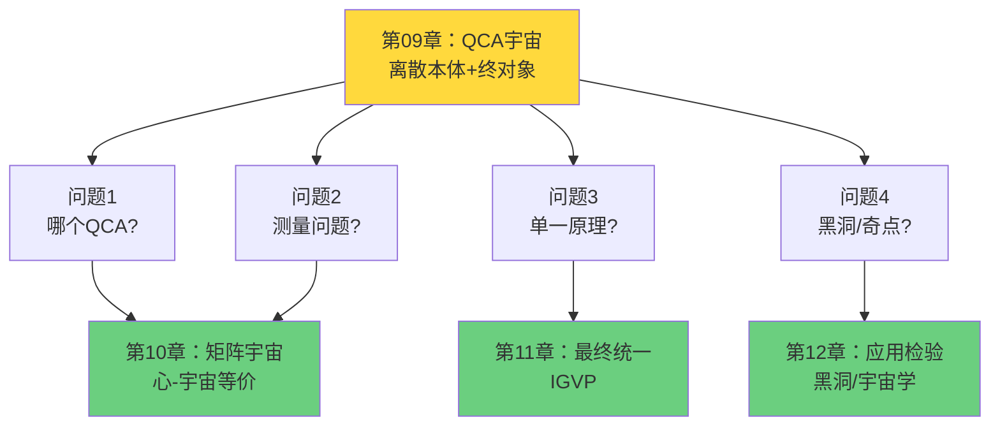

## 哲学意义：本体论的革命

### 从连续到离散的范式转换

**传统本体论**（自古希腊至20世纪）：
- 时空是连续的"容器"
- 物质是时空中的"内容"
- 连续性是"自然"的

**QCA本体论**（21世纪的提议）：
- 时空是离散QCA的**涌现**
- 物质是QCA态的**激发**
- 连续性是**近似假象**

### 物理定律的唯一性

**传统观点**：
物理定律可能是"偶然"的——也许存在其他宇宙有不同的定律（多元宇宙）。

**终对象观点**：
物理定律由范畴论存在性定理**唯一确定**——不存在其他满足一致性公理的宇宙！

**核心主张**：
> 如果$\mathfrak{U}^*_{\text{phys}}$是2-范畴$\mathbf{Univ}_{\mathcal{U}}$的终对象，
>
> 则物理定律的唯一性不是经验偶然，而是**数学必然**。

这与第08章拓扑约束的哲学一脉相承：
- 第08章：标准模型群从拓扑必然导出
- 第09章：整个物理宇宙从范畴论必然导出

### 从无限到有限

**QCA范式的深刻简化**：

| 传统理论 | QCA理论 |
|---------|---------|
| 无穷维Hilbert空间 | 有限维$\mathcal{H}_{\text{cell}}$ |
| 连续参数$(t, \mathbf{x}) \in \mathbb{R}^4$ | 离散$(n, x) \in \mathbb{Z} \times \Lambda$ |
| 紫外发散需重整化 | 自然紫外截断（格距$a$） |
| 奇点无穷大 | 离散平滑 |

**哲学含义**：
> 物理宇宙本质上是**有限的**（每个格点有限维，每步演化有限传播）。
>
> 无穷大只出现在我们对离散结构取连续极限时——是数学理想化，非物理实在。

## 下一步：2-范畴中的终对象

第1节将从公理化开始，严格定义QCA的五元组$(\Lambda, \mathcal{H}_{\text{cell}}, \mathcal{A}, \alpha, \omega_0)$，并给出Schumacher-Werner结构定理的物理解读。

第2节将证明因果偏序如何从QCA局域性涌现，建立$(E, \preceq)$的局域有限性。

**第3节是核心**：我们将构造2-范畴$\mathbf{Univ}_{\mathcal{U}}$，定义终对象$\mathfrak{U}^*_{\text{phys}}$，并证明在统一刻度、熵单调、拓扑无异常、因果局域有限四公理下，终对象**唯一存在**。

这将是整个统一理论的**范畴论巅峰**——所有前八章的结构在此收束，所有物理描述在此统一！

让我们踏上QCA宇宙的旅程，见证从离散格点到连续时空，从局域幺正到宇宙万物的奇迹！
