# QCA Universe: Ultimate Unification from Discrete to Continuous

In previous eight chapters, we established framework of unified time scale, boundary theory, causal structure, and topological constraints. Now we face a more fundamental question:

> **What is ontology of physical universe? Where do spacetime, matter, field theory come from?**

This chapter will give a stunning answer:

> **Universe is essentially a Quantum Cellular Automaton (QCA).** All continuous physical theories—quantum field theory, general relativity, Standard Model—are **emergent** phenomena of QCA in long-wavelength limit.

## From Continuous to Discrete: Paradigm Reversal

### Continuous Assumption of Traditional Physics

In standard physics framework:
- **Spacetime is continuous**: Real coordinates $(t, x, y, z) \in \mathbb{R}^4$
- **Fields are continuous**: $\phi(x)$ defined at every spacetime point
- **Evolution is continuous**: Schrödinger equation $i\hbar \partial_t |\psi\rangle = H|\psi\rangle$

This continuous framework is extremely successful, but has deep problems at fundamental level:
1. Infinity difficulties: UV divergences, black hole singularities
2. Measurement problem: Infinite dimensions of continuous Hilbert space
3. Ontological ambiguity: What is spacetime in quantum gravity?

### Discrete Revolution of QCA Paradigm

Quantum cellular automaton proposes completely different ontology:
- **Time is discrete**: Integer time steps $n \in \mathbb{Z}$
- **Space is discrete**: Countable lattice set $\Lambda$ (e.g., $\mathbb{Z}^d$)
- **States are finite-dimensional**: Each lattice point Hilbert space $\mathcal{H}_{\text{cell}} \cong \mathbb{C}^d$
- **Evolution is local unitary**: Single-step evolution $U$ acts only on finite neighborhood

**Key Insight**:
> Continuous physics is not fundamental, but **effective description** of discrete QCA in appropriate limit $(lattice spacing \to 0,\ time step \to 0)$.

## Five-Tuple Definition of QCA Universe

### Universe Object $\mathfrak{U}_{\text{QCA}}$

A universe QCA object consists of five components:
$$\mathfrak{U}_{\text{QCA}} = (\Lambda, \mathcal{H}_{\text{cell}}, \mathcal{A}, \alpha, \omega_0)$$

Let's understand one by one:

**Component 1: Discrete Space $\Lambda$**
- Vertex set of countably infinite connected graph
- Usually take standard lattice $\Lambda = \mathbb{Z}^d$ ($d$-dimensional space)
- Graph distance $\text{dist}(x,y)$ defines "discrete distance"

**Component 2: Cellular Hilbert Space $\mathcal{H}_{\text{cell}}$**
- Finite-dimensional complex vector space $\mathcal{H}_{\text{cell}} \cong \mathbb{C}^d$
- $d$ is **local degree of freedom dimension** of each lattice point
- For example: Spin $d=2$, color+flavor $d=18$

**Component 3: Quasi-Local $C^*$ Algebra $\mathcal{A}$**
- Full space Hilbert space: $\mathcal{H} = \overline{\bigotimes_{x \in \Lambda} \mathcal{H}_x}$ (infinite tensor product)
- Local algebra: $\mathcal{A}_F = \mathcal{B}(\mathcal{H}_F)$ for finite set $F \Subset \Lambda$
- Quasi-local algebra: $\mathcal{A} = \overline{\bigcup_{F \Subset \Lambda} \mathcal{A}_F}$ (completion)

**Component 4: QCA Evolution $\alpha$**
- $C^*$ algebra automorphism $\alpha: \mathcal{A} \to \mathcal{A}$
- **Finite propagation radius** $R$: Operator supported on $F$, after evolution supported within $B_R(F)$
- **Translation covariant**: Commutes with spatial translations

**Component 5: Initial Universe State $\omega_0$**
- Normalized state $\omega_0: \mathcal{A} \to \mathbb{C}$
- Physical interpretation: Quantum state of universe at $n=0$
- Time evolution: $\omega_n = \omega_0 \circ \alpha^{-n}$

```mermaid
graph LR
    A["Discrete Space Λ<br/>(e.g. ℤ³)"] --> F["Universe QCA Object<br/>𝔘_QCA"]
    B["Cellular ℋ_cell<br/>(Finite-Dim)"] --> F
    C["Quasi-Local Algebra 𝒜<br/>(Tensor Product Completion)"] --> F
    D["Evolution α<br/>(Finite Propagation)"] --> F
    E["Initial State ω₀<br/>(n=0 Moment)"] --> F

    F --> G["Time Step n∈ℤ"]
    F --> H["Spatial Lattice Point x∈Λ"]
    F --> I["Event (x,n)∈E"]

    style F fill:#ffd93d
    style I fill:#6bcf7f
```

## Three Core Properties of QCA

### Property 1: Locality and Finite Propagation

**Definition (Finite Propagation Radius)**:
There exists $R \in \mathbb{N}$ such that for any operator $A \in \mathcal{A}_F$ supported on finite set $F$:
$$\text{supp}(\alpha^n(A)) \subset B_{nR}(F) := \{y : \text{dist}(y, F) \leq nR\}$$

**Physical Meaning**:
- Information propagation has maximum speed $v_{\max} = R/\Delta t$ ($\Delta t$ is time step)
- Similar to **light speed limit** of relativity
- Causal structure naturally emerges from locality

**Theorem (Causal Structure Emergence)**:
Define event set $E = \Lambda \times \mathbb{Z}$, geometric relation:
$$(x,n) \leq_{\text{geo}} (y,m) \iff m \geq n \text{ and } \text{dist}(x,y) \leq R(m-n)$$
Then $\leq_{\text{geo}}$ is **locally finite partial order** on $E$, defining causal structure of QCA.

### Property 2: Translation Covariance and Symmetry

**Definition (Translation Action)**:
For $\Lambda = \mathbb{Z}^d$, translation $\tau_a: x \mapsto x + a$ ($a \in \mathbb{Z}^d$) induces algebra automorphism:
$$\theta_a(A)(x_1, \ldots) = A(x_1 - a, \ldots)$$

**Translation Covariance Condition**:
$$\alpha \circ \theta_a = \theta_a \circ \alpha,\quad \forall a \in \mathbb{Z}^d$$

**Physical Meaning**:
- Universe invariant under spatial translations (spatial homogeneity)
- Corresponds to **momentum conservation** of continuous theory
- Allows Fourier analysis $\to$ dispersion relation $E(k)$

### Property 3: Unitarity and Reversibility

**Theorem (Schumacher-Werner)**:
QCA $\alpha$ satisfying finite propagation and translation covariance can be realized by unitary operator $U$ in some GNS representation:
$$\alpha(A) = U^\dagger A U$$

**Physical Meaning**:
- QCA evolution preserves probability (unitarity)
- Evolution completely reversible (information conservation)
- Similar to **unitary evolution** of quantum mechanics

## From QCA to Continuous Field Theory: Miracle of Continuous Limit

### Dirac Equation Emerges from QCA

Consider one-dimensional QCA ($\Lambda = \mathbb{Z}$), cellular space $\mathcal{H}_{\text{cell}} = \mathbb{C}^2$ (two components).

**Discrete Dirac-Type QCA**:
Define single-step evolution (in momentum space):
$$\hat{U}(k) = \begin{pmatrix}
\cos\theta(k) & i\sin\theta(k) \\
i\sin\theta(k) & \cos\theta(k)
\end{pmatrix} e^{-iE(k)\Delta t}$$
where $\theta(k) = ka$ ($a$ is lattice spacing), $E(k) = mc^2/\hbar$ (dispersion relation).

**Continuous Limit**:
Take $a \to 0$, $\Delta t \to 0$, keeping $c = a/\Delta t$ fixed. Expand:
$$\psi(x, t+\Delta t) \approx \psi(x,t) + i\Delta t H_{\text{Dirac}} \psi(x,t)$$
where
$$H_{\text{Dirac}} = -i\hbar c \sigma_x \partial_x + mc^2 \sigma_z$$

**Stunning Result**: Discrete QCA in long-wavelength limit exactly gives **Dirac equation**!
$$i\hbar \partial_t \psi = H_{\text{Dirac}} \psi$$

```mermaid
graph LR
    A["Discrete QCA<br/>Lattice Λ=ℤ<br/>Time Step n"] --> B["Continuous Limit<br/>a→0, Δt→0<br/>c=a/Δt Fixed"]

    B --> C["Dirac Equation<br/>iℏ∂_tψ = H_Dψ"]

    D["Local Unitary U"] -.-> E["Relativistic Field ψ(x,t)"]
    A --> D
    C --> E

    style A fill:#ffd93d
    style C fill:#6bcf7f
    style E fill:#6bcf7f
```

### QCA Realization of Standard Model

**Realization of Gauge Degrees of Freedom**:
Introduce gauge Hilbert space on edges of QCA:
$$\mathcal{H}_{\text{edge}} = \text{SU}(3) \times \text{SU}(2) \times \text{U}(1)$$
for each directed edge $(x,y) \in \Lambda^1$.

**Gauge QCA Definition**:
$$\mathfrak{U}_{\text{QCA}}^{\text{gauge}} = (\Lambda, \mathcal{H}_{\text{cell}}, \mathcal{H}_{\text{gauge}}, \mathcal{A}, \alpha, \omega_0, \mathsf{G}_{\text{loc}})$$
where $\mathsf{G}_{\text{loc}}$ is local gauge transformation group.

**Field Theory Emergence Theorem** (detailed proof in Section 05):
Under appropriate continuous limit, gauge QCA gives **Yang-Mills theory**:
$$\mathcal{L}_{\text{YM}} = -\frac{1}{4} F^a_{\mu\nu} F^{a\mu\nu}$$
and compatible with topological constraints of Chapter 08.

## Categorical Perspective: Necessity of Terminal Object

### Why Category Theory?

So far, we have multiple ways to describe "universe":
- **Geometric Universe**: Lorentzian manifold $(M, g)$
- **Scattering Universe**: Scattering matrix $S(\omega)$ and unified time scale $\kappa(\omega)$
- **QCA Universe**: Discrete QCA object $\mathfrak{U}_{\text{QCA}}$
- **Matrix Universe**: Density matrix manifold $\mathcal{D}_N$ (Chapter 10)

**Question**: Are these descriptions equivalent? If so, how to prove rigorously?

**Answer**: Concept of **terminal object** in category theory provides unified framework.

### 2-Category $\mathbf{Univ}_{\mathcal{U}}$

**Definition**: Fix Grothendieck universe $\mathcal{U}$, define 2-category $\mathbf{Univ}_{\mathcal{U}}$:

- **Objects**: Multi-layered universe structures
  $$\mathfrak{U} = (U_{\text{evt}}, U_{\text{geo}}, U_{\text{QFT}}, U_{\text{scat}}, U_{\text{QCA}}, U_{\text{top}}, \ldots)$$
  containing layers of event set, geometry, field theory, scattering, QCA, topology, etc.

- **1-Morphisms**: Structure-preserving functor-type maps
  - For example: Embeddings preserving causal partial order
  - For example: Unitary equivalences preserving scattering scale

- **2-Morphisms**: Natural isomorphisms between 1-morphisms

### Terminal Object Definition and Physical Meaning

**Definition (Terminal Object in 2-Category)**:
Object $\mathfrak{U}^*_{\text{phys}} \in \mathbf{Univ}_{\mathcal{U}}$ is called **terminal object** if:

1. **Uniqueness**: For any $\mathfrak{U} \in \mathbf{Univ}_{\mathcal{U}}$, there exists unique (up to 2-isomorphism) 1-morphism:
   $$\Phi_{\mathfrak{U}}: \mathfrak{U} \to \mathfrak{U}^*_{\text{phys}}$$

2. **Self-Morphism Triviality**: Endomorphism group $\text{End}(\mathfrak{U}^*_{\text{phys}})$ is exactly physical symmetry group

**Physical Interpretation**:

| Mathematical Concept | Physical Meaning |
|---------------------|------------------|
| Terminal object $\mathfrak{U}^*_{\text{phys}}$ | Unique physical universe |
| Unique morphism $\Phi$ | Any physical description necessarily embeds into physical universe |
| Endomorphism group $\text{End}$ | Physical symmetries (Poincaré group, etc.) |

**Philosophical Meaning**:
> If $\mathfrak{U}^*_{\text{phys}}$ is terminal object, then there is no "multiple equivalent but different" physical universes—uniqueness of physical laws is guaranteed by **categorical existence theorem**, not empirical induction!

```mermaid
graph TD
    A["Arbitrary Universe Description 𝔘"] -->|Unique Morphism Φ| B["Terminal Object<br/>𝔘*_phys"]

    C["Geometric Universe 𝔘_geo"] -->|Φ_geo| B
    D["QCA Universe 𝔘_QCA"] -->|Φ_QCA| B
    E["Scattering Universe 𝔘_scat"] -->|Φ_scat| B
    F["Matrix Universe 𝔘_mat"] -->|Φ_mat| B

    B --> G["Endomorphisms End(𝔘*)<br/>= Physical Symmetries"]

    style B fill:#6bcf7f
    style G fill:#ffd93d
```

## Triple Categorical Equivalence: Complete Unified Picture

### Three Representation Categories

Define three subcategories:

**Geometric Universe Category $\mathbf{Univ}^{\text{phys}}_{\text{geo}}$**:
- Objects: Lorentzian manifolds $(M, g)$ + causal structure + generalized entropy
- Morphisms: Causal-preserving conformal embeddings

**Matrix Universe Category $\mathbf{Univ}^{\text{phys}}_{\text{mat}}$**:
- Objects: Density matrix manifolds $\mathcal{D}_N$ + scattering $S(\omega)$ + unified time $\kappa$
- Morphisms: Scattering scale-preserving unitary equivalences

**QCA Universe Category $\mathbf{Univ}^{\text{phys}}_{\text{QCA}}$**:
- Objects: QCA objects $\mathfrak{U}_{\text{QCA}}$ + continuous limit data
- Morphisms: Locality-preserving QCA maps

### Equivalence Theorem

**Theorem (Triple Categorical Equivalence, detailed proof in Section 04)**:
There exist functors preserving unified scale, causal and entropy structures:
$$\mathbf{Univ}^{\text{phys}}_{\text{geo}} \simeq \mathbf{Univ}^{\text{phys}}_{\text{mat}} \simeq \mathbf{Univ}^{\text{phys}}_{\text{QCA}}$$

**Functor Construction**:

1. **$\mathcal{F}_{\text{QCA}\to\text{geo}}$**: QCA → Geometry
   - Reconstruct causal partial order from QCA locality
   - Alexandrov topology gives manifold
   - Continuous limit gives Lorentzian metric

2. **$\mathcal{F}_{\text{geo}\to\text{mat}}$**: Geometry → Matrix
   - Construct boundary algebra from small causal diamonds
   - Tomita-Takesaki modular flow $\to$ density matrix
   - Einstein equation $\to$ scattering matrix

3. **$\mathcal{F}_{\text{mat}\to\text{QCA}}$**: Matrix → QCA
   - Spectral decomposition of density matrix $\to$ cellular states
   - Scattering unitary $S(\omega) \to$ QCA evolution $U$
   - Unified time scale $\to$ discrete time steps

```mermaid
graph LR
    A["QCA Universe<br/>𝔘_QCA"] -->|ℱ_QCA→geo| B["Geometric Universe<br/>(M,g)"]

    B -->|ℱ_geo→mat| C["Matrix Universe<br/>𝒟_N, S(ω)"]

    C -->|ℱ_mat→QCA| A

    D["Categorical Equivalence<br/>≃"] -.-> A
    D -.-> B
    D -.-> C

    style A fill:#ffd93d
    style B fill:#6bcf7f
    style C fill:#ff9999
    style D fill:#9b59b6
```

**Physical Meaning**:
> Three universe descriptions are not "different theories", but **different projections of same terminal object**.
>
> Like three views of 3D object: front view, side view, top view seem different, but describe same object.

## Consistency Conditions for Terminal Object

### Why Must Terminal Object Exist?

**Theorem 3.6 (Terminal Object Existence, detailed proof in Section 03)**:
In 2-category $\mathbf{Univ}_{\mathcal{U}}$, object $\mathfrak{U}^*_{\text{phys}}$ satisfying following axioms is unique terminal object:

**Axiom 1 (Unified Time Scale)**:
$$\kappa(\omega) = \frac{\varphi'(\omega)}{\pi} = \rho_{\text{rel}}(\omega) = \frac{1}{2\pi} \text{tr} Q(\omega)$$
Scattering, spectral shift, group delay unified.

**Axiom 2 (Generalized Entropy Monotonicity)**:
On null boundaries:
$$\delta^2 S_{\text{gen}} = \mathcal{E}_{\text{can}} \geq 0$$
Second-order relative entropy non-negative.

**Axiom 3 (Topological Anomaly-Free)**:
$$[K] = 0 \in H^2(Y, \partial Y; \mathbb{Z}_2)$$
Relative cohomology class trivial.

**Axiom 4 (Causal Partial Order Locally Finite)**:
Causal partial order of event set $(E, \preceq)$ is locally finite.

**Proof Idea**:
1. Axioms 1-3 already established in previous eight chapters
2. Axiom 4 automatically satisfied by QCA finite propagation
3. These four axioms **force** unique terminal object to exist
4. Any object violating axioms cannot embed into $\mathfrak{U}^*_{\text{phys}}$

```mermaid
graph TD
    A["Axiom 1<br/>Unified Time κ"] --> E["Terminal Object Uniqueness<br/>𝔘*_phys"]
    B["Axiom 2<br/>Entropy Monotonicity δ²S≥0"] --> E
    C["Axiom 3<br/>Topology [K]=0"] --> E
    D["Axiom 4<br/>Causal Locally Finite"] --> E

    E --> F["Any Physical Universe<br/>Necessarily Embeds into 𝔘*"]
    E --> G["Uniqueness of Physical Laws"]

    style E fill:#6bcf7f
    style G fill:#ffd93d
```

### Connection with Previous Eight Chapters

**Chapters 00-02: Unified Time Scale**
- Scale density $\kappa(\omega)$ in QCA
- Definition of Floquet scattering $S(\omega)$ on QCA
- Connection: QCA discrete time steps $\to$ continuous time parameter

**Chapters 03-04: Boundary Theory**
- Boundary algebra $\mathcal{A}_{\partial}$ of QCA
- Realization of small causal diamonds on QCA
- Connection: Boundary time generator $\to$ modular Hamiltonian

**Chapters 05-06: Causal Structure**
- Causal partial order $(E, \preceq)$ of QCA
- Alexandrov topology emerges from QCA
- Connection: Local finiteness $\leftrightarrow$ finite propagation

**Chapter 07: Unified Variational Principle**
- Discrete generalized entropy on QCA
- Information-geometric variation $\to$ Einstein equation
- Connection: Discrete entropy extremum $\to$ continuous geometry

**Chapter 08: Topological Constraints**
- Punctured density matrix $\to$ gauge degrees of freedom of QCA
- $[K]=0 \leftrightarrow$ QCA realizability
- Connection: Topological consistency $\leftrightarrow$ terminal object existence

```mermaid
graph TD
    subgraph "Previous Eight Chapters"
    A["Chapters 00-02<br/>Unified Time"]
    B["Chapters 03-04<br/>Boundary Theory"]
    C["Chapters 05-06<br/>Causal Structure"]
    D["Chapter 07<br/>Variational Principle"]
    E["Chapter 08<br/>Topological Constraints"]
    end

    subgraph "Chapter 09: QCA Universe"
    F["QCA Scale κ"]
    G["QCA Boundary 𝒜_∂"]
    H["QCA Causality (E,⪯)"]
    I["QCA Variation S_gen"]
    J["QCA Gauge Structure"]
    end

    A --> F
    B --> G
    C --> H
    D --> I
    E --> J

    F --> K["Terminal Object 𝔘*_phys"]
    G --> K
    H --> K
    I --> K
    J --> K

    style K fill:#6bcf7f
```

## Chapter Content Overview

### Section 1: QCA Axiomatization

In-depth explanation of five-tuple definition of QCA:
- Lattice set $\Lambda$ and graph structure
- Cellular Hilbert space $\mathcal{H}_{\text{cell}}$
- Construction of quasi-local $C^*$ algebra $\mathcal{A}$
- Strict definition of finite propagation radius
- Schumacher-Werner structure theorem

### Section 2: Causal Structure Emerges from QCA

Prove causal partial order derived from QCA locality:
- Event set $E = \Lambda \times \mathbb{Z}$
- Definition of geometric relation $\leq_{\text{geo}}$
- Statistical causality $\preceq_{\text{stat}}$
- **Theorem**: $\leq_{\text{geo}} = \preceq_{\text{stat}}$
- Construction of Alexandrov topology

### Section 3: Terminal Object in 2-Category (Core)

Complete establishment of categorical framework:
- Precise definition of 2-category $\mathbf{Univ}_{\mathcal{U}}$
- Mathematical definition and proof of terminal object
- Derivation of consistency axioms
- **Theorem**: Terminal object $\mathfrak{U}^*_{\text{phys}}$ uniquely exists under four axioms
- Physical symmetries $=$ endomorphism group

### Section 4: Triple Categorical Equivalence

Construct categorical equivalence of three representations:
- Explicit construction of functor $\mathcal{F}_{\text{QCA}\to\text{geo}}$
- Explicit construction of functor $\mathcal{F}_{\text{geo}\to\text{mat}}$
- Explicit construction of functor $\mathcal{F}_{\text{mat}\to\text{QCA}}$
- **Theorem**: Triple categorical equivalence $\mathbf{Univ}^{\text{phys}}_{\text{QCA}} \simeq \mathbf{Univ}^{\text{phys}}_{\text{geo}} \simeq \mathbf{Univ}^{\text{phys}}_{\text{mat}}$
- Equivalence preserves scale, causality, entropy

### Section 5: Field Theory Emerges from QCA

Detailed analysis of continuous limit:
- Construction of Dirac-type QCA
- Continuous limit $(a \to 0, \Delta t \to 0)$
- **Theorem**: Long-wavelength limit gives Dirac equation
- Gauge QCA and Yang-Mills theory
- QCA realization of Standard Model

### Section 6: QCA Universe Summary

Synthesizing entire chapter:
- Complete picture from discrete to continuous
- Philosophical meaning of terminal object
- Unification with previous eight chapters
- Preview of Chapters 10-11

## Popular Analogy: Universe as "Quantum Game of Life"

### Conway's Game of Life

Consider classic cellular automaton "Game of Life":
- Two-dimensional lattice $\Lambda = \mathbb{Z}^2$
- Each lattice point has two states: alive $1$ or dead $0$
- Local rules: Determine next step based on 8 neighbors' states
- Complex emergence: Gliders, oscillators, stable structures

**Analogy to QCA Universe**:

| Game of Life | QCA Universe | Physical Meaning |
|-------------|-------------|------------------|
| Two-dimensional lattice | $d$-dimensional lattice $\Lambda$ | Discrete space |
| Classical bits $\{0,1\}$ | Quantum states $\mathbb{C}^d$ | Quantum degrees of freedom |
| Deterministic rules | Unitary evolution $U$ | Quantum evolution |
| Gliders | Dirac particles | Relativistic particles |
| Complex structure emergence | Spacetime+field theory emergence | Continuous physics |

**Core Insight**:
> Just as gliders in Game of Life are not "fundamental objects", but emergent phenomena of local rules;
>
> Electrons, photons, gravitational fields are also not "fundamental entities", but emergent patterns of QCA discrete rules in long-wavelength limit!

### From Pixels to Image

Another analogy: Digital images.

**Pixel Level** (discrete):
- Finite resolution: $N \times M$ pixels
- RGB value of each pixel: $(r,g,b) \in \{0,1,\ldots,255\}^3$
- Discrete data structure

**Image Level** (continuous illusion):
- "Looks continuous" curves and colors
- When resolution high enough, pixels invisible
- But essence still discrete

**Analogy**:

| Digital Image | QCA Universe |
|--------------|--------------|
| Pixels | Lattice points $x \in \Lambda$ |
| RGB values | Quantum states $|\psi_x\rangle \in \mathbb{C}^d$ |
| Resolution $N \times M$ | Lattice spacing $a$ |
| Continuous image illusion | Continuous spacetime illusion |
| High enough resolution | Limit $a \to 0$ |

**Philosophical Revelation**:
> Continuous spacetime may just be our "coarse-grained perception".
>
> Real universe at Planck scale $\ell_P \sim 10^{-35}$ m is discrete, just like images zoomed to limit reveal pixels.

## Unanswered Questions and Next Steps

### Questions This Chapter Will Answer

✓ How is QCA precisely defined? What is axiom system?
→ Section 1 gives five-tuple $(\Lambda, \mathcal{H}_{\text{cell}}, \mathcal{A}, \alpha, \omega_0)$

✓ Where does causal structure come from?
→ Section 2 proves partial order $(E, \preceq)$ derived from finite propagation

✓ Why is physical universe unique?
→ Section 3 proves terminal object $\mathfrak{U}^*_{\text{phys}}$ uniquely exists under four axioms

✓ How are QCA, geometry, matrix three descriptions equivalent?
→ Section 4 constructs triple categorical equivalence

✓ How does continuous field theory emerge from discrete QCA?
→ Section 5 gives QCA derivation of Dirac equation

### Deep Questions Still to Explore

**Question 1**: Why does universe choose specific $\Lambda$, $\mathcal{H}_{\text{cell}}$ and $\alpha$?

QCA framework tells us universe is QCA, but doesn't tell us **which** QCA. This requires deeper principle—**matrix universe hypothesis** (Chapter 10).

**Question 2**: How are observers and measurements defined in QCA?

QCA is global unitary evolution, but we see "collapse" of measurement results. This requires **observer theory** (Chapter 10).

**Question 3**: How do all these structures (QCA, topology, causality, boundary) derive from single principle?

This requires **ultimate unified variational principle** (Chapter 11).

**Question 4**: How does QCA universe explain specific problems of quantum gravity (black hole entropy, singularities, etc.)?

This requires **applications and tests** (Chapter 12).

## Philosophical Meaning: Ontological Revolution

### Paradigm Shift from Continuous to Discrete

**Traditional Ontology** (from ancient Greece to 20th century):
- Spacetime is continuous "container"
- Matter is "content" in spacetime
- Continuity is "natural"

**QCA Ontology** (21st century proposal):
- Spacetime is **emergent** from discrete QCA
- Matter is **excitations** of QCA states
- Continuity is **approximate illusion**

### Uniqueness of Physical Laws

**Traditional View**:
Physical laws may be "accidental"—perhaps other universes exist with different laws (multiverse).

**Terminal Object View**:
Physical laws are **uniquely determined** by categorical existence theorem—no other universes satisfying consistency axioms exist!

**Core Claim**:
> If $\mathfrak{U}^*_{\text{phys}}$ is terminal object of 2-category $\mathbf{Univ}_{\mathcal{U}}$,
>
> then uniqueness of physical laws is not empirical accident, but **mathematical necessity**.

This is consistent with philosophy of topological constraints in Chapter 08:
- Chapter 08: Standard Model group inevitably derived from topology
- Chapter 09: Entire physical universe inevitably derived from category theory

### From Infinite to Finite

**Profound Simplification of QCA Paradigm**:

| Traditional Theory | QCA Theory |
|-------------------|-----------|
| Infinite-dimensional Hilbert space | Finite-dimensional $\mathcal{H}_{\text{cell}}$ |
| Continuous parameters $(t, \mathbf{x}) \in \mathbb{R}^4$ | Discrete $(n, x) \in \mathbb{Z} \times \Lambda$ |
| UV divergences need renormalization | Natural UV cutoff (lattice spacing $a$) |
| Singularity infinities | Discrete smoothness |

**Philosophical Meaning**:
> Physical universe is essentially **finite** (each lattice point finite-dimensional, each step evolution finite propagation).
>
> Infinities only appear when we take continuous limit of discrete structure—mathematical idealization, not physical reality.

## Next Step: Terminal Object in 2-Category

Section 1 will start from axiomatization, strictly define five-tuple $(\Lambda, \mathcal{H}_{\text{cell}}, \mathcal{A}, \alpha, \omega_0)$ of QCA, and give physical interpretation of Schumacher-Werner structure theorem.

Section 2 will prove how causal partial order emerges from QCA locality, establishing local finiteness of $(E, \preceq)$.

**Section 3 is core**: We will construct 2-category $\mathbf{Univ}_{\mathcal{U}}$, define terminal object $\mathfrak{U}^*_{\text{phys}}$, and prove that under four axioms of unified scale, entropy monotonicity, topological anomaly-free, causal locally finite, terminal object **uniquely exists**.

This will be **categorical pinnacle** of entire unified theory—all structures of previous eight chapters converge here, all physical descriptions unify here!

Let's embark on journey of QCA universe, witnessing miracle from discrete lattice points to continuous spacetime, from local unitaries to all things in universe!

