# QCA公理化：五元组定义的严格基础

在上一节中，我们看到QCA宇宙的直观图景——离散时空、有限维态、局域演化。现在我们给出**严格的数学定义**。

## 为什么需要公理化？

### 从直觉到严格

在物理学史上，公理化总是将模糊的直觉转化为精确的数学：

**例子1：欧几里得几何**
- 直觉：点、线、面的"显然"性质
- 公理化：五条公理 → 整个几何学

**例子2：量子力学**
- 直觉：波粒二象性、测量塌缩
- 公理化：Hilbert空间 + 幺正演化 + Born规则

**例子3：QCA宇宙**
- 直觉：离散格点、局域跳跃、量子叠加
- 公理化：五元组$(\Lambda, \mathcal{H}_{\text{cell}}, \mathcal{A}, \alpha, \omega_0)$

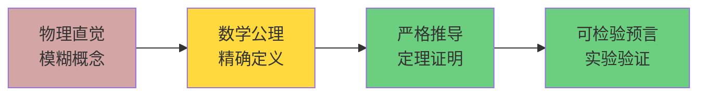

**公理化的好处**：
1. **消除歧义**：每个概念都有精确定义
2. **逻辑自洽**：从公理推导，避免循环论证
3. **可检验性**：明确哪些是假设，哪些是推论
4. **普适性**：公理适用于所有满足条件的系统

## 五元组的五个成分

宇宙QCA对象定义为：
$$
\mathfrak{U}_{\text{QCA}} = (\Lambda, \mathcal{H}_{\text{cell}}, \mathcal{A}, \alpha, \omega_0)
$$

让我们逐一深入每个成分。

## 成分1：离散空间$\Lambda$

### 图论基础

**定义1.1（可数连通图）**：
$\Lambda$是可数集合，携带无向连通图结构：
- **顶点集**：$\Lambda$（可数无限或有限）
- **边集**：$E_\Lambda \subset \Lambda \times \Lambda$
- **对称性**：$(x,y) \in E_\Lambda \Rightarrow (y,x) \in E_\Lambda$
- **无自环**：$(x,x) \notin E_\Lambda$
- **连通性**：任意$x, y \in \Lambda$间存在路径

**图距离**：
$$
\text{dist}(x,y) = \min\{n : \text{存在长度为}n\text{的路径连接}x,y\}
$$

**闭球**：
$$
B_R(x) := \{y \in \Lambda : \text{dist}(x,y) \leq R\}
$$

**局域有限性假设**：对所有$x \in \Lambda$和$R \in \mathbb{N}$，$|B_R(x)| < \infty$。

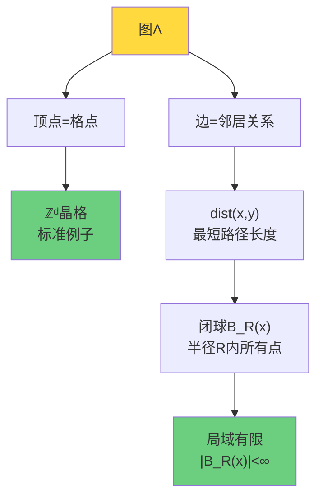

### 标准晶格$\mathbb{Z}^d$

**最常用的选择**：$\Lambda = \mathbb{Z}^d$（$d$维整数晶格）

**一维**（$d=1$）：$\Lambda = \mathbb{Z} = \{\ldots, -2, -1, 0, 1, 2, \ldots\}$
- 邻居关系：$(x, x+1)$
- 距离：$\text{dist}(x,y) = |x - y|$

**二维**（$d=2$）：$\Lambda = \mathbb{Z}^2$（平面格点）
- 邻居关系：$(x,y)$与$(x \pm 1, y)$、$(x, y \pm 1)$
- 距离（曼哈顿）：$\text{dist}((x_1,y_1), (x_2,y_2)) = |x_1-x_2| + |y_1-y_2|$

**三维**（$d=3$）：$\Lambda = \mathbb{Z}^3$（空间格点）
- 对应物理空间的离散化
- 立方晶格结构

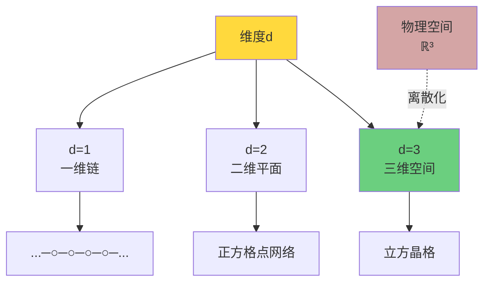

### 平移对称性

**定义1.2（平移作用）**：
对$\Lambda = \mathbb{Z}^d$，平移$\tau_a: \Lambda \to \Lambda$定义为：
$$
\tau_a(x) := x + a, \quad a \in \mathbb{Z}^d
$$

**性质**：
- $\tau_a \circ \tau_b = \tau_{a+b}$（群性质）
- $\tau_0 = \text{id}$（单位元）
- $\tau_a^{-1} = \tau_{-a}$（逆元）

**物理意义**：
空间在平移下不变 → 动量守恒（Noether定理）

### 为什么选择离散？三个理由

**理由1：紫外截断**

连续空间$\mathbb{R}^d$存在紫外发散：
$$
\int \frac{d^dk}{(2\pi)^d} \frac{1}{k^2} \sim \int_0^\infty k^{d-3} dk \to \infty \quad (d \geq 3)
$$

离散空间自然截断：
$$
\sum_{x \in \Lambda} \to \int \frac{d^dx}{a^d}, \quad a = \text{格距}
$$
最高动量$k_{\max} = \pi/a$（Brillouin区边界）。

**理由2：信息有限性**

连续空间每点无穷维 → 无限信息。
离散空间$\Lambda$可数 + 有限维$\mathcal{H}_{\text{cell}}$ → 每个有限体积信息有限。

**理由3：量子引力提示**

Planck尺度$\ell_P = \sqrt{\hbar G/c^3} \approx 10^{-35}$ m暗示时空离散性。

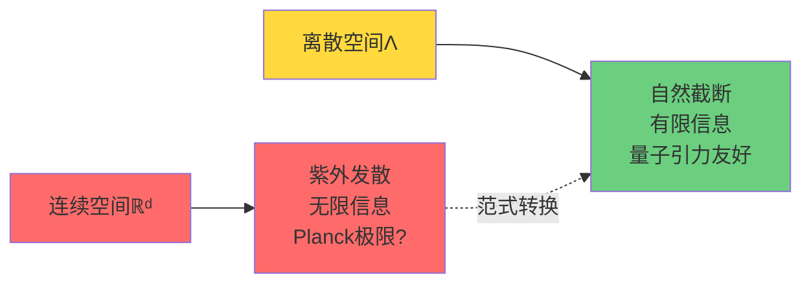

## 成分2：元胞Hilbert空间$\mathcal{H}_{\text{cell}}$

### 有限维量子态空间

**定义2.1（元胞空间）**：
$\mathcal{H}_{\text{cell}}$是有限维复Hilbert空间：
$$
\mathcal{H}_{\text{cell}} \cong \mathbb{C}^d, \quad d \in \mathbb{N}
$$

每个格点$x \in \Lambda$携带一个副本：
$$
\mathcal{H}_x \cong \mathcal{H}_{\text{cell}}
$$

**内积**：
$$
\langle \psi | \phi \rangle = \sum_{i=1}^d \overline{\psi_i} \phi_i
$$

**正交归一基**：
$$
\{|i\rangle : i = 1, \ldots, d\}, \quad \langle i|j \rangle = \delta_{ij}
$$

### 物理解释：局域自由度

$d$的值决定每个格点的**量子自由度维数**：

**例子1：自旋**
- $d=2$：自旋-1/2（上$|\uparrow\rangle$、下$|\downarrow\rangle$）
- $d=3$：自旋-1（$|1\rangle, |0\rangle, |-1\rangle$）

**例子2：占据数**
- $d=2$：费米子（空$|0\rangle$、占据$|1\rangle$）
- $d=N$：玻色子（$|0\rangle, |1\rangle, \ldots, |N-1\rangle$截断）

**例子3：标准模型**
- $d=18$：3色 × 2味 × 3代？
- 规范自由度在边上（见成分3）

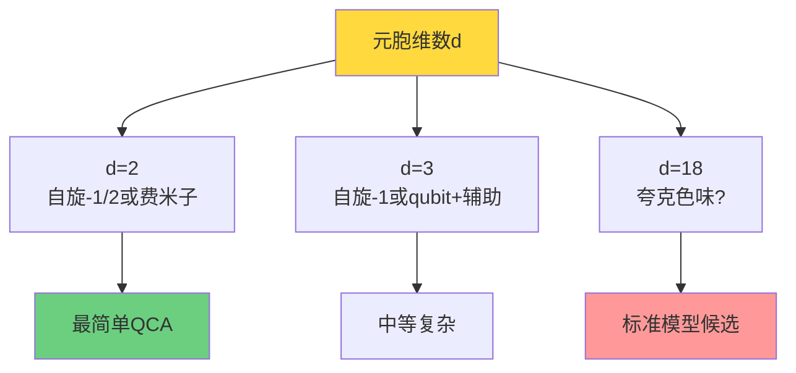

### 为什么必须有限维？

**定理2.2（有限维必要性）**：
如果$\dim \mathcal{H}_{\text{cell}} = \infty$，则无限体积$\Lambda$上的总Hilbert空间$\mathcal{H}$不可分（uncountable basis），导致：
1. 无法定义局域代数的张量积结构
2. 准局域$C^*$代数不良定义
3. QCA演化无法保证连续性

**证明思路**：
$$
\dim \mathcal{H} = \prod_{x \in \Lambda} \dim \mathcal{H}_x = \infty^\infty = 2^{\aleph_0}
$$
不可分空间，无法用可数基展开。

**物理含义**：
> 宇宙在每个格点的量子自由度必须有限！
>
> 这是QCA本体论的核心约束。

## 成分3：准局域$C^*$代数$\mathcal{A}$

### 无限张量积的构造

**有限体积代数**：
对有限集$F \Subset \Lambda$（$\Subset$表示有限子集）：
$$
\mathcal{H}_F := \bigotimes_{x \in F} \mathcal{H}_x \cong \mathbb{C}^{d^{|F|}}
$$
有界算符代数：
$$
\mathcal{A}_F := \mathcal{B}(\mathcal{H}_F)
$$
（$\mathcal{B}$表示所有有界算符）

**嵌入映射**：
若$F \subset G \Subset \Lambda$：
$$
\iota_{F,G}: \mathcal{A}_F \hookrightarrow \mathcal{A}_G, \quad A \mapsto A \otimes \mathbf{1}_{G \setminus F}
$$

**局域代数**：
$$
\mathcal{A}_{\text{loc}} := \bigcup_{F \Subset \Lambda} \mathcal{A}_F
$$
所有局域算符的集合。

**准局域$C^*$代数**：
$$
\mathcal{A} := \overline{\mathcal{A}_{\text{loc}}}^{\|\cdot\|}
$$
以算符范数$\|\cdot\|$完备化。

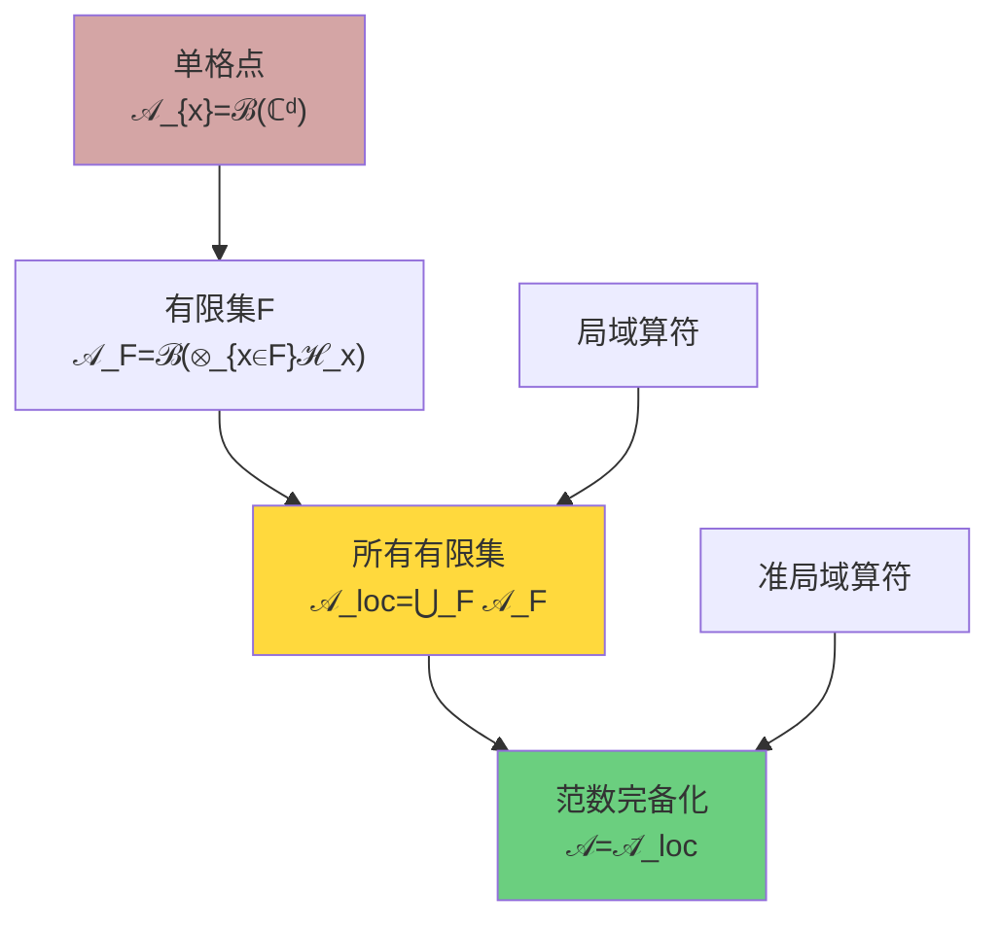

### 支撑的概念

**定义3.1（算符支撑）**：
对$A \in \mathcal{A}_{\text{loc}}$，存在最小的有限集$F \Subset \Lambda$使得$A \in \mathcal{A}_F$，称$F$为$A$的**支撑**：
$$
\text{supp}(A) := F
$$

**物理意义**：
$\text{supp}(A)$是算符$A$"真正作用"的格点集合。

**例子**：
- 单格点算符：$\text{supp}(\sigma^z_x) = \{x\}$
- 最近邻相互作用：$\text{supp}(\sigma^x_x \sigma^x_y) = \{x, y\}$

### $C^*$代数的基本性质

**定义3.2（$C^*$代数）**：
$\mathcal{A}$是$C^*$代数，满足：
1. **代数**：$A, B \in \mathcal{A} \Rightarrow A+B, AB \in \mathcal{A}$
2. **共轭**：$A \in \mathcal{A} \Rightarrow A^* \in \mathcal{A}$
3. **范数**：$\|AB\| \leq \|A\| \|B\|$
4. **$C^*$恒等式**：$\|A^* A\| = \|A\|^2$

**为什么是$C^*$代数？**

$C^*$代数是"非交换拓扑空间"的正确框架：
- 交换$C^*$代数 $\leftrightarrow$ 紧Hausdorff空间（Gelfand对偶）
- 非交换$C^*$代数 $\leftrightarrow$ "量子空间"

QCA的准局域$C^*$代数$\mathcal{A}$是"无限格点量子配置空间"的非交换几何。

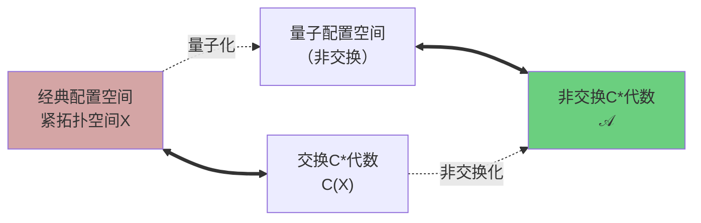

## 成分4：QCA演化$\alpha$

### $C^*$代数自同构

**定义4.1（QCA）**：
映射$\alpha: \mathcal{A} \to \mathcal{A}$称为**半径至多$R$的量子元胞自动机**，若：

**公理QCA-1（$*$自同构）**：
$$
\alpha(AB) = \alpha(A)\alpha(B), \quad \alpha(A^*) = \alpha(A)^*, \quad \alpha(\mathbf{1}) = \mathbf{1}
$$
且$\alpha$是双射和连续的。

**公理QCA-2（有限传播半径）**：
存在$R \in \mathbb{N}$，使得对任意有限$F \Subset \Lambda$和$A \in \mathcal{A}_F$：
$$
\text{supp}(\alpha(A)) \subset B_R(F) := \bigcup_{x \in F} B_R(x)
$$

**公理QCA-3（平移协变）**：
对平移$\tau_a$诱导的自同构$\theta_a: \mathcal{A} \to \mathcal{A}$：
$$
\alpha \circ \theta_a = \theta_a \circ \alpha, \quad \forall a \in \mathbb{Z}^d
$$

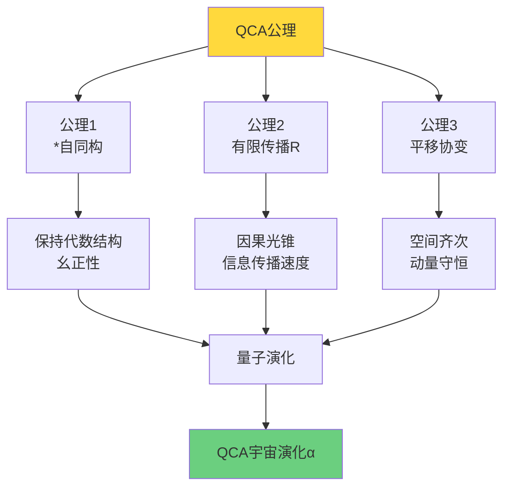

### 有限传播的物理意义

**直观图景**：
支撑在单点$\{x\}$的算符$A_x$，经过$n$步演化后：
$$
\text{supp}(\alpha^n(A_x)) \subset B_{nR}(x)
$$

**信息传播速度**：
设时间步长$\Delta t$，格距$a$，则信息传播最大速度：
$$
v_{\max} = \frac{R \cdot a}{\Delta t}
$$

在连续极限$a, \Delta t \to 0$且$c := a/\Delta t$固定时，若$R=1$：
$$
v_{\max} = c
$$
这正是**光速**！

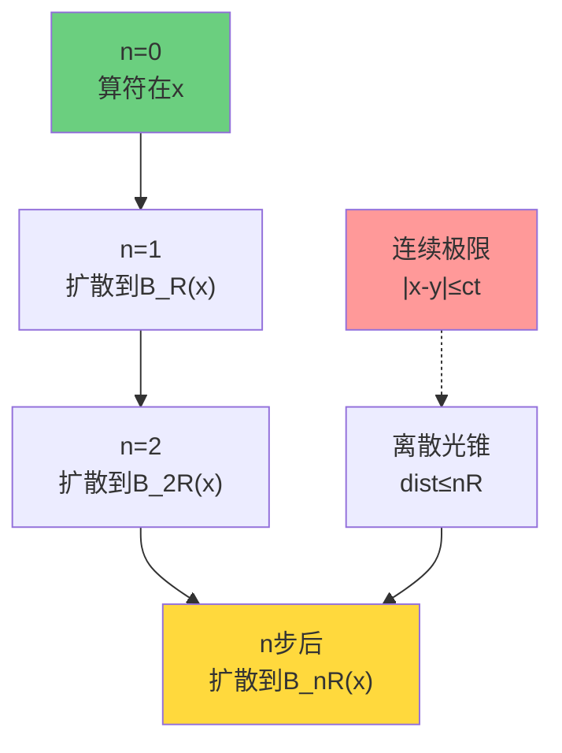

### Schumacher-Werner定理

**定理4.2（结构定理，Schumacher-Werner 2005）**：
任何满足公理QCA-1至QCA-3的$\alpha$都可以写成：
$$
\alpha = \theta_s \circ \beta
$$
其中$\beta$是**分块局域QCA**，$\theta_s$是某个空间平移。

**分块局域QCA**：
存在有限集$F_0 \Subset \mathbb{Z}^d$和幺正$u \in \mathcal{A}_{F_0}$，使得：
$$
\beta(A) = \prod_{a \in \mathbb{Z}^d} \theta_a(u) \cdot A \cdot \prod_{a \in \mathbb{Z}^d} \theta_a(u)^*
$$
（乘积在某个顺序下有限）

**物理诠释**：
QCA演化 = 周期性地在每个平移块$F_0 + a$上施加同一个局域幺正$u$。

这类似**Trotter分解**：
$$
e^{-it(H_1 + H_2)} \approx (e^{-i\Delta t H_1} e^{-i\Delta t H_2})^{t/\Delta t}
$$

### 迭代与时间演化

**定义4.3（迭代）**：
定义整数次迭代：
$$
\alpha^n := \underbrace{\alpha \circ \cdots \circ \alpha}_{n \text{ 次}}, \quad n \in \mathbb{N}
$$
$$
\alpha^0 := \text{id}, \quad \alpha^{-n} := (\alpha^{-1})^n
$$

**时间参数化**：
离散时间步$n \in \mathbb{Z}$对应物理时间：
$$
t = n \Delta t
$$

**连续极限**：
当$\Delta t \to 0$且$\alpha^n \to e^{-iHt/\hbar}$（适当意义下）时，恢复连续时间演化。

## 成分5：初始宇宙态$\omega_0$

### 态的定义

**定义5.1（态）**：
$C^*$代数$\mathcal{A}$上的**态**是线性泛函$\omega: \mathcal{A} \to \mathbb{C}$，满足：
1. **正性**：$\omega(A^* A) \geq 0, \quad \forall A \in \mathcal{A}$
2. **归一性**：$\omega(\mathbf{1}) = 1$

**物理意义**：
$\omega(A)$是可观测量$A$的期望值。

### 纯态与混态

**纯态**：
不可分解为其他态的非平凡凸组合。

**GNS表示**：
对纯态$\omega$，存在Hilbert空间$\mathcal{H}_\omega$、表示$\pi_\omega: \mathcal{A} \to \mathcal{B}(\mathcal{H}_\omega)$和循环向量$|\Omega_\omega\rangle \in \mathcal{H}_\omega$：
$$
\omega(A) = \langle \Omega_\omega | \pi_\omega(A) | \Omega_\omega \rangle
$$

**混态**：
可写为纯态的凸组合：
$$
\omega = \sum_i p_i \omega_i, \quad p_i \geq 0, \ \sum_i p_i = 1
$$

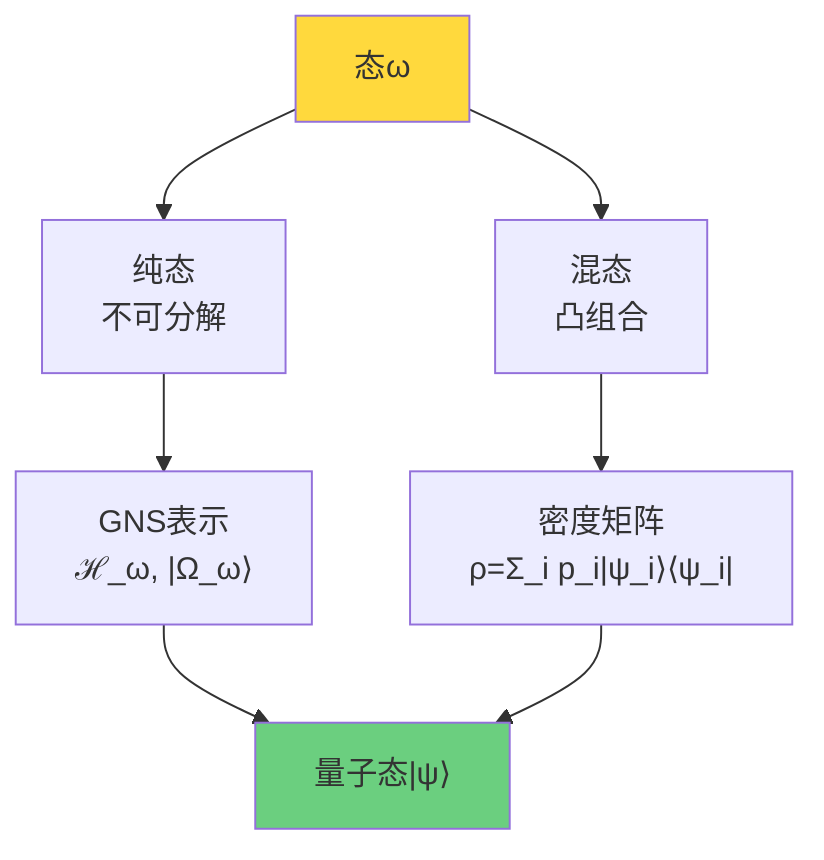

### 初始条件$\omega_0$

**定义5.2（初始宇宙态）**：
$\omega_0: \mathcal{A} \to \mathbb{C}$是$n=0$时刻的宇宙量子态。

**时间演化**：
在Heisenberg图像中，态随时间演化：
$$
\omega_n(A) := \omega_0(\alpha^{-n}(A)), \quad n \in \mathbb{Z}
$$

**Schrödinger图像**：
若$\omega_0$有GNS表示$(\mathcal{H}_0, \pi_0, |\Omega_0\rangle)$且$\alpha$可幺正实现为$U: \mathcal{H}_0 \to \mathcal{H}_0$：
$$
|\Omega_n\rangle = U^n |\Omega_0\rangle
$$

### 平移不变态

**定义5.3（平移不变）**：
态$\omega$称为**平移不变的**，若：
$$
\omega(\theta_a(A)) = \omega(A), \quad \forall a \in \mathbb{Z}^d, \ A \in \mathcal{A}
$$

**物理意义**：
宇宙在空间上齐次，无特殊位置。

**例子1：真空态**
量子场论的真空$|0\rangle$是平移不变的。

**例子2：热平衡态**
温度$T$的Gibbs态在平移下不变。

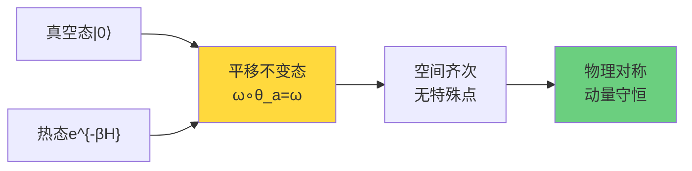

## 五元组的完整定义

### 宇宙QCA对象

**定义5.4（宇宙QCA对象）**：
五元组
$$
\mathfrak{U}_{\text{QCA}} = (\Lambda, \mathcal{H}_{\text{cell}}, \mathcal{A}, \alpha, \omega_0)
$$
称为**宇宙QCA对象**，若满足：

1. $\Lambda$是可数无限连通图，局域有限
2. $\mathcal{H}_{\text{cell}} \cong \mathbb{C}^d$有限维
3. $\mathcal{A}$是准局域$C^*$代数$\overline{\bigcup_{F \Subset \Lambda} \mathcal{A}_F}$
4. $\alpha: \mathcal{A} \to \mathcal{A}$满足公理QCA-1至QCA-3
5. $\omega_0: \mathcal{A} \to \mathbb{C}$是归一态（初始条件）

### 五元组的层次结构

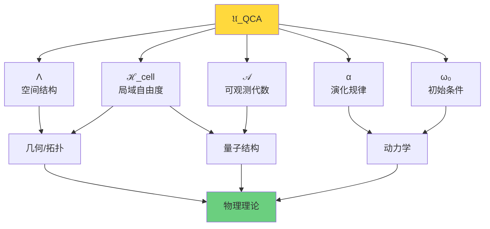

**层次解读**：

| 成分 | 决定什么 | 类比 |
|-----|---------|------|
| $\Lambda$ | 空间维度、拓扑 | 棋盘的格子 |
| $\mathcal{H}_{\text{cell}}$ | 每点自由度 | 每个格子上的棋子类型 |
| $\mathcal{A}$ | 可观测量 | 可能的观察/测量 |
| $\alpha$ | 演化规律 | 游戏规则 |
| $\omega_0$ | 初始配置 | 游戏开局 |

## 从公理到物理：三个关键推论

### 推论1：因果结构涌现

**命题（下一节详细证明）**：
从QCA公理，事件集合$E = \Lambda \times \mathbb{Z}$上自然诱导因果偏序：
$$
(x,n) \preceq (y,m) \iff m \geq n \text{ 且 } \text{dist}(x,y) \leq R(m-n)
$$

**物理意义**：
因果结构不是预先给定的，而是从QCA局域性**自然涌现**。

### 推论2：幺正性与信息守恒

**定理（幺正实现）**：
若$\omega_0$是忠实平移不变态，则存在GNS表示$(\mathcal{H}_0, \pi_0, |\Omega_0\rangle)$和幺正算符$U: \mathcal{H}_0 \to \mathcal{H}_0$：
$$
\pi_0(\alpha(A)) = U \pi_0(A) U^\dagger
$$

**物理意义**：
QCA演化保持信息 → 量子信息守恒 → 可逆性。

### 推论3：Lieb-Robinson界

**定理（Lieb-Robinson界）**：
对局域算符$A, B$，支撑在$X, Y \Subset \Lambda$且$\text{dist}(X,Y) = r$：
$$
\|[\alpha^n(A), B]\| \leq C \|A\| \|B\| e^{-\mu(r - vn)}
$$
其中$v = O(R)$是有效光速，$\mu > 0$。

**物理意义**：
即使在离散时间，量子信息传播仍有类似相对论的**速度上界**。

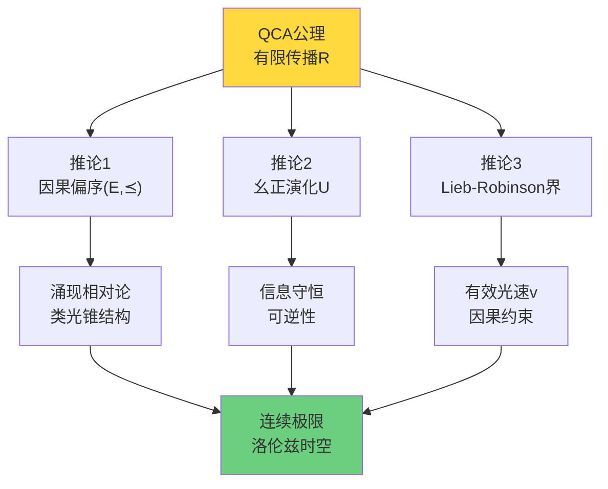

## 通俗类比：QCA是"宇宙操作系统"

### 计算机操作系统类比

让我们用操作系统类比五元组：

| QCA成分 | 操作系统类比 | 解释 |
|--------|-------------|------|
| $\Lambda$ | 内存地址空间 | 离散、有限（如64位地址） |
| $\mathcal{H}_{\text{cell}}$ | 每个地址的字节数 | 每个位置存储的信息量 |
| $\mathcal{A}$ | 可执行的指令集 | 允许的操作 |
| $\alpha$ | CPU时钟周期 | 每个时钟周期执行的指令 |
| $\omega_0$ | 系统初始化状态 | 开机时的内存配置 |

**深入类比**：

**离散空间$\Lambda$** = 内存地址
- $\Lambda = \mathbb{Z}^3$ ~ 3D内存布局
- 局域有限性 ~ 每个地址有限邻居

**元胞空间$\mathcal{H}_{\text{cell}}$** = 寄存器大小
- $d=2$ ~ 1 bit（$|0\rangle, |1\rangle$）
- $d=256$ ~ 1 byte

**准局域代数$\mathcal{A}$** = 指令集架构
- 局域算符 ~ 单条指令（只涉及几个寄存器）
- 准局域代数 ~ 整个指令集（可无限组合）

**QCA演化$\alpha$** = 时钟周期
- 单步$\alpha$ ~ 一个CPU时钟
- 有限传播$R$ ~ 指令只能访问相邻缓存

**初态$\omega_0$** = BIOS/引导程序
- 决定系统启动状态

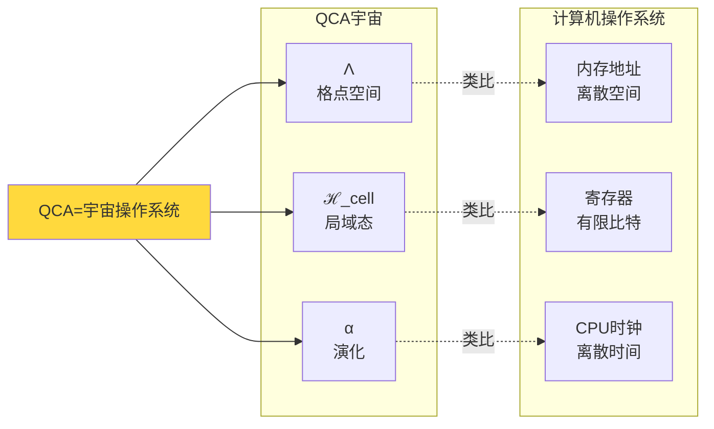

**关键洞察**：
> 就像操作系统在离散的内存地址、有限的寄存器、离散的时钟周期上运行，
>
> 宇宙也在离散的格点、有限的量子态、离散的时间步上"运行"！

### 棋类游戏类比

另一个通俗类比：国际象棋。

| QCA成分 | 国际象棋 |
|--------|---------|
| $\Lambda$ | 8×8棋盘 |
| $\mathcal{H}_{\text{cell}}$ | 每格可能的棋子（空、白兵、黑兵...） |
| $\mathcal{A}$ | 所有可能的棋盘配置 |
| $\alpha$ | 行棋规则（移动+吃子） |
| $\omega_0$ | 开局配置 |

**有限传播半径$R$**：
- 兵：$R=1$（只能移动1格）
- 马：$R=\sqrt{5}$（日字走法）
- 车/后：$R$可以很大（斜线/直线）

**平移协变**：
棋规在棋盘各处相同（除了边界特殊规则）。

**幺正性**：
现代国际象棋不可逆，但**可逆国际象棋**（每步可撤销）类似QCA的幺正性。

## 小结：五元组的统一图景

QCA五元组$(\Lambda, \mathcal{H}_{\text{cell}}, \mathcal{A}, \alpha, \omega_0)$是宇宙最简洁的数学定义：

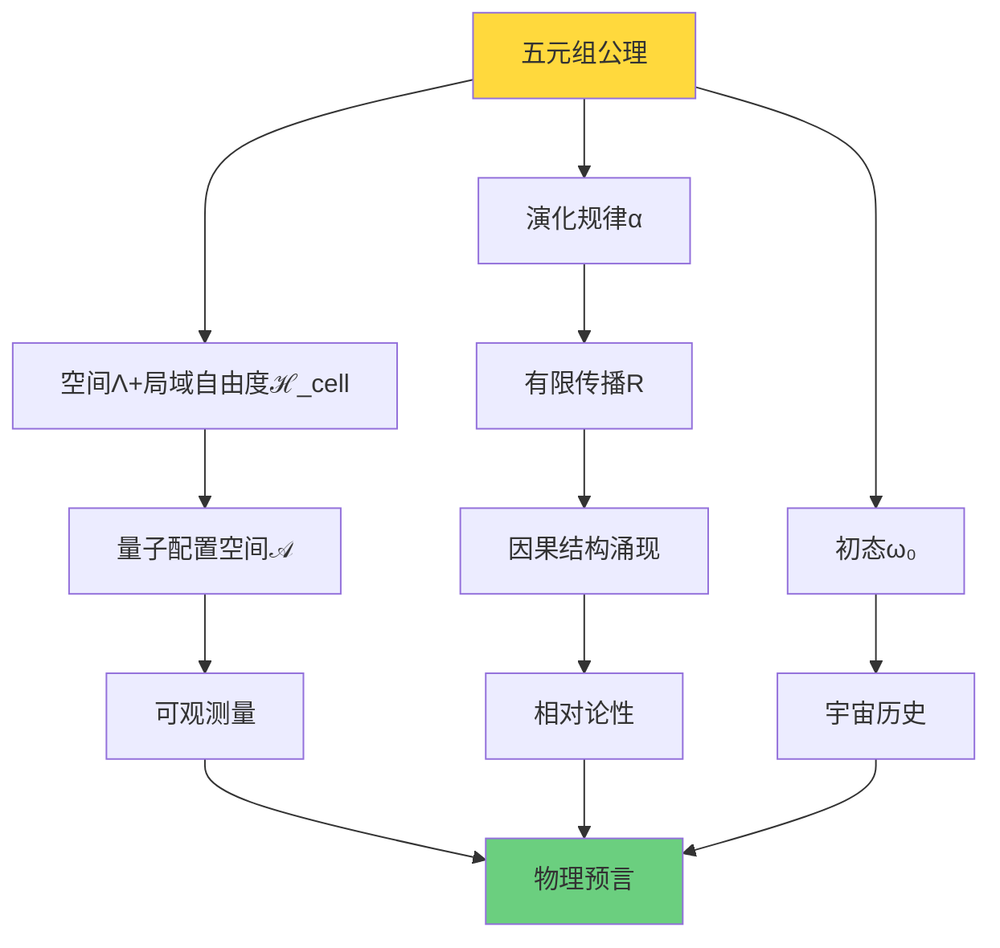

**核心要点**：

1. **$\Lambda$**：决定空间维度和拓扑
2. **$\mathcal{H}_{\text{cell}}$**：决定局域量子自由度（必须有限！）
3. **$\mathcal{A}$**：包含所有可观测量
4. **$\alpha$**：编码物理定律（有限传播 → 因果性）
5. **$\omega_0$**：宇宙的初始条件

**哲学启示**：
> 这五个成分完全确定了一个宇宙。
>
> 没有其他"隐变量"，没有"背景时空"。
>
> 宇宙 = QCA，一切从此涌现！

## 下一步：因果结构的涌现

下一节将证明：从QCA的有限传播半径$R$，如何严格导出事件集合$E = \Lambda \times \mathbb{Z}$上的因果偏序$(E, \preceq)$。

我们将看到：
- **几何关系** $\leq_{\text{geo}}$从$R$的定义
- **统计因果关系** $\preceq_{\text{stat}}$从关联函数的定义
- **定理**：两者等价$\leq_{\text{geo}} = \preceq_{\text{stat}}$

这将揭示：**相对论性因果结构不是假设，而是QCA局域性的必然结果**！

这是QCA范式最深刻的洞察之一——连续时空的因果光锥，源于离散QCA的有限传播！
