# QCA Axiomatization: Rigorous Foundation of Five-Tuple Definition

In previous section, we saw intuitive picture of QCA universe—discrete spacetime, finite-dimensional states, local evolution. Now we give **rigorous mathematical definition**.

## Why Axiomatization?

### From Intuition to Rigor

In history of physics, axiomatization always transforms vague intuition into precise mathematics:

**Example 1: Euclidean Geometry**
- Intuition: "Obvious" properties of points, lines, surfaces
- Axiomatization: Five axioms → entire geometry

**Example 2: Quantum Mechanics**
- Intuition: Wave-particle duality, measurement collapse
- Axiomatization: Hilbert space + unitary evolution + Born rule

**Example 3: QCA Universe**
- Intuition: Discrete lattice points, local jumps, quantum superposition
- Axiomatization: Five-tuple $(\Lambda, \mathcal{H}_{\text{cell}}, \mathcal{A}, \alpha, \omega_0)$

**Benefits of Axiomatization**:
1. **Eliminate Ambiguity**: Every concept has precise definition
2. **Logical Self-Consistency**: Derive from axioms, avoid circular reasoning
3. **Testability**: Clearly distinguish assumptions from conclusions
4. **Universality**: Axioms apply to all systems satisfying conditions

## Five Components of Five-Tuple

Universe QCA object is defined as:
$$\mathfrak{U}_{\text{QCA}} = (\Lambda, \mathcal{H}_{\text{cell}}, \mathcal{A}, \alpha, \omega_0)$$

Let's go deep into each component.

## Component 1: Discrete Space $\Lambda$

### Graph Theory Foundation

**Definition 1.1 (Countable Connected Graph)**:
$\Lambda$ is countable set, carrying undirected connected graph structure:
- **Vertex Set**: $\Lambda$ (countably infinite or finite)
- **Edge Set**: $E_\Lambda \subset \Lambda \times \Lambda$
- **Symmetry**: $(x,y) \in E_\Lambda \Rightarrow (y,x) \in E_\Lambda$
- **No Self-Loops**: $(x,x) \notin E_\Lambda$
- **Connectivity**: Path exists between any $x, y \in \Lambda$

**Graph Distance**:
$$\text{dist}(x,y) = \min\{n : \text{exists path of length }n\text{ connecting }x,y\}$$

**Closed Ball**:
$$B_R(x) := \{y \in \Lambda : \text{dist}(x,y) \leq R\}$$

**Local Finiteness Assumption**: For all $x \in \Lambda$ and $R \in \mathbb{N}$, $|B_R(x)| < \infty$.

```mermaid
graph TD
    A["Graph Λ"] --> B["Vertices=Lattice Points"]
    A --> C["Edges=Neighbor Relations"]

    B --> D["ℤᵈ Lattice<br/>Standard Example"]
    C --> E["dist(x,y)<br/>Shortest Path Length"]

    E --> F["Closed Ball B_R(x)<br/>All Points Within Radius R"]

    F --> G["Locally Finite<br/>|B_R(x)|<∞"]

    style A fill:#ffd93d
    style D fill:#6bcf7f
    style G fill:#6bcf7f
```

### Standard Lattice $\mathbb{Z}^d$

**Most Common Choice**: $\Lambda = \mathbb{Z}^d$ ($d$-dimensional integer lattice)

**One-Dimensional** ($d=1$): $\Lambda = \mathbb{Z} = \{\ldots, -2, -1, 0, 1, 2, \ldots\}$
- Neighbor relation: $(x, x+1)$
- Distance: $\text{dist}(x,y) = |x - y|$

**Two-Dimensional** ($d=2$): $\Lambda = \mathbb{Z}^2$ (planar lattice points)
- Neighbor relation: $(x,y)$ with $(x \pm 1, y)$, $(x, y \pm 1)$
- Distance (Manhattan): $\text{dist}((x_1,y_1), (x_2,y_2)) = |x_1-x_2| + |y_1-y_2|$

**Three-Dimensional** ($d=3$): $\Lambda = \mathbb{Z}^3$ (spatial lattice points)
- Corresponds to discretization of physical space
- Cubic lattice structure

```mermaid
graph TD
    A["Dimension d"] --> B["d=1<br/>One-Dimensional Chain"]
    A --> C["d=2<br/>Two-Dimensional Plane"]
    A --> D["d=3<br/>Three-Dimensional Space"]

    B --> E["...─○─○─○─○─..."]
    C --> F["Square Lattice Network"]
    D --> G["Cubic Lattice"]

    H["Physical Space<br/>ℝ³"] -.->|Discretization| D

    style A fill:#ffd93d
    style D fill:#6bcf7f
    style H fill:#d4a5a5
```

### Translation Symmetry

**Definition 1.2 (Translation Action)**:
For $\Lambda = \mathbb{Z}^d$, translation $\tau_a: \Lambda \to \Lambda$ is defined as:
$$\tau_a(x) := x + a, \quad a \in \mathbb{Z}^d$$

**Properties**:
- $\tau_a \circ \tau_b = \tau_{a+b}$ (group property)
- $\tau_0 = \text{id}$ (identity)
- $\tau_a^{-1} = \tau_{-a}$ (inverse)

**Physical Meaning**:
Space invariant under translations → momentum conservation (Noether theorem)

### Why Discrete? Three Reasons

**Reason 1: UV Cutoff**

Continuous space $\mathbb{R}^d$ has UV divergences:
$$\int \frac{d^dk}{(2\pi)^d} \frac{1}{k^2} \sim \int_0^\infty k^{d-3} dk \to \infty \quad (d \geq 3)$$

Discrete space naturally cuts off:
$$\sum_{x \in \Lambda} \to \int \frac{d^dx}{a^d}, \quad a = \text{lattice spacing}$$
Maximum momentum $k_{\max} = \pi/a$ (Brillouin zone boundary).

**Reason 2: Information Finiteness**

Continuous space infinite-dimensional per point → infinite information.
Discrete space $\Lambda$ countable + finite-dimensional $\mathcal{H}_{\text{cell}}$ → finite information per finite volume.

**Reason 3: Quantum Gravity Hint**

Planck scale $\ell_P = \sqrt{\hbar G/c^3} \approx 10^{-35}$ m suggests spacetime discreteness.

```mermaid
graph LR
    A["Continuous Space ℝᵈ"] --> B["UV Divergences<br/>Infinite Information<br/>Planck Limit?"]

    C["Discrete Space Λ"] --> D["Natural Cutoff<br/>Finite Information<br/>Quantum Gravity Friendly"]

    B -.->|Paradigm Shift| D

    style A fill:#ff6b6b
    style B fill:#ff6b6b
    style C fill:#ffd93d
    style D fill:#6bcf7f
```

## Component 2: Cellular Hilbert Space $\mathcal{H}_{\text{cell}}$

### Finite-Dimensional Quantum State Space

**Definition 2.1 (Cellular Space)**:
$\mathcal{H}_{\text{cell}}$ is finite-dimensional complex Hilbert space:
$$\mathcal{H}_{\text{cell}} \cong \mathbb{C}^d, \quad d \in \mathbb{N}$$

Each lattice point $x \in \Lambda$ carries a copy:
$$\mathcal{H}_x \cong \mathcal{H}_{\text{cell}}$$

**Inner Product**:
$$\langle \psi | \phi \rangle = \sum_{i=1}^d \overline{\psi_i} \phi_i$$

**Orthonormal Basis**:
$$\{|i\rangle : i = 1, \ldots, d\}, \quad \langle i|j \rangle = \delta_{ij}$$

### Physical Interpretation: Local Degrees of Freedom

Value of $d$ determines **quantum degree of freedom dimension** of each lattice point:

**Example 1: Spin**
- $d=2$: Spin-1/2 (up $|\uparrow\rangle$, down $|\downarrow\rangle$)
- $d=3$: Spin-1 ($|1\rangle, |0\rangle, |-1\rangle$)

**Example 2: Occupation Number**
- $d=2$: Fermion (empty $|0\rangle$, occupied $|1\rangle$)
- $d=N$: Boson (truncated $|0\rangle, |1\rangle, \ldots, |N-1\rangle$)

**Example 3: Standard Model**
- $d=18$: 3 colors × 2 flavors × 3 generations?
- Gauge degrees of freedom on edges (see Component 3)

### Why Must Be Finite-Dimensional?

**Theorem 2.2 (Finite-Dimensional Necessity)**:
If $\dim \mathcal{H}_{\text{cell}} = \infty$, then total Hilbert space $\mathcal{H}$ on infinite volume $\Lambda$ is non-separable (uncountable basis), causing:
1. Cannot define tensor product structure of local algebras
2. Quasi-local $C^*$ algebra ill-defined
3. QCA evolution cannot guarantee continuity

**Proof Idea**:
$$\dim \mathcal{H} = \prod_{x \in \Lambda} \dim \mathcal{H}_x = \infty^\infty = 2^{\aleph_0}$$
Non-separable space, cannot expand with countable basis.

**Physical Meaning**:
> Quantum degrees of freedom of universe at each lattice point must be finite!
>
> This is core constraint of QCA ontology.

## Component 3: Quasi-Local $C^*$ Algebra $\mathcal{A}$

### Construction of Infinite Tensor Product

**Finite Volume Algebra**:
For finite set $F \Subset \Lambda$ ($\Subset$ means finite subset):
$$\mathcal{H}_F := \bigotimes_{x \in F} \mathcal{H}_x \cong \mathbb{C}^{d^{|F|}}$$
Bounded operator algebra:
$$\mathcal{A}_F := \mathcal{B}(\mathcal{H}_F)$$
($\mathcal{B}$ means all bounded operators)

**Embedding Map**:
If $F \subset G \Subset \Lambda$:
$$\iota_{F,G}: \mathcal{A}_F \hookrightarrow \mathcal{A}_G, \quad A \mapsto A \otimes \mathbf{1}_{G \setminus F}$$

**Local Algebra**:
$$\mathcal{A}_{\text{loc}} := \bigcup_{F \Subset \Lambda} \mathcal{A}_F$$
Set of all local operators.

**Quasi-Local $C^*$ Algebra**:
$$\mathcal{A} := \overline{\mathcal{A}_{\text{loc}}}^{\|\cdot\|}$$
Completion with operator norm $\|\cdot\|$.

```mermaid
graph TD
    A["Single Lattice Point<br/>𝒜_{x}=ℬ(ℂᵈ)"] --> B["Finite Set F<br/>𝒜_F=ℬ(⊗_{x∈F}ℋ_x)"]

    B --> C["All Finite Sets<br/>𝒜_loc=⋃_F 𝒜_F"]

    C --> D["Norm Completion<br/>𝒜=𝒜̄_loc"]

    E["Local Operators"] --> C
    F["Quasi-Local Operators"] --> D

    style A fill:#d4a5a5
    style C fill:#ffd93d
    style D fill:#6bcf7f
```

### Concept of Support

**Definition 3.1 (Operator Support)**:
For $A \in \mathcal{A}_{\text{loc}}$, there exists smallest finite set $F \Subset \Lambda$ such that $A \in \mathcal{A}_F$, call $F$ the **support** of $A$:
$$\text{supp}(A) := F$$

**Physical Meaning**:
$\text{supp}(A)$ is lattice point set where operator $A$ "truly acts".

**Examples**:
- Single lattice point operator: $\text{supp}(\sigma^z_x) = \{x\}$
- Nearest neighbor interaction: $\text{supp}(\sigma^x_x \sigma^x_y) = \{x, y\}$

### Basic Properties of $C^*$ Algebra

**Definition 3.2 ($C^*$ Algebra)**:
$\mathcal{A}$ is $C^*$ algebra, satisfying:
1. **Algebra**: $A, B \in \mathcal{A} \Rightarrow A+B, AB \in \mathcal{A}$
2. **Conjugation**: $A \in \mathcal{A} \Rightarrow A^* \in \mathcal{A}$
3. **Norm**: $\|AB\| \leq \|A\| \|B\|$
4. **$C^*$ Identity**: $\|A^* A\| = \|A\|^2$

**Why $C^*$ Algebra?**

$C^*$ algebra is correct framework for "non-commutative topological spaces":
- Commutative $C^*$ algebra $\leftrightarrow$ Compact Hausdorff space (Gelfand duality)
- Non-commutative $C^*$ algebra $\leftrightarrow$ "Quantum space"

Quasi-local $C^*$ algebra $\mathcal{A}$ of QCA is non-commutative geometry of "infinite lattice quantum configuration space".

```mermaid
graph LR
    A["Classical Configuration Space<br/>Compact Topological Space X"] <==> B["Commutative C* Algebra<br/>C(X)"]

    C["Quantum Configuration Space<br/>(Non-Commutative)"] <==> D["Non-Commutative C* Algebra<br/>𝒜"]

    A -.->|Quantization| C
    B -.->|Non-Commutativization| D

    style A fill:#d4a5a5
    style D fill:#6bcf7f
```

## Component 4: QCA Evolution $\alpha$

### $C^*$ Algebra Automorphism

**Definition 4.1 (QCA)**:
Map $\alpha: \mathcal{A} \to \mathcal{A}$ is called **quantum cellular automaton of radius at most $R$** if:

**Axiom QCA-1 ($*$-Automorphism)**:
$$\alpha(AB) = \alpha(A)\alpha(B), \quad \alpha(A^*) = \alpha(A)^*, \quad \alpha(\mathbf{1}) = \mathbf{1}$$
and $\alpha$ is bijective and continuous.

**Axiom QCA-2 (Finite Propagation Radius)**:
There exists $R \in \mathbb{N}$ such that for any finite $F \Subset \Lambda$ and $A \in \mathcal{A}_F$:
$$\text{supp}(\alpha(A)) \subset B_R(F) := \bigcup_{x \in F} B_R(x)$$

**Axiom QCA-3 (Translation Covariant)**:
For automorphism $\theta_a: \mathcal{A} \to \mathcal{A}$ induced by translation $\tau_a$:
$$\alpha \circ \theta_a = \theta_a \circ \alpha, \quad \forall a \in \mathbb{Z}^d$$

```mermaid
graph TD
    A["QCA Axioms"] --> B["Axiom 1<br/>*-Automorphism"]
    A --> C["Axiom 2<br/>Finite Propagation R"]
    A --> D["Axiom 3<br/>Translation Covariant"]

    B --> E["Preserve Algebra Structure<br/>Unitarity"]
    C --> F["Causal Light Cone<br/>Information Propagation Speed"]
    D --> G["Spatial Homogeneity<br/>Momentum Conservation"]

    E --> H["Quantum Evolution"]
    F --> H
    G --> H

    H --> I["QCA Universe Evolution α"]

    style A fill:#ffd93d
    style I fill:#6bcf7f
```

### Physical Meaning of Finite Propagation

**Intuitive Picture**:
Operator $A_x$ supported on single point $\{x\}$, after $n$ steps of evolution:
$$\text{supp}(\alpha^n(A_x)) \subset B_{nR}(x)$$

**Information Propagation Speed**:
Let time step $\Delta t$, lattice spacing $a$, then maximum information propagation speed:
$$v_{\max} = \frac{R \cdot a}{\Delta t}$$

In continuous limit $a, \Delta t \to 0$ with $c := a/\Delta t$ fixed, if $R=1$:
$$v_{\max} = c$$
This is exactly **speed of light**!

### Schumacher-Werner Theorem

**Theorem 4.2 (Structure Theorem, Schumacher-Werner 2005)**:
Any $\alpha$ satisfying Axioms QCA-1 to QCA-3 can be written as:
$$\alpha = \theta_s \circ \beta$$
where $\beta$ is **block-local QCA**, $\theta_s$ is some spatial translation.

**Block-Local QCA**:
There exists finite set $F_0 \Subset \mathbb{Z}^d$ and unitary $u \in \mathcal{A}_{F_0}$ such that:
$$\beta(A) = \prod_{a \in \mathbb{Z}^d} \theta_a(u) \cdot A \cdot \prod_{a \in \mathbb{Z}^d} \theta_a(u)^*$$
(product finite in some order)

**Physical Interpretation**:
QCA evolution = periodically apply same local unitary $u$ on each translation block $F_0 + a$.

This is similar to **Trotter decomposition**:
$$e^{-it(H_1 + H_2)} \approx (e^{-i\Delta t H_1} e^{-i\Delta t H_2})^{t/\Delta t}$$

### Iteration and Time Evolution

**Definition 4.3 (Iteration)**:
Define integer iterations:
$$\alpha^n := \underbrace{\alpha \circ \cdots \circ \alpha}_{n \text{ times}}, \quad n \in \mathbb{N}$$
$$\alpha^0 := \text{id}, \quad \alpha^{-n} := (\alpha^{-1})^n$$

**Time Parameterization**:
Discrete time step $n \in \mathbb{Z}$ corresponds to physical time:
$$t = n \Delta t$$

**Continuous Limit**:
When $\Delta t \to 0$ and $\alpha^n \to e^{-iHt/\hbar}$ (in appropriate sense), recover continuous time evolution.

## Component 5: Initial Universe State $\omega_0$

### Definition of State

**Definition 5.1 (State)**:
**State** on $C^*$ algebra $\mathcal{A}$ is linear functional $\omega: \mathcal{A} \to \mathbb{C}$ satisfying:
1. **Positivity**: $\omega(A^* A) \geq 0, \quad \forall A \in \mathcal{A}$
2. **Normalization**: $\omega(\mathbf{1}) = 1$

**Physical Meaning**:
$\omega(A)$ is expectation value of observable $A$.

### Pure States and Mixed States

**Pure State**:
Cannot be decomposed into non-trivial convex combination of other states.

**GNS Representation**:
For pure state $\omega$, there exists Hilbert space $\mathcal{H}_\omega$, representation $\pi_\omega: \mathcal{A} \to \mathcal{B}(\mathcal{H}_\omega)$ and cyclic vector $|\Omega_\omega\rangle \in \mathcal{H}_\omega$:
$$\omega(A) = \langle \Omega_\omega | \pi_\omega(A) | \Omega_\omega \rangle$$

**Mixed State**:
Can be written as convex combination of pure states:
$$\omega = \sum_i p_i \omega_i, \quad p_i \geq 0, \ \sum_i p_i = 1$$

```mermaid
graph TD
    A["State ω"] --> B["Pure State<br/>Indecomposable"]
    A --> C["Mixed State<br/>Convex Combination"]

    B --> D["GNS Representation<br/>ℋ_ω, |Ω_ω⟩"]
    C --> E["Density Matrix<br/>ρ=Σ_i p_i|ψ_i⟩⟨ψ_i|"]

    D --> F["Quantum State |ψ⟩"]
    E --> F

    style A fill:#ffd93d
    style F fill:#6bcf7f
```

### Initial Condition $\omega_0$

**Definition 5.2 (Initial Universe State)**:
$\omega_0: \mathcal{A} \to \mathbb{C}$ is quantum state of universe at $n=0$.

**Time Evolution**:
In Heisenberg picture, state evolves with time:
$$\omega_n(A) := \omega_0(\alpha^{-n}(A)), \quad n \in \mathbb{Z}$$

**Schrödinger Picture**:
If $\omega_0$ has GNS representation $(\mathcal{H}_0, \pi_0, |\Omega_0\rangle)$ and $\alpha$ can be unitarily realized as $U: \mathcal{H}_0 \to \mathcal{H}_0$:
$$|\Omega_n\rangle = U^n |\Omega_0\rangle$$

### Translation-Invariant States

**Definition 5.3 (Translation-Invariant)**:
State $\omega$ is called **translation-invariant** if:
$$\omega(\theta_a(A)) = \omega(A), \quad \forall a \in \mathbb{Z}^d, \ A \in \mathcal{A}$$

**Physical Meaning**:
Universe homogeneous in space, no special position.

**Example 1: Vacuum State**
Vacuum $|0\rangle$ of quantum field theory is translation-invariant.

**Example 2: Thermal Equilibrium State**
Gibbs state at temperature $T$ is invariant under translations.

```mermaid
graph LR
    A["Translation-Invariant State<br/>ω∘θ_a=ω"] --> B["Spatial Homogeneity<br/>No Special Point"]

    B --> C["Physical Symmetry<br/>Momentum Conservation"]

    D["Vacuum State |0⟩"] --> A
    E["Thermal State e^{-βH}"] --> A

    style A fill:#ffd93d
    style C fill:#6bcf7f
```

## Complete Definition of Five-Tuple

### Universe QCA Object

**Definition 5.4 (Universe QCA Object)**:
Five-tuple
$$\mathfrak{U}_{\text{QCA}} = (\Lambda, \mathcal{H}_{\text{cell}}, \mathcal{A}, \alpha, \omega_0)$$
is called **universe QCA object** if satisfies:

1. $\Lambda$ is countably infinite connected graph, locally finite
2. $\mathcal{H}_{\text{cell}} \cong \mathbb{C}^d$ finite-dimensional
3. $\mathcal{A}$ is quasi-local $C^*$ algebra $\overline{\bigcup_{F \Subset \Lambda} \mathcal{A}_F}$
4. $\alpha: \mathcal{A} \to \mathcal{A}$ satisfies Axioms QCA-1 to QCA-3
5. $\omega_0: \mathcal{A} \to \mathbb{C}$ is normalized state (initial condition)

### Hierarchical Structure of Five-Tuple

```mermaid
graph TD
    A["𝔘_QCA"] --> B["Λ<br/>Spatial Structure"]
    A --> C["ℋ_cell<br/>Local Degrees of Freedom"]
    A --> D["𝒜<br/>Observable Algebra"]
    A --> E["α<br/>Evolution Law"]
    A --> F["ω₀<br/>Initial Condition"]

    B --> G["Geometry/Topology"]
    C --> G

    D --> H["Quantum Structure"]
    C --> H

    E --> I["Dynamics"]
    F --> I

    G --> J["Physical Theory"]
    H --> J
    I --> J

    style A fill:#ffd93d
    style J fill:#6bcf7f
```

**Hierarchical Interpretation**:

| Component | Determines What | Analogy |
|-----------|----------------|---------|
| $\Lambda$ | Spatial dimension, topology | Chessboard squares |
| $\mathcal{H}_{\text{cell}}$ | Degrees of freedom per point | Type of piece on each square |
| $\mathcal{A}$ | Observables | Possible observations/measurements |
| $\alpha$ | Evolution law | Game rules |
| $\omega_0$ | Initial configuration | Game opening |

## From Axioms to Physics: Three Key Corollaries

### Corollary 1: Causal Structure Emergence

**Proposition** (detailed proof in next section):
From QCA axioms, event set $E = \Lambda \times \mathbb{Z}$ naturally induces causal partial order:
$$(x,n) \preceq (y,m) \iff m \geq n \text{ and } \text{dist}(x,y) \leq R(m-n)$$

**Physical Meaning**:
Causal structure is not pre-given, but **naturally emerges** from QCA locality.

### Corollary 2: Unitarity and Information Conservation

**Theorem (Unitary Realization)**:
If $\omega_0$ is faithful translation-invariant state, then there exists GNS representation $(\mathcal{H}_0, \pi_0, |\Omega_0\rangle)$ and unitary operator $U: \mathcal{H}_0 \to \mathcal{H}_0$:
$$\pi_0(\alpha(A)) = U \pi_0(A) U^\dagger$$

**Physical Meaning**:
QCA evolution preserves information → quantum information conservation → reversibility.

### Corollary 3: Lieb-Robinson Bound

**Theorem (Lieb-Robinson Bound)**:
For local operators $A, B$ supported on $X, Y \Subset \Lambda$ with $\text{dist}(X,Y) = r$:
$$\|[\alpha^n(A), B]\| \leq C \|A\| \|B\| e^{-\mu(r - vn)}$$
where $v = O(R)$ is effective light speed, $\mu > 0$.

**Physical Meaning**:
Even in discrete time, quantum information propagation still has **speed upper bound** similar to relativity.

```mermaid
graph TD
    A["QCA Axioms<br/>Finite Propagation R"] --> B["Corollary 1<br/>Causal Partial Order (E,⪯)"]
    A --> C["Corollary 2<br/>Unitary Evolution U"]
    A --> D["Corollary 3<br/>Lieb-Robinson Bound"]

    B --> E["Emergent Relativity<br/>Light Cone Structure"]
    C --> F["Information Conservation<br/>Reversibility"]
    D --> G["Effective Light Speed v<br/>Causal Constraint"]

    E --> H["Continuous Limit<br/>Lorentzian Spacetime"]
    F --> H
    G --> H

    style A fill:#ffd93d
    style H fill:#6bcf7f
```

## Popular Analogy: QCA as "Universe Operating System"

### Computer Operating System Analogy

Let's use operating system analogy for five-tuple:

| QCA Component | Operating System Analogy | Explanation |
|--------------|-------------------------|-------------|
| $\Lambda$ | Memory address space | Discrete, finite (e.g., 64-bit addresses) |
| $\mathcal{H}_{\text{cell}}$ | Bytes per address | Information stored at each location |
| $\mathcal{A}$ | Executable instruction set | Allowed operations |
| $\alpha$ | CPU clock cycle | Instructions executed per clock cycle |
| $\omega_0$ | System initialization state | Memory configuration at boot |

**Deep Analogy**:

**Discrete Space $\Lambda$** = Memory addresses
- $\Lambda = \mathbb{Z}^3$ ~ 3D memory layout
- Local finiteness ~ finite neighbors per address

**Cellular Space $\mathcal{H}_{\text{cell}}$** = Register size
- $d=2$ ~ 1 bit ($|0\rangle, |1\rangle$)
- $d=256$ ~ 1 byte

**Quasi-Local Algebra $\mathcal{A}$** = Instruction set architecture
- Local operators ~ single instructions (involve few registers)
- Quasi-local algebra ~ entire instruction set (can combine infinitely)

**QCA Evolution $\alpha$** = Clock cycle
- Single step $\alpha$ ~ one CPU clock
- Finite propagation $R$ ~ instructions can only access adjacent cache

**Initial State $\omega_0$** = BIOS/boot program
- Determines system startup state

```mermaid
graph LR
    subgraph "QCA Universe"
    A1["Λ<br/>Lattice Space"]
    A2["ℋ_cell<br/>Local States"]
    A3["α<br/>Evolution"]
    end

    subgraph "Computer Operating System"
    B1["Memory Addresses<br/>Discrete Space"]
    B2["Registers<br/>Finite Bits"]
    B3["CPU Clock<br/>Discrete Time"]
    end

    A1 -.->|Analogy| B1
    A2 -.->|Analogy| B2
    A3 -.->|Analogy| B3

    C["QCA=Universe Operating System"] --> A1
    C --> A2
    C --> A3

    style C fill:#ffd93d
```

**Key Insight**:
> Just as operating system runs on discrete memory addresses, finite registers, discrete clock cycles,
>
> universe also "runs" on discrete lattice points, finite quantum states, discrete time steps!

### Chess Game Analogy

Another popular analogy: Chess.

| QCA Component | Chess |
|--------------|-------|
| $\Lambda$ | 8×8 chessboard |
| $\mathcal{H}_{\text{cell}}$ | Possible pieces per square (empty, white pawn, black pawn...) |
| $\mathcal{A}$ | All possible board configurations |
| $\alpha$ | Move rules (movement+capture) |
| $\omega_0$ | Opening configuration |

**Finite Propagation Radius $R$**:
- Pawn: $R=1$ (can only move 1 square)
- Knight: $R=\sqrt{5}$ (L-shaped move)
- Rook/Queen: $R$ can be large (diagonal/straight lines)

**Translation Covariance**:
Chess rules same everywhere on board (except boundary special rules).

**Unitarity**:
Modern chess irreversible, but **reversible chess** (each move can be undone) similar to unitarity of QCA.

## Summary: Unified Picture of Five-Tuple

QCA five-tuple $(\Lambda, \mathcal{H}_{\text{cell}}, \mathcal{A}, \alpha, \omega_0)$ is most concise mathematical definition of universe:

```mermaid
graph TD
    A["Five-Tuple Axioms"] --> B["Space Λ+Local DOF ℋ_cell"]
    B --> C["Quantum Configuration Space 𝒜"]

    A --> D["Evolution Law α"]
    D --> E["Finite Propagation R"]
    E --> F["Causal Structure Emergence"]

    A --> G["Initial State ω₀"]

    C --> H["Observables"]
    F --> I["Relativistic"]
    G --> J["Universe History"]

    H --> K["Physical Predictions"]
    I --> K
    J --> K

    style A fill:#ffd93d
    style K fill:#6bcf7f
```

**Core Points**:

1. **$\Lambda$**: Determines spatial dimension and topology
2. **$\mathcal{H}_{\text{cell}}$**: Determines local quantum degrees of freedom (must be finite!)
3. **$\mathcal{A}$**: Contains all observables
4. **$\alpha$**: Encodes physical laws (finite propagation → causality)
5. **$\omega_0$**: Initial condition of universe

**Philosophical Revelation**:
> These five components completely determine a universe.
>
> No other "hidden variables", no "background spacetime".
>
> Universe = QCA, everything emerges from this!

## Next Step: Emergence of Causal Structure

Next section will prove: From finite propagation radius $R$ of QCA, how to strictly derive causal partial order $(E, \preceq)$ on event set $E = \Lambda \times \mathbb{Z}$.

We will see:
- **Geometric relation** $\leq_{\text{geo}}$ from definition of $R$
- **Statistical causality** $\preceq_{\text{stat}}$ from definition of correlation functions
- **Theorem**: Two are equivalent $\leq_{\text{geo}} = \preceq_{\text{stat}}$

This will reveal: **Relativistic causal structure is not assumption, but inevitable result of QCA locality**!

This is one of deepest insights of QCA paradigm—causal light cone of continuous spacetime originates from finite propagation of discrete QCA!

