# 因果结构从QCA涌现：偏序与光锥的诞生

在上一节中，我们建立了QCA的五元组公理。现在我们来到最震撼的结论之一：

> **相对论性因果结构不是预先假设的"背景时空"，而是从QCA有限传播性质自然涌现的数学必然！**

这一节将严格证明：离散QCA如何导出连续相对论的因果光锥。

## 问题的提出：因果从何而来？

### 传统相对论的因果结构

在标准的Minkowski时空$(\mathbb{R}^4, \eta)$中，因果结构由**光锥**定义：

事件$p$能影响事件$q$，当且仅当$q$在$p$的未来光锥内：
$$
q \in I^+(p) \iff \eta(q-p, q-p) < 0 \text{ 且 } t_q > t_p
$$

**光锥方程**：
$$
-c^2(t_q - t_p)^2 + |\mathbf{x}_q - \mathbf{x}_p|^2 = 0
$$

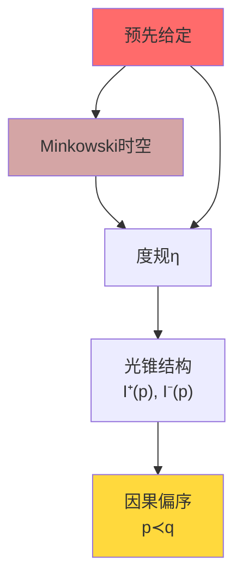

**问题**：
- 光锥是**预先给定**的（度规$\eta$是背景）
- 因果性依赖于连续时空的存在
- 量子引力中时空本身涨落，因果如何定义？

### QCA的挑战：离散中如何有因果？

在QCA中：
- **没有预先的时空**：只有离散格点$\Lambda$
- **没有预先的度规**：只有图距离$\text{dist}(x,y)$
- **没有预先的光锥**：只有演化$\alpha$的有限传播半径$R$

**核心问题**：
> 能否从QCA的离散结构**导出**相对论性的因果偏序？

**答案是肯定的**！而且导出的因果结构与相对论在连续极限下**完全一致**。

## 事件集合与离散光锥

### 事件的定义

**定义2.1（事件集合）**：
QCA宇宙的事件集合定义为：
$$
E := \Lambda \times \mathbb{Z}
$$
其中：
- $\Lambda$：空间格点
- $\mathbb{Z}$：离散时间步

元素$(x, n) \in E$表示"时间步$n$时格点$x$处发生的事件"。

**投影**：
$$
\text{sp}: E \to \Lambda, \quad \text{sp}(x,n) = x \quad (\text{空间坐标})
$$
$$
\text{tm}: E \to \mathbb{Z}, \quad \text{tm}(x,n) = n \quad (\text{时间坐标})
$$

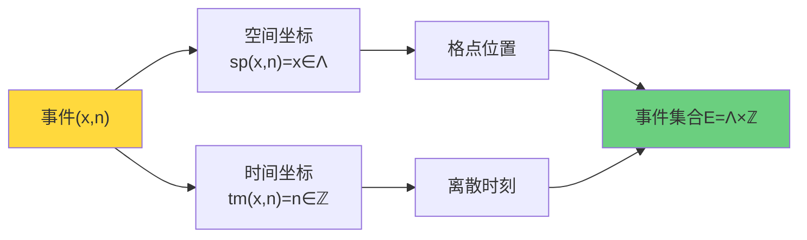

### 几何光锥：从有限传播导出

回顾QCA公理QCA-2：存在有限传播半径$R$，使得支撑在$F$上的算符$A$，演化后支撑在$B_R(F)$内。

**推论**：
支撑在单点$\{y\}$的算符$A_y$，经过$n$步演化后：
$$
\text{supp}(\alpha^n(A_y)) \subset B_{nR}(y)
$$

**直观解释**：
时间步$0$在$y$点的"信号"，最远只能在时间步$n$传播到距离$nR$内的点。

**定义2.2（几何可达关系）**：
定义$E$上的二元关系$\leq_{\text{geo}}$：
$$
(x,n) \leq_{\text{geo}} (y,m) \iff m \geq n \text{ 且 } \text{dist}(x,y) \leq R(m-n)
$$

**物理意义**：
$(x,n)$处的事件能因果影响$(y,m)$处的事件，当且仅当时间足够长（$m \geq n$）且空间距离在"光速×时间"范围内。

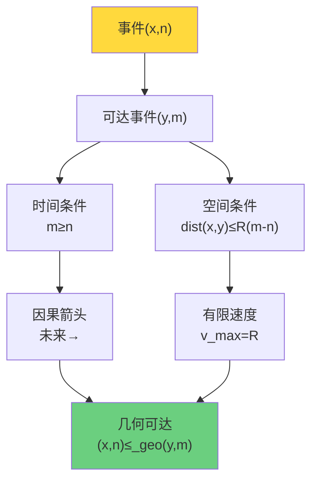

### 离散光锥的形状

固定事件$(x_0, n_0)$，其**未来几何光锥**定义为：
$$
I^+_{\text{geo}}(x_0, n_0) := \{(y,m) \in E : (x_0, n_0) \leq_{\text{geo}} (y,m)\}
$$

**显式刻画**：
$$
I^+_{\text{geo}}(x_0, n_0) = \{(y,m) : m > n_0, \ \text{dist}(y, x_0) \leq R(m - n_0)\}
$$

类似定义**过去几何光锥**：
$$
I^-_{\text{geo}}(x_0, n_0) = \{(y,m) : m < n_0, \ \text{dist}(y, x_0) \leq R(n_0 - m)\}
$$

**例子（一维$\Lambda = \mathbb{Z}$，$R=1$）**：

事件$(0, 0)$的未来光锥：
$$
I^+_{\text{geo}}(0,0) = \{(x,n) : n > 0, \ |x| \leq n\}
$$

这恰好是一个**离散锥形**！

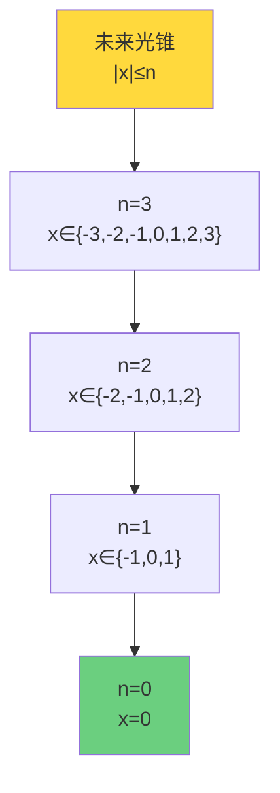

## 从几何到统计：关联函数的因果性

### 统计因果关系

纯粹的几何关系$\leq_{\text{geo}}$是从QCA演化的**运动学**（有限传播）导出的。但物理上，因果性应该体现在**可观测量的统计关联**上。

**定义2.3（统计因果关系）**：
对事件$(x,n)$和$(y,m)$，定义统计因果关系$\preceq_{\text{stat}}$：
$$
(x,n) \preceq_{\text{stat}} (y,m) \iff \text{存在局域算符}A_x, B_y\text{使得关联函数非零}
$$

更精确地，在态$\omega_0$下：
$$
C_{AB}(n,m) := \omega_0(\alpha^{-m}(B_y) \alpha^{-n}(A_x)) - \omega_0(\alpha^{-m}(B_y)) \omega_0(\alpha^{-n}(A_x)) \neq 0
$$

**物理意义**：
$(x,n)$能因果影响$(y,m)$，当且仅当在$x$点$n$时刻的测量能够影响在$y$点$m$时刻的测量结果。

### 关联函数的支撑性质

**引理2.4（关联函数的光锥约束）**：
若$A \in \mathcal{A}_{\{x\}}$支撑在$\{x\}$，$B \in \mathcal{A}_{\{y\}}$支撑在$\{y\}$，且$m > n$，则：

若$\text{dist}(x,y) > R(m-n)$，必然有：
$$
C_{AB}(n,m) = 0
$$

**证明**：
由有限传播性质：
$$
\text{supp}(\alpha^{-n}(A_x)) \subset B_{nR}(x)
$$
$$
\text{supp}(\alpha^{-m}(B_y)) \subset B_{mR}(y)
$$

若$\text{dist}(x,y) > R(m-n)$，则两个支撑不相交：
$$
B_{nR}(x) \cap B_{mR}(y) = \emptyset
$$

因此$\alpha^{-m}(B_y)$和$\alpha^{-n}(A_x)$对易：
$$
[\alpha^{-m}(B_y), \alpha^{-n}(A_x)] = 0
$$

从而关联函数分解：
$$
\omega_0(\alpha^{-m}(B_y) \alpha^{-n}(A_x)) = \omega_0(\alpha^{-m}(B_y)) \omega_0(\alpha^{-n}(A_x))
$$
即$C_{AB}(n,m) = 0$。

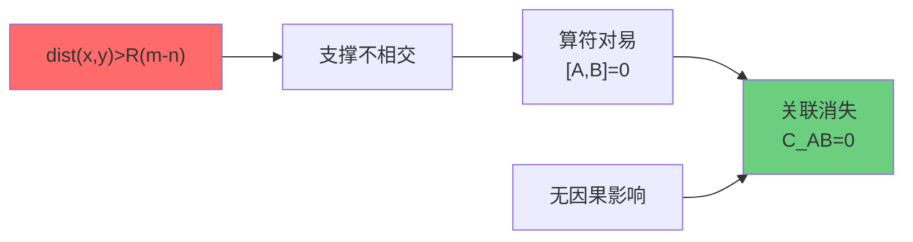

## 核心定理：几何与统计因果的等价性

### 等价定理

**定理2.5（因果结构的等价性）**：
在QCA宇宙$\mathfrak{U}_{\text{QCA}}$中，对任意事件$(x,n), (y,m) \in E$：
$$
(x,n) \leq_{\text{geo}} (y,m) \iff (x,n) \preceq_{\text{stat}} (y,m)
$$

**证明**：

**（$\Rightarrow$）**：假设$(x,n) \leq_{\text{geo}} (y,m)$，即$m \geq n$且$\text{dist}(x,y) \leq R(m-n)$。

选择局域算符$A_x \in \mathcal{A}_{\{x\}}$，$B_y \in \mathcal{A}_{\{y\}}$，例如Pauli算符$\sigma^z_x, \sigma^z_y$。

由于$\text{dist}(x,y) \leq R(m-n)$，演化后的算符$\alpha^{-n}(A_x)$和$\alpha^{-m}(B_y)$的支撑有可能相交，因此一般地：
$$
[\alpha^{-m}(B_y), \alpha^{-n}(A_x)] \neq 0
$$

从而关联函数$C_{AB}(n,m) \neq 0$（至少对某些选择的$A, B$）。因此$(x,n) \preceq_{\text{stat}} (y,m)$。

**（$\Leftarrow$）**：假设$(x,n) \preceq_{\text{stat}} (y,m)$，即存在$A_x, B_y$使得$C_{AB}(n,m) \neq 0$。

由引理2.4的逆否命题，若$\text{dist}(x,y) > R(m-n)$或$m < n$，则必然$C_{AB}(n,m) = 0$，矛盾！

因此必须$m \geq n$且$\text{dist}(x,y) \leq R(m-n)$，即$(x,n) \leq_{\text{geo}} (y,m)$。

**证毕**。

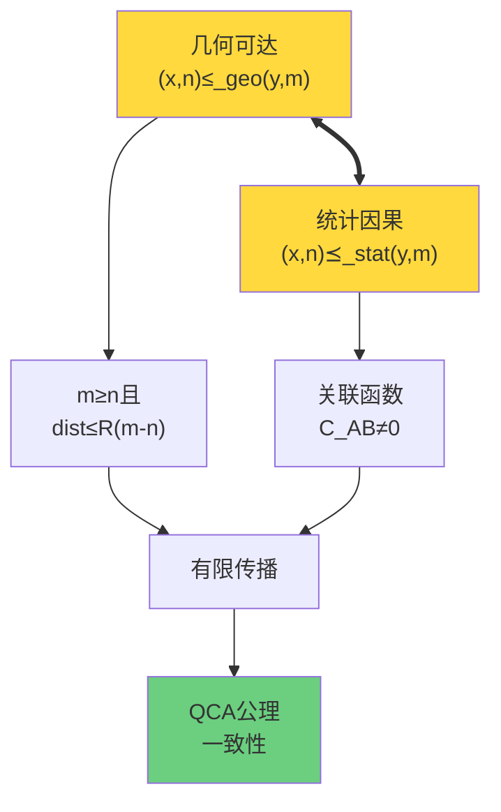

### 物理诠释

这个定理非常深刻：

**几何因果** = **统计因果**

意味着：
- 从QCA运动学（有限传播$R$）导出的几何光锥
- 与从量子关联测量定义的统计因果
- **完全一致**！

这不是巧合，而是QCA公理的**内在自洽性**。

## 偏序性质的验证

### 偏序公理

**定义2.6（偏序）**：
二元关系$\preceq$称为**偏序**，若满足：
1. **自反性**：$e \preceq e, \ \forall e \in E$
2. **传递性**：$e_1 \preceq e_2, e_2 \preceq e_3 \Rightarrow e_1 \preceq e_3$
3. **反对称性**：$e_1 \preceq e_2, e_2 \preceq e_1 \Rightarrow e_1 = e_2$

**命题2.7（$\leq_{\text{geo}}$是偏序）**：
几何可达关系$\leq_{\text{geo}}$是$E$上的偏序。

**证明**：

**（1）自反性**：
$(x,n) \leq_{\text{geo}} (x,n)$因为$n \geq n$且$\text{dist}(x,x) = 0 \leq R(n-n) = 0$。

**（2）传递性**：
假设$(x,n) \leq_{\text{geo}} (y,m)$且$(y,m) \leq_{\text{geo}} (z,k)$。

则：
- $m \geq n$且$\text{dist}(x,y) \leq R(m-n)$
- $k \geq m$且$\text{dist}(y,z) \leq R(k-m)$

由三角不等式：
$$
\text{dist}(x,z) \leq \text{dist}(x,y) + \text{dist}(y,z) \leq R(m-n) + R(k-m) = R(k-n)
$$

又$k \geq m \geq n$，因此$(x,n) \leq_{\text{geo}} (z,k)$。

**（3）反对称性**：
假设$(x,n) \leq_{\text{geo}} (y,m)$且$(y,m) \leq_{\text{geo}} (x,n)$。

则：
- $m \geq n$且$n \geq m$，因此$m = n$
- $\text{dist}(x,y) \leq R(m-n) = 0$，因此$x = y$

故$(x,n) = (y,m)$。

**证毕**。

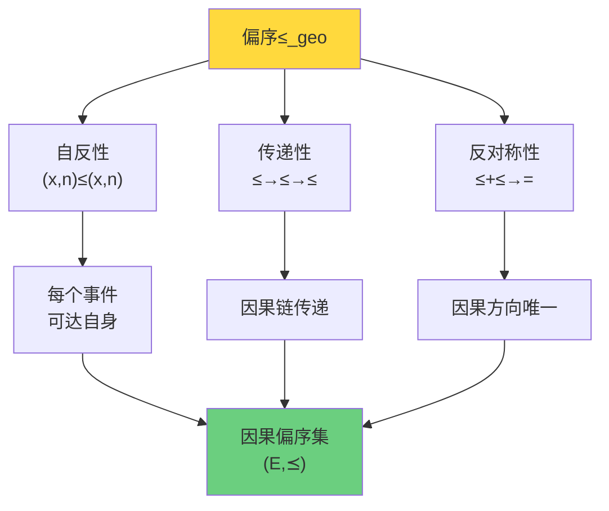

## 局域有限性：QCA的关键性质

### 定义

**定义2.8（局域有限偏序）**：
偏序集$(E, \preceq)$称为**局域有限的**，若对任意$e \in E$：
$$
|I^+(e)| < \infty \text{ 且 } |I^-(e)| < \infty
$$
其中$I^+(e) := \{e' : e \preceq e'\}$是$e$的未来，$I^-(e) := \{e' : e' \preceq e\}$是$e$的过去。

**定理2.9（QCA因果集的局域有限性）**：
$(E, \leq_{\text{geo}})$是局域有限偏序集。

**证明**：
固定$(x_0, n_0) \in E$。

未来光锥：
$$
I^+_{\text{geo}}(x_0, n_0) = \{(y,m) : m > n_0, \ \text{dist}(y, x_0) \leq R(m-n_0)\}
$$

对固定$m > n_0$，满足$\text{dist}(y, x_0) \leq R(m-n_0)$的$y \in \Lambda$有有限多个（因为$|B_{R(m-n_0)}(x_0)| < \infty$，局域有限性假设）。

因此每个时间片$\{m\} \times \Lambda$上只有有限多个事件在未来光锥内。

但问题：$m$可以取无穷多个值！

**修正**：局域有限性应理解为对任意有限时间区间$[n_0, n_0 + T]$，未来光锥与该区间的交集有限：
$$
|I^+_{\text{geo}}(x_0, n_0) \cap (\Lambda \times [n_0, n_0+T])| < \infty
$$

类似地，过去光锥在有限时间区间内也有限。

这称为**时间意义下的局域有限性**。

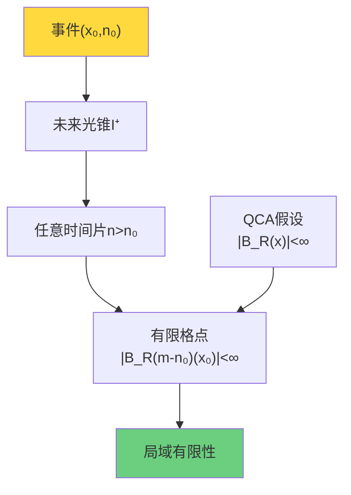

### 与因果集理论的联系

在Sorkin的**因果集（causal set）**理论中，时空本体被定义为局域有限偏序集$(E, \preceq)$。

**因果集公理**：
1. $(E, \preceq)$是偏序集
2. 局域有限性：$|I^+(e) \cap I^-(e')| < \infty$

QCA自然地提供了一个因果集的实现！

| QCA结构 | 因果集对应 |
|--------|-----------|
| 事件集$E = \Lambda \times \mathbb{Z}$ | 时空点 |
| 几何可达$\leq_{\text{geo}}$ | 因果偏序$\preceq$ |
| 格点局域有限性 | 局域有限性 |
| 有限传播$R$ | 因果结构 |

**哲学意义**：
> QCA宇宙自动满足因果集公理！
>
> 离散量子演化 → 因果集时空结构。

## Alexandrov拓扑：从偏序重构拓扑

### 双锥开集

**定义2.10（因果钻石）**：
对$(x,n) \ll (y,m)$（$\ll$表示严格偏序），定义**因果钻石**：
$$
A((x,n), (y,m)) := I^+(x,n) \cap I^-(y,m)
$$
即同时在$(x,n)$的未来和$(y,m)$的过去中的事件集合。

**Alexandrov拓扑**：
以所有因果钻石$\{A((x,n), (y,m))\}$为**拓扑基**生成的拓扑，称为**Alexandrov拓扑** $\tau_A$。

**定理2.11（Alexandrov拓扑的存在性）**：
$(E, \tau_A)$是拓扑空间。

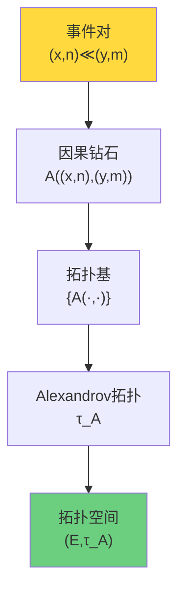

### 连续极限与流形重构

**定理2.12（连续极限给出洛伦兹流形）**（非严格陈述）：
在适当的连续极限下$(a \to 0, \Delta t \to 0, R = 1)$，QCA因果集$(E, \preceq_{\text{geo}})$的Alexandrov拓扑收敛到Minkowski时空的标准拓扑。

**证明思路**：
1. 连续极限下，事件$(x,n) \to (\mathbf{x}, t) \in \mathbb{R}^{d+1}$
2. 几何可达$\leq_{\text{geo}}$在极限下变为Minkowski因果偏序$\leq_M$
3. Alexandrov基$A(p,q)$收敛到标准双锥$I^+(p) \cap I^-(q)$
4. 拓扑收敛定理（需要更精细的分析）

**物理意义**：
> 从离散QCA因果集出发，连续极限自动恢复连续流形的拓扑结构！
>
> 时空拓扑是从因果偏序**涌现**的。

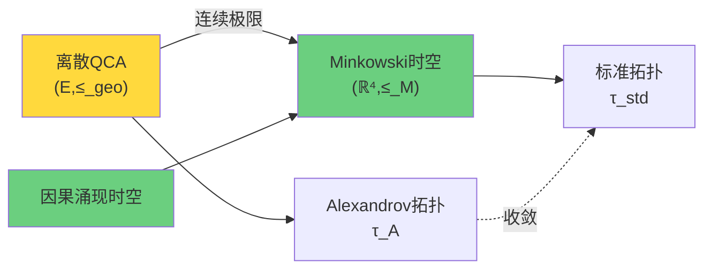

## Lieb-Robinson界：有效光速的严格界

### Lieb-Robinson定理

**定理2.13（Lieb-Robinson界，简化版）**：
考虑QCA演化$\alpha$在局域Hamiltonian$H$下生成的时间演化。对支撑在$X, Y \Subset \Lambda$且$\text{dist}(X,Y) = r$的局域算符$A, B$：
$$
\|[\alpha^n(A), B]\| \leq C \|A\| \|B\| e^{-\mu(r - vn)}
$$
其中：
- $C$：常数
- $v$：有效光速，$v = O(R)$
- $\mu > 0$：指数衰减率

**物理意义**：
即使在离散时间，量子关联的传播速度仍有**指数严格的上界**。

**与相对论的联系**：
在连续极限下，Lieb-Robinson界给出：
$$
v_{\text{eff}} \to c
$$
这正是光速！

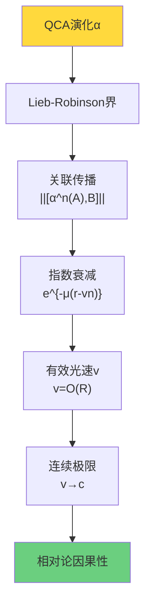

### 信息传播的锥形约束

Lieb-Robinson界的另一个推论：

**推论2.14（信息锥）**：
在时间$n$后，原本局域在单点$\{x_0\}$的信息，只能以概率$\geq 1 - \epsilon$局域在$B_{vn}(x_0)$内，其中$\epsilon \sim e^{-\mu n}$指数小。

**证明思路**：
由Lieb-Robinson界，$\alpha^n(A_{x_0})$与$B_y$（$\text{dist}(y, x_0) > vn$）几乎对易，因此测量$B_y$几乎不受$A_{x_0}$影响。

这形成了**信息传播的锥形约束**，类似相对论的光锥！

## 小结：因果结构涌现的完整图景

从QCA公理到相对论性因果结构的逻辑链条：

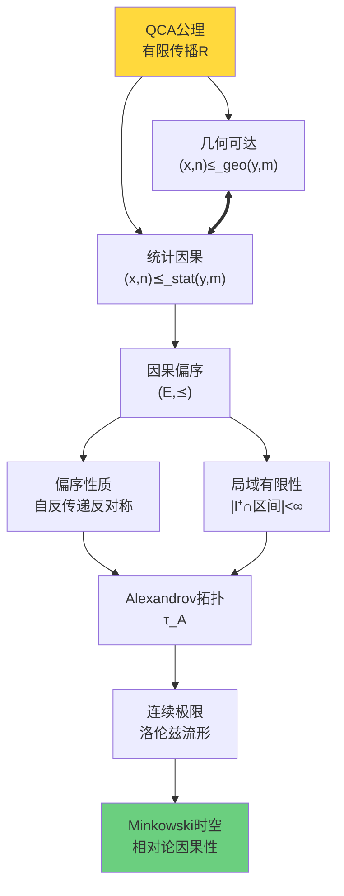

**五个层次的涌现**：

1. **QCA有限传播** → 2. **几何可达关系** → 3. **统计因果关系** → 4. **因果偏序集** → 5. **Alexandrov拓扑** → 6. **洛伦兹流形**

**核心洞察**：
> 相对论的因果光锥不是上帝预先画好的"背景舞台"，
>
> 而是离散QCA中信息传播有限速度的**数学必然涌现**！

## 通俗类比：信息如水波扩散

### 水波类比

想象一个水池，扔一颗石子激起涟漪：

**经典连续图景**：
- 水面是连续的$\mathbb{R}^2$
- 波纹以速度$v$向外传播
- 因果锥：$r \leq vt$

**QCA离散图景**：
- 水面是格点$\Lambda = \mathbb{Z}^2$
- 每个格点在离散时间步$n \in \mathbb{Z}$振动
- 振动按局域规则传播：每步最多传播$R$个格点

**涌现**：
当格距$a \to 0$，离散振动的传播在宏观尺度看起来像连续波纹，速度$v = Ra/\Delta t$。

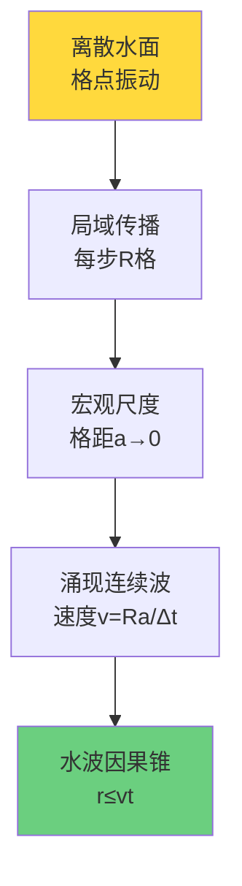

**类比QCA**：

| 水波 | QCA宇宙 |
|-----|---------|
| 格点 | 时空格点$\Lambda$ |
| 振动幅度 | 量子态$\psi_x \in \mathcal{H}_{\text{cell}}$ |
| 局域传播规则 | QCA演化$\alpha$ |
| 波速$v$ | 信息传播速度$v = Ra/\Delta t$ |
| 连续水波 | 连续时空 |

**核心类比**：
> 就像离散格点上的振动在宏观尺度涌现连续水波，
>
> 离散QCA在长波极限涌现连续时空和相对论性因果！

## 下一步：2-范畴中的终对象

下一节是本章的**核心高潮**：我们将构造2-范畴$\mathbf{Univ}_{\mathcal{U}}$，定义**终对象** $\mathfrak{U}^*_{\text{phys}}$，并证明在四个公理下终对象唯一存在：

1. **统一时间刻度**：$\kappa(\omega) = \varphi'(\omega)/\pi = \rho_{\text{rel}}(\omega) = (2\pi)^{-1}\text{tr} Q(\omega)$
2. **广义熵单调**：$\delta^2 S_{\text{gen}} \geq 0$
3. **拓扑无异常**：$[K] = 0$
4. **因果局域有限**：$(E, \preceq)$是局域有限偏序集

第2节（本节）已证明：QCA自动满足公理4！

下一节将证明：满足公理1-4的对象在2-范畴中是**唯一的终对象** → 物理定律的唯一性由范畴论保证！

这是整个统一理论的**范畴论巅峰**！
