# Causal Structure Emerges from QCA: Birth of Partial Order and Light Cone

In previous section, we established five-tuple axioms of QCA. Now we arrive at one of most stunning conclusions:

> **Relativistic causal structure is not pre-assumed "background spacetime", but mathematical necessity naturally emerging from finite propagation property of QCA!**

This section will strictly prove: How discrete QCA derives causal light cone of continuous relativity.

## Problem Statement: Where Does Causality Come From?

### Causal Structure of Traditional Relativity

In standard Minkowski spacetime $(\mathbb{R}^4, \eta)$, causal structure is defined by **light cone**:

Event $p$ can affect event $q$ if and only if $q$ is in future light cone of $p$:
$$q \in I^+(p) \iff \eta(q-p, q-p) < 0 \text{ and } t_q > t_p$$

**Light Cone Equation**:
$$-c^2(t_q - t_p)^2 + |\mathbf{x}_q - \mathbf{x}_p|^2 = 0$$

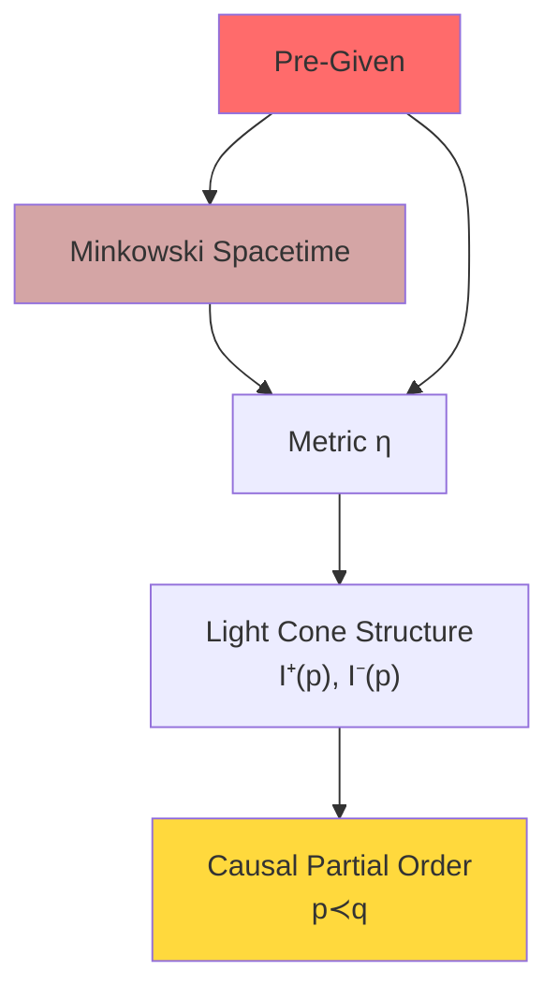

**Problems**:
- Light cone is **pre-given** (metric $\eta$ is background)
- Causality depends on existence of continuous spacetime
- In quantum gravity spacetime itself fluctuates, how to define causality?

### QCA Challenge: How Causality in Discrete?

In QCA:
- **No pre-existing spacetime**: Only discrete lattice points $\Lambda$
- **No pre-existing metric**: Only graph distance $\text{dist}(x,y)$
- **No pre-existing light cone**: Only finite propagation radius $R$ of evolution $\alpha$

**Core Question**:
> Can we **derive** relativistic causal partial order from discrete structure of QCA?

**Answer is yes**! And derived causal structure **completely agrees** with relativity in continuous limit.

## Event Set and Discrete Light Cone

### Definition of Events

**Definition 2.1 (Event Set)**:
Event set of QCA universe is defined as:
$$E := \Lambda \times \mathbb{Z}$$
where:
- $\Lambda$: Spatial lattice points
- $\mathbb{Z}$: Discrete time steps

Element $(x, n) \in E$ means "event occurring at lattice point $x$ at time step $n$".

**Projections**:
$$\text{sp}: E \to \Lambda, \quad \text{sp}(x,n) = x \quad (\text{spatial coordinate})$$
$$\text{tm}: E \to \mathbb{Z}, \quad \text{tm}(x,n) = n \quad (\text{time coordinate})$$

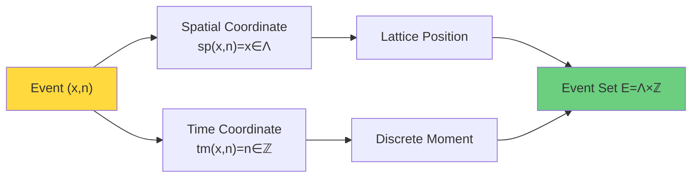

### Geometric Light Cone: Derived from Finite Propagation

Recall QCA Axiom QCA-2: There exists finite propagation radius $R$ such that operator $A$ supported on $F$, after evolution supported within $B_R(F)$.

**Corollary**:
Operator $A_y$ supported on single point $\{y\}$, after $n$ steps of evolution:
$$\text{supp}(\alpha^n(A_y)) \subset B_{nR}(y)$$

**Intuitive Explanation**:
"Signal" at point $y$ at time step $0$ can at most propagate to points within distance $nR$ at time step $n$.

**Definition 2.2 (Geometric Reachability Relation)**:
Define binary relation $\leq_{\text{geo}}$ on $E$:
$$(x,n) \leq_{\text{geo}} (y,m) \iff m \geq n \text{ and } \text{dist}(x,y) \leq R(m-n)$$

**Physical Meaning**:
Event at $(x,n)$ can causally affect event at $(y,m)$ if and only if time is long enough ($m \geq n$) and spatial distance is within "light speed × time" range.

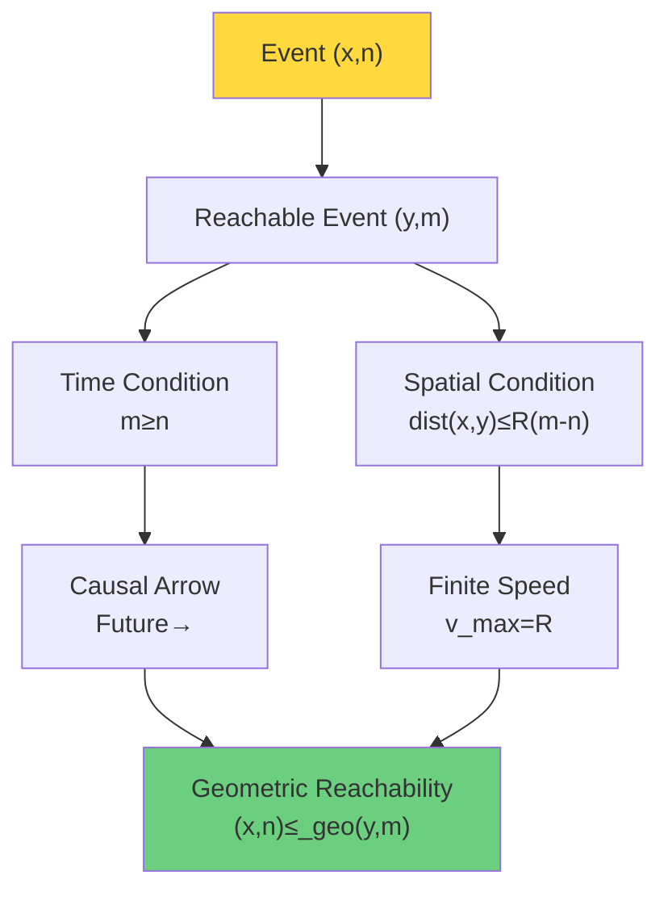

### Shape of Discrete Light Cone

Fix event $(x_0, n_0)$, its **future geometric light cone** is defined as:
$$I^+_{\text{geo}}(x_0, n_0) := \{(y,m) \in E : (x_0, n_0) \leq_{\text{geo}} (y,m)\}$$

**Explicit Characterization**:
$$I^+_{\text{geo}}(x_0, n_0) = \{(y,m) : m > n_0, \ \text{dist}(y, x_0) \leq R(m - n_0)\}$$

Similarly define **past geometric light cone**:
$$I^-_{\text{geo}}(x_0, n_0) = \{(y,m) : m < n_0, \ \text{dist}(y, x_0) \leq R(n_0 - m)\}$$

**Example** (one-dimensional $\Lambda = \mathbb{Z}$, $R=1$):

Future light cone of event $(0, 0)$:
$$I^+_{\text{geo}}(0,0) = \{(x,n) : n > 0, \ |x| \leq n\}$$

This is exactly a **discrete cone**!

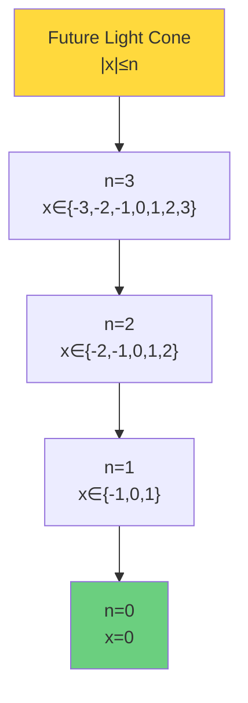

## From Geometry to Statistics: Causality of Correlation Functions

### Statistical Causality

Pure geometric relation $\leq_{\text{geo}}$ is derived from **kinematics** of QCA evolution (finite propagation). But physically, causality should manifest in **statistical correlations of observables**.

**Definition 2.3 (Statistical Causality)**:
For events $(x,n)$ and $(y,m)$, define statistical causality $\preceq_{\text{stat}}$:
$$(x,n) \preceq_{\text{stat}} (y,m) \iff \text{exists local operators }A_x, B_y\text{ such that correlation function non-zero}$$

More precisely, under state $\omega_0$:
$$C_{AB}(n,m) := \omega_0(\alpha^{-m}(B_y) \alpha^{-n}(A_x)) - \omega_0(\alpha^{-m}(B_y)) \omega_0(\alpha^{-n}(A_x)) \neq 0$$

**Physical Meaning**:
$(x,n)$ can causally affect $(y,m)$ if and only if measurement at point $x$ at time $n$ can affect measurement result at point $y$ at time $m$.

### Support Properties of Correlation Functions

**Lemma 2.4 (Light Cone Constraint of Correlation Functions)**:
If $A \in \mathcal{A}_{\{x\}}$ supported on $\{x\}$, $B \in \mathcal{A}_{\{y\}}$ supported on $\{y\}$, and $m > n$, then:

If $\text{dist}(x,y) > R(m-n)$, necessarily:
$$C_{AB}(n,m) = 0$$

**Proof**:
By finite propagation property:
$$\text{supp}(\alpha^{-n}(A_x)) \subset B_{nR}(x)$$
$$\text{supp}(\alpha^{-m}(B_y)) \subset B_{mR}(y)$$

If $\text{dist}(x,y) > R(m-n)$, then two supports disjoint:
$$B_{nR}(x) \cap B_{mR}(y) = \emptyset$$

Therefore $\alpha^{-m}(B_y)$ and $\alpha^{-n}(A_x)$ commute:
$$[\alpha^{-m}(B_y), \alpha^{-n}(A_x)] = 0$$

Thus correlation function factorizes:
$$\omega_0(\alpha^{-m}(B_y) \alpha^{-n}(A_x)) = \omega_0(\alpha^{-m}(B_y)) \omega_0(\alpha^{-n}(A_x))$$
i.e. $C_{AB}(n,m) = 0$.

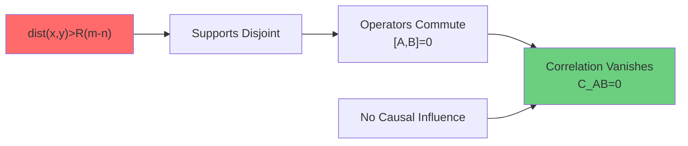

## Core Theorem: Equivalence of Geometric and Statistical Causality

### Equivalence Theorem

**Theorem 2.5 (Equivalence of Causal Structures)**:
In QCA universe $\mathfrak{U}_{\text{QCA}}$, for any events $(x,n), (y,m) \in E$:
$$(x,n) \leq_{\text{geo}} (y,m) \iff (x,n) \preceq_{\text{stat}} (y,m)$$

**Proof**:

**($\Rightarrow$)**: Assume $(x,n) \leq_{\text{geo}} (y,m)$, i.e. $m \geq n$ and $\text{dist}(x,y) \leq R(m-n)$.

Choose local operators $A_x \in \mathcal{A}_{\{x\}}$, $B_y \in \mathcal{A}_{\{y\}}$, e.g. Pauli operators $\sigma^z_x, \sigma^z_y$.

Since $\text{dist}(x,y) \leq R(m-n)$, supports of evolved operators $\alpha^{-n}(A_x)$ and $\alpha^{-m}(B_y)$ may intersect, therefore generally:
$$[\alpha^{-m}(B_y), \alpha^{-n}(A_x)] \neq 0$$

Thus correlation function $C_{AB}(n,m) \neq 0$ (at least for some choices of $A, B$). Therefore $(x,n) \preceq_{\text{stat}} (y,m)$.

**($\Leftarrow$)**: Assume $(x,n) \preceq_{\text{stat}} (y,m)$, i.e. exists $A_x, B_y$ such that $C_{AB}(n,m) \neq 0$.

By contrapositive of Lemma 2.4, if $\text{dist}(x,y) > R(m-n)$ or $m < n$, then necessarily $C_{AB}(n,m) = 0$, contradiction!

Therefore must have $m \geq n$ and $\text{dist}(x,y) \leq R(m-n)$, i.e. $(x,n) \leq_{\text{geo}} (y,m)$.

**QED**.

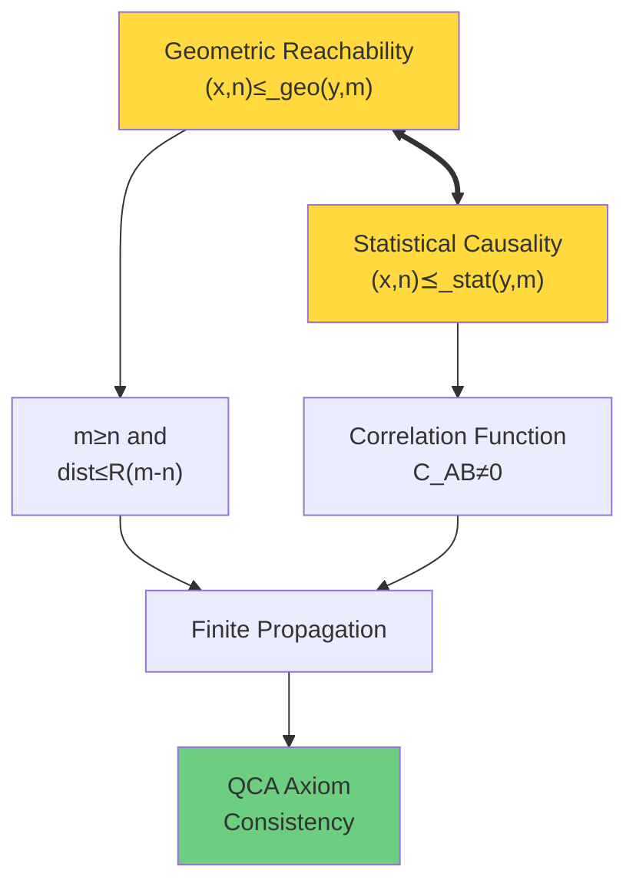

### Physical Interpretation

This theorem is very profound:

**Geometric Causality** = **Statistical Causality**

Means:
- Geometric light cone derived from QCA kinematics (finite propagation $R$)
- Statistical causality defined from quantum correlation measurements
- **Completely consistent**!

This is not coincidence, but **intrinsic self-consistency** of QCA axioms.

## Verification of Partial Order Properties

### Partial Order Axioms

**Definition 2.6 (Partial Order)**:
Binary relation $\preceq$ is called **partial order** if satisfies:
1. **Reflexivity**: $e \preceq e, \ \forall e \in E$
2. **Transitivity**: $e_1 \preceq e_2, e_2 \preceq e_3 \Rightarrow e_1 \preceq e_3$
3. **Antisymmetry**: $e_1 \preceq e_2, e_2 \preceq e_1 \Rightarrow e_1 = e_2$

**Proposition 2.7 ($\leq_{\text{geo}}$ is Partial Order)**:
Geometric reachability relation $\leq_{\text{geo}}$ is partial order on $E$.

**Proof**:

**(1) Reflexivity**:
$(x,n) \leq_{\text{geo}} (x,n)$ because $n \geq n$ and $\text{dist}(x,x) = 0 \leq R(n-n) = 0$.

**(2) Transitivity**:
Assume $(x,n) \leq_{\text{geo}} (y,m)$ and $(y,m) \leq_{\text{geo}} (z,k)$.

Then:
- $m \geq n$ and $\text{dist}(x,y) \leq R(m-n)$
- $k \geq m$ and $\text{dist}(y,z) \leq R(k-m)$

By triangle inequality:
$$\text{dist}(x,z) \leq \text{dist}(x,y) + \text{dist}(y,z) \leq R(m-n) + R(k-m) = R(k-n)$$

And $k \geq m \geq n$, therefore $(x,n) \leq_{\text{geo}} (z,k)$.

**(3) Antisymmetry**:
Assume $(x,n) \leq_{\text{geo}} (y,m)$ and $(y,m) \leq_{\text{geo}} (x,n)$.

Then:
- $m \geq n$ and $n \geq m$, therefore $m = n$
- $\text{dist}(x,y) \leq R(m-n) = 0$, therefore $x = y$

Hence $(x,n) = (y,m)$.

**QED**.

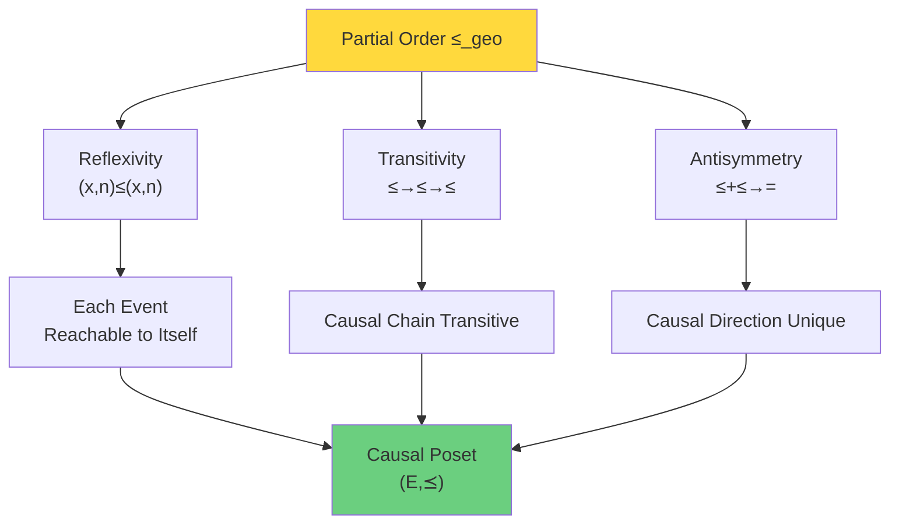

## Local Finiteness: Key Property of QCA

### Definition

**Definition 2.8 (Locally Finite Partial Order)**:
Poset $(E, \preceq)$ is called **locally finite** if for any $e \in E$:
$$|I^+(e)| < \infty \text{ and } |I^-(e)| < \infty$$
where $I^+(e) := \{e' : e \preceq e'\}$ is future of $e$, $I^-(e) := \{e' : e' \preceq e\}$ is past of $e$.

**Theorem 2.9 (Local Finiteness of QCA Causal Set)**:
$(E, \leq_{\text{geo}})$ is locally finite poset.

**Proof**:
Fix $(x_0, n_0) \in E$.

Future light cone:
$$I^+_{\text{geo}}(x_0, n_0) = \{(y,m) : m > n_0, \ \text{dist}(y, x_0) \leq R(m-n_0)\}$$

For fixed $m > n_0$, $y \in \Lambda$ satisfying $\text{dist}(y, x_0) \leq R(m-n_0)$ are finite (because $|B_{R(m-n_0)}(x_0)| < \infty$, local finiteness assumption).

Therefore each time slice $\{m\} \times \Lambda$ has only finitely many events in future light cone.

But problem: $m$ can take infinitely many values!

**Correction**: Local finiteness should be understood as for any finite time interval $[n_0, n_0 + T]$, intersection of future light cone with interval is finite:
$$|I^+_{\text{geo}}(x_0, n_0) \cap (\Lambda \times [n_0, n_0+T])| < \infty$$

Similarly, past light cone is finite in finite time interval.

This is called **local finiteness in temporal sense**.

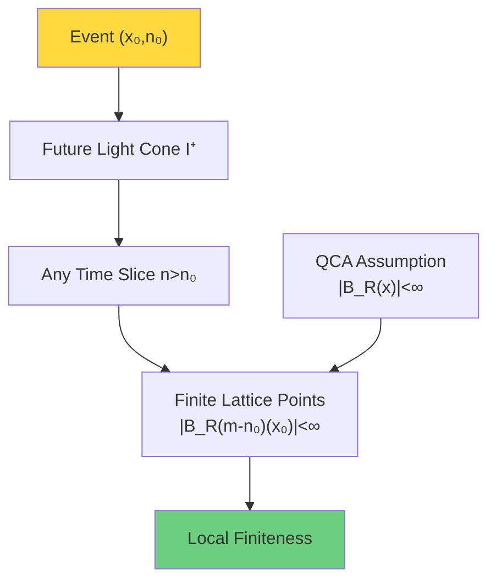

### Connection with Causal Set Theory

In Sorkin's **causal set** theory, spacetime ontology is defined as locally finite poset $(E, \preceq)$.

**Causal Set Axioms**:
1. $(E, \preceq)$ is poset
2. Local finiteness: $|I^+(e) \cap I^-(e')| < \infty$

QCA naturally provides a realization of causal set!

| QCA Structure | Causal Set Correspondence |
|--------------|--------------------------|
| Event set $E = \Lambda \times \mathbb{Z}$ | Spacetime points |
| Geometric reachability $\leq_{\text{geo}}$ | Causal partial order $\preceq$ |
| Lattice local finiteness | Local finiteness |
| Finite propagation $R$ | Causal structure |

**Philosophical Meaning**:
> QCA universe automatically satisfies causal set axioms!
>
> Discrete quantum evolution → causal set spacetime structure.

## Alexandrov Topology: Reconstructing Topology from Partial Order

### Double Cone Open Sets

**Definition 2.10 (Causal Diamond)**:
For $(x,n) \ll (y,m)$ ($\ll$ means strict partial order), define **causal diamond**:
$$A((x,n), (y,m)) := I^+(x,n) \cap I^-(y,m)$$
Set of events simultaneously in future of $(x,n)$ and past of $(y,m)$.

**Alexandrov Topology**:
Topology generated with all causal diamonds $\{A((x,n), (y,m))\}$ as **topological basis** is called **Alexandrov topology** $\tau_A$.

**Theorem 2.11 (Existence of Alexandrov Topology)**:
$(E, \tau_A)$ is topological space.

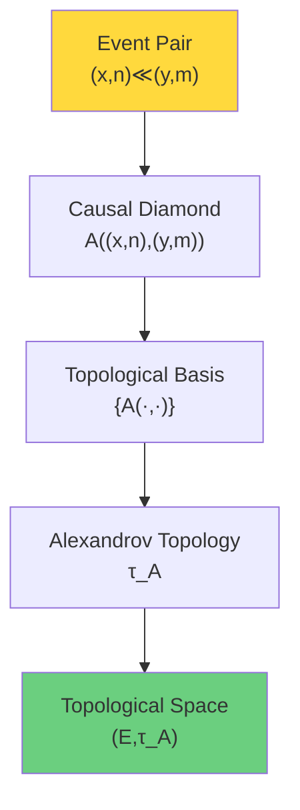

### Continuous Limit and Manifold Reconstruction

**Theorem 2.12 (Continuous Limit Gives Lorentzian Manifold)** (informal statement):
Under appropriate continuous limit $(a \to 0, \Delta t \to 0, R = 1)$, Alexandrov topology of QCA causal set $(E, \preceq_{\text{geo}})$ converges to standard topology of Minkowski spacetime.

**Proof Idea**:
1. In continuous limit, events $(x,n) \to (\mathbf{x}, t) \in \mathbb{R}^{d+1}$
2. Geometric reachability $\leq_{\text{geo}}$ becomes Minkowski causal partial order $\leq_M$ in limit
3. Alexandrov basis $A(p,q)$ converges to standard double cone $I^+(p) \cap I^-(q)$
4. Topology convergence theorem (requires finer analysis)

**Physical Meaning**:
> Starting from discrete QCA causal set, continuous limit automatically recovers topological structure of continuous manifold!
>
> Spacetime topology **emerges** from causal partial order.

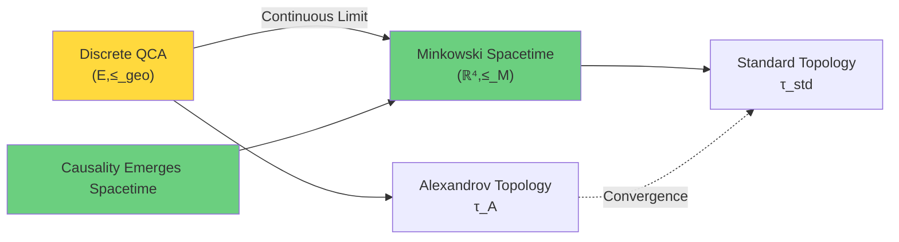

## Lieb-Robinson Bound: Strict Bound on Effective Light Speed

### Lieb-Robinson Theorem

**Theorem 2.13 (Lieb-Robinson Bound, Simplified Version)**:
Consider time evolution generated by QCA evolution $\alpha$ under local Hamiltonian $H$. For local operators $A, B$ supported on $X, Y \Subset \Lambda$ with $\text{dist}(X,Y) = r$:
$$\|[\alpha^n(A), B]\| \leq C \|A\| \|B\| e^{-\mu(r - vn)}$$
where:
- $C$: Constant
- $v$: Effective light speed, $v = O(R)$
- $\mu > 0$: Exponential decay rate

**Physical Meaning**:
Even in discrete time, propagation speed of quantum correlations still has **exponentially strict upper bound**.

**Connection with Relativity**:
In continuous limit, Lieb-Robinson bound gives:
$$v_{\text{eff}} \to c$$
This is exactly speed of light!

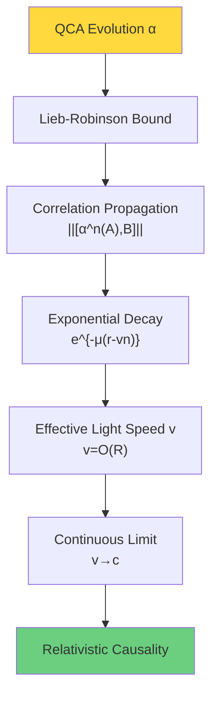

### Conical Constraint of Information Propagation

Another corollary of Lieb-Robinson bound:

**Corollary 2.14 (Information Cone)**:
After time $n$, information originally localized at single point $\{x_0\}$ can only be localized in $B_{vn}(x_0)$ with probability $\geq 1 - \epsilon$, where $\epsilon \sim e^{-\mu n}$ exponentially small.

**Proof Idea**:
By Lieb-Robinson bound, $\alpha^n(A_{x_0})$ and $B_y$ ($\text{dist}(y, x_0) > vn$) almost commute, therefore measurement of $B_y$ almost unaffected by $A_{x_0}$.

This forms **conical constraint of information propagation**, similar to light cone of relativity!

## Summary: Complete Picture of Causal Structure Emergence

Logical chain from QCA axioms to relativistic causal structure:

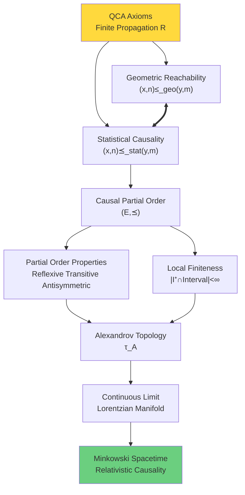

**Five Levels of Emergence**:

1. **QCA Finite Propagation** → 2. **Geometric Reachability Relation** → 3. **Statistical Causality** → 4. **Causal Poset** → 5. **Alexandrov Topology** → 6. **Lorentzian Manifold**

**Core Insight**:
> Causal light cone of relativity is not "background stage" pre-drawn by God,
>
> but **mathematical necessity emerging** from finite speed of information propagation in discrete QCA!

## Popular Analogy: Information Like Water Wave Diffusion

### Water Wave Analogy

Imagine a pond, throw a stone creating ripples:

**Classical Continuous Picture**:
- Water surface is continuous $\mathbb{R}^2$
- Ripples propagate outward at speed $v$
- Causal cone: $r \leq vt$

**QCA Discrete Picture**:
- Water surface is lattice $\Lambda = \mathbb{Z}^2$
- Each lattice point vibrates at discrete time steps $n \in \mathbb{Z}$
- Vibration propagates by local rules: at most $R$ lattice points per step

**Emergence**:
When lattice spacing $a \to 0$, propagation of discrete vibrations looks like continuous ripples at macroscopic scale, speed $v = Ra/\Delta t$.

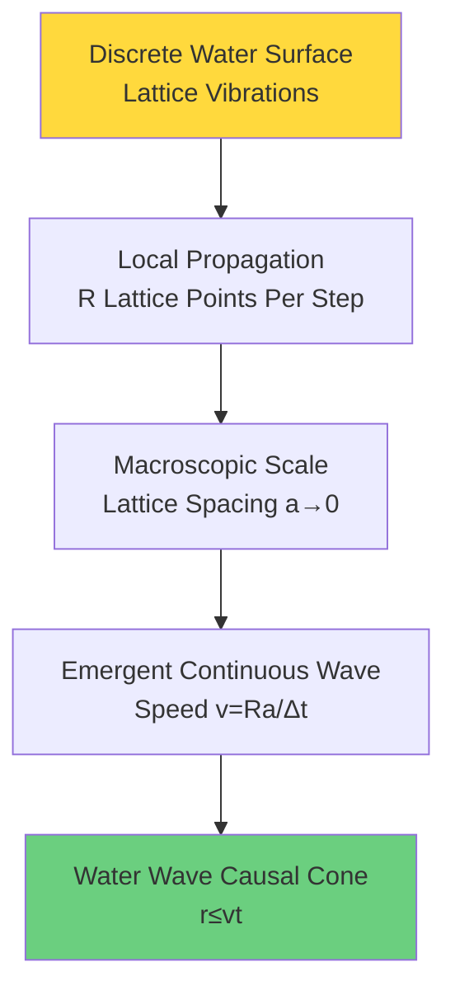

**Analogy to QCA**:

| Water Wave | QCA Universe |
|-----------|-------------|
| Lattice points | Spacetime lattice points $\Lambda$ |
| Vibration amplitude | Quantum state $\psi_x \in \mathcal{H}_{\text{cell}}$ |
| Local propagation rules | QCA evolution $\alpha$ |
| Wave speed $v$ | Information propagation speed $v = Ra/\Delta t$ |
| Continuous water wave | Continuous spacetime |

**Core Analogy**:
> Just as vibrations on discrete lattice points emerge continuous water waves at macroscopic scale,
>
> discrete QCA emerges continuous spacetime and relativistic causality in long-wavelength limit!

## Next Step: Terminal Object in 2-Category

Next section is **core climax** of this chapter: We will construct 2-category $\mathbf{Univ}_{\mathcal{U}}$, define **terminal object** $\mathfrak{U}^*_{\text{phys}}$, and prove terminal object uniquely exists under four axioms:

1. **Unified Time Scale**: $\kappa(\omega) = \varphi'(\omega)/\pi = \rho_{\text{rel}}(\omega) = (2\pi)^{-1}\text{tr} Q(\omega)$
2. **Generalized Entropy Monotonicity**: $\delta^2 S_{\text{gen}} \geq 0$
3. **Topological Anomaly-Free**: $[K] = 0$
4. **Causal Locally Finite**: $(E, \preceq)$ is locally finite poset

Section 2 (this section) has proven: QCA automatically satisfies Axiom 4!

Next section will prove: Objects satisfying Axioms 1-4 are **unique terminal object** in 2-category → Uniqueness of physical laws guaranteed by category theory!

This is **categorical pinnacle** of entire unified theory!

