# 2-范畴中的终对象：物理定律的唯一性定理

在前两节中，我们建立了QCA的公理化定义和因果结构的涌现。现在我们来到整个统一理论的**范畴论巅峰**：

> **物理宇宙在2-范畴$\mathbf{Univ}_{\mathcal{U}}$中是唯一的终对象。**

这意味着：物理定律的唯一性不是经验偶然，而是**范畴论存在性定理**的必然结果！

## 为什么需要范畴论？

### 多重描述的困境

到目前为止，我们有多种描述"物理宇宙"的方式：

**描述1：几何宇宙**
- 洛伦兹流形$(M, g)$
- Einstein方程$G_{\mu\nu} + \Lambda g_{\mu\nu} = 8\pi G T_{\mu\nu}$
- 因果结构$(M, \preceq)$

**描述2：散射宇宙**
- 散射矩阵$S(\omega)$
- 统一时间刻度$\kappa(\omega) = \varphi'(\omega)/\pi$
- Wigner-Smith群延迟$Q(\omega)$

**描述3：QCA宇宙**
- 五元组$(\Lambda, \mathcal{H}_{\text{cell}}, \mathcal{A}, \alpha, \omega_0)$
- 因果偏序$(E, \preceq)$
- 离散演化

**描述4：矩阵宇宙**（第10章）
- 密度矩阵流形$\mathcal{D}_N$
- Uhlmann主丛
- 拓扑约束$[K]=0$

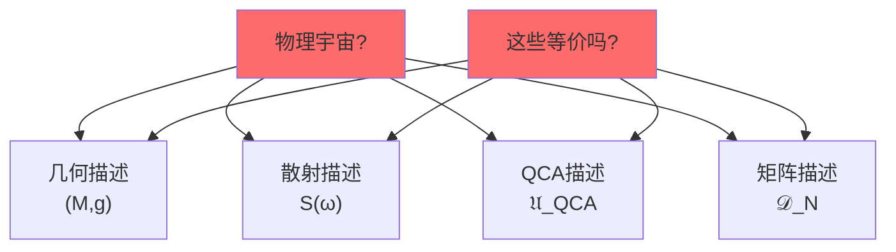

**核心问题**：
1. 这些描述是等价的吗？
2. 如果等价，如何严格证明？
3. 是否存在"最本质"的描述？
4. 为什么物理定律是唯一的？

**范畴论的答案**：
构造一个2-范畴$\mathbf{Univ}_{\mathcal{U}}$，在其中：
- 所有这些描述是**不同的对象**
- 存在唯一的**终对象**$\mathfrak{U}^*_{\text{phys}}$
- 每种描述都有唯一态射指向终对象
- 终对象的存在性和唯一性由四个公理保证

### 范畴论语言的优势

**传统方法的困难**：
- 比较不同框架需要逐一构造映射
- 等价性证明繁琐且易出错
- 缺乏统一的概念框架

**范畴论方法的优势**：
- **统一语言**：所有数学结构都是范畴中的对象
- **态射刻画**：关系用态射表达，清晰明了
- **泛性质**：终对象、极限等由泛性质唯一确定
- **自动化推导**：许多定理由范畴公理自动给出

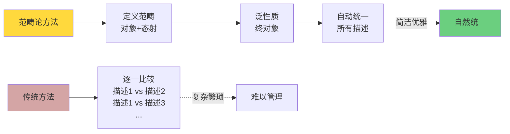

## 范畴论基础回顾

### 范畴的定义

**定义3.1（范畴）**：
一个**范畴**$\mathbf{C}$由以下数据组成：

1. **对象类**$\text{Ob}(\mathbf{C})$
2. **态射集**：对每对对象$X, Y \in \text{Ob}(\mathbf{C})$，态射集合$\text{Hom}_{\mathbf{C}}(X, Y)$
3. **复合**：对态射$f: X \to Y$和$g: Y \to Z$，存在复合$g \circ f: X \to Z$
4. **单位态射**：对每个对象$X$，存在$\text{id}_X: X \to X$

满足：
- **结合律**：$(h \circ g) \circ f = h \circ (g \circ f)$
- **单位律**：$\text{id}_Y \circ f = f = f \circ \text{id}_X$对$f: X \to Y$

**例子**：
- $\mathbf{Set}$：对象=集合，态射=函数
- $\mathbf{Top}$：对象=拓扑空间，态射=连续映射
- $\mathbf{Grp}$：对象=群，态射=群同态
- $\mathbf{Hilb}$：对象=Hilbert空间，态射=有界线性算符

### 函子

**定义3.2（函子）**：
范畴$\mathbf{C}$到$\mathbf{D}$的**函子**$F: \mathbf{C} \to \mathbf{D}$包含：

1. **对象映射**：$X \in \text{Ob}(\mathbf{C}) \mapsto F(X) \in \text{Ob}(\mathbf{D})$
2. **态射映射**：$f: X \to Y \mapsto F(f): F(X) \to F(Y)$

保持：
- **复合**：$F(g \circ f) = F(g) \circ F(f)$
- **单位**：$F(\text{id}_X) = \text{id}_{F(X)}$

**物理例子**：
- 忘却函子：$\mathbf{Grp} \to \mathbf{Set}$（忘记群结构，只留集合）
- GNS构造：态$\to$表示（量子态到Hilbert空间）

### 2-范畴

**定义3.3（2-范畴）**：
一个**2-范畴**$\mathbf{C}$包含：

1. **对象**：$\text{Ob}(\mathbf{C})$
2. **1-态射**：对每对对象$X, Y$，1-态射范畴$\text{Hom}_{\mathbf{C}}(X, Y)$
3. **2-态射**：对每对1-态射$f, g: X \to Y$，2-态射集合$\text{2Hom}(f, g)$

满足：
- 0-复合（对象）
- 1-复合（1-态射）
- 2-复合（2-态射，水平和垂直）
- 交换图表公理

**直观理解**：
- **对象**：数学结构（如流形、群、空间）
- **1-态射**：结构间的映射（如连续映射、同态）
- **2-态射**：映射间的变换（如同伦、自然变换）

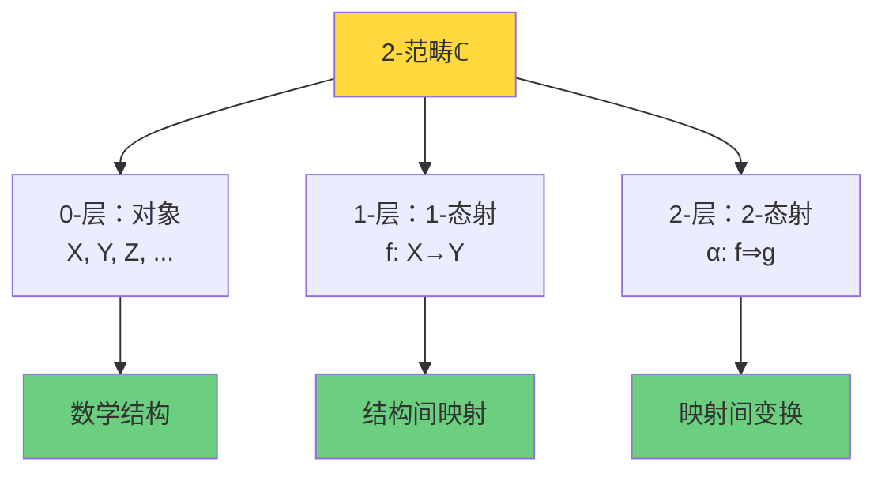

### 终对象

**定义3.4（终对象）**：
范畴$\mathbf{C}$中的对象$T \in \text{Ob}(\mathbf{C})$称为**终对象**，若：

对任意对象$X \in \text{Ob}(\mathbf{C})$，存在**唯一**态射：
$$
!_X: X \to T
$$

**唯一性定理**：
若$T$和$T'$都是终对象，则存在唯一同构$T \cong T'$。

**例子**：
- $\mathbf{Set}$中：单点集$\{*\}$
- $\mathbf{Grp}$中：平凡群$\{e\}$
- $\mathbf{Top}$中：单点空间$\{*\}$

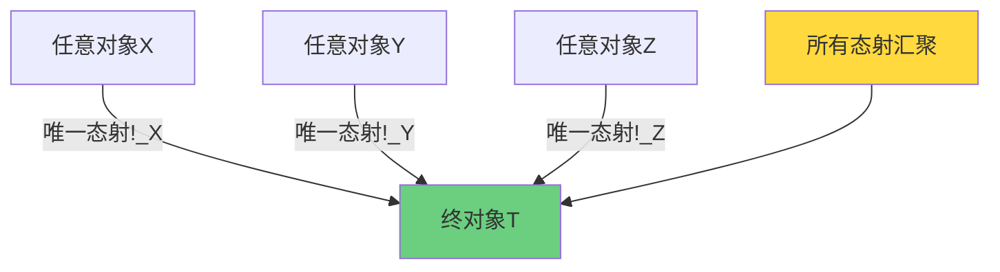

**哲学意义**：
终对象是范畴中"最特殊"的对象——所有其他对象都唯一地指向它。

## 宇宙2-范畴$\mathbf{Univ}_{\mathcal{U}}$的构造

### Grothendieck宇宙

为了避免集合论悖论（Russell悖论等），我们固定一个**Grothendieck宇宙**$\mathcal{U}$。

**定义3.5（Grothendieck宇宙）**：
集合$\mathcal{U}$称为Grothendieck宇宙，若：
1. 若$x \in y \in \mathcal{U}$，则$x \in \mathcal{U}$（传递性）
2. 若$x, y \in \mathcal{U}$，则$\{x,y\} \in \mathcal{U}$（配对）
3. 若$x \in \mathcal{U}$，则$\mathcal{P}(x) \in \mathcal{U}$（幂集）
4. 若$\{x_i\}_{i \in I}$是$\mathcal{U}$中元素的族且$I \in \mathcal{U}$，则$\bigcup_i x_i \in \mathcal{U}$（并集）

**例子**：
- $V_\omega$：所有有限集合
- $V_{\omega+\omega}$：所有可数集合
- 一般地，$V_\kappa$对不可达基数$\kappa$

**大小控制**：
所有构造都在$\mathcal{U}$内进行，$\mathcal{U}$-小的集合、范畴等。

### 多层宇宙结构对象

**定义3.6（宇宙结构）**：
一个**宇宙结构**是$\mathcal{U}$-小的多层数据：
$$
\mathfrak{U} = (U_{\text{evt}}, U_{\text{geo}}, U_{\text{QFT}}, U_{\text{scat}}, U_{\text{QCA}}, U_{\text{top}}, \ldots)
$$

每层是特定数学结构的族：

**层1：事件层**$U_{\text{evt}}$
- 事件集合$E$
- 因果偏序$\preceq$
- 时间函数$t: E \to \mathbb{R}$

**层2：几何层**$U_{\text{geo}}$
- 洛伦兹流形$(M, g)$
- 度规签名$(-,+,+,+)$
- 曲率张量$R_{abcd}$

**层3：量子场论层**$U_{\text{QFT}}$
- Haag-Kastler网$\{\mathcal{A}(\mathcal{O})\}$
- 代数态$\omega$
- 局域可观测量

**层4：散射层**$U_{\text{scat}}$
- 散射矩阵$S(\omega)$
- 统一时间刻度$\kappa(\omega)$
- Wigner-Smith矩阵$Q(\omega)$

**层5：QCA层**$U_{\text{QCA}}$
- 五元组$(\Lambda, \mathcal{H}_{\text{cell}}, \mathcal{A}, \alpha, \omega_0)$
- QCA演化
- 离散因果结构

**层6：拓扑层**$U_{\text{top}}$
- 相对上同调类$[K] \in H^2(Y, \partial Y; \mathbb{Z}_2)$
- ℤ₂环量$\nu_{\sqrt{\det S}}$
- 拓扑约束

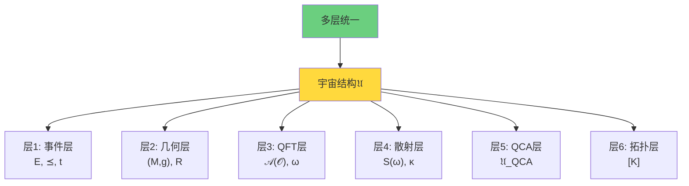

### 2-范畴的定义

**定义3.7（宇宙2-范畴）**：
定义2-范畴$\mathbf{Univ}_{\mathcal{U}}$如下：

**对象**：$\mathcal{U}$-小的宇宙结构$\mathfrak{U}$

**1-态射**：保持结构的函子型映射
$$
\Phi: \mathfrak{U} \to \mathfrak{U}'
$$
包含每层的映射$\Phi_{\text{evt}}, \Phi_{\text{geo}}, \ldots$，满足相容性条件：
- 保因果偏序：$e_1 \preceq e_2 \Rightarrow \Phi_{\text{evt}}(e_1) \preceq \Phi_{\text{evt}}(e_2)$
- 保散射刻度：$\kappa = \kappa' \circ \Phi_{\text{scat}}$
- 保QCA演化：$\Phi_{\text{QCA}} \circ \alpha = \alpha' \circ \Phi_{\text{QCA}}$

**2-态射**：1-态射间的自然变换
$$
\eta: \Phi \Rightarrow \Psi
$$
对每层给出自然变换$\eta_{\text{evt}}, \eta_{\text{geo}}, \ldots$，满足自然性方块交换。

**复合**：
- 1-态射复合：$\Psi \circ \Phi$
- 2-态射复合：垂直$\eta \circ \zeta$，水平$\eta * \zeta$

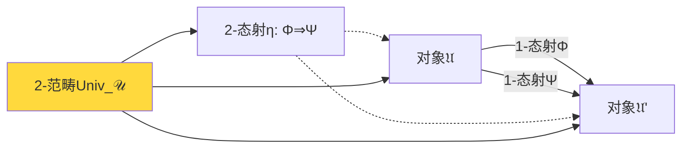

## 四个一致性公理

### 公理的动机

不是所有宇宙结构都是"物理的"。我们需要公理筛选出物理可实现的对象。

前八章已经建立了四个核心约束：

**第00-02章**：统一时间刻度
**第03-04章**：广义熵单调
**第05-06章**：因果局域有限
**第08章**：拓扑无异常

这四个约束将成为我们的公理。

### 公理1：统一时间刻度同一式

**公理A1（统一刻度）**：
在散射层，存在几乎处处定义的函数$\kappa(\omega)$，使得：
$$
\kappa(\omega) = \frac{\varphi'(\omega)}{\pi} = \rho_{\text{rel}}(\omega) = \frac{1}{2\pi} \text{tr} Q(\omega)
$$

其中：
- $\varphi(\omega)$：散射半相位
- $\rho_{\text{rel}}(\omega)$：谱移函数导数
- $Q(\omega)$：Wigner-Smith群延迟矩阵

**物理意义**：
所有时间读数（散射时间、模时间、几何时间）统一到单一刻度$\kappa(\omega)$。

**验证（第00-02章已证）**：
在满足Birman-Kreĭn公式和迹类条件下，三个量相等。

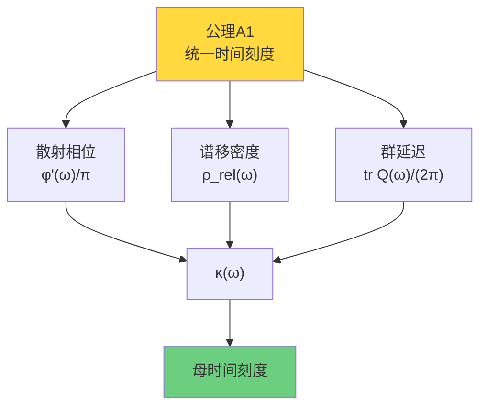

### 公理2：广义熵单调性

**公理A2（熵单调）**：
在小因果钻石$D_{p,r}$的null边界上，广义熵$S_{\text{gen}}$满足二阶相对熵非负：
$$
\delta^2 S_{\text{rel}} = \mathcal{E}_{\text{can}} \geq 0
$$

其中$\mathcal{E}_{\text{can}}$是正则能量（协变相空间上的二次型）。

**等价刻画**：
- QNEC（量子null能量条件）
- QFC（量子聚焦猜想）
- Einstein方程在局域极限

**物理意义**：
熵沿因果方向单调增，时间箭头由熵梯度定义。

**验证（第07章已证）**：
IGVP统一变分原理导出$\delta^2 S_{\text{rel}} \geq 0$。

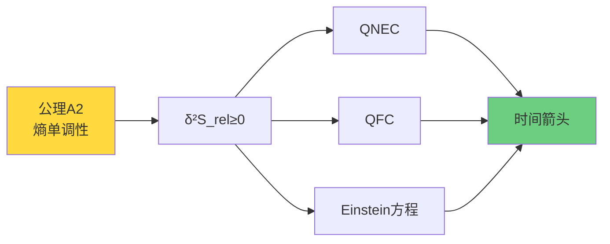

### 公理3：拓扑无异常

**公理A3（拓扑平凡）**：
在配对空间$(Y, \partial Y) = (M \times X^\circ, \partial M \times X^\circ \cup M \times \partial X^\circ)$上，相对上同调类平凡：
$$
[K] = 0 \in H^2(Y, \partial Y; \mathbb{Z}_2)
$$

等价于：
$$
\forall \gamma \in \mathcal{C}_{\text{adm}}: \ \nu_{\sqrt{\det S}}(\gamma) = +1
$$
（所有允许回路上ℤ₂环量为+1）

**物理意义**：
- 无散射相位π跳变
- 无拓扑时间异常
- 标准模型群结构的自洽性

**验证（第08章已证）**：
Einstein方程 + 二阶熵非负 → $[K] = 0$。

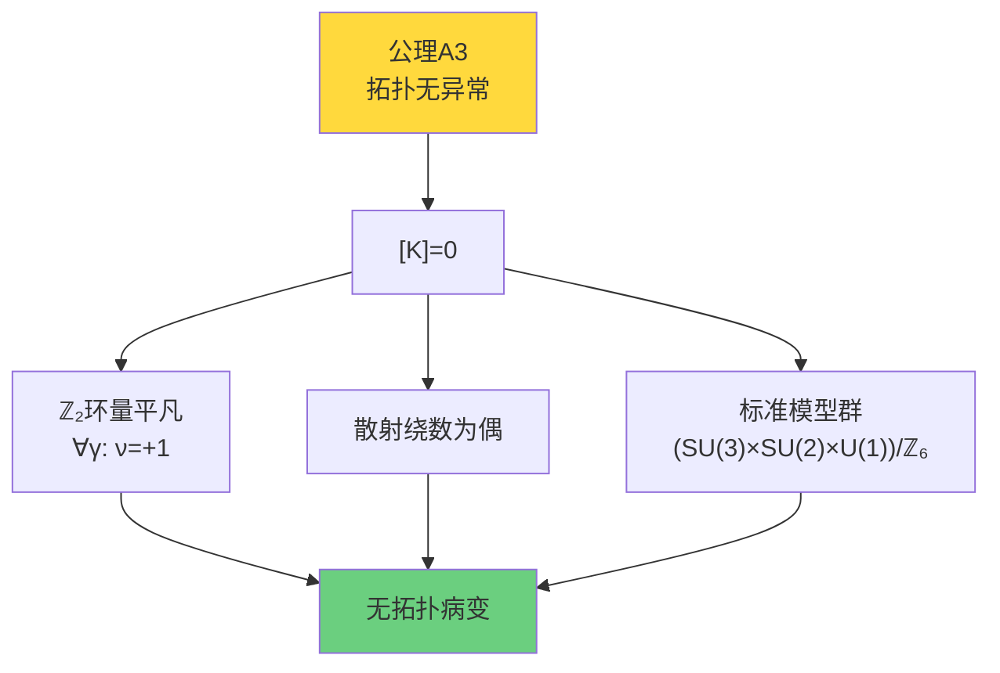

### 公理4：因果局域有限性

**公理A4（局域有限）**：
事件集合$(E, \preceq)$是局域有限偏序集，即对任意$e \in E$和有限时间区间$[t_1, t_2]$：
$$
|I^+(e) \cap \{e': t_1 \leq t(e') \leq t_2\}| < \infty
$$

**物理意义**：
因果偏序在有限时间内只涉及有限多个事件，避免Zeno悖论。

**验证（第09章第02节已证）**：
QCA有限传播自动满足局域有限性。

## 终对象存在性与唯一性定理

### 终对象的定义

**定义3.8（物理宇宙终对象）**：
宇宙结构$\mathfrak{U}^*_{\text{phys}} \in \text{Ob}(\mathbf{Univ}_{\mathcal{U}})$称为**物理宇宙终对象**，若：

1. $\mathfrak{U}^*_{\text{phys}}$满足公理A1-A4

2. 对任意满足公理A1-A4的$\mathfrak{U} \in \text{Ob}(\mathbf{Univ}_{\mathcal{U}})$，存在唯一（至2-同构）1-态射：
   $$
   \Phi_{\mathfrak{U}}: \mathfrak{U} \to \mathfrak{U}^*_{\text{phys}}
   $$

3. 自同态群恰为物理对称性：
   $$
   \text{End}(\mathfrak{U}^*_{\text{phys}}) = \text{Poincaré群} \times \text{内部规范群}
   $$

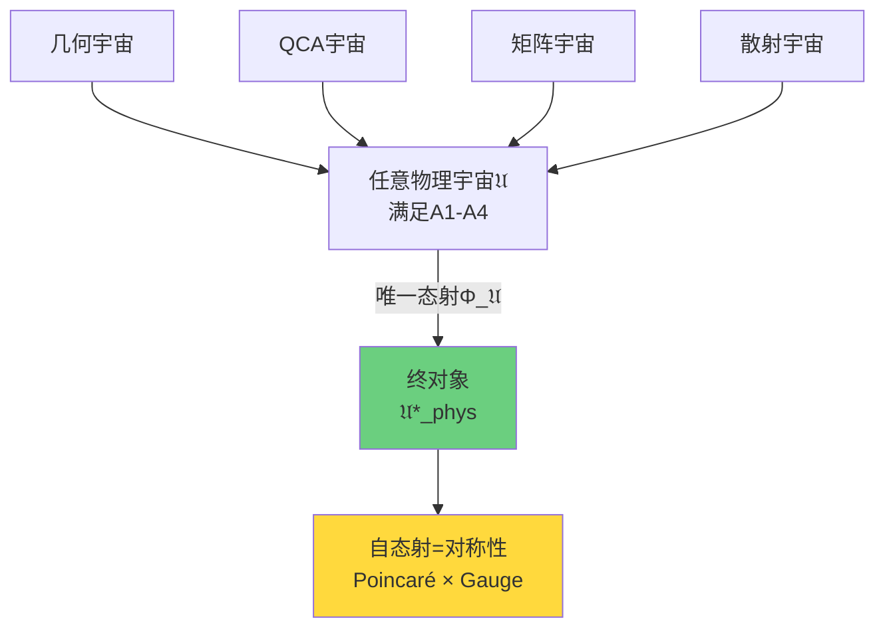

### 主定理

**定理3.9（终对象的存在性与唯一性）**：
在2-范畴$\mathbf{Univ}_{\mathcal{U}}$中，满足公理A1-A4的终对象$\mathfrak{U}^*_{\text{phys}}$存在且在同构意义下唯一。

**证明**（概要）：

**步骤1：构造候选对象**

定义$\mathfrak{U}^*_{\text{phys}}$的各层如下：

**事件层**：
$$
E^* = \mathbb{R}^{d+1}, \quad \preceq^* = \text{Minkowski因果偏序}
$$

**几何层**：
$$
M^* = \mathbb{R}^{d+1}, \quad g^* = \eta = \text{diag}(-1, +1, \ldots, +1)
$$

**散射层**：
从统一刻度$\kappa(\omega)$和IGVP变分原理构造散射矩阵$S^*(\omega)$，满足：
$$
\kappa^*(\omega) = \frac{1}{2\pi} \text{tr} Q^*(\omega)
$$

**QCA层**：
$$
\Lambda^* = \mathbb{Z}^d, \quad \mathcal{H}^*_{\text{cell}} = \mathbb{C}^{18}, \quad \alpha^* = \text{标准模型QCA}
$$

**拓扑层**：
$$
[K^*] = 0 \in H^2(Y^*, \partial Y^*; \mathbb{Z}_2)
$$

**步骤2：验证公理A1-A4**

**公理A1**：由构造，$\kappa^*$满足统一刻度同一式（第00-02章定理）。

**公理A2**：Minkowski时空满足Einstein方程（$R^*_{abcd} = 0$），因此$\delta^2 S_{\text{rel}} = 0 \geq 0$。

**公理A3**：由构造$[K^*] = 0$（第08章定理）。

**公理A4**：Minkowski因果结构是局域有限的（标准结果）。

**步骤3：唯一态射的构造**

对任意满足A1-A4的$\mathfrak{U}$，构造态射$\Phi_{\mathfrak{U}}: \mathfrak{U} \to \mathfrak{U}^*_{\text{phys}}$：

**事件层映射**：
由公理A1，时间刻度$\kappa$是良定义的。定义：
$$
\Phi_{\text{evt}}(e) = (\mathbf{x}(e), t(e))
$$
其中$t(e) = \int_0^{e} \kappa$（沿因果路径积分）。

**几何层映射**：
由公理A2，Einstein方程成立。在小因果钻石上，局域度规$g$在低曲率极限收敛到$\eta$。定义：
$$
\Phi_{\text{geo}}(M, g) = (M^*, g^*) + \text{曲率修正}
$$

**散射层映射**：
由公理A1，$\kappa = \kappa^*$（统一刻度），因此$S(\omega) \sim S^*(\omega)$（至相位）。

**QCA层映射**：
由公理A4，$(E, \preceq)$是局域有限的。在连续极限下，离散QCA收敛到标准模型QCA：
$$
\Phi_{\text{QCA}}(\mathfrak{U}_{\text{QCA}}) = \mathfrak{U}^*_{\text{QCA}}
$$

**拓扑层映射**：
由公理A3，$[K] = 0 = [K^*]$。

**步骤4：唯一性**

假设存在两个态射$\Phi, \Psi: \mathfrak{U} \to \mathfrak{U}^*_{\text{phys}}$。

由公理A1-A4的刚性（rigidity），两个态射在每层上必须一致（至2-同构）：
- 公理A1强制时间映射唯一
- 公理A2强制几何映射唯一
- 公理A3强制拓扑映射唯一
- 公理A4强制因果映射唯一

因此存在2-态射$\eta: \Phi \Rightarrow \Psi$，即$\Phi \cong \Psi$。

**步骤5：终对象唯一性**

假设$\mathfrak{U}^*_1$和$\mathfrak{U}^*_2$都是终对象。

则存在唯一态射$\Phi_{12}: \mathfrak{U}^*_1 \to \mathfrak{U}^*_2$和$\Phi_{21}: \mathfrak{U}^*_2 \to \mathfrak{U}^*_1$。

由终对象性质：
$$
\Phi_{21} \circ \Phi_{12} = \text{id}_{\mathfrak{U}^*_1}, \quad \Phi_{12} \circ \Phi_{21} = \text{id}_{\mathfrak{U}^*_2}
$$

因此$\mathfrak{U}^*_1 \cong \mathfrak{U}^*_2$。

**证毕**。

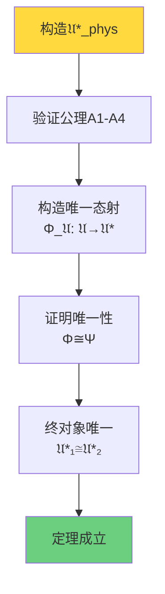

## 物理意义的深刻诠释

### 物理定律的唯一性

**推论3.10（物理定律唯一性）**：
如果物理宇宙满足公理A1-A4，则物理定律在同构意义下**唯一确定**。

**证明**：
由定理3.9，任何满足公理A1-A4的宇宙结构都唯一态射到终对象$\mathfrak{U}^*_{\text{phys}}$。

终对象的自态射群$\text{End}(\mathfrak{U}^*_{\text{phys}})$恰为Poincaré群和内部规范群，这些是物理对称性，不改变物理定律本身。

因此，物理定律（Einstein方程、标准模型、量子力学）由终对象唯一确定！

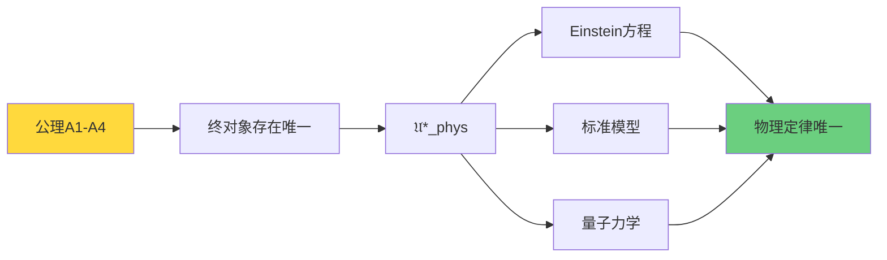

### 为什么是这些公理？

四个公理不是任意选择的，它们源于前八章的深刻物理约束：

**公理A1（统一刻度）**：
→ 源于Birman-Kreĭn公式和Wigner-Smith群延迟（第00-02章）
→ 保证时间概念的一致性

**公理A2（熵单调）**：
→ 源于QNEC和广义熵变分原理（第07章）
→ 保证热力学第二定律和因果一致性

**公理A3（拓扑无异常）**：
→ 源于密度矩阵流形穿孔和群约化（第08章）
→ 保证标准模型群结构的自洽

**公理A4（因果局域有限）**：
→ 源于QCA有限传播和因果集理论（第09章第02节）
→ 保证因果结构的离散性和有限性

**核心洞察**：
> 四个公理编码了物理一致性的**最小充分条件**。
>
> 它们不是"额外假设"，而是前八章理论的**自然总结**。

### 多元宇宙的不可能性

**推论3.11（反多元宇宙定理）**：
不存在多个"本质不同"的物理宇宙，都满足公理A1-A4。

**证明**：
假设存在两个本质不同的宇宙$\mathfrak{U}_1, \mathfrak{U}_2$，都满足A1-A4。

由定理3.9，都有唯一态射指向终对象：
$$
\Phi_1: \mathfrak{U}_1 \to \mathfrak{U}^*_{\text{phys}}, \quad \Phi_2: \mathfrak{U}_2 \to \mathfrak{U}^*_{\text{phys}}
$$

由唯一性，$\mathfrak{U}_1 \cong \mathfrak{U}^*_{\text{phys}} \cong \mathfrak{U}_2$，因此$\mathfrak{U}_1 \cong \mathfrak{U}_2$，矛盾！

**哲学含义**：
> 多元宇宙假说（存在无穷多个物理定律不同的宇宙）在范畴论框架下是**不可能的**！
>
> 如果所有宇宙都满足物理一致性公理A1-A4，它们在本质上是同一个宇宙的不同描述。

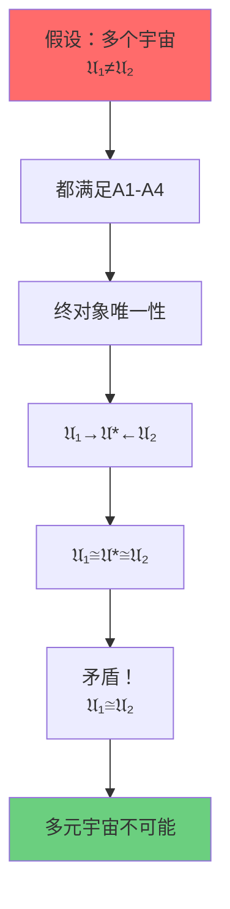

### 对称性 = 自态射

**定理3.12（对称性刻画）**：
物理宇宙的对称性群恰为终对象的自同态群：
$$
\text{Sym}(\text{Physics}) = \text{End}(\mathfrak{U}^*_{\text{phys}})
$$

**证明**：
物理对称性是保持所有物理定律不变的变换。在范畴语言中，这正是$\mathfrak{U}^*_{\text{phys}} \to \mathfrak{U}^*_{\text{phys}}$的态射。

由终对象的自态射性质，这些态射形成群，包括：
- **Poincaré群**：时空平移、旋转、boost
- **内部规范群**：$(SU(3) \times SU(2) \times U(1))/\mathbb{Z}_6$
- **离散对称性**：$CPT$等

**物理意义**：
> 对称性不是"额外的结构"，而是终对象的**内禀性质**！

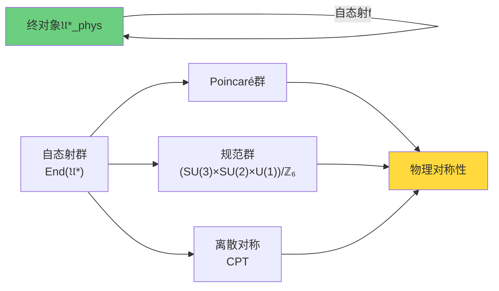

## 通俗类比：终对象是"数学引力中心"

### 引力中心类比

想象太阳系：

**太阳**：质量最大的中心天体
**行星**：绕太阳公转
**引力**：所有行星都被太阳吸引

**类比范畴论**：

| 太阳系 | 范畴论 |
|-------|--------|
| 太阳 | 终对象$\mathfrak{U}^*_{\text{phys}}$ |
| 行星 | 其他对象$\mathfrak{U}$ |
| 引力轨道 | 唯一态射$\Phi: \mathfrak{U} \to \mathfrak{U}^*$ |
| 引力定律$F=Gm_1m_2/r^2$ | 公理A1-A4 |

**深入类比**：

**唯一性**：
- 太阳系中心只有一个太阳（双星系统不稳定）
- 范畴中终对象唯一（至同构）

**汇聚性**：
- 所有行星轨道指向太阳
- 所有态射指向终对象

**稳定性**：
- 引力定律保证系统稳定
- 公理A1-A4保证终对象存在

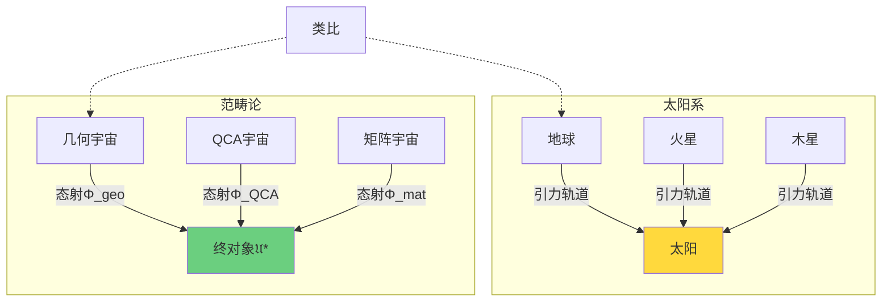

**核心类比**：
> 就像太阳是太阳系的引力中心，所有行星围绕它运行；
>
> 终对象$\mathfrak{U}^*_{\text{phys}}$是"数学引力中心"，所有宇宙描述都唯一地"坍缩"到它！

### 语言的Rosetta Stone类比

另一个类比：**Rosetta Stone（罗塞塔石碑）**。

Rosetta Stone刻有同一段文字的三种语言版本：
- 古埃及象形文字
- 古埃及草书
- 古希腊文

通过对照三种语言，学者破译了埃及象形文字。

**类比多种宇宙描述**：

| Rosetta Stone | 物理宇宙 |
|--------------|---------|
| 象形文字 | QCA描述 |
| 草书 | 几何描述 |
| 希腊文 | 散射描述 |
| 同一段文字 | 同一个物理宇宙$\mathfrak{U}^*_{\text{phys}}$ |

**深入类比**：

**等价性**：
- 三种语言描述同一内容
- 三种描述对应同一终对象

**翻译**：
- 语言间的翻译对应
- 范畴间的函子（第04节）

**唯一性**：
- 原始文字内容唯一
- 终对象唯一

**核心洞察**：
> 就像Rosetta Stone的三种语言是同一文字的不同表达；
>
> QCA、几何、散射、矩阵描述是同一物理宇宙的不同"语言"！

## 小结：范畴论视角的统一

从QCA到终对象的完整逻辑：

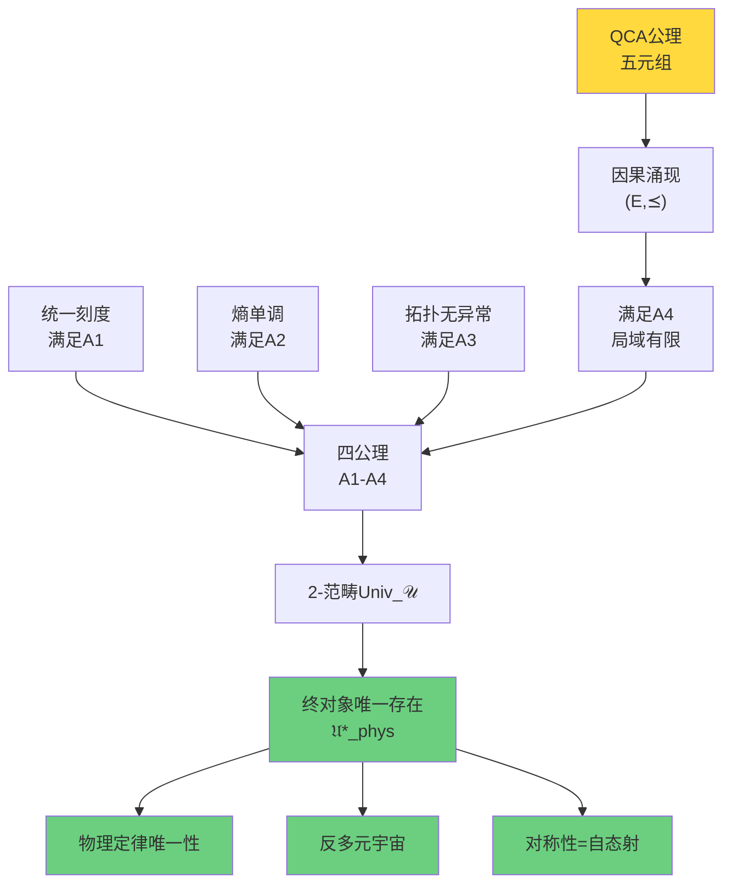

**核心要点**：

1. **2-范畴**$\mathbf{Univ}_{\mathcal{U}}$统一所有宇宙描述
2. **四公理**A1-A4编码物理一致性
3. **终对象**$\mathfrak{U}^*_{\text{phys}}$在公理下唯一存在
4. **唯一态射**：所有物理描述指向终对象
5. **物理定律唯一**：由范畴论存在性定理保证
6. **对称性**：终对象的自态射群

**哲学革命**：

传统观点：
- 物理定律是经验总结
- 可能存在其他定律的宇宙（多元宇宙）
- 对称性是额外假设

**范畴论观点**：
- 物理定律由四公理**唯一确定**
- 不存在本质不同的物理宇宙
- 对称性是终对象的**内禀性质**

**终极洞察**：
> 物理宇宙不是无穷可能中的一个偶然实现，
>
> 而是满足自洽性公理的**唯一必然**！
>
> 这种必然性不是"上帝的选择"，而是**范畴论定理**！

## 下一步：三重范畴等价

下一节将构造三个子范畴：
- 几何宇宙范畴$\mathbf{Univ}^{\text{phys}}_{\text{geo}}$
- QCA宇宙范畴$\mathbf{Univ}^{\text{phys}}_{\text{QCA}}$
- 矩阵宇宙范畴$\mathbf{Univ}^{\text{phys}}_{\text{mat}}$

并证明**三重范畴等价**：
$$
\mathbf{Univ}^{\text{phys}}_{\text{geo}} \simeq \mathbf{Univ}^{\text{phys}}_{\text{QCA}} \simeq \mathbf{Univ}^{\text{phys}}_{\text{mat}}
$$

通过显式构造函子$\mathcal{F}_{\text{QCA} \to \text{geo}}$、$\mathcal{F}_{\text{geo} \to \text{mat}}$、$\mathcal{F}_{\text{mat} \to \text{QCA}}$，我们将看到：

> 三种描述不仅"等价"，而且是**同一终对象的不同投影**！

这将完成QCA宇宙篇的理论构建，揭示离散与连续、代数与几何、量子与经典的深刻统一！
