# Terminal Object in 2-Category: Uniqueness Theorem of Physical Laws

In previous two sections, we established axiomatic definition of QCA and emergence of causal structure. Now we arrive at **categorical pinnacle** of entire unified theory:

> **Physical universe is unique terminal object in 2-category $\mathbf{Univ}_{\mathcal{U}}$.**

This means: Uniqueness of physical laws is not empirical accident, but inevitable result of **categorical existence theorem**!

## Why Category Theory?

### Dilemma of Multiple Descriptions

So far, we have multiple ways to describe "physical universe":

**Description 1: Geometric Universe**
- Lorentzian manifold $(M, g)$
- Einstein equation $G_{\mu\nu} + \Lambda g_{\mu\nu} = 8\pi G T_{\mu\nu}$
- Causal structure $(M, \preceq)$

**Description 2: Scattering Universe**
- Scattering matrix $S(\omega)$
- Unified time scale $\kappa(\omega) = \varphi'(\omega)/\pi$
- Wigner-Smith group delay $Q(\omega)$

**Description 3: QCA Universe**
- Five-tuple $(\Lambda, \mathcal{H}_{\text{cell}}, \mathcal{A}, \alpha, \omega_0)$
- Causal partial order $(E, \preceq)$
- Discrete evolution

**Description 4: Matrix Universe** (Chapter 10)
- Density matrix manifold $\mathcal{D}_N$
- Uhlmann principal bundle
- Topological constraint $[K]=0$

**Core Questions**:
1. Are these descriptions equivalent?
2. If equivalent, how to prove rigorously?
3. Does there exist "most fundamental" description?
4. Why are physical laws unique?

**Answer of Category Theory**:
Construct a 2-category $\mathbf{Univ}_{\mathcal{U}}$ in which:
- All these descriptions are **different objects**
- There exists unique **terminal object** $\mathfrak{U}^*_{\text{phys}}$
- Each description has unique morphism pointing to terminal object
- Existence and uniqueness of terminal object guaranteed by four axioms

### Advantages of Categorical Language

**Difficulties of Traditional Method**:
- Comparing different frameworks requires constructing mappings one by one
- Equivalence proofs tedious and error-prone
- Lack unified conceptual framework

**Advantages of Categorical Method**:
- **Unified Language**: All mathematical structures are objects in category
- **Morphism Characterization**: Relations expressed by morphisms, clear and explicit
- **Universal Properties**: Terminal objects, limits uniquely determined by universal properties
- **Automatic Derivation**: Many theorems automatically given by categorical axioms

## Review of Category Theory Basics

### Definition of Category

**Definition 3.1 (Category)**:
A **category** $\mathbf{C}$ consists of following data:

1. **Object Class** $\text{Ob}(\mathbf{C})$
2. **Morphism Sets**: For each pair of objects $X, Y \in \text{Ob}(\mathbf{C})$, morphism set $\text{Hom}_{\mathbf{C}}(X, Y)$
3. **Composition**: For morphisms $f: X \to Y$ and $g: Y \to Z$, exists composition $g \circ f: X \to Z$
4. **Identity Morphisms**: For each object $X$, exists $\text{id}_X: X \to X$

Satisfying:
- **Associativity**: $(h \circ g) \circ f = h \circ (g \circ f)$
- **Unit Law**: $\text{id}_Y \circ f = f = f \circ \text{id}_X$ for $f: X \to Y$

**Examples**:
- $\mathbf{Set}$: Objects = sets, morphisms = functions
- $\mathbf{Top}$: Objects = topological spaces, morphisms = continuous maps
- $\mathbf{Grp}$: Objects = groups, morphisms = group homomorphisms
- $\mathbf{Hilb}$: Objects = Hilbert spaces, morphisms = bounded linear operators

### Functors

**Definition 3.2 (Functor)**:
**Functor** $F: \mathbf{C} \to \mathbf{D}$ from category $\mathbf{C}$ to $\mathbf{D}$ consists of:

1. **Object Map**: $X \in \text{Ob}(\mathbf{C}) \mapsto F(X) \in \text{Ob}(\mathbf{D})$
2. **Morphism Map**: $f: X \to Y \mapsto F(f): F(X) \to F(Y)$

Preserving:
- **Composition**: $F(g \circ f) = F(g) \circ F(f)$
- **Identity**: $F(\text{id}_X) = \text{id}_{F(X)}$

**Physical Examples**:
- Forgetful functor: $\mathbf{Grp} \to \mathbf{Set}$ (forget group structure, keep only set)
- GNS construction: State $\to$ Representation (quantum state to Hilbert space)

### 2-Category

**Definition 3.3 (2-Category)**:
A **2-category** $\mathbf{C}$ consists of:

1. **Objects**: $\text{Ob}(\mathbf{C})$
2. **1-Morphisms**: For each pair of objects $X, Y$, 1-morphism category $\text{Hom}_{\mathbf{C}}(X, Y)$
3. **2-Morphisms**: For each pair of 1-morphisms $f, g: X \to Y$, 2-morphism set $\text{2Hom}(f, g)$

Satisfying:
- 0-composition (objects)
- 1-composition (1-morphisms)
- 2-composition (2-morphisms, horizontal and vertical)
- Commutative diagram axioms

**Intuitive Understanding**:
- **Objects**: Mathematical structures (e.g., manifolds, groups, spaces)
- **1-Morphisms**: Maps between structures (e.g., continuous maps, homomorphisms)
- **2-Morphisms**: Transformations between maps (e.g., homotopies, natural transformations)

```mermaid
graph TD
    A["2-Category ℂ"] --> B["0-Level: Objects<br/>X, Y, Z, ..."]
    A --> C["1-Level: 1-Morphisms<br/>f: X→Y"]
    A --> D["2-Level: 2-Morphisms<br/>α: f⇒g"]

    B --> E["Mathematical Structures"]
    C --> F["Maps Between Structures"]
    D --> G["Transformations Between Maps"]

    style A fill:#ffd93d
    style E fill:#6bcf7f
    style F fill:#6bcf7f
    style G fill:#6bcf7f
```

### Terminal Object

**Definition 3.4 (Terminal Object)**:
Object $T \in \text{Ob}(\mathbf{C})$ in category $\mathbf{C}$ is called **terminal object** if:

For any object $X \in \text{Ob}(\mathbf{C})$, there exists **unique** morphism:
$$!_X: X \to T$$

**Uniqueness Theorem**:
If $T$ and $T'$ are both terminal objects, then there exists unique isomorphism $T \cong T'$.

**Examples**:
- In $\mathbf{Set}$: Singleton set $\{*\}$
- In $\mathbf{Grp}$: Trivial group $\{e\}$
- In $\mathbf{Top}$: Single point space $\{*\}$

**Philosophical Meaning**:
Terminal object is "most special" object in category—all other objects uniquely point to it.

## Construction of Universe 2-Category $\mathbf{Univ}_{\mathcal{U}}$

### Grothendieck Universe

To avoid set-theoretic paradoxes (Russell's paradox, etc.), we fix a **Grothendieck universe** $\mathcal{U}$.

**Definition 3.5 (Grothendieck Universe)**:
Set $\mathcal{U}$ is called Grothendieck universe if:
1. If $x \in y \in \mathcal{U}$, then $x \in \mathcal{U}$ (transitivity)
2. If $x, y \in \mathcal{U}$, then $\{x,y\} \in \mathcal{U}$ (pairing)
3. If $x \in \mathcal{U}$, then $\mathcal{P}(x) \in \mathcal{U}$ (power set)
4. If $\{x_i\}_{i \in I}$ is family of elements in $\mathcal{U}$ and $I \in \mathcal{U}$, then $\bigcup_i x_i \in \mathcal{U}$ (union)

**Examples**:
- $V_\omega$: All finite sets
- $V_{\omega+\omega}$: All countable sets
- Generally, $V_\kappa$ for inaccessible cardinal $\kappa$

**Size Control**:
All constructions within $\mathcal{U}$, $\mathcal{U}$-small sets, categories, etc.

### Multi-Layered Universe Structure Objects

**Definition 3.6 (Universe Structure)**:
An **universe structure** is $\mathcal{U}$-small multi-layered data:
$$\mathfrak{U} = (U_{\text{evt}}, U_{\text{geo}}, U_{\text{QFT}}, U_{\text{scat}}, U_{\text{QCA}}, U_{\text{top}}, \ldots)$$

Each layer is family of specific mathematical structures:

**Layer 1: Event Layer** $U_{\text{evt}}$
- Event set $E$
- Causal partial order $\preceq$
- Time function $t: E \to \mathbb{R}$

**Layer 2: Geometry Layer** $U_{\text{geo}}$
- Lorentzian manifold $(M, g)$
- Metric signature $(-,+,+,+)$
- Curvature tensor $R_{abcd}$

**Layer 3: Quantum Field Theory Layer** $U_{\text{QFT}}$
- Haag-Kastler net $\{\mathcal{A}(\mathcal{O})\}$
- Algebraic states $\omega$
- Local observables

**Layer 4: Scattering Layer** $U_{\text{scat}}$
- Scattering matrix $S(\omega)$
- Unified time scale $\kappa(\omega)$
- Wigner-Smith matrix $Q(\omega)$

**Layer 5: QCA Layer** $U_{\text{QCA}}$
- Five-tuple $(\Lambda, \mathcal{H}_{\text{cell}}, \mathcal{A}, \alpha, \omega_0)$
- QCA evolution
- Discrete causal structure

**Layer 6: Topology Layer** $U_{\text{top}}$
- Relative cohomology class $[K] \in H^2(Y, \partial Y; \mathbb{Z}_2)$
- ℤ₂ holonomy $\nu_{\sqrt{\det S}}$
- Topological constraints

```mermaid
graph TD
    A["Universe Structure 𝔘"] --> B["Layer 1: Event Layer<br/>E, ⪯, t"]
    A --> C["Layer 2: Geometry Layer<br/>(M,g), R"]
    A --> D["Layer 3: QFT Layer<br/>𝒜(𝒪), ω"]
    A --> E["Layer 4: Scattering Layer<br/>S(ω), κ"]
    A --> F["Layer 5: QCA Layer<br/>𝔘_QCA"]
    A --> G["Layer 6: Topology Layer<br/>[K]"]

    H["Multi-Layer Unification"] --> A

    style A fill:#ffd93d
    style H fill:#6bcf7f
```

### Definition of 2-Category

**Definition 3.7 (Universe 2-Category)**:
Define 2-category $\mathbf{Univ}_{\mathcal{U}}$ as follows:

**Objects**: $\mathcal{U}$-small universe structures $\mathfrak{U}$

**1-Morphisms**: Structure-preserving functor-type maps
$$\Phi: \mathfrak{U} \to \mathfrak{U}'$$
containing maps for each layer $\Phi_{\text{evt}}, \Phi_{\text{geo}}, \ldots$, satisfying compatibility conditions:
- Preserve causal partial order: $e_1 \preceq e_2 \Rightarrow \Phi_{\text{evt}}(e_1) \preceq \Phi_{\text{evt}}(e_2)$
- Preserve scattering scale: $\kappa = \kappa' \circ \Phi_{\text{scat}}$
- Preserve QCA evolution: $\Phi_{\text{QCA}} \circ \alpha = \alpha' \circ \Phi_{\text{QCA}}$

**2-Morphisms**: Natural transformations between 1-morphisms
$$\eta: \Phi \Rightarrow \Psi$$
giving natural transformation $\eta_{\text{evt}}, \eta_{\text{geo}}, \ldots$ for each layer, satisfying naturality square commutation.

**Composition**:
- 1-morphism composition: $\Psi \circ \Phi$
- 2-morphism composition: vertical $\eta \circ \zeta$, horizontal $\eta * \zeta$

## Four Consistency Axioms

### Motivation of Axioms

Not all universe structures are "physical". We need axioms to filter out physically realizable objects.

Previous eight chapters have established four core constraints:

**Chapters 00-02**: Unified time scale
**Chapters 03-04**: Generalized entropy monotonicity
**Chapters 05-06**: Causal locally finite
**Chapter 08**: Topological anomaly-free

These four constraints will become our axioms.

### Axiom 1: Unified Time Scale Identity

**Axiom A1 (Unified Scale)**:
In scattering layer, there exists almost everywhere defined function $\kappa(\omega)$ such that:
$$\kappa(\omega) = \frac{\varphi'(\omega)}{\pi} = \rho_{\text{rel}}(\omega) = \frac{1}{2\pi} \text{tr} Q(\omega)$$

where:
- $\varphi(\omega)$: Scattering half-phase
- $\rho_{\text{rel}}(\omega)$: Spectral shift function derivative
- $Q(\omega)$: Wigner-Smith group delay matrix

**Physical Meaning**:
All time readings (scattering time, modular time, geometric time) unified to single scale $\kappa(\omega)$.

**Verification** (proven in Chapters 00-02):
Under Birman-Kreĭn formula and trace class conditions, three quantities equal.

```mermaid
graph TD
    A["Axiom A1<br/>Unified Time Scale"] --> B["Scattering Phase<br/>φ'(ω)/π"]
    A --> C["Spectral Shift Density<br/>ρ_rel(ω)"]
    A --> D["Group Delay<br/>tr Q(ω)/(2π)"]

    B --> E["κ(ω)"]
    C --> E
    D --> E

    E --> F["Mother Time Scale"]

    style A fill:#ffd93d
    style F fill:#6bcf7f
```

### Axiom 2: Generalized Entropy Monotonicity

**Axiom A2 (Entropy Monotonicity)**:
On null boundaries of small causal diamond $D_{p,r}$, generalized entropy $S_{\text{gen}}$ satisfies second-order relative entropy non-negative:
$$\delta^2 S_{\text{rel}} = \mathcal{E}_{\text{can}} \geq 0$$

where $\mathcal{E}_{\text{can}}$ is canonical energy (quadratic form on covariant phase space).

**Equivalent Characterizations**:
- QNEC (Quantum Null Energy Condition)
- QFC (Quantum Focusing Conjecture)
- Einstein equation in local limit

**Physical Meaning**:
Entropy monotonically increases along causal direction, time arrow defined by entropy gradient.

**Verification** (proven in Chapter 07):
IGVP unified variational principle derives $\delta^2 S_{\text{rel}} \geq 0$.

```mermaid
graph LR
    A["Axiom A2<br/>Entropy Monotonicity"] --> B["δ²S_rel≥0"]

    B --> C["QNEC"]
    B --> D["QFC"]
    B --> E["Einstein Equation"]

    C --> F["Time Arrow"]
    D --> F
    E --> F

    style A fill:#ffd93d
    style F fill:#6bcf7f
```

### Axiom 3: Topological Anomaly-Free

**Axiom A3 (Topological Triviality)**:
On pair space $(Y, \partial Y) = (M \times X^\circ, \partial M \times X^\circ \cup M \times \partial X^\circ)$, relative cohomology class is trivial:
$$[K] = 0 \in H^2(Y, \partial Y; \mathbb{Z}_2)$$

Equivalent to:
$$\forall \gamma \in \mathcal{C}_{\text{adm}}: \ \nu_{\sqrt{\det S}}(\gamma) = +1$$
(ℤ₂ holonomy +1 on all allowed loops)

**Physical Meaning**:
- No scattering phase π jump
- No topological time anomaly
- Self-consistency of Standard Model group structure

**Verification** (proven in Chapter 08):
Einstein equation + second-order entropy non-negative → $[K] = 0$.

```mermaid
graph TD
    A["Axiom A3<br/>Topological Anomaly-Free"] --> B["[K]=0"]

    B --> C["ℤ₂ Holonomy Trivial<br/>∀γ: ν=+1"]
    B --> D["Scattering Winding Even"]
    B --> E["Standard Model Group<br/>(SU(3)×SU(2)×U(1))/ℤ₆"]

    C --> F["No Topological Pathology"]
    D --> F
    E --> F

    style A fill:#ffd93d
    style F fill:#6bcf7f
```

### Axiom 4: Causal Local Finiteness

**Axiom A4 (Locally Finite)**:
Event set $(E, \preceq)$ is locally finite poset, i.e. for any $e \in E$ and finite time interval $[t_1, t_2]$:
$$|I^+(e) \cap \{e': t_1 \leq t(e') \leq t_2\}| < \infty$$

**Physical Meaning**:
Causal partial order involves only finitely many events in finite time, avoiding Zeno's paradox.

**Verification** (proven in Chapter 09 Section 02):
QCA finite propagation automatically satisfies local finiteness.

```mermaid
graph LR
    A["Axiom A4<br/>Causal Locally Finite"] --> B["(E,⪯) Locally Finite"]

    B --> C["Finite Time<br/>Finite Events"]

    C --> D["Causal Set Axioms<br/>Sorkin"]

    D --> E["QCA Automatically Satisfies"]

    style A fill:#ffd93d
    style E fill:#6bcf7f
```

## Terminal Object Existence and Uniqueness Theorem

### Definition of Terminal Object

**Definition 3.8 (Physical Universe Terminal Object)**:
Universe structure $\mathfrak{U}^*_{\text{phys}} \in \text{Ob}(\mathbf{Univ}_{\mathcal{U}})$ is called **physical universe terminal object** if:

1. $\mathfrak{U}^*_{\text{phys}}$ satisfies Axioms A1-A4

2. For any $\mathfrak{U} \in \text{Ob}(\mathbf{Univ}_{\mathcal{U}})$ satisfying Axioms A1-A4, there exists unique (up to 2-isomorphism) 1-morphism:
   $$\Phi_{\mathfrak{U}}: \mathfrak{U} \to \mathfrak{U}^*_{\text{phys}}$$

3. Endomorphism group is exactly physical symmetries:
   $$\text{End}(\mathfrak{U}^*_{\text{phys}}) = \text{Poincaré Group} \times \text{Internal Gauge Group}$$

```mermaid
graph TD
    A["Arbitrary Physical Universe 𝔘<br/>Satisfies A1-A4"] -->|"Unique Morphism Φ_𝔘"| T["Terminal Object<br/>𝔘*_phys"]

    B["Geometric Universe"] --> A
    C["QCA Universe"] --> A
    D["Matrix Universe"] --> A
    E["Scattering Universe"] --> A

    T --> F["Endomorphisms=Symmetries<br/>Poincaré × Gauge"]

    style T fill:#6bcf7f
    style F fill:#ffd93d
```

### Main Theorem

**Theorem 3.9 (Existence and Uniqueness of Terminal Object)**:
In 2-category $\mathbf{Univ}_{\mathcal{U}}$, terminal object $\mathfrak{U}^*_{\text{phys}}$ satisfying Axioms A1-A4 exists and is unique up to isomorphism.

**Proof** (outline):

**Step 1: Construct Candidate Object**

Define layers of $\mathfrak{U}^*_{\text{phys}}$ as follows:

**Event Layer**:
$$E^* = \mathbb{R}^{d+1}, \quad \preceq^* = \text{Minkowski causal partial order}$$

**Geometry Layer**:
$$M^* = \mathbb{R}^{d+1}, \quad g^* = \eta = \text{diag}(-1, +1, \ldots, +1)$$

**Scattering Layer**:
From unified scale $\kappa(\omega)$ and IGVP variational principle construct scattering matrix $S^*(\omega)$, satisfying:
$$\kappa^*(\omega) = \frac{1}{2\pi} \text{tr} Q^*(\omega)$$

**QCA Layer**:
$$\Lambda^* = \mathbb{Z}^d, \quad \mathcal{H}^*_{\text{cell}} = \mathbb{C}^{18}, \quad \alpha^* = \text{Standard Model QCA}$$

**Topology Layer**:
$$[K^*] = 0 \in H^2(Y^*, \partial Y^*; \mathbb{Z}_2)$$

**Step 2: Verify Axioms A1-A4**

**Axiom A1**: By construction, $\kappa^*$ satisfies unified scale identity (theorem of Chapters 00-02).

**Axiom A2**: Minkowski spacetime satisfies Einstein equation ($R^*_{abcd} = 0$), therefore $\delta^2 S_{\text{rel}} = 0 \geq 0$.

**Axiom A3**: By construction $[K^*] = 0$ (theorem of Chapter 08).

**Axiom A4**: Minkowski causal structure is locally finite (standard result).

**Step 3: Construction of Unique Morphism**

For any $\mathfrak{U}$ satisfying A1-A4, construct morphism $\Phi_{\mathfrak{U}}: \mathfrak{U} \to \mathfrak{U}^*_{\text{phys}}$:

**Event Layer Map**:
By Axiom A1, time scale $\kappa$ is well-defined. Define:
$$\Phi_{\text{evt}}(e) = (\mathbf{x}(e), t(e))$$
where $t(e) = \int_0^{e} \kappa$ (integrate along causal path).

**Geometry Layer Map**:
By Axiom A2, Einstein equation holds. On small causal diamonds, local metric $g$ converges to $\eta$ in low curvature limit. Define:
$$\Phi_{\text{geo}}(M, g) = (M^*, g^*) + \text{curvature corrections}$$

**Scattering Layer Map**:
By Axiom A1, $\kappa = \kappa^*$ (unified scale), therefore $S(\omega) \sim S^*(\omega)$ (up to phase).

**QCA Layer Map**:
By Axiom A4, $(E, \preceq)$ is locally finite. In continuous limit, discrete QCA converges to Standard Model QCA:
$$\Phi_{\text{QCA}}(\mathfrak{U}_{\text{QCA}}) = \mathfrak{U}^*_{\text{QCA}}$$

**Topology Layer Map**:
By Axiom A3, $[K] = 0 = [K^*]$.

**Step 4: Uniqueness**

Assume there exist two morphisms $\Phi, \Psi: \mathfrak{U} \to \mathfrak{U}^*_{\text{phys}}$.

By rigidity of Axioms A1-A4, two morphisms must agree on each layer (up to 2-isomorphism):
- Axiom A1 forces time map unique
- Axiom A2 forces geometry map unique
- Axiom A3 forces topology map unique
- Axiom A4 forces causal map unique

Therefore exists 2-morphism $\eta: \Phi \Rightarrow \Psi$, i.e. $\Phi \cong \Psi$.

**Step 5: Terminal Object Uniqueness**

Assume $\mathfrak{U}^*_1$ and $\mathfrak{U}^*_2$ are both terminal objects.

Then exist unique morphisms $\Phi_{12}: \mathfrak{U}^*_1 \to \mathfrak{U}^*_2$ and $\Phi_{21}: \mathfrak{U}^*_2 \to \mathfrak{U}^*_1$.

By terminal object property:
$$\Phi_{21} \circ \Phi_{12} = \text{id}_{\mathfrak{U}^*_1}, \quad \Phi_{12} \circ \Phi_{21} = \text{id}_{\mathfrak{U}^*_2}$$

Therefore $\mathfrak{U}^*_1 \cong \mathfrak{U}^*_2$.

**QED**.

```mermaid
graph TD
    A["Construct 𝔘*_phys"] --> B["Verify Axioms A1-A4"]

    B --> C["Construct Unique Morphism<br/>Φ_𝔘: 𝔘→𝔘*"]

    C --> D["Prove Uniqueness<br/>Φ≅Ψ"]

    D --> E["Terminal Object Unique<br/>𝔘*₁≅𝔘*₂"]

    E --> F["Theorem Holds"]

    style A fill:#ffd93d
    style F fill:#6bcf7f
```

## Profound Interpretation of Physical Meaning

### Uniqueness of Physical Laws

**Corollary 3.10 (Uniqueness of Physical Laws)**:
If physical universe satisfies Axioms A1-A4, then physical laws are **uniquely determined** up to isomorphism.

**Proof**:
By Theorem 3.9, any universe structure satisfying Axioms A1-A4 uniquely morphs to terminal object $\mathfrak{U}^*_{\text{phys}}$.

Endomorphism group $\text{End}(\mathfrak{U}^*_{\text{phys}})$ of terminal object is exactly Poincaré group and internal gauge group, these are physical symmetries, do not change physical laws themselves.

Therefore, physical laws (Einstein equation, Standard Model, quantum mechanics) are uniquely determined by terminal object!

```mermaid
graph LR
    A["Axioms A1-A4"] --> B["Terminal Object Exists Unique"]

    B --> C["𝔘*_phys"]

    C --> D["Einstein Equation"]
    C --> E["Standard Model"]
    C --> F["Quantum Mechanics"]

    D --> G["Physical Laws Unique"]
    E --> G
    F --> G

    style A fill:#ffd93d
    style G fill:#6bcf7f
```

### Why These Axioms?

Four axioms are not arbitrarily chosen, they originate from profound physical constraints of previous eight chapters:

**Axiom A1 (Unified Scale)**:
→ Originates from Birman-Kreĭn formula and Wigner-Smith group delay (Chapters 00-02)
→ Ensures consistency of time concept

**Axiom A2 (Entropy Monotonicity)**:
→ Originates from QNEC and generalized entropy variational principle (Chapter 07)
→ Ensures second law of thermodynamics and causal consistency

**Axiom A3 (Topological Anomaly-Free)**:
→ Originates from punctured density matrix manifold and group reduction (Chapter 08)
→ Ensures self-consistency of Standard Model group structure

**Axiom A4 (Causal Locally Finite)**:
→ Originates from QCA finite propagation and causal set theory (Chapter 09 Section 02)
→ Ensures discreteness and finiteness of causal structure

**Core Insight**:
> Four axioms encode **minimal sufficient conditions** of physical consistency.
>
> They are not "additional assumptions", but **natural summary** of theories of previous eight chapters.

### Impossibility of Multiverse

**Corollary 3.11 (Anti-Multiverse Theorem)**:
There do not exist multiple "essentially different" physical universes, all satisfying Axioms A1-A4.

**Proof**:
Assume there exist two essentially different universes $\mathfrak{U}_1, \mathfrak{U}_2$, both satisfying A1-A4.

By Theorem 3.9, both have unique morphisms pointing to terminal object:
$$\Phi_1: \mathfrak{U}_1 \to \mathfrak{U}^*_{\text{phys}}, \quad \Phi_2: \mathfrak{U}_2 \to \mathfrak{U}^*_{\text{phys}}$$

By uniqueness, $\mathfrak{U}_1 \cong \mathfrak{U}^*_{\text{phys}} \cong \mathfrak{U}_2$, therefore $\mathfrak{U}_1 \cong \mathfrak{U}_2$, contradiction!

**Philosophical Meaning**:
> Multiverse hypothesis (infinitely many universes with different physical laws) is **impossible** under categorical framework!
>
> If all universes satisfy physical consistency axioms A1-A4, they are essentially same universe in different descriptions.

```mermaid
graph TD
    A["Assumption: Multiple Universes<br/>𝔘₁≠𝔘₂"] --> B["Both Satisfy A1-A4"]

    B --> C["Terminal Object Uniqueness"]

    C --> D["𝔘₁→𝔘*←𝔘₂"]

    D --> E["𝔘₁≅𝔘*≅𝔘₂"]

    E --> F["Contradiction!<br/>𝔘₁≅𝔘₂"]

    F --> G["Multiverse Impossible"]

    style A fill:#ff6b6b
    style G fill:#6bcf7f
```

### Symmetries = Endomorphisms

**Theorem 3.12 (Symmetry Characterization)**:
Symmetry group of physical universe is exactly endomorphism group of terminal object:
$$\text{Sym}(\text{Physics}) = \text{End}(\mathfrak{U}^*_{\text{phys}})$$

**Proof**:
Physical symmetries are transformations preserving all physical laws unchanged. In categorical language, these are exactly morphisms $\mathfrak{U}^*_{\text{phys}} \to \mathfrak{U}^*_{\text{phys}}$.

By endomorphism property of terminal object, these morphisms form group, including:
- **Poincaré Group**: Spacetime translations, rotations, boosts
- **Internal Gauge Group**: $(SU(3) \times SU(2) \times U(1))/\mathbb{Z}_6$
- **Discrete Symmetries**: $CPT$, etc.

**Physical Meaning**:
> Symmetries are not "additional structures", but **intrinsic properties** of terminal object!

```mermaid
graph LR
    A["Terminal Object 𝔘*_phys"] -->|"Endomorphism f"| A

    B["Endomorphism Group<br/>End(𝔘*)"] --> C["Poincaré Group"]
    B --> D["Gauge Group<br/>(SU(3)×SU(2)×U(1))/ℤ₆"]
    B --> E["Discrete Symmetries<br/>CPT"]

    C --> F["Physical Symmetries"]
    D --> F
    E --> F

    style A fill:#6bcf7f
    style F fill:#ffd93d
```

## Popular Analogy: Terminal Object as "Mathematical Gravitational Center"

### Gravitational Center Analogy

Imagine solar system:

**Sun**: Most massive central body
**Planets**: Orbit around sun
**Gravity**: All planets attracted to sun

**Analogy to Category Theory**:

| Solar System | Category Theory |
|-------------|----------------|
| Sun | Terminal object $\mathfrak{U}^*_{\text{phys}}$ |
| Planets | Other objects $\mathfrak{U}$ |
| Gravitational orbits | Unique morphisms $\Phi: \mathfrak{U} \to \mathfrak{U}^*$ |
| Law of gravity $F=Gm_1m_2/r^2$ | Axioms A1-A4 |

**Deep Analogy**:

**Uniqueness**:
- Solar system center has only one sun (binary systems unstable)
- Terminal object unique in category (up to isomorphism)

**Convergence**:
- All planetary orbits point to sun
- All morphisms point to terminal object

**Stability**:
- Law of gravity ensures system stability
- Axioms A1-A4 ensure terminal object existence

```mermaid
graph TD
    subgraph "Solar System"
    A1["Earth"] -->|"Gravitational Orbit"| S["Sun"]
    A2["Mars"] -->|"Gravitational Orbit"| S
    A3["Jupiter"] -->|"Gravitational Orbit"| S
    end

    subgraph "Category Theory"
    B1["Geometric Universe"] -->|"Morphism Φ_geo"| T["Terminal Object 𝔘*"]
    B2["QCA Universe"] -->|"Morphism Φ_QCA"| T
    B3["Matrix Universe"] -->|"Morphism Φ_mat"| T
    end

    C["Analogy"] -.-> A1
    C -.-> B1

    style S fill:#ffd93d
    style T fill:#6bcf7f
```

**Core Analogy**:
> Just as sun is gravitational center of solar system, all planets orbit around it;
>
> Terminal object $\mathfrak{U}^*_{\text{phys}}$ is "mathematical gravitational center", all universe descriptions uniquely "collapse" to it!

### Rosetta Stone Analogy of Languages

Another analogy: **Rosetta Stone**.

Rosetta Stone inscribed with same text in three languages:
- Ancient Egyptian hieroglyphs
- Ancient Egyptian demotic script
- Ancient Greek

By comparing three languages, scholars deciphered Egyptian hieroglyphs.

**Analogy to Multiple Universe Descriptions**:

| Rosetta Stone | Physical Universe |
|--------------|------------------|
| Hieroglyphs | QCA description |
| Demotic script | Geometric description |
| Greek | Scattering description |
| Same text | Same physical universe $\mathfrak{U}^*_{\text{phys}}$ |

**Deep Analogy**:

**Equivalence**:
- Three languages describe same content
- Three descriptions correspond to same terminal object

**Translation**:
- Translation between languages corresponds to
- Functors between categories (Section 04)

**Uniqueness**:
- Original text content unique
- Terminal object unique

**Core Insight**:
> Just as three languages of Rosetta Stone are different expressions of same text;
>
> QCA, geometric, scattering, matrix descriptions are different "languages" of same physical universe!

## Summary: Unification from Categorical Perspective

Complete logic from QCA to terminal object:

**Core Points**:

1. **2-Category** $\mathbf{Univ}_{\mathcal{U}}$ unifies all universe descriptions
2. **Four Axioms** A1-A4 encode physical consistency
3. **Terminal Object** $\mathfrak{U}^*_{\text{phys}}$ uniquely exists under axioms
4. **Unique Morphisms**: All physical descriptions point to terminal object
5. **Physical Laws Unique**: Guaranteed by categorical existence theorem
6. **Symmetries**: Endomorphism group of terminal object

**Philosophical Revolution**:

Traditional view:
- Physical laws are empirical summaries
- Universes with other laws may exist (multiverse)
- Symmetries are additional assumptions

**Categorical View**:
- Physical laws **uniquely determined** by four axioms
- No essentially different physical universes exist
- Symmetries are **intrinsic properties** of terminal object

**Ultimate Insight**:
> Physical universe is not accidental realization among infinite possibilities,
>
> but **unique necessity** satisfying self-consistency axioms!
>
> This necessity is not "God's choice", but **categorical theorem**!

## Next Step: Triple Categorical Equivalence

Next section will construct three subcategories:
- Geometric universe category $\mathbf{Univ}^{\text{phys}}_{\text{geo}}$
- QCA universe category $\mathbf{Univ}^{\text{phys}}_{\text{QCA}}$
- Matrix universe category $\mathbf{Univ}^{\text{phys}}_{\text{mat}}$

And prove **triple categorical equivalence**:
$$\mathbf{Univ}^{\text{phys}}_{\text{geo}} \simeq \mathbf{Univ}^{\text{phys}}_{\text{QCA}} \simeq \mathbf{Univ}^{\text{phys}}_{\text{mat}}$$

Through explicit construction of functors $\mathcal{F}_{\text{QCA} \to \text{geo}}$, $\mathcal{F}_{\text{geo} \to \text{mat}}$, $\mathcal{F}_{\text{mat} \to \text{QCA}}$, we will see:

> Three descriptions are not only "equivalent", but **different projections of same terminal object**!

This will complete theoretical construction of QCA universe chapter, revealing profound unification of discrete and continuous, algebra and geometry, quantum and classical!

