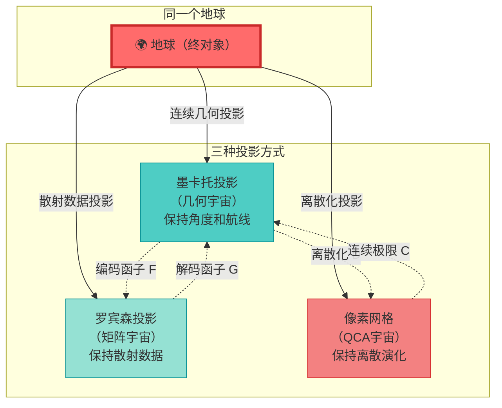
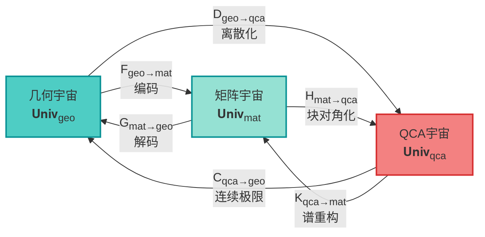
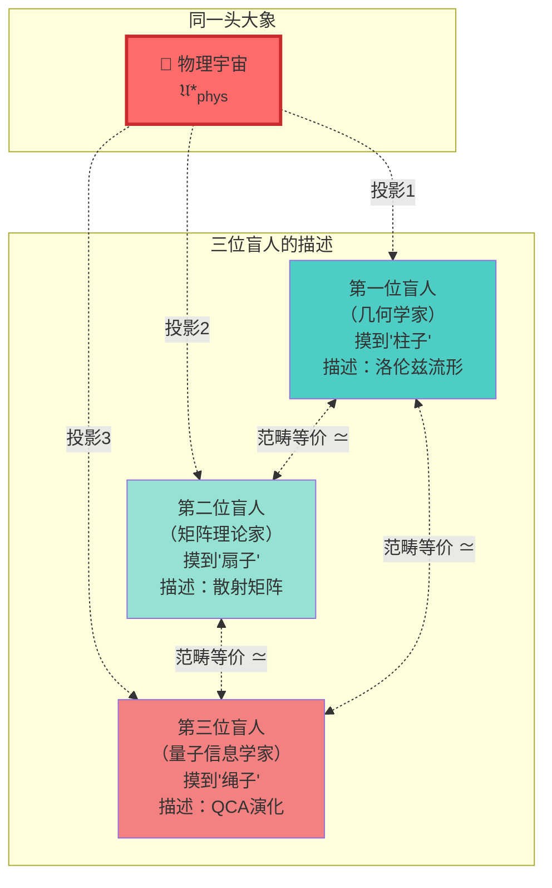
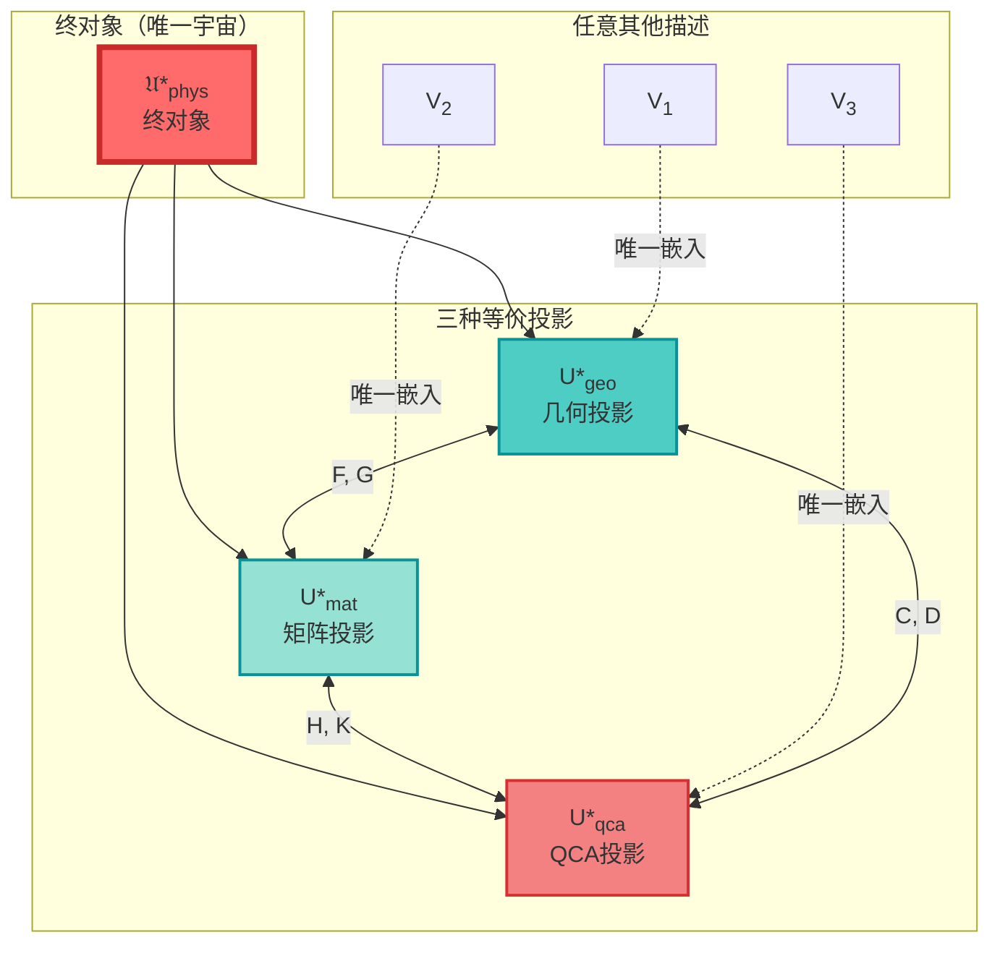

# 第4节：三重范畴等价 —— 宇宙的三种面孔

> **核心思想**：物理宇宙不是"几何"或"矩阵"或"QCA"，而是**同时**是这三者！三种描述在范畴论意义下完全等价，它们是同一个终对象的不同投影。

---

## 引言：一个宇宙，三种语言

在上一节中，我们证明了物理宇宙 $\mathfrak{U}^*_{\text{phys}}$ 是2-范畴中的终对象——唯一且必然。但这引出了一个深刻的问题：

**这个唯一的宇宙，应该用什么语言来描述？**

- **几何学家**说：宇宙是洛伦兹流形 $(M,g)$ 加上因果结构 $\prec$ 和度规场方程
- **矩阵理论家**说：宇宙是散射矩阵 $S(\omega)$ 加上群延迟 $Q(\omega)$ 和谱移函数
- **量子信息学家**说：宇宙是量子元胞自动机 $(Λ, \mathcal{H}_{\text{cell}}, \alpha)$ 的离散演化

这三种语言看起来完全不同，但本节将证明一个惊人的结果：

$$
\boxed{
\mathbf{Univ}^{\text{phys}}_{\text{geo}}
\simeq
\mathbf{Univ}^{\text{phys}}_{\text{mat}}
\simeq
\mathbf{Univ}^{\text{phys}}_{\text{qca}}
}
$$

这意味着：**三种描述是同一个对象的不同投影，它们在数学上完全等价！**

### 比喻：地球仪的三种投影

想象你有一个地球仪（终对象 $\mathfrak{U}^*_{\text{phys}}$），你可以用三种方式来记录它：

- **墨卡托投影**（几何）：强调航线（因果结构）和角度（共形结构）
- **罗宾森投影**（矩阵）：强调整体散射关系和频率响应
- **像素网格**（QCA）：强调离散格点和局域演化规则

虽然三种投影看起来很不同，但它们**记录了同一个地球的全部信息**！给定任意一种投影，你可以**无损地**重构出其他投影。

这就是**范畴等价**的含义！

---

## 1. 三个子范畴的精确定义

### 1.1 几何宇宙范畴 $\mathbf{Univ}^{\text{phys}}_{\text{geo}}$

**定义1.1（几何宇宙对象）**

一个几何宇宙 $U_{\text{geo}}$ 是七元组：

$$
U_{\text{geo}} = (M, g, \prec, \{\mathcal{A}_\partial(D_\alpha)\}_\alpha, \{\omega_\alpha\}_\alpha, \{S_{\text{gen},\alpha}\}_\alpha, \{\kappa_\alpha\}_\alpha)
$$

其中：

1. **$(M,g)$**：四维全局双曲洛伦兹流形
2. **$\prec$**：由光锥结构诱导的因果偏序
3. **$\{D_\alpha\}_{\alpha \in \mathcal{D}}$**：小因果菱形覆盖，满足局部有限性
4. **$\mathcal{A}_\partial(D_\alpha)$**：边界 von Neumann 代数（可观测的"边界数据"）
5. **$\omega_\alpha$**：边界态（量子场的"边界值"）
6. **$S_{\text{gen},\alpha}$**：广义熵（包含面积项和量子修正）
7. **$\kappa_\alpha(\omega)$**：统一时间刻度密度（来自Brown-York边界应力）

**满足四个公理**（A1-A4，见上一节）：
- A1：统一时间刻度同一式
- A2：广义熵单调性
- A3：拓扑无异常 $[K]=0$
- A4：因果局域有限性

**态射**：几何宇宙间的态射 $f: U_{\text{geo}} \to U'_{\text{geo}}$ 是：
- 因果同胚 $f_M: (M,g,\prec) \to (M',g',\prec')$
- 保持边界代数、态、熵和刻度的同构

**比喻**：几何宇宙就像**连续的水流**，你用流体力学方程（Einstein方程）来描述它，关注流线（因果曲线）和压力分布（应力张量）。

---

### 1.2 矩阵宇宙范畴 $\mathbf{Univ}^{\text{phys}}_{\text{mat}}$

**定义1.2（矩阵宇宙对象）**

一个矩阵宇宙 $U_{\text{mat}}$ 是六元组：

$$
U_{\text{mat}} = (\mathcal{H}_{\text{chan}}, S(\omega), Q(\omega), \{\kappa_\alpha(\omega)\}_\alpha, \mathcal{A}_\partial, \omega_\partial)
$$

其中：

1. **$\mathcal{H}_{\text{chan}} = \bigoplus_{\alpha \in \mathcal{D}} \mathcal{H}_\alpha$**：直和Hilbert空间（所有"通道"的叠加）
2. **$S(\omega)$**：散射矩阵（频率依赖的幺正算子）
3. **$Q(\omega) = -i S^\dagger(\omega) \partial_\omega S(\omega)$**：Wigner-Smith群延迟矩阵
4. **$\kappa_\alpha(\omega) = \frac{1}{2\pi} \text{tr} Q_\alpha(\omega)$**：统一时间刻度密度（来自群延迟）
5. **$\mathcal{A}_\partial$**：边界代数
6. **$\omega_\partial$**：边界态

**因果稀疏公理**：散射矩阵的块结构 $S_{\alpha\beta}(\omega)$ 满足：

$$
S_{\alpha\beta}(\omega) \neq 0 \quad \Rightarrow \quad \alpha \preceq \beta
$$

即：**只有因果相关的区域之间才有散射！**

**满足同样的四个公理**（A1-A4），但用散射语言重述。

**态射**：矩阵宇宙间的态射 $\Psi: U_{\text{mat}} \to U'_{\text{mat}}$ 是：
- 偏序集同构 $\psi: \mathcal{D} \to \mathcal{D}'$
- 幺正算子 $U: \mathcal{H} \to \mathcal{H}'$ 满足 $U S(\omega) U^\dagger = S'(\omega)$
- 保持刻度、熵和代数结构

**比喻**：矩阵宇宙就像**声音的频谱分析**，你不直接听声波（几何），而是看频率响应（散射矩阵）和相位延迟（群延迟）。所有信息都在频域中编码。

---

### 1.3 QCA宇宙范畴 $\mathbf{Univ}^{\text{phys}}_{\text{qca}}$

**定义1.3（QCA宇宙对象）**

一个QCA宇宙 $U_{\text{qca}}$ 是五元组：

$$
U_{\text{qca}} = (\Lambda, \mathcal{H}_{\text{cell}}, \mathcal{A}, \alpha, \omega_0)
$$

其中：

1. **$\Lambda$**：可数局域有限图（离散"时空"格点）
2. **$\mathcal{H}_{\text{cell}}$**：有限维元胞Hilbert空间（每个格点的"量子寄存器"）
3. **$\mathcal{A} = \bigotimes_{x \in \Lambda} \mathcal{B}(\mathcal{H}_{\text{cell}})$**：准局域 $C^*$-代数
4. **$\alpha: \mathcal{A} \to \mathcal{A}$**：QCA自同构（离散时间演化）
   - 平移协变
   - 有限传播半径 $R < \infty$（光速有限！）
5. **$\omega_0$**：初始态

**事件集合与因果结构**：

$$
E = \Lambda \times \mathbb{Z}, \quad (x,n) \preceq (y,m) \iff m \geq n \text{ 且 } \text{dist}(x,y) \leq R(m-n)
$$

- 时间 $n$ 递增
- 空间距离 $\leq R \times$ 时间间隔（有限传播！）

**满足四个公理**的离散版本。

**态射**：QCA宇宙间的态射是保持格点结构、演化和因果的同构。

**比喻**：QCA宇宙就像**《康威生命游戏》的量子版本**：
- 格点上的"细胞"是量子态
- 演化规则是幺正的、局域的
- 信息以有限速度传播（$R$就是"光速"）

---

## 2. 编码函子：从几何到矩阵

现在我们构造**编码函子** $F_{\text{geo→mat}}$，它将几何宇宙"翻译"成矩阵宇宙。

### 2.1 对象层面的编码

**给定几何宇宙** $U_{\text{geo}} = (M, g, \prec, \ldots)$

**步骤1：构造小因果菱形覆盖**

选取局部有限的小因果菱形族 $\{D_\alpha\}_{\alpha \in \mathcal{D}}$ 覆盖 $(M,g)$，满足：
- 每个 $D_\alpha$ 是某点 $p$ 附近尺度 $\ell$ 的因果菱形
- 覆盖整个流形：$M = \bigcup_\alpha D_\alpha$
- 局部有限：每个紧集只与有限个 $D_\alpha$ 相交

**步骤2：构造边界散射数据**

对每个小因果菱形 $D_\alpha$：
- 在边界 $\partial D_\alpha$ 上定义**边界散射问题**（类似于球壳的散射）
- 边界态 $\omega_\alpha$ 诱导 GNS 表示 $\mathcal{H}_\alpha$
- 构造散射矩阵块 $S_\alpha(\omega): \mathcal{H}_\alpha \to \mathcal{H}_\alpha$

**步骤3：组装全局散射矩阵**

定义直和Hilbert空间：

$$
\mathcal{H}_{\text{chan}} = \bigoplus_{\alpha \in \mathcal{D}} \mathcal{H}_\alpha
$$

全局散射矩阵 $S(\omega)$ 的块矩阵结构为：

$$
S(\omega) = \begin{pmatrix}
S_{11}(\omega) & S_{12}(\omega) & \cdots \\
S_{21}(\omega) & S_{22}(\omega) & \cdots \\
\vdots & \vdots & \ddots
\end{pmatrix}
$$

其中：
- **对角块** $S_{\alpha\alpha}(\omega)$：来自 $D_\alpha$ 的边界散射
- **非对角块** $S_{\alpha\beta}(\omega)$：
  - 若 $\alpha \not\preceq \beta$，则 $S_{\alpha\beta}(\omega) = 0$（因果律！）
  - 若 $\alpha \preceq \beta$，由传播核确定

**步骤4：验证矩阵宇宙公理**

- **因果稀疏性**：由几何因果结构 $\prec$ 保证
- **统一刻度**：几何的 Brown-York 刻度 $\kappa_\alpha^{\text{geo}}$ 通过 Birman-Kreĭn 公式对应散射刻度 $\kappa_\alpha^{\text{mat}}$
- **广义熵**：几何熵直接赋给矩阵宇宙的块矩阵熵
- **拓扑无异常**：$[K]=0$ 条件保持

**结果**：得到矩阵宇宙 $F(U_{\text{geo}})$。

### 2.2 态射层面的编码

给定几何宇宙间的态射 $f: U_{\text{geo}} \to U'_{\text{geo}}$（因果同胚），它诱导：
- 小因果菱形的对应 $D_\alpha \mapsto D'_{f(\alpha)}$
- GNS 空间的幺正同构 $U_f: \mathcal{H}_\alpha \to \mathcal{H}'_{f(\alpha)}$
- 散射矩阵的共轭 $S'(\omega) = U_f S(\omega) U_f^\dagger$

这给出矩阵宇宙间的态射 $F(f)$。

**函子性**：易验证 $F(g \circ f) = F(g) \circ F(f)$ 和 $F(\text{id}) = \text{id}$。

---

## 3. 解码函子：从矩阵到几何

**解码函子** $G_{\text{mat→geo}}$ 执行反向操作：从散射矩阵重构几何。

### 3.1 对象层面的解码

**给定矩阵宇宙** $U_{\text{mat}} = (\mathcal{H}, S(\omega), Q(\omega), \ldots)$

**步骤1：从因果稀疏模式重构拓扑**

- 散射矩阵的块结构 $S_{\alpha\beta}(\omega) \neq 0 \Rightarrow \alpha \preceq \beta$ 定义偏序集 $(\mathcal{D}, \preceq)$
- 利用 **Alexandrov 拓扑**：定义开集为"未来锥"和"过去锥"的交集
- 在适当条件下，这重构出拓扑流形结构

（这是 Malament-Hawking-King-McCarthy 型定理的应用）

**步骤2：从刻度密度重构度规**

- 刻度密度 $\kappa_\alpha(\omega)$ 的**高频渐近**给出边界面积和体积
- 利用**谱几何定理**（Weyl渐近、热核展开）从散射数据重构度规的共形类
- 结合体积信息确定共形因子

**步骤3：从广义熵推导Einstein方程**

- 块矩阵谱构造的广义熵 $S_{\text{gen},\alpha}$
- 在小钻石极限下，**IGVP公理**（信息几何变分原理）要求：
  - 一阶变分：$\delta S_{\text{gen}} = 0$
  - 二阶变分：$\delta^2 S_{\text{gen}} \geq 0$
- 这等价于 **Einstein 方程** + **规范能量正性**（Jacobson-Hollands-Wald）

**步骤4：重构边界代数和模流**

- 块矩阵的入射-出射结构定义边界代数 $\mathcal{A}_\partial(D_\alpha)$
- 刻度 $\kappa_\alpha$ 和 $\mathbb{Z}_2$ 账本 $\chi_\alpha$ 重建模流和 Null-Modular 双覆盖

**结果**：得到几何宇宙 $G(U_{\text{mat}})$。

### 3.2 互可重构性定理

**定理3.1（几何-矩阵互可重构性）**

在适当正则性条件下：

1. **编码后解码**：$G \circ F \simeq \text{id}_{\mathbf{Univ}_{\text{geo}}}$
   - 对几何宇宙 $U_{\text{geo}}$，编码成矩阵后再解码，得到的几何与原来**同构**（至多差因果同胚）

2. **解码后编码**：$F \circ G \simeq \text{id}_{\mathbf{Univ}_{\text{mat}}}$
   - 对矩阵宇宙 $U_{\text{mat}}$，解码成几何后再编码，得到的散射矩阵与原来**幺正等价**

**证明思路**：

**(1) $G \circ F \simeq \text{id}$**

给定 $U_{\text{geo}}$，执行 $F$ 得到散射矩阵，再执行 $G$：
- 因果网 $(\mathcal{D}, \preceq)$ 与原小因果菱形覆盖同构
- 散射块 $S_{\alpha\alpha}(\omega)$ 和刻度 $\kappa_\alpha$ 直接由几何给定
- 解码重构的 $(M,g,\prec)$ 与原流形至多差因果同胚

自然变换 $\eta: G \circ F \Rightarrow \text{id}$ 由这些同构构成。

**(2) $F \circ G \simeq \text{id}$**

给定 $U_{\text{mat}}$，执行 $G$ 得到几何，再执行 $F$：
- 解码重构的小因果菱形索引集与原 $\mathcal{D}$ 同构
- 重新构造的散射块与原矩阵宇宙一致
- 非对角块由因果传播唯一确定

自然变换 $\epsilon: F \circ G \Rightarrow \text{id}$ 存在。

因此 $F$ 和 $G$ 互为**准逆**，范畴等价成立！ □

---

## 4. QCA宇宙的连接

### 4.1 从QCA到几何：连续极限函子 $C_{\text{qca→geo}}$

**给定QCA宇宙** $U_{\text{qca}} = (\Lambda, \mathcal{H}_{\text{cell}}, \alpha, \omega_0)$

**步骤1：取格点间距 $\epsilon \to 0$ 的连续极限**

- 格点 $\Lambda$ → 连续流形 $M$（如 $\mathbb{Z}^d \to \mathbb{R}^d$）
- 离散时间步 $n$ → 连续时间 $t = n \epsilon$
- 有限传播半径 $R$ → 光速 $c = R/\epsilon$

**步骤2：单粒子扇区的Dirac方程涌现**

在适当的单粒子或低密度扇区，QCA演化 $\alpha$ 在连续极限下给出：

$$
(i \gamma^\mu \partial_\mu - m) \psi = 0
$$

（Dirac 方程！）

这是**量子行走到Dirac方程的严格定理**（Strauch, Cedzich等人的工作）。

**步骤3：构造洛伦兹度规**

- Dirac 算子的共形类定义时空度规
- 传播锥结构定义因果关系 $\prec$
- 组合得到几何宇宙 $C(U_{\text{qca}})$

### 4.2 从几何到QCA：离散化函子 $D_{\text{geo→qca}}$

**给定几何宇宙** $U_{\text{geo}} = (M, g, \ldots)$

**步骤1：引入截断长度 $\epsilon$**

- 将流形 $M$ 离散化为格点集 $\Lambda$ （如立方格点）
- 在每个格点赋予有限维量子寄存器 $\mathcal{H}_{\text{cell}}$

**步骤2：构造局域演化规则**

- 利用几何的传播核（如 Feynman 路径积分）定义 QCA 自同构 $\alpha$
- 有限传播：$R = c \cdot \epsilon$（光速 × 时间步）

**步骤3：验证连续极限一致性**

- 要求 $D \circ C \simeq \text{id}$：离散化后再取连续极限回到原几何
- 要求 $C \circ D \simeq \text{id}$：连续极限后再离散化回到原QCA

**定理4.2（QCA-几何等价）**

在物理子范畴上：

$$
\mathbf{Univ}^{\text{phys}}_{\text{qca}} \simeq \mathbf{Univ}^{\text{phys}}_{\text{geo}}
$$

证明依赖于：
- Schumacher-Werner 结构定理（QCA的分类）
- 量子行走连续极限的严格性
- 统一刻度在离散和连续版本间的对应

---

## 5. 三重等价定理

### 5.1 主定理

**定理5.1（三重范畴等价）**

在满足公理 A1-A4 的物理子范畴中，存在范畴等价：

$$
\mathbf{Univ}^{\text{phys}}_{\text{geo}}
\simeq
\mathbf{Univ}^{\text{phys}}_{\text{mat}}
\simeq
\mathbf{Univ}^{\text{phys}}_{\text{qca}}
$$

具体地，有六个函子：

满足**六个准逆关系**：

1. $G_{\text{mat→geo}} \circ F_{\text{geo→mat}} \simeq \text{id}_{\text{geo}}$
2. $F_{\text{geo→mat}} \circ G_{\text{mat→geo}} \simeq \text{id}_{\text{mat}}$
3. $C_{\text{qca→geo}} \circ D_{\text{geo→qca}} \simeq \text{id}_{\text{geo}}$
4. $D_{\text{geo→qca}} \circ C_{\text{qca→geo}} \simeq \text{id}_{\text{qca}}$
5. $K_{\text{qca→mat}} \circ H_{\text{mat→qca}} \simeq \text{id}_{\text{mat}}$
6. $H_{\text{mat→qca}} \circ K_{\text{qca→mat}} \simeq \text{id}_{\text{qca}}$

**证明**：

组合定理3.1（几何-矩阵等价）和定理4.2（QCA-几何等价）：

$$
\mathbf{Univ}_{\text{geo}}
\xrightarrow{F}
\mathbf{Univ}_{\text{mat}}
\quad \text{且} \quad
\mathbf{Univ}_{\text{geo}}
\xrightarrow{D}
\mathbf{Univ}_{\text{qca}}
$$

因此 $\mathbf{Univ}_{\text{mat}} \simeq \mathbf{Univ}_{\text{geo}} \simeq \mathbf{Univ}_{\text{qca}}$。

传递性给出 $\mathbf{Univ}_{\text{mat}} \simeq \mathbf{Univ}_{\text{qca}}$，函子为：

$$
H_{\text{mat→qca}} = D \circ G, \quad K_{\text{qca→mat}} = F \circ C
$$

三角交换图对易，三重等价成立。 □

### 5.2 物理含义

**推论5.2（宇宙描述的唯一性）**

任何满足公理A1-A4的物理宇宙描述，必然在以下三种语言中等价：

1. **几何语言**：洛伦兹流形 + 因果结构 + Einstein方程
2. **矩阵语言**：散射矩阵 + 群延迟 + Birman-Kreĭn公式
3. **QCA语言**：离散格点 + 幺正演化 + 有限传播

**不存在第四种本质不同的描述！**

（因为它们都必须映射到同一个终对象 $\mathfrak{U}^*_{\text{phys}}$ 的不同投影）

---

## 6. 比喻与直观理解

### 6.1 三位盲人摸象

想象三位盲人在"摸"同一头大象（物理宇宙）：

- **第一位**摸到象腿，说："宇宙是光滑的流形！"
- **第二位**摸到象耳，说："宇宙是振动的频谱！"
- **第三位**摸到象尾，说："宇宙是离散的格点！"

三人看似在说不同的东西，但**范畴等价**告诉我们：他们在描述**同一头大象**！

给定任意一个人的描述，通过函子可以**完全重构**另外两个人的描述。

### 6.2 同一本书的三种编码

想象你有一本书（物理定律），你可以用三种方式存储它：

1. **PDF格式**（几何）：直接保存页面的连续图像和文字布局
2. **MP3格式**（矩阵）：转换成音频文件的频谱数据
3. **二进制代码**（QCA）：编码成0和1的离散比特串

虽然三种格式看起来完全不同，但它们**包含完全相同的信息**！

- PDF → MP3：通过"文字转语音" + "傅里叶变换"
- MP3 → PDF：通过"逆傅里叶" + "语音识别" + "排版"
- PDF → 二进制：通过"扫描" + "数字化"
- 二进制 → PDF：通过"渲染" + "反走样"

**范畴等价保证信息无损！**

---

## 7. 保持的结构

三重等价不仅仅是"描述的等价"，更重要的是**保持所有物理结构**：

### 7.1 统一时间刻度的保持

**定理7.1**

三个函子 $F, G, C, D, H, K$ 都保持统一时间刻度等价类 $[\tau]$：

$$
\begin{aligned}
\kappa_{\text{geo}}(\omega) &= \kappa_{\text{mat}}(\omega) \\
\tau_{\text{geo}} &\sim \tau_{\text{scatt}} \sim \tau_{\text{mod}} \\
\kappa_{\text{qca}}(n,\epsilon) &\xrightarrow{\epsilon \to 0} \kappa_{\text{geo}}(\omega)
\end{aligned}
$$

**证明**：

- **几何→矩阵**：Brown-York 边界刻度 → 群延迟刻度，由 Birman-Kreĭn 公式联系
- **矩阵→几何**：群延迟谱数据 → 边界时间，由热核-谱移联系
- **QCA→几何**：离散时间步 $n$ → 连续时间 $t = n\epsilon$，在单粒子扇区保持
- **几何→QCA**：连续本征时间 → 格点Proper Time，由截断保持

因此统一刻度在三种描述间**一致**！

### 7.2 因果结构的保持

**定理7.2**

三个范畴中的因果偏序 $\preceq$ 彼此对应：

$$
\begin{aligned}
(p \prec q)_{\text{geo}} &\iff (S_{\alpha\beta} \neq 0)_{\text{mat}} \\
&\iff ((x,n) \preceq (y,m))_{\text{qca}}
\end{aligned}
$$

**证明**：

- **几何因果**：$p$ 在 $q$ 的过去光锥内
- **矩阵因果**：$\alpha$ 区域可散射到 $\beta$ 区域 $\Leftrightarrow$ $\alpha \preceq \beta$
- **QCA因果**：$(x,n)$ 可通过有限传播影响 $(y,m)$ $\Leftrightarrow$ $\text{dist}(x,y) \leq R(m-n)$

三者通过函子一一对应！

### 7.3 广义熵的保持

**定理7.3**

广义熵在三种描述中等价：

$$
S_{\text{gen}}^{\text{geo}}(D_\alpha) = S_{\text{gen}}^{\text{mat}}(\mathcal{H}_\alpha) = S_{\text{gen}}^{\text{qca}}(\Lambda_\alpha)
$$

**证明**：

- **几何熵**：$\frac{A}{4G\hbar} + S_{\text{out}}$
- **矩阵熵**：由块矩阵谱构造 $S_{\text{gen}} = -\text{tr}(\rho_\alpha \log \rho_\alpha) + \ldots$
- **QCA熵**：格点子区域的纠缠熵在连续极限下给出面积律

IGVP 公理保证三者一致！

---

## 8. 终对象的唯一性

### 8.1 三种投影的统一

前面三节证明了物理宇宙有**唯一的终对象** $\mathfrak{U}^*_{\text{phys}}$，本节证明了这个终对象有**三种等价的描述**。

结合起来，我们得到：

**大统一定理**

存在唯一的物理宇宙终对象 $\mathfrak{U}^*_{\text{phys}}$，它在三种描述下等价：

$$
\mathfrak{U}^*_{\text{phys}} =
\begin{cases}
U^*_{\text{geo}} & \text{（几何投影）} \\
U^*_{\text{mat}} & \text{（矩阵投影）} \\
U^*_{\text{qca}} & \text{（QCA投影）}
\end{cases}
$$

满足三重等价：

$$
\boxed{
\mathbf{Univ}^{\text{phys}}_{\text{geo}}
\simeq
\mathbf{Univ}^{\text{phys}}_{\text{mat}}
\simeq
\mathbf{Univ}^{\text{phys}}_{\text{qca}}
}
$$

并且任何其他满足公理的宇宙描述 $V$，都唯一地嵌入这三种投影之一：

### 8.2 物理意义

**推论8.1（描述的唯一性）**

物理宇宙的**本质**不是几何的、不是矩阵的、也不是离散的，而是**三者的统一**！

任何物理理论，如果满足四个公理（A1-A4），必然可以在三种语言中等价地表述：

1. **广义相对论**视角：洛伦兹流形 + Einstein方程
2. **散射理论**视角：S-矩阵 + 幺正性 + 因果律
3. **量子信息**视角：QCA + 有限传播 + 连续极限

三者**不可分离**，它们是同一个数学对象的三个面！

**推论8.2（反多元宇宙）**

不存在"平行的多元宇宙"，只要物理定律相同（即满足公理A1-A4），宇宙在范畴论意义下**必然唯一**！

不同的"可能世界"只是：
- 同一终对象的**不同坐标选择**（如惯性系变换）
- 同一终对象的**不同观察者视角**（如观测者的因果锥）

但**本质上是同一个宇宙**！

---

## 9. 实例：Schwarzschild黑洞的三种面孔

为了让抽象的范畴等价更具体，我们看一个例子：**Schwarzschild黑洞在三种描述下的样子**。

### 9.1 几何描述

**度规**：

$$
ds^2 = -\left(1 - \frac{2GM}{r}\right) dt^2 + \frac{dr^2}{1 - \frac{2GM}{r}} + r^2 d\Omega^2
$$

- 洛伦兹流形 $(M,g)$ 有视界 $r = 2GM$
- 因果结构：事件视界是未来零超曲面
- 广义熵：Bekenstein-Hawking 熵 $S = \frac{A}{4G\hbar} = \frac{\pi r_s^2}{G\hbar}$

### 9.2 矩阵描述

**散射矩阵**（远区）：

低频展开：

$$
S(\omega) \approx e^{2i\delta(\omega)}, \quad \delta(\omega) = -2GM\omega \log(\omega r_s) + O(\omega)
$$

**Wigner-Smith群延迟**：

$$
Q(\omega) = -i S^\dagger \frac{dS}{d\omega} = 2 \frac{d\delta}{d\omega} \approx -2GM (\log(\omega r_s) + 1)
$$

**统一刻度密度**：

$$
\kappa(\omega) = \frac{1}{2\pi} Q(\omega) = -\frac{GM}{\pi} (\log(\omega r_s) + 1)
$$

（负号对应"吸积"时间方向）

**广义熵**：

从散射矩阵的谱移函数 $\xi(\omega)$ 重构，在红外截断下给出 $S_{\text{gen}} = \frac{A}{4G}$。

### 9.3 QCA描述

**离散化**：

- 将时空离散化为格点，视界附近格点间距 $\epsilon \sim \sqrt{G\hbar}$（普朗克长度）
- 每个格点是量子比特 $\mathcal{H}_{\text{cell}} = \mathbb{C}^2$
- 演化规则 $\alpha$ 在视界外保持信息（幺正），在视界上"吸收"（边界条件）

**纠缠熵**：

视界截面的纠缠熵（与外部的纠缠）：

$$
S_{\text{ent}} = \sum_{\text{视界格点}} 1 = \frac{A}{4\epsilon^2} = \frac{A}{4 G\hbar}
$$

（面积律！）

**连续极限**：

$\epsilon \to 0$ 时，QCA 在单粒子扇区给出 Dirac 方程在弯曲时空中的传播，恢复几何描述。

### 9.4 三种描述的一致性

| 物理量 | 几何 | 矩阵 | QCA |
|--------|------|------|-----|
| 视界面积 $A$ | $4\pi r_s^2$ | 从 $\xi(\omega)$ 积分 | $4\epsilon^2 \times N_{\text{格点}}$ |
| 熵 $S$ | $\frac{A}{4G\hbar}$ | 从谱移重构 | $\sum_{\text{视界}} S_{\text{ent}}$ |
| 时间刻度 $\kappa$ | Brown-York 刻度 | 群延迟 $\frac{1}{2\pi}Q$ | 离散时间步 |
| 因果结构 | 光锥 $\prec$ | 散射因果律 | $(x,n) \preceq (y,m)$ |

**三种描述完全一致！**

---

## 10. 小结与展望

### 10.1 本节核心结论

1. **物理宇宙有三种等价的数学描述**：
   - 几何宇宙：洛伦兹流形 + Einstein方程
   - 矩阵宇宙：散射矩阵 + Birman-Kreĭn公式
   - QCA宇宙：离散格点 + 幺正演化

2. **三种描述在范畴论意义下等价**：
   $$\mathbf{Univ}_{\text{geo}} \simeq \mathbf{Univ}_{\text{mat}} \simeq \mathbf{Univ}_{\text{qca}}$$

3. **等价性通过六个函子实现**：
   - 编码/解码（几何 ↔ 矩阵）
   - 离散化/连续极限（几何 ↔ QCA）
   - 块对角化/谱重构（矩阵 ↔ QCA）

4. **等价性保持所有物理结构**：
   - 统一时间刻度 $[\tau]$
   - 因果偏序 $\preceq$
   - 广义熵 $S_{\text{gen}}$
   - 拓扑不变量 $[K]$

5. **唯一的终对象有三个投影**：
   $$\mathfrak{U}^*_{\text{phys}} = \{U^*_{\text{geo}}, U^*_{\text{mat}}, U^*_{\text{qca}}\}$$

### 10.2 哲学意义

**问：宇宙"真的是"连续的还是离散的？**

**答：这个问题没有意义！**

因为范畴等价告诉我们：
- 连续描述（几何）和离散描述（QCA）**包含完全相同的信息**
- 它们是**同一个对象的不同坐标系**
- 问"哪个更真实"就像问"用米还是英尺测量更真实"一样荒谬

**问：宇宙"真的是"几何的还是代数的？**

**答：两者都是，也两者都不是！**

宇宙是一个**抽象的范畴论对象**（终对象），它既可以用几何语言描述，也可以用矩阵语言描述，也可以用QCA语言描述。

**物理学不是发现"宇宙是什么"，而是发现"宇宙可以如何被描述"！**

### 10.3 下一节预告

在下一节（第5节），我们将研究：

**场论的涌现 —— 标准模型如何从终对象中"长出来"**

我们将看到：
- Dirac场如何从QCA的连续极限涌现
- 规范对称性如何从拓扑约束 $[K]=0$ 涌现
- 标准模型群 $(SU(3) \times SU(2) \times U(1))/\mathbb{Z}_6$ 如何被唯一确定

**终对象不仅确定了时空，还确定了物质场！**

---

## 参考文献

1. **Birman-Kreĭn公式**：M. Sh. Birman and M. G. Kreĭn, "On the theory of wave operators and scattering operators", Soviet Math. Dokl. (1962)

2. **Wigner-Smith群延迟**：E. P. Wigner, "Lower Limit for the Energy Derivative of the Scattering Phase Shift", Phys. Rev. (1955)

3. **Malament定理**：D. B. Malament, "The class of continuous timelike curves determines the topology of spacetime", J. Math. Phys. (1977)

4. **量子行走连续极限**：F. W. Strauch, "Connecting the discrete- and continuous-time quantum walks", Phys. Rev. A (2006)

5. **Schumacher-Werner定理**：B. Schumacher and R. F. Werner, "Reversible quantum cellular automata", arXiv:quant-ph/0405174

6. **广义熵与QNEC**：R. Bousso et al., "Proof of the quantum null energy condition", Phys. Rev. D (2016)

7. **边界时间几何**：J. D. Brown and J. W. York, "Quasilocal energy and conserved charges derived from the gravitational action", Phys. Rev. D (1993)

8. **范畴等价理论**：S. Mac Lane, "Categories for the Working Mathematician", Springer (1971)

---

**下一节**：[05-场论涌现.md](05-field-emergence.md) —— 标准模型从终对象中的涌现

**返回目录**：[../index.md](../index.md)
