# Section 4: Triple Categorical Equivalence — Three Faces of the Universe

> **Core Idea**: The physical universe is not "geometric" or "matrix" or "QCA", but **simultaneously** all three! The three descriptions are completely equivalent in the categorical sense—they are different projections of the same terminal object.

---

## Introduction: One Universe, Three Languages

In the previous section, we proved that the physical universe $\mathfrak{U}^*_{\text{phys}}$ is the terminal object in a 2-category—unique and necessary. But this raises a profound question:

**What language should be used to describe this unique universe?**

- **Geometers** say: The universe is a Lorentzian manifold $(M,g)$ plus causal structure $\prec$ and metric field equations
- **Matrix theorists** say: The universe is a scattering matrix $S(\omega)$ plus group delay $Q(\omega)$ and spectral shift function
- **Quantum information theorists** say: The universe is discrete evolution of quantum cellular automata $(\Lambda, \mathcal{H}_{\text{cell}}, \alpha)$

These three languages appear completely different, but this section will prove an astonishing result:

$$
\boxed{
\mathbf{Univ}^{\text{phys}}_{\text{geo}}
\simeq
\mathbf{Univ}^{\text{phys}}_{\text{mat}}
\simeq
\mathbf{Univ}^{\text{phys}}_{\text{qca}}
}
$$

This means: **The three descriptions are different projections of the same object, mathematically completely equivalent!**

### Analogy: Three Projections of a Globe

Imagine you have a globe (terminal object $\mathfrak{U}^*_{\text{phys}}$), and you can record it in three ways:

```mermaid
graph TB
    subgraph "Same Earth"
        Earth["🌍 Earth (Terminal Object)"]
    end

    subgraph "Three Projection Methods"
        Mercator["Mercator Projection<br/>(Geometric Universe)<br/>Preserves angles and routes"]
        Robinson["Robinson Projection<br/>(Matrix Universe)<br/>Preserves scattering data"]
        Discrete["Pixel Grid<br/>(QCA Universe)<br/>Preserves discrete evolution"]
    end

    Earth -->|"Continuous Geometric Projection"| Mercator
    Earth -->|"Scattering Data Projection"| Robinson
    Earth -->|"Discretization Projection"| Discrete

    Mercator -.->|"Encoding Functor F"| Robinson
    Robinson -.->|"Decoding Functor G"| Mercator
    Mercator -.->|"Discretization D"| Discrete
    Discrete -.->|"Continuous Limit C"| Mercator

    style Earth fill:#ff6b6b,stroke:#c92a2a,stroke-width:3px
    style Mercator fill:#4ecdc4,stroke:#0a9396
    style Robinson fill:#95e1d3,stroke:#0a9396
    style Discrete fill:#f38181,stroke:#d63031
```

- **Mercator projection** (geometric): Emphasizes routes (causal structure) and angles (conformal structure)
- **Robinson projection** (matrix): Emphasizes overall scattering relations and frequency response
- **Pixel grid** (QCA): Emphasizes discrete lattice points and local evolution rules

Although the three projections look very different, they **record all information of the same Earth**! Given any projection, you can **losslessly** reconstruct the others.

This is what **categorical equivalence** means!

---

## 1. Precise Definitions of Three Subcategories

### 1.1 Geometric Universe Category $\mathbf{Univ}^{\text{phys}}_{\text{geo}}$

**Definition 1.1 (Geometric Universe Object)**

A geometric universe $U_{\text{geo}}$ is a seven-tuple:

$$
U_{\text{geo}} = (M, g, \prec, \{\mathcal{A}_\partial(D_\alpha)\}_\alpha, \{\omega_\alpha\}_\alpha, \{S_{\text{gen},\alpha}\}_\alpha, \{\kappa_\alpha\}_\alpha)
$$

where:

1. **$(M,g)$**: Four-dimensional globally hyperbolic Lorentzian manifold
2. **$\prec$**: Causal partial order induced by light cone structure
3. **$\{D_\alpha\}_{\alpha \in \mathcal{D}}$**: Small causal diamond cover, satisfying local finiteness
4. **$\mathcal{A}_\partial(D_\alpha)$**: Boundary von Neumann algebra (observable "boundary data")
5. **$\omega_\alpha$**: Boundary state (quantum field "boundary values")
6. **$S_{\text{gen},\alpha}$**: Generalized entropy (including area term and quantum corrections)
7. **$\kappa_\alpha(\omega)$**: Unified time scale density (from Brown-York boundary stress)

**Satisfying four axioms** (A1-A4, see previous section):
- A1: Unified time scale identity
- A2: Generalized entropy monotonicity
- A3: Topological anomaly-free $[K]=0$
- A4: Causal local finiteness

**Morphisms**: Morphisms $f: U_{\text{geo}} \to U'_{\text{geo}}$ between geometric universes are:
- Causal homeomorphisms $f_M: (M,g,\prec) \to (M',g',\prec')$
- Isomorphisms preserving boundary algebras, states, entropy, and scales

**Analogy**: A geometric universe is like **continuous water flow**, described by fluid mechanics equations (Einstein equations), focusing on streamlines (causal curves) and pressure distribution (stress tensor).

---

### 1.2 Matrix Universe Category $\mathbf{Univ}^{\text{phys}}_{\text{mat}}$

**Definition 1.2 (Matrix Universe Object)**

A matrix universe $U_{\text{mat}}$ is a six-tuple:

$$
U_{\text{mat}} = (\mathcal{H}_{\text{chan}}, S(\omega), Q(\omega), \{\kappa_\alpha(\omega)\}_\alpha, \mathcal{A}_\partial, \omega_\partial)
$$

where:

1. **$\mathcal{H}_{\text{chan}} = \bigoplus_{\alpha \in \mathcal{D}} \mathcal{H}_\alpha$**: Direct sum Hilbert space (superposition of all "channels")
2. **$S(\omega)$**: Scattering matrix (frequency-dependent unitary operator)
3. **$Q(\omega) = -i S^\dagger(\omega) \partial_\omega S(\omega)$**: Wigner-Smith group delay matrix
4. **$\kappa_\alpha(\omega) = \frac{1}{2\pi} \text{tr} Q_\alpha(\omega)$**: Unified time scale density (from group delay)
5. **$\mathcal{A}_\partial$**: Boundary algebra
6. **$\omega_\partial$**: Boundary state

**Causal sparsity axiom**: Block structure of scattering matrix $S_{\alpha\beta}(\omega)$ satisfies:

$$
S_{\alpha\beta}(\omega) \neq 0 \quad \Rightarrow \quad \alpha \preceq \beta
$$

That is: **Only causally related regions have scattering!**

**Satisfying the same four axioms** (A1-A4), but restated in scattering language.

**Morphisms**: Morphisms $\Psi: U_{\text{mat}} \to U'_{\text{mat}}$ between matrix universes are:
- Poset isomorphisms $\psi: \mathcal{D} \to \mathcal{D}'$
- Unitary operators $U: \mathcal{H} \to \mathcal{H}'$ satisfying $U S(\omega) U^\dagger = S'(\omega)$
- Preserving scales, entropy, and algebraic structure

**Analogy**: A matrix universe is like **spectral analysis of sound**, not directly listening to sound waves (geometry), but looking at frequency response (scattering matrix) and phase delay (group delay). All information is encoded in the frequency domain.

---

### 1.3 QCA Universe Category $\mathbf{Univ}^{\text{phys}}_{\text{qca}}$

**Definition 1.3 (QCA Universe Object)**

A QCA universe $U_{\text{qca}}$ is a five-tuple:

$$
U_{\text{qca}} = (\Lambda, \mathcal{H}_{\text{cell}}, \mathcal{A}, \alpha, \omega_0)
$$

where:

1. **$\Lambda$**: Countable locally finite graph (discrete "spacetime" lattice points)
2. **$\mathcal{H}_{\text{cell}}$**: Finite-dimensional cell Hilbert space ("quantum register" at each lattice point)
3. **$\mathcal{A} = \bigotimes_{x \in \Lambda} \mathcal{B}(\mathcal{H}_{\text{cell}})$**: Quasilocal $C^*$-algebra
4. **$\alpha: \mathcal{A} \to \mathcal{A}$**: QCA automorphism (discrete time evolution)
   - Translation covariant
   - Finite propagation radius $R < \infty$ (finite speed of light!)
5. **$\omega_0$**: Initial state

**Event Set and Causal Structure**:

$$
E = \Lambda \times \mathbb{Z}, \quad (x,n) \preceq (y,m) \iff m \geq n \text{ and } \text{dist}(x,y) \leq R(m-n)
$$

- Time $n$ increases
- Spatial distance $\leq R \times$ time interval (finite propagation!)

**Satisfying discrete versions of the four axioms**.

**Morphisms**: Morphisms between QCA universes are isomorphisms preserving lattice structure, evolution, and causality.

**Analogy**: A QCA universe is like **quantum version of Conway's Game of Life**:
- "Cells" on lattice are quantum states
- Evolution rules are unitary and local
- Information propagates at finite speed ($R$ is the "speed of light")

---

## 2. Encoding Functor: From Geometry to Matrix

Now we construct the **encoding functor** $F_{\text{geo→mat}}$, which "translates" geometric universes into matrix universes.

### 2.1 Object-Level Encoding

**Given geometric universe** $U_{\text{geo}} = (M, g, \prec, \ldots)$

**Step 1: Construct Small Causal Diamond Cover**

Select locally finite family of small causal diamonds $\{D_\alpha\}_{\alpha \in \mathcal{D}}$ covering $(M,g)$, satisfying:
- Each $D_\alpha$ is a causal diamond of scale $\ell$ near some point $p$
- Cover entire manifold: $M = \bigcup_\alpha D_\alpha$
- Locally finite: Each compact set intersects only finitely many $D_\alpha$

**Step 2: Construct Boundary Scattering Data**

For each small causal diamond $D_\alpha$:
- Define **boundary scattering problem** on boundary $\partial D_\alpha$ (similar to scattering on spherical shell)
- Boundary state $\omega_\alpha$ induces GNS representation $\mathcal{H}_\alpha$
- Construct scattering matrix block $S_\alpha(\omega): \mathcal{H}_\alpha \to \mathcal{H}_\alpha$

**Step 3: Assemble Global Scattering Matrix**

Define direct sum Hilbert space:

$$
\mathcal{H}_{\text{chan}} = \bigoplus_{\alpha \in \mathcal{D}} \mathcal{H}_\alpha
$$

Block matrix structure of global scattering matrix $S(\omega)$:

$$
S(\omega) = \begin{pmatrix}
S_{11}(\omega) & S_{12}(\omega) & \cdots \\
S_{21}(\omega) & S_{22}(\omega) & \cdots \\
\vdots & \vdots & \ddots
\end{pmatrix}
$$

where:
- **Diagonal blocks** $S_{\alpha\alpha}(\omega)$: From boundary scattering of $D_\alpha$
- **Off-diagonal blocks** $S_{\alpha\beta}(\omega)$:
  - If $\alpha \not\preceq \beta$, then $S_{\alpha\beta}(\omega) = 0$ (causality!)
  - If $\alpha \preceq \beta$, determined by propagation kernel

**Step 4: Verify Matrix Universe Axioms**

- **Causal sparsity**: Guaranteed by geometric causal structure $\prec$
- **Unified scale**: Geometric Brown-York scale $\kappa_\alpha^{\text{geo}}$ corresponds to scattering scale $\kappa_\alpha^{\text{mat}}$ via Birman-Kreĭn formula
- **Generalized entropy**: Geometric entropy directly assigned to block matrix entropy of matrix universe
- **Topological anomaly-free**: Condition $[K]=0$ preserved

**Result**: Obtain matrix universe $F(U_{\text{geo}})$.

### 2.2 Morphism-Level Encoding

Given morphism $f: U_{\text{geo}} \to U'_{\text{geo}}$ between geometric universes (causal homeomorphism), it induces:
- Correspondence of small causal diamonds $D_\alpha \mapsto D'_{f(\alpha)}$
- Unitary isomorphism of GNS spaces $U_f: \mathcal{H}_\alpha \to \mathcal{H}'_{f(\alpha)}$
- Conjugation of scattering matrix $S'(\omega) = U_f S(\omega) U_f^\dagger$

This gives morphism $F(f)$ between matrix universes.

**Functoriality**: Easy to verify $F(g \circ f) = F(g) \circ F(f)$ and $F(\text{id}) = \text{id}$.

---

## 3. Decoding Functor: From Matrix to Geometry

**Decoding functor** $G_{\text{mat→geo}}$ performs the reverse operation: reconstructing geometry from scattering matrix.

### 3.1 Object-Level Decoding

**Given matrix universe** $U_{\text{mat}} = (\mathcal{H}, S(\omega), Q(\omega), \ldots)$

**Step 1: Reconstruct Topology from Causal Sparsity Pattern**

- Block structure of scattering matrix $S_{\alpha\beta}(\omega) \neq 0 \Rightarrow \alpha \preceq \beta$ defines poset $(\mathcal{D}, \preceq)$
- Use **Alexandrov topology**: Define open sets as intersections of "future cones" and "past cones"
- Under appropriate conditions, this reconstructs topological manifold structure

(This is application of Malament-Hawking-King-McCarthy type theorem)

**Step 2: Reconstruct Metric from Scale Density**

- **High-frequency asymptotics** of scale density $\kappa_\alpha(\omega)$ gives boundary area and volume
- Use **spectral geometry theorems** (Weyl asymptotics, heat kernel expansion) to reconstruct conformal class of metric from scattering data
- Combine with volume information to determine conformal factor

**Step 3: Derive Einstein Equation from Generalized Entropy**

- Generalized entropy $S_{\text{gen},\alpha}$ constructed from block matrix spectrum
- In small diamond limit, **IGVP axiom** (Information-Geometric Variational Principle) requires:
  - First-order variation: $\delta S_{\text{gen}} = 0$
  - Second-order variation: $\delta^2 S_{\text{gen}} \geq 0$
- This is equivalent to **Einstein equation** + **canonical energy positivity** (Jacobson-Hollands-Wald)

**Step 4: Reconstruct Boundary Algebras and Modular Flow**

- In-out structure of block matrices defines boundary algebra $\mathcal{A}_\partial(D_\alpha)$
- Scale $\kappa_\alpha$ and $\mathbb{Z}_2$ holonomy $\chi_\alpha$ reconstruct modular flow and Null-Modular double cover

**Result**: Obtain geometric universe $G(U_{\text{mat}})$.

### 3.2 Mutual Reconstructibility Theorem

**Theorem 3.1 (Geometric-Matrix Mutual Reconstructibility)**

Under appropriate regularity conditions:

1. **Encode then decode**: $G \circ F \simeq \text{id}_{\mathbf{Univ}_{\text{geo}}}$
   - For geometric universe $U_{\text{geo}}$, encoding to matrix then decoding gives geometry **isomorphic** to original (at most differing by causal homeomorphism)

2. **Decode then encode**: $F \circ G \simeq \text{id}_{\mathbf{Univ}_{\text{mat}}}$
   - For matrix universe $U_{\text{mat}}$, decoding to geometry then encoding gives scattering matrix **unitarily equivalent** to original

**Proof Outline**:

**(1) $G \circ F \simeq \text{id}$**

Given $U_{\text{geo}}$, execute $F$ to get scattering matrix, then execute $G$:
- Causal net $(\mathcal{D}, \preceq)$ isomorphic to original small causal diamond cover
- Scattering blocks $S_{\alpha\alpha}(\omega)$ and scale $\kappa_\alpha$ directly given by geometry
- Decoded reconstructed $(M,g,\prec)$ differs from original manifold at most by causal homeomorphism

Natural transformation $\eta: G \circ F \Rightarrow \text{id}$ consists of these isomorphisms.

**(2) $F \circ G \simeq \text{id}$**

Given $U_{\text{mat}}$, execute $G$ to get geometry, then execute $F$:
- Decoded reconstructed small causal diamond index set isomorphic to original $\mathcal{D}$
- Reconstructed scattering blocks consistent with original matrix universe
- Off-diagonal blocks uniquely determined by causal propagation

Natural transformation $\epsilon: F \circ G \Rightarrow \text{id}$ exists.

Therefore $F$ and $G$ are **quasi-inverses**, categorical equivalence holds! □

---

## 4. QCA Universe Connection

### 4.1 From QCA to Geometry: Continuous Limit Functor $C_{\text{qca→geo}}$

**Given QCA universe** $U_{\text{qca}} = (\Lambda, \mathcal{H}_{\text{cell}}, \alpha, \omega_0)$

**Step 1: Take Continuous Limit as Lattice Spacing $\epsilon \to 0$**

- Lattice $\Lambda$ → continuous manifold $M$ (e.g., $\mathbb{Z}^d \to \mathbb{R}^d$)
- Discrete time steps $n$ → continuous time $t = n \epsilon$
- Finite propagation radius $R$ → speed of light $c = R/\epsilon$

**Step 2: Dirac Equation Emergence in Single-Particle Sector**

In appropriate single-particle or low-density sector, QCA evolution $\alpha$ gives in continuous limit:

$$
(i \gamma^\mu \partial_\mu - m) \psi = 0
$$

(Dirac equation!)

This is **rigorous theorem of quantum walk to Dirac equation** (work of Strauch, Cedzich, etc.).

**Step 3: Construct Lorentz Metric**

- Conformal class of Dirac operator defines spacetime metric
- Propagation cone structure defines causality $\prec$
- Combine to get geometric universe $C(U_{\text{qca}})$

### 4.2 From Geometry to QCA: Discretization Functor $D_{\text{geo→qca}}$

**Given geometric universe** $U_{\text{geo}} = (M, g, \ldots)$

**Step 1: Introduce Cutoff Length $\epsilon$**

- Discretize manifold $M$ into lattice point set $\Lambda$ (e.g., cubic lattice)
- Assign finite-dimensional quantum register $\mathcal{H}_{\text{cell}}$ at each lattice point

**Step 2: Construct Local Evolution Rules**

- Use geometric propagation kernel (e.g., Feynman path integral) to define QCA automorphism $\alpha$
- Finite propagation: $R = c \cdot \epsilon$ (speed of light × time step)

**Step 3: Verify Continuous Limit Consistency**

- Require $D \circ C \simeq \text{id}$: Discretization then continuous limit returns to original geometry
- Require $C \circ D \simeq \text{id}$: Continuous limit then discretization returns to original QCA

**Theorem 4.2 (QCA-Geometry Equivalence)**

On physical subcategory:

$$
\mathbf{Univ}^{\text{phys}}_{\text{qca}} \simeq \mathbf{Univ}^{\text{phys}}_{\text{geo}}
$$

Proof relies on:
- Schumacher-Werner structure theorem (classification of QCA)
- Rigor of quantum walk continuous limit
- Correspondence of unified scale between discrete and continuous versions

---

## 5. Triple Equivalence Theorem

### 5.1 Main Theorem

**Theorem 5.1 (Triple Categorical Equivalence)**

In physical subcategory satisfying axioms A1-A4, there exists categorical equivalence:

$$
\mathbf{Univ}^{\text{phys}}_{\text{geo}}
\simeq
\mathbf{Univ}^{\text{phys}}_{\text{mat}}
\simeq
\mathbf{Univ}^{\text{phys}}_{\text{qca}}
$$

Specifically, there are six functors:

```mermaid
graph LR
    Geo["Geometric Universe<br/>𝐔𝐧𝐢𝐯<sub>geo</sub>"]
    Mat["Matrix Universe<br/>𝐔𝐧𝐢𝐯<sub>mat</sub>"]
    QCA["QCA Universe<br/>𝐔𝐧𝐢𝐯<sub>qca</sub>"]

    Geo -->|"F<sub>geo→mat</sub><br/>Encoding"| Mat
    Mat -->|"G<sub>mat→geo</sub><br/>Decoding"| Geo

    Geo -->|"D<sub>geo→qca</sub><br/>Discretization"| QCA
    QCA -->|"C<sub>qca→geo</sub><br/>Continuous Limit"| Geo

    Mat -->|"H<sub>mat→qca</sub><br/>Block Diagonalization"| QCA
    QCA -->|"K<sub>qca→mat</sub><br/>Spectral Reconstruction"| Mat

    style Geo fill:#4ecdc4,stroke:#0a9396,stroke-width:2px
    style Mat fill:#95e1d3,stroke:#0a9396,stroke-width:2px
    style QCA fill:#f38181,stroke:#d63031,stroke-width:2px
```

Satisfying **six quasi-inverse relations**:

1. $G_{\text{mat→geo}} \circ F_{\text{geo→mat}} \simeq \text{id}_{\text{geo}}$
2. $F_{\text{geo→mat}} \circ G_{\text{mat→geo}} \simeq \text{id}_{\text{mat}}$
3. $C_{\text{qca→geo}} \circ D_{\text{geo→qca}} \simeq \text{id}_{\text{geo}}$
4. $D_{\text{geo→qca}} \circ C_{\text{qca→geo}} \simeq \text{id}_{\text{qca}}$
5. $K_{\text{qca→mat}} \circ H_{\text{mat→qca}} \simeq \text{id}_{\text{mat}}$
6. $H_{\text{mat→qca}} \circ K_{\text{qca→mat}} \simeq \text{id}_{\text{qca}}$

**Proof**:

Combine Theorem 3.1 (geometric-matrix equivalence) and Theorem 4.2 (QCA-geometry equivalence):

$$
\mathbf{Univ}_{\text{geo}}
\xrightarrow{F}
\mathbf{Univ}_{\text{mat}}
\quad \text{and} \quad
\mathbf{Univ}_{\text{geo}}
\xrightarrow{D}
\mathbf{Univ}_{\text{qca}}
$$

Therefore $\mathbf{Univ}_{\text{mat}} \simeq \mathbf{Univ}_{\text{geo}} \simeq \mathbf{Univ}_{\text{qca}}$.

Transitivity gives $\mathbf{Univ}_{\text{mat}} \simeq \mathbf{Univ}_{\text{qca}}$, functors are:

$$
H_{\text{mat→qca}} = D \circ G, \quad K_{\text{qca→mat}} = F \circ C
$$

Triangular commutative diagram commutes, triple equivalence holds. □

### 5.2 Physical Meaning

**Corollary 5.2 (Uniqueness of Universe Description)**

Any physical universe description satisfying axioms A1-A4 must be equivalent in the following three languages:

1. **Geometric language**: Lorentzian manifold + causal structure + Einstein equation
2. **Matrix language**: Scattering matrix + group delay + Birman-Kreĭn formula
3. **QCA language**: Discrete lattice + unitary evolution + finite propagation

**No fourth essentially different description exists!**

(Because they all must map to different projections of the same terminal object $\mathfrak{U}^*_{\text{phys}}$)

---

## 6. Analogies and Intuitive Understanding

### 6.1 Three Blind Men Touching an Elephant

Imagine three blind men "touching" the same elephant (physical universe):

```mermaid
graph TD
    subgraph "Same Elephant"
        Elephant["🐘 Physical Universe<br/>𝔘*<sub>phys</sub>"]
    end

    subgraph "Three Blind Men's Descriptions"
        Man1["First Blind Man<br/>(Geometer)<br/>Touches 'pillar'<br/>Description: Lorentzian manifold"]
        Man2["Second Blind Man<br/>(Matrix Theorist)<br/>Touches 'fan'<br/>Description: Scattering matrix"]
        Man3["Third Blind Man<br/>(Quantum Information Theorist)<br/>Touches 'rope'<br/>Description: QCA evolution"]
    end

    Elephant -.->|"Projection 1"| Man1
    Elephant -.->|"Projection 2"| Man2
    Elephant -.->|"Projection 3"| Man3

    Man1 <-.->|"Categorical Equivalence ≃"| Man2
    Man2 <-.->|"Categorical Equivalence ≃"| Man3
    Man3 <-.->|"Categorical Equivalence ≃"| Man1

    style Elephant fill:#ff6b6b,stroke:#c92a2a,stroke-width:3px
    style Man1 fill:#4ecdc4
    style Man2 fill:#95e1d3
    style Man3 fill:#f38181
```

- **First** touches elephant leg, says: "Universe is smooth manifold!"
- **Second** touches elephant ear, says: "Universe is vibrating spectrum!"
- **Third** touches elephant tail, says: "Universe is discrete lattice!"

The three seem to describe different things, but **categorical equivalence** tells us: they are describing **the same elephant**!

Given any person's description, through functors we can **completely reconstruct** the other two descriptions.

### 6.2 Three Encodings of the Same Book

Imagine you have a book (physical laws), you can store it in three ways:

1. **PDF format** (geometric): Directly save continuous images and text layout of pages
2. **MP3 format** (matrix): Convert to spectral data of audio file
3. **Binary code** (QCA): Encode into discrete bit string of 0s and 1s

Although the three formats look completely different, they **contain exactly the same information**!

- PDF → MP3: Through "text-to-speech" + "Fourier transform"
- MP3 → PDF: Through "inverse Fourier" + "speech recognition" + "typesetting"
- PDF → Binary: Through "scanning" + "digitization"
- Binary → PDF: Through "rendering" + "anti-aliasing"

**Categorical equivalence guarantees lossless information!**

---

## 7. Preserved Structures

Triple equivalence is not just "equivalence of descriptions", but more importantly **preserves all physical structures**:

### 7.1 Preservation of Unified Time Scale

**Theorem 7.1**

All three functors $F, G, C, D, H, K$ preserve unified time scale equivalence class $[\tau]$:

$$
\begin{aligned}
\kappa_{\text{geo}}(\omega) &= \kappa_{\text{mat}}(\omega) \\
\tau_{\text{geo}} &\sim \tau_{\text{scatt}} \sim \tau_{\text{mod}} \\
\kappa_{\text{qca}}(n,\epsilon) &\xrightarrow{\epsilon \to 0} \kappa_{\text{geo}}(\omega)
\end{aligned}
$$

**Proof**:

- **Geometry→Matrix**: Brown-York boundary scale → group delay scale, connected by Birman-Kreĭn formula
- **Matrix→Geometry**: Group delay spectral data → boundary time, connected by heat kernel-spectral shift
- **QCA→Geometry**: Discrete time steps $n$ → continuous time $t = n\epsilon$, preserved in single-particle sector
- **Geometry→QCA**: Continuous proper time → lattice Proper Time, preserved by cutoff

Therefore unified scale is **consistent** across three descriptions!

### 7.2 Preservation of Causal Structure

**Theorem 7.2**

Causal partial orders $\preceq$ in three categories correspond to each other:

$$
\begin{aligned}
(p \prec q)_{\text{geo}} &\iff (S_{\alpha\beta} \neq 0)_{\text{mat}} \\
&\iff ((x,n) \preceq (y,m))_{\text{qca}}
\end{aligned}
$$

**Proof**:

- **Geometric causality**: $p$ in past light cone of $q$
- **Matrix causality**: Region $\alpha$ can scatter to region $\beta$ $\Leftrightarrow$ $\alpha \preceq \beta$
- **QCA causality**: $(x,n)$ can influence $(y,m)$ through finite propagation $\Leftrightarrow$ $\text{dist}(x,y) \leq R(m-n)$

The three correspond one-to-one through functors!

### 7.3 Preservation of Generalized Entropy

**Theorem 7.3**

Generalized entropy is equivalent in three descriptions:

$$
S_{\text{gen}}^{\text{geo}}(D_\alpha) = S_{\text{gen}}^{\text{mat}}(\mathcal{H}_\alpha) = S_{\text{gen}}^{\text{qca}}(\Lambda_\alpha)
$$

**Proof**:

- **Geometric entropy**: $\frac{A}{4G\hbar} + S_{\text{out}}$
- **Matrix entropy**: Constructed from block matrix spectrum $S_{\text{gen}} = -\text{tr}(\rho_\alpha \log \rho_\alpha) + \ldots$
- **QCA entropy**: Entanglement entropy of lattice subregion gives area law in continuous limit

IGVP axiom guarantees consistency of the three!

---

## 8. Uniqueness of Terminal Object

### 8.1 Unification of Three Projections

Previous three sections proved physical universe has **unique terminal object** $\mathfrak{U}^*_{\text{phys}}$, this section proved this terminal object has **three equivalent descriptions**.

Combined, we get:

**Grand Unification Theorem**

There exists unique physical universe terminal object $\mathfrak{U}^*_{\text{phys}}$, equivalent in three descriptions:

$$
\mathfrak{U}^*_{\text{phys}} =
\begin{cases}
U^*_{\text{geo}} & \text{(geometric projection)} \\
U^*_{\text{mat}} & \text{(matrix projection)} \\
U^*_{\text{qca}} & \text{(QCA projection)}
\end{cases}
$$

Satisfying triple equivalence:

$$
\boxed{
\mathbf{Univ}^{\text{phys}}_{\text{geo}}
\simeq
\mathbf{Univ}^{\text{phys}}_{\text{mat}}
\simeq
\mathbf{Univ}^{\text{phys}}_{\text{qca}}
}
$$

And any other universe description $V$ satisfying axioms uniquely embeds into one of these three projections:

### 8.2 Physical Meaning

**Corollary 8.1 (Uniqueness of Description)**

The **essence** of physical universe is not geometric, not matrix, not discrete, but **unification of all three**!

Any physical theory, if satisfying four axioms (A1-A4), must be equivalently expressible in three languages:

1. **General relativity** perspective: Lorentzian manifold + Einstein equation
2. **Scattering theory** perspective: S-matrix + unitarity + causality
3. **Quantum information** perspective: QCA + finite propagation + continuous limit

The three are **inseparable**, they are three faces of the same mathematical object!

**Corollary 8.2 (Anti-Multiverse)**

No "parallel multiverse" exists, as long as physical laws are the same (i.e., satisfy axioms A1-A4), universe is **necessarily unique** in categorical sense!

Different "possible worlds" are just:
- Different **coordinate choices** of same terminal object (e.g., inertial frame transformations)
- Different **observer perspectives** of same terminal object (e.g., observer's causal cone)

But **essentially the same universe**!

---

## 9. Example: Three Faces of Schwarzschild Black Hole

To make abstract categorical equivalence more concrete, let's look at an example: **Schwarzschild black hole in three descriptions**.

### 9.1 Geometric Description

**Metric**:

$$
ds^2 = -\left(1 - \frac{2GM}{r}\right) dt^2 + \frac{dr^2}{1 - \frac{2GM}{r}} + r^2 d\Omega^2
$$

- Lorentzian manifold $(M,g)$ has horizon $r = 2GM$
- Causal structure: Event horizon is future null hypersurface
- Generalized entropy: Bekenstein-Hawking entropy $S = \frac{A}{4G\hbar} = \frac{\pi r_s^2}{G\hbar}$

### 9.2 Matrix Description

**Scattering Matrix** (far region):

Low-frequency expansion:

$$
S(\omega) \approx e^{2i\delta(\omega)}, \quad \delta(\omega) = -2GM\omega \log(\omega r_s) + O(\omega)
$$

**Wigner-Smith Group Delay**:

$$
Q(\omega) = -i S^\dagger \frac{dS}{d\omega} = 2 \frac{d\delta}{d\omega} \approx -2GM (\log(\omega r_s) + 1)
$$

**Unified Scale Density**:

$$
\kappa(\omega) = \frac{1}{2\pi} Q(\omega) = -\frac{GM}{\pi} (\log(\omega r_s) + 1)
$$

(Negative sign corresponds to "accretion" time direction)

**Generalized Entropy**:

Reconstructed from spectral shift function $\xi(\omega)$ of scattering matrix, gives $S_{\text{gen}} = \frac{A}{4G}$ under infrared cutoff.

### 9.3 QCA Description

**Discretization**:

- Discretize spacetime into lattice, lattice spacing near horizon $\epsilon \sim \sqrt{G\hbar}$ (Planck length)
- Each lattice point is qubit $\mathcal{H}_{\text{cell}} = \mathbb{C}^2$
- Evolution rule $\alpha$ preserves information outside horizon (unitary), "absorbs" on horizon (boundary condition)

**Entanglement Entropy**:

Entanglement entropy of horizon cross-section (entanglement with exterior):

$$
S_{\text{ent}} = \sum_{\text{horizon lattice points}} 1 = \frac{A}{4\epsilon^2} = \frac{A}{4 G\hbar}
$$

(Area law!)

**Continuous Limit**:

As $\epsilon \to 0$, QCA gives Dirac equation propagation in curved spacetime in single-particle sector, recovering geometric description.

### 9.4 Consistency of Three Descriptions

| Physical Quantity | Geometry | Matrix | QCA |
|-------------------|----------|--------|-----|
| Horizon Area $A$ | $4\pi r_s^2$ | From $\xi(\omega)$ integral | $4\epsilon^2 \times N_{\text{lattice}}$ |
| Entropy $S$ | $\frac{A}{4G\hbar}$ | Reconstructed from spectral shift | $\sum_{\text{horizon}} S_{\text{ent}}$ |
| Time Scale $\kappa$ | Brown-York scale | Group delay $\frac{1}{2\pi}Q$ | Discrete time steps |
| Causal Structure | Light cone $\prec$ | Scattering causality | $(x,n) \preceq (y,m)$ |

**Three descriptions completely consistent!**

---

## 10. Summary and Outlook

### 10.1 Core Conclusions of This Section

1. **Physical universe has three equivalent mathematical descriptions**:
   - Geometric universe: Lorentzian manifold + Einstein equation
   - Matrix universe: Scattering matrix + Birman-Kreĭn formula
   - QCA universe: Discrete lattice + unitary evolution

2. **Three descriptions equivalent in categorical sense**:
   $$\mathbf{Univ}_{\text{geo}} \simeq \mathbf{Univ}_{\text{mat}} \simeq \mathbf{Univ}_{\text{qca}}$$

3. **Equivalence realized through six functors**:
   - Encoding/decoding (geometry ↔ matrix)
   - Discretization/continuous limit (geometry ↔ QCA)
   - Block diagonalization/spectral reconstruction (matrix ↔ QCA)

4. **Equivalence preserves all physical structures**:
   - Unified time scale $[\tau]$
   - Causal partial order $\preceq$
   - Generalized entropy $S_{\text{gen}}$
   - Topological invariants $[K]$

5. **Unique terminal object has three projections**:
   $$\mathfrak{U}^*_{\text{phys}} = \{U^*_{\text{geo}}, U^*_{\text{mat}}, U^*_{\text{qca}}\}$$

### 10.2 Philosophical Meaning

**Question: Is the universe "really" continuous or discrete?**

**Answer: This question is meaningless!**

Because categorical equivalence tells us:
- Continuous description (geometry) and discrete description (QCA) **contain exactly the same information**
- They are **different coordinate systems of the same object**
- Asking "which is more real" is as absurd as asking "is measuring in meters or feet more real"

**Question: Is the universe "really" geometric or algebraic?**

**Answer: Both, and neither!**

Universe is an **abstract categorical object** (terminal object), which can be described in geometric language, matrix language, or QCA language.

**Physics is not discovering "what the universe is", but discovering "how the universe can be described"!**

### 10.3 Preview of Next Section

In next section (Section 5), we will study:

**Emergence of Field Theory — How Standard Model "grows" from Terminal Object**

We will see:
- How Dirac field emerges from QCA continuous limit
- How gauge symmetry emerges from topological constraint $[K]=0$
- How Standard Model group $(SU(3) \times SU(2) \times U(1))/\mathbb{Z}_6$ is uniquely determined

**Terminal object not only determines spacetime, but also determines matter fields!**

---

## References

1. **Birman-Kreĭn Formula**: M. Sh. Birman and M. G. Kreĭn, "On the theory of wave operators and scattering operators", Soviet Math. Dokl. (1962)

2. **Wigner-Smith Group Delay**: E. P. Wigner, "Lower Limit for the Energy Derivative of the Scattering Phase Shift", Phys. Rev. (1955)

3. **Malament Theorem**: D. B. Malament, "The class of continuous timelike curves determines the topology of spacetime", J. Math. Phys. (1977)

4. **Quantum Walk Continuous Limit**: F. W. Strauch, "Connecting the discrete- and continuous-time quantum walks", Phys. Rev. A (2006)

5. **Schumacher-Werner Theorem**: B. Schumacher and R. F. Werner, "Reversible quantum cellular automata", arXiv:quant-ph/0405174

6. **Generalized Entropy and QNEC**: R. Bousso et al., "Proof of the quantum null energy condition", Phys. Rev. D (2016)

7. **Boundary Time Geometry**: J. D. Brown and J. W. York, "Quasilocal energy and conserved charges derived from the gravitational action", Phys. Rev. D (1993)

8. **Categorical Equivalence Theory**: S. Mac Lane, "Categories for the Working Mathematician", Springer (1971)

---

**Next Section**: [05-field-emergence.md](05-field-emergence_en.md) — Emergence of Standard Model from Terminal Object

**Return to Index**: [../index.md](../index.md)

