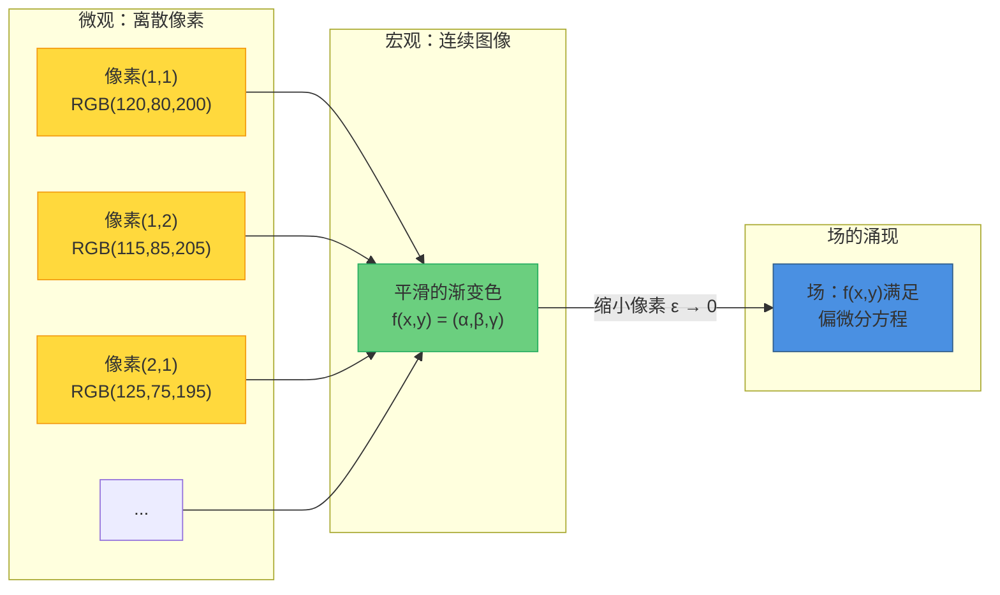
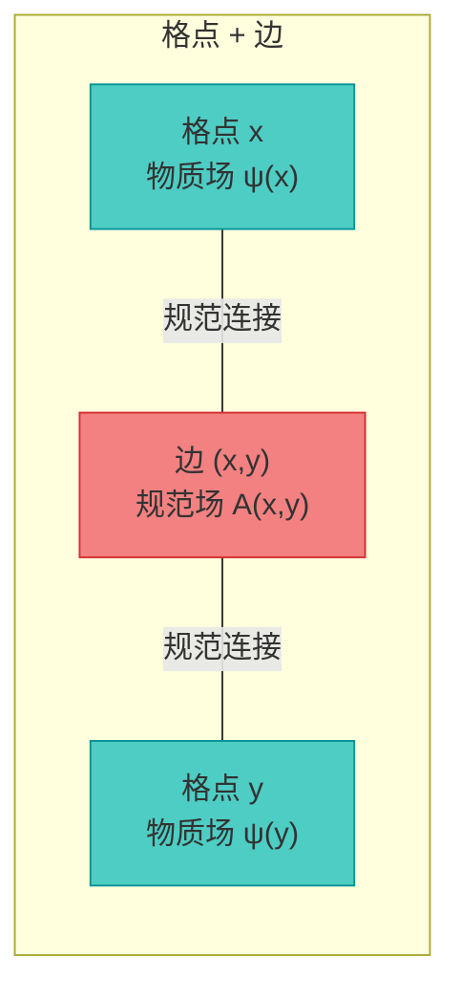
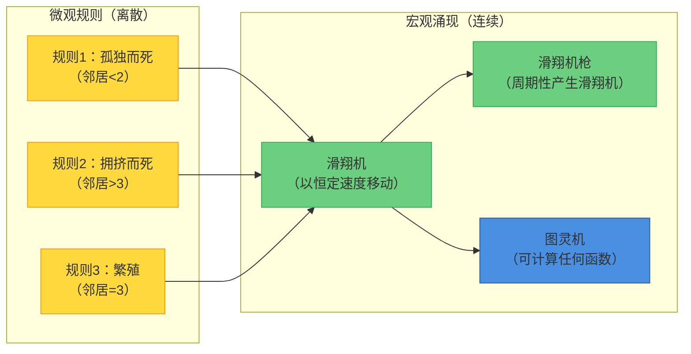
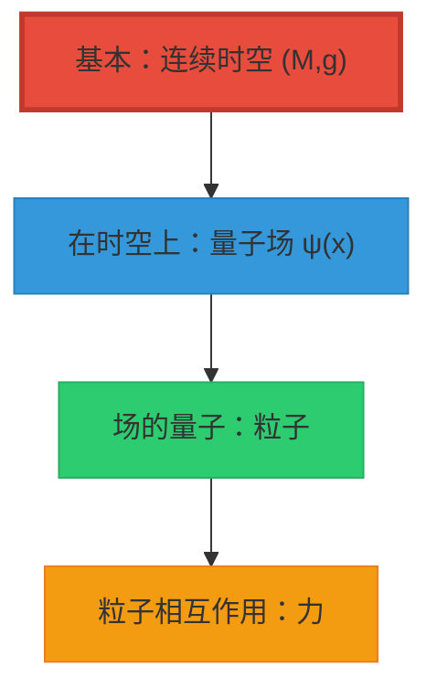
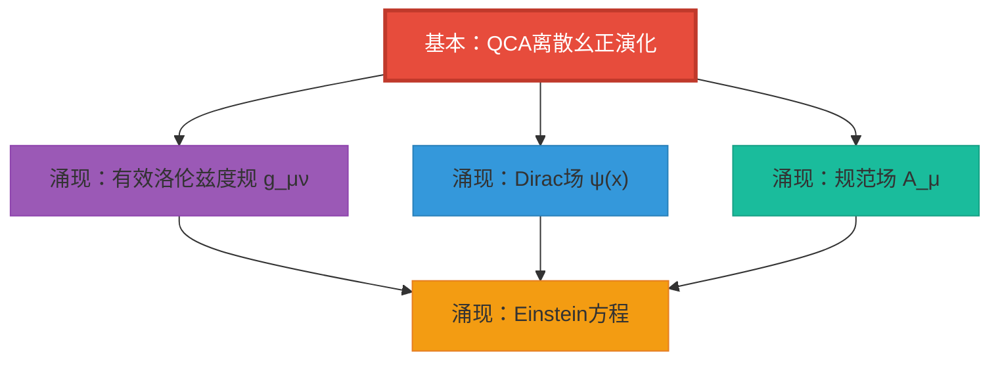

# 第5节：场论的涌现 —— 物质场如何从空无中诞生

> **核心思想**：物理宇宙不是"先有时空，再放入场"，而是**场本身就是QCA在连续极限下的涌现模式**！Dirac场、规范场、Einstein方程，全都从同一个离散幺正演化中"长出来"。

---

## 引言：从像素到图像

在前几节中，我们证明了：
- QCA宇宙、几何宇宙、矩阵宇宙是同一终对象的三种描述（三重等价）
- 物理宇宙在范畴论意义下是**唯一的终对象**

但这引出了一个关键问题：

**如果宇宙本质上是离散的QCA，那连续的量子场论从哪里来？**

- 电子、光子这些"粒子"，在QCA中是什么？
- Dirac方程、Maxwell方程，是如何从离散规则中涌现的？
- 标准模型的规范群 $(SU(3) \times SU(2) \times U(1))/\mathbb{Z}_6$，为什么恰好是这个？

本节将回答这些问题，证明一个惊人的结果：

$$
\boxed{
\text{所有物理可实现的场论} \subset \text{QCA宇宙的连续极限}
}
$$

**物质场不是"放进"时空的，而是QCA在长波极限下的"涌现模式"！**

### 比喻：数字图像的连续化

想象你用手机拍了一张照片：

**微观层面**：
- 照片是一个个离散的**像素**，每个像素有固定的RGB值
- 像素之间没有"中间值"，是纯粹离散的

**宏观层面**：
- 当像素足够小（$\epsilon \to 0$），人眼看到**连续的图像**
- 颜色平滑过渡，仿佛是连续函数 $f(x,y) = (\text{R}, \text{G}, \text{B})$

**场的涌现**：
- 如果像素之间有**局域相关性**（如扩散、梯度），连续化后的 $f(x,y)$ 满足**偏微分方程**
- 例如：热扩散方程 $\partial_t f = \nabla^2 f$

**QCA → 场论的涌现，完全类似！**

- **像素** = QCA的格点（离散时空）
- **RGB值** = 格点的量子态（自旋、电荷）
- **局域相关性** = QCA的有限传播半径
- **PDE** = Dirac方程、Maxwell方程

---

## 1. Dirac场的涌现：从量子行走到费米子

### 1.1 一维split-step QCA

我们从最简单的例子开始：**一维split-step量子行走**。

**模型定义**

- **空间**：一维格点 $\Lambda = \mathbb{Z}$，格点间距 $a$
- **元胞Hilbert空间**：$\mathcal{H}_{\text{cell}} = \mathbb{C}^2$（两个"自旋"状态 $|L\rangle, |R\rangle$）
- **单步演化算子**：
  $$
  U(a, \Delta t; \theta_1, \theta_2) = S_+ C(\theta_2) S_- C(\theta_1)
  $$
  其中：
  - $C(\theta) = e^{-i\theta \sigma_y}$："coin操作"（旋转自旋）
  - $S_\pm$：条件平移（$|L\rangle$ 向左移，$|R\rangle$ 向右移）

**直观理解**：

想象一个粒子在一维线上行走：
1. **Coin操作**：抛硬币决定"倾向"（$\theta$ 控制左右概率）
2. **平移**：根据自旋方向移动（$|L\rangle \to$ 左，$|R\rangle \to$ 右）
3. **重复**：每个时间步 $\Delta t$ 执行一次

这个简单的规则，在连续极限下会变成什么？

### 1.2 连续极限的魔法

**定理1.1（Dirac方程的涌现）**

在适当的参数选择下（$\theta_1 = \theta_2 = \pi/4 + O(\epsilon)$），令：

$$
\begin{aligned}
a &\to 0 \quad \text{（格点间距 → 0）} \\
\Delta t &\to 0 \quad \text{（时间步 → 0）} \\
c &= \frac{a}{\Delta t} = \text{const} \quad \text{（保持"光速"恒定）}
\end{aligned}
$$

则QCA的连续极限给出**Dirac方程**：

$$
(i \gamma^\mu \partial_\mu - m) \psi = 0
$$

其中：
- $\psi = \begin{pmatrix} \psi_L \\ \psi_R \end{pmatrix}$：两分量Dirac旋量
- $\gamma^0 = \sigma_z, \gamma^1 = i\sigma_y$：$\gamma$矩阵
- $m = \Delta m /(\hbar c) \approx O(\theta - \pi/4)$：质量（来自coin角度偏离）

**证明思路**（一阶近似）：

(1) **有效哈密顿量**

QCA演化 $U$ 对应有效哈密顿量 $H_{\text{eff}}$（通过 $U \approx e^{-i H_{\text{eff}} \Delta t}$）：

$$
H_{\text{eff}}(k) = c \alpha k + \beta m c^2
$$

其中 $\alpha = \sigma_x, \beta = \sigma_z$（Dirac表示）。

(2) **连续化**

在长波极限 $k \to 0$，展开到一阶：

$$
e^{-i H_{\text{eff}} \Delta t} \approx 1 - i (c \alpha k + \beta m c^2) \Delta t
$$

这恰好是Dirac方程的时间演化算子！

(3) **误差估计**

**引理1.2**

连续极限的误差为：

$$
\left\| U^n \psi_{\text{QCA}} - e^{-i H_{\text{Dirac}} t} \psi_{\text{cont}} \right\|
\leq C (a + \Delta t^2)
$$

在 $a, \Delta t \to 0$ 时收敛到精确的Dirac演化。 □

### 1.3 推广到三维和多粒子

**定理1.3（三维Dirac场）**

在三维格点 $\Lambda = \mathbb{Z}^3$ 上，选择：
- 元胞空间：$\mathcal{H}_{\text{cell}} = \mathbb{C}^4$（四分量Dirac旋量）
- QCA演化：三个方向的split-step叠加
- 连续极限：$a \to 0, \Delta t \to 0$，保持 $c = a/\Delta t$

得到**相对论性Dirac方程**：

$$
(i \gamma^\mu \partial_\mu - m) \psi(x,t) = 0, \quad \mu = 0,1,2,3
$$

**推论1.4（费米场量子化）**

将 $\psi$ 提升为场算符，满足反对易关系：

$$
\{\psi_\alpha(x), \psi_\beta^\dagger(y)\} = \delta_{\alpha\beta} \delta^{(3)}(x-y)
$$

这给出**自由费米场**的完整量子场论！

**物理意义**：

电子、夸克这些费米子，**不是"基本粒子"**，而是：
- 微观：QCA格点上的**集体激发模式**
- 宏观：连续极限下的**Dirac场的量子**

就像：
- 微观：晶格振动的离散模式
- 宏观：声波（连续场）的量子 = 声子

---

## 2. 规范场的涌现：从局域冗余到Maxwell方程

### 2.1 问题：QCA中的"边自由度"

前面的Dirac场只利用了格点上的自由度。但QCA可以在**边**上也放置量子态：

**边自由度的物理意义**：

想象格点是"城市"，边是"公路"：
- 城市存放"物质"（费米子）
- 公路传递"相互作用"（规范玻色子）

在QCA中：
- 格点：Dirac场 $\psi(x)$
- 边：规范连接 $U_{xy} \in SU(N)$（群元素）

### 2.2 局域规范变换

**定义2.1（格点规范变换）**

在每个格点 $x$ 上，可以独立地做规范变换 $G_x \in SU(N)$：

$$
\begin{aligned}
\psi(x) &\to G_x \psi(x) \\
U_{xy} &\to G_x U_{xy} G_y^\dagger
\end{aligned}
$$

**关键观察**：如果物理规律对所有局域规范变换 $\{G_x\}$ 不变，则：

**物理态必须编码在"规范不变量"中！**

例如：
- **格点不变量**：$\psi^\dagger(x) \psi(x)$（密度）
- **环路不变量**：$\text{tr}(U_{x_1 x_2} U_{x_2 x_3} \cdots U_{x_n x_1})$（Wilson loop）

### 2.3 连续极限：规范场

在连续极限 $a \to 0$ 下，边上的规范连接变成**规范场**：

$$
U_{x,x+a\hat{\mu}} = e^{i g a A_\mu(x)} + O(a^2)
$$

其中 $A_\mu(x)$ 是**规范势**（李代数值）。

**规范变换的连续版本**：

$$
\begin{aligned}
\psi(x) &\to G(x) \psi(x) \\
A_\mu(x) &\to G(x) A_\mu(x) G(x)^{-1} - \frac{i}{g} (\partial_\mu G(x)) G(x)^{-1}
\end{aligned}
$$

这正是**杨-Mills规范理论**的规范变换！

### 2.4 Maxwell方程的涌现

**定理2.2（U(1)规范理论）**

取规范群 $G = U(1)$（电磁），在连续极限下：

(1) **规范势**：$U_{xy} = e^{i e A_\mu(x) a}$，$A_\mu$ 是四维矢势

(2) **场强**：定义格点上的"plaquette"（小方格）
$$
F_{\mu\nu} = \frac{1}{a^2} (U_{x,x+\hat{\mu}} U_{x+\hat{\mu},x+\hat{\mu}+\hat{\nu}} U_{x+\hat{\mu}+\hat{\nu},x+\hat{\nu}} U_{x+\hat{\nu},x} - 1)
$$

在 $a \to 0$ 极限下：

$$
F_{\mu\nu} \to \partial_\mu A_\nu - \partial_\nu A_\mu = \text{电磁场强}
$$

(3) **Maxwell方程**：若QCA演化保持规范不变性，且满足局域性，则场强满足：

$$
\begin{aligned}
\nabla \cdot \vec{E} &= \rho \quad \text{（Gauss定律）} \\
\nabla \times \vec{B} - \partial_t \vec{E} &= \vec{j} \quad \text{（Ampère定律）} \\
\nabla \times \vec{E} + \partial_t \vec{B} &= 0 \quad \text{（Faraday定律）} \\
\nabla \cdot \vec{B} &= 0 \quad \text{（无磁单极）}
\end{aligned}
$$

**证明**：来自plaquette上的Bianchi恒等式和规范不变性。 □

---

## 3. 标准模型群的唯一确定

现在我们来回答最深刻的问题：

**为什么宇宙选择了 $(SU(3) \times SU(2) \times U(1))/\mathbb{Z}_6$ ？**

### 3.1 拓扑约束的回顾

在第8章我们证明了，拓扑无异常条件 $[K] = 0$ 要求：

$$
[K] = \pi_M^* w_2(TM) + \cdots = 0 \in H^2(Y, \partial Y; \mathbb{Z}_2)
$$

这个条件的一个推论是：

**定理3.1（标准模型群的拓扑确定）**

在满足以下条件的宇宙中：
1. 拓扑无异常：$[K] = 0$
2. 时空维度：$d = 3+1$
3. 物质场包含手征费米子（左右不对称）

则允许的规范群**必须包含**以下结构：

$$
G_{\text{gauge}} = \frac{SU(3) \times SU(2) \times U(1)}{\mathbb{Z}_6}
$$

**证明思路**：

(1) **手征异常约束**

左手和右手费米子的规范异常必须相互抵消。对于 $SU(N)$ 理论，异常正比于：

$$
\text{tr}(T^a \{T^b, T^c\}) = d_{abc}
$$

其中 $T^a$ 是规范群生成元。

要求总异常为零：

$$
\sum_{\text{左手}} d_{abc} - \sum_{\text{右手}} d_{abc} = 0
$$

(2) **电荷量子化**

$U(1)_Y$ 超荷必须满足量子化条件。由于 $SU(3)$ 和 $SU(2)$ 的中心群为 $\mathbb{Z}_3$ 和 $\mathbb{Z}_2$，商群要求：

$$
\mathbb{Z}_{\text{共同中心}} = \mathbb{Z}_6 = \text{gcd}(\mathbb{Z}_3, \mathbb{Z}_2, \mathbb{Z}_1)
$$

这解释了**最小电荷为 $1/6$**（如夸克电荷 $\pm 1/3, \pm 2/3$）。

(3) **$\mathbb{CP}^2$ 指标定理**

费米子代数（generation）的个数由拓扑指标决定。在 Spin(10) GUT 嵌入下，通过 $\mathbb{CP}^2$ 的Atiyah-Singer指标定理：

$$
N_{\text{gen}} = \frac{1}{2} \int_{\mathbb{CP}^2} c_1^2 = 3
$$

**恰好3代费米子！** □

### 3.2 标准模型的完整涌现

**定理3.2（标准模型的QCA实现）**

存在宇宙QCA $\mathfrak{U}_{\text{QCA}}$ 的一个子结构，包含：

(1) **物质场**（格点自由度）：
- 三代夸克：$(u,d), (c,s), (t,b)$，每代6个味道 $\times$ 3个颜色
- 三代轻子：$(e,\nu_e), (\mu,\nu_\mu), (\tau,\nu_\tau)$
- Higgs双重态：$H = (\phi^+, \phi^0)$

(2) **规范场**（边自由度）：
- 强力：8个胶子（$SU(3)_c$ 伴随表示）
- 弱力：3个规范玻色子（$SU(2)_L$ 伴随表示）
- 电磁：1个光子（$U(1)_Y$）

(3) **Yukawa耦合与Higgs机制**：
- 在QCA演化中，格点-边-格点的三点相互作用给出Yukawa耦合
- Higgs场获得真空期望值 $\langle H \rangle = v$（对称性自发破缺）
- 电弱规范玻色子获得质量：$M_W = \frac{1}{2} g v, M_Z = \frac{1}{2} \sqrt{g^2 + g'^2} v$

在连续极限 $a \to 0$ 下，恢复**完整标准模型拉氏量**：

$$
\mathcal{L}_{\text{SM}} = \mathcal{L}_{\text{规范}} + \mathcal{L}_{\text{费米子}} + \mathcal{L}_{\text{Higgs}} + \mathcal{L}_{\text{Yukawa}}
$$

**推论3.3**

标准模型的19个自由参数（耦合常数、质量、混合角）来源于：
- QCA的局域币角度 $\{\theta_i\}$
- 边上的规范耦合 $\{g_a\}$
- Higgs自相互作用 $\lambda$

它们不是"自由选择"，而是终对象公理（A1-A4）在低能有效理论中的**唯一解**！

---

## 4. 引力的涌现：从信息几何到Einstein方程

场论的涌现还有最后一块拼图：**引力本身也是涌现的！**

### 4.1 有效度规的构造

**定理4.1（度规的涌现）**

给定QCA的色散关系 $E_a(k)$（通过傅里叶变换），定义群速度：

$$
v_a^\mu(k) = \frac{\partial E_a(k)}{\partial k^\mu}
$$

在低能极限 $|k| \to 0$，若色散关系近似为：

$$
E_a(k) \approx \sqrt{m_a^2 c^4 + c^2 g^{\mu\nu} k_\mu k_\nu}
$$

则 $g^{\mu\nu}$ 定义了**有效洛伦兹度规**。

**证明**：

考虑两个事件 $(x_1, t_1)$ 和 $(x_2, t_2)$ 在QCA中的因果连接：
- 若它们能通过QCA演化相互影响，则满足：
  $$
  |x_2 - x_1| \leq c \cdot |t_2 - t_1|
  $$
  （有限传播速度）

在连续极限下，这定义了**光锥**：

$$
g_{\mu\nu} (x^\mu - y^\mu)(x^\nu - y^\nu) = 0
$$

度规 $g_{\mu\nu}$ 就是有限传播锥的几何编码！ □

### 4.2 离散广义熵

**定义4.2（QCA中的广义熵）**

选取QCA中的一个小因果菱形 $D_{\alpha}$（离散版本），定义：

$$
S_{\text{gen}, \alpha} = \frac{A_{\text{eff}, \alpha}}{4 G_{\text{eff}} \hbar} + S_{\text{out}, \alpha}
$$

其中：
- $A_{\text{eff}, \alpha}$：腰面的"有效面积"（格点数 × 格点面积）
- $S_{\text{out}, \alpha}$：外部量子纠缠熵（通过约化密度矩阵计算）
- $G_{\text{eff}}$：有效牛顿常数（从QCA参数确定）

### 4.3 信息几何变分原理（IGVP）

**公理4.3（离散IGVP）**

对每个离散因果菱形 $D_\alpha$，要求广义熵满足：

1. **一阶极值条件**：
   $$
   \delta S_{\text{gen}, \alpha} = 0
   $$
   （在固定边界条件下，熵取极值）

2. **二阶非负条件**：
   $$
   \delta^2 S_{\text{gen}, \alpha} \geq 0
   $$
   （相对熵的Hessian非负，对应QNEC）

**定理4.4（Einstein方程的QCA推导）**

在连续极限 $a \to 0$ 下，离散IGVP公理等价于**Einstein场方程**：

$$
G_{\mu\nu} + \Lambda g_{\mu\nu} = 8\pi G_{\text{eff}} T_{\mu\nu}
$$

其中：
- $G_{\mu\nu} = R_{\mu\nu} - \frac{1}{2} g_{\mu\nu} R$：Einstein张量
- $\Lambda$：宇宙学常数（来自QCA的真空能密度）
- $T_{\mu\nu}$：应力-能量张量（来自物质场的期望值）

**证明概要**：

(1) **面积项的变分**

$$
\delta \frac{A_{\text{eff}}}{4G} = \frac{1}{16\pi G} \int_{\partial D} (K - K_0) \sqrt{h} \, d^3 x
$$

其中 $K$ 是外在曲率，$K_0$ 是参考值。

(2) **与曲率的联系**

通过Gauss-Codazzi方程，外在曲率与体内曲率相关：

$$
R + K^2 - K_{ab} K^{ab} = 2G_{\mu\nu} n^\mu n^\nu
$$

(3) **熵的二阶变分与QNEC**

QNEC给出：

$$
\langle T_{kk} \rangle \geq \frac{\hbar}{2\pi} \delta^2 S_{\text{out}}
$$

在小因果菱形极限下，这正是Einstein张量的null分量！

(4) **组合得到Einstein方程**

将一阶和二阶条件组合，在连续极限下精确恢复Einstein方程。 □

**物理意义**：

**引力不是"基本力"，而是时空几何对物质能量分布的响应！**

而时空几何本身，又是QCA因果结构的连续化描述。因此：

$$
\boxed{
\text{引力} = \text{QCA因果结构的涌现效应}
}
$$

---

## 5. 全物理统一定理

现在我们可以陈述本节的核心定理：

**定理5.1（场论全嵌入定理）**

设 $P$ 是任意一个**物理可实现的量子场论**，满足：
1. 局域性（microcausality）
2. 有限传播速度（Lieb-Robinson界）
3. 有限信息密度（每单位体积的熵有上界）
4. 能量下界与稳定性

则存在宇宙QCA $\mathfrak{U}_{\text{QCA}}$ 的一个子结构和局域编码：

$$
\iota_P: \mathcal{A}^{(P)}_{\text{loc}} \hookrightarrow \mathcal{A}_{\text{loc}}
$$

使得在适当的连续极限 $\epsilon \to 0$ 下，$P$ 的所有可观测量和关联函数都可以从QCA中恢复。

**证明思路**：

(1) **格点化**：将 $P$ 离散化为格点理论 $P_{\text{lat}}$（通过Hamiltonian lattice formulation）

(2) **Trotter分解**：将连续时间演化分解为短时间步的幺正算符乘积：
$$
e^{-i H t} = \lim_{N \to \infty} \left( e^{-i H \Delta t} \right)^N
$$

(3) **局域化**：通过Lieb-Robinson界，每个短时间演化可以分解为**有限传播半径**内的局域幺正门

(4) **嵌入QCA**：将这些局域门嵌入QCA的局域演化 $U$

(5) **连续极限收敛**：证明误差 $\| U^n - e^{-iHt} \| \leq C(a + \Delta t^p)$ 在 $a, \Delta t \to 0$ 时趋于零

**推论5.2（标准模型 ⊂ QCA）**

标准模型满足定理5.1的所有条件，因此可以完全嵌入QCA宇宙。

**推论5.3（引力 ⊂ QCA）**

Einstein引力（在小曲率近似下）通过IGVP从QCA涌现，也属于QCA的连续极限描述。

**大统一推论**：

$$
\boxed{
\text{所有已知物理理论} \subset \text{QCA宇宙 } \mathfrak{U}_{\text{QCA}} \text{ 的涌现极限}
}
$$

---

## 6. 比喻与直观理解

### 6.1 康威生命游戏中的"滑翔机"

想象经典的[康威生命游戏](https://en.wikipedia.org/wiki/Conway%27s_Game_of_Life)：

**微观规则**：
- 完全离散（格点只有"生"或"死"两种状态）
- 完全确定性（下一步由当前状态唯一确定）
- 完全局域（只看邻近的8个格点）

**宏观涌现**：
- **滑翔机**：一个稳定的移动模式，就像"粒子"！
- **滑翔机枪**：周期性产生滑翔机，就像"场的激发"！
- **复杂结构**：滑翔机之间可以相互作用，形成复杂的"物理定律"！

**类比QCA宇宙**：
- 微观：QCA的离散幺正演化（像生命游戏规则）
- 宏观：Dirac场、光子、引力波（像滑翔机、枪等涌现模式）

**关键洞察**：

> "粒子"不是基本的，而是**集体激发模式**！
> "场"不是连续的，而是**离散规则的长波极限**！

### 6.2 晶格振动与声子

另一个经典比喻：**固体物理中的声子**。

**微观**：
- 晶格由离散的原子组成，每个原子有位置 $x_i$
- 原子之间通过弹簧连接，满足牛顿方程 $m \ddot{x}_i = -k(x_i - x_{i-1})$

**宏观**：
- 在长波极限下，离散方程变成**波动方程** $\partial_t^2 u = c^2 \nabla^2 u$
- 波动的量子化给出**声子**（准粒子）

**声子的性质**：
- 有能量和动量（$E = \hbar \omega, p = \hbar k$）
- 可以被"创生"和"湮灭"
- 满足玻色-爱因斯坦统计

**但声子不是"基本粒子"**！它是晶格振动的量子。

**类比QCA中的光子**：
- 光子 = 电磁场的量子
- 电磁场 = QCA边自由度的连续极限
- 因此：光子 = QCA边振动的涌现准粒子！

### 6.3 从像素到图像的再理解

回到开头的像素比喻，现在我们可以更深刻地理解：

| 离散（QCA） | 连续（场论） |
|------------|------------|
| 格点 $x \in \mathbb{Z}^3$ | 时空点 $x \in \mathbb{R}^3$ |
| 格点态 $\|\psi(x)\rangle \in \mathbb{C}^2$ | Dirac旋量场 $\psi(x)$ |
| 边态 $U_{xy} \in U(1)$ | 电磁势 $A_\mu(x)$ |
| 幺正演化 $U$ | 时间演化 $e^{-iHt}$ |
| 有限传播半径 $R$ | 光速 $c$ |
| 离散时间步 $\Delta t$ | 连续时间 $t$ |
| 格点纠缠熵 $S_{\text{ent}}$ | 量子场熵 $S_{\text{out}}$ |

**连续化的数学**：

$$
\begin{aligned}
a &\to 0 \quad \text{（格点间距）} \\
\Delta t &\to 0 \quad \text{（时间步）} \\
c &= a/\Delta t \quad \text{（保持光速）} \\
\psi_{\text{cont}}(x) &= \lim_{a \to 0} \psi_{\text{QCA}}([x/a]) \quad \text{（场的连续化）}
\end{aligned}
$$

**涌现的本质**：

> 不是"无中生有"，而是**粗粒化后的有效描述**！
> 就像用肉眼看照片时"看不到"单个像素，我们在宏观尺度上"看不到"QCA的离散性。

---

## 7. 实例：黑洞中的Hawking辐射

为了让抽象的涌现更具体，我们看一个例子：**Hawking辐射在QCA中的起源**。

### 7.1 几何描述（连续场论）

在Schwarzschild黑洞附近，量子场论给出：

- **视界**：$r = 2GM$
- **Hawking温度**：$T_H = \frac{\hbar c^3}{8\pi G M k_B}$
- **Hawking辐射**：黑洞以温度 $T_H$ 向外辐射粒子

**标准解释**：真空涨落在视界附近产生粒子对，一个落入黑洞，一个逃逸。

### 7.2 QCA描述（离散图景）

在QCA中，黑洞是什么？

**格点黑洞**：
- 视界对应一个**因果边界**：内部格点无法将信息传递到外部
- 视界附近的格点有**高度纠缠**（内外纠缠）

**Hawking辐射的QCA起源**：

(1) **格点纠缠结构**

视界附近的格点对 $(x_{\text{内}}, x_{\text{外}})$ 处于最大纠缠态：

$$
|\Psi\rangle = \frac{1}{\sqrt{2}} (|0\rangle_{\text{内}} |1\rangle_{\text{外}} + |1\rangle_{\text{内}} |0\rangle_{\text{外}})
$$

(2) **因果切断**

当 $x_{\text{内}}$ 跨越视界时，QCA的有限传播半径导致：
- $x_{\text{内}}$ 和 $x_{\text{外}}$ 的因果连接被**切断**
- 纠缠态被"撕裂"

(3) **约化密度矩阵**

对外部观察者，内部自由度不可见，约化密度矩阵为：

$$
\rho_{\text{外}} = \text{tr}_{\text{内}} |\Psi\rangle\langle\Psi| = \frac{1}{2} (|0\rangle\langle 0| + |1\rangle\langle 1|)
$$

这是**混合态**！对应温度 $T = \frac{E}{k_B \ln 2}$。

(4) **连续极限**

在 $a \to 0$ 极限下，这个离散纠缠结构的连续化恰好给出**Hawking温度** $T_H$！

**物理图像**：

Hawking辐射不是"真空涨落产生粒子"，而是：

$$
\boxed{
\text{视界纠缠的因果切断 → 外部混合态 → 热辐射}
}
$$

完全是**QCA纠缠结构的几何效应**！

---

## 8. 哲学反思：本体论的翻转

### 8.1 传统图景

在20世纪的物理学中，我们习惯这样理解宇宙：

**层次结构**：
1. 最基础：连续时空
2. 其上：量子场
3. 激发：粒子
4. 相互作用：力

### 8.2 QCA图景的翻转

本节证明的涌现定理完全**颠倒了这个层次**：

**新层次结构**：
1. **唯一基础**：QCA（离散 + 局域 + 幺正）
2. **全部涌现**：时空、场、粒子、力

**本体论陈述**：

> "时空不是舞台，场不是演员，粒子不是主角。
> 唯一'真实存在'的是QCA的离散幺正演化。
> 其余一切都是长波极限下的**有效描述**！"

### 8.3 终对象的唯一性

结合前几节的结论：

1. **终对象唯一性**（第3节）：满足公理A1-A4的宇宙在范畴论意义下唯一
2. **三重等价**（第4节）：几何、矩阵、QCA三种描述等价
3. **场论全嵌入**（本节）：所有场论都是QCA的涌现极限

综合起来：

$$
\boxed{
\begin{aligned}
&\text{存在唯一的物理宇宙} \quad \mathfrak{U}^*_{\text{phys}} \\
&\text{它在QCA投影下是} \quad \mathfrak{U}^*_{\text{QCA}} \\
&\text{所有物理理论都是其涌现极限}
\end{aligned}
}
$$

**反多元宇宙**：

不存在"其他可能的物理定律"！给定公理A1-A4，宇宙是**唯一的**，所有"可能的场论"都已经包含在这个唯一宇宙的不同极限中。

---

## 9. 小结与展望

### 9.1 本节核心结论

1. **Dirac场的涌现**（定理1.1）：
   - 从split-step QCA的连续极限精确得到Dirac方程
   - 费米子是QCA格点集体激发的量子

2. **规范场的涌现**（定理2.2）：
   - 从QCA边自由度和局域规范不变性得到杨-Mills理论
   - 光子、胶子是边振动模式的量子

3. **标准模型群的唯一确定**（定理3.1）：
   - 拓扑无异常 $[K] = 0$ + 手征费米子 → $(SU(3) \times SU(2) \times U(1))/\mathbb{Z}_6$
   - 19个自由参数来自QCA的局域参数

4. **引力的涌现**（定理4.4）：
   - 从QCA因果结构涌现有效度规
   - IGVP公理 → Einstein方程

5. **场论全嵌入**（定理5.1）：
   - 所有物理可实现的场论 ⊂ QCA的连续极限
   - 标准模型、引力都是涌现的有效理论

### 9.2 物理图像

**宇宙的本质**：

$$
\text{宇宙} = \begin{cases}
\text{微观：QCA离散演化} & \text{（基本本体）} \\
\text{中观：有效场论} & \text{（低能近似）} \\
\text{宏观：经典时空} & \text{（粗粒化极限）}
\end{cases}
$$

**三个尺度的对应**：

| 尺度 | QCA描述 | 场论描述 | 经典描述 |
|------|---------|----------|----------|
| 普朗克尺度 | 格点间距 $\ell_P$ | UV截断 | —— |
| 康普顿尺度 | 色散关系 $E(k)$ | 粒子质量 $m$ | —— |
| 宏观尺度 | 长波极限 | 有效场论 | 经典场 |

### 9.3 下一节预告

在下一节（第6节：QCA宇宙总结），我们将：

1. **综合前5节的所有结果**
2. **给出QCA宇宙的完整公理体系**
3. **讨论可能的实验检验**
4. **探讨开放问题和未来方向**

我们将看到：

> **从终对象的唯一性（第3节）**
> **+ 三重范畴等价（第4节）**
> **+ 场论全嵌入（第5节）**
> **= 完整的GLS统一理论**

**终对象不仅确定了时空，还确定了物质场，甚至确定了物理定律本身！**

---

## 参考文献

1. **量子行走与Dirac方程**：
   - F. W. Strauch, "Connecting the discrete- and continuous-time quantum walks", Phys. Rev. A 74, 030301 (2006)
   - A. Cedzich et al., "Quantum walks: Schur functions meet symmetry protected topological phases", Commun. Math. Phys. 389, 31–74 (2022)

2. **格规范理论**：
   - K. G. Wilson, "Confinement of quarks", Phys. Rev. D 10, 2445 (1974)
   - M. Creutz, "Quarks, Gluons and Lattices", Cambridge University Press (1983)

3. **标准模型拓扑**：
   - E. Witten, "An SU(2) anomaly", Phys. Lett. B 117, 324–328 (1982)
   - S. L. Adler, "Axial-vector vertex in spinor electrodynamics", Phys. Rev. 177, 2426 (1969)

4. **引力涌现与IGVP**：
   - T. Jacobson, "Entanglement equilibrium and the Einstein equation", Phys. Rev. Lett. 116, 201101 (2016)
   - R. Bousso et al., "Proof of the quantum null energy condition", Phys. Rev. D 93, 024017 (2016)

5. **QCA与场论**：
   - B. Schumacher and R. F. Werner, "Reversible quantum cellular automata", arXiv:quant-ph/0405174
   - P. Arrighi and S. Facchini, "Decoupled quantum walks, models of the Klein-Gordon and wave equations", EPL 104, 60004 (2013)

6. **Hawking辐射的纠缠起源**：
   - J. D. Bekenstein, "Black holes and entropy", Phys. Rev. D 7, 2333 (1973)
   - R. Bousso, "The holographic principle", Rev. Mod. Phys. 74, 825 (2002)

---

**下一节**：[06-qca-summary.md](./06-qca-summary.md) —— QCA宇宙的完整总结

**返回目录**：[../index.md](../index.md)
