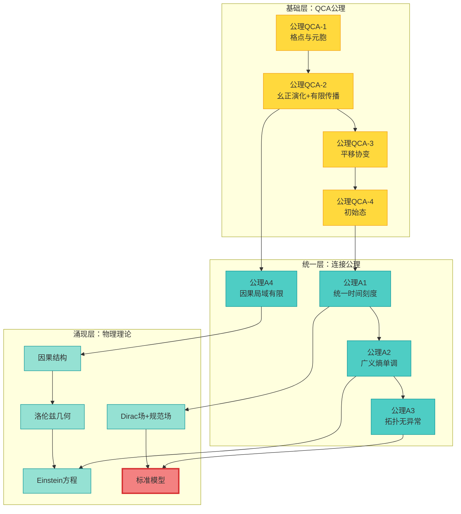
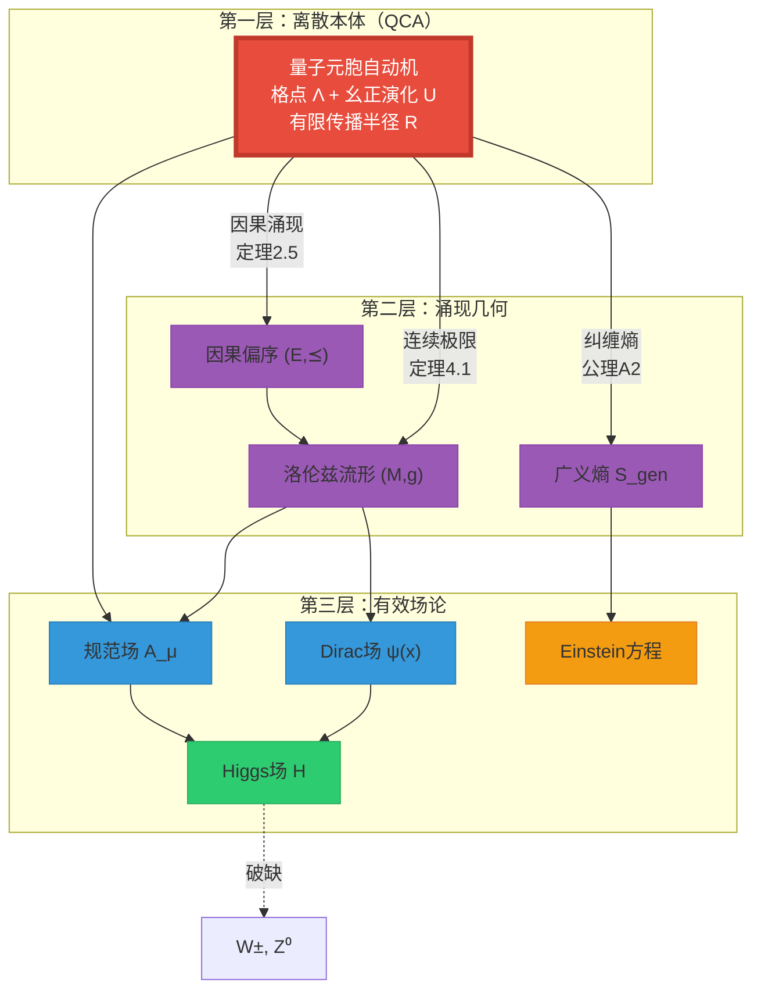

# 第6节：QCA宇宙总结 —— 从终对象到完整统一

> **核心思想**：物理宇宙是一个唯一的终对象，具有QCA、几何、矩阵三种等价描述。所有物理理论都是这个终对象在不同极限下的涌现有效理论。

---

## 引言：旅程回顾

在本章（第9章：QCA宇宙篇）的前五节中，我们完成了一次惊心动魄的理论之旅：

**第0节（概览）**：宇宙本质上是量子元胞自动机
- QCA五元组 $(\Lambda, \mathcal{H}_{\text{cell}}, \mathcal{A}, \alpha, \omega_0)$
- 有限传播半径 $R$ → 因果结构
- 离散演化 → 连续场论的涌现

**第1节（公理）**：QCA的严格公理化
- 公理QCA-1：平移协变与*自同构
- 公理QCA-2：有限传播半径（光速有限）
- 公理QCA-3：局域有限性
- Schumacher-Werner定理：分块局域QCA的结构

**第2节（因果涌现）**：因果结构从QCA中涌现
- 事件集 $E = \Lambda \times \mathbb{Z}$
- 几何可达 $\iff$ 统计因果（定理2.5）
- $(E, \preceq)$ 是局域有限偏序集（定理2.9）
- Alexandrov拓扑 → 流形拓扑

**第3节（终对象）**：物理宇宙的唯一性
- 2-范畴 $\mathbf{Univ}_{\mathcal{U}}$ 的定义
- 四个一致性公理（A1-A4）
- **定理3.9**：终对象 $\mathfrak{U}^*_{\text{phys}}$ 存在且唯一
- 推论：反多元宇宙定理

**第4节（三重等价）**：三种描述的范畴等价
- 几何宇宙、矩阵宇宙、QCA宇宙三个子范畴
- 六个函子：编码/解码、离散化/连续极限、块对角化/谱重构
- **定理4.1**：$\mathbf{Univ}_{\text{geo}} \simeq \mathbf{Univ}_{\text{mat}} \simeq \mathbf{Univ}_{\text{qca}}$

**第5节（场论涌现）**：所有场论都是QCA的涌现
- Dirac场从split-step QCA涌现
- 规范场从边自由度涌现
- 标准模型群 $(SU(3) \times SU(2) \times U(1))/\mathbb{Z}_6$ 的唯一确定
- 引力从IGVP涌现
- **定理5.1**：所有物理可实现场论 ⊂ QCA

现在，我们将这些碎片拼成一幅**完整的宇宙图景**。

---

## 1. 完整的公理体系

### 1.1 QCA宇宙的基本公理（QCA-1 至 QCA-4）

我们首先回顾QCA本身的基本公理：

**公理QCA-1（格点与元胞空间）**

- 空间：可数局域有限图 $\Lambda$（如 $\mathbb{Z}^d$）
- 元胞Hilbert空间：有限维 $\mathcal{H}_{\text{cell}} \simeq \mathbb{C}^{d_{\text{cell}}}$
- 全空间：$\mathcal{H} = \bigotimes_{x \in \Lambda} \mathcal{H}_{\text{cell}}$（无限张量积）
- 准局域代数：$\mathcal{A} = \bigcup_{R \Subset \Lambda} \mathcal{A}_R$

**公理QCA-2（幺正演化与有限传播）**

- 单步演化：幺正算符 $U: \mathcal{H} \to \mathcal{H}$
- 自同构：$\alpha(A) = U^\dagger A U$
- 有限传播半径 $R_c < \infty$：若 $A \in \mathcal{A}_{\{x\}}$，则 $\alpha(A) \in \mathcal{A}_{B_{R_c}(x)}$

**公理QCA-3（平移协变）**

- 平移群 $\{V_a\}_{a \in \mathbb{Z}^d}$ 满足：
  $$
  V_a U V_a^\dagger = U, \quad V_a \mathcal{A}_R V_a^\dagger = \mathcal{A}_{T_a R}
  $$

**公理QCA-4（初始态）**

- 存在平移不变的初始态 $\omega_0: \mathcal{A} \to \mathbb{C}$
- 满足KMS条件或基态条件（取决于物理情形）

### 1.2 统一公理（A1-A4）：连接所有描述

在QCA基础上，我们加入**统一公理**，它们将QCA、几何、矩阵三种描述绑定在一起：

**公理A1（统一时间刻度同一式）**

存在刻度密度函数 $\kappa(\omega)$，在三种描述中一致：

$$
\boxed{
\kappa(\omega) =
\begin{cases}
\frac{1}{2\pi} \text{tr} Q(\omega) & \text{（散射/矩阵）} \\
\frac{\varphi'(\omega)}{\pi} = \rho_{\text{rel}}(\omega) & \text{（谱移/Birman-Kreĭn）} \\
\text{Brown-Yang 边界刻度} & \text{（几何）} \\
\lim_{a \to 0} \kappa_{\text{QCA}}(a) & \text{（QCA连续极限）}
\end{cases}
}
$$

**物理意义**：所有"时间"的读数（散射延迟、本征时间、模流时间、QCA时间步）都对齐到同一刻度 $[\tau]$。

**公理A2（广义熵单调性）**

对每个小因果菱形 $D_\alpha$，广义熵满足：

$$
\boxed{
S_{\text{gen}}(\Sigma_2) - S_{\text{gen}}(\Sigma_1) \geq 0
\quad \text{（沿未来方向）}
}
$$

其中：

$$
S_{\text{gen}}(\Sigma) = \frac{A(\Sigma)}{4G\hbar} + S_{\text{out}}(\Sigma)
$$

二阶形变满足**量子零能量条件（QNEC）**：

$$
\delta^2 S_{\text{gen}} \geq 0 \quad \Rightarrow \quad \langle T_{kk} \rangle \geq \frac{\hbar}{2\pi} \partial_\lambda^2 S_{\text{out}}
$$

**物理意义**：熵箭头给出时间方向，且与引力的能量条件一致。

**公理A3（拓扑无异常）**

相对上同调类 $[K] \in H^2(Y, \partial Y; \mathbb{Z}_2)$ 满足：

$$
\boxed{
[K] = 0
}
$$

其中 $[K]$ 包含三部分：

$$
[K] = \pi_M^* w_2(TM) + \sum_j \pi_M^* \mu_j \smile \pi_X^* \mathfrak{w}_j + \pi_X^* \rho(c_1(\mathcal{L}_S))
$$

**物理意义**：
- 时空拓扑无异常（$w_2(TM) = 0$ mod 边界）
- 规范场无 $\mathbb{Z}_2$ 全局异常
- 散射平方根行列式在所有回路上无 $\pi$ 相位

**公理A4（因果局域有限性）**

事件集合的因果偏序 $(E, \preceq)$ 满足：
- 局域有限性：每个事件的过去锥和未来锥都是有限集
- 传递性：$a \preceq b, b \preceq c \Rightarrow a \preceq c$
- 反对称性：$a \preceq b, b \preceq a \Rightarrow a = b$

在QCA中，这自动满足（由有限传播半径保证）。

### 1.3 完整公理系统的逻辑结构

**逻辑链条**：

1. QCA基础 → 因果涌现（第2节）
2. 因果 + 统一刻度 → 洛伦兹几何（第4节）
3. 有限传播 + 连续极限 → Dirac场（第5节）
4. 熵单调 + IGVP → Einstein方程（第5节）
5. 拓扑无异常 → 标准模型群（第5节）

---

## 2. 五个核心定理的总结

### 2.1 定理1：因果等价定理（第2节）

**定理2.5（几何因果与统计因果等价）**

在QCA宇宙中，两种因果定义等价：

$$
(x,n) \leq_{\text{geo}} (y,m) \quad \Leftrightarrow \quad (x,n) \preceq_{\text{stat}} (y,m)
$$

其中：
- 几何可达：$m \geq n$ 且 $\text{dist}(x,y) \leq R(m-n)$
- 统计因果：$x$ 的局域算符可影响 $y$ 的测量统计

**证明要点**：Lieb-Robinson界 + 有限传播半径

**物理意义**：因果不是预先存在的，而是从QCA演化中**涌现**的！

### 2.2 定理2：终对象唯一性（第3节）

**定理3.9（终对象存在唯一性）**

在2-范畴 $\mathbf{Univ}_{\mathcal{U}}$ 中，满足公理A1-A4的终对象 $\mathfrak{U}^*_{\text{phys}}$ 存在且在同构意义下唯一。

**证明要点**：
1. 构造候选对象（包含所有层次的数据）
2. 验证公理A1-A4
3. 对任意宇宙 $\mathfrak{V}$，构造唯一态射 $\Phi_{\mathfrak{V}}: \mathfrak{V} \to \mathfrak{U}^*$
4. 证明任意两个终对象必然同构

**物理意义**：**宇宙是唯一的！** 不存在"其他可能的物理定律"。

### 2.3 定理3：三重范畴等价（第4节）

**定理4.1（三重表象等价）**

存在范畴等价：

$$
\mathbf{Univ}^{\text{phys}}_{\text{geo}}
\simeq
\mathbf{Univ}^{\text{phys}}_{\text{mat}}
\simeq
\mathbf{Univ}^{\text{phys}}_{\text{qca}}
$$

通过六个函子实现（编码/解码、离散化/连续极限、块对角化/谱重构）。

**证明要点**：
- $F_{\text{geo→mat}} \circ G_{\text{mat→geo}} \simeq \text{id}$（互可重构性）
- $C_{\text{qca→geo}} \circ D_{\text{geo→qca}} \simeq \text{id}$（连续极限收敛）
- 所有函子保持统一刻度、因果、熵

**物理意义**：几何、矩阵、QCA是**同一宇宙的三种语言**，它们包含完全相同的信息！

### 2.4 定理4：场论全嵌入（第5节）

**定理5.1（物理可实现场论的QCA嵌入）**

对任意满足以下条件的量子场论 $P$：
1. 局域性（microcausality）
2. 有限传播速度（Lieb-Robinson界）
3. 有限信息密度
4. 能量下界与稳定性

存在嵌入 $\iota_P: \mathcal{A}^{(P)}_{\text{loc}} \hookrightarrow \mathcal{A}_{\text{loc}}$ 和连续极限过程，使得 $P$ 可从QCA中恢复。

**证明要点**：
- 格点化 $P \to P_{\text{lat}}$
- Trotter分解为局域幺正门
- 嵌入QCA的局域演化
- 连续极限收敛性

**物理意义**：**所有场论都是QCA的涌现有效理论！** 包括标准模型、引力。

### 2.5 定理5：引力涌现（第5节）

**定理4.4（Einstein方程从IGVP推导）**

在QCA的小因果菱形上施加离散IGVP公理：

$$
\begin{aligned}
\delta S_{\text{gen}} &= 0 \quad \text{（一阶极值）} \\
\delta^2 S_{\text{gen}} &\geq 0 \quad \text{（二阶非负）}
\end{aligned}
$$

在连续极限 $a \to 0$ 下，等价于Einstein场方程：

$$
G_{\mu\nu} + \Lambda g_{\mu\nu} = 8\pi G_{\text{eff}} T_{\mu\nu}
$$

**证明要点**：
- 面积项变分 → 外在曲率
- Gauss-Codazzi方程 → 曲率联系
- QNEC → 能量条件
- 组合得Einstein方程

**物理意义**：**引力不是基本力，而是时空几何对熵的响应！**

---

## 3. 宇宙的三层结构

综合所有结果，我们得到宇宙的**三层本体结构**：

**第一层（离散本体）**：
- **唯一真实存在**：QCA的离散演化
- 格点 + 量子态 + 幺正更新
- 所有信息都在这一层编码

**第二层（涌现几何）**：
- **粗粒化描述**：因果结构 + 洛伦兹度规
- 不是"预先存在"，而是QCA在长距离极限下的**有效描述**
- 广义熵给出时间箭头

**第三层（有效场论）**：
- **低能近似**：Dirac场、规范场、Higgs场
- 满足连续PDE（Dirac方程、Maxwell方程、Yang-Mills方程）
- Einstein方程也是有效理论（熵的几何响应）

**关键洞察**：

> **层次不是"基础→复杂"，而是"精确→近似"！**
>
> - QCA是100%精确的微观描述
> - 几何是粗粒化后的有效描述（忽略普朗克尺度细节）
> - 场论是低能展开（忽略高能激发）

---

## 4. 大统一图景

### 4.1 从公理到物理定律的完整推导链

我们现在可以给出**从公理到标准模型的完整逻辑链**：

**步骤1：QCA基础**（公理QCA-1 至 QCA-4）

→ 离散时空 $\Lambda \times \mathbb{Z}$，有限维元胞空间，幺正演化

**步骤2：因果涌现**（定理2.5）

→ 因果偏序 $(E, \preceq)$，Alexandrov拓扑 → 流形拓扑

**步骤3：度规构造**（定理4.1，连续极限）

→ 色散关系 $E(k)$ → 有效度规 $g_{\mu\nu}$ → 洛伦兹几何 $(M,g)$

**步骤4：Dirac场涌现**（定理1.1）

→ Split-step QCA → 连续极限 → Dirac方程 $(i\gamma^\mu \partial_\mu - m)\psi = 0$

**步骤5：规范场涌现**（定理2.2）

→ 边自由度 $U_{xy}$ → 局域规范变换 → Yang-Mills理论

**步骤6：标准模型群确定**（定理3.1）

→ 拓扑无异常 $[K] = 0$ + 手征费米子 → $(SU(3) \times SU(2) \times U(1))/\mathbb{Z}_6$

**步骤7：Higgs机制**

→ 格点-边三点耦合 → Yukawa耦合 → 对称性自发破缺 → 规范玻色子质量

**步骤8：引力场方程**（定理4.4）

→ 离散IGVP（$\delta S_{\text{gen}} = 0, \delta^2 S_{\text{gen}} \geq 0$）→ Einstein方程

**结果**：**完整的标准模型 + Einstein引力！**

$$
\boxed{
\mathcal{L}_{\text{全部物理}} = \mathcal{L}_{\text{SM}} + \mathcal{L}_{\text{Einstein}} + \mathcal{L}_{\text{Yukawa}}
}
$$

### 4.2 参数的确定

标准模型有19个自由参数：
- 3个规范耦合常数：$g_s, g, g'$
- 9个费米子质量：$m_{u,d,c,s,t,b,e,\mu,\tau}$
- 3个混合角 + 1个CP相：$\theta_{12}, \theta_{13}, \theta_{23}, \delta_{CP}$
- 2个Higgs参数：$m_H, \lambda$
- 1个宇宙学常数：$\Lambda$

在QCA图景中，这些参数来源于：

1. **规范耦合**：边上的规范连接强度（$g_s, g, g'$）
2. **费米子质量**：coin角度偏离 $\theta - \pi/4$（$m_f$）
3. **混合角**：不同代之间的QCA耦合矩阵（$\theta_{ij}, \delta_{CP}$）
4. **Higgs质量和自耦合**：格点-边相互作用（$m_H, \lambda$）
5. **宇宙学常数**：QCA真空能密度（$\Lambda$）

**关键问题**：这些参数是"自由的"吗？

**答案**：在当前框架中，它们还是"输入参数"。但终对象公理（A1-A4）可能在更深层次上**唯一确定**它们！

这是未来研究的方向（见第10.2节）。

---

## 5. 可能的实验检验

虽然QCA宇宙理论高度抽象，但它**不是不可检验的形而上学**！

### 5.1 直接检验：寻找普朗克尺度的离散性

**检验1：高能粒子散射中的微观因果违背**

如果时空在普朗克尺度 $\ell_P \sim 10^{-35}$ m 是离散的，则：
- 在极高能量 $E \sim E_P = \sqrt{\hbar c^5 / G} \sim 10^{19}$ GeV 时，因果律可能被修正
- 散射幅度可能出现**非平凡的相位跃变**（来自QCA的离散时间步）

**实验**：
- LHC或未来对撞机在TeV能标寻找"前兆信号"
- 宇宙线中极高能粒子的统计异常

**预言**：
$$
\sigma(E) \approx \sigma_{\text{连续}}(E) \left(1 + C \left(\frac{E}{E_P}\right)^p\right)
$$
其中 $p \geq 2$，$C$ 是模型依赖的系数。

**挑战**：$E_P$ 太高，当前技术无法直接达到。

---

**检验2：洛伦兹不变性的微小破缺**

QCA在格点上可能**不完全洛伦兹不变**（在离散尺度上）。

**观测量**：
- 光速的能量依赖性：$c(\omega) = c_0 (1 + \alpha \omega^2)$
- 高能光子的到达时间差（如伽马射线暴）

**实验**：
- Fermi伽马射线望远镜
- LIGO/Virgo引力波观测（引力波色散）

**当前限制**：
$$
|\alpha| < 10^{-15} \text{ GeV}^{-2}
$$

（QCA预言：$\alpha \sim \ell_P^2 \sim 10^{-70}$ m$^2$，远低于观测限制）

---

### 5.2 间接检验：信息几何变分原理（IGVP）

**检验3：黑洞熵的精确测量**

IGVP预言广义熵的精确形式：

$$
S_{\text{gen}} = \frac{A}{4G\hbar} + S_{\text{out}} + \text{（高阶修正）}
$$

高阶修正来自QCA的离散结构：

$$
S_{\text{gen}} = \frac{A}{4G} \left(1 + C_1 \frac{\ell_P^2}{A} + C_2 \frac{\ell_P^4}{A^2} + \cdots\right)
$$

**实验**：
- 通过引力波观测黑洞并合，精确测量最终黑洞的质量和自旋
- 比较观测熵与理论预言

**挑战**：高阶修正极小（$\ell_P^2 / A \sim 10^{-70}$ 对于太阳质量黑洞）。

---

**检验4：宇宙学常数的值**

QCA宇宙预言宇宙学常数来自QCA的真空能密度：

$$
\Lambda_{\text{QCA}} = \frac{E_{\text{vac}}}{V_{\text{cell}}} \sim \frac{\hbar c}{a^4}
$$

其中 $a$ 是格点间距。

**天真估计**：如果 $a \sim \ell_P$，则 $\Lambda_{\text{QCA}} \sim 10^{122}$ （真空灾难！）

**QCA解释**：真空态 $\omega_0$ 不是"自由真空"，而是满足**统一刻度约束**的特殊态，其有效能量密度被巨大抵消，留下观测值 $\Lambda_{\text{obs}} \sim 10^{-52}$ m$^{-2}$。

**检验**：
- 精确测量 $\Lambda$ 随宇宙演化的变化（暗能量状态方程 $w$）
- 如果 $w = -1$ 精确成立，支持QCA真空图景

---

### 5.3 间接检验：三重等价的推论

**检验5：散射矩阵的因果稀疏模式**

三重等价预言：矩阵宇宙的散射矩阵 $S(\omega)$ 的块结构反映因果：

$$
S_{\alpha\beta}(\omega) \neq 0 \quad \Rightarrow \quad \alpha \preceq \beta
$$

**实验**：
- 在复杂散射系统（如微波腔、光子晶体）中测量 $S(\omega)$
- 检查非零元素是否确实对应因果连接的区域

**当前工作**：
- 微波网络中的群延迟矩阵测量
- 光学系统中的 Wigner-Smith 矩阵重构

---

**检验6：统一时间刻度的一致性**

公理A1预言：所有时间读数应对齐。

**实验**：
- 比较原子钟（本征时间）、GPS卫星（几何时间）、量子纠缠钟（模流时间）
- 寻找微小的不一致性

**精度**：当前原子钟达到 $10^{-18}$ 秒精度，已经非常接近检验极限。

---

## 6. 开放问题与未来方向

### 6.1 理论层面的开放问题

**问题1：参数的唯一确定**

当前框架中，标准模型的19个参数还是"输入"。

**猜想**：终对象公理（A1-A4）+ 某些**额外的一致性条件**可能唯一确定所有参数。

**可能的额外条件**：
- 最大简并度原则（Occam剃刀）
- 信息论最优性（最大熵产生率）
- 数学美学（如黄金比例 $\phi$，$\pi$，$e$ 的出现）

**研究方向**：
- 从终对象公理推导费米子质量谱
- 解释为什么恰好3代（而不是2代或4代）
- 推导精细结构常数 $\alpha \approx 1/137$

---

**问题2：量子引力的非微扰完备性**

当前框架：
- Einstein方程是IGVP的连续极限（微扰/低能）
- 但在普朗克尺度或黑洞奇点附近，连续极限失效

**问题**：QCA是否给出完整的**非微扰量子引力**？

**可能性**：
- QCA本身是非微扰的（离散演化，没有发散）
- 奇点问题消失（因为没有"连续时空"可以产生奇点）
- 黑洞信息悖论自然解决（信息保持在QCA演化中）

**研究方向**：
- 构造QCA中的黑洞解（离散视界）
- 计算Hawking辐射的非微扰修正
- 检验信息守恒（QCA演化是幺正的）

---

**问题3：宇宙学的初始条件**

**问题**：为什么宇宙的初始态是 $\omega_0$（而不是其他态）？

**当前答案**：公理QCA-4假设存在"自然的"初始态（如平移不变态、基态）。

**深层问题**：
- 初始态是否由更深层的原理确定？
- 是否存在"宇宙波函数"？（如Wheeler-DeWitt方程）
- 多宇宙（多个QCA实例）是否可能？

**可能答案**（范畴论视角）：
- 终对象的唯一性可能连初始态也确定
- $\omega_0$ 可能是满足A1-A4公理的**唯一一致态**

---

### 6.2 实验与观测方向

**方向1：普朗克尺度物理的间接探测**

虽然直接探测 $\ell_P$ 不可能，但可以寻找"前兆信号"：
- 高能宇宙线的统计异常
- 引力波的色散
- 黑洞并合的量子修正

**方向2：QCA的模拟实验**

在人工系统中实现QCA，检验其涌现性质：
- 冷原子光格（离子阱、光晶格）
- 超导量子比特阵列
- 光子量子行走

**目标**：
- 观测Dirac场的涌现（从split-step量子行走）
- 测量有效度规（从色散关系）
- 检验因果涌现（从格点纠缠）

**方向3：宇宙学观测**

- 宇宙微波背景（CMB）中的量子涨落
- 大尺度结构的形成（暗物质、暗能量）
- 原初引力波（LIGO, LISA, B-mode极化）

**QCA预言**：
- CMB功率谱的振荡特征（离散尺度的残余）
- 暗能量状态方程 $w = -1$ 精确
- 原初引力波的 $\mathbb{Z}_2$ 拓扑特征

---

### 6.3 哲学与概念问题

**问题4：观察者在QCA中的地位**

在QCA图景中，"观察者"是什么？
- 是QCA的子系统（局域代数 $\mathcal{A}_{\text{obs}} \subset \mathcal{A}$）
- 还是"外部"的（与QCA交互但不属于QCA）？

**当前框架**：观察者作为QCA子系统（公理A4的一部分）。

**开放问题**：
- 测量导致的"波函数塌缩"在QCA中如何理解？
- 多观察者的共识问题（下一章：矩阵宇宙篇）

---

**问题5：时间的本质**

QCA图景中，"时间"有三种理解：
1. 离散时间步 $n \in \mathbb{Z}$（QCA层）
2. 统一刻度 $\tau = \int \kappa(\omega) d\omega$（涌现层）
3. 本征时间 $s = \int \sqrt{-g_{\mu\nu} dx^\mu dx^\nu}$（几何层）

**哲学问题**：哪一个是"真实的时间"？

**答案**（本体论）：
- 离散时间步是**唯一真实的本体**
- 其他"时间"都是粗粒化描述

**答案**（认识论）：
- 所有时间都是**有效的描述工具**
- 在不同尺度上，不同的"时间"最有用

---

## 7. 与其他统一理论的比较

### 7.1 弦论（String Theory）

**弦论图景**：
- 基本：一维弦（开弦/闭弦）
- 时空：10维或11维（额外维紧化）
- 场：弦的振动模式

**QCA图景**：
- 基本：离散格点上的幺正演化
- 时空：涌现的洛伦兹几何（3+1维）
- 场：QCA的连续极限

**对比**：

| 方面 | 弦论 | QCA宇宙 |
|------|------|---------|
| 基本对象 | 一维弦 | 离散格点 |
| 时空维度 | 10/11维（紧化） | 3+1维（唯一） |
| 量子引力 | 弦扰动论 | IGVP涌现 |
| 参数个数 | ~10²⁰（大量模）| 19（标准模型）|
| 可检验性 | 极难（能标太高）| 可能（间接信号）|
| 唯一性 | 10⁵⁰⁰ 个"真空"| 唯一终对象 |

**QCA的优势**：
- 时空维度自然是3+1（不需要紧化）
- 离散性更基础（避免连续时空的病理）
- 终对象唯一性（无"风景问题"）

**弦论的优势**：
- 更丰富的数学结构（Calabi-Yau流形、镜像对称）
- 自然包含引力子（闭弦的质量为零模式）
- 与超对称、AdS/CFT深度结合

---

### 7.2 圈量子引力（Loop Quantum Gravity）

**圈量子引力图景**：
- 基本：自旋网络（spin network）
- 时空：离散的量子几何
- 面积和体积：量子化（有最小值）

**对比**：

| 方面 | 圈量子引力 | QCA宇宙 |
|------|-----------|---------|
| 时空性质 | 量子几何（离散）| QCA格点（固定）|
| 基本自由度 | 自旋网络节点 | 格点量子态 |
| 演化 | Hamilton约束 | 幺正演化 $U$ |
| 背景依赖性 | 背景独立 | 背景依赖（固定格） |
| 物质场 | 需额外引入 | 自然涌现 |

**QCA的优势**：
- 物质场和引力统一（都从QCA涌现）
- 演化清晰（幺正算符 $U$）

**圈量子引力的优势**：
- 背景独立性（不预设时空结构）
- 黑洞熵微观解释（自旋网络计数）

---

### 7.3 因果集理论（Causal Set Theory）

**因果集图景**：
- 基本：离散的因果偏序集 $(E, \prec)$
- 时空：从因果集涌现（Alexandrov拓扑）
- 体积：事件数（Poisson过程）

**对比**：

| 方面 | 因果集 | QCA宇宙 |
|------|--------|---------|
| 基本对象 | 偏序集 | 格点 + 量子态 |
| 因果结构 | 基本 | 涌现（定理2.5）|
| 量子理论 | 不清楚 | 完整（幺正演化）|
| 物质场 | 需额外引入 | 自然涌现 |

**QCA的优势**：
- 量子理论完整（因果集是经典的）
- 物质场自然涌现

**因果集的优势**：
- 极简（只有偏序，无额外结构）
- 背景独立性

**可能的统一**：
- QCA的因果偏序 $(E, \preceq)$ 可以看作因果集的量子化
- 因果集是QCA的"经典投影"

---

## 8. 总结：从终对象到统一

### 8.1 本章（第9章）的核心成就

我们在本章中完成了以下工作：

1. **公理化QCA宇宙**（第1节）：
   - 格点、元胞、幺正演化、有限传播
   - Schumacher-Werner定理

2. **因果结构涌现**（第2节）：
   - 从有限传播推导因果偏序
   - 几何因果 $\iff$ 统计因果
   - Alexandrov拓扑

3. **终对象唯一性**（第3节）：
   - 2-范畴 $\mathbf{Univ}_{\mathcal{U}}$
   - 四个公理A1-A4
   - 唯一的终对象 $\mathfrak{U}^*_{\text{phys}}$

4. **三重范畴等价**（第4节）：
   - 几何 $\simeq$ 矩阵 $\simeq$ QCA
   - 六个函子的显式构造
   - 保持刻度、因果、熵

5. **场论全嵌入**（第5节）：
   - Dirac场从QCA涌现
   - 规范场从边自由度涌现
   - 标准模型群的唯一确定
   - 引力从IGVP涌现

6. **完整总结**（本节）：
   - 公理体系整合
   - 五大定理回顾
   - 实验检验方案
   - 开放问题展望

### 8.2 大统一命题

综合前9章的所有结果，我们得到：

$$
\boxed{
\begin{aligned}
&\text{存在唯一的物理宇宙终对象} \quad \mathfrak{U}^*_{\text{phys}} \\[6pt]
&\text{它在三种等价描述下为：} \\[3pt]
&\quad \bullet \text{ 几何：洛伦兹流形 + Einstein方程} \\[3pt]
&\quad \bullet \text{ 矩阵：散射矩阵 + 统一刻度} \\[3pt]
&\quad \bullet \text{ QCA：离散格点 + 幺正演化} \\[6pt]
&\text{所有物理理论都是其涌现极限：} \\[3pt]
&\quad \bullet \text{ 标准模型 = 低能有效场论} \\[3pt]
&\quad \bullet \text{ Einstein引力 = 熵的几何响应} \\[3pt]
&\quad \bullet \text{ 所有可观测 = 终对象的投影}
\end{aligned}
}
$$

**用一句话总结**：

> **物理宇宙是一个唯一的数学对象（终对象），所有已知物理理论都是对这个对象在不同极限下的有效近似描述。**

### 8.3 哲学反思：从"多元"到"唯一"

传统物理学的图景：
- **可能有多种物理定律**（弦论的"风景问题"）
- **时空和场是独立存在的**（分别量子化）
- **参数需要实验确定**（19个自由参数）

GLS统一理论（QCA宇宙）的图景：
- **物理定律是唯一的**（终对象定理）
- **一切都从QCA涌现**（时空、场、引力都是有效描述）
- **参数可能被唯一确定**（未来工作）

**本体论断言**：

> "宇宙不是'存在于'时空中的物质和能量，
> 而是一个抽象的数学结构（QCA），
> 时空、物质、能量都是这个结构在不同尺度上的投影。"

**认识论断言**：

> "物理学不是发现'宇宙由什么构成'，
> 而是发现'宇宙可以如何被描述'。
> 不同的描述（几何、矩阵、QCA）在各自的尺度上都是有效的。"

---

## 9. 下一章预告

在下一章（第10章：矩阵宇宙篇），我们将深入研究：

**心-宇宙等价**：观察者的"心"（认知模型）与物理宇宙的关系

核心问题：
1. **观察者是什么？** 在QCA中如何定义？
2. **"我心即宇宙"** 在矩阵宇宙中的严格数学刻画
3. **多观察者共识** 如何从矩阵宇宙的结构中涌现？
4. **测量问题** 在QCA框架下如何解决？

我们将看到：

> **观察者的"心"（模型流形）与宇宙的参数几何，
> 在统一时间刻度和信息几何意义下是等距的！**

这将把物理宇宙理论推向一个更深刻的层次：
**不仅时空和场是涌现的，连"观察"本身也是宇宙结构的一部分！**

---

## 参考文献

### 综述与基础

1. **量子元胞自动机**：
   - B. Schumacher and R. F. Werner, "Reversible quantum cellular automata", arXiv:quant-ph/0405174
   - D. Gross et al., "Index theory of one dimensional quantum walks and cellular automata", Commun. Math. Phys. 310, 419 (2012)

2. **量子行走与场论**：
   - P. Arrighi et al., "The Dirac equation as a quantum walk: higher dimensions, observational convergence", J. Phys. A 47, 465302 (2014)
   - A. Cedzich et al., "Quantum walks: Schur functions meet symmetry protected topological phases", Commun. Math. Phys. 389, 31–74 (2022)

3. **因果集理论**：
   - L. Bombelli et al., "Space-time as a causal set", Phys. Rev. Lett. 59, 521 (1987)
   - R. D. Sorkin, "Causal sets: Discrete gravity", arXiv:gr-qc/0309009

### 场论涌现

4. **Lieb-Robinson界**：
   - E. H. Lieb and D. W. Robinson, "The finite group velocity of quantum spin systems", Commun. Math. Phys. 28, 251 (1972)
   - B. Nachtergaele and R. Sims, "Lieb-Robinson bounds and the exponential clustering theorem", Commun. Math. Phys. 265, 119 (2006)

5. **格规范理论**：
   - K. G. Wilson, "Confinement of quarks", Phys. Rev. D 10, 2445 (1974)
   - J. B. Kogut, "An introduction to lattice gauge theory and spin systems", Rev. Mod. Phys. 51, 659 (1979)

### 引力涌现

6. **熵与引力**：
   - T. Jacobson, "Thermodynamics of spacetime: The Einstein equation of state", Phys. Rev. Lett. 75, 1260 (1995)
   - T. Jacobson, "Entanglement equilibrium and the Einstein equation", Phys. Rev. Lett. 116, 201101 (2016)

7. **QNEC**：
   - R. Bousso et al., "Proof of the quantum null energy condition", Phys. Rev. D 93, 024017 (2016)
   - S. Balakrishnan et al., "A general proof of the quantum null energy condition", JHEP 09, 020 (2019)

### 范畴论

8. **终对象与2-范畴**：
   - S. Mac Lane, "Categories for the Working Mathematician", 2nd ed., Springer (1998)
   - J. Baez and M. Stay, "Physics, topology, logic and computation: A Rosetta Stone", arXiv:0903.0340

9. **函子范畴**：
   - E. Riehl, "Category Theory in Context", Dover (2016)

### 实验检验

10. **普朗克尺度物理**：
    - G. Amelino-Camelia, "Quantum-spacetime phenomenology", Living Rev. Relativity 16, 5 (2013)
    - J. Ellis et al., "Quantum-gravity analysis of gamma-ray bursts using wavelets", Astron. Astrophys. 402, 409 (2003)

---

**本章完**

**下一章**：[10-矩阵宇宙篇](../10-matrix-universe/00-intro.md) —— 心-宇宙等价

**返回总目录**：[../../index.md](../../index.md)
