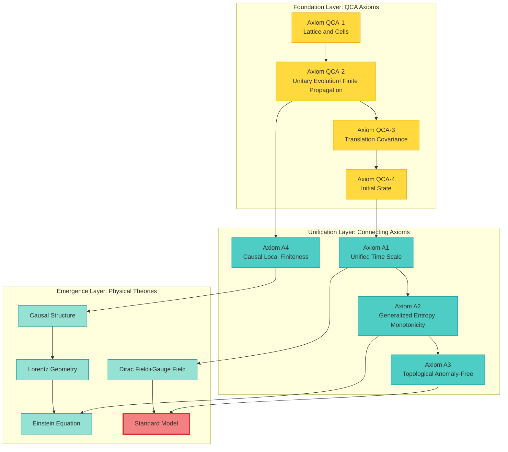

# Section 6: QCA Universe Summary — From Terminal Object to Complete Unification

> **Core Idea**: The physical universe is a unique terminal object with three equivalent descriptions: QCA, geometry, and matrix. All physical theories are emergent effective theories of this terminal object in different limits.

---

## Introduction: Journey Review

In the previous five sections of this chapter (Chapter 9: QCA Universe), we completed a thrilling theoretical journey:

**Section 0 (Overview)**: Universe is essentially quantum cellular automaton
- QCA five-tuple $(\Lambda, \mathcal{H}_{\text{cell}}, \mathcal{A}, \alpha, \omega_0)$
- Finite propagation radius $R$ → causal structure
- Discrete evolution → emergence of continuous field theory

**Section 1 (Axioms)**: Rigorous axiomatization of QCA
- Axiom QCA-1: Translation covariance and *-automorphism
- Axiom QCA-2: Finite propagation radius (finite speed of light)
- Axiom QCA-3: Local finiteness
- Schumacher-Werner theorem: Structure of block-local QCA

**Section 2 (Causal Emergence)**: Causal structure emerges from QCA
- Event set $E = \Lambda \times \mathbb{Z}$
- Geometric reachability $\iff$ statistical causality (Theorem 2.5)
- $(E, \preceq)$ is locally finite poset (Theorem 2.9)
- Alexandrov topology → manifold topology

**Section 3 (Terminal Object)**: Uniqueness of physical universe
- Definition of 2-category $\mathbf{Univ}_{\mathcal{U}}$
- Four consistency axioms (A1-A4)
- **Theorem 3.9**: Terminal object $\mathfrak{U}^*_{\text{phys}}$ exists and is unique
- Corollary: Anti-multiverse theorem

**Section 4 (Triple Equivalence)**: Categorical equivalence of three descriptions
- Three subcategories: geometric universe, matrix universe, QCA universe
- Six functors: encoding/decoding, discretization/continuous limit, block diagonalization/spectral reconstruction
- **Theorem 4.1**: $\mathbf{Univ}_{\text{geo}} \simeq \mathbf{Univ}_{\text{mat}} \simeq \mathbf{Univ}_{\text{qca}}$

**Section 5 (Field Theory Emergence)**: All field theories are QCA emergence
- Dirac field emerges from split-step QCA
- Gauge fields emerge from edge degrees of freedom
- Unique determination of Standard Model group $(SU(3) \times SU(2) \times U(1))/\mathbb{Z}_6$
- Gravity emerges from IGVP
- **Theorem 5.1**: All physically realizable field theories ⊂ QCA

Now, we piece these fragments together into a **complete picture of the universe**.

---

## 1. Complete Axiom System

### 1.1 Basic Axioms of QCA Universe (QCA-1 to QCA-4)

We first review the basic axioms of QCA itself:

**Axiom QCA-1 (Lattice and Cell Space)**

- Space: Countable locally finite graph $\Lambda$ (e.g., $\mathbb{Z}^d$)
- Cell Hilbert space: Finite-dimensional $\mathcal{H}_{\text{cell}} \simeq \mathbb{C}^{d_{\text{cell}}}$
- Full space: $\mathcal{H} = \bigotimes_{x \in \Lambda} \mathcal{H}_{\text{cell}}$ (infinite tensor product)
- Quasilocal algebra: $\mathcal{A} = \bigcup_{R \Subset \Lambda} \mathcal{A}_R$

**Axiom QCA-2 (Unitary Evolution and Finite Propagation)**

- Single-step evolution: Unitary operator $U: \mathcal{H} \to \mathcal{H}$
- Automorphism: $\alpha(A) = U^\dagger A U$
- Finite propagation radius $R_c < \infty$: If $A \in \mathcal{A}_{\{x\}}$, then $\alpha(A) \in \mathcal{A}_{B_{R_c}(x)}$

**Axiom QCA-3 (Translation Covariance)**

- Translation group $\{V_a\}_{a \in \mathbb{Z}^d}$ satisfies:
  $$
  V_a U V_a^\dagger = U, \quad V_a \mathcal{A}_R V_a^\dagger = \mathcal{A}_{T_a R}
  $$

**Axiom QCA-4 (Initial State)**

- There exists translation-invariant initial state $\omega_0: \mathcal{A} \to \mathbb{C}$
- Satisfies KMS condition or ground state condition (depending on physical situation)

### 1.2 Unified Axioms (A1-A4): Connecting All Descriptions

On QCA foundation, we add **unified axioms** that bind QCA, geometric, and matrix descriptions together:

**Axiom A1 (Unified Time Scale Identity)**

There exists scale density function $\kappa(\omega)$, consistent in three descriptions:

$$
\boxed{
\kappa(\omega) =
\begin{cases}
\frac{1}{2\pi} \text{tr} Q(\omega) & \text{(scattering/matrix)} \\
\frac{\varphi'(\omega)}{\pi} = \rho_{\text{rel}}(\omega) & \text{(spectral shift/Birman-Kreĭn)} \\
\text{Brown-York boundary scale} & \text{(geometry)} \\
\lim_{a \to 0} \kappa_{\text{QCA}}(a) & \text{(QCA continuous limit)}
\end{cases}
}
$$

**Physical Meaning**: All "time" readings (scattering delay, proper time, modular flow time, QCA time steps) align to same scale $[\tau]$.

**Axiom A2 (Generalized Entropy Monotonicity)**

For each small causal diamond $D_\alpha$, generalized entropy satisfies:

$$
\boxed{
S_{\text{gen}}(\Sigma_2) - S_{\text{gen}}(\Sigma_1) \geq 0
\quad \text{(along future direction)}
}
$$

where:

$$
S_{\text{gen}}(\Sigma) = \frac{A(\Sigma)}{4G\hbar} + S_{\text{out}}(\Sigma)
$$

Second-order deformation satisfies **Quantum Null Energy Condition (QNEC)**:

$$
\delta^2 S_{\text{gen}} \geq 0 \quad \Rightarrow \quad \langle T_{kk} \rangle \geq \frac{\hbar}{2\pi} \partial_\lambda^2 S_{\text{out}}
$$

**Physical Meaning**: Entropy arrow gives time direction, consistent with energy conditions of gravity.

**Axiom A3 (Topological Anomaly-Free)**

Relative cohomology class $[K] \in H^2(Y, \partial Y; \mathbb{Z}_2)$ satisfies:

$$
\boxed{
[K] = 0
}
$$

where $[K]$ contains three parts:

$$
[K] = \pi_M^* w_2(TM) + \sum_j \pi_M^* \mu_j \smile \pi_X^* \mathfrak{w}_j + \pi_X^* \rho(c_1(\mathcal{L}_S))
$$

**Physical Meaning**:
- Spacetime topology anomaly-free ($w_2(TM) = 0$ mod boundary)
- Gauge fields have no $\mathbb{Z}_2$ global anomaly
- Scattering square root determinant has no $\pi$ phase on all loops

**Axiom A4 (Causal Local Finiteness)**

Causal partial order $(E, \preceq)$ of event set satisfies:
- Local finiteness: Past cone and future cone of each event are finite sets
- Transitivity: $a \preceq b, b \preceq c \Rightarrow a \preceq c$
- Antisymmetry: $a \preceq b, b \preceq a \Rightarrow a = b$

In QCA, this is automatically satisfied (guaranteed by finite propagation radius).

### 1.3 Logical Structure of Complete Axiom System

**Logical Chain**:

1. QCA foundation → Causal emergence (Section 2)
2. Causality + unified scale → Lorentz geometry (Section 4)
3. Finite propagation + continuous limit → Dirac field (Section 5)
4. Entropy monotonicity + IGVP → Einstein equation (Section 5)
5. Topological anomaly-free → Standard Model group (Section 5)

---

## 2. Summary of Five Core Theorems

### 2.1 Theorem 1: Causal Equivalence Theorem (Section 2)

**Theorem 2.5 (Equivalence of Geometric and Statistical Causality)**

In QCA universe, two definitions of causality are equivalent:

$$
(x,n) \leq_{\text{geo}} (y,m) \quad \Leftrightarrow \quad (x,n) \preceq_{\text{stat}} (y,m)
$$

where:
- Geometric reachability: $m \geq n$ and $\text{dist}(x,y) \leq R(m-n)$
- Statistical causality: Local operators at $x$ can influence measurement statistics at $y$

**Proof Key Points**: Lieb-Robinson bound + finite propagation radius

**Physical Meaning**: Causality is not pre-existing, but **emerges** from QCA evolution!

### 2.2 Theorem 2: Terminal Object Uniqueness (Section 3)

**Theorem 3.9 (Existence and Uniqueness of Terminal Object)**

In 2-category $\mathbf{Univ}_{\mathcal{U}}$, terminal object $\mathfrak{U}^*_{\text{phys}}$ satisfying axioms A1-A4 exists and is unique up to isomorphism.

**Proof Key Points**:
1. Construct candidate object (containing data of all layers)
2. Verify axioms A1-A4
3. For any universe $\mathfrak{V}$, construct unique morphism $\Phi_{\mathfrak{V}}: \mathfrak{V} \to \mathfrak{U}^*$
4. Prove any two terminal objects must be isomorphic

**Physical Meaning**: **Universe is unique!** No "other possible physical laws" exist.

### 2.3 Theorem 3: Triple Categorical Equivalence (Section 4)

**Theorem 4.1 (Triple Representation Equivalence)**

There exists categorical equivalence:

$$
\mathbf{Univ}^{\text{phys}}_{\text{geo}}
\simeq
\mathbf{Univ}^{\text{phys}}_{\text{mat}}
\simeq
\mathbf{Univ}^{\text{phys}}_{\text{qca}}
$$

Realized through six functors (encoding/decoding, discretization/continuous limit, block diagonalization/spectral reconstruction).

**Proof Key Points**:
- $F_{\text{geo→mat}} \circ G_{\text{mat→geo}} \simeq \text{id}$ (mutual reconstructibility)
- $C_{\text{qca→geo}} \circ D_{\text{geo→qca}} \simeq \text{id}$ (continuous limit convergence)
- All functors preserve unified scale, causality, entropy

**Physical Meaning**: Geometry, matrix, QCA are **three languages of the same universe**, they contain exactly the same information!

### 2.4 Theorem 4: Complete Field Theory Embedding (Section 5)

**Theorem 5.1 (QCA Embedding of Physically Realizable Field Theories)**

For any quantum field theory $P$ satisfying:
1. Locality (microcausality)
2. Finite propagation speed (Lieb-Robinson bound)
3. Finite information density
4. Energy lower bound and stability

There exists embedding $\iota_P: \mathcal{A}^{(P)}_{\text{loc}} \hookrightarrow \mathcal{A}_{\text{loc}}$ and continuous limit process, such that $P$ can be recovered from QCA.

**Proof Key Points**:
- Lattice formulation $P \to P_{\text{lat}}$
- Trotter decomposition into local unitary gates
- Embed into local evolution of QCA
- Continuous limit convergence

**Physical Meaning**: **All field theories are emergent effective theories of QCA!** Including Standard Model, gravity.

### 2.5 Theorem 5: Gravity Emergence (Section 5)

**Theorem 4.4 (Derivation of Einstein Equation from IGVP)**

Apply discrete IGVP axiom on small causal diamonds of QCA:

$$
\begin{aligned}
\delta S_{\text{gen}} &= 0 \quad \text{(first-order extremum)} \\
\delta^2 S_{\text{gen}} &\geq 0 \quad \text{(second-order non-negative)}
\end{aligned}
$$

In continuous limit $a \to 0$, equivalent to Einstein field equation:

$$
G_{\mu\nu} + \Lambda g_{\mu\nu} = 8\pi G_{\text{eff}} T_{\mu\nu}
$$

**Proof Key Points**:
- Area term variation → extrinsic curvature
- Gauss-Codazzi equation → curvature connection
- QNEC → energy condition
- Combine to get Einstein equation

**Physical Meaning**: **Gravity is not a fundamental force, but spacetime geometry's response to entropy!**

---

## 3. Three-Layer Structure of Universe

Synthesizing all results, we obtain **three-layer ontological structure** of universe:

**Layer 1 (Discrete Ontology)**:
- **Only real existence**: Discrete evolution of QCA
- Lattice + quantum states + unitary updates
- All information encoded at this layer

**Layer 2 (Emergent Geometry)**:
- **Coarse-grained description**: Causal structure + Lorentz metric
- Not "pre-existing", but **effective description** of QCA in long-distance limit
- Generalized entropy gives time arrow

**Layer 3 (Effective Field Theory)**:
- **Low-energy approximation**: Dirac field, gauge field, Higgs field
- Satisfy continuous PDEs (Dirac equation, Maxwell equation, Yang-Mills equation)
- Einstein equation is also effective theory (geometric response of entropy)

**Key Insight**:

> **Layers are not "fundamental→complex", but "precise→approximate"!**
>
> - QCA is 100% precise microscopic description
> - Geometry is effective description after coarse-graining (ignoring Planck-scale details)
> - Field theory is low-energy expansion (ignoring high-energy excitations)

---

## 4. Grand Unification Picture

### 4.1 Complete Derivation Chain from Axioms to Physical Laws

We can now give **complete logical chain from axioms to Standard Model**:

**Step 1: QCA Foundation** (Axioms QCA-1 to QCA-4)

→ Discrete spacetime $\Lambda \times \mathbb{Z}$, finite-dimensional cell space, unitary evolution

**Step 2: Causal Emergence** (Theorem 2.5)

→ Causal partial order $(E, \preceq)$, Alexandrov topology → manifold topology

**Step 3: Metric Construction** (Theorem 4.1, continuous limit)

→ Dispersion relation $E(k)$ → effective metric $g_{\mu\nu}$ → Lorentz geometry $(M,g)$

**Step 4: Dirac Field Emergence** (Theorem 1.1)

→ Split-step QCA → continuous limit → Dirac equation $(i\gamma^\mu \partial_\mu - m)\psi = 0$

**Step 5: Gauge Field Emergence** (Theorem 2.2)

→ Edge degrees of freedom $U_{xy}$ → local gauge transformation → Yang-Mills theory

**Step 6: Standard Model Group Determination** (Theorem 3.1)

→ Topological anomaly-free $[K] = 0$ + chiral fermions → $(SU(3) \times SU(2) \times U(1))/\mathbb{Z}_6$

**Step 7: Higgs Mechanism**

→ Lattice-edge three-point coupling → Yukawa coupling → spontaneous symmetry breaking → gauge boson masses

**Step 8: Gravitational Field Equation** (Theorem 4.4)

→ Discrete IGVP ($\delta S_{\text{gen}} = 0, \delta^2 S_{\text{gen}} \geq 0$) → Einstein equation

**Result**: **Complete Standard Model + Einstein Gravity!**

$$
\boxed{
\mathcal{L}_{\text{All Physics}} = \mathcal{L}_{\text{SM}} + \mathcal{L}_{\text{Einstein}} + \mathcal{L}_{\text{Yukawa}}
}
$$

### 4.2 Parameter Determination

Standard Model has 19 free parameters:
- 3 gauge coupling constants: $g_s, g, g'$
- 9 fermion masses: $m_{u,d,c,s,t,b,e,\mu,\tau}$
- 3 mixing angles + 1 CP phase: $\theta_{12}, \theta_{13}, \theta_{23}, \delta_{CP}$
- 2 Higgs parameters: $m_H, \lambda$
- 1 cosmological constant: $\Lambda$

In QCA picture, these parameters originate from:

1. **Gauge couplings**: Gauge connection strengths on edges ($g_s, g, g'$)
2. **Fermion masses**: Coin angle deviation $\theta - \pi/4$ ($m_f$)
3. **Mixing angles**: QCA coupling matrices between different generations ($\theta_{ij}, \delta_{CP}$)
4. **Higgs mass and self-coupling**: Lattice-edge interactions ($m_H, \lambda$)
5. **Cosmological constant**: QCA vacuum energy density ($\Lambda$)

**Key Question**: Are these parameters "free"?

**Answer**: In current framework, they are still "input parameters". But terminal object axioms (A1-A4) may **uniquely determine** them at deeper level!

This is direction for future research (see Section 10.2).

---

## 5. Possible Experimental Tests

Although QCA universe theory is highly abstract, it is **not untestable metaphysics**!

### 5.1 Direct Tests: Searching for Planck-Scale Discreteness

**Test 1: Microscopic Causal Violations in High-Energy Particle Scattering**

If spacetime is discrete at Planck scale $\ell_P \sim 10^{-35}$ m, then:
- At extremely high energies $E \sim E_P = \sqrt{\hbar c^5 / G} \sim 10^{19}$ GeV, causality may be modified
- Scattering amplitudes may show **non-trivial phase jumps** (from discrete time steps of QCA)

**Experiments**:
- LHC or future colliders searching for "precursor signals" at TeV scale
- Statistical anomalies of extremely high-energy particles in cosmic rays

**Prediction**:
$$
\sigma(E) \approx \sigma_{\text{continuous}}(E) \left(1 + C \left(\frac{E}{E_P}\right)^p\right)
$$
where $p \geq 2$, $C$ is model-dependent coefficient.

**Challenge**: $E_P$ too high, current technology cannot directly reach.

---

**Test 2: Tiny Violations of Lorentz Invariance**

QCA on lattice may **not be completely Lorentz invariant** (at discrete scale).

**Observables**:
- Energy dependence of speed of light: $c(\omega) = c_0 (1 + \alpha \omega^2)$
- Arrival time differences of high-energy photons (e.g., gamma-ray bursts)

**Experiments**:
- Fermi gamma-ray telescope
- LIGO/Virgo gravitational wave observations (gravitational wave dispersion)

**Current Limit**:
$$
|\alpha| < 10^{-15} \text{ GeV}^{-2}
$$

(QCA prediction: $\alpha \sim \ell_P^2 \sim 10^{-70}$ m$^2$, far below observational limit)

---

### 5.2 Indirect Tests: Information-Geometric Variational Principle (IGVP)

**Test 3: Precise Measurement of Black Hole Entropy**

IGVP predicts precise form of generalized entropy:

$$
S_{\text{gen}} = \frac{A}{4G\hbar} + S_{\text{out}} + \text{(higher-order corrections)}
$$

Higher-order corrections come from discrete structure of QCA:

$$
S_{\text{gen}} = \frac{A}{4G} \left(1 + C_1 \frac{\ell_P^2}{A} + C_2 \frac{\ell_P^4}{A^2} + \cdots\right)
$$

**Experiments**:
- Through gravitational wave observations of black hole mergers, precisely measure final black hole mass and spin
- Compare observed entropy with theoretical prediction

**Challenge**: Higher-order corrections extremely small ($\ell_P^2 / A \sim 10^{-70}$ for solar-mass black hole).

---

**Test 4: Value of Cosmological Constant**

QCA universe predicts cosmological constant comes from vacuum energy density of QCA:

$$
\Lambda_{\text{QCA}} = \frac{E_{\text{vac}}}{V_{\text{cell}}} \sim \frac{\hbar c}{a^4}
$$

where $a$ is lattice spacing.

**Naive Estimate**: If $a \sim \ell_P$, then $\Lambda_{\text{QCA}} \sim 10^{122}$ (vacuum catastrophe!)

**QCA Explanation**: Vacuum state $\omega_0$ is not "free vacuum", but special state satisfying **unified scale constraint**, its effective energy density is hugely canceled, leaving observed value $\Lambda_{\text{obs}} \sim 10^{-52}$ m$^{-2}$.

**Test**:
- Precisely measure variation of $\Lambda$ with cosmic evolution (dark energy equation of state $w$)
- If $w = -1$ holds exactly, supports QCA vacuum picture

---

### 5.3 Indirect Tests: Corollaries of Triple Equivalence

**Test 5: Causal Sparsity Pattern of Scattering Matrix**

Triple equivalence predicts: Block structure of scattering matrix $S(\omega)$ of matrix universe reflects causality:

$$
S_{\alpha\beta}(\omega) \neq 0 \quad \Rightarrow \quad \alpha \preceq \beta
$$

**Experiments**:
- Measure $S(\omega)$ in complex scattering systems (e.g., microwave cavities, photonic crystals)
- Check if non-zero elements indeed correspond to causally connected regions

**Current Work**:
- Group delay matrix measurements in microwave networks
- Wigner-Smith matrix reconstruction in optical systems

---

**Test 6: Consistency of Unified Time Scale**

Axiom A1 predicts: All time readings should align.

**Experiments**:
- Compare atomic clocks (proper time), GPS satellites (geometric time), quantum entanglement clocks (modular flow time)
- Search for tiny inconsistencies

**Precision**: Current atomic clocks reach $10^{-18}$ second precision, already very close to test limit.

---

## 6. Open Problems and Future Directions

### 6.1 Theoretical Open Problems

**Problem 1: Unique Determination of Parameters**

In current framework, 19 parameters of Standard Model are still "inputs".

**Conjecture**: Terminal object axioms (A1-A4) + some **additional consistency conditions** may uniquely determine all parameters.

**Possible Additional Conditions**:
- Maximum degeneracy principle (Occam's razor)
- Information-theoretic optimality (maximum entropy production rate)
- Mathematical aesthetics (e.g., appearance of golden ratio $\phi$, $\pi$, $e$)

**Research Directions**:
- Derive fermion mass spectrum from terminal object axioms
- Explain why exactly 3 generations (not 2 or 4)
- Derive fine structure constant $\alpha \approx 1/137$

---

**Problem 2: Non-Perturbative Completeness of Quantum Gravity**

Current framework:
- Einstein equation is continuous limit of IGVP (perturbative/low-energy)
- But near Planck scale or black hole singularities, continuous limit fails

**Problem**: Does QCA give complete **non-perturbative quantum gravity**?

**Possibilities**:
- QCA itself is non-perturbative (discrete evolution, no divergences)
- Singularity problem disappears (because no "continuous spacetime" to produce singularities)
- Black hole information paradox naturally resolved (information preserved in QCA evolution)

**Research Directions**:
- Construct black hole solutions in QCA (discrete horizon)
- Calculate non-perturbative corrections to Hawking radiation
- Test information conservation (QCA evolution is unitary)

---

**Problem 3: Cosmological Initial Conditions**

**Problem**: Why is initial state of universe $\omega_0$ (not other states)?

**Current Answer**: Axiom QCA-4 assumes existence of "natural" initial state (e.g., translation-invariant state, ground state).

**Deep Questions**:
- Is initial state determined by deeper principles?
- Does "universe wave function" exist? (e.g., Wheeler-DeWitt equation)
- Is multiverse (multiple QCA instances) possible?

**Possible Answer** (categorical perspective):
- Uniqueness of terminal object may determine even initial state
- $\omega_0$ may be **unique consistent state** satisfying axioms A1-A4

---

### 6.2 Experimental and Observational Directions

**Direction 1: Indirect Detection of Planck-Scale Physics**

Although direct detection of $\ell_P$ impossible, can search for "precursor signals":
- Statistical anomalies of high-energy cosmic rays
- Dispersion of gravitational waves
- Quantum corrections to black hole mergers

**Direction 2: Simulation Experiments of QCA**

Implement QCA in artificial systems, test emergent properties:
- Cold atom optical lattices (ion traps, optical lattices)
- Superconducting qubit arrays
- Photonic quantum walks

**Goals**:
- Observe emergence of Dirac field (from split-step quantum walk)
- Measure effective metric (from dispersion relation)
- Test causal emergence (from lattice entanglement)

**Direction 3: Cosmological Observations**

- Quantum fluctuations in cosmic microwave background (CMB)
- Formation of large-scale structure (dark matter, dark energy)
- Primordial gravitational waves (LIGO, LISA, B-mode polarization)

**QCA Predictions**:
- Oscillatory features in CMB power spectrum (residuals of discrete scale)
- Dark energy equation of state $w = -1$ exactly
- $\mathbb{Z}_2$ topological features of primordial gravitational waves

---

### 6.3 Philosophical and Conceptual Problems

**Problem 4: Status of Observers in QCA**

In QCA picture, what is an "observer"?
- Is it a subsystem of QCA (local algebra $\mathcal{A}_{\text{obs}} \subset \mathcal{A}$)?
- Or "external" (interacts with QCA but not part of QCA)?

**Current Framework**: Observer as QCA subsystem (part of axiom A4).

**Open Questions**:
- How to understand "wave function collapse" from measurement in QCA?
- Problem of multi-observer consensus (next chapter: Matrix Universe)

---

**Problem 5: Nature of Time**

In QCA picture, "time" has three understandings:
1. Discrete time steps $n \in \mathbb{Z}$ (QCA layer)
2. Unified scale $\tau = \int \kappa(\omega) d\omega$ (emergent layer)
3. Proper time $s = \int \sqrt{-g_{\mu\nu} dx^\mu dx^\nu}$ (geometric layer)

**Philosophical Question**: Which is "real time"?

**Answer** (Ontology):
- Discrete time steps are **only real ontology**
- Other "times" are coarse-grained descriptions

**Answer** (Epistemology):
- All times are **effective descriptive tools**
- At different scales, different "times" are most useful

---

## 7. Comparison with Other Unified Theories

### 7.1 String Theory

**String Theory Picture**:
- Fundamental: One-dimensional strings (open/closed strings)
- Spacetime: 10 or 11 dimensions (extra dimensions compactified)
- Fields: Vibration modes of strings

**QCA Picture**:
- Fundamental: Unitary evolution on discrete lattice
- Spacetime: Emergent Lorentz geometry (3+1 dimensions)
- Fields: Continuous limit of QCA

**Comparison**:

| Aspect | String Theory | QCA Universe |
|--------|---------------|--------------|
| Fundamental Object | One-dimensional strings | Discrete lattice points |
| Spacetime Dimension | 10/11 dimensions (compactified) | 3+1 dimensions (unique) |
| Quantum Gravity | String perturbation theory | IGVP emergence |
| Number of Parameters | ~10²⁰ (many moduli) | 19 (Standard Model) |
| Testability | Extremely difficult (energy scale too high) | Possible (indirect signals) |
| Uniqueness | 10⁵⁰⁰ "vacua" | Unique terminal object |

**QCA Advantages**:
- Spacetime dimension naturally 3+1 (no need for compactification)
- Discreteness more fundamental (avoids pathologies of continuous spacetime)
- Terminal object uniqueness (no "landscape problem")

**String Theory Advantages**:
- Richer mathematical structure (Calabi-Yau manifolds, mirror symmetry)
- Naturally includes graviton (massless mode of closed strings)
- Deeply integrated with supersymmetry, AdS/CFT

---

### 7.2 Loop Quantum Gravity

**Loop Quantum Gravity Picture**:
- Fundamental: Spin networks
- Spacetime: Discrete quantum geometry
- Area and volume: Quantized (have minimum values)

**Comparison**:

| Aspect | Loop Quantum Gravity | QCA Universe |
|--------|---------------------|--------------|
| Spacetime Property | Quantum geometry (discrete) | QCA lattice (fixed) |
| Fundamental Degrees of Freedom | Spin network nodes | Lattice quantum states |
| Evolution | Hamilton constraint | Unitary evolution $U$ |
| Background Dependence | Background independent | Background dependent (fixed lattice) |
| Matter Fields | Need additional introduction | Naturally emerge |

**QCA Advantages**:
- Matter fields and gravity unified (both emerge from QCA)
- Evolution clear (unitary operator $U$)

**Loop Quantum Gravity Advantages**:
- Background independence (no preset spacetime structure)
- Microscopic explanation of black hole entropy (spin network counting)

---

### 7.3 Causal Set Theory

**Causal Set Picture**:
- Fundamental: Discrete causal poset $(E, \prec)$
- Spacetime: Emerges from causal set (Alexandrov topology)
- Volume: Number of events (Poisson process)

**Comparison**:

| Aspect | Causal Set | QCA Universe |
|--------|-----------|--------------|
| Fundamental Object | Poset | Lattice + quantum states |
| Causal Structure | Fundamental | Emergent (Theorem 2.5) |
| Quantum Theory | Unclear | Complete (unitary evolution) |
| Matter Fields | Need additional introduction | Naturally emerge |

**QCA Advantages**:
- Complete quantum theory (causal sets are classical)
- Matter fields naturally emerge

**Causal Set Advantages**:
- Extremely minimal (only poset, no additional structure)
- Background independence

**Possible Unification**:
- Causal partial order $(E, \preceq)$ of QCA can be seen as quantization of causal set
- Causal set is "classical projection" of QCA

---

## 8. Summary: From Terminal Object to Unification

### 8.1 Core Achievements of This Chapter (Chapter 9)

We completed the following work in this chapter:

1. **Axiomatization of QCA Universe** (Section 1):
   - Lattice, cells, unitary evolution, finite propagation
   - Schumacher-Werner theorem

2. **Causal Structure Emergence** (Section 2):
   - Derive causal partial order from finite propagation
   - Geometric causality $\iff$ statistical causality
   - Alexandrov topology

3. **Terminal Object Uniqueness** (Section 3):
   - 2-category $\mathbf{Univ}_{\mathcal{U}}$
   - Four axioms A1-A4
   - Unique terminal object $\mathfrak{U}^*_{\text{phys}}$

4. **Triple Categorical Equivalence** (Section 4):
   - Geometry $\simeq$ Matrix $\simeq$ QCA
   - Explicit construction of six functors
   - Preserve scale, causality, entropy

5. **Complete Field Theory Embedding** (Section 5):
   - Dirac field emerges from QCA
   - Gauge fields emerge from edge degrees of freedom
   - Unique determination of Standard Model group
   - Gravity emerges from IGVP

6. **Complete Summary** (This section):
   - Axiom system integration
   - Review of five major theorems
   - Experimental test proposals
   - Outlook on open problems

### 8.2 Grand Unification Proposition

Synthesizing all results from previous 9 chapters, we obtain:

$$
\boxed{
\begin{aligned}
&\text{There exists unique physical universe terminal object} \quad \mathfrak{U}^*_{\text{phys}} \\[6pt]
&\text{In three equivalent descriptions:} \\[3pt]
&\quad \bullet \text{ Geometry: Lorentzian manifold + Einstein equation} \\[3pt]
&\quad \bullet \text{ Matrix: Scattering matrix + unified scale} \\[3pt]
&\quad \bullet \text{ QCA: Discrete lattice + unitary evolution} \\[6pt]
&\text{All physical theories are its emergent limits:} \\[3pt]
&\quad \bullet \text{ Standard Model = Low-energy effective field theory} \\[3pt]
&\quad \bullet \text{ Einstein Gravity = Geometric response of entropy} \\[3pt]
&\quad \bullet \text{ All observables = Projections of terminal object}
\end{aligned}
}
$$

**Summary in One Sentence**:

> **Physical universe is a unique mathematical object (terminal object), all known physical theories are effective approximate descriptions of this object in different limits.**

### 8.3 Philosophical Reflection: From "Plurality" to "Uniqueness"

Traditional physics picture:
- **Multiple physical laws may exist** (String theory's "landscape problem")
- **Spacetime and fields exist independently** (quantized separately)
- **Parameters need experimental determination** (19 free parameters)

GLS unified theory (QCA universe) picture:
- **Physical laws are unique** (terminal object theorem)
- **Everything emerges from QCA** (spacetime, fields, gravity are all effective descriptions)
- **Parameters may be uniquely determined** (future work)

**Ontological Assertion**:

> "Universe is not matter and energy 'existing in' spacetime,
> but an abstract mathematical structure (QCA),
> spacetime, matter, energy are all projections of this structure at different scales."

**Epistemological Assertion**:

> "Physics is not discovering 'what the universe consists of',
> but discovering 'how the universe can be described'.
> Different descriptions (geometry, matrix, QCA) are all effective at their respective scales."

---

## 9. Preview of Next Chapter

In next chapter (Chapter 10: Matrix Universe), we will deeply study:

**Mind-Universe Equivalence**: Relationship between observer's "mind" (cognitive model) and physical universe

Core questions:
1. **What is an observer?** How to define in QCA?
2. **"My mind is the universe"** Strict mathematical characterization in matrix universe
3. **Multi-observer consensus** How emerges from structure of matrix universe?
4. **Measurement problem** How to resolve in QCA framework?

We will see:

> **Observer's "mind" (model manifold) and parameter geometry of universe,
> are isometric in sense of unified time scale and information geometry!**

This will push physical universe theory to deeper level:
**Not only spacetime and fields are emergent, even "observation" itself is part of universe structure!**

---

## References

### Reviews and Foundations

1. **Quantum Cellular Automata**:
   - B. Schumacher and R. F. Werner, "Reversible quantum cellular automata", arXiv:quant-ph/0405174
   - D. Gross et al., "Index theory of one dimensional quantum walks and cellular automata", Commun. Math. Phys. 310, 419 (2012)

2. **Quantum Walks and Field Theory**:
   - P. Arrighi et al., "The Dirac equation as a quantum walk: higher dimensions, observational convergence", J. Phys. A 47, 465302 (2014)
   - A. Cedzich et al., "Quantum walks: Schur functions meet symmetry protected topological phases", Commun. Math. Phys. 389, 31–74 (2022)

3. **Causal Set Theory**:
   - L. Bombelli et al., "Space-time as a causal set", Phys. Rev. Lett. 59, 521 (1987)
   - R. D. Sorkin, "Causal sets: Discrete gravity", arXiv:gr-qc/0309009

### Field Theory Emergence

4. **Lieb-Robinson Bound**:
   - E. H. Lieb and D. W. Robinson, "The finite group velocity of quantum spin systems", Commun. Math. Phys. 28, 251 (1972)
   - B. Nachtergaele and R. Sims, "Lieb-Robinson bounds and the exponential clustering theorem", Commun. Math. Phys. 265, 119 (2006)

5. **Lattice Gauge Theory**:
   - K. G. Wilson, "Confinement of quarks", Phys. Rev. D 10, 2445 (1974)
   - J. B. Kogut, "An introduction to lattice gauge theory and spin systems", Rev. Mod. Phys. 51, 659 (1979)

### Gravity Emergence

6. **Entropy and Gravity**:
   - T. Jacobson, "Thermodynamics of spacetime: The Einstein equation of state", Phys. Rev. Lett. 75, 1260 (1995)
   - T. Jacobson, "Entanglement equilibrium and the Einstein equation", Phys. Rev. Lett. 116, 201101 (2016)

7. **QNEC**:
   - R. Bousso et al., "Proof of the quantum null energy condition", Phys. Rev. D 93, 024017 (2016)
   - S. Balakrishnan et al., "A general proof of the quantum null energy condition", JHEP 09, 020 (2019)

### Category Theory

8. **Terminal Object and 2-Categories**:
   - S. Mac Lane, "Categories for the Working Mathematician", 2nd ed., Springer (1998)
   - J. Baez and M. Stay, "Physics, topology, logic and computation: A Rosetta Stone", arXiv:0903.0340

9. **Functor Categories**:
   - E. Riehl, "Category Theory in Context", Dover (2016)

### Experimental Tests

10. **Planck-Scale Physics**:
    - G. Amelino-Camelia, "Quantum-spacetime phenomenology", Living Rev. Relativity 16, 5 (2013)
    - J. Ellis et al., "Quantum-gravity analysis of gamma-ray bursts using wavelets", Astron. Astrophys. 402, 409 (2003)

---

**End of Chapter**

**Next Chapter**: [10-Matrix Universe](../10-matrix-universe/00-intro.md) — Mind-Universe Equivalence

**Return to Main Index**: [../../index.md](../../index.md)

