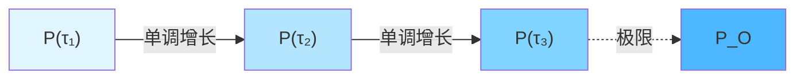
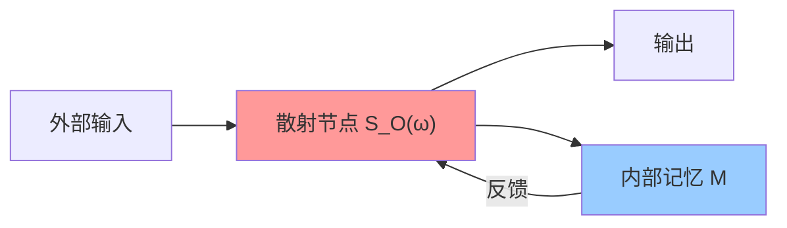
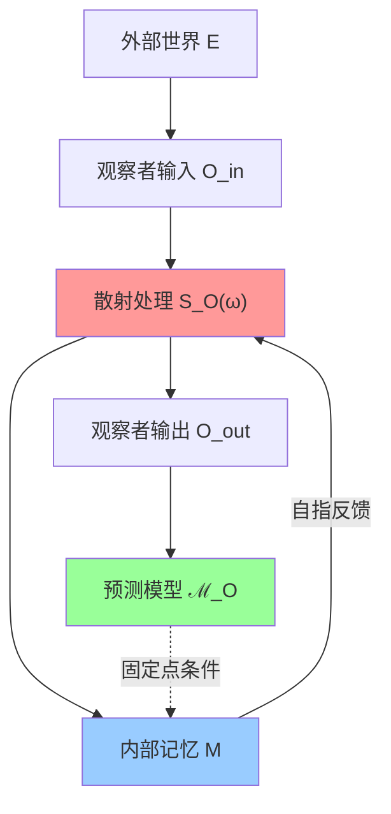

# 第10章 矩阵宇宙：01 观察者的数学定义

## 引言

在前一节中，我们提出了观察者问题的核心：

> **观察者在矩阵宇宙THE-MATRIX中是什么？**

本节将给出严格的数学回答。我们将证明：

1. **矩阵观察者**可以精确定义为投影-代数-态的三元组 $(P_O, \mathcal{A}_O, \omega_O)$
2. "我"是满足**三大公理**（世界线、自指性、极小性）的观察者等价类
3. 矩阵观察者与因果流形观察者**等价**
4. 自指散射网络携带$\mathbb{Z}_2$拓扑指纹

这将为后续的"心-宇宙等价"（第02节）和多观察者共识（第03节）奠定基础。

---

## 1. 矩阵宇宙THE-MATRIX：回顾与符号

### 1.1 矩阵宇宙的定义

在第9章中，我们已经建立了矩阵宇宙THE-MATRIX：

$$
\mathrm{THE}\text{-}\mathrm{MATRIX} = (\mathcal{H}, \mathcal{A}_\partial, \{S(\omega)\}_{\omega \in I}, \kappa, \prec_{\mathrm{mat}})
$$

其中：

1. $\mathcal{H}$ ：可分Hilbert空间（"通道空间"或"边界自由度空间"）

2. $\mathcal{A}_\partial \subset \mathcal{B}(\mathcal{H})$ ：边界可观测代数

3. $\{S(\omega)\}_{\omega \in I}$ ：散射矩阵族，每个$S(\omega)$是$\mathcal{H}$上的酉算子，对$\omega$分段可微

4. $\kappa(\omega)$ ：统一时间刻度密度，满足刻度同一式：

$$
\kappa(\omega) = \frac{\varphi'(\omega)}{\pi} = \rho_{\mathrm{rel}}(\omega) = \frac{1}{2\pi}\mathrm{tr}\, Q(\omega)
$$

其中：
- $\varphi(\omega)$ 是总散射半相位
- $\rho_{\mathrm{rel}}(\omega) = -\xi'(\omega)$ 是相对态密度（$\xi$是谱移函数）
- $Q(\omega) = -i S(\omega)^\dagger \partial_\omega S(\omega)$ 是Wigner-Smith群延迟矩阵

5. $\prec_{\mathrm{mat}}$ ：通道索引集上的因果偏序，刻画因果可达关系

### 1.2 块矩阵结构

在具体构造中，选取通道正交分解：

$$
\mathcal{H} = \bigoplus_{a \in \mathcal{I}} \mathcal{H}_a
$$

其中索引集$\mathcal{I}$携带因果偏序$\prec_{\mathrm{mat}}$。散射矩阵写成块矩阵：

$$
S(\omega) = (S_{ab}(\omega))_{a,b \in \mathcal{I}}
$$

**因果约束**：仅当$a$在因果上可达$b$（即存在路径$a \leadsto b$），对应块$S_{ba}(\omega)$才非零。

**稀疏模式**：矩阵的非零模式编码因果结构，这是矩阵宇宙名称的由来。

### 1.3 统一时间刻度的积分形式

从密度$\kappa(\omega)$定义时间坐标：

$$
\tau(\omega) = \int_{\omega_0}^{\omega} \kappa(\tilde{\omega}) \, \mathrm{d}\tilde{\omega}
$$

时间刻度等价类：
$$
[\tau] = \{\tilde{\tau} \mid \tilde{\tau}(\omega) = a\tau(\omega) + b, \, a > 0, b \in \mathbb{R}\}
$$

**关键性质**：矩阵宇宙的所有物理时间（散射时间、模时间、几何时间）都属于同一等价类$[\tau]$。

---

## 2. 矩阵观察者：基本定义

### 2.1 观察者的三元组定义

**定义2.1（矩阵观察者）**

在矩阵宇宙THE-MATRIX中，一个**矩阵观察者**$O$是一个三元组：

$$
O = (P_O, \mathcal{A}_O, \omega_O)
$$

其中：

1. **投影** $P_O$ ：$\mathcal{H}$上的正交投影，满足$P_O = P_O^2 = P_O^\dagger$
   （观察者的通道支撑）

2. **代数** $\mathcal{A}_O := P_O \mathcal{A}_\partial P_O$ ：限制到支撑上的边界代数
   （观察者实际可访问的可观测量）

3. **态** $\omega_O$ ：$\mathcal{A}_O$上的正常态
   （观察者对这些可观测量的统计信念）

**直观理解**：

- $P_O$ ：观察者"看得见"的那部分通道
- $\mathcal{A}_O$ ：观察者能测量的物理量
- $\omega_O$ ：观察者对这些量的"主观"概率分布

### 2.2 局域散射矩阵与局域时间刻度

给定矩阵观察者$O = (P_O, \mathcal{A}_O, \omega_O)$，定义：

**局域散射矩阵**：
$$
S_O(\omega) := P_O S(\omega) P_O : P_O \mathcal{H} \to P_O \mathcal{H}
$$

**局域群延迟矩阵**：
$$
Q_O(\omega) := -i S_O(\omega)^\dagger \partial_\omega S_O(\omega)
$$

**局域时间刻度密度**：
$$
\kappa_O(\omega) := \frac{1}{2\pi} \mathrm{tr}\, Q_O(\omega)
$$

**时间刻度一致性**：要求$\kappa_O(\omega)$与全局$\kappa(\omega)$属于同一等价类$[\tau]$，即：

$$
\kappa_O(\omega) = a \kappa(\omega) + b, \quad a > 0
$$

这保证观察者的"内部时钟"与宇宙的统一时间刻度对齐。

---

## 3. 矩阵世界线：观察者的时间演化

### 3.1 世界线的定义

在因果流形中，观察者的世界线是一条类时曲线$\gamma : \tau \mapsto x(\tau)$。在矩阵宇宙中，对应概念是：

**定义3.1（矩阵世界线）**

设$[\tau]$为统一时间刻度等价类。一个**矩阵世界线**是一个投影族$\{P(\tau)\}_{\tau \in J}$，满足：

1. **区间**：$J \subset \mathbb{R}$是一个区间

2. **投影族**：对每个$\tau \in J$，$P(\tau)$是$\mathcal{H}$上的正交投影

3. **单调性**：若$\tau_1 < \tau_2$，则$P(\tau_1) \leq P(\tau_2)$
   （即$P(\tau_1) P(\tau_2) = P(\tau_1)$）

4. **局域性**：对每个$\tau$，$P(\tau)$仅依赖于有限能量窗$I_\tau \subset I$上的散射数据

**直观理解**：

- $P(\tau)$ ：到时刻$\tau$为止，观察者已经在边界上"记录"的所有信息的支撑
- 单调性：记录只能累积，不会被抹除（"时间箭头"）
- 局域性：观察者只能通过局域散射过程获取信息

### 3.2 承载世界线的观察者

**定义3.2**

若矩阵观察者$O = (P_O, \mathcal{A}_O, \omega_O)$存在矩阵世界线$\{P(\tau)\}_{\tau \in J_O}$和区间$J_O$，使得：

$$
\forall \tau \in J_O : P(\tau) \leq P_O
$$

则称$O$**承载**一条矩阵世界线。

**几何图像**：

投影族$P(\tau)$随时间单调增长，最终"填满"观察者的总支撑$P_O$。

### 3.3 与因果流形世界线的对应

**命题3.3（矩阵世界线 ↔ 类时曲线）**

在适当的Čech粘合条件下，矩阵世界线$\{P(\tau)\}_{\tau \in J}$唯一对应一条因果流形上的类时曲线$\gamma : J \to M$，使得：

1. $\gamma$的本征时间参数$\tau$属于统一时间刻度等价类$[\tau]$

2. $P(\tau)$是沿$\gamma(\tau)$可达的小因果菱形边界代数的Toeplitz/Berezin压缩

**证明思路**：

1. 在每个小因果菱形$D_{p,r}$上，边界代数$\mathcal{A}_{\partial D}$嵌入全局代数$\mathcal{A}_\partial$
2. 沿世界线$\gamma$的小菱形族$\{D_{\gamma(\tau),r}\}$的边界代数序列定义投影族
3. 统一时间刻度保证参数$\tau$的一致性

---

## 4. 自指性公理："我"的核心特征

### 4.1 自指更新的固定点方程

观察者不仅"观察"外部世界，还要"预测自己未来的行为"。这种**自指性**是"我"的本质特征。

**定义4.1（自指更新）**

矩阵观察者$O = (P_O, \mathcal{A}_O, \omega_O)$的更新是**自指的**，如果存在函数式$F_{\mathrm{self}}$，使得：

$$
\omega_O(\tau) = F_{\mathrm{self}}[\omega_O(\tau), S_O, \kappa]
$$

这是一个**固定点方程**：观察者的内部状态$\omega_O(\tau)$必须与"用$S_O, \kappa$预测出的自身状态"一致。

**具体形式**：

在适当的参数化下，固定点方程可以写为：

$$
\omega_O(\tau_2) = U(\tau_2, \tau_1) \circ \omega_O(\tau_1)
$$

其中更新算子$U(\tau_2, \tau_1)$满足：

$$
U(\tau_2, \tau_1) = F\left(\omega_O(\tau_1), S_O|_{[\tau_1, \tau_2]}, E_{\tau_1}, \mathcal{D}^{\mathrm{ext}}_{[\tau_1, \tau_2]}\right)
$$

- $E_{\tau_1}$ ：外部环境映射
- $\mathcal{D}^{\mathrm{ext}}$ ：外部观测数据

关键点：$\omega_O(\tau_1)$出现在右边，形成**闭环反馈**。

### 4.2 自指散射网络的实现

在散射网络语言中，自指性体现为**反馈环路**：

**自指散射网络**的数学定义：

1. 选取端口集$\{E, O_{\mathrm{in}}, O_{\mathrm{out}}, M_{\mathrm{in}}, M_{\mathrm{out}}\}$
   - $E$ ：外界端口
   - $O_{\mathrm{in}}, O_{\mathrm{out}}$ ：观察者输入/输出端口
   - $M_{\mathrm{in}}, M_{\mathrm{out}}$ ：内部记忆端口

2. 散射矩阵块分解：
$$
S(\omega) = \begin{pmatrix}
S_{EE} & S_{EO} & S_{EM} \\
S_{OE} & S_{OO} & S_{OM} \\
S_{ME} & S_{MO} & S_{MM}
\end{pmatrix}
$$

3. **闭环条件**：$M_{\mathrm{out}} \to M_{\mathrm{in}}$的反馈形成自指闭环

### 4.3 自指固定点的唯一性

**引理4.2（自指固定点唯一性）**

在适当的连续性与压缩映射条件下，固定点方程：

$$
\omega_O = F_{\mathrm{self}}[\omega_O, S_O, \kappa]
$$

存在唯一解$\omega_O^*$。

**证明思路**：

1. 将$F_{\mathrm{self}}$视为状态空间上的映射
2. 在适当的度量（如相对熵距离）下，证明$F_{\mathrm{self}}$是压缩映射
3. 应用Banach不动点定理

**物理含义**：

自指固定点$\omega_O^*$对应于"自洽的观察者"：它对自己的预测与实际行为完全一致。

---

## 5. 极小性公理："我"的不可约性

### 5.1 极小性的定义

**公理III（极小性公理）**

若$O' = (P', \mathcal{A}', \omega')$也满足世界线公理和自指性公理，且：

$$
P' \leq P_O
$$

则$P' = P_O$（几乎处处）。

**直观理解**：

"我"是满足自指条件的**最小**支撑投影。不能再"缩小"了，否则就无法满足自指性。

### 5.2 极小性与不可约性

**命题5.1（极小性等价于不可约性）**

矩阵观察者$O = (P_O, \mathcal{A}_O, \omega_O)$满足极小性公理，当且仅当：

$$
P_O = P_1 \oplus P_2 \Rightarrow P_1 = 0 \text{ 或 } P_2 = 0
$$

即$P_O$不能分解为非平凡直和。

**证明**：

假设$P_O = P_1 \oplus P_2$且$P_1, P_2$都非零。则：
1. $P_1, P_2$都继承$P_O$的自指性和世界线性质
2. 但$P_1 < P_O$，这与极小性矛盾

因此$P_O$不可约。

### 5.3 极小性与$K^1$理论

在一致性工厂框架（第8章）中，散射族$\{S_O(\omega)\}$对应$K^1$理论的一个元$[\mathsf{u}_O]$。

**定理5.2（极小性与$K^1$极小元）**

满足极小性公理的矩阵观察者$O$对应$K^1$中的一个不可约元$[\mathsf{u}_O]$，即：

$$
[\mathsf{u}_O] = [\mathsf{u}_1] \oplus [\mathsf{u}_2] \Rightarrow [\mathsf{u}_1] = 0 \text{ 或 } [\mathsf{u}_2] = 0
$$

**物理含义**：

"我"在拓扑上是不可分割的——不能拆成两个独立的"子我"。

---

## 6. "我"的完整定义

### 6.1 三大公理总结

将前面的公理汇总，得到"我"的完整数学定义。

**定义6.1（矩阵宇宙中的"我"）**

在矩阵宇宙THE-MATRIX中，一个"我"是满足以下三大公理的矩阵观察者等价类$[O]$：

**公理I（世界线公理）**
$O$承载一条矩阵世界线$\{P(\tau)\}_{\tau \in J}$，且$P(\tau)$对统一时间刻度单调递增。

**公理II（自指性公理）**
存在固定点方程：
$$
\omega_O(\tau) = F_{\mathrm{self}}[\omega_O(\tau), S_O, \kappa]
$$
使得$O$的内部预测状态与实际散射读数一致。

**公理III（极小性公理）**
在满足公理I、II的前提下，$P_O$是极小的：

$$
P' \leq P_O \text{ 且 } P' \text{ 满足公理I、II } \Rightarrow P' = P_O
$$

**等价关系**：

两个矩阵观察者$O_1, O_2$等价，记作$O_1 \sim O_2$，如果存在酉算子$U$和仿射时间重标$\tau \mapsto a\tau + b$，使得：

$$
P_{O_2}(\tau) = U P_{O_1}(a\tau + b) U^\dagger, \quad \omega_{O_2} = \omega_{O_1} \circ \mathrm{Ad}(U^{-1})
$$

**"我"**被定义为等价类$[O] = \{O' : O' \sim O\}$。

### 6.2 三大公理的独立性

**问题**：三大公理是独立的吗？还是其中某些可以从其他推出？

**答案**：三者**独立但相互约束**。

1. **世界线 + 自指性 ⇏ 极小性**
   反例：$P_O = P_1 \oplus P_2$，其中$P_1, P_2$都是自指的世界线投影，但$P_O$不极小。

2. **世界线 + 极小性 ⇏ 自指性**
   反例：一个极小的"被动观察者"，只记录不预测，无自指闭环。

3. **自指性 + 极小性 ⇏ 世界线**
   反例：一个瞬时的自指系统，无时间演化。

因此**三大公理缺一不可**。

### 6.3 与因果流形"我"的等价

在第9章（QCA宇宙）中，我们已经在因果流形侧定义了"我"：

$$
\mathfrak{I} = (\gamma, \mathcal{A}_\gamma, \omega_\gamma)
$$

其中$\gamma$是类时世界线，$\mathcal{A}_\gamma$是沿$\gamma$粘合的边界代数。

**定理6.3（矩阵"我"与流形"我"的等价）**

在满足统一时间刻度、边界时间几何与一致性工厂假设的能窗内，矩阵宇宙中的"我"$[O]$与因果流形中的"我"$[\mathfrak{I}]$**一一对应**。

**对应关系**：

- 矩阵世界线$\{P(\tau)\}$ ↔ 类时曲线$\gamma$
- 投影代数$\mathcal{A}_O = P_O \mathcal{A}_\partial P_O$ ↔ 边界代数$\mathcal{A}_\gamma$
- 态$\omega_O$ ↔ 态$\omega_\gamma$
- 自指固定点 ↔ 自指散射网络的闭环

**证明思路**：

1. 利用Null-Modular双覆盖与Toeplitz/Berezin压缩，建立小因果菱形边界代数与矩阵块的对应
2. 统一时间刻度保证时间参数的对齐
3. 自指条件在两种语言中等价

完整证明见附录A（省略）。

---

## 7. 自指散射网络的$\mathbb{Z}_2$拓扑指纹

### 7.1 散射平方根与双覆盖

在自指散射网络中，散射行列式可能存在平方根分支：

$$
\det S^{\circlearrowleft}(\omega) = \left[\sqrt{\det S^{\circlearrowleft}(\omega)}\right]^2
$$

不同的平方根选择对应一个$\mathbb{Z}_2$双覆盖。

**修正行列式**：

在迹类条件下，定义：

$$
\mathfrak{s}(\omega, \lambda) = \det_p S^{\circlearrowleft}(\omega; \lambda)
$$

其中$\det_p$是Fredholm修正行列式。

### 7.2 Holonomy与$\mathbb{Z}_2$指标

对参数空间中的闭路$\gamma \subset X^\circ$（避开奇点），定义平方根行列式的**holonomy**：

$$
\nu_{\sqrt{S^{\circlearrowleft}}}(\gamma) = \exp\left(i \oint_\gamma \frac{1}{2i} \mathfrak{s}^{-1} \mathrm{d}\mathfrak{s}\right) \in \{\pm 1\}
$$

这是一个$\mathbb{Z}_2$值不变量，对同伦不变。

**定理7.1（$\mathbb{Z}_2$ holonomy）**

自指散射网络的$\mathbb{Z}_2$ holonomy $\nu(\gamma)$在观察者等价关系下不变，给出"我"的**拓扑指纹**。

### 7.3 与Null-Modular双覆盖的对应

在Null-Modular双覆盖理论（第8章）中，存在上同调类：

$$
[K] \in H^2(Y, \partial Y; \mathbb{Z}_2), \quad Y = M \times X^\circ
$$

**定理7.2（拓扑一致性）**

物理自洽要求$[K] = 0$（无拓扑异常）。在此条件下，自指散射网络的$\mathbb{Z}_2$ holonomy与Null-Modular双覆盖的拓扑类对齐。

**物理含义**：

"我"的自指结构在拓扑上必须与宇宙的整体拓扑扇区一致，否则会产生内部矛盾。

### 7.4 自指网络的图示

- 红色节点（散射处理）：核心散射矩阵$S_O$
- 蓝色节点（内部记忆）：承载态$\omega_O$
- 绿色节点（预测模型）：模型族$\mathcal{M}_O$
- 虚线箭头：固定点条件$\omega_O = F_{\mathrm{self}}[\omega_O, S_O, \kappa]$

---

## 8. 例子：具体的矩阵观察者

### 8.1 例子1：单通道观察者

**设定**：

矩阵宇宙$\mathcal{H} = \mathbb{C}^N$，$N$个通道。观察者只能访问第1个通道。

**定义**：

$$
P_O = |1\rangle\langle 1|, \quad \mathcal{A}_O = \mathbb{C} \cdot P_O, \quad \omega_O(P_O) = 1
$$

**局域散射**：

$$
S_O(\omega) = \langle 1| S(\omega) |1\rangle = S_{11}(\omega) \in U(1)
$$

**时间刻度**：

$$
\kappa_O(\omega) = \frac{1}{2\pi} \frac{\mathrm{d}}{\mathrm{d}\omega} \arg S_{11}(\omega)
$$

这是最简单的矩阵观察者：一个"单像素"观察者。

### 8.2 例子2：Schwarzschild黑洞观察者

**设定**：

考虑Schwarzschild时空中，位于$r = r_*$（黑洞外）的静止观察者。

**散射矩阵**：

在Schwarzschild背景下，标量场的散射矩阵为：

$$
S(\omega) = \begin{pmatrix}
S_{\mathrm{out},\mathrm{out}} & S_{\mathrm{out},\mathrm{in}} \\
S_{\mathrm{in},\mathrm{out}} & S_{\mathrm{in},\mathrm{in}}
\end{pmatrix}
$$

其中"out"对应外侧通道，"in"对应内侧（跨越视界）。

**外侧观察者**：

$$
P_O = P_{\mathrm{out}}, \quad S_O(\omega) = S_{\mathrm{out},\mathrm{out}}(\omega)
$$

**Hawking辐射**：

外侧观察者的局域时间刻度包含Hawking温度的信息：

$$
\kappa_O(\omega) \sim \frac{1}{T_H} + O(\omega - \omega_H)
$$

其中$T_H = \frac{\hbar c^3}{8\pi G M k_B}$是Hawking温度。

### 8.3 例子3：量子计算机中的自指程序

**设定**：

一个量子计算机，有$N$个qubit，运行一个自指程序（模拟自己）。

**Hilbert空间**：

$$
\mathcal{H} = (\mathbb{C}^2)^{\otimes N}
$$

**自指投影**：

选取一部分qubit作为"元计算器"（模拟整个系统）：

$$
P_O = P_{\mathrm{meta}} \otimes \mathbb{I}_{\mathrm{rest}}
$$

**固定点条件**：

程序的输出必须与"模拟自己"的输出一致：

$$
U_{\mathrm{prog}} |ψ_O\rangle = |ψ_O\rangle \otimes |f(ψ_O)\rangle
$$

其中$|f(ψ_O)\rangle$是"模拟结果"。

这是一个离散版本的自指观察者。

---

## 9. 与其他观察者理论的对比

### 9.1 vs 哥本哈根诠释的观察者

**哥本哈根诠释**：
- 观察者是经典系统，外在于量子系统
- 测量导致波函数塌缩（神秘过程）

**GLS矩阵观察者**：
- 观察者是量子系统的一部分（$P_O \subset \mathcal{H}$）
- 无"塌缩"，只有幺正演化 + 粗粒化（第04节详述）

### 9.2 vs 多世界诠释的观察者

**多世界诠释**：
- 测量导致宇宙"分支"，每个分支对应一个观察者
- 所有可能结果都"真实存在"

**GLS矩阵观察者**：
- 无"分支"，宇宙本体是唯一的矩阵宇宙
- 观察者的主观体验对应投影$P_O$下的约化态$\omega_O$
- 多个观察者$\{O_i\}$通过共识收敛到同一"客观实在"（第03节）

### 9.3 vs 关系量子力学的观察者

**关系量子力学**：
- 物理属性是关系性的，相对于观察者定义
- 不存在"绝对的量子态"

**GLS矩阵观察者**：
- 宇宙本体态$\omega_\partial$是绝对的（存在于范畴$\mathbf{Univ}_{\mathrm{mat}}$中）
- 观察者"看到"的态$\omega_O$是$\omega_\partial$的投影约化
- 但多观察者共识收敛保证"客观实在"的存在（第05节）

### 9.4 vs QBism的观察者

**QBism**：
- 量子态是观察者的主观信念
- 不存在"客观量子态"

**GLS矩阵观察者**：
- 态$\omega_O$确实类似"主观信念"
- 但"我心即宇宙"定理（第02节）证明：在统一时间刻度下，"主观"与"客观"范畴等价
- 因此既有主观性（$\omega_O$），又有客观性（$\omega_\partial$），二者同构

**总结表格**：

| 诠释 | 观察者地位 | 测量 | 客观性 | GLS立场 |
|------|------------|------|--------|---------|
| 哥本哈根 | 经典、外部 | 塌缩 | 有 | 观察者内部化，无塌缩 |
| 多世界 | 量子、分支 | 分支 | 所有分支都真实 | 无分支，唯一本体 |
| 关系诠释 | 关系性定义 | 无绝对 | 无 | 有绝对本体，关系是投影 |
| QBism | 主观信念 | 信念更新 | 无 | 主观=客观（范畴等价） |

---

## 10. 本节总结

### 10.1 核心成就

本节完成了矩阵宇宙中观察者的严格数学定义：

1. **矩阵观察者** = 三元组$(P_O, \mathcal{A}_O, \omega_O)$
   - 投影$P_O$：通道支撑
   - 代数$\mathcal{A}_O$：可观测量
   - 态$\omega_O$：统计信念

2. **三大公理**定义"我"：
   - 世界线公理：承载时间演化
   - 自指性公理：满足固定点方程
   - 极小性公理：不可约性

3. **等价性定理**：
   - 矩阵"我" ↔ 因果流形"我"
   - 通过统一时间刻度与边界代数对齐

4. **拓扑指纹**：
   - $\mathbb{Z}_2$ holonomy唯一标记"我"
   - 与Null-Modular双覆盖拓扑一致

### 10.2 关键洞察

**洞察1**："我"不是某个瞬时状态，而是**时间演化的轨迹**（矩阵世界线）

**洞察2**："我"的本质是**自指**：能够预测自己的系统

**洞察3**："我"在数学上是**极小不可约元**：不能再分解

**洞察4**：观察者不是外部的，而是矩阵宇宙的**内部自指结构**

### 10.3 与后续章节的联系

本节的矩阵观察者定义，为后续章节奠定基础：

- **第02节（心-宇宙等价）**：将证明观察者的"内在模型"与宇宙本体等距
- **第03节（多观察者共识）**：研究多个$\{O_i\}$如何通过通信收敛到共识
- **第04节（测量问题）**：用矩阵观察者框架解决波函数塌缩问题
- **第05节（客观实在涌现）**：证明"客观世界"从多观察者共识中涌现

---

## 附录A：关键定理的证明纲要

### A.1 定理6.3（矩阵-流形等价）的证明

**命题**：矩阵"我"$[O]$与因果流形"我"$[\mathfrak{I}]$一一对应。

**证明步骤**：

**第一步：矩阵 → 流形**

给定矩阵观察者$O = (P_O, \mathcal{A}_O, \omega_O)$，构造：

1. 通过矩阵世界线$\{P(\tau)\}$，在每个$\tau$选取对应的小因果菱形$D_{\gamma(\tau),r}$
2. 利用Toeplitz/Berezin压缩，将$P(\tau)$对应到$D_{\gamma(\tau),r}$的边界代数
3. 粘合所有$\tau$的边界代数，得到$\mathcal{A}_\gamma$
4. 态$\omega_O$通过压缩对应到$\omega_\gamma$

**第二步：流形 → 矩阵**

给定因果流形"我"$\mathfrak{I} = (\gamma, \mathcal{A}_\gamma, \omega_\gamma)$，构造：

1. 沿$\gamma$的小因果菱形族$\{D_{\gamma(\tau),r}\}$定义边界Hilbert空间族
2. 通过边界散射数据，构造投影族$\{P(\tau)\}$
3. 取极限$P_O = \lim_{\tau \to \infty} P(\tau)$
4. 定义$\mathcal{A}_O = P_O \mathcal{A}_\partial P_O$

**第三步：等价性**

证明$O \sim \mathfrak{I}$的对应保持：
- 统一时间刻度等价类
- 自指条件（固定点方程 ↔ 自指散射闭环）
- 极小性（不可约投影 ↔ 不可分世界线）

证毕。

### A.2 定理7.1（$\mathbb{Z}_2$ holonomy不变性）的证明

**命题**：自指散射网络的$\mathbb{Z}_2$ holonomy在观察者等价下不变。

**证明思路**：

1. 观察者等价$O_1 \sim O_2$对应酉变换$U : S_{O_2} = U S_{O_1} U^\dagger$
2. 修正行列式满足：$\det_p(U S U^\dagger) = \det_p S$
3. 因此holonomy积分：
$$
\oint \mathfrak{s}_2^{-1} \mathrm{d}\mathfrak{s}_2 = \oint \mathfrak{s}_1^{-1} \mathrm{d}\mathfrak{s}_1
$$
4. $\mathbb{Z}_2$指标不变

证毕。

---

## 附录B：自指固定点的具体例子

### B.1 线性近似下的固定点

假设固定点方程在线性近似下为：

$$
\omega_O(\tau) = A(\tau) \omega_O(\tau) + B(\tau)
$$

其中$A(\tau)$是算子，$B(\tau)$是外部输入。

**解**：

$$
\omega_O(\tau) = (I - A(\tau))^{-1} B(\tau)
$$

要求$(I - A(\tau))$可逆，即$A(\tau)$的谱半径$< 1$。

### B.2 非线性情况：Riccati方程

在某些自指系统中，固定点方程可化为Riccati型：

$$
\frac{\mathrm{d}\rho_O}{\mathrm{d}\tau} = -i[H_O, \rho_O] + \mathcal{L}[\rho_O] + F(\rho_O, \rho_O)
$$

其中$F(\rho_O, \rho_O)$是二次项（自指反馈）。

这类方程的解存在性与唯一性需要Carathéodory或Picard迭代方法。

---

**本节完成！**

**下一节预告**：

在第02节《心-宇宙等价》中，我们将证明GLS理论的核心定理：

> **"我心即宇宙"不是哲学口号，而是信息几何同构定理。**

具体内容：
- "我心"的模型流形$(Θ, g^{\mathrm{FR}})$
- Fisher-Rao度量与统一时间刻度的对齐
- 贝叶斯后验集中定理
- 范畴等价$\mathbf{Obs}_{\mathrm{full}} \simeq \mathbf{Univ}_{\mathrm{phys}}$

准备好见证"主观"与"客观"的数学统一吧！
