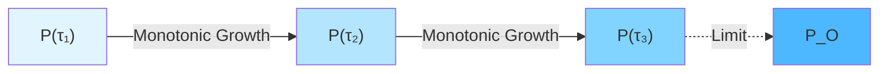
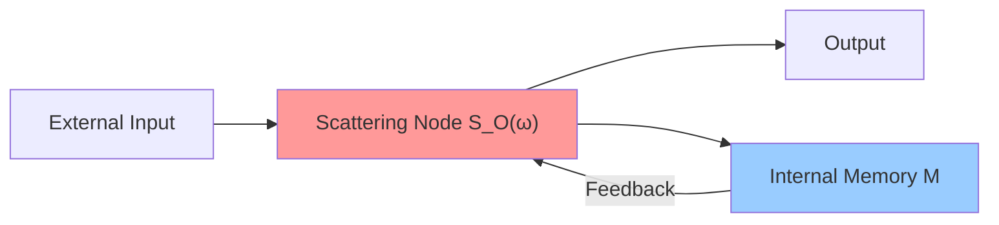
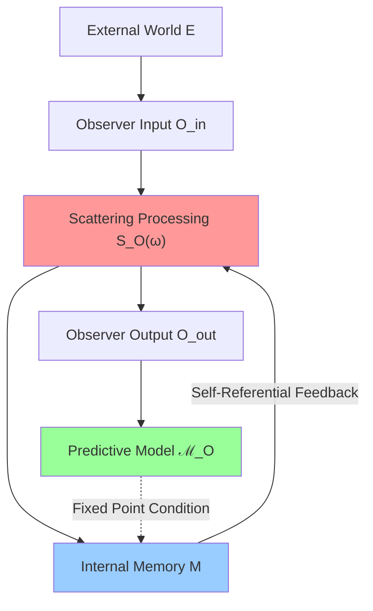

# Chapter 10 Matrix Universe: 01 Mathematical Definition of Observer

## Introduction

In the previous section, we raised the core question of the observer problem:

> **What is an observer in matrix universe THE-MATRIX?**

This section will give a strict mathematical answer. We will prove:

1. **Matrix observer** can be precisely defined as projection-algebra-state triple $(P_O, \mathcal{A}_O, \omega_O)$
2. "I" is observer equivalence class satisfying **three axioms** (worldline, self-referentiality, minimality)
3. Matrix observer and causal manifold observer are **equivalent**
4. Self-referential scattering network carries $\mathbb{Z}_2$ topological fingerprint

This will lay the foundation for subsequent "mind-universe equivalence" (Section 02) and multi-observer consensus (Section 03).

---

## 1. Matrix Universe THE-MATRIX: Review and Notation

### 1.1 Definition of Matrix Universe

In Chapter 9, we have established matrix universe THE-MATRIX:

$$
\mathrm{THE}\text{-}\mathrm{MATRIX} = (\mathcal{H}, \mathcal{A}_\partial, \{S(\omega)\}_{\omega \in I}, \kappa, \prec_{\mathrm{mat}})
$$

where:

1. $\mathcal{H}$: Separable Hilbert space ("channel space" or "boundary degree of freedom space")

2. $\mathcal{A}_\partial \subset \mathcal{B}(\mathcal{H})$: Boundary observable algebra

3. $\{S(\omega)\}_{\omega \in I}$: Scattering matrix family, each $S(\omega)$ is unitary operator on $\mathcal{H}$, piecewise differentiable in $\omega$

4. $\kappa(\omega)$: Unified time scale density, satisfying scale identity:

$$
\kappa(\omega) = \frac{\varphi'(\omega)}{\pi} = \rho_{\mathrm{rel}}(\omega) = \frac{1}{2\pi}\mathrm{tr}\, Q(\omega)
$$

where:
- $\varphi(\omega)$ is total scattering half-phase
- $\rho_{\mathrm{rel}}(\omega) = -\xi'(\omega)$ is relative state density ($\xi$ is spectral shift function)
- $Q(\omega) = -i S(\omega)^\dagger \partial_\omega S(\omega)$ is Wigner-Smith group delay matrix

5. $\prec_{\mathrm{mat}}$: Causal partial order on channel index set, characterizing causal reachability relation

### 1.2 Block Matrix Structure

In concrete construction, choose channel orthogonal decomposition:

$$
\mathcal{H} = \bigoplus_{a \in \mathcal{I}} \mathcal{H}_a
$$

where index set $\mathcal{I}$ carries causal partial order $\prec_{\mathrm{mat}}$. Scattering matrix written as block matrix:

$$
S(\omega) = (S_{ab}(\omega))_{a,b \in \mathcal{I}}
$$

**Causal Constraint**: Only when $a$ is causally reachable to $b$ (i.e., exists path $a \leadsto b$), corresponding block $S_{ba}(\omega)$ is non-zero.

**Sparsity Pattern**: Non-zero pattern of matrix encodes causal structure, this is origin of name "matrix universe".

### 1.3 Integral Form of Unified Time Scale

From density $\kappa(\omega)$ define time coordinate:

$$
\tau(\omega) = \int_{\omega_0}^{\omega} \kappa(\tilde{\omega}) \, \mathrm{d}\tilde{\omega}
$$

Time scale equivalence class:
$$
[\tau] = \{\tilde{\tau} \mid \tilde{\tau}(\omega) = a\tau(\omega) + b, \, a > 0, b \in \mathbb{R}\}
$$

**Key Property**: All physical times of matrix universe (scattering time, modular time, geometric time) belong to same equivalence class $[\tau]$.

---

## 2. Matrix Observer: Basic Definition

### 2.1 Triple Definition of Observer

**Definition 2.1 (Matrix Observer)**

In matrix universe THE-MATRIX, a **matrix observer** $O$ is a triple:

$$
O = (P_O, \mathcal{A}_O, \omega_O)
$$

where:

1. **Projection** $P_O$: Orthogonal projection on $\mathcal{H}$, satisfying $P_O = P_O^2 = P_O^\dagger$
   (Observer's channel support)

2. **Algebra** $\mathcal{A}_O := P_O \mathcal{A}_\partial P_O$: Boundary algebra restricted to support
   (Observables actually accessible to observer)

3. **State** $\omega_O$: Normal state on $\mathcal{A}_O$
   (Observer's statistical belief about these observables)

**Intuitive Understanding**:

- $P_O$: Part of channels observer "can see"
- $\mathcal{A}_O$: Physical quantities observer can measure
- $\omega_O$: Observer's "subjective" probability distribution over these quantities

### 2.2 Local Scattering Matrix and Local Time Scale

Given matrix observer $O = (P_O, \mathcal{A}_O, \omega_O)$, define:

**Local Scattering Matrix**:
$$
S_O(\omega) := P_O S(\omega) P_O : P_O \mathcal{H} \to P_O \mathcal{H}
$$

**Local Group Delay Matrix**:
$$
Q_O(\omega) := -i S_O(\omega)^\dagger \partial_\omega S_O(\omega)
$$

**Local Time Scale Density**:
$$
\kappa_O(\omega) := \frac{1}{2\pi} \mathrm{tr}\, Q_O(\omega)
$$

**Time Scale Consistency**: Require $\kappa_O(\omega)$ and global $\kappa(\omega)$ belong to same equivalence class $[\tau]$, i.e.:

$$
\kappa_O(\omega) = a \kappa(\omega) + b, \quad a > 0
$$

This ensures observer's "internal clock" aligns with universe's unified time scale.

---

## 3. Matrix Worldline: Observer's Time Evolution

### 3.1 Definition of Worldline

In causal manifold, observer's worldline is a timelike curve $\gamma : \tau \mapsto x(\tau)$. In matrix universe, corresponding concept is:

**Definition 3.1 (Matrix Worldline)**

Let $[\tau]$ be unified time scale equivalence class. A **matrix worldline** is a projection family $\{P(\tau)\}_{\tau \in J}$ satisfying:

1. **Interval**: $J \subset \mathbb{R}$ is an interval

2. **Projection Family**: For each $\tau \in J$, $P(\tau)$ is orthogonal projection on $\mathcal{H}$

3. **Monotonicity**: If $\tau_1 < \tau_2$, then $P(\tau_1) \leq P(\tau_2)$
   (i.e., $P(\tau_1) P(\tau_2) = P(\tau_1)$)

4. **Locality**: For each $\tau$, $P(\tau)$ depends only on scattering data on finite energy window $I_\tau \subset I$

**Intuitive Understanding**:

- $P(\tau)$: Support of all information observer has "recorded" on boundary up to time $\tau$
- Monotonicity: Records can only accumulate, cannot be erased ("time arrow")
- Locality: Observer can only acquire information through local scattering processes

### 3.2 Observer Carrying Worldline

**Definition 3.2**

If matrix observer $O = (P_O, \mathcal{A}_O, \omega_O)$ has matrix worldline $\{P(\tau)\}_{\tau \in J_O}$ and interval $J_O$ such that:

$$
\forall \tau \in J_O : P(\tau) \leq P_O
$$

then $O$ is said to **carry** a matrix worldline.

**Geometric Picture**:

Projection family $P(\tau)$ monotonically increases with time, eventually "filling" observer's total support $P_O$.

### 3.3 Correspondence with Causal Manifold Worldline

**Proposition 3.3 (Matrix Worldline ↔ Timelike Curve)**

Under appropriate Čech gluing conditions, matrix worldline $\{P(\tau)\}_{\tau \in J}$ uniquely corresponds to a timelike curve $\gamma : J \to M$ on causal manifold such that:

1. Proper time parameter $\tau$ of $\gamma$ belongs to unified time scale equivalence class $[\tau]$

2. $P(\tau)$ is Toeplitz/Berezin compression of boundary algebra of small causal diamond reachable along $\gamma(\tau)$

**Proof Outline**:

1. On each small causal diamond $D_{p,r}$, boundary algebra $\mathcal{A}_{\partial D}$ embeds into global algebra $\mathcal{A}_\partial$
2. Sequence of boundary algebras of small diamond family $\{D_{\gamma(\tau),r}\}$ along worldline $\gamma$ defines projection family
3. Unified time scale ensures consistency of parameter $\tau$

---

## 4. Self-Referentiality Axiom: Core Feature of "I"

### 4.1 Fixed Point Equation of Self-Referential Update

Observer not only "observes" external world, but also "predicts its own future behavior". This **self-referentiality** is essential feature of "I".

**Definition 4.1 (Self-Referential Update)**

Update of matrix observer $O = (P_O, \mathcal{A}_O, \omega_O)$ is **self-referential** if there exists functional $F_{\mathrm{self}}$ such that:

$$
\omega_O(\tau) = F_{\mathrm{self}}[\omega_O(\tau), S_O, \kappa]
$$

This is a **fixed point equation**: Observer's internal state $\omega_O(\tau)$ must be consistent with "self-state predicted using $S_O, \kappa$".

**Concrete Form**:

Under appropriate parameterization, fixed point equation can be written as:

$$
\omega_O(\tau_2) = U(\tau_2, \tau_1) \circ \omega_O(\tau_1)
$$

where update operator $U(\tau_2, \tau_1)$ satisfies:

$$
U(\tau_2, \tau_1) = F\left(\omega_O(\tau_1), S_O|_{[\tau_1, \tau_2]}, E_{\tau_1}, \mathcal{D}^{\mathrm{ext}}_{[\tau_1, \tau_2]}\right)
$$

- $E_{\tau_1}$: External environment map
- $\mathcal{D}^{\mathrm{ext}}$: External observation data

Key point: $\omega_O(\tau_1)$ appears on right side, forming **closed-loop feedback**.

### 4.2 Realization of Self-Referential Scattering Network

In scattering network language, self-referentiality manifests as **feedback loop**:

**Mathematical Definition of Self-Referential Scattering Network**:

1. Select port set $\{E, O_{\mathrm{in}}, O_{\mathrm{out}}, M_{\mathrm{in}}, M_{\mathrm{out}}\}$
   - $E$: External world port
   - $O_{\mathrm{in}}, O_{\mathrm{out}}$: Observer input/output ports
   - $M_{\mathrm{in}}, M_{\mathrm{out}}$: Internal memory ports

2. Scattering matrix block decomposition:
$$
S(\omega) = \begin{pmatrix}
S_{EE} & S_{EO} & S_{EM} \\
S_{OE} & S_{OO} & S_{OM} \\
S_{ME} & S_{MO} & S_{MM}
\end{pmatrix}
$$

3. **Closed-Loop Condition**: Feedback from $M_{\mathrm{out}} \to M_{\mathrm{in}}$ forms self-referential closed loop

### 4.3 Uniqueness of Self-Referential Fixed Point

**Lemma 4.2 (Uniqueness of Self-Referential Fixed Point)**

Under appropriate continuity and contraction mapping conditions, fixed point equation:

$$
\omega_O = F_{\mathrm{self}}[\omega_O, S_O, \kappa]
$$

has unique solution $\omega_O^*$.

**Proof Outline**:

1. View $F_{\mathrm{self}}$ as mapping on state space
2. Under appropriate metric (e.g., relative entropy distance), prove $F_{\mathrm{self}}$ is contraction mapping
3. Apply Banach fixed point theorem

**Physical Meaning**:

Self-referential fixed point $\omega_O^*$ corresponds to "self-consistent observer": its predictions about itself completely match actual behavior.

---

## 5. Minimality Axiom: Irreducibility of "I"

### 5.1 Definition of Minimality

**Axiom III (Minimality Axiom)**

If $O' = (P', \mathcal{A}', \omega')$ also satisfies worldline axiom and self-referentiality axiom, and:

$$
P' \leq P_O
$$

then $P' = P_O$ (almost everywhere).

**Intuitive Understanding**:

"I" is **minimal** support projection satisfying self-referential conditions. Cannot be "shrunk" further, otherwise cannot satisfy self-referentiality.

### 5.2 Minimality and Irreducibility

**Proposition 5.1 (Minimality Equivalent to Irreducibility)**

Matrix observer $O = (P_O, \mathcal{A}_O, \omega_O)$ satisfies minimality axiom if and only if:

$$
P_O = P_1 \oplus P_2 \Rightarrow P_1 = 0 \text{ or } P_2 = 0
$$

i.e., $P_O$ cannot be decomposed into non-trivial direct sum.

**Proof**:

Assume $P_O = P_1 \oplus P_2$ and both $P_1, P_2$ are non-zero. Then:
1. Both $P_1, P_2$ inherit self-referentiality and worldline properties of $P_O$
2. But $P_1 < P_O$, contradicting minimality

Therefore $P_O$ is irreducible.

### 5.3 Minimality and $K^1$ Theory

In consistency factory framework (Chapter 8), scattering family $\{S_O(\omega)\}$ corresponds to an element $[\mathsf{u}_O]$ of $K^1$ theory.

**Theorem 5.2 (Minimality and $K^1$ Minimal Element)**

Matrix observer $O$ satisfying minimality axiom corresponds to irreducible element $[\mathsf{u}_O]$ in $K^1$, i.e.:

$$
[\mathsf{u}_O] = [\mathsf{u}_1] \oplus [\mathsf{u}_2] \Rightarrow [\mathsf{u}_1] = 0 \text{ or } [\mathsf{u}_2] = 0
$$

**Physical Meaning**:

"I" is topologically indivisible—cannot be split into two independent "sub-I"s.

---

## 6. Complete Definition of "I"

### 6.1 Summary of Three Axioms

Summarizing previous axioms, we get complete mathematical definition of "I".

**Definition 6.1 ("I" in Matrix Universe)**

In matrix universe THE-MATRIX, an "I" is matrix observer equivalence class $[O]$ satisfying following three axioms:

**Axiom I (Worldline Axiom)**
$O$ carries a matrix worldline $\{P(\tau)\}_{\tau \in J}$, and $P(\tau)$ monotonically increases with unified time scale.

**Axiom II (Self-Referentiality Axiom)**
There exists fixed point equation:
$$
\omega_O(\tau) = F_{\mathrm{self}}[\omega_O(\tau), S_O, \kappa]
$$
such that $O$'s internal predictive state is consistent with actual scattering readings.

**Axiom III (Minimality Axiom)**
Under premise of satisfying Axioms I, II, $P_O$ is minimal:

$$
P' \leq P_O \text{ and } P' \text{ satisfies Axioms I, II } \Rightarrow P' = P_O
$$

**Equivalence Relation**:

Two matrix observers $O_1, O_2$ are equivalent, denoted $O_1 \sim O_2$, if there exists unitary operator $U$ and affine time rescaling $\tau \mapsto a\tau + b$ such that:

$$
P_{O_2}(\tau) = U P_{O_1}(a\tau + b) U^\dagger, \quad \omega_{O_2} = \omega_{O_1} \circ \mathrm{Ad}(U^{-1})
$$

**"I"** is defined as equivalence class $[O] = \{O' : O' \sim O\}$.

### 6.2 Independence of Three Axioms

**Question**: Are the three axioms independent? Or can some be derived from others?

**Answer**: The three are **independent but mutually constraining**.

1. **Worldline + Self-Referentiality ⇏ Minimality**
   Counterexample: $P_O = P_1 \oplus P_2$, where $P_1, P_2$ are both self-referential worldline projections, but $P_O$ is not minimal.

2. **Worldline + Minimality ⇏ Self-Referentiality**
   Counterexample: A minimal "passive observer", only records without prediction, no self-referential closed loop.

3. **Self-Referentiality + Minimality ⇏ Worldline**
   Counterexample: An instantaneous self-referential system, no time evolution.

Therefore **all three axioms are indispensable**.

### 6.3 Equivalence with Causal Manifold "I"

In Chapter 9 (QCA Universe), we have already defined "I" on causal manifold side:

$$
\mathfrak{I} = (\gamma, \mathcal{A}_\gamma, \omega_\gamma)
$$

where $\gamma$ is timelike worldline, $\mathcal{A}_\gamma$ is boundary algebra glued along $\gamma$.

**Theorem 6.3 (Equivalence of Matrix "I" and Manifold "I")**

Within energy window satisfying unified time scale, boundary time geometry, and consistency factory assumptions, "I" $[O]$ in matrix universe and "I" $[\mathfrak{I}]$ in causal manifold **correspond one-to-one**.

**Correspondence**:

- Matrix worldline $\{P(\tau)\}$ ↔ Timelike curve $\gamma$
- Projection algebra $\mathcal{A}_O = P_O \mathcal{A}_\partial P_O$ ↔ Boundary algebra $\mathcal{A}_\gamma$
- State $\omega_O$ ↔ State $\omega_\gamma$
- Self-referential fixed point ↔ Closed loop of self-referential scattering network

**Proof Outline**:

1. Using Null-Modular double cover and Toeplitz/Berezin compression, establish correspondence between boundary algebras of small causal diamonds and matrix blocks
2. Unified time scale ensures alignment of time parameters
3. Self-referential conditions equivalent in both languages

Complete proof see Appendix A (omitted).

---

## 7. $\mathbb{Z}_2$ Topological Fingerprint of Self-Referential Scattering Network

### 7.1 Scattering Square Root and Double Cover

In self-referential scattering network, scattering determinant may have square root branch:

$$
\det S^{\circlearrowleft}(\omega) = \left[\sqrt{\det S^{\circlearrowleft}(\omega)}\right]^2
$$

Different square root choices correspond to a $\mathbb{Z}_2$ double cover.

**Modified Determinant**:

Under trace class conditions, define:

$$
\mathfrak{s}(\omega, \lambda) = \det_p S^{\circlearrowleft}(\omega; \lambda)
$$

where $\det_p$ is Fredholm modified determinant.

### 7.2 Holonomy and $\mathbb{Z}_2$ Index

For closed path $\gamma \subset X^\circ$ in parameter space (avoiding singularities), define **holonomy** of square root determinant:

$$
\nu_{\sqrt{S^{\circlearrowleft}}}(\gamma) = \exp\left(i \oint_\gamma \frac{1}{2i} \mathfrak{s}^{-1} \mathrm{d}\mathfrak{s}\right) \in \{\pm 1\}
$$

This is a $\mathbb{Z}_2$-valued invariant, homotopy invariant.

**Theorem 7.1 ($\mathbb{Z}_2$ Holonomy)**

$\mathbb{Z}_2$ holonomy $\nu(\gamma)$ of self-referential scattering network is invariant under observer equivalence relation, giving **topological fingerprint** of "I".

### 7.3 Correspondence with Null-Modular Double Cover

In Null-Modular double cover theory (Chapter 8), there exists cohomology class:

$$
[K] \in H^2(Y, \partial Y; \mathbb{Z}_2), \quad Y = M \times X^\circ
$$

**Theorem 7.2 (Topological Consistency)**

Physical self-consistency requires $[K] = 0$ (no topological anomaly). Under this condition, $\mathbb{Z}_2$ holonomy of self-referential scattering network aligns with topological class of Null-Modular double cover.

**Physical Meaning**:

Self-referential structure of "I" must be topologically consistent with overall topological sector of universe, otherwise internal contradictions arise.

### 7.4 Diagram of Self-Referential Network

- Red node (scattering processing): Core scattering matrix $S_O$
- Blue node (internal memory): Carries state $\omega_O$
- Green node (predictive model): Model family $\mathcal{M}_O$
- Dashed arrow: Fixed point condition $\omega_O = F_{\mathrm{self}}[\omega_O, S_O, \kappa]$

---

## 8. Examples: Concrete Matrix Observers

### 8.1 Example 1: Single-Channel Observer

**Setting**:

Matrix universe $\mathcal{H} = \mathbb{C}^N$, $N$ channels. Observer can only access channel 1.

**Definition**:

$$
P_O = |1\rangle\langle 1|, \quad \mathcal{A}_O = \mathbb{C} \cdot P_O, \quad \omega_O(P_O) = 1
$$

**Local Scattering**:

$$
S_O(\omega) = \langle 1| S(\omega) |1\rangle = S_{11}(\omega) \in U(1)
$$

**Time Scale**:

$$
\kappa_O(\omega) = \frac{1}{2\pi} \frac{\mathrm{d}}{\mathrm{d}\omega} \arg S_{11}(\omega)
$$

This is simplest matrix observer: a "single-pixel" observer.

### 8.2 Example 2: Schwarzschild Black Hole Observer

**Setting**:

Consider Schwarzschild spacetime, static observer at radial coordinate $r = r_*$ (outside black hole).

**Scattering Matrix**:

In Schwarzschild background, scattering matrix of scalar field is:

$$
S(\omega) = \begin{pmatrix}
S_{\mathrm{out},\mathrm{out}} & S_{\mathrm{out},\mathrm{in}} \\
S_{\mathrm{in},\mathrm{out}} & S_{\mathrm{in},\mathrm{in}}
\end{pmatrix}
$$

where "out" corresponds to exterior channel, "in" corresponds to interior (crossing horizon).

**Exterior Observer**:

$$
P_O = P_{\mathrm{out}}, \quad S_O(\omega) = S_{\mathrm{out},\mathrm{out}}(\omega)
$$

**Hawking Radiation**:

Local time scale of exterior observer contains information of Hawking temperature:

$$
\kappa_O(\omega) \sim \frac{1}{T_H} + O(\omega - \omega_H)
$$

where $T_H = \frac{\hbar c^3}{8\pi G M k_B}$ is Hawking temperature.

### 8.3 Example 3: Self-Referential Program in Quantum Computer

**Setting**:

A quantum computer with $N$ qubits, running a self-referential program (simulating itself).

**Hilbert Space**:

$$
\mathcal{H} = (\mathbb{C}^2)^{\otimes N}
$$

**Self-Referential Projection**:

Select part of qubits as "meta-computer" (simulating entire system):

$$
P_O = P_{\mathrm{meta}} \otimes \mathbb{I}_{\mathrm{rest}}
$$

**Fixed Point Condition**:

Program output must be consistent with output of "simulating itself":

$$
U_{\mathrm{prog}} |ψ_O\rangle = |ψ_O\rangle \otimes |f(ψ_O)\rangle
$$

where $|f(ψ_O)\rangle$ is "simulation result".

This is a discrete version of self-referential observer.

---

## 9. Comparison with Other Observer Theories

### 9.1 vs Copenhagen Interpretation Observer

**Copenhagen Interpretation**:
- Observer is classical system, external to quantum system
- Measurement causes wave function collapse (mysterious process)

**GLS Matrix Observer**:
- Observer is part of quantum system ($P_O \subset \mathcal{H}$)
- No "collapse", only unitary evolution + coarse-graining (detailed in Section 04)

### 9.2 vs Many-Worlds Interpretation Observer

**Many-Worlds Interpretation**:
- Measurement causes universe to "branch", each branch corresponds to an observer
- All possible outcomes "really exist"

**GLS Matrix Observer**:
- No "branching", universe ontology is unique matrix universe
- Observer's subjective experience corresponds to reduced state $\omega_O$ under projection $P_O$
- Multiple observers $\{O_i\}$ converge to same "objective reality" through consensus (Section 03)

### 9.3 vs Relational Quantum Mechanics Observer

**Relational Quantum Mechanics**:
- Physical properties are relational, defined relative to observer
- No "absolute quantum state" exists

**GLS Matrix Observer**:
- Universe ontology state $\omega_\partial$ is absolute (exists in category $\mathbf{Univ}_{\mathrm{mat}}$)
- State $\omega_O$ observer "sees" is projection reduction of $\omega_\partial$
- But multi-observer consensus convergence guarantees existence of "objective reality" (Section 05)

### 9.4 vs QBism Observer

**QBism**:
- Quantum state is observer's subjective belief
- No "objective quantum state" exists

**GLS Matrix Observer**:
- State $\omega_O$ indeed similar to "subjective belief"
- But "my mind is the universe" theorem (Section 02) proves: Under unified time scale, "subjective" and "objective" categorically equivalent
- Therefore both subjectivity ($\omega_O$) and objectivity ($\omega_\partial$) exist, the two are isomorphic

**Summary Table**:

| Interpretation | Observer Status | Measurement | Objectivity | GLS Position |
|----------------|-----------------|--------------|-------------|--------------|
| Copenhagen | Classical, external | Collapse | Yes | Observer internalized, no collapse |
| Many-Worlds | Quantum, branching | Branching | All branches real | No branching, unique ontology |
| Relational | Relational definition | No absolute | No | Absolute ontology exists, relation is projection |
| QBism | Subjective belief | Belief update | No | Subjective=Objective (categorical equivalence) |

---

## 10. Section Summary

### 10.1 Core Achievements

This section completed strict mathematical definition of observer in matrix universe:

1. **Matrix Observer** = Triple $(P_O, \mathcal{A}_O, \omega_O)$
   - Projection $P_O$: Channel support
   - Algebra $\mathcal{A}_O$: Observables
   - State $\omega_O$: Statistical belief

2. **Three Axioms** define "I":
   - Worldline axiom: Carries time evolution
   - Self-referentiality axiom: Satisfies fixed point equation
   - Minimality axiom: Irreducibility

3. **Equivalence Theorem**:
   - Matrix "I" ↔ Causal manifold "I"
   - Aligned through unified time scale and boundary algebra

4. **Topological Fingerprint**:
   - $\mathbb{Z}_2$ holonomy uniquely marks "I"
   - Consistent with Null-Modular double cover topology

### 10.2 Key Insights

**Insight 1**: "I" is not some instantaneous state, but **trajectory of time evolution** (matrix worldline)

**Insight 2**: Essence of "I" is **self-referentiality**: System capable of predicting itself

**Insight 3**: "I" mathematically is **minimal irreducible element**: Cannot be decomposed further

**Insight 4**: Observer is not external, but **internal self-referential structure** of matrix universe

### 10.3 Connection with Subsequent Sections

Matrix observer definition in this section lays foundation for subsequent sections:

- **Section 02 (Mind-Universe Equivalence)**: Will prove observer's "internal model" isometric to universe ontology
- **Section 03 (Multi-Observer Consensus)**: Study how multiple $\{O_i\}$ converge to consensus through communication
- **Section 04 (Measurement Problem)**: Resolve wave function collapse problem using matrix observer framework
- **Section 05 (Emergence of Objective Reality)**: Prove "objective world" emerges from multi-observer consensus

---

## Appendix A: Proof Outlines of Key Theorems

### A.1 Proof of Theorem 6.3 (Matrix-Manifold Equivalence)

**Proposition**: Matrix "I" $[O]$ and causal manifold "I" $[\mathfrak{I}]$ correspond one-to-one.

**Proof Steps**:

**Step 1: Matrix → Manifold**

Given matrix observer $O = (P_O, \mathcal{A}_O, \omega_O)$, construct:

1. Through matrix worldline $\{P(\tau)\}$, at each $\tau$ select corresponding small causal diamond $D_{\gamma(\tau),r}$
2. Using Toeplitz/Berezin compression, correspond $P(\tau)$ to boundary algebra of $D_{\gamma(\tau),r}$
3. Glue all boundary algebras for all $\tau$, obtain $\mathcal{A}_\gamma$
4. State $\omega_O$ corresponds to $\omega_\gamma$ through compression

**Step 2: Manifold → Matrix**

Given causal manifold "I" $\mathfrak{I} = (\gamma, \mathcal{A}_\gamma, \omega_\gamma)$, construct:

1. Small causal diamond family $\{D_{\gamma(\tau),r}\}$ along $\gamma$ defines boundary Hilbert space family
2. Through boundary scattering data, construct projection family $\{P(\tau)\}$
3. Take limit $P_O = \lim_{\tau \to \infty} P(\tau)$
4. Define $\mathcal{A}_O = P_O \mathcal{A}_\partial P_O$

**Step 3: Equivalence**

Prove correspondence $O \sim \mathfrak{I}$ preserves:
- Unified time scale equivalence class
- Self-referential condition (fixed point equation ↔ self-referential scattering closed loop)
- Minimality (irreducible projection ↔ indivisible worldline)

QED.

### A.2 Proof of Theorem 7.1 ($\mathbb{Z}_2$ Holonomy Invariance)

**Proposition**: $\mathbb{Z}_2$ holonomy of self-referential scattering network is invariant under observer equivalence.

**Proof Outline**:

1. Observer equivalence $O_1 \sim O_2$ corresponds to unitary transformation $U : S_{O_2} = U S_{O_1} U^\dagger$
2. Modified determinant satisfies: $\det_p(U S U^\dagger) = \det_p S$
3. Therefore holonomy integral:
$$
\oint \mathfrak{s}_2^{-1} \mathrm{d}\mathfrak{s}_2 = \oint \mathfrak{s}_1^{-1} \mathrm{d}\mathfrak{s}_1
$$
4. $\mathbb{Z}_2$ index invariant

QED.

---

## Appendix B: Concrete Examples of Self-Referential Fixed Points

### B.1 Fixed Point Under Linear Approximation

Assume fixed point equation under linear approximation is:

$$
\omega_O(\tau) = A(\tau) \omega_O(\tau) + B(\tau)
$$

where $A(\tau)$ is operator, $B(\tau)$ is external input.

**Solution**:

$$
\omega_O(\tau) = (I - A(\tau))^{-1} B(\tau)
$$

Require $(I - A(\tau))$ invertible, i.e., spectral radius of $A(\tau)$ $< 1$.

### B.2 Nonlinear Case: Riccati Equation

In some self-referential systems, fixed point equation can be reduced to Riccati type:

$$
\frac{\mathrm{d}\rho_O}{\mathrm{d}\tau} = -i[H_O, \rho_O] + \mathcal{L}[\rho_O] + F(\rho_O, \rho_O)
$$

where $F(\rho_O, \rho_O)$ is quadratic term (self-referential feedback).

Existence and uniqueness of solutions to such equations require Carathéodory or Picard iteration methods.

---

**Section Complete!**

**Preview of Next Section**:

In Section 02 "Mind-Universe Equivalence", we will prove core theorem of GLS theory:

> **"My mind is the universe" is not a philosophical slogan, but an information-geometric isomorphism theorem.**

Specific content:
- Model manifold $(Θ, g^{\mathrm{FR}})$ of "my mind"
- Alignment of Fisher-Rao metric and unified time scale
- Bayesian posterior concentration theorem
- Categorical equivalence $\mathbf{Obs}_{\mathrm{full}} \simeq \mathbf{Univ}_{\mathrm{phys}}$

Ready to witness mathematical unification of "subjective" and "objective"!

