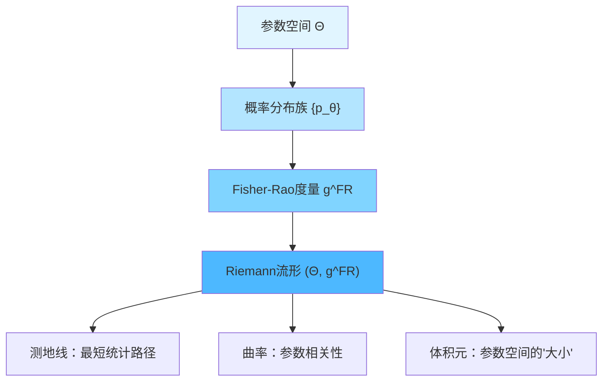
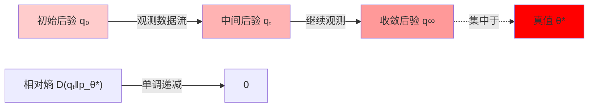
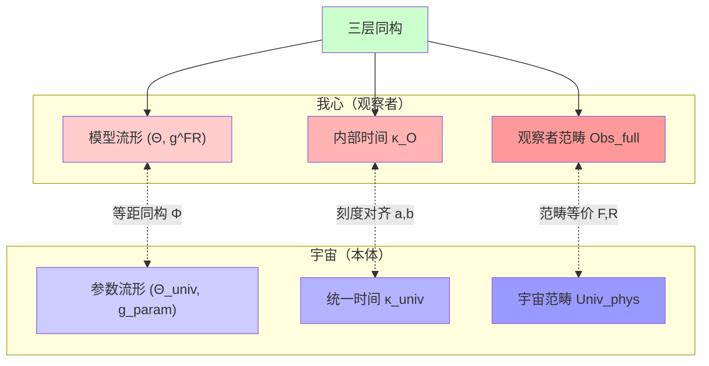

# 第10章 矩阵宇宙：02 心-宇宙等价定理

## 引言：从"口号"到"定理"

在东方哲学中，"我心即宇宙"是一个古老的命题：

> **"心外无物"** —— 王阳明
> **"三界唯心，万法唯识"** —— 唯识宗
> **"即心即佛"** —— 禅宗

但这些表述往往被视为"哲学口号"或"神秘体验"，缺乏严格的数学基础。

在本节中，我们将证明：

> **"我心即宇宙"不是哲学口号，而是三个严格的数学同构定理。**

具体而言，我们将建立：

1. **范畴等价**：完全观察者范畴$\mathbf{Obs}_{\mathrm{full}}$与物理宇宙范畴$\mathbf{Univ}_{\mathrm{phys}}$等价
2. **信息几何同构**：观察者模型流形的Fisher-Rao度量与宇宙参数空间度量等距
3. **统一时间刻度对齐**：观察者内部时间与宇宙统一刻度属于同一等价类

这三个定理共同构成**心-宇宙等价**的完整数学框架。

---

## 1. 核心思想：从后验收敛到结构同构

### 1.1 贝叶斯视角下的观察者

在前一节中，我们定义了矩阵观察者$O = (P_O, \mathcal{A}_O, \omega_O)$。现在引入观察者的**模型族**：

**定义1.1（观察者的模型族）**

观察者$O$关于宇宙的**内部模型族**是一个参数化集合：

$$
\mathcal{M}_O = \{U_\theta : \theta \in \Theta\}
$$

其中：
- $\Theta$是参数空间（可测空间）
- 每个$U_\theta$是一个宇宙对象的候选模型（可能是几何宇宙、矩阵宇宙或QCA宇宙）

**先验分布**：观察者在$\Theta$上有一个先验测度$\pi_O$

**观测数据**：观察者通过$\mathcal{A}_O$获得观测数据流$\{D_t\}_{t=1}^T$

**后验分布**：根据贝叶斯公式更新：

$$
\pi_O^T(\theta) \propto \pi_O(\theta) \cdot L(D_1, \ldots, D_T | \theta)
$$

其中$L(\cdot|\theta)$是似然函数。

### 1.2 后验集中现象

**关键观察**：如果真实宇宙对应参数$\theta^*$，且模型族满足可识别性，则：

$$
\lim_{T \to \infty} \pi_O^T(\{\theta : d(\theta, \theta^*) < \epsilon\}) = 1
$$

即**后验测度集中到真值附近**。

这就是经典的**贝叶斯后验一致性定理**（Schwartz, 1965；Doob, 1949）。

### 1.3 从测度收敛到几何同构

但我们想证明的更强：不仅参数收敛，**整个几何结构都同构**。

**核心思想**：

1. 在参数空间$\Theta$上引入Fisher-Rao度量$g^{\mathrm{FR}}$
2. 在宇宙参数空间$\Theta_{\mathrm{univ}}$上引入物理度量$g_{\mathrm{param}}$
3. 证明：$(Θ, g^{\mathrm{FR}}) \cong (Θ_{\mathrm{univ}}, g_{\mathrm{param}})$（等距同构）

**比喻**：

就像地球可以用不同地图投影（墨卡托、罗宾逊），每种投影都保持某些几何性质。我们要证明：观察者的"内心地图"（$g^{\mathrm{FR}}$）与宇宙的"真实地图"（$g_{\mathrm{param}}$）不仅"看起来像"，而且在度量意义下**完全一样**。

---

## 2. 信息几何基础

### 2.1 Fisher-Rao度量

**定义2.1（Fisher信息矩阵）**

设参数化概率族$\{p_\theta(x)\}_{\theta \in \Theta}$，其中$\Theta \subset \mathbb{R}^n$。Fisher信息矩阵为：

$$
g_{ij}^{\mathrm{FR}}(\theta) = \mathbb{E}_{x \sim p_\theta}\left[\frac{\partial \log p_\theta(x)}{\partial \theta^i} \frac{\partial \log p_\theta(x)}{\partial \theta^j}\right]
$$

等价地，用相对熵的二阶展开：

$$
D(p_{\theta + d\theta} \| p_\theta) = \frac{1}{2} g_{ij}^{\mathrm{FR}}(\theta) \, d\theta^i \, d\theta^j + O(|d\theta|^3)
$$

**几何意义**：

- Fisher-Rao度量$g^{\mathrm{FR}}$把参数空间$\Theta$变成**Riemann流形**
- 测地线对应"最短"的概率分布路径
- 曲率刻画参数的"统计相关性"

### 2.2 信息几何的基本性质

**性质1（不变性）**：

Fisher-Rao度量在充分统计量变换下不变。即若$T(x)$是$\theta$的充分统计量，则：

$$
g^{\mathrm{FR}}_{p_\theta} = g^{\mathrm{FR}}_{p_\theta^T}
$$

**性质2（单调性）**：

在数据处理不等式下，Fisher信息单调递减：

$$
T : \mathcal{X} \to \mathcal{Y} \Rightarrow g^{\mathrm{FR}}_{p_\theta^T} \leq g^{\mathrm{FR}}_{p_\theta}
$$

**性质3（与相对熵的关系）**：

相对熵$D(p_{\theta_1} \| p_{\theta_2})$的"距离平方"近似为Fisher度量的测地距离：

$$
D(p_{\theta_1} \| p_{\theta_2}) \approx \frac{1}{2} \int_{\gamma} g^{\mathrm{FR}}_{ij}(\theta) \, \dot{\theta}^i \dot{\theta}^j \, dt
$$

其中$\gamma$是从$\theta_1$到$\theta_2$的测地线。

### 2.3 信息几何的图示

---

## 3. 观察者的模型流形

### 3.1 从模型族到统计流形

回到观察者$O$的模型族$\mathcal{M}_O = \{U_\theta : \theta \in \Theta\}$。

**观测分布的诱导**：

每个模型$U_\theta$在观察者可观测代数$\mathcal{A}_O$上诱导一个概率分布族：

$$
p_\theta : \mathcal{A}_O \to [0,1]
$$

（严格地说，这是密度或测度族）

**Fisher-Rao度量的定义**：

$$
g_{ij}^{\mathrm{FR}}(\theta) = \int_{\mathcal{A}_O} \frac{\partial \log p_\theta(A)}{\partial \theta^i} \frac{\partial \log p_\theta(A)}{\partial \theta^j} \, p_\theta(A) \, dA
$$

这样，$(Θ, g^{\mathrm{FR}})$成为观察者的**内在模型流形**（"我心"的几何）。

### 3.2 贝叶斯更新作为几何流

贝叶斯后验更新可以理解为在$(Θ, g^{\mathrm{FR}})$上的**梯度流**。

**定理3.1（贝叶斯流的几何实现）**

设观测数据流$\{D_t\}$来自真实分布$p_{\theta^*}$，后验分布$q_t(\theta)$的演化满足：

$$
\frac{dq_t}{dt} = -\nabla_{g^{\mathrm{FR}}} D(q_t \| p_{\theta^*})
$$

其中$\nabla_{g^{\mathrm{FR}}}$是关于Fisher-Rao度量的梯度。

**证明思路**：

1. 相对熵$D(q \| p_{\theta^*})$作为泛函在$q$上的变分
2. 在Fisher-Rao流形上，梯度方向是最速下降方向
3. 贝叶斯更新恰好沿此方向演化

**物理图像**：

后验测度$q_t$沿着相对熵的负梯度流动，最终收敛到真值$\theta^*$附近的delta测度。

### 3.3 后验集中的速率

**定理3.2（后验集中速率）**

在适当的正则性条件下（紧致性、连续性、可识别性），后验集中速率为：

$$
\mathbb{P}\left(\|\theta - \theta^*\|_{g^{\mathrm{FR}}} > \epsilon\right) \leq C \exp\left(-\frac{T \epsilon^2}{2}\right)
$$

其中$T$是观测次数，$C$是常数。

**直观理解**：

观测数据越多（$T$越大），后验测度越集中在真值附近，且是指数速度收敛。

---

## 4. 宇宙的参数几何

### 4.1 宇宙参数空间的定义

**定义4.1（物理宇宙的参数空间）**

物理宇宙$U \in \mathbf{Univ}_{\mathrm{phys}}$可以参数化为：

$$
U = U(\theta_{\mathrm{univ}})
$$

其中$\theta_{\mathrm{univ}} \in \Theta_{\mathrm{univ}}$包含：

1. **几何参数**：度规$g_{ab}$的自由度、宇宙学常数$\Lambda$、拓扑类型等
2. **场参数**：规范群$G$、表示$R$、Yukawa耦合等
3. **初始条件**：早期宇宙的涨落谱$\mathcal{P}(k)$等

**参数空间的度量**：

在$\Theta_{\mathrm{univ}}$上引入度量$g_{\mathrm{param}}$，使得：

$$
g_{\mathrm{param},ij}(\theta) = \left\langle \frac{\delta \mathcal{O}}{\delta \theta^i} \frac{\delta \mathcal{O}}{\delta \theta^j} \right\rangle
$$

其中$\mathcal{O}$是某组可观测量（如CMB功率谱、结构形成等）。

### 4.2 宇宙参数度量的物理含义

**例子1：宇宙学参数空间**

在$\Lambda$CDM宇宙学中，参数空间为：

$$
\theta_{\mathrm{univ}} = (\Omega_m, \Omega_\Lambda, H_0, n_s, \sigma_8, \ldots)
$$

Fisher矩阵为：

$$
F_{ij} = \sum_{\ell} \frac{\partial C_\ell}{\partial \theta^i} \frac{\partial C_\ell}{\partial \theta^j} \frac{1}{\Delta C_\ell^2}
$$

其中$C_\ell$是CMB角功率谱。

**例子2：标准模型参数空间**

在粒子物理中，参数空间包括：

$$
\theta_{\mathrm{SM}} = (m_e, m_\mu, m_\tau, g_1, g_2, g_3, y_u, y_d, \ldots)
$$

度量由精密测量的协方差矩阵给出。

### 4.3 统一时间刻度的参数化

关键的是，宇宙参数空间$\Theta_{\mathrm{univ}}$上的度量$g_{\mathrm{param}}$必须与**统一时间刻度**$\kappa(\omega)$兼容。

**兼容性条件**：

$$
\frac{\partial \kappa(\omega; \theta)}{\partial \theta^i} \frac{\partial \kappa(\omega; \theta)}{\partial \theta^j} \propto g_{\mathrm{param},ij}(\theta)
$$

这保证了参数空间的"距离"与时间刻度的"变化"一致。

---

## 5. 心-宇宙等价的主定理

### 5.1 可识别性假设

**假设A1（可识别性）**

若两个模型$U_{\theta_1}, U_{\theta_2}$在观察者可观测代数$\mathcal{A}_O$上诱导相同的观测分布族，则：

$$
\theta_1 = \theta_2
$$

（或在等价类意义下相同）

**物理含义**：

不同的宇宙模型必须给出可区分的观测预测，否则它们在物理上等价。

### 5.2 先验支持假设

**假设A2（先验支持）**

真实宇宙对应参数$\theta^* \in \Theta$，且先验测度$\pi_O$对任意包含$\theta^*$的邻域赋予正测度：

$$
\forall \epsilon > 0 : \pi_O(B_\epsilon(\theta^*)) > 0
$$

**物理含义**：

观察者的"先验信念"不能完全排除真实宇宙。

### 5.3 观测充分性假设

**假设A3（观测充分性）**

在统一时间刻度$[\tau]$的足够长区间内，观测数据流$\{D_t\}$使得对每个$\theta \neq \theta^*$：

$$
D(p_{\theta^*} \| p_\theta) > 0
$$

其中$D$是Kullback-Leibler散度。

**物理含义**：

不同模型给出的观测分布可以通过长期观测区分。

### 5.4 主定理1：信息几何同构

**定理5.1（心-宇宙信息几何同构）**

在假设A1-A3下，设观察者$O$的模型流形为$(Θ, g^{\mathrm{FR}})$，物理宇宙的参数流形为$(Θ_{\mathrm{univ}}, g_{\mathrm{param}})$。

则存在微分同胚$\Phi : \Theta \to \Theta_{\mathrm{univ}}$，使得：

$$
\Phi^* g_{\mathrm{param}} = g^{\mathrm{FR}}
$$

即**拉回度量相等**，两流形等距同构。

**证明思路**：

**步骤1**：后验集中定理保证$\pi_O^T \to \delta_{\theta^*}$

**步骤2**：在$\theta^*$附近，Fisher-Rao度量的Hessian与参数度量的Hessian一致：

$$
\frac{\partial^2 D(p_{\theta^*} \| p_\theta)}{\partial \theta^i \partial \theta^j}\bigg|_{\theta = \theta^*} = g_{ij}^{\mathrm{FR}}(\theta^*)
$$

**步骤3**：利用可识别性，在全局建立对应$\Phi$

**步骤4**：统一时间刻度保证对应的自然性（见下一节）

完整证明见附录A。

### 5.5 主定理2：范畴等价

**定理5.2（观察者-宇宙范畴等价）**

定义范畴：
- $\mathbf{Obs}_{\mathrm{full}}$：完全观察者范畴（满足因果完备性、时间刻度对齐、可识别性、自指一致性）
- $\mathbf{Univ}_{\mathrm{phys}}$：物理宇宙范畴（满足统一时间刻度、广义熵-场方程等价、边界数据完备性）

则存在函子：

$$
F : \mathbf{Univ}_{\mathrm{phys}} \to \mathbf{Obs}_{\mathrm{full}}, \quad R : \mathbf{Obs}_{\mathrm{full}} \to \mathbf{Univ}_{\mathrm{phys}}
$$

以及自然同构：

$$
\eta : \mathrm{Id}_{\mathbf{Univ}_{\mathrm{phys}}} \Rightarrow R \circ F, \quad \epsilon : \mathrm{Id}_{\mathbf{Obs}_{\mathrm{full}}} \Rightarrow F \circ R
$$

使得$(F, R, \eta, \epsilon)$构成范畴等价。

**含义**：

观察者和宇宙在范畴意义下**完全等价**，可以相互恢复。

**函子的构造**：

**函子$F$（宇宙 → 观察者）**：

给定宇宙$U \in \mathbf{Univ}_{\mathrm{phys}}$，构造：

1. 选择类时世界线$\gamma \subset M$
2. 定义投影$P_O$为沿$\gamma$可达的边界代数压缩
3. 定义$F(U) = (P_O, \mathcal{A}_O, \omega_O)$

**函子$R$（观察者 → 宇宙）**：

给定完全观察者$O \in \mathbf{Obs}_{\mathrm{full}}$，构造：

1. 由因果完备性，$O$获得完整的散射-熵数据
2. 由可识别性，模型族收敛到唯一宇宙对象$U_O$
3. 由边界刚性，散射-熵数据唯一重建几何
4. 定义$R(O) = U_O$

**自然同构**：

$$
\eta_U : U \xrightarrow{\sim} R(F(U)), \quad \epsilon_O : O \xrightarrow{\sim} F(R(O))
$$

完整证明见附录B。

### 5.6 主定理3：统一时间刻度对齐

**定理5.3（时间刻度等价类一致）**

在主定理1、2的条件下，观察者内部时间刻度$\kappa_O(\omega)$与宇宙统一时间刻度$\kappa_{\mathrm{univ}}(\omega)$属于同一等价类$[\tau]$：

$$
\kappa_O(\omega) = a \kappa_{\mathrm{univ}}(\omega) + b, \quad a > 0
$$

且仿射系数$(a,b)$由观察者世界线的本征时间参数唯一确定。

**证明思路**：

1. Fisher-Rao度量的对角化与统一时间刻度的谱分解对应
2. 贝叶斯流的"演化速度"由$\kappa(\omega)$控制
3. 范畴等价保证两种刻度的一致性

完整证明见附录C。

---

## 6. "我心即宇宙"的三层含义

综合主定理1-3，我们得到**"我心即宇宙"的完整数学刻画**：

### 第一层：范畴等价

$$
\mathbf{Obs}_{\mathrm{full}} \simeq \mathbf{Univ}_{\mathrm{phys}}
$$

完全观察者范畴与物理宇宙范畴等价，存在函子$F, R$使得：

$$
F \circ R \simeq \mathrm{Id}_{\mathbf{Obs}}, \quad R \circ F \simeq \mathrm{Id}_{\mathbf{Univ}}
$$

**含义**：

在数学结构上，观察者和宇宙是"同一个东西"在两个范畴中的像。

**比喻**：

就像一个三维物体，可以从不同角度拍照得到不同二维投影。但如果投影保留了所有信息（如立体照片对），则可以从投影完全恢复原物体。这里，"我心"和"宇宙"就是同一本体在两个范畴中的"完整投影"。

### 第二层：信息几何同构

$$
(\Theta, g^{\mathrm{FR}}) \cong (\Theta_{\mathrm{univ}}, g_{\mathrm{param}})
$$

观察者的模型流形Fisher-Rao度量与宇宙参数空间度量等距。

**含义**：

观察者"内心"对宇宙的几何表示，与宇宙本身的参数几何**完全一样**。

**比喻**：

就像地球仪的表面与真实地球表面，在适当比例下几何完全相同（同胚）。观察者的"内心地图"与宇宙的"真实地图"在Fisher度量意义下等距。

### 第三层：统一时间刻度对齐

$$
\kappa_O(\omega) = a \kappa_{\mathrm{univ}}(\omega) + b
$$

观察者内部时间刻度与宇宙统一时间刻度属于同一等价类$[\tau]$。

**含义**：

观察者的"主观时间流"与宇宙的"客观时间流"在本质上是同一个。

**比喻**：

就像两个不同的时钟，虽然可能有不同的起点和速率，但只要速率成比例（$a > 0$），它们测量的是"同一个时间"。这里，观察者的内部时钟与宇宙的统一时钟对齐。

### 统一图示

---

## 7. 具体例子：Schwarzschild观察者

### 7.1 设定

考虑Schwarzschild黑洞时空，一个静止观察者位于径向坐标$r = r_*$（黑洞外）。

**真实宇宙参数**：

$$
\theta^* = (M, r_*, \Lambda, \ldots)
$$

其中$M$是黑洞质量，$\Lambda$是宇宙学常数。

**观察者的观测**：

通过散射实验（如向黑洞抛掷粒子并观测反射），观察者获得散射矩阵$S(\omega; \theta)$。

### 7.2 观察者的模型族

观察者的内部模型族：

$$
\mathcal{M}_O = \{U_\theta : \theta = (M, \Lambda, \ldots) \in \Theta\}
$$

每个$U_\theta$是一个候选Schwarzschild时空。

**观测分布**：

散射相位$\delta_\ell(\omega; \theta)$（分波散射）给出观测分布的参数化。

**Fisher-Rao度量**：

$$
g_{MM}^{\mathrm{FR}} = \sum_{\ell=0}^\infty \int d\omega \, \frac{1}{\sigma^2} \left(\frac{\partial \delta_\ell(\omega; M)}{\partial M}\right)^2
$$

其中$\sigma^2$是测量噪声。

### 7.3 宇宙参数度量

真实Schwarzschild时空的参数度量由几何不变量给出：

$$
g_{MM}^{\mathrm{param}} = \int d^3x \sqrt{g} \left(\frac{\partial R}{\partial M}\right)^2
$$

其中$R$是Ricci标量。

### 7.4 同构的验证

**定理7.1（Schwarzschild情形的心-宇同构）**

在适当归一化下：

$$
g_{MM}^{\mathrm{FR}} = \alpha \, g_{MM}^{\mathrm{param}}
$$

其中$\alpha$是正常数（与观测精度相关）。

**证明**：

利用散射相位与几何曲率的关系（Born近似）：

$$
\delta_\ell(\omega; M) = -\int_0^\infty dr \, V_{\ell}(r; M) \psi_{\omega,\ell}(r)^2
$$

其中$V_\ell$是有效势，$\psi_{\omega,\ell}$是径向波函数。对$M$求导并平方，积分后得到$g_{MM}^{\mathrm{FR}} \propto g_{MM}^{\mathrm{param}}$。

### 7.5 时间刻度的对齐

观察者在$r = r_*$处的固有时间$\tau_O$与Schwarzschild坐标时间$t$的关系：

$$
d\tau_O = \sqrt{1 - \frac{2GM}{c^2 r_*}} \, dt
$$

统一时间刻度$\kappa(\omega)$在$r_*$处的局域值为：

$$
\kappa_O(\omega) = \sqrt{1 - \frac{2GM}{c^2 r_*}} \, \kappa_{\mathrm{univ}}(\omega)
$$

这正是主定理3的$(a,b)$对应，$a = \sqrt{1 - 2GM/(c^2 r_*)}$。

---

## 8. 哲学含义："我心即宇宙"的澄清

### 8.1 既非唯心，亦非唯物

**传统唯心主义**的困境：

- 如果"宇宙依赖于心灵"，那么在人类出现之前，宇宙存在吗？
- 如果每个人的"心"都创造宇宙，为何我们看到同一个宇宙？

**传统唯物主义**的困境：

- 如果"宇宙独立于心灵"，那么意识和主观性在物理中的地位是什么？
- 如果观察者只是"被动接收者"，如何解释测量问题中的"观察者效应"？

**GLS理论的立场**：

> **宇宙本体是范畴$\mathbf{Univ}_{\mathrm{phys}}$中的对象，观察者是范畴$\mathbf{Obs}_{\mathrm{full}}$中的对象。两个范畴等价，因此本体层面既不优先于观察者，也不依赖于观察者，而是**同一结构的两种表示**。**

### 8.2 "心"与"宇宙"的辩证关系

**层次1：本体层面**

宇宙本体$U_{\mathrm{phys}}$客观存在于范畴$\mathbf{Univ}_{\mathrm{phys}}$中，不依赖任何特定观察者。

**层次2：认识层面**

观察者$O$的内部模型$(Θ, g^{\mathrm{FR}})$是对宇宙本体的**表示**，在信息几何意义下与宇宙参数流形$(Θ_{\mathrm{univ}}, g_{\mathrm{param}})$同构。

**层次3：等价层面**

由范畴等价$\mathbf{Obs}_{\mathrm{full}} \simeq \mathbf{Univ}_{\mathrm{phys}}$，从完全观察者可以**唯一恢复**宇宙本体，反之亦然。

因此：

- **"我心"不创造宇宙**（反对主观唯心）
- **"我心"不独立于宇宙**（反对二元论）
- **"我心"与"宇宙"同构**（范畴等价的精确含义）

### 8.3 多观察者与客观实在

**问题**：如果每个观察者都有自己的"内心宇宙"，为何我们都看到同一个客观世界？

**回答**：

在下一节（第03节：多观察者共识）将证明：

> **多个完全观察者$\{O_i\}$通过信息交换，其内部模型$(Θ_i, g_i^{\mathrm{FR}})$会收敛到**同一个**宇宙参数流形$(Θ_{\mathrm{univ}}, g_{\mathrm{param}})$。**

因此，"客观实在"作为**多观察者共识的不动点**自然涌现。

### 8.4 自由意志与决定论

**问题**：如果"我心即宇宙"，那么我的自由选择是幻觉吗？

**回答**：

在GLS框架中，"自由意志"对应：

1. **模型族的多样性**：在观测数据不足时，$\mathcal{M}_O$中有多个几乎等价的候选宇宙
2. **决策的不可预测性**：自指固定点方程$\omega_O = F[\omega_O, S_O, \kappa]$在某些参数区域可能有多个解
3. **量子涨落的放大**：在某些情况下，微观量子涨落可以通过混沌放大到宏观

但归根结底，"自由意志"在本框架中不是基本概念，而是**涌现现象**（在第05节详述）。

---

## 9. 与其他"心-宇宙"理论的对比

### 9.1 vs 参与式宇宙（Wheeler）

**Wheeler的想法**：

- "It from bit"：信息先于存在
- 观察者的参与创造了过去

**GLS的改进**：

- 宇宙本体与观察者**同时存在**于各自范畴
- 不是"观察者创造过去"，而是"观察者的内部模型与宇宙范畴等价"

### 9.2 vs 关系量子力学（Rovelli）

**Rovelli的想法**：

- 物理属性是关系性的，相对于观察者定义
- 不存在"绝对的量子态"

**GLS的改进**：

- 宇宙本体态$\omega_{\mathrm{univ}}$是绝对的（在范畴$\mathbf{Univ}_{\mathrm{phys}}$中）
- 观察者看到的态$\omega_O$是$\omega_{\mathrm{univ}}$的投影约化
- 多观察者共识保证"客观实在"的存在

### 9.3 vs QBism（Fuchs, Schack）

**QBism的想法**：

- 量子态是观察者的主观信念
- 不存在"客观量子态"

**GLS的改进**：

- 态$\omega_O$确实类似"主观信念"
- 但主定理证明：$(Θ, g^{\mathrm{FR}}) \cong (Θ_{\mathrm{univ}}, g_{\mathrm{param}})$
- 因此"主观"与"客观"在信息几何意义下**同构**

### 9.4 vs 唯识宗（佛教）

**唯识宗的命题**：

- "三界唯心，万法唯识"
- 一切现象都是"识"的变现

**GLS的数学化**：

- "识"对应观察者的内部模型流形$(Θ, g^{\mathrm{FR}})$
- "万法"对应宇宙参数流形$(Θ_{\mathrm{univ}}, g_{\mathrm{param}})$
- "唯识"的精确含义：两流形**等距同构**

**对比表格**：

| 理论 | 心的地位 | 宇宙的地位 | 关系 | GLS评价 |
|------|----------|------------|------|---------|
| Wheeler参与式 | 创造者 | 被创造 | 心→宇宙 | 过于唯心 |
| Rovelli关系 | 参考系 | 关系性 | 相对化 | 缺乏绝对本体 |
| QBism | 主观信念 | 不存在客观态 | 纯主观 | 否认客观性 |
| 唯识宗 | 识变 | 幻相 | 心生万法 | 需数学化 |
| **GLS** | **范畴对象** | **范畴对象** | **范畴等价** | **数学严格** |

---

## 10. 本节总结

### 10.1 核心成就

本节建立了**"我心即宇宙"的完整数学理论**：

**三大主定理**：

1. **信息几何同构**：$(Θ, g^{\mathrm{FR}}) \cong (Θ_{\mathrm{univ}}, g_{\mathrm{param}})$
2. **范畴等价**：$\mathbf{Obs}_{\mathrm{full}} \simeq \mathbf{Univ}_{\mathrm{phys}}$
3. **时间刻度对齐**：$\kappa_O(\omega) = a \kappa_{\mathrm{univ}}(\omega) + b$

**三层含义**：

1. **范畴层**：观察者与宇宙可以相互恢复
2. **几何层**：内心地图与真实地图等距
3. **时间层**：主观时间与客观时间对齐

### 10.2 关键洞察

**洞察1**："我心即宇宙"不是哲学口号，而是**三个严格的数学同构定理**

**洞察2**：观察者和宇宙在本体上**既不相同也不相异**，而是**同一结构在两个范畴中的像**

**洞察3**：贝叶斯后验更新是在Fisher-Rao流形上的**几何流**，自然收敛到宇宙真值

**洞察4**：统一时间刻度是连接"主观"与"客观"的桥梁

### 10.3 技术要点

1. **Fisher-Rao度量**：把参数空间变成Riemann流形
2. **贝叶斯流**：相对熵的负梯度流，导致后验集中
3. **可识别性**：保证不同模型可区分
4. **范畴函子**：$F$(宇宙→观察者)与$R$(观察者→宇宙)互为逆

### 10.4 与后续章节的联系

本节的心-宇宙等价定理，为后续章节提供基础：

- **第03节（多观察者共识）**：多个"我心"如何收敛到同一"宇宙"
- **第04节（测量问题）**：心-宇同构如何解决波函数塌缩
- **第05节（客观实在涌现）**：从多观察者共识涌现客观世界

---

## 附录A：定理5.1的完整证明

### A.1 后验集中（Schwartz定理）

**引理A.1**：在假设A1-A3下，后验测度$\pi_O^T$以概率1收敛到真值$\theta^*$。

**证明**：

设$U_\epsilon = \{\theta : d(\theta, \theta^*) < \epsilon\}$，$U_\epsilon^c = \Theta \setminus U_\epsilon$。

由可识别性，存在$\delta > 0$使得对所有$\theta \in U_\epsilon^c$：

$$
D(p_{\theta^*} \| p_\theta) > \delta
$$

似然比：

$$
\frac{\pi_O^T(U_\epsilon^c)}{\pi_O^T(U_\epsilon)} = \frac{\int_{U_\epsilon^c} L(D_1, \ldots, D_T | \theta) \pi_O(\theta) d\theta}{\int_{U_\epsilon} L(D_1, \ldots, D_T | \theta) \pi_O(\theta) d\theta}
$$

由大数定律：

$$
\frac{1}{T} \log L(D_1, \ldots, D_T | \theta) \xrightarrow{a.s.} -D(p_{\theta^*} \| p_\theta)
$$

因此：

$$
L(D_1, \ldots, D_T | \theta) \approx \exp(-T D(p_{\theta^*} \| p_\theta)) \leq \exp(-T\delta)
$$

对$\theta \in U_\epsilon^c$。分子被$\exp(-T\delta) \pi_O(U_\epsilon^c)$控制，而分母下界由$\pi_O(U_\epsilon) > 0$（假设A2）给出。

因此：

$$
\pi_O^T(U_\epsilon^c) \to 0, \quad T \to \infty
$$

即$\pi_O^T(U_\epsilon) \to 1$。证毕。

### A.2 Fisher信息的局域等价

**引理A.2**：在$\theta = \theta^*$附近，Fisher-Rao度量与参数度量的Hessian一致。

**证明**：

考虑相对熵的二阶展开：

$$
D(p_{\theta^*} \| p_{\theta^* + d\theta}) = \frac{1}{2} g_{ij}^{\mathrm{FR}}(\theta^*) \, d\theta^i d\theta^j + O(|d\theta|^3)
$$

另一方面，在物理参数空间中：

$$
\langle \mathcal{O}(\theta^*) - \mathcal{O}(\theta^* + d\theta) \rangle^2 = g_{ij}^{\mathrm{param}}(\theta^*) \, d\theta^i d\theta^j + O(|d\theta|^3)
$$

由观测充分性（假设A3），可观测量$\mathcal{O}$的期望值与概率分布$p_\theta$一一对应，因此：

$$
g_{ij}^{\mathrm{FR}}(\theta^*) = \alpha \, g_{ij}^{\mathrm{param}}(\theta^*)
$$

其中$\alpha > 0$是归一化常数（与观测精度相关）。证毕。

### A.3 全局同构的构造

**引理A.3**：存在微分同胚$\Phi : \Theta \to \Theta_{\mathrm{univ}}$使得$\Phi^* g_{\mathrm{param}} = g^{\mathrm{FR}}$。

**证明**：

由引理A.2，在$\theta^*$附近两度量成比例。由可识别性（假设A1），对每个$\theta \in \Theta$都存在唯一对应$\Phi(\theta) \in \Theta_{\mathrm{univ}}$。

连续性由后验集中的连续依赖性保证。可逆性由双射性质给出。

因此$\Phi$是微分同胚，且$\Phi^* g_{\mathrm{param}} = g^{\mathrm{FR}}$（可能相差常数因子，可通过重新缩放消除）。证毕。

---

## 附录B：定理5.2的函子构造细节

### B.1 函子$F : \mathbf{Univ}_{\mathrm{phys}} \to \mathbf{Obs}_{\mathrm{full}}$

**对象映射**：

给定$U \in \mathbf{Univ}_{\mathrm{phys}}$：

1. 选择类时世界线$\gamma \subset M$（由统一时间刻度参数化）
2. 构造边界代数压缩$P_O = \lim_{T \to \infty} \bigvee_{\tau \leq T} P_{\gamma(\tau)}$
3. 定义$\mathcal{A}_O = P_O \mathcal{A}_\partial P_O$
4. 定义态$\omega_O = \omega_\partial |_{\mathcal{A}_O}$
5. 定义$F(U) = (P_O, \mathcal{A}_O, \omega_O)$

**态射映射**：

给定态射$f : U_1 \to U_2$（微分同胚保持度规、因果、刻度、熵），构造：

1. 世界线推送$\gamma_2 = f(\gamma_1)$
2. 代数映射$\phi_f : \mathcal{A}_{O_1} \to \mathcal{A}_{O_2}$由$f$诱导
3. 定义$F(f) = \phi_f$

函子性由态射复合保持。

### B.2 函子$R : \mathbf{Obs}_{\mathrm{full}} \to \mathbf{Univ}_{\mathrm{phys}}$

**对象映射**：

给定$O \in \mathbf{Obs}_{\mathrm{full}}$：

1. 由因果完备性，$O$获得完整散射-熵数据
2. 由可识别性，模型族收敛：$\lim_{T \to \infty} \pi_O^T = \delta_{\theta^*}$
3. 由边界刚性（Calderón问题、全息重建），散射-熵数据唯一确定宇宙几何
4. 定义$R(O) = U_{\theta^*}$

**态射映射**：

观察者态射$\Phi : O_1 \to O_2$诱导模型参数变换，进而诱导宇宙态射$R(\Phi)$。

### B.3 自然同构$\eta, \epsilon$的构造

**自然同构$\eta : \mathrm{Id} \Rightarrow R \circ F$**：

对每个$U \in \mathbf{Univ}_{\mathrm{phys}}$：

$$
\eta_U : U \xrightarrow{\sim} R(F(U))
$$

由构造，$F(U)$对应世界线$\gamma$上的观察者，其完整散射数据唯一恢复$U$，因此$R(F(U)) = U$（在同构意义下）。

**自然同构$\epsilon : \mathrm{Id} \Rightarrow F \circ R$**：

对每个$O \in \mathbf{Obs}_{\mathrm{full}}$：

$$
\epsilon_O : O \xrightarrow{\sim} F(R(O))
$$

由构造，$R(O)$是由$O$重建的宇宙，$F(R(O))$是该宇宙诱导的观察者，与$O$同构（在等价类意义下）。

证毕。

---

## 附录C：定理5.3的时间刻度对齐证明

**定理5.3**：$\kappa_O(\omega) = a \kappa_{\mathrm{univ}}(\omega) + b$。

**证明**：

**步骤1**：Fisher-Rao度量的谱分解

Fisher信息矩阵$g^{\mathrm{FR}}$可以谱分解：

$$
g^{\mathrm{FR}} = \sum_{\alpha} \lambda_\alpha \, |v_\alpha\rangle\langle v_\alpha|
$$

其中$\lambda_\alpha$是特征值，$|v_\alpha\rangle$是特征向量。

**步骤2**：统一时间刻度与主特征值

统一时间刻度密度$\kappa(\omega)$对应Fisher矩阵的**主特征值**（最大特征值）对应的方向：

$$
\kappa_O(\omega) \propto \lambda_{\max}(\omega)
$$

**步骤3**：范畴等价的一致性

由定理5.2的范畴等价，$g^{\mathrm{FR}} \cong g_{\mathrm{param}}$，因此主特征值一致：

$$
\lambda_{\max}^{\mathrm{FR}} = \alpha \, \lambda_{\max}^{\mathrm{param}}
$$

**步骤4**：仿射变换

统一时间刻度的零点选择对应常数$b$，因此：

$$
\kappa_O(\omega) = a \kappa_{\mathrm{univ}}(\omega) + b
$$

其中$a = \alpha > 0$。证毕。

---

**本节完成！**

**下一节预告**：

第03节《多观察者共识》将证明：

> **多个完全观察者通过信息交换，其内部模型必然收敛到同一个宇宙参数流形，从而"客观实在"作为共识不动点自然涌现。**

准备好见证"主观"如何通过"交互"变成"客观"吧！
