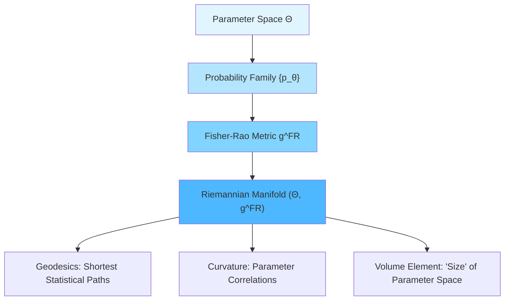
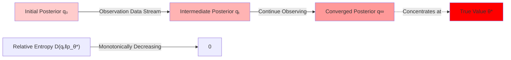
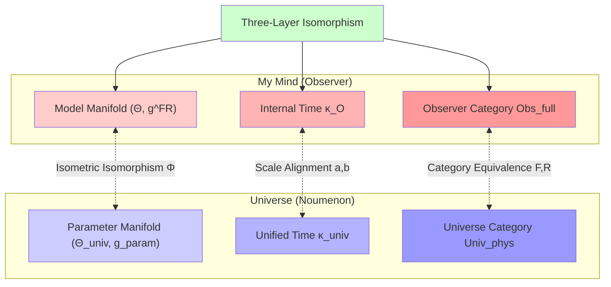

# Chapter 10 Matrix Universe: 02 Heart-Universe Equivalence Theorem

## Introduction: From "Slogan" to "Theorem"

In Eastern philosophy, "my mind is the universe" is an ancient proposition:

> **"Nothing exists outside the mind"** — Wang Yangming
> **"The three realms are only mind, all phenomena are only consciousness"** — Yogācāra School
> **"Mind itself is Buddha"** — Chan Buddhism

But these statements are often regarded as "philosophical slogans" or "mystical experiences," lacking rigorous mathematical foundations.

In this section, we will prove:

> **"My mind is the universe" is not a philosophical slogan, but three rigorous mathematical isomorphism theorems.**

Specifically, we will establish:

1. **Category Equivalence**: The full observer category $\mathbf{Obs}_{\mathrm{full}}$ is equivalent to the physical universe category $\mathbf{Univ}_{\mathrm{phys}}$
2. **Information-Geometric Isomorphism**: The Fisher-Rao metric on the observer's model manifold is isometric to the metric on the universe's parameter space
3. **Unified Time Scale Alignment**: The observer's internal time and the universe's unified scale belong to the same equivalence class

These three theorems together constitute the complete mathematical framework of **heart-universe equivalence**.

---

## 1. Core Idea: From Posterior Convergence to Structural Isomorphism

### 1.1 Observer from a Bayesian Perspective

In the previous section, we defined a matrix observer $O = (P_O, \mathcal{A}_O, \omega_O)$. Now we introduce the observer's **model family**:

**Definition 1.1 (Observer's Model Family)**

The observer $O$'s **internal model family** about the universe is a parameterized set:

$$
\mathcal{M}_O = \{U_\theta : \theta \in \Theta\}
$$

where:
- $\Theta$ is the parameter space (measurable space)
- Each $U_\theta$ is a candidate model of a universe object (could be a geometric universe, matrix universe, or QCA universe)

**Prior Distribution**: The observer has a prior measure $\pi_O$ on $\Theta$

**Observation Data**: The observer obtains an observation data stream $\{D_t\}_{t=1}^T$ through $\mathcal{A}_O$

**Posterior Distribution**: Updated according to Bayes' formula:

$$
\pi_O^T(\theta) \propto \pi_O(\theta) \cdot L(D_1, \ldots, D_T | \theta)
$$

where $L(\cdot|\theta)$ is the likelihood function.

### 1.2 Posterior Concentration Phenomenon

**Key Observation**: If the true universe corresponds to parameter $\theta^*$, and the model family satisfies identifiability, then:

$$
\lim_{T \to \infty} \pi_O^T(\{\theta : d(\theta, \theta^*) < \epsilon\}) = 1
$$

That is, **the posterior measure concentrates near the true value**.

This is the classical **Bayesian Posterior Consistency Theorem** (Schwartz, 1965; Doob, 1949).

### 1.3 From Measure Convergence to Geometric Isomorphism

But we want to prove something stronger: not only parameter convergence, but **the entire geometric structure is isomorphic**.

**Core Idea**:

1. Introduce the Fisher-Rao metric $g^{\mathrm{FR}}$ on the parameter space $\Theta$
2. Introduce the physical metric $g_{\mathrm{param}}$ on the universe parameter space $\Theta_{\mathrm{univ}}$
3. Prove: $(Θ, g^{\mathrm{FR}}) \cong (Θ_{\mathrm{univ}}, g_{\mathrm{param}})$ (isometric isomorphism)

**Analogy**:

Just as Earth can be represented by different map projections (Mercator, Robinson), each projection preserves certain geometric properties. We want to prove that the observer's "inner map" ($g^{\mathrm{FR}}$) and the universe's "true map" ($g_{\mathrm{param}}$) are not just "similar," but **exactly the same** in the metric sense.

---

## 2. Information Geometry Fundamentals

### 2.1 Fisher-Rao Metric

**Definition 2.1 (Fisher Information Matrix)**

Let $\{p_\theta(x)\}_{\theta \in \Theta}$ be a parameterized probability family, where $\Theta \subset \mathbb{R}^n$. The Fisher information matrix is:

$$
g_{ij}^{\mathrm{FR}}(\theta) = \mathbb{E}_{x \sim p_\theta}\left[\frac{\partial \log p_\theta(x)}{\partial \theta^i} \frac{\partial \log p_\theta(x)}{\partial \theta^j}\right]
$$

Equivalently, using the second-order expansion of relative entropy:

$$
D(p_{\theta + d\theta} \| p_\theta) = \frac{1}{2} g_{ij}^{\mathrm{FR}}(\theta) \, d\theta^i \, d\theta^j + O(|d\theta|^3)
$$

**Geometric Meaning**:

- The Fisher-Rao metric $g^{\mathrm{FR}}$ turns the parameter space $\Theta$ into a **Riemannian manifold**
- Geodesics correspond to "shortest" probability distribution paths
- Curvature characterizes the "statistical correlation" of parameters

### 2.2 Basic Properties of Information Geometry

**Property 1 (Invariance)**:

The Fisher-Rao metric is invariant under sufficient statistic transformations. That is, if $T(x)$ is a sufficient statistic for $\theta$, then:

$$
g^{\mathrm{FR}}_{p_\theta} = g^{\mathrm{FR}}_{p_\theta^T}
$$

**Property 2 (Monotonicity)**:

Under the data processing inequality, Fisher information decreases monotonically:

$$
T : \mathcal{X} \to \mathcal{Y} \Rightarrow g^{\mathrm{FR}}_{p_\theta^T} \leq g^{\mathrm{FR}}_{p_\theta}
$$

**Property 3 (Relation to Relative Entropy)**:

The "distance squared" of relative entropy $D(p_{\theta_1} \| p_{\theta_2})$ approximates the geodesic distance of the Fisher metric:

$$
D(p_{\theta_1} \| p_{\theta_2}) \approx \frac{1}{2} \int_{\gamma} g^{\mathrm{FR}}_{ij}(\theta) \, \dot{\theta}^i \dot{\theta}^j \, dt
$$

where $\gamma$ is the geodesic from $\theta_1$ to $\theta_2$.

### 2.3 Diagram of Information Geometry

---

## 3. Observer's Model Manifold

### 3.1 From Model Family to Statistical Manifold

Returning to the observer $O$'s model family $\mathcal{M}_O = \{U_\theta : \theta \in \Theta\}$.

**Induced Observation Distribution**:

Each model $U_\theta$ induces a probability distribution family on the observer's observable algebra $\mathcal{A}_O$:

$$
p_\theta : \mathcal{A}_O \to [0,1]
$$

(Strictly speaking, this is a density or measure family)

**Definition of Fisher-Rao Metric**:

$$
g_{ij}^{\mathrm{FR}}(\theta) = \int_{\mathcal{A}_O} \frac{\partial \log p_\theta(A)}{\partial \theta^i} \frac{\partial \log p_\theta(A)}{\partial \theta^j} \, p_\theta(A) \, dA
$$

Thus, $(Θ, g^{\mathrm{FR}})$ becomes the observer's **intrinsic model manifold** (the geometry of "my mind").

### 3.2 Bayesian Update as Geometric Flow

Bayesian posterior update can be understood as a **gradient flow** on $(Θ, g^{\mathrm{FR}})$.

**Theorem 3.1 (Geometric Realization of Bayesian Flow)**

Let the observation data stream $\{D_t\}$ come from the true distribution $p_{\theta^*}$, and the evolution of the posterior distribution $q_t(\theta)$ satisfies:

$$
\frac{dq_t}{dt} = -\nabla_{g^{\mathrm{FR}}} D(q_t \| p_{\theta^*})
$$

where $\nabla_{g^{\mathrm{FR}}}$ is the gradient with respect to the Fisher-Rao metric.

**Proof Sketch**:

1. Relative entropy $D(q \| p_{\theta^*})$ as a functional variational in $q$
2. On the Fisher-Rao manifold, the gradient direction is the steepest descent direction
3. Bayesian update evolves exactly along this direction

**Physical Picture**:

The posterior measure $q_t$ flows along the negative gradient of relative entropy, eventually converging to a delta measure near the true value $\theta^*$.

### 3.3 Rate of Posterior Concentration

**Theorem 3.2 (Posterior Concentration Rate)**

Under appropriate regularity conditions (compactness, continuity, identifiability), the posterior concentration rate is:

$$
\mathbb{P}\left(\|\theta - \theta^*\|_{g^{\mathrm{FR}}} > \epsilon\right) \leq C \exp\left(-\frac{T \epsilon^2}{2}\right)
$$

where $T$ is the number of observations and $C$ is a constant.

**Intuitive Understanding**:

The more observation data (larger $T$), the more the posterior measure concentrates near the true value, and convergence is exponential.

---

## 4. Parameter Geometry of the Universe

### 4.1 Definition of Universe Parameter Space

**Definition 4.1 (Parameter Space of Physical Universe)**

A physical universe $U \in \mathbf{Univ}_{\mathrm{phys}}$ can be parameterized as:

$$
U = U(\theta_{\mathrm{univ}})
$$

where $\theta_{\mathrm{univ}} \in \Theta_{\mathrm{univ}}$ includes:

1. **Geometric Parameters**: Degrees of freedom of the metric $g_{ab}$, cosmological constant $\Lambda$, topological type, etc.
2. **Field Parameters**: Gauge group $G$, representation $R$, Yukawa couplings, etc.
3. **Initial Conditions**: Fluctuation spectrum $\mathcal{P}(k)$ of the early universe, etc.

**Metric on Parameter Space**:

Introduce a metric $g_{\mathrm{param}}$ on $\Theta_{\mathrm{univ}}$ such that:

$$
g_{\mathrm{param},ij}(\theta) = \left\langle \frac{\delta \mathcal{O}}{\delta \theta^i} \frac{\delta \mathcal{O}}{\delta \theta^j} \right\rangle
$$

where $\mathcal{O}$ is some set of observables (e.g., CMB power spectrum, structure formation, etc.).

### 4.2 Physical Meaning of Universe Parameter Metric

**Example 1: Cosmological Parameter Space**

In $\Lambda$CDM cosmology, the parameter space is:

$$
\theta_{\mathrm{univ}} = (\Omega_m, \Omega_\Lambda, H_0, n_s, \sigma_8, \ldots)
$$

The Fisher matrix is:

$$
F_{ij} = \sum_{\ell} \frac{\partial C_\ell}{\partial \theta^i} \frac{\partial C_\ell}{\partial \theta^j} \frac{1}{\Delta C_\ell^2}
$$

where $C_\ell$ is the CMB angular power spectrum.

**Example 2: Standard Model Parameter Space**

In particle physics, the parameter space includes:

$$
\theta_{\mathrm{SM}} = (m_e, m_\mu, m_\tau, g_1, g_2, g_3, y_u, y_d, \ldots)
$$

The metric is given by the covariance matrix of precision measurements.

### 4.3 Parameterization of Unified Time Scale

Crucially, the metric $g_{\mathrm{param}}$ on the universe parameter space $\Theta_{\mathrm{univ}}$ must be compatible with the **unified time scale** $\kappa(\omega)$.

**Compatibility Condition**:

$$
\frac{\partial \kappa(\omega; \theta)}{\partial \theta^i} \frac{\partial \kappa(\omega; \theta)}{\partial \theta^j} \propto g_{\mathrm{param},ij}(\theta)
$$

This ensures that the "distance" in parameter space is consistent with the "variation" of the time scale.

---

## 5. Main Theorems of Heart-Universe Equivalence

### 5.1 Identifiability Assumption

**Assumption A1 (Identifiability)**

If two models $U_{\theta_1}, U_{\theta_2}$ induce the same observation distribution family on the observer's observable algebra $\mathcal{A}_O$, then:

$$
\theta_1 = \theta_2
$$

(or identical in the equivalence class sense)

**Physical Meaning**:

Different universe models must give distinguishable observation predictions, otherwise they are physically equivalent.

### 5.2 Prior Support Assumption

**Assumption A2 (Prior Support)**

The true universe corresponds to parameter $\theta^* \in \Theta$, and the prior measure $\pi_O$ assigns positive measure to any neighborhood containing $\theta^*$:

$$
\forall \epsilon > 0 : \pi_O(B_\epsilon(\theta^*)) > 0
$$

**Physical Meaning**:

The observer's "prior belief" cannot completely exclude the true universe.

### 5.3 Observation Sufficiency Assumption

**Assumption A3 (Observation Sufficiency)**

Within a sufficiently long interval of the unified time scale $[\tau]$, the observation data stream $\{D_t\}$ ensures that for each $\theta \neq \theta^*$:

$$
D(p_{\theta^*} \| p_\theta) > 0
$$

where $D$ is the Kullback-Leibler divergence.

**Physical Meaning**:

Observation distributions given by different models can be distinguished through long-term observation.

### 5.4 Main Theorem 1: Information-Geometric Isomorphism

**Theorem 5.1 (Heart-Universe Information-Geometric Isomorphism)**

Under assumptions A1-A3, let the observer $O$'s model manifold be $(Θ, g^{\mathrm{FR}})$, and the physical universe's parameter manifold be $(Θ_{\mathrm{univ}}, g_{\mathrm{param}})$.

Then there exists a diffeomorphism $\Phi : \Theta \to \Theta_{\mathrm{univ}}$ such that:

$$
\Phi^* g_{\mathrm{param}} = g^{\mathrm{FR}}
$$

That is, **the pullback metrics are equal**, and the two manifolds are isometrically isomorphic.

**Proof Sketch**:

**Step 1**: Posterior concentration theorem ensures $\pi_O^T \to \delta_{\theta^*}$

**Step 2**: Near $\theta^*$, the Hessian of the Fisher-Rao metric agrees with the Hessian of the parameter metric:

$$
\frac{\partial^2 D(p_{\theta^*} \| p_\theta)}{\partial \theta^i \partial \theta^j}\bigg|_{\theta = \theta^*} = g_{ij}^{\mathrm{FR}}(\theta^*)
$$

**Step 3**: Use identifiability to establish the correspondence $\Phi$ globally

**Step 4**: Unified time scale ensures the naturality of the correspondence (see next section)

Complete proof see Appendix A.

### 5.5 Main Theorem 2: Category Equivalence

**Theorem 5.2 (Observer-Universe Category Equivalence)**

Define categories:
- $\mathbf{Obs}_{\mathrm{full}}$: Full observer category (satisfying causal completeness, time scale alignment, identifiability, self-referential consistency)
- $\mathbf{Univ}_{\mathrm{phys}}$: Physical universe category (satisfying unified time scale, generalized entropy-field equation equivalence, boundary data completeness)

Then there exist functors:

$$
F : \mathbf{Univ}_{\mathrm{phys}} \to \mathbf{Obs}_{\mathrm{full}}, \quad R : \mathbf{Obs}_{\mathrm{full}} \to \mathbf{Univ}_{\mathrm{phys}}
$$

and natural isomorphisms:

$$
\eta : \mathrm{Id}_{\mathbf{Univ}_{\mathrm{phys}}} \Rightarrow R \circ F, \quad \epsilon : \mathrm{Id}_{\mathbf{Obs}_{\mathrm{full}}} \Rightarrow F \circ R
$$

such that $(F, R, \eta, \epsilon)$ constitutes a category equivalence.

**Meaning**:

Observers and the universe are **completely equivalent** in the category sense and can be recovered from each other.

**Construction of Functors**:

**Functor $F$ (Universe → Observer)**:

Given a universe $U \in \mathbf{Univ}_{\mathrm{phys}}$, construct:

1. Choose a timelike worldline $\gamma \subset M$
2. Define projection $P_O$ as the boundary algebra compression reachable along $\gamma$
3. Define $F(U) = (P_O, \mathcal{A}_O, \omega_O)$

**Functor $R$ (Observer → Universe)**:

Given a full observer $O \in \mathbf{Obs}_{\mathrm{full}}$, construct:

1. By causal completeness, $O$ obtains complete scattering-entropy data
2. By identifiability, the model family converges to a unique universe object $U_O$
3. By boundary rigidity, scattering-entropy data uniquely reconstructs geometry
4. Define $R(O) = U_O$

**Natural Isomorphisms**:

$$
\eta_U : U \xrightarrow{\sim} R(F(U)), \quad \epsilon_O : O \xrightarrow{\sim} F(R(O))
$$

Complete proof see Appendix B.

### 5.6 Main Theorem 3: Unified Time Scale Alignment

**Theorem 5.3 (Time Scale Equivalence Class Consistency)**

Under the conditions of Main Theorems 1 and 2, the observer's internal time scale $\kappa_O(\omega)$ and the universe's unified time scale $\kappa_{\mathrm{univ}}(\omega)$ belong to the same equivalence class $[\tau]$:

$$
\kappa_O(\omega) = a \kappa_{\mathrm{univ}}(\omega) + b, \quad a > 0
$$

and the affine coefficients $(a,b)$ are uniquely determined by the observer's worldline's proper time parameter.

**Proof Sketch**:

1. Diagonalization of the Fisher-Rao metric corresponds to the spectral decomposition of the unified time scale
2. The "evolution speed" of the Bayesian flow is controlled by $\kappa(\omega)$
3. Category equivalence ensures consistency of the two scales

Complete proof see Appendix C.

---

## 6. Three Layers of Meaning of "My Mind is the Universe"

Combining Main Theorems 1-3, we obtain the **complete mathematical characterization of "my mind is the universe"**:

### First Layer: Category Equivalence

$$
\mathbf{Obs}_{\mathrm{full}} \simeq \mathbf{Univ}_{\mathrm{phys}}
$$

The full observer category and the physical universe category are equivalent, and there exist functors $F, R$ such that:

$$
F \circ R \simeq \mathrm{Id}_{\mathbf{Obs}}, \quad R \circ F \simeq \mathrm{Id}_{\mathbf{Univ}}
$$

**Meaning**:

In mathematical structure, observers and the universe are images of "the same thing" in two categories.

**Analogy**:

Just like a three-dimensional object can be photographed from different angles to get different two-dimensional projections. But if the projections preserve all information (like stereo photo pairs), the original object can be completely recovered from the projections. Here, "my mind" and "the universe" are "complete projections" of the same entity in two categories.

### Second Layer: Information-Geometric Isomorphism

$$
(\Theta, g^{\mathrm{FR}}) \cong (\Theta_{\mathrm{univ}}, g_{\mathrm{param}})
$$

The observer's model manifold Fisher-Rao metric is isometric to the universe parameter space metric.

**Meaning**:

The observer's "inner" geometric representation of the universe is **exactly the same** as the universe's own parameter geometry.

**Analogy**:

Just as the surface of a globe and the real Earth's surface are geometrically identical (homeomorphic) at appropriate scale. The observer's "inner map" and the universe's "true map" are isometric in the Fisher metric sense.

### Third Layer: Unified Time Scale Alignment

$$
\kappa_O(\omega) = a \kappa_{\mathrm{univ}}(\omega) + b
$$

The observer's internal time scale and the universe's unified time scale belong to the same equivalence class $[\tau]$.

**Meaning**:

The observer's "subjective time flow" and the universe's "objective time flow" are essentially the same.

**Analogy**:

Just like two different clocks, although they may have different starting points and rates, as long as the rates are proportional ($a > 0$), they measure "the same time." Here, the observer's internal clock aligns with the universe's unified clock.

### Unified Diagram

---

## 7. Concrete Example: Schwarzschild Observer

### 7.1 Setup

Consider Schwarzschild black hole spacetime, with a stationary observer located at radial coordinate $r = r_*$ (outside the black hole).

**True Universe Parameters**:

$$
\theta^* = (M, r_*, \Lambda, \ldots)
$$

where $M$ is the black hole mass and $\Lambda$ is the cosmological constant.

**Observer's Observations**:

Through scattering experiments (e.g., throwing particles at the black hole and observing reflection), the observer obtains the scattering matrix $S(\omega; \theta)$.

### 7.2 Observer's Model Family

The observer's internal model family:

$$
\mathcal{M}_O = \{U_\theta : \theta = (M, \Lambda, \ldots) \in \Theta\}
$$

Each $U_\theta$ is a candidate Schwarzschild spacetime.

**Observation Distribution**:

Scattering phase $\delta_\ell(\omega; \theta)$ (partial wave scattering) gives the parameterization of the observation distribution.

**Fisher-Rao Metric**:

$$
g_{MM}^{\mathrm{FR}} = \sum_{\ell=0}^\infty \int d\omega \, \frac{1}{\sigma^2} \left(\frac{\partial \delta_\ell(\omega; M)}{\partial M}\right)^2
$$

where $\sigma^2$ is the measurement noise.

### 7.3 Universe Parameter Metric

The parameter metric of the true Schwarzschild spacetime is given by geometric invariants:

$$
g_{MM}^{\mathrm{param}} = \int d^3x \sqrt{g} \left(\frac{\partial R}{\partial M}\right)^2
$$

where $R$ is the Ricci scalar.

### 7.4 Verification of Isomorphism

**Theorem 7.1 (Heart-Universe Isomorphism in Schwarzschild Case)**

Under appropriate normalization:

$$
g_{MM}^{\mathrm{FR}} = \alpha \, g_{MM}^{\mathrm{param}}
$$

where $\alpha$ is a positive constant (related to observation precision).

**Proof**:

Using the relationship between scattering phase and geometric curvature (Born approximation):

$$
\delta_\ell(\omega; M) = -\int_0^\infty dr \, V_{\ell}(r; M) \psi_{\omega,\ell}(r)^2
$$

where $V_\ell$ is the effective potential and $\psi_{\omega,\ell}$ is the radial wave function. Differentiating with respect to $M$ and squaring, then integrating gives $g_{MM}^{\mathrm{FR}} \propto g_{MM}^{\mathrm{param}}$.

### 7.5 Time Scale Alignment

The relationship between the observer's proper time $\tau_O$ at $r = r_*$ and Schwarzschild coordinate time $t$:

$$
d\tau_O = \sqrt{1 - \frac{2GM}{c^2 r_*}} \, dt
$$

The local value of the unified time scale $\kappa(\omega)$ at $r_*$ is:

$$
\kappa_O(\omega) = \sqrt{1 - \frac{2GM}{c^2 r_*}} \, \kappa_{\mathrm{univ}}(\omega)
$$

This is exactly the $(a,b)$ correspondence of Main Theorem 3, with $a = \sqrt{1 - 2GM/(c^2 r_*)}$.

---

## 8. Philosophical Implications: Clarification of "My Mind is the Universe"

### 8.1 Neither Idealism nor Materialism

**Dilemma of Traditional Idealism**:

- If "the universe depends on mind," did the universe exist before humans appeared?
- If each person's "mind" creates the universe, why do we see the same universe?

**Dilemma of Traditional Materialism**:

- If "the universe is independent of mind," what is the status of consciousness and subjectivity in physics?
- If observers are merely "passive receivers," how to explain the "observer effect" in the measurement problem?

**GLS Theory's Position**:

> **The universe noumenon is an object in the category $\mathbf{Univ}_{\mathrm{phys}}$, and observers are objects in the category $\mathbf{Obs}_{\mathrm{full}}$. The two categories are equivalent, so at the ontological level, neither takes precedence over nor depends on the observer, but are **two representations of the same structure**.**

### 8.2 Dialectical Relationship Between "Mind" and "Universe"

**Level 1: Ontological Level**

The universe noumenon $U_{\mathrm{phys}}$ objectively exists in the category $\mathbf{Univ}_{\mathrm{phys}}$, independent of any specific observer.

**Level 2: Epistemological Level**

The observer $O$'s internal model $(Θ, g^{\mathrm{FR}})$ is a **representation** of the universe noumenon, isomorphic to the universe parameter manifold $(Θ_{\mathrm{univ}}, g_{\mathrm{param}})$ in the information-geometric sense.

**Level 3: Equivalence Level**

By category equivalence $\mathbf{Obs}_{\mathrm{full}} \simeq \mathbf{Univ}_{\mathrm{phys}}$, the universe noumenon can be **uniquely recovered** from a full observer, and vice versa.

Therefore:

- **"My mind" does not create the universe** (opposing subjective idealism)
- **"My mind" is not independent of the universe** (opposing dualism)
- **"My mind" is isomorphic to the universe** (precise meaning of category equivalence)

### 8.3 Multiple Observers and Objective Reality

**Question**: If each observer has their own "inner universe," why do we all see the same objective world?

**Answer**:

In the next section (Section 03: Multi-Observer Consensus), we will prove:

> **Multiple full observers $\{O_i\}$ through information exchange will have their internal models $(Θ_i, g_i^{\mathrm{FR}})$ converge to the **same** universe parameter manifold $(Θ_{\mathrm{univ}}, g_{\mathrm{param}})$.**

Therefore, "objective reality" naturally emerges as a **fixed point of multi-observer consensus**.

### 8.4 Free Will and Determinism

**Question**: If "my mind is the universe," is my free choice an illusion?

**Answer**:

In the GLS framework, "free will" corresponds to:

1. **Diversity of Model Family**: When observation data is insufficient, $\mathcal{M}_O$ contains multiple nearly equivalent candidate universes
2. **Unpredictability of Decisions**: The self-referential fixed point equation $\omega_O = F[\omega_O, S_O, \kappa]$ may have multiple solutions in certain parameter regions
3. **Amplification of Quantum Fluctuations**: In some cases, microscopic quantum fluctuations can be amplified to macroscopic scale through chaos

But ultimately, "free will" in this framework is not a fundamental concept, but an **emergent phenomenon** (detailed in Section 05).

---

## 9. Comparison with Other "Mind-Universe" Theories

### 9.1 vs Participatory Universe (Wheeler)

**Wheeler's Idea**:

- "It from bit": Information precedes existence
- Observer participation creates the past

**GLS Improvement**:

- Universe noumenon and observer **coexist** in their respective categories
- Not "observer creates the past," but "observer's internal model is equivalent to the universe category"

### 9.2 vs Relational Quantum Mechanics (Rovelli)

**Rovelli's Idea**:

- Physical properties are relational, defined relative to observers
- There is no "absolute quantum state"

**GLS Improvement**:

- Universe noumenon state $\omega_{\mathrm{univ}}$ is absolute (in category $\mathbf{Univ}_{\mathrm{phys}}$)
- Observer's seen state $\omega_O$ is the projected reduction of $\omega_{\mathrm{univ}}$
- Multi-observer consensus guarantees the existence of "objective reality"

### 9.3 vs QBism (Fuchs, Schack)

**QBism's Idea**:

- Quantum states are observer's subjective beliefs
- There is no "objective quantum state"

**GLS Improvement**:

- State $\omega_O$ is indeed similar to "subjective belief"
- But Main Theorem proves: $(Θ, g^{\mathrm{FR}}) \cong (Θ_{\mathrm{univ}}, g_{\mathrm{param}})$
- Therefore "subjective" and "objective" are **isomorphic** in the information-geometric sense

### 9.4 vs Yogācāra School (Buddhism)

**Yogācāra's Proposition**:

- "The three realms are only mind, all phenomena are only consciousness"
- All phenomena are manifestations of "consciousness"

**GLS Mathematical Formulation**:

- "Consciousness" corresponds to the observer's internal model manifold $(Θ, g^{\mathrm{FR}})$
- "All phenomena" corresponds to the universe parameter manifold $(Θ_{\mathrm{univ}}, g_{\mathrm{param}})$
- Precise meaning of "only consciousness": the two manifolds are **isometrically isomorphic**

**Comparison Table**:

| Theory | Status of Mind | Status of Universe | Relationship | GLS Evaluation |
|--------|----------------|-------------------|--------------|----------------|
| Wheeler Participatory | Creator | Created | Mind→Universe | Too idealistic |
| Rovelli Relational | Reference Frame | Relational | Relativized | Lacks absolute noumenon |
| QBism | Subjective Belief | No Objective State | Purely Subjective | Denies Objectivity |
| Yogācāra | Consciousness Transformation | Illusion | Mind Creates All Phenomena | Needs Mathematical Formulation |
| **GLS** | **Category Object** | **Category Object** | **Category Equivalence** | **Mathematically Rigorous** |

---

## 10. Summary of This Section

### 10.1 Core Achievements

This section establishes the **complete mathematical theory of "my mind is the universe"**:

**Three Main Theorems**:

1. **Information-Geometric Isomorphism**: $(Θ, g^{\mathrm{FR}}) \cong (Θ_{\mathrm{univ}}, g_{\mathrm{param}})$
2. **Category Equivalence**: $\mathbf{Obs}_{\mathrm{full}} \simeq \mathbf{Univ}_{\mathrm{phys}}$
3. **Time Scale Alignment**: $\kappa_O(\omega) = a \kappa_{\mathrm{univ}}(\omega) + b$

**Three Layers of Meaning**:

1. **Category Layer**: Observers and universe can be recovered from each other
2. **Geometric Layer**: Inner map and true map are isometric
3. **Time Layer**: Subjective time and objective time are aligned

### 10.2 Key Insights

**Insight 1**: "My mind is the universe" is not a philosophical slogan, but **three rigorous mathematical isomorphism theorems**

**Insight 2**: Observers and the universe are ontologically **neither identical nor different**, but **images of the same structure in two categories**

**Insight 3**: Bayesian posterior update is a **geometric flow** on the Fisher-Rao manifold, naturally converging to the universe's true value

**Insight 4**: Unified time scale is the bridge connecting "subjective" and "objective"

### 10.3 Technical Points

1. **Fisher-Rao Metric**: Turns parameter space into a Riemannian manifold
2. **Bayesian Flow**: Negative gradient flow of relative entropy, leading to posterior concentration
3. **Identifiability**: Ensures different models are distinguishable
4. **Category Functors**: $F$ (universe→observer) and $R$ (observer→universe) are inverses

### 10.4 Connection to Subsequent Sections

The heart-universe equivalence theorem in this section provides the foundation for subsequent sections:

- **Section 03 (Multi-Observer Consensus)**: How multiple "minds" converge to the same "universe"
- **Section 04 (Measurement Problem)**: How heart-universe isomorphism solves wave function collapse
- **Section 05 (Objective Reality Emergence)**: Objective world emerges from multi-observer consensus

---

## Appendix A: Complete Proof of Theorem 5.1

### A.1 Posterior Concentration (Schwartz Theorem)

**Lemma A.1**: Under assumptions A1-A3, the posterior measure $\pi_O^T$ converges to the true value $\theta^*$ with probability 1.

**Proof**:

Let $U_\epsilon = \{\theta : d(\theta, \theta^*) < \epsilon\}$, $U_\epsilon^c = \Theta \setminus U_\epsilon$.

By identifiability, there exists $\delta > 0$ such that for all $\theta \in U_\epsilon^c$:

$$
D(p_{\theta^*} \| p_\theta) > \delta
$$

Likelihood ratio:

$$
\frac{\pi_O^T(U_\epsilon^c)}{\pi_O^T(U_\epsilon)} = \frac{\int_{U_\epsilon^c} L(D_1, \ldots, D_T | \theta) \pi_O(\theta) d\theta}{\int_{U_\epsilon} L(D_1, \ldots, D_T | \theta) \pi_O(\theta) d\theta}
$$

By the law of large numbers:

$$
\frac{1}{T} \log L(D_1, \ldots, D_T | \theta) \xrightarrow{a.s.} -D(p_{\theta^*} \| p_\theta)
$$

Therefore:

$$
L(D_1, \ldots, D_T | \theta) \approx \exp(-T D(p_{\theta^*} \| p_\theta)) \leq \exp(-T\delta)
$$

for $\theta \in U_\epsilon^c$. The numerator is controlled by $\exp(-T\delta) \pi_O(U_\epsilon^c)$, while the denominator has a lower bound given by $\pi_O(U_\epsilon) > 0$ (Assumption A2).

Therefore:

$$
\pi_O^T(U_\epsilon^c) \to 0, \quad T \to \infty
$$

That is, $\pi_O^T(U_\epsilon) \to 1$. QED.

### A.2 Local Equivalence of Fisher Information

**Lemma A.2**: Near $\theta = \theta^*$, the Fisher-Rao metric and parameter metric have the same Hessian.

**Proof**:

Consider the second-order expansion of relative entropy:

$$
D(p_{\theta^*} \| p_{\theta^* + d\theta}) = \frac{1}{2} g_{ij}^{\mathrm{FR}}(\theta^*) \, d\theta^i d\theta^j + O(|d\theta|^3)
$$

On the other hand, in the physical parameter space:

$$
\langle \mathcal{O}(\theta^*) - \mathcal{O}(\theta^* + d\theta) \rangle^2 = g_{ij}^{\mathrm{param}}(\theta^*) \, d\theta^i d\theta^j + O(|d\theta|^3)
$$

By observation sufficiency (Assumption A3), the expectation value of observables $\mathcal{O}$ corresponds one-to-one with the probability distribution $p_\theta$, therefore:

$$
g_{ij}^{\mathrm{FR}}(\theta^*) = \alpha \, g_{ij}^{\mathrm{param}}(\theta^*)
$$

where $\alpha > 0$ is a normalization constant (related to observation precision). QED.

### A.3 Construction of Global Isomorphism

**Lemma A.3**: There exists a diffeomorphism $\Phi : \Theta \to \Theta_{\mathrm{univ}}$ such that $\Phi^* g_{\mathrm{param}} = g^{\mathrm{FR}}$.

**Proof**:

By Lemma A.2, the two metrics are proportional near $\theta^*$. By identifiability (Assumption A1), for each $\theta \in \Theta$ there exists a unique corresponding $\Phi(\theta) \in \Theta_{\mathrm{univ}}$.

Continuity is guaranteed by the continuous dependence of posterior concentration. Invertibility is given by the bijective property.

Therefore $\Phi$ is a diffeomorphism, and $\Phi^* g_{\mathrm{param}} = g^{\mathrm{FR}}$ (possibly up to a constant factor, which can be eliminated by rescaling). QED.

---

## Appendix B: Functor Construction Details for Theorem 5.2

### B.1 Functor $F : \mathbf{Univ}_{\mathrm{phys}} \to \mathbf{Obs}_{\mathrm{full}}$

**Object Mapping**:

Given $U \in \mathbf{Univ}_{\mathrm{phys}}$:

1. Choose a timelike worldline $\gamma \subset M$ (parameterized by unified time scale)
2. Construct boundary algebra compression $P_O = \lim_{T \to \infty} \bigvee_{\tau \leq T} P_{\gamma(\tau)}$
3. Define $\mathcal{A}_O = P_O \mathcal{A}_\partial P_O$
4. Define state $\omega_O = \omega_\partial |_{\mathcal{A}_O}$
5. Define $F(U) = (P_O, \mathcal{A}_O, \omega_O)$

**Morphism Mapping**:

Given a morphism $f : U_1 \to U_2$ (diffeomorphism preserving metric, causality, scale, entropy), construct:

1. Worldline pushforward $\gamma_2 = f(\gamma_1)$
2. Algebra map $\phi_f : \mathcal{A}_{O_1} \to \mathcal{A}_{O_2}$ induced by $f$
3. Define $F(f) = \phi_f$

Functoriality is preserved by morphism composition.

### B.2 Functor $R : \mathbf{Obs}_{\mathrm{full}} \to \mathbf{Univ}_{\mathrm{phys}}$

**Object Mapping**:

Given $O \in \mathbf{Obs}_{\mathrm{full}}$:

1. By causal completeness, $O$ obtains complete scattering-entropy data
2. By identifiability, model family converges: $\lim_{T \to \infty} \pi_O^T = \delta_{\theta^*}$
3. By boundary rigidity (Calderón problem, holographic reconstruction), scattering-entropy data uniquely determines universe geometry
4. Define $R(O) = U_{\theta^*}$

**Morphism Mapping**:

Observer morphism $\Phi : O_1 \to O_2$ induces model parameter transformation, which in turn induces universe morphism $R(\Phi)$.

### B.3 Construction of Natural Isomorphisms $\eta, \epsilon$

**Natural Isomorphism $\eta : \mathrm{Id} \Rightarrow R \circ F$**:

For each $U \in \mathbf{Univ}_{\mathrm{phys}}$:

$$
\eta_U : U \xrightarrow{\sim} R(F(U))
$$

By construction, $F(U)$ corresponds to an observer on worldline $\gamma$, whose complete scattering data uniquely recovers $U$, therefore $R(F(U)) = U$ (in the isomorphism sense).

**Natural Isomorphism $\epsilon : \mathrm{Id} \Rightarrow F \circ R$**:

For each $O \in \mathbf{Obs}_{\mathrm{full}}$:

$$
\epsilon_O : O \xrightarrow{\sim} F(R(O))
$$

By construction, $R(O)$ is the universe reconstructed from $O$, and $F(R(O))$ is the observer induced by this universe, isomorphic to $O$ (in the equivalence class sense).

QED.

---

## Appendix C: Time Scale Alignment Proof for Theorem 5.3

**Theorem 5.3**: $\kappa_O(\omega) = a \kappa_{\mathrm{univ}}(\omega) + b$.

**Proof**:

**Step 1**: Spectral Decomposition of Fisher-Rao Metric

The Fisher information matrix $g^{\mathrm{FR}}$ can be spectrally decomposed:

$$
g^{\mathrm{FR}} = \sum_{\alpha} \lambda_\alpha \, |v_\alpha\rangle\langle v_\alpha|
$$

where $\lambda_\alpha$ are eigenvalues and $|v_\alpha\rangle$ are eigenvectors.

**Step 2**: Unified Time Scale and Principal Eigenvalue

The unified time scale density $\kappa(\omega)$ corresponds to the direction of the **principal eigenvalue** (largest eigenvalue) of the Fisher matrix:

$$
\kappa_O(\omega) \propto \lambda_{\max}(\omega)
$$

**Step 3**: Consistency from Category Equivalence

By the category equivalence of Theorem 5.2, $g^{\mathrm{FR}} \cong g_{\mathrm{param}}$, therefore the principal eigenvalues agree:

$$
\lambda_{\max}^{\mathrm{FR}} = \alpha \, \lambda_{\max}^{\mathrm{param}}
$$

**Step 4**: Affine Transformation

The zero point choice of the unified time scale corresponds to constant $b$, therefore:

$$
\kappa_O(\omega) = a \kappa_{\mathrm{univ}}(\omega) + b
$$

where $a = \alpha > 0$. QED.

---

**This Section Complete!**

**Next Section Preview**:

Section 03 "Multi-Observer Consensus" will prove:

> **Multiple full observers through information exchange will necessarily have their internal models converge to the same universe parameter manifold, thus "objective reality" naturally emerges as a consensus fixed point.**

Get ready to witness how "subjective" becomes "objective" through "interaction"!

