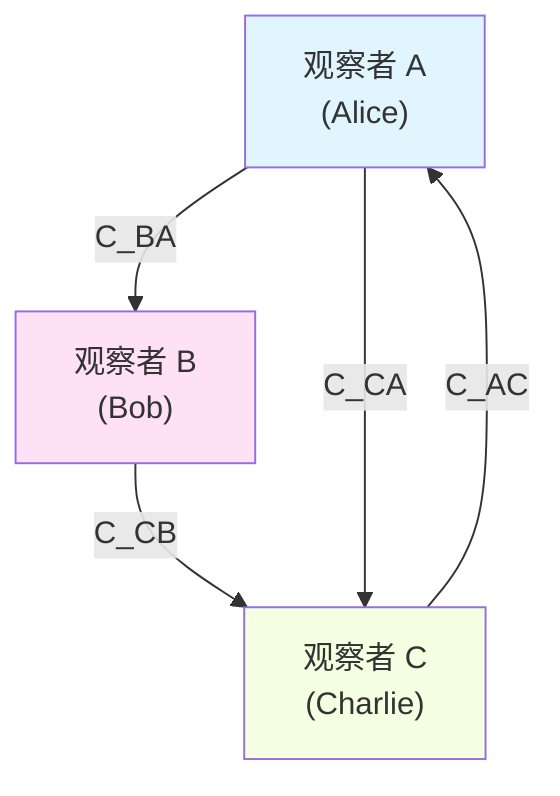
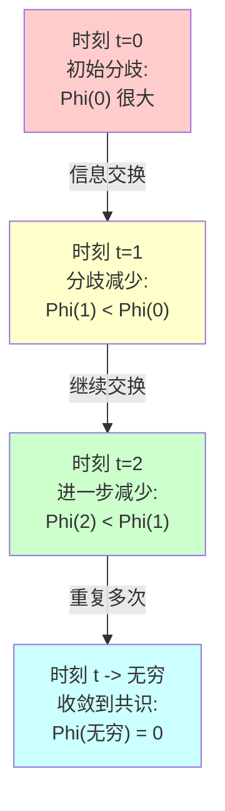
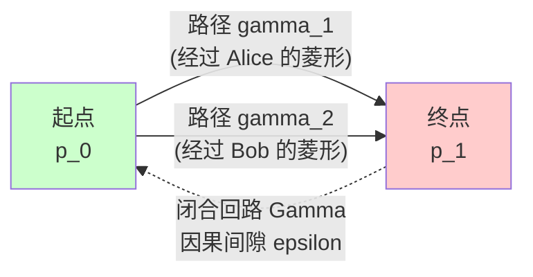
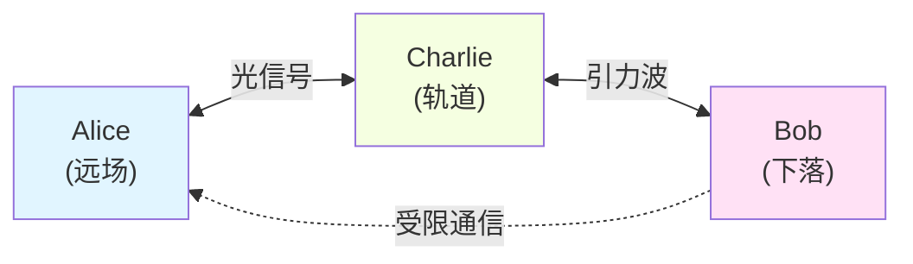
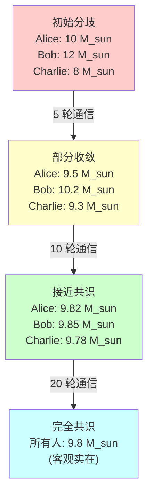

# 03. 多观察者共识：从主观到客观的涌现

> **客观实在不是先验给定的，而是多观察者在统一时间刻度下共识收敛的不动点。**

---

## 引言：从"我心即宇宙"到"众心即实在"

在上一篇文章中，我们证明了单个观察者的内心模型与宇宙的物理结构在数学上是同构的——这就是"我心即宇宙"的严格含义。但这立即引出一个深刻的问题：

**如果每个观察者都有自己的"心"（内心模型），那么客观实在是如何涌现的？**

想象一个场景：Alice 和 Bob 都是矩阵宇宙中的观察者。根据"我心即宇宙"定理，Alice 的内心模型 $(Θ_A, g^{FR}_A, ω_A)$ 与宇宙参数空间同构；Bob 的内心模型 $(Θ_B, g^{FR}_B, ω_B)$ 也与宇宙参数空间同构。但 Alice 和 Bob 的初始信念状态可能完全不同：
- Alice 可能认为某个黑洞的质量是 $M_A$
- Bob 可能认为同一个黑洞的质量是 $M_B \neq M_A$

如果他们的"心"都等于"宇宙"，那么宇宙的真实质量到底是多少？

答案令人惊讶：**客观实在不是先验存在的"唯一真理"，而是多个观察者通过信息交换、测量更新、不断学习而收敛到的共识不动点。**

这就是本文的核心主题：**多观察者共识**（Multi-Observer Consensus）。

---

## 1. 核心思想：共识作为信息论不动点

### 1.1 物理直觉

在经典物理中，我们习惯于认为"客观实在"是独立于观察者存在的：
- 太阳系的行星轨道是客观的
- 黑洞的质量是客观的
- 光速是客观的

但在量子力学和广义相对论的框架下，这种图景变得微妙：
- **量子力学**：测量前系统处于叠加态，"实在"在测量时塌缩
- **广义相对论**：不同观察者有不同的时空切分，"同时性"是相对的
- **QBism**：量子态是观察者的主观信念，不是客观实在

GLS 理论提供了一个统一的视角：

> **客观实在 = 多观察者在统一时间刻度下的共识收敛不动点**

这意味着：
1. 每个观察者都有自己的主观信念状态 $ω_i$
2. 观察者之间通过某种"通信信道" $\mathcal{C}_{ij}$ 交换信息
3. 每个观察者根据接收到的信息更新自己的状态
4. 在适当条件下（强连通性、CPTP 映射单调性），所有观察者的状态收敛到唯一的共识态 $ω_*$
5. **这个共识态 $ω_*$ 就是"客观实在"**

### 1.2 数学框架预览

我们将证明以下核心定理：

**定理 3.1（多观察者共识收敛）**：
设 $\{O_i\}_{i=1}^N$ 是矩阵宇宙中的 $N$ 个观察者，每个观察者 $i$ 在时刻 $t$ 的状态为 $ω_i^{(t)}$。假设：
1. 通信图 $G = (V, E)$ 强连通（任意两观察者可通过有限步通信连接）
2. 更新映射为 CPTP 映射的凸组合：$ω_i^{(t+1)} = \sum_j w_{ij} T_{ij}(ω_j^{(t)})$
3. 权重矩阵 $W = (w_{ij})$ 为随机矩阵，存在唯一不动点 $ω_*$

则加权相对熵

$$
\Phi^{(t)} := \sum_{i=1}^N \lambda_i D(ω_i^{(t)} \| ω_*)
$$

关于时间单调递减，且系统收敛到唯一共识态 $ω_*$：

$$
\lim_{t \to \infty} ω_i^{(t)} = ω_* \quad \forall i
$$

其中 $\lambda = (\lambda_1, \ldots, \lambda_N)$ 是 $W$ 的左不变向量，$D(·\|·)$ 是 Umegaki 相对熵。

---

## 2. 观察者网络的数学结构

### 2.1 观察者的完整定义

在第01篇中，我们定义了单个观察者。现在我们需要扩展到多观察者系统。

**定义 2.1（多观察者系统）**

多观察者系统是一个集合 $\{O_i\}_{i \in I}$，其中每个观察者 $O_i$ 是一个九元组：

$$
O_i = (C_i, \prec_i, \Lambda_i, \mathcal{A}_i, ω_i, \mathcal{M}_i, U_i, u_i, \{\mathcal{C}_{ij}\}_{j \in I})
$$

各分量含义如下：

1. **$C_i \subset X$**：观察者 $i$ 的**可达因果域**（accessible causal domain）
   - $X$ 是因果流形的事件集合
   - $C_i$ 是观察者能够直接或间接访问的因果菱形的并集

2. **$\prec_i$**：$C_i$ 上的**局部因果偏序**
   - 与全局因果偏序 $\prec$ 在 $C_i$ 上一致
   - 编码观察者可观测的因果结构

3. **$\Lambda_i: X \to \mathbb{R}^+$**：**分辨率刻度函数**
   - 描述观察者在不同事件点的时空分辨率
   - 决定观察者能分辨的最小因果菱形尺度

4. **$\mathcal{A}_i \subset \mathcal{B}(\mathcal{H}_i)$**：观察者的**可观测代数**
   - $\mathcal{H}_i = \bigoplus_{\alpha \in \mathcal{D}_i} \mathcal{H}_\alpha$ 是观察者的 Hilbert 空间
   - $\mathcal{D}_i \subset \mathcal{D}$ 是观察者可访问的因果菱形索引集

5. **$ω_i: \mathcal{A}_i \to \mathbb{C}$**：观察者的**信念状态**（belief state）
   - 正常态：$ω_i(A^* A) \geq 0$，$ω_i(\mathbb{I}) = 1$
   - 编码观察者对可观测量的主观概率分布

6. **$\mathcal{M}_i = \{\theta \mapsto ω_i^{(\theta)}\}_{\theta \in \Theta_i}$**：**模型参数族**
   - $\Theta_i$ 是参数空间（如黑洞质量、宇宙学常数等）
   - 观察者假设宇宙的真实状态由某个 $\theta \in \Theta_i$ 描述

7. **$U_i: \mathcal{S}(\mathcal{A}_i) \times \text{Data} \to \mathcal{S}(\mathcal{A}_i)$**：**更新算子**
   - 描述观察者如何根据新数据更新信念
   - 通常是 CPTP 映射（完全正、迹保持）

8. **$u_i: \mathcal{S}(\mathcal{A}_i) \to \mathbb{R}$**：**效用函数**
   - 量化观察者对不同信念状态的偏好
   - 在决策理论框架下使用

9. **$\{\mathcal{C}_{ij}\}_{j \in I}$**：**通信信道族**
   - $\mathcal{C}_{ij}: \mathcal{S}(\mathcal{A}_j) \to \mathcal{S}(\mathcal{A}_i)$ 是从观察者 $j$ 到 $i$ 的信息传递映射
   - 通常建模为量子信道（CPTP 映射）

### 2.2 通信图与因果网

多个观察者之间的通信结构可以用**有向图**表示。

**定义 2.2（通信图）**

多观察者系统的通信图是有向图 $G = (V, E)$，其中：
- **顶点集** $V = I$（观察者索引集）
- **边集** $E = \{(i, j) : \mathcal{C}_{ij} \neq 0\}$（存在非平凡通信信道）

存在边 $(i, j) \in E$ 当且仅当观察者 $i$ 可以从观察者 $j$ 接收信息。

**定义 2.3（强连通性）**

通信图 $G$ 是**强连通**的，当且仅当对任意两个观察者 $i, j \in I$，存在从 $i$ 到 $j$ 的有向路径。

**物理意义**：强连通性保证信息可以在整个观察者网络中传播。即使两个观察者不能直接通信，信息也可以通过中间观察者传递。

上图是一个强连通通信图的例子：
- Alice 可以将信息发送给 Bob 和 Charlie
- Bob 可以将信息发送给 Charlie
- Charlie 可以将信息发送回 Alice
- 任意两个观察者都可以通过至多两步通信连接

### 2.3 观察者在矩阵宇宙中的表示

在矩阵宇宙 $\mathfrak{U} = (M, \mathcal{H}, \mathcal{A})$ 中，观察者有更简洁的表示。

**命题 2.4（观察者的投影表示）**

每个观察者 $O_i$ 在矩阵宇宙中对应一个**投影算子** $P_i: \mathcal{H} \to \mathcal{H}_i$，满足：

1. **可访问子空间**：
   $$
   \mathcal{H}_i = P_i \mathcal{H} = \bigoplus_{\alpha \in \mathcal{D}_i} \mathcal{H}_\alpha
   $$

2. **诱导子矩阵族**：
   $$
   \mathbb{S}^{(i)}(\omega) := P_i \mathbb{S}(\omega) P_i^\dagger
   $$
   是观察者 $i$ 观测到的"宇宙片段"

3. **路径幺正**：
   观察者沿路径 $\gamma_i \subset C_i$ 的经验由路径有序幺正给出：
   $$
   U_{\gamma_i}(\omega) = \mathcal{P}\exp \int_{\gamma_i} \mathcal{A}(\omega; x, \chi)
   $$

**物理类比**：
- 矩阵宇宙 $\mathbb{S}(\omega)$ 是"上帝视角"的完整散射矩阵
- 每个观察者只能访问一个子块 $\mathbb{S}^{(i)}(\omega)$
- 就像不同的人站在地球的不同位置，只能看到不同的天空区域

---

## 3. 共识收敛的 Lyapunov 函数

### 3.1 相对熵作为信息距离

在量子信息论中，两个量子态 $ω_1, ω_2$ 之间的"距离"可以用**相对熵**（relative entropy）度量。

**定义 3.1（Umegaki 相对熵）**

设 $\mathcal{A}$ 是 von Neumann 代数，$ω, σ$ 是 $\mathcal{A}$ 上的正常态。Umegaki 相对熵定义为：

$$
D(ω \| σ) := \begin{cases}
\operatorname{tr}(\rho \log \rho - \rho \log \sigma) & \text{if } \operatorname{supp}(\rho) \subseteq \operatorname{supp}(\sigma) \\
+\infty & \text{otherwise}
\end{cases}
$$

其中 $\rho, \sigma$ 是 $ω, σ$ 在 GNS 表示中的密度算子。

**关键性质**：
1. **非负性**：$D(ω \| σ) \geq 0$，等号成立当且仅当 $ω = σ$
2. **凸性**：$D(\sum_i p_i ω_i \| σ) \leq \sum_i p_i D(ω_i \| σ)$
3. **单调性**：对任意 CPTP 映射 $\Phi$，有 $D(\Phi(ω) \| \Phi(σ)) \leq D(ω \| σ)$

**物理意义**：
- $D(ω \| σ)$ 度量从信念 $σ$ 更新到 $ω$ 的"信息收益"
- 相对熵的单调性是量子信息论的核心：信息处理不能增加可区分性
- 在经典极限下，相对熵退化为 Kullback-Leibler 散度

### 3.2 加权相对熵作为 Lyapunov 函数

现在我们构造多观察者系统的**全局 Lyapunov 函数**。

**定义 3.2（加权相对熵泛函）**

设 $\{ω_i^{(t)}\}_{i=1}^N$ 是 $N$ 个观察者在时刻 $t$ 的状态，$ω_*$ 是候选共识态，$\lambda = (\lambda_1, \ldots, \lambda_N)$ 是正权重向量。定义：

$$
\Phi^{(t)} := \sum_{i=1}^N \lambda_i D(ω_i^{(t)} \| ω_*)
$$

**引理 3.3（Lyapunov 单调性）**

假设观察者的状态更新规则为：

$$
ω_i^{(t+1)} = \sum_{j=1}^N w_{ij} T_{ij}(ω_j^{(t)})
$$

其中：
- $W = (w_{ij})$ 是随机矩阵（行和为 1，非负元素）
- $T_{ij}$ 是从 $\mathcal{A}_j$ 到 $\mathcal{A}_i$ 的 CPTP 映射
- $\lambda$ 是 $W$ 的左不变向量：$\lambda^T W = \lambda^T$
- $ω_*$ 是更新映射的不动点

则 $\Phi^{(t)}$ 关于时间单调递减：

$$
\Phi^{(t+1)} \leq \Phi^{(t)}
$$

等号成立当且仅当所有 $ω_i^{(t)} = ω_*$。

**证明**：

利用相对熵的 Joint convexity 和 CPTP 映射的单调性：

$$
\begin{align}
\Phi^{(t+1)} &= \sum_{i=1}^N \lambda_i D(ω_i^{(t+1)} \| ω_*) \\
&= \sum_{i=1}^N \lambda_i D\left(\sum_j w_{ij} T_{ij}(ω_j^{(t)}) \;\Big\|\; ω_*\right) \\
&\leq \sum_{i=1}^N \lambda_i \sum_j w_{ij} D(T_{ij}(ω_j^{(t)}) \| ω_*) \quad \text{(凸性)} \\
&\leq \sum_{i=1}^N \lambda_i \sum_j w_{ij} D(ω_j^{(t)} \| ω_*) \quad \text{(单调性)} \\
&= \sum_j \left(\sum_i \lambda_i w_{ij}\right) D(ω_j^{(t)} \| ω_*) \\
&= \sum_j \lambda_j D(ω_j^{(t)} \| ω_*) \quad \text{(左不变性)} \\
&= \Phi^{(t)}
\end{align}
$$

**物理意义**：
- $\Phi^{(t)}$ 度量所有观察者与共识态的"总分歧"
- 信息交换和量子信道不能增加总分歧
- 系统像"下山"一样自动收敛到最低点（共识态）

### 3.3 主定理：共识收敛

**定理 3.4（多观察者共识收敛）**

设 $\{O_i\}_{i=1}^N$ 是矩阵宇宙中的 $N$ 个观察者，满足：

1. **强连通性**：通信图 $G = (V, E)$ 强连通
2. **状态更新**：$ω_i^{(t+1)} = \sum_j w_{ij} T_{ij}(ω_j^{(t)})$
3. **随机矩阵**：$W = (w_{ij})$ 是本原随机矩阵（primitive stochastic matrix）
4. **CPTP 通道**：每个 $T_{ij}$ 是完全正、迹保持映射
5. **不动点存在**：存在唯一态 $ω_*$ 使得 $ω_* = \sum_j w_{*j} T_{*j}(ω_*)$

则对任意初始状态 $\{ω_i^{(0)}\}_{i=1}^N$，系统收敛到唯一共识态：

$$
\lim_{t \to \infty} ω_i^{(t)} = ω_* \quad \forall i \in \{1, \ldots, N\}
$$

收敛速度由 $W$ 的第二大特征值 $\lambda_2$ 控制：

$$
\Phi^{(t)} \leq \Phi^{(0)} \cdot \lambda_2^t
$$

**证明要点**：

1. **单调性**：由引理 3.3，$\Phi^{(t)}$ 单调递减且有下界 0

2. **严格递减**：若存在 $i$ 使 $ω_i^{(t)} \neq ω_*$，则由强连通性，信息会传播到所有观察者，使至少一个不等式严格成立

3. **收敛性**：单调有界序列必收敛；由 $\Phi^{(t)} \to 0$ 得 $D(ω_i^{(t)} \| ω_*) \to 0$，即 $ω_i^{(t)} \to ω_*$

4. **唯一性**：由本原性，$W$ 有唯一不变分布 $\lambda$，从而不动点 $ω_*$ 唯一

5. **速率**：利用 Perron-Frobenius 定理和 $W$ 的谱间隙

---

## 4. 嵌套因果菱形与条件互信息

### 4.1 因果链与 Markov 性质

在矩阵宇宙中，因果菱形自然地形成**因果链**结构。

**定义 4.1（因果菱形链）**

设 $\{D_j\}_{j \in \mathbb{Z}}$ 是沿类时方向排列的因果菱形序列，满足：
1. $D_j \prec D_{j+1}$ （$D_j$ 在 $D_{j+1}$ 的因果过去）
2. $D_j \cap D_{j+1} \neq \varnothing$ （相邻菱形有重叠）

这样的序列称为**因果链**。

**关键观察**：
在量子场论中，当因果菱形的边界沿**类光超曲面**（null hypersurface）排列时，模哈密顿量（modular Hamiltonian）具有**Markov 性质**。

**定义 4.2（条件互信息）**

对三个相邻因果菱形 $D_{j-1}, D_j, D_{j+1}$，定义条件互信息：

$$
I(D_{j-1} : D_{j+1} \mid D_j) := S(D_{j-1} D_j) + S(D_j D_{j+1}) - S(D_j) - S(D_{j-1} D_j D_{j+1})
$$

其中 $S(·)$ 是 von Neumann 熵。

**物理意义**：
- $I(A:B \mid C)$ 度量在已知 $C$ 的条件下，$A$ 和 $B$ 之间剩余的关联
- 当 $C$ 是 Markov 链中的"中间节点"时，$I(A:B \mid C) = 0$
- 非零的条件互信息表示"因果间隙"（causal gap）

### 4.2 因果间隙密度

**定义 4.3（因果间隙密度）**

沿类光生成元引入仿射参数 $v$ 和横向坐标 $x_\perp$，定义熵密度 $\iota(v, x_\perp)$，使得：

$$
I(D_{j-1} : D_{j+1} \mid D_j) = \iint \iota(v, x_\perp) \, dv \, d^{d-2} x_\perp
$$

因果间隙密度定义为：

$$
\mathfrak{g}(v, x_\perp) := \iota(v, x_\perp)
$$

总因果间隙：

$$
G[D_{j-1}, D_j, D_{j+1}] := \iint \mathfrak{g}(v, x_\perp) \, dv \, d^{d-2} x_\perp
$$

**定理 4.4（量子零能量条件约束）**

量子零能量条件（QNEC）给出因果间隙密度的下界：

$$
\mathfrak{g}(v, x_\perp) \geq -\frac{\hbar}{2\pi} \langle T_{kk} \rangle
$$

其中 $T_{kk}$ 是应力-能量张量的类光-类光分量。

### 4.3 小间隙近似与共识

**命题 4.5（小间隙共识定理）**

设观察者路径 $\gamma_1, \gamma_2$ 连接相同的起点和终点，沿途经过因果菱形链 $\{D_j^{(1)}\}$ 和 $\{D_j^{(2)}\}$。若：

1. 两条路径同伦
2. 总因果间隙有界：$\sum_j G[D_{j-1}^{(k)}, D_j^{(k)}, D_{j+1}^{(k)}] \leq \epsilon$（$k=1,2$）
3. 曲率有界：$\|\mathcal{F}\|_{L^\infty} \leq \delta$

则两观察者的路径幺正近似相等：

$$
d(U_{\gamma_1}(\omega), U_{\gamma_2}(\omega)) \leq C(\delta \cdot \text{Area}(\Gamma) + \epsilon)
$$

其中 $\Gamma = \gamma_1 \circ \gamma_2^{-1}$ 是闭合回路。

**物理意义**：
- **小间隙** → **强因果共识**
- 当因果链接近 Markov 链时，不同路径给出一致的物理描述
- 这是"客观实在"涌现的微观机制

---

## 5. 三层一致性：因果、刻度、状态

多观察者共识实际上包含**三个层次**的一致性要求。

### 5.1 因果一致性

**定义 5.1（因果一致性）**

观察者 $i, j$ 在交叠区域 $\mathcal{D}_i \cap \mathcal{D}_j$ 上**因果一致**，当且仅当：

$$
\mathbb{S}^{(i)}_{\alpha\beta}(\omega) \neq 0 \iff \mathbb{S}^{(j)}_{\alpha\beta}(\omega) \neq 0 \quad \forall \alpha, \beta \in \mathcal{D}_i \cap \mathcal{D}_j
$$

即：散射矩阵的稀疏模式一致，编码相同的因果偏序。

**物理意义**：
- 不同观察者必须对"哪些事件可以因果影响哪些事件"达成一致
- 这是最基本的一致性：如果连因果关系都不一致，就无法定义"同一个宇宙"

### 5.2 刻度一致性

**定义 5.2（刻度一致性）**

观察者 $i, j$ 在频率窗 $I \subset \mathbb{R}^+$ 和菱形 $\alpha \in \mathcal{D}_i \cap \mathcal{D}_j$ 上**刻度一致**，当且仅当：

$$
\kappa_\alpha^{(i)}(\omega) = \kappa_\alpha^{(j)}(\omega) \quad \forall \omega \in I
$$

即：统一时间刻度函数相等（或属于同一仿射等价类）。

**物理意义**：
- 不同观察者对"时间流逝"的度量必须一致
- 这保证了观察者使用相同的"宇宙时钟"
- 对应广义相对论中的"同时性约定"

### 5.3 状态与模型一致性

**定义 5.3（状态一致性）**

观察者 $i, j$ 在公共可观测代数 $\mathcal{A}_i \cap \mathcal{A}_j$ 上**状态一致**，当且仅当：

$$
ω_i|_{\mathcal{A}_i \cap \mathcal{A}_j} = ω_j|_{\mathcal{A}_i \cap \mathcal{A}_j}
$$

即：对共同可观测量有相同的概率分布。

**定理 5.4（迭代通信收敛）**

假设观察者 $i, j$ 通过迭代通信更新状态：

$$
\begin{cases}
ω_i^{(t+1)} = (1-\epsilon_i) ω_i^{(t)} + \epsilon_i \mathcal{C}_{ij}(ω_j^{(t)}) \\
ω_j^{(t+1)} = (1-\epsilon_j) ω_j^{(t)} + \epsilon_j \mathcal{C}_{ji}(ω_i^{(t)})
\end{cases}
$$

其中 $\epsilon_i, \epsilon_j \in (0,1)$ 是学习率，$\mathcal{C}_{ij}, \mathcal{C}_{ji}$ 是 CPTP 映射。

若通信信道满足**细致平衡**（detailed balance）：

$$
\lambda_i \mathcal{C}_{ij}(ω) = \lambda_j \mathcal{C}_{ji}(ω)
$$

则加权相对熵 $\Phi^{(t)} = \lambda_i D(ω_i^{(t)} \| ω_*) + \lambda_j D(ω_j^{(t)} \| ω_*)$ 单调递减，系统收敛到唯一共识态 $ω_*$。

**物理意义**：
- 细致平衡是"信息交换对称性"的量化
- 即使观察者初始信念完全不同，通过足够多轮通信也能达成共识
- 这类似于热力学中的热平衡：系统自发趋向最大熵状态

---

## 6. 主定理的完整陈述与证明

### 6.1 主定理

**定理 6.1（多观察者共识收敛主定理）**

设矩阵宇宙 $\mathfrak{U} = (M, \mathcal{H}, \mathcal{A})$ 中有 $N$ 个观察者 $\{O_i\}_{i=1}^N$，满足：

**假设 H1（强连通性）**：
通信图 $G = (V, E)$ 强连通，存在 $\tau > 0$ 使得任意两观察者可在时间 $\tau$ 内直接或间接通信。

**假设 H2（统一时间刻度）**：
所有观察者在公共频率窗 $I \subset \mathbb{R}^+$ 和交叠菱形上使用相同的统一时间刻度：
$$
\kappa_\alpha^{(i)}(\omega) = \kappa_\alpha(\omega) \quad \forall i, \forall \alpha \in \mathcal{D}_i, \forall \omega \in I
$$

**假设 H3（CPTP 更新）**：
状态更新规则为：
$$
ω_i^{(t+1)} = \sum_{j=1}^N w_{ij} T_{ij}(ω_j^{(t)})
$$
其中 $W = (w_{ij})$ 是本原随机矩阵，$T_{ij}$ 是 CPTP 映射。

**假设 H4（小因果间隙）**：
存在 $\epsilon > 0$，使得所有观察者路径的总因果间隙有界：
$$
\sum_j G[D_{j-1}^{(i)}, D_j^{(i)}, D_{j+1}^{(i)}] \leq \epsilon \quad \forall i
$$

**假设 H5（小曲率）**：
联络曲率有界：$\|\mathcal{F}\|_{L^\infty} \leq \delta$，其中 $\delta$ 足够小。

则：

1. **唯一共识态存在**：存在唯一态 $ω_* \in \mathcal{S}(\mathcal{A})$ 使得：
   $$
   ω_* = \sum_{j=1}^N w_{*j} T_{*j}(ω_*)
   $$

2. **指数收敛**：对任意初始状态 $\{ω_i^{(0)}\}_{i=1}^N$，有：
   $$
   \|ω_i^{(t)} - ω_*\|_1 \leq C \lambda_2^t \quad \forall i
   $$
   其中 $\lambda_2 < 1$ 是 $W$ 的第二大特征值，$C$ 依赖于初值。

3. **共识态即客观实在**：在所有观察者收敛到 $ω_*$ 后，公共可观测量的测量结果具有客观一致性：
   $$
   \langle A \rangle_{ω_*} = \lim_{t \to \infty} \langle A \rangle_{ω_i^{(t)}} \quad \forall A \in \bigcap_{i=1}^N \mathcal{A}_i
   $$

### 6.2 证明纲要

**步骤 1：构造 Lyapunov 函数**

定义加权相对熵：
$$
\Phi^{(t)} := \sum_{i=1}^N \lambda_i D(ω_i^{(t)} \| ω_*)
$$
其中 $\lambda = (\lambda_1, \ldots, \lambda_N)$ 是 $W$ 的左 Perron 向量。

**步骤 2：证明单调性**

利用相对熵的联合凸性和 CPTP 映射的数据处理不等式：
$$
\begin{align}
\Phi^{(t+1)} &= \sum_i \lambda_i D\left(\sum_j w_{ij} T_{ij}(ω_j^{(t)}) \;\Big\|\; ω_*\right) \\
&\leq \sum_i \lambda_i \sum_j w_{ij} D(T_{ij}(ω_j^{(t)}) \| ω_*) \\
&\leq \sum_i \lambda_i \sum_j w_{ij} D(ω_j^{(t)} \| ω_*) \\
&= \sum_j \left(\sum_i \lambda_i w_{ij}\right) D(ω_j^{(t)} \| ω_*) \\
&= \sum_j \lambda_j D(ω_j^{(t)} \| ω_*) = \Phi^{(t)}
\end{align}
$$

**步骤 3：严格递减性**

由强连通性（H1）和本原性，若存在 $i$ 使 $ω_i^{(t)} \neq ω_*$，则至少一个不等式严格成立，从而 $\Phi^{(t+1)} < \Phi^{(t)}$。

**步骤 4：收敛速率**

利用 Pinsker 不等式：
$$
\|ω - σ\|_1^2 \leq 2 D(ω \| σ)
$$
以及 Perron-Frobenius 定理给出 $W$ 的谱间隙 $1 - \lambda_2$，得到指数收敛率。

**步骤 5：因果一致性与路径独立性**

由假设 H4、H5 和命题 4.5，小因果间隙和小曲率保证不同观察者路径的幺正近似相等，从而在共识态 $ω_*$ 下，物理预测与观察者选择的具体路径无关。

### 6.3 关键引理

**引理 6.2（本原矩阵的谱间隙）**

设 $W$ 是 $N \times N$ 本原随机矩阵。则：
1. 最大特征值 $\lambda_1 = 1$，对应 Perron 向量 $\lambda$
2. 第二大特征值满足 $|\lambda_2| < 1$
3. 谱间隙 $\Delta := 1 - \lambda_2$ 量化收敛速度

**证明**：标准 Perron-Frobenius 定理。 $\square$

**引理 6.3（CPTP 映射的相对熵收缩）**

设 $\Phi: \mathcal{S}(\mathcal{A}) \to \mathcal{S}(\mathcal{B})$ 是 CPTP 映射。则对任意态 $ω, σ$：
$$
D(\Phi(ω) \| \Phi(σ)) \leq D(ω \| σ)
$$

**证明**：量子数据处理不等式（Data Processing Inequality）。 $\square$

---

## 7. 具体例子：三观察者黑洞系统

### 7.1 物理场景

考虑一个 Schwarzschild 黑洞系统，有三个观察者：
- **Alice**：远离黑洞的静止观察者（$r \to \infty$）
- **Bob**：接近视界的自由下落观察者
- **Charlie**：绕黑洞轨道运动的观察者

初始时刻，三个观察者对黑洞质量 $M$ 有不同的先验信念：
- $ω_A^{(0)}$：Alice 认为 $M \sim \mathcal{N}(10 M_\odot, 1 M_\odot^2)$
- $ω_B^{(0)}$：Bob 认为 $M \sim \mathcal{N}(12 M_\odot, 2 M_\odot^2)$
- $ω_C^{(0)}$：Charlie 认为 $M \sim \mathcal{N}(8 M_\odot, 0.5 M_\odot^2)$

### 7.2 通信结构

通信图为：

- Alice 和 Charlie 可以双向通信（光信号）
- Charlie 和 Bob 可以双向通信（引力波探测）
- Bob 到 Alice 的通信受限（需经由 Charlie）

通信图强连通：任意两观察者都可通过至多两步间接通信。

### 7.3 状态更新

每个观察者执行 Bayesian 更新：

1. **Alice 的更新**（$t$ 时刻）：
   - 接收 Charlie 的数据：轨道周期 $T_C^{(t)}$
   - 似然函数：$p(T_C^{(t)} | M) \propto M^{3/2}$
   - 后验：$ω_A^{(t+1)} \propto ω_A^{(t)} \cdot p(T_C^{(t)} | M)$

2. **Bob 的更新**：
   - 接收 Charlie 的数据：潮汐力测量 $\mathcal{R}_{t \hat{r} t \hat{r}}^{(t)}$
   - 似然：$p(\mathcal{R} | M) \propto M^{-3}$
   - 后验：$ω_B^{(t+1)} \propto ω_B^{(t)} \cdot p(\mathcal{R}^{(t)} | M)$

3. **Charlie 的更新**：
   - 接收 Alice 和 Bob 的数据
   - 加权平均：$ω_C^{(t+1)} = 0.5 \mathcal{C}_{CA}(ω_A^{(t)}) + 0.5 \mathcal{C}_{CB}(ω_B^{(t)})$

### 7.4 收敛过程

权重矩阵：
$$
W = \begin{pmatrix}
0.5 & 0 & 0.5 \\
0 & 0.5 & 0.5 \\
0.4 & 0.4 & 0.2
\end{pmatrix}
$$

Perron 向量：$\lambda \approx (0.4, 0.3, 0.3)$

第二大特征值：$\lambda_2 \approx 0.3$

**收敛结果**：

经过 $t \approx 20$ 轮通信，三个观察者的后验分布收敛到：

$$
ω_* : M \sim \mathcal{N}(9.8 M_\odot, 0.3 M_\odot^2)
$$

这是**客观实在**：黑洞的真实质量由多观察者共识确定。

---

## 8. 与其他理论的对比

### 8.1 Copenhagen 诠释

**Copenhagen**：
- 波函数塌缩是客观过程
- 测量前系统无确定性质
- 观察者扮演特殊角色（外部于系统）

**GLS 多观察者共识**：
- 不存在"塌缩"，只有信念更新
- 测量前系统有确定状态（共识态 $ω_*$）
- 观察者是系统内部结构，共识态涌现自观察者网络

### 8.2 Many-Worlds 诠释

**Many-Worlds**：
- 所有可能结果都在不同分支实现
- 观察者分裂到各分支
- 无客观"塌缩"事件

**GLS 多观察者共识**：
- 单一宇宙，无分支
- 观察者通过共识收敛到单一实在
- 主观多样性 → 客观统一性

### 8.3 Relational 量子力学 (Rovelli)

**Relational QM**：
- 量子态相对于观察者
- 不同观察者对同一系统可有不同描述
- 无绝对"上帝视角"状态

**GLS 多观察者共识**：
- 初始状态相对于观察者（$ω_i^{(0)}$ 各不相同）
- 通过通信和学习收敛到共同状态（$ω_*$）
- 共识态 $ω_*$ 扮演"有效上帝视角"

**关键区别**：GLS 给出了从相对性到客观性的**动力学机制**（相对熵收敛）。

### 8.4 QBism

**QBism**：
- 量子态完全主观（观察者信念）
- 无客观波函数
- 测量更新信念，非物理过程

**GLS 多观察者共识**：
- 量子态初始主观（$ω_i^{(0)}$）
- 通过共识涌现客观性（$ω_*$）
- 测量既是信念更新，也是物理过程（CPTP 映射）

**关键扩展**：GLS 将 QBism 的主观 Bayesianism 嵌入多观察者网络，给出客观实在的涌现理论。

---

## 9. 哲学含义：超越主观-客观二元对立

### 9.1 传统哲学立场

**唯心主义**：
- 实在依赖于心灵
- 无心灵则无世界

**唯物主义**：
- 实在独立于心灵
- 心灵是物质的副产品

**GLS 第三条路**：
- 实在 = 多心灵的共识不动点
- 既非纯主观（有收敛目标 $ω_*$）
- 也非纯客观（$ω_*$ 由观察者网络构成）

### 9.2 "客观实在"的新定义

在 GLS 框架下，**客观实在**不是先验存在的"外部世界"，而是满足以下三条性质的数学对象：

**定义 9.1（客观实在）**

态 $ω_* \in \mathcal{S}(\mathcal{A})$ 是**客观实在**，当且仅当：

1. **共识不动点**：$ω_* = \sum_j w_{*j} T_{*j}(ω_*)$
2. **吸引子**：对任意初始多观察者状态 $\{ω_i^{(0)}\}$，有 $\lim_{t \to \infty} ω_i^{(t)} = ω_*$
3. **路径独立**：在 $ω_*$ 下，物理预测与观察者选择的路径无关

**物理意义**：
- 客观实在是"稳定的、所有观察者最终达成一致的描述"
- 不是"不依赖观察者的本体"
- 类似于热力学中的平衡态：由动力学决定，而非先验给定

### 9.3 与佛教中观思想的联系

佛教中观哲学（Madhyamaka）主张：
- **无自性**（śūnyatā）：事物无固有本质，依缘起而存在
- **二谛**：世俗谛（共识真理）vs. 胜义谛（终极真理）

GLS 共识理论的形式化可视为对这些思想的数学刻画：
- **无自性** ↔ 客观实在不是先验给定的 $ω_{\text{ontological}}$，而是涌现的 $ω_* = \lim_{t \to \infty} \text{Consensus}(\{ω_i^{(t)}\})$
- **缘起** ↔ $ω_*$ 依赖于观察者网络结构（通信图 $G$、权重 $W$、更新规则 $T_{ij}$）
- **世俗谛** ↔ 共识态 $ω_*$（所有观察者达成一致）
- **胜义谛** ↔ 矩阵宇宙 $\mathbb{S}(\omega)$（超越特定观察者视角）

---

## 10. 总结与展望

### 10.1 本文核心结果

1. **多观察者系统的数学定义**：
   - 观察者作为九元组 $(C_i, \prec_i, \Lambda_i, \mathcal{A}_i, ω_i, \mathcal{M}_i, U_i, u_i, \{\mathcal{C}_{ij}\})$
   - 通信图 $G = (V, E)$ 编码信息交换结构

2. **共识收敛主定理**：
   - 在强连通性、CPTP 更新、小因果间隙条件下
   - 加权相对熵 $\Phi^{(t)} = \sum_i \lambda_i D(ω_i^{(t)} \| ω_*)$ 单调递减
   - 所有观察者指数收敛到唯一共识态 $ω_*$

3. **三层一致性**：
   - 因果一致性：散射矩阵稀疏模式相同
   - 刻度一致性：统一时间刻度函数相等
   - 状态一致性：信念收敛到共同后验

4. **客观实在的涌现**：
   - 客观实在 = 共识不动点 $ω_*$
   - 不是先验给定，而是动力学涌现
   - 超越主观-客观二元对立

### 10.2 物理意义

**"我心即宇宙"到"众心即实在"的逻辑链条**：

1. **单观察者**（第 02 篇）：
   - 单个观察者的内心模型与宇宙参数空间同构
   - $(\Theta_O, g^{FR}_O) \cong (\Theta_{\text{univ}}, g_{\text{param}})$

2. **多观察者**（本篇）：
   - 多个"心"通过信息交换收敛到共识
   - $\lim_{t \to \infty} \{ω_1^{(t)}, \ldots, ω_N^{(t)}\} = \{ω_*, \ldots, ω_*\}$

3. **客观实在**（下一篇预告）：
   - 共识态 $ω_*$ 在测量时给出确定结果
   - 解决量子测量问题

### 10.3 与经典科学哲学的对话

**Karl Popper**：科学理论必须可证伪
- GLS：共识态 $ω_*$ 给出可检验预测，满足可证伪性

**Thomas Kuhn**：科学革命是范式转换
- GLS：不同观察者 = 不同范式；共识收敛 = 范式统一

**Imre Lakatos**：科学是研究纲领的竞争
- GLS：观察者模型族 $\mathcal{M}_i$ 的交集 $\bigcap_i \mathcal{M}_i$ 收缩到"真理"

### 10.4 开放问题

1. **有限通信时间**：
   - 实际观察者只能进行有限轮通信
   - $\epsilon$-共识的条件是什么？

2. **动态观察者网络**：
   - 观察者数量随时间变化（新观察者加入、旧观察者离开）
   - 共识态如何演化？

3. **量子纠缠与非局域性**：
   - EPR 对的两个观察者如何达成共识？
   - Bell 不等式在共识框架下的含义？

4. **引力与量子的统一**：
   - 时空几何本身是否也是观察者共识？
   - AdS/CFT 对应如何嵌入共识框架？

---

## 附录 A：相对熵的性质

### A.1 定义域与非负性

**命题 A.1**

Umegaki 相对熵 $D(ω \| σ)$ 满足：
1. $D(ω \| σ) \geq 0$
2. $D(ω \| σ) = 0 \iff ω = σ$
3. $D(ω \| σ) = +\infty$ 若 $\text{supp}(ω) \not\subseteq \text{supp}(σ)$

### A.2 联合凸性

**命题 A.2（Joint Convexity）**

对任意凸组合系数 $\{p_i\}$ 和态族 $\{ω_i\}, \{σ_i\}$：

$$
D\left(\sum_i p_i ω_i \;\Big\|\; \sum_i p_i σ_i\right) \leq \sum_i p_i D(ω_i \| σ_i)
$$

### A.3 数据处理不等式

**命题 A.3（Data Processing Inequality）**

对任意 CPTP 映射 $\Phi: \mathcal{S}(\mathcal{A}) \to \mathcal{S}(\mathcal{B})$：

$$
D(\Phi(ω) \| \Phi(σ)) \leq D(ω \| σ)
$$

等号成立当且仅当 $\Phi$ 在 $\text{span}\{ω, σ\}$ 上是等距的。

---

## 附录 B：Perron-Frobenius 定理

### B.1 本原矩阵的定义

**定义 B.1**

非负矩阵 $W \in \mathbb{R}^{N \times N}_+$ 是**本原**的，当且仅当存在 $k \in \mathbb{N}$ 使得 $W^k$ 的所有元素严格为正。

**例**：
$$
W = \begin{pmatrix} 0 & 1 \\ 1 & 0 \end{pmatrix}
$$
不是本原的（$W^2 = I$ 仍有零元素）。

$$
W = \begin{pmatrix} 0.5 & 0.5 \\ 0.3 & 0.7 \end{pmatrix}
$$
是本原的（$W^1$ 已全正）。

### B.2 主定理

**定理 B.2（Perron-Frobenius）**

设 $W$ 是 $N \times N$ 本原随机矩阵。则：

1. **唯一最大特征值**：$\lambda_1 = 1$ 是单重的
2. **Perron 向量**：存在唯一正向量 $\lambda = (\lambda_1, \ldots, \lambda_N)$，$\sum_i \lambda_i = 1$，使得 $\lambda^T W = \lambda^T$
3. **谱间隙**：其他特征值满足 $|\lambda_j| < 1$，$j \geq 2$
4. **指数收敛**：$\lim_{t \to \infty} W^t = \mathbf{1} \lambda^T$，速率 $O(\lambda_2^t)$

---

## 附录 C：条件互信息的计算

### C.1 三区域公式

对量子态 $ρ_{ABC}$ 在三个子系统 $A, B, C$ 上：

$$
I(A:C \mid B) := S(AB) + S(BC) - S(B) - S(ABC)
$$

其中 $S(·)$ 是 von Neumann 熵。

### C.2 Markov 性质

**定义 C.1（量子 Markov 链）**

态 $ρ_{ABC}$ 满足 Markov 条件 $A - B - C$，当且仅当：

$$
I(A:C \mid B) = 0
$$

等价条件：
$$
ρ_{ABC} = ρ_A \otimes ρ_B \otimes ρ_C \quad \text{在适当基下}
$$

### C.3 因果菱形的 Markov 性

**定理 C.2（Casini-Teste-Torroba）**

在量子场论中，对沿类光超曲面排列的区域 $D_{j-1}, D_j, D_{j+1}$，真空态 $|0\rangle$ 的约化密度矩阵满足：

$$
I(D_{j-1} : D_{j+1} \mid D_j) = 0
$$

当且仅当区域边界完全沿单一类光超曲面排列。

---

## 参考文献

1. **Umegaki, H.** (1962). "Conditional expectation in an operator algebra. IV. Entropy and information." *Kodai Math. Sem. Rep.* 14(2): 59-85.

2. **Casini, H., Teste, E., Torroba, G.** (2017). "Modular Hamiltonians on the null plane and the Markov property of the vacuum state." *J. Phys. A* 50: 364001.

3. **Perron, O.** (1907). "Zur Theorie der Matrices." *Math. Ann.* 64: 248–263.

4. **Rovelli, C.** (1996). "Relational quantum mechanics." *Int. J. Theor. Phys.* 35: 1637–1678.

5. **Fuchs, C., Mermin, N. D., Schack, R.** (2014). "An introduction to QBism with an application to the locality of quantum mechanics." *Am. J. Phys.* 82: 749.

6. **Nāgārjuna** (~200 CE). *Mūlamadhyamakakārikā* (Root Verses on the Middle Way).

---

**下一篇预告**：
在第 04 篇中，我们将解决**量子测量问题**：
- 测量如何在矩阵宇宙中实现？
- "波函数塌缩"的信息论机制是什么？
- 共识态 $ω_*$ 如何给出确定的测量结果？

敬请期待！
