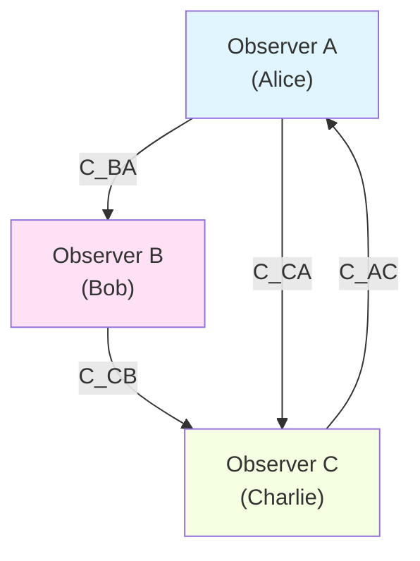
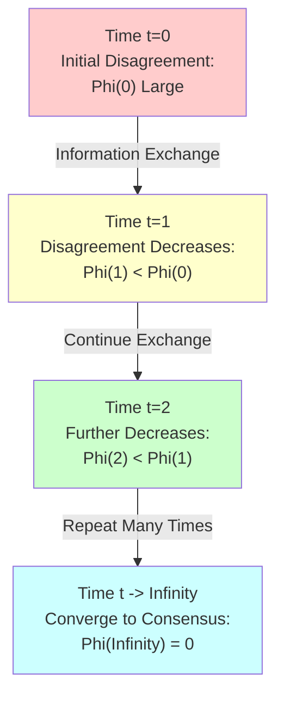
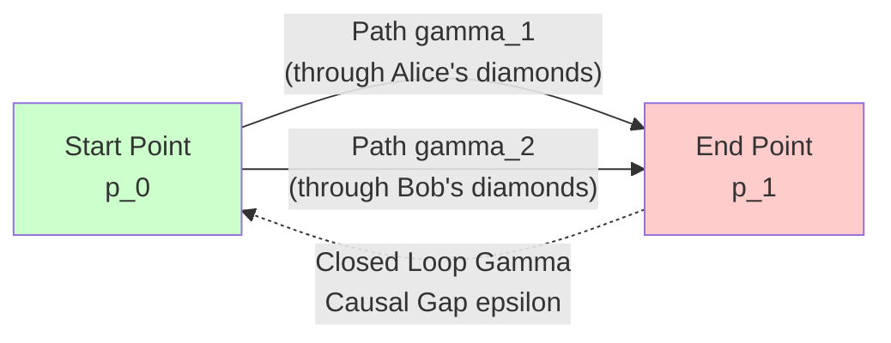
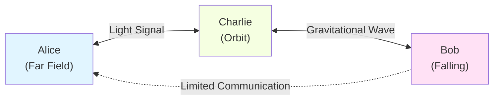
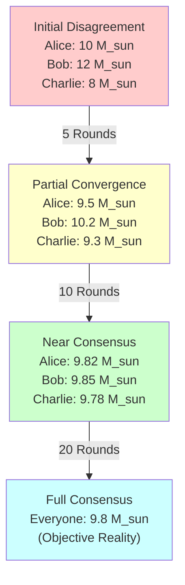

# 03. Multi-Observer Consensus: Emergence from Subjective to Objective

> **Objective reality is not given a priori, but emerges as a fixed point of multi-observer consensus convergence under the unified time scale.**

---

## Introduction: From "My Mind is the Universe" to "Minds Create Reality"

In the previous article, we proved that a single observer's internal model is mathematically isomorphic to the physical structure of the universe—this is the rigorous meaning of "my mind is the universe." But this immediately raises a profound question:

**If each observer has their own "mind" (internal model), how does objective reality emerge?**

Imagine a scenario: Alice and Bob are both observers in the matrix universe. According to the "my mind is the universe" theorem, Alice's internal model $(Θ_A, g^{FR}_A, ω_A)$ is isomorphic to the universe parameter space; Bob's internal model $(Θ_B, g^{FR}_B, ω_B)$ is also isomorphic to the universe parameter space. But Alice and Bob's initial belief states may be completely different:
- Alice might think a certain black hole has mass $M_A$
- Bob might think the same black hole has mass $M_B \neq M_A$

If both their "minds" equal the "universe," what is the true mass of the black hole?

The answer is surprising: **Objective reality is not an a priori existing "unique truth," but a consensus fixed point that multiple observers converge to through information exchange, measurement updates, and continuous learning.**

This is the core theme of this article: **Multi-Observer Consensus**.

---

## 1. Core Idea: Consensus as an Information-Theoretic Fixed Point

### 1.1 Physical Intuition

In classical physics, we are accustomed to thinking that "objective reality" exists independently of observers:
- Planetary orbits in the solar system are objective
- Black hole mass is objective
- Speed of light is objective

But in the framework of quantum mechanics and general relativity, this picture becomes subtle:
- **Quantum Mechanics**: Before measurement, the system is in a superposition state; "reality" collapses at measurement
- **General Relativity**: Different observers have different spacetime foliations; "simultaneity" is relative
- **QBism**: Quantum states are observer's subjective beliefs, not objective reality

GLS theory provides a unified perspective:

> **Objective reality = Fixed point of multi-observer consensus convergence under the unified time scale**

This means:
1. Each observer has their own subjective belief state $ω_i$
2. Observers exchange information through some "communication channel" $\mathcal{C}_{ij}$
3. Each observer updates their state based on received information
4. Under appropriate conditions (strong connectivity, CPTP map monotonicity), all observers' states converge to a unique consensus state $ω_*$
5. **This consensus state $ω_*$ is "objective reality"**

### 1.2 Mathematical Framework Preview

We will prove the following core theorem:

**Theorem 3.1 (Multi-Observer Consensus Convergence)**:
Let $\{O_i\}_{i=1}^N$ be $N$ observers in the matrix universe, with observer $i$'s state at time $t$ being $ω_i^{(t)}$. Assume:
1. Communication graph $G = (V, E)$ is strongly connected (any two observers can be connected through finite-step communication)
2. Update mapping is a convex combination of CPTP mappings: $ω_i^{(t+1)} = \sum_j w_{ij} T_{ij}(ω_j^{(t)})$
3. Weight matrix $W = (w_{ij})$ is a stochastic matrix with a unique fixed point $ω_*$

Then the weighted relative entropy

$$
\Phi^{(t)} := \sum_{i=1}^N \lambda_i D(ω_i^{(t)} \| ω_*)
$$

monotonically decreases with time, and the system converges to the unique consensus state $ω_*$:

$$
\lim_{t \to \infty} ω_i^{(t)} = ω_* \quad \forall i
$$

where $\lambda = (\lambda_1, \ldots, \lambda_N)$ is the left invariant vector of $W$, and $D(·\|·)$ is the Umegaki relative entropy.

---

## 2. Mathematical Structure of Observer Networks

### 2.1 Complete Definition of Observer

In Article 01, we defined a single observer. Now we need to extend to multi-observer systems.

**Definition 2.1 (Multi-Observer System)**

A multi-observer system is a set $\{O_i\}_{i \in I}$, where each observer $O_i$ is a nine-tuple:

$$
O_i = (C_i, \prec_i, \Lambda_i, \mathcal{A}_i, ω_i, \mathcal{M}_i, U_i, u_i, \{\mathcal{C}_{ij}\}_{j \in I})
$$

The meanings of the components are as follows:

1. **$C_i \subset X$**: Observer $i$'s **accessible causal domain**
   - $X$ is the event set of the causal manifold
   - $C_i$ is the union of causal diamonds that the observer can directly or indirectly access

2. **$\prec_i$**: **Local causal partial order** on $C_i$
   - Consistent with the global causal partial order $\prec$ on $C_i$
   - Encodes the causal structure observable by the observer

3. **$\Lambda_i: X \to \mathbb{R}^+$**: **Resolution scale function**
   - Describes the observer's spacetime resolution at different event points
   - Determines the minimum causal diamond scale the observer can resolve

4. **$\mathcal{A}_i \subset \mathcal{B}(\mathcal{H}_i)$**: Observer's **observable algebra**
   - $\mathcal{H}_i = \bigoplus_{\alpha \in \mathcal{D}_i} \mathcal{H}_\alpha$ is the observer's Hilbert space
   - $\mathcal{D}_i \subset \mathcal{D}$ is the set of causal diamond indices accessible to the observer

5. **$ω_i: \mathcal{A}_i \to \mathbb{C}$**: Observer's **belief state**
   - Normal state: $ω_i(A^* A) \geq 0$, $ω_i(\mathbb{I}) = 1$
   - Encodes the observer's subjective probability distribution over observables

6. **$\mathcal{M}_i = \{\theta \mapsto ω_i^{(\theta)}\}_{\theta \in \Theta_i}$**: **Model parameter family**
   - $\Theta_i$ is the parameter space (e.g., black hole mass, cosmological constant, etc.)
   - The observer assumes the universe's true state is described by some $\theta \in \Theta_i$

7. **$U_i: \mathcal{S}(\mathcal{A}_i) \times \text{Data} \to \mathcal{S}(\mathcal{A}_i)$**: **Update operator**
   - Describes how the observer updates beliefs based on new data
   - Usually a CPTP mapping (completely positive, trace-preserving)

8. **$u_i: \mathcal{S}(\mathcal{A}_i) \to \mathbb{R}$**: **Utility function**
   - Quantifies the observer's preference for different belief states
   - Used in decision-theoretic frameworks

9. **$\{\mathcal{C}_{ij}\}_{j \in I}$**: **Communication channel family**
   - $\mathcal{C}_{ij}: \mathcal{S}(\mathcal{A}_j) \to \mathcal{S}(\mathcal{A}_i)$ is the information transfer mapping from observer $j$ to $i$
   - Usually modeled as quantum channels (CPTP mappings)

### 2.2 Communication Graph and Causal Network

The communication structure between multiple observers can be represented by a **directed graph**.

**Definition 2.2 (Communication Graph)**

The communication graph of a multi-observer system is a directed graph $G = (V, E)$, where:
- **Vertex set** $V = I$ (observer index set)
- **Edge set** $E = \{(i, j) : \mathcal{C}_{ij} \neq 0\}$ (non-trivial communication channels exist)

An edge $(i, j) \in E$ exists if and only if observer $i$ can receive information from observer $j$.

**Definition 2.3 (Strong Connectivity)**

Communication graph $G$ is **strongly connected** if and only if for any two observers $i, j \in I$, there exists a directed path from $i$ to $j$.

**Physical Meaning**: Strong connectivity ensures information can propagate throughout the observer network. Even if two observers cannot communicate directly, information can be relayed through intermediate observers.

The above is an example of a strongly connected communication graph:
- Alice can send information to Bob and Charlie
- Bob can send information to Charlie
- Charlie can send information back to Alice
- Any two observers can be connected through at most two steps of communication

### 2.3 Representation of Observers in Matrix Universe

In the matrix universe $\mathfrak{U} = (M, \mathcal{H}, \mathcal{A})$, observers have a more concise representation.

**Proposition 2.4 (Projection Representation of Observer)**

Each observer $O_i$ corresponds to a **projection operator** $P_i: \mathcal{H} \to \mathcal{H}_i$ in the matrix universe, satisfying:

1. **Accessible Subspace**:
   $$
   \mathcal{H}_i = P_i \mathcal{H} = \bigoplus_{\alpha \in \mathcal{D}_i} \mathcal{H}_\alpha
   $$

2. **Induced Submatrix Family**:
   $$
   \mathbb{S}^{(i)}(\omega) := P_i \mathbb{S}(\omega) P_i^\dagger
   $$
   is the "universe fragment" observed by observer $i$

3. **Path Unitary**:
   The observer's experience along path $\gamma_i \subset C_i$ is given by path-ordered unitary:
   $$
   U_{\gamma_i}(\omega) = \mathcal{P}\exp \int_{\gamma_i} \mathcal{A}(\omega; x, \chi)
   $$

**Physical Analogy**:
- Matrix universe $\mathbb{S}(\omega)$ is the complete scattering matrix from "God's perspective"
- Each observer can only access a sub-block $\mathbb{S}^{(i)}(\omega)$
- Just like different people standing at different positions on Earth can only see different regions of the sky

---

## 3. Lyapunov Function for Consensus Convergence

### 3.1 Relative Entropy as Information Distance

In quantum information theory, the "distance" between two quantum states $ω_1, ω_2$ can be measured by **relative entropy**.

**Definition 3.1 (Umegaki Relative Entropy)**

Let $\mathcal{A}$ be a von Neumann algebra, $ω, σ$ be normal states on $\mathcal{A}$. The Umegaki relative entropy is defined as:

$$
D(ω \| σ) := \begin{cases}
\operatorname{tr}(\rho \log \rho - \rho \log \sigma) & \text{if } \operatorname{supp}(\rho) \subseteq \operatorname{supp}(\sigma) \\
+\infty & \text{otherwise}
\end{cases}
$$

where $\rho, \sigma$ are the density operators of $ω, σ$ in the GNS representation.

**Key Properties**:
1. **Non-negativity**: $D(ω \| σ) \geq 0$, equality holds if and only if $ω = σ$
2. **Convexity**: $D(\sum_i p_i ω_i \| σ) \leq \sum_i p_i D(ω_i \| σ)$
3. **Monotonicity**: For any CPTP mapping $\Phi$, $D(\Phi(ω) \| \Phi(σ)) \leq D(ω \| σ)$

**Physical Meaning**:
- $D(ω \| σ)$ measures the "information gain" from updating belief $σ$ to $ω$
- Monotonicity of relative entropy is central to quantum information theory: information processing cannot increase distinguishability
- In the classical limit, relative entropy reduces to Kullback-Leibler divergence

### 3.2 Weighted Relative Entropy as Lyapunov Function

Now we construct a **global Lyapunov function** for the multi-observer system.

**Definition 3.2 (Weighted Relative Entropy Functional)**

Let $\{ω_i^{(t)}\}_{i=1}^N$ be the states of $N$ observers at time $t$, $ω_*$ be a candidate consensus state, $\lambda = (\lambda_1, \ldots, \lambda_N)$ be a positive weight vector. Define:

$$
\Phi^{(t)} := \sum_{i=1}^N \lambda_i D(ω_i^{(t)} \| ω_*)
$$

**Lemma 3.3 (Lyapunov Monotonicity)**

Assume the observer state update rule is:

$$
ω_i^{(t+1)} = \sum_{j=1}^N w_{ij} T_{ij}(ω_j^{(t)})
$$

where:
- $W = (w_{ij})$ is a stochastic matrix (row sum equals 1, non-negative elements)
- $T_{ij}$ is a CPTP mapping from $\mathcal{A}_j$ to $\mathcal{A}_i$
- $\lambda$ is the left invariant vector of $W$: $\lambda^T W = \lambda^T$
- $ω_*$ is a fixed point of the update mapping

Then $\Phi^{(t)}$ monotonically decreases with time:

$$
\Phi^{(t+1)} \leq \Phi^{(t)}
$$

Equality holds if and only if all $ω_i^{(t)} = ω_*$.

**Proof**:

Using joint convexity of relative entropy and monotonicity of CPTP mappings:

$$
\begin{align}
\Phi^{(t+1)} &= \sum_{i=1}^N \lambda_i D(ω_i^{(t+1)} \| ω_*) \\
&= \sum_{i=1}^N \lambda_i D\left(\sum_j w_{ij} T_{ij}(ω_j^{(t)}) \;\Big\|\; ω_*\right) \\
&\leq \sum_{i=1}^N \lambda_i \sum_j w_{ij} D(T_{ij}(ω_j^{(t)}) \| ω_*) \quad \text{(convexity)} \\
&\leq \sum_{i=1}^N \lambda_i \sum_j w_{ij} D(ω_j^{(t)} \| ω_*) \quad \text{(monotonicity)} \\
&= \sum_j \left(\sum_i \lambda_i w_{ij}\right) D(ω_j^{(t)} \| ω_*) \\
&= \sum_j \lambda_j D(ω_j^{(t)} \| ω_*) \quad \text{(left invariance)} \\
&= \Phi^{(t)}
\end{align}
$$

**Physical Meaning**:
- $\Phi^{(t)}$ measures the "total disagreement" of all observers with the consensus state
- Information exchange and quantum channels cannot increase total disagreement
- The system automatically converges to the lowest point (consensus state) like "going downhill"

### 3.3 Main Theorem: Consensus Convergence

**Theorem 3.4 (Multi-Observer Consensus Convergence)**

Let $\{O_i\}_{i=1}^N$ be $N$ observers in the matrix universe, satisfying:

1. **Strong Connectivity**: Communication graph $G = (V, E)$ is strongly connected
2. **State Update**: $ω_i^{(t+1)} = \sum_j w_{ij} T_{ij}(ω_j^{(t)})$
3. **Stochastic Matrix**: $W = (w_{ij})$ is a primitive stochastic matrix
4. **CPTP Channels**: Each $T_{ij}$ is a completely positive, trace-preserving mapping
5. **Fixed Point Exists**: There exists a unique state $ω_*$ such that $ω_* = \sum_j w_{*j} T_{*j}(ω_*)$

Then for any initial state $\{ω_i^{(0)}\}_{i=1}^N$, the system converges to the unique consensus state:

$$
\lim_{t \to \infty} ω_i^{(t)} = ω_* \quad \forall i \in \{1, \ldots, N\}
$$

Convergence rate is controlled by $W$'s second largest eigenvalue $\lambda_2$:

$$
\Phi^{(t)} \leq \Phi^{(0)} \cdot \lambda_2^t
$$

**Proof Outline**:

1. **Monotonicity**: By Lemma 3.3, $\Phi^{(t)}$ monotonically decreases and is bounded below by 0

2. **Strict Decrease**: If there exists $i$ such that $ω_i^{(t)} \neq ω_*$, then by strong connectivity, information propagates to all observers, making at least one inequality strict

3. **Convergence**: Monotone bounded sequence must converge; from $\Phi^{(t)} \to 0$ we get $D(ω_i^{(t)} \| ω_*) \to 0$, i.e., $ω_i^{(t)} \to ω_*$

4. **Uniqueness**: By primitivity, $W$ has a unique invariant distribution $\lambda$, hence the fixed point $ω_*$ is unique

5. **Rate**: Using Perron-Frobenius theorem and spectral gap of $W$

---

## 4. Nested Causal Diamonds and Conditional Mutual Information

### 4.1 Causal Chains and Markov Property

In the matrix universe, causal diamonds naturally form a **causal chain** structure.

**Definition 4.1 (Causal Diamond Chain)**

Let $\{D_j\}_{j \in \mathbb{Z}}$ be a sequence of causal diamonds arranged along the timelike direction, satisfying:
1. $D_j \prec D_{j+1}$ ($D_j$ is in the causal past of $D_{j+1}$)
2. $D_j \cap D_{j+1} \neq \varnothing$ (adjacent diamonds overlap)

Such a sequence is called a **causal chain**.

**Key Observation**:
In quantum field theory, when causal diamond boundaries are arranged along **null hypersurfaces**, the modular Hamiltonian has the **Markov property**.

**Definition 4.2 (Conditional Mutual Information)**

For three adjacent causal diamonds $D_{j-1}, D_j, D_{j+1}$, define conditional mutual information:

$$
I(D_{j-1} : D_{j+1} \mid D_j) := S(D_{j-1} D_j) + S(D_j D_{j+1}) - S(D_j) - S(D_{j-1} D_j D_{j+1})
$$

where $S(·)$ is the von Neumann entropy.

**Physical Meaning**:
- $I(A:B \mid C)$ measures the remaining correlation between $A$ and $B$ given knowledge of $C$
- When $C$ is the "intermediate node" in a Markov chain, $I(A:B \mid C) = 0$
- Non-zero conditional mutual information indicates a "causal gap"

### 4.2 Causal Gap Density

**Definition 4.3 (Causal Gap Density)**

Introduce affine parameter $v$ and transverse coordinates $x_\perp$ along null generators, define entropy density $\iota(v, x_\perp)$ such that:

$$
I(D_{j-1} : D_{j+1} \mid D_j) = \iint \iota(v, x_\perp) \, dv \, d^{d-2} x_\perp
$$

Causal gap density is defined as:

$$
\mathfrak{g}(v, x_\perp) := \iota(v, x_\perp)
$$

Total causal gap:

$$
G[D_{j-1}, D_j, D_{j+1}] := \iint \mathfrak{g}(v, x_\perp) \, dv \, d^{d-2} x_\perp
$$

**Theorem 4.4 (Quantum Null Energy Condition Constraint)**

The Quantum Null Energy Condition (QNEC) gives a lower bound on causal gap density:

$$
\mathfrak{g}(v, x_\perp) \geq -\frac{\hbar}{2\pi} \langle T_{kk} \rangle
$$

where $T_{kk}$ is the null-null component of the stress-energy tensor.

### 4.3 Small Gap Approximation and Consensus

**Proposition 4.5 (Small Gap Consensus Theorem)**

Let observer paths $\gamma_1, \gamma_2$ connect the same start and end points, passing through causal diamond chains $\{D_j^{(1)}\}$ and $\{D_j^{(2)}\}$ respectively. If:

1. The two paths are homotopic
2. Total causal gap is bounded: $\sum_j G[D_{j-1}^{(k)}, D_j^{(k)}, D_{j+1}^{(k)}] \leq \epsilon$ ($k=1,2$)
3. Curvature is bounded: $\|\mathcal{F}\|_{L^\infty} \leq \delta$

Then the two observers' path unitaries are approximately equal:

$$
d(U_{\gamma_1}(\omega), U_{\gamma_2}(\omega)) \leq C(\delta \cdot \text{Area}(\Gamma) + \epsilon)
$$

where $\Gamma = \gamma_1 \circ \gamma_2^{-1}$ is the closed loop.

**Physical Meaning**:
- **Small gap** → **Strong causal consensus**
- When causal chains approximate Markov chains, different paths give consistent physical descriptions
- This is the microscopic mechanism for the emergence of "objective reality"

---

## 5. Three Layers of Consistency: Causal, Scale, State

Multi-observer consensus actually involves **three layers** of consistency requirements.

### 5.1 Causal Consistency

**Definition 5.1 (Causal Consistency)**

Observers $i, j$ are **causally consistent** on the overlapping region $\mathcal{D}_i \cap \mathcal{D}_j$ if and only if:

$$
\mathbb{S}^{(i)}_{\alpha\beta}(\omega) \neq 0 \iff \mathbb{S}^{(j)}_{\alpha\beta}(\omega) \neq 0 \quad \forall \alpha, \beta \in \mathcal{D}_i \cap \mathcal{D}_j
$$

That is: the sparse pattern of the scattering matrix is consistent, encoding the same causal partial order.

**Physical Meaning**:
- Different observers must agree on "which events can causally influence which events"
- This is the most basic consistency: if even causality is inconsistent, we cannot define "the same universe"

### 5.2 Scale Consistency

**Definition 5.2 (Scale Consistency)**

Observers $i, j$ are **scale consistent** on frequency window $I \subset \mathbb{R}^+$ and diamond $\alpha \in \mathcal{D}_i \cap \mathcal{D}_j$ if and only if:

$$
\kappa_\alpha^{(i)}(\omega) = \kappa_\alpha^{(j)}(\omega) \quad \forall \omega \in I
$$

That is: the unified time scale functions are equal (or belong to the same affine equivalence class).

**Physical Meaning**:
- Different observers must agree on the measurement of "time flow"
- This ensures observers use the same "universe clock"
- Corresponds to "simultaneity convention" in general relativity

### 5.3 State and Model Consistency

**Definition 5.3 (State Consistency)**

Observers $i, j$ are **state consistent** on the common observable algebra $\mathcal{A}_i \cap \mathcal{A}_j$ if and only if:

$$
ω_i|_{\mathcal{A}_i \cap \mathcal{A}_j} = ω_j|_{\mathcal{A}_i \cap \mathcal{A}_j}
$$

That is: they have the same probability distribution for common observables.

**Theorem 5.4 (Iterative Communication Convergence)**

Assume observers $i, j$ update states through iterative communication:

$$
\begin{cases}
ω_i^{(t+1)} = (1-\epsilon_i) ω_i^{(t)} + \epsilon_i \mathcal{C}_{ij}(ω_j^{(t)}) \\
ω_j^{(t+1)} = (1-\epsilon_j) ω_j^{(t)} + \epsilon_j \mathcal{C}_{ji}(ω_i^{(t)})
\end{cases}
$$

where $\epsilon_i, \epsilon_j \in (0,1)$ are learning rates, $\mathcal{C}_{ij}, \mathcal{C}_{ji}$ are CPTP mappings.

If the communication channels satisfy **detailed balance**:

$$
\lambda_i \mathcal{C}_{ij}(ω) = \lambda_j \mathcal{C}_{ji}(ω)
$$

then the weighted relative entropy $\Phi^{(t)} = \lambda_i D(ω_i^{(t)} \| ω_*) + \lambda_j D(ω_j^{(t)} \| ω_*)$ monotonically decreases, and the system converges to the unique consensus state $ω_*$.

**Physical Meaning**:
- Detailed balance quantifies "information exchange symmetry"
- Even if observers have completely different initial beliefs, they can reach consensus through sufficiently many rounds of communication
- This is similar to thermal equilibrium in thermodynamics: the system spontaneously tends toward maximum entropy state

---

## 6. Complete Statement and Proof of Main Theorem

### 6.1 Main Theorem

**Theorem 6.1 (Multi-Observer Consensus Convergence Main Theorem)**

Let there be $N$ observers $\{O_i\}_{i=1}^N$ in the matrix universe $\mathfrak{U} = (M, \mathcal{H}, \mathcal{A})$, satisfying:

**Assumption H1 (Strong Connectivity)**:
Communication graph $G = (V, E)$ is strongly connected, and there exists $\tau > 0$ such that any two observers can directly or indirectly communicate within time $\tau$.

**Assumption H2 (Unified Time Scale)**:
All observers use the same unified time scale on common frequency window $I \subset \mathbb{R}^+$ and overlapping diamonds:
$$
\kappa_\alpha^{(i)}(\omega) = \kappa_\alpha(\omega) \quad \forall i, \forall \alpha \in \mathcal{D}_i, \forall \omega \in I
$$

**Assumption H3 (CPTP Update)**:
State update rule is:
$$
ω_i^{(t+1)} = \sum_{j=1}^N w_{ij} T_{ij}(ω_j^{(t)})
$$
where $W = (w_{ij})$ is a primitive stochastic matrix, $T_{ij}$ are CPTP mappings.

**Assumption H4 (Small Causal Gap)**:
There exists $\epsilon > 0$ such that the total causal gap of all observer paths is bounded:
$$
\sum_j G[D_{j-1}^{(i)}, D_j^{(i)}, D_{j+1}^{(i)}] \leq \epsilon \quad \forall i
$$

**Assumption H5 (Small Curvature)**:
Connection curvature is bounded: $\|\mathcal{F}\|_{L^\infty} \leq \delta$, where $\delta$ is sufficiently small.

Then:

1. **Unique Consensus State Exists**: There exists a unique state $ω_* \in \mathcal{S}(\mathcal{A})$ such that:
   $$
   ω_* = \sum_{j=1}^N w_{*j} T_{*j}(ω_*)
   $$

2. **Exponential Convergence**: For any initial state $\{ω_i^{(0)}\}_{i=1}^N$, we have:
   $$
   \|ω_i^{(t)} - ω_*\|_1 \leq C \lambda_2^t \quad \forall i
   $$
   where $\lambda_2 < 1$ is $W$'s second largest eigenvalue, $C$ depends on initial values.

3. **Consensus State is Objective Reality**: After all observers converge to $ω_*$, measurements of common observables have objective consistency:
   $$
   \langle A \rangle_{ω_*} = \lim_{t \to \infty} \langle A \rangle_{ω_i^{(t)}} \quad \forall A \in \bigcap_{i=1}^N \mathcal{A}_i
   $$

### 6.2 Proof Outline

**Step 1: Construct Lyapunov Function**

Define weighted relative entropy:
$$
\Phi^{(t)} := \sum_{i=1}^N \lambda_i D(ω_i^{(t)} \| ω_*)
$$
where $\lambda = (\lambda_1, \ldots, \lambda_N)$ is $W$'s left Perron vector.

**Step 2: Prove Monotonicity**

Using joint convexity of relative entropy and data processing inequality of CPTP mappings:
$$
\begin{align}
\Phi^{(t+1)} &= \sum_i \lambda_i D\left(\sum_j w_{ij} T_{ij}(ω_j^{(t)}) \;\Big\|\; ω_*\right) \\
&\leq \sum_i \lambda_i \sum_j w_{ij} D(T_{ij}(ω_j^{(t)}) \| ω_*) \\
&\leq \sum_i \lambda_i \sum_j w_{ij} D(ω_j^{(t)} \| ω_*) \\
&= \sum_j \left(\sum_i \lambda_i w_{ij}\right) D(ω_j^{(t)} \| ω_*) \\
&= \sum_j \lambda_j D(ω_j^{(t)} \| ω_*) = \Phi^{(t)}
\end{align}
$$

**Step 3: Strict Decrease**

By strong connectivity (H1) and primitivity, if there exists $i$ such that $ω_i^{(t)} \neq ω_*$, then at least one inequality is strict, hence $\Phi^{(t+1)} < \Phi^{(t)}$.

**Step 4: Convergence Rate**

Using Pinsker's inequality:
$$
\|ω - σ\|_1^2 \leq 2 D(ω \| σ)
$$
and Perron-Frobenius theorem giving $W$'s spectral gap $1 - \lambda_2$, we obtain exponential convergence rate.

**Step 5: Causal Consistency and Path Independence**

By assumptions H4, H5 and Proposition 4.5, small causal gap and small curvature ensure that different observer paths' unitaries are approximately equal, so under consensus state $ω_*$, physical predictions are independent of the specific path chosen by observers.

### 6.3 Key Lemmas

**Lemma 6.2 (Spectral Gap of Primitive Matrix)**

Let $W$ be an $N \times N$ primitive stochastic matrix. Then:
1. Largest eigenvalue $\lambda_1 = 1$, corresponding to Perron vector $\lambda$
2. Second largest eigenvalue satisfies $|\lambda_2| < 1$
3. Spectral gap $\Delta := 1 - \lambda_2$ quantifies convergence rate

**Proof**: Standard Perron-Frobenius theorem. $\square$

**Lemma 6.3 (Relative Entropy Contraction of CPTP Mappings)**

Let $\Phi: \mathcal{S}(\mathcal{A}) \to \mathcal{S}(\mathcal{B})$ be a CPTP mapping. Then for any states $ω, σ$:
$$
D(\Phi(ω) \| \Phi(σ)) \leq D(ω \| σ)
$$

**Proof**: Quantum data processing inequality. $\square$

---

## 7. Concrete Example: Three-Observer Black Hole System

### 7.1 Physical Scenario

Consider a Schwarzschild black hole system with three observers:
- **Alice**: Stationary observer far from the black hole ($r \to \infty$)
- **Bob**: Free-falling observer near the horizon
- **Charlie**: Observer in orbital motion around the black hole

At the initial moment, the three observers have different prior beliefs about the black hole mass $M$:
- $ω_A^{(0)}$: Alice thinks $M \sim \mathcal{N}(10 M_\odot, 1 M_\odot^2)$
- $ω_B^{(0)}$: Bob thinks $M \sim \mathcal{N}(12 M_\odot, 2 M_\odot^2)$
- $ω_C^{(0)}$: Charlie thinks $M \sim \mathcal{N}(8 M_\odot, 0.5 M_\odot^2)$

### 7.2 Communication Structure

The communication graph is:

- Alice and Charlie can communicate bidirectionally (light signal)
- Charlie and Bob can communicate bidirectionally (gravitational wave detection)
- Communication from Bob to Alice is limited (must go through Charlie)

The communication graph is strongly connected: any two observers can communicate indirectly through at most two steps.

### 7.3 State Update

Each observer performs Bayesian update:

1. **Alice's Update** (at time $t$):
   - Receives Charlie's data: orbital period $T_C^{(t)}$
   - Likelihood function: $p(T_C^{(t)} | M) \propto M^{3/2}$
   - Posterior: $ω_A^{(t+1)} \propto ω_A^{(t)} \cdot p(T_C^{(t)} | M)$

2. **Bob's Update**:
   - Receives Charlie's data: tidal force measurement $\mathcal{R}_{t \hat{r} t \hat{r}}^{(t)}$
   - Likelihood: $p(\mathcal{R} | M) \propto M^{-3}$
   - Posterior: $ω_B^{(t+1)} \propto ω_B^{(t)} \cdot p(\mathcal{R}^{(t)} | M)$

3. **Charlie's Update**:
   - Receives data from Alice and Bob
   - Weighted average: $ω_C^{(t+1)} = 0.5 \mathcal{C}_{CA}(ω_A^{(t)}) + 0.5 \mathcal{C}_{CB}(ω_B^{(t)})$

### 7.4 Convergence Process

Weight matrix:
$$
W = \begin{pmatrix}
0.5 & 0 & 0.5 \\
0 & 0.5 & 0.5 \\
0.4 & 0.4 & 0.2
\end{pmatrix}
$$

Perron vector: $\lambda \approx (0.4, 0.3, 0.3)$

Second largest eigenvalue: $\lambda_2 \approx 0.3$

**Convergence Result**:

After approximately $t \approx 20$ rounds of communication, the three observers' posterior distributions converge to:

$$
ω_* : M \sim \mathcal{N}(9.8 M_\odot, 0.3 M_\odot^2)
$$

This is **objective reality**: the true mass of the black hole is determined by multi-observer consensus.

---

## 8. Comparison with Other Theories

### 8.1 Copenhagen Interpretation

**Copenhagen**:
- Wave function collapse is an objective process
- System has no definite properties before measurement
- Observer plays a special role (external to system)

**GLS Multi-Observer Consensus**:
- No "collapse," only belief updates
- System has a definite state before measurement (consensus state $ω_*$)
- Observers are internal structures of the system, consensus state emerges from observer network

### 8.2 Many-Worlds Interpretation

**Many-Worlds**:
- All possible outcomes are realized in different branches
- Observer splits into branches
- No objective "collapse" event

**GLS Multi-Observer Consensus**:
- Single universe, no branches
- Observers converge to a single reality through consensus
- Subjective diversity → Objective unity

### 8.3 Relational Quantum Mechanics (Rovelli)

**Relational QM**:
- Quantum states are relative to observers
- Different observers can have different descriptions of the same system
- No absolute "God's perspective" state

**GLS Multi-Observer Consensus**:
- Initial states are relative to observers ($ω_i^{(0)}$ differ)
- Converge to common state ($ω_*$) through communication and learning
- Consensus state $ω_*$ plays the role of "effective God's perspective"

**Key Difference**: GLS provides a **dynamical mechanism** (relative entropy convergence) from relativity to objectivity.

### 8.4 QBism

**QBism**:
- Quantum states are completely subjective (observer beliefs)
- No objective wave function
- Measurement updates beliefs, not a physical process

**GLS Multi-Observer Consensus**:
- Quantum states are initially subjective ($ω_i^{(0)}$)
- Objectivity emerges through consensus ($ω_*$)
- Measurement is both belief update and physical process (CPTP mapping)

**Key Extension**: GLS embeds QBism's subjective Bayesianism into a multi-observer network, providing an emergence theory of objective reality.

---

## 9. Philosophical Implications: Beyond Subject-Object Dualism

### 9.1 Traditional Philosophical Positions

**Idealism**:
- Reality depends on mind
- No mind, no world

**Materialism**:
- Reality is independent of mind
- Mind is a byproduct of matter

**GLS Third Way**:
- Reality = Fixed point of multi-mind consensus
- Neither purely subjective (has convergence target $ω_*$)
- Nor purely objective ($ω_*$ is constituted by observer network)

### 9.2 New Definition of "Objective Reality"

In the GLS framework, **objective reality** is not an a priori existing "external world," but a mathematical object satisfying the following three properties:

**Definition 9.1 (Objective Reality)**

State $ω_* \in \mathcal{S}(\mathcal{A})$ is **objective reality** if and only if:

1. **Consensus Fixed Point**: $ω_* = \sum_j w_{*j} T_{*j}(ω_*)$
2. **Attractor**: For any initial multi-observer state $\{ω_i^{(0)}\}$, we have $\lim_{t \to \infty} ω_i^{(t)} = ω_*$
3. **Path Independence**: Under $ω_*$, physical predictions are independent of the path chosen by observers

**Physical Meaning**:
- Objective reality is "a stable description that all observers ultimately agree on"
- Not "an ontology independent of observers"
- Similar to equilibrium state in thermodynamics: determined by dynamics, not given a priori

### 9.3 Connection to Buddhist Madhyamaka Thought

Buddhist Madhyamaka philosophy (Madhyamaka) asserts:
- **Emptiness** (śūnyatā): Things have no inherent essence, exist through dependent origination
- **Two Truths**: Conventional truth (consensus truth) vs. Ultimate truth

GLS consensus theory's formalization can be seen as a mathematical characterization of these ideas:
- **Emptiness** ↔ Objective reality is not an a priori given $ω_{\text{ontological}}$, but emerges as $ω_* = \lim_{t \to \infty} \text{Consensus}(\{ω_i^{(t)}\})$
- **Dependent Origination** ↔ $ω_*$ depends on observer network structure (communication graph $G$, weights $W$, update rules $T_{ij}$)
- **Conventional Truth** ↔ Consensus state $ω_*$ (all observers agree)
- **Ultimate Truth** ↔ Matrix universe $\mathbb{S}(\omega)$ (transcends specific observer perspectives)

---

## 10. Summary and Outlook

### 10.1 Core Results of This Article

1. **Mathematical Definition of Multi-Observer System**:
   - Observer as nine-tuple $(C_i, \prec_i, \Lambda_i, \mathcal{A}_i, ω_i, \mathcal{M}_i, U_i, u_i, \{\mathcal{C}_{ij}\})$
   - Communication graph $G = (V, E)$ encodes information exchange structure

2. **Consensus Convergence Main Theorem**:
   - Under conditions of strong connectivity, CPTP update, small causal gap
   - Weighted relative entropy $\Phi^{(t)} = \sum_i \lambda_i D(ω_i^{(t)} \| ω_*)$ monotonically decreases
   - All observers exponentially converge to unique consensus state $ω_*$

3. **Three Layers of Consistency**:
   - Causal consistency: Same sparse pattern of scattering matrix
   - Scale consistency: Equal unified time scale functions
   - State consistency: Beliefs converge to common posterior

4. **Emergence of Objective Reality**:
   - Objective reality = Consensus fixed point $ω_*$
   - Not given a priori, but dynamically emergent
   - Transcends subject-object dualism

### 10.2 Physical Meaning

**Logical Chain from "My Mind is the Universe" to "Minds Create Reality"**:

1. **Single Observer** (Article 02):
   - Single observer's internal model is isomorphic to universe parameter space
   - $(\Theta_O, g^{FR}_O) \cong (\Theta_{\text{univ}}, g_{\text{param}})$

2. **Multiple Observers** (This Article):
   - Multiple "minds" converge to consensus through information exchange
   - $\lim_{t \to \infty} \{ω_1^{(t)}, \ldots, ω_N^{(t)}\} = \{ω_*, \ldots, ω_*\}$

3. **Objective Reality** (Next Article Preview):
   - Consensus state $ω_*$ gives definite measurement results
   - Solves quantum measurement problem

### 10.3 Dialogue with Classical Philosophy of Science

**Karl Popper**: Scientific theories must be falsifiable
- GLS: Consensus state $ω_*$ gives testable predictions, satisfies falsifiability

**Thomas Kuhn**: Scientific revolutions are paradigm shifts
- GLS: Different observers = Different paradigms; Consensus convergence = Paradigm unification

**Imre Lakatos**: Science is competition of research programs
- GLS: Intersection of observer model families $\bigcap_i \mathcal{M}_i$ contracts to "truth"

### 10.4 Open Questions

1. **Finite Communication Time**:
   - Actual observers can only perform finite rounds of communication
   - What are the conditions for $\epsilon$-consensus?

2. **Dynamic Observer Network**:
   - Number of observers changes over time (new observers join, old observers leave)
   - How does consensus state evolve?

3. **Quantum Entanglement and Non-locality**:
   - How do two observers of an EPR pair reach consensus?
   - Meaning of Bell inequality in consensus framework?

4. **Unification of Gravity and Quantum**:
   - Is spacetime geometry itself also observer consensus?
   - How to embed AdS/CFT correspondence into consensus framework?

---

## Appendix A: Properties of Relative Entropy

### A.1 Domain and Non-negativity

**Proposition A.1**

Umegaki relative entropy $D(ω \| σ)$ satisfies:
1. $D(ω \| σ) \geq 0$
2. $D(ω \| σ) = 0 \iff ω = σ$
3. $D(ω \| σ) = +\infty$ if $\text{supp}(ω) \not\subseteq \text{supp}(σ)$

### A.2 Joint Convexity

**Proposition A.2 (Joint Convexity)**

For any convex combination coefficients $\{p_i\}$ and state families $\{ω_i\}, \{σ_i\}$:

$$
D\left(\sum_i p_i ω_i \;\Big\|\; \sum_i p_i σ_i\right) \leq \sum_i p_i D(ω_i \| σ_i)
$$

### A.3 Data Processing Inequality

**Proposition A.3 (Data Processing Inequality)**

For any CPTP mapping $\Phi: \mathcal{S}(\mathcal{A}) \to \mathcal{S}(\mathcal{B})$:

$$
D(\Phi(ω) \| \Phi(σ)) \leq D(ω \| σ)
$$

Equality holds if and only if $\Phi$ is isometric on $\text{span}\{ω, σ\}$.

---

## Appendix B: Perron-Frobenius Theorem

### B.1 Definition of Primitive Matrix

**Definition B.1**

A non-negative matrix $W \in \mathbb{R}^{N \times N}_+$ is **primitive** if and only if there exists $k \in \mathbb{N}$ such that all elements of $W^k$ are strictly positive.

**Example**:
$$
W = \begin{pmatrix} 0 & 1 \\ 1 & 0 \end{pmatrix}
$$
is not primitive ($W^2 = I$ still has zero elements).

$$
W = \begin{pmatrix} 0.5 & 0.5 \\ 0.3 & 0.7 \end{pmatrix}
$$
is primitive ($W^1$ is already all positive).

### B.2 Main Theorem

**Theorem B.2 (Perron-Frobenius)**

Let $W$ be an $N \times N$ primitive stochastic matrix. Then:

1. **Unique Largest Eigenvalue**: $\lambda_1 = 1$ is simple
2. **Perron Vector**: There exists a unique positive vector $\lambda = (\lambda_1, \ldots, \lambda_N)$, $\sum_i \lambda_i = 1$, such that $\lambda^T W = \lambda^T$
3. **Spectral Gap**: Other eigenvalues satisfy $|\lambda_j| < 1$, $j \geq 2$
4. **Exponential Convergence**: $\lim_{t \to \infty} W^t = \mathbf{1} \lambda^T$, rate $O(\lambda_2^t)$

---

## Appendix C: Calculation of Conditional Mutual Information

### C.1 Three-Region Formula

For quantum state $ρ_{ABC}$ on three subsystems $A, B, C$:

$$
I(A:C \mid B) := S(AB) + S(BC) - S(B) - S(ABC)
$$

where $S(·)$ is the von Neumann entropy.

### C.2 Markov Property

**Definition C.1 (Quantum Markov Chain)**

State $ρ_{ABC}$ satisfies Markov condition $A - B - C$ if and only if:

$$
I(A:C \mid B) = 0
$$

Equivalent condition:
$$
ρ_{ABC} = ρ_A \otimes ρ_B \otimes ρ_C \quad \text{in appropriate basis}
$$

### C.3 Markov Property of Causal Diamonds

**Theorem C.2 (Casini-Teste-Torroba)**

In quantum field theory, for regions $D_{j-1}, D_j, D_{j+1}$ arranged along null hypersurfaces, the reduced density matrix of vacuum state $|0\rangle$ satisfies:

$$
I(D_{j-1} : D_{j+1} \mid D_j) = 0
$$

if and only if region boundaries are completely arranged along a single null hypersurface.

---

## References

1. **Umegaki, H.** (1962). "Conditional expectation in an operator algebra. IV. Entropy and information." *Kodai Math. Sem. Rep.* 14(2): 59-85.

2. **Casini, H., Teste, E., Torroba, G.** (2017). "Modular Hamiltonians on the null plane and the Markov property of the vacuum state." *J. Phys. A* 50: 364001.

3. **Perron, O.** (1907). "Zur Theorie der Matrices." *Math. Ann.* 64: 248–263.

4. **Rovelli, C.** (1996). "Relational quantum mechanics." *Int. J. Theor. Phys.* 35: 1637–1678.

5. **Fuchs, C., Mermin, N. D., Schack, R.** (2014). "An introduction to QBism with an application to the locality of quantum mechanics." *Am. J. Phys.* 82: 749.

6. **Nāgārjuna** (~200 CE). *Mūlamadhyamakakārikā* (Root Verses on the Middle Way).

---

**Next Article Preview**:
In Article 04, we will solve the **quantum measurement problem**:
- How is measurement realized in the matrix universe?
- What is the information-theoretic mechanism of "wave function collapse"?
- How does consensus state $ω_*$ give definite measurement results?

Stay tuned!

