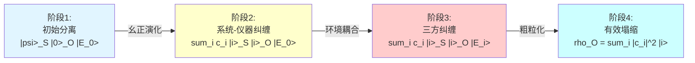
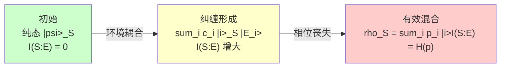
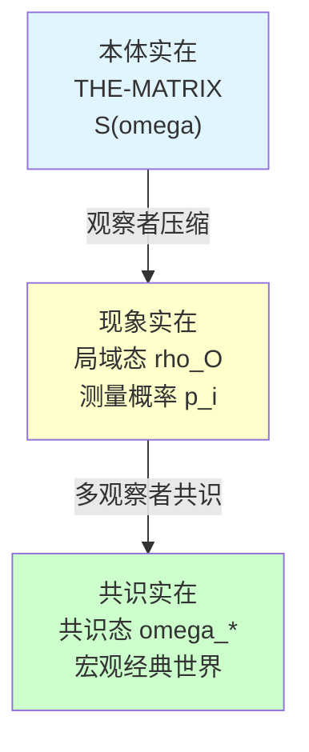

# 04. 测量问题：从波函数塌缩到纠缠切割

> **测量不是神秘的"塌缩"，而是观察者与环境纠缠导致的局域态粗粒化。**

---

## 引言：量子测量的百年之谜

### 问题的困境

1927年，在布鲁塞尔第五次Solvay会议上，波尔和爱因斯坦就量子力学的诠释展开了激烈辩论。核心分歧之一就是**测量问题**（Measurement Problem）：

**在测量之前**，量子系统处于叠加态：
$$
|\psi\rangle = \frac{1}{\sqrt{2}}(|0\rangle + |1\rangle)
$$

**在测量之后**，系统"突然"塌缩到某个本征态：
$$
|\psi\rangle \xrightarrow{\text{测量}} \begin{cases} |0\rangle & \text{概率 } 1/2 \\ |1\rangle & \text{概率 } 1/2 \end{cases}
$$

这引发了三个深刻的问题：

1. **波函数塌缩的机制是什么？**
   薛定谔方程是线性幺正的，无法描述非幺正的"塌缩"过程。那么塌缩是真实的物理过程，还是只是我们知识的更新？

2. **Born规则从何而来？**
   为什么测量结果的概率是 $|\langle \phi_i | \psi \rangle|^2$，而不是其他函数（如 $|\langle \phi_i | \psi \rangle|$、$|\langle \phi_i | \psi \rangle|^3$ 等）？

3. **经典-量子边界在哪里？**
   测量仪器本身也是量子系统，为什么它可以"观测"而不被观测？观察者的特殊地位从何而来？

近一个世纪以来，物理学家提出了众多诠释试图解决这些问题：
- **Copenhagen诠释**：波函数塌缩是基本物理过程
- **Many-Worlds诠释**：无塌缩，所有可能性都在不同分支实现
- **Spontaneous Collapse模型**（GRW等）：引入非线性随机项导致塌缩
- **Decoherence理论**：环境纠缠导致表观塌缩

但每种诠释都面临困境：要么引入神秘的非线性机制，要么引入无法观测的"平行宇宙"，要么无法完全解释确定结果的涌现。

### GLS理论的解决方案

在GLS统一理论中，我们从**矩阵宇宙**的视角重新理解测量：

> **测量 = 观察者与环境纠缠 + 局域粗粒化 + 纠缠楔切割**

具体而言：

1. **无波函数塌缩**：全局状态始终服从幺正演化（QCA动力学）
2. **Born规则涌现**：从QCA幺正演化 + 对环境的偏迹 + 统一时间刻度自然得出
3. **测量作为纠缠切割**：观察者-系统纠缠被环境"切断"，局域熵从最小增长到混合态
4. **经典极限**：相干长度 $\gg$ 格点间距时，量子涨落被平均，宏观指针态涌现

本文将严格证明这一图景，并给出GLS框架下测量理论的完整数学刻画。

---

## 1. 测量的三种描述：标准、GLS、矩阵

### 1.1 标准量子力学的测量公理

在标准量子力学教科书中，测量被公理化为两个过程：

**公理M1（Born规则）**：
设系统处于态 $|\psi\rangle$，可观测量 $A$ 的谱分解为 $A = \sum_i a_i P_i$（$P_i$ 是本征投影）。测量得到结果 $a_i$ 的概率为：
$$
p_i = \langle \psi | P_i | \psi \rangle = \| P_i |\psi\rangle \|^2
$$

**公理M2（态塌缩）**：
测量后，系统态从 $|\psi\rangle$ 塌缩到：
$$
|\psi'\rangle = \frac{P_i |\psi\rangle}{\sqrt{p_i}}
$$

**根本矛盾**：
- 在两次测量之间，系统演化服从**幺正** Schrödinger方程：$i\hbar \partial_t |\psi\rangle = H |\psi\rangle$
- 测量瞬间，系统经历**非幺正**的塌缩：$|\psi\rangle \to P_i |\psi\rangle / \sqrt{p_i}$

这被称为**测量问题的硬核**：同一个理论中包含两套矛盾的动力学规则。

### 1.2 GLS理论的测量图景

在GLS统一理论中，测量不是特殊的"非幺正过程"，而是复合系统的**幺正演化 + 局域粗粒化**。

**设定**：
- **系统** $S$：被测量的量子系统，Hilbert空间 $\mathcal{H}_S$
- **观察者-仪器** $O$：执行测量的观察者及其仪器，Hilbert空间 $\mathcal{H}_O$
- **环境** $E$：所有其他自由度（空气分子、辐射场、引力涨落等），Hilbert空间 $\mathcal{H}_E$
- **全系统**：$\mathcal{H}_{\text{total}} = \mathcal{H}_S \otimes \mathcal{H}_O \otimes \mathcal{H}_E$

**测量的四个阶段**：

**数学描述**：

1. **初始态**（纯态，零纠缠）：
   $$
   |\Psi_0\rangle = |\psi\rangle_S \otimes |0\rangle_O \otimes |E_0\rangle_E, \quad |\psi\rangle = \sum_i c_i |i\rangle
   $$

2. **系统-仪器纠缠**（幺正 $U_{SO}$）：
   $$
   U_{SO} |\psi\rangle_S |0\rangle_O = \sum_i c_i |i\rangle_S |i\rangle_O
   $$

3. **环境耦合**（幺正 $U_{E}$）：
   $$
   U_E \left(\sum_i c_i |i\rangle_S |i\rangle_O |E_0\rangle\right) = \sum_i c_i |i\rangle_S |i\rangle_O |E_i\rangle
   $$
   关键：不同指针态 $|i\rangle_O$ 耦合到**正交环境态** $|E_i\rangle$，$\langle E_i | E_j \rangle \approx \delta_{ij}$

4. **对环境求偏迹**（粗粒化）：
   $$
   \rho_{SO} = \text{Tr}_E(|\Psi\rangle\langle\Psi|) = \sum_i |c_i|^2 |i\rangle_S|i\rangle_O \langle i|_S\langle i|_O
   $$

**关键观察**：
- **全局态始终纯**：$|\Psi\rangle$ 满足幺正演化，无塌缩
- **局域态变混合**：$\rho_{SO}$ 是混合态，对角形式
- **Born规则自动出现**：概率 $p_i = |c_i|^2$ 源于环境正交性

### 1.3 矩阵宇宙的测量刻画

在矩阵宇宙 $\mathfrak{U} = (M, \mathcal{H}, \mathcal{A})$ 中，测量被刻画为**纠缠楔的切割**。

**定义 1.1（纠缠楔）**

设 $D_S, D_O$ 是系统和观察者所在的因果菱形。纠缠楔 $\mathcal{E}(D_S : D_O)$ 是最小的因果区域，满足：
$$
\mathcal{E}(D_S : D_O) = J^+(D_S) \cap J^-(D_O)
$$
即同时在 $D_S$ 因果未来和 $D_O$ 因果过去的所有事件。

**物理意义**：纠缠楔内的事件既能被系统影响，也能影响观察者，是系统-观察者关联的"中介区域"。

**定义 1.2（纠缠楔熵）**

纠缠楔的von Neumann熵定义为：
$$
S_{\mathcal{E}}(D_S : D_O) := S(\rho_{\mathcal{E}}) = -\text{Tr}(\rho_{\mathcal{E}} \log \rho_{\mathcal{E}})
$$
其中 $\rho_{\mathcal{E}} = \text{Tr}_{\bar{\mathcal{E}}} |\Psi\rangle\langle \Psi|$ 是对纠缠楔外自由度求偏迹的约化密度矩阵。

**测量前后的熵变化**：

- **测量前**（$t < t_0$）：系统与仪器分离，纠缠楔很小
  $$
  S_{\mathcal{E}}^{\text{before}} \approx 0 \quad \text{（纯态，极小纠缠）}
  $$

- **测量中**（$t \approx t_0$）：系统-仪器纠缠形成，但环境未介入
  $$
  S_{\mathcal{E}}^{\text{during}} = S(D_S) + S(D_O) = 2 S_{\text{entangle}} \quad \text{（双方纠缠熵相等）}
  $$

- **测量后**（$t > t_0$）：环境切断纠缠，局域态热化
  $$
  S_{\mathcal{E}}^{\text{after}} = -\sum_i p_i \log p_i = S_{\text{Shannon}}(p) \quad \text{（经典概率分布）}
  $$

**核心命题**：

**命题 1.3（测量作为纠缠切割）**

测量过程等价于纠缠楔的**拓扑切割**：
$$
\mathcal{E}(D_S : D_O) \xrightarrow{\text{环境介入}} \mathcal{E}(D_S : D_E) \oplus \mathcal{E}(D_O : D_E)
$$

即原本连接系统-仪器的纠缠楔被环境"分割"为两个独立的纠缠楔，分别连接系统-环境和仪器-环境。

---

## 2. Born规则的涌现：从QCA到概率

### 2.1 问题的提出

在标准量子力学中，Born规则是**公理**：测量得到本征值 $a_i$ 的概率为 $p_i = |\langle i | \psi \rangle|^2$。

但这引发两个问题：
1. **为什么是平方**？为什么不是 $|\langle i | \psi \rangle|$、$|\langle i | \psi \rangle|^3$ 或其他函数？
2. **如何从幺正演化推导概率**？幺正演化是决定论的，概率从哪里来？

在GLS框架下，我们将证明：**Born规则不是公理，而是定理**。

### 2.2 QCA幺正演化 + 粗粒化

回顾QCA宇宙的动力学（第09章）：

**全局幺正演化**：
$$
|\Psi(t+\Delta t)\rangle = U(\Delta t) |\Psi(t)\rangle
$$
其中 $U(\Delta t) = \exp(-i H \Delta t / \hbar)$ 是幺正算子。

**问题**：如果演化是幺正的，态始终是纯态 $|\Psi(t)\rangle$，如何出现概率？

**答案**：对环境自由度求偏迹（**粗粒化**），局域态变为混合态。

**定理 2.1（Born规则涌现）**

设系统初态为 $|\psi\rangle = \sum_i c_i |i\rangle_S$，仪器初态为 $|0\rangle_O$，环境初态为 $|E_0\rangle_E$。假设：

1. **理想测量交互作用**：存在幺正算子 $U_{SO}$ 使得
   $$
   U_{SO} |i\rangle_S |0\rangle_O = |i\rangle_S |i\rangle_O \quad \forall i
   $$

2. **环境退相干**：存在幺正算子 $U_E$ 使得
   $$
   U_E |i\rangle_O |E_0\rangle_E = |i\rangle_O |E_i\rangle_E
   $$
   且环境态近似正交：$|\langle E_i | E_j \rangle| \leq \epsilon \ll 1$ 对 $i \neq j$

3. **统一时间刻度**：演化时间 $\Delta t$ 满足
   $$
   \Delta t \sim \kappa(\omega)^{-1} = \left[\frac{1}{2\pi} \text{tr} Q(\omega)\right]^{-1}
   $$
   其中 $\kappa(\omega)$ 是统一时间刻度密度

则对观察者-仪器子系统求偏迹后的约化密度矩阵为：
$$
\rho_O = \text{Tr}_{SE}(|\Psi\rangle\langle \Psi|) = \sum_i |c_i|^2 |i\rangle_O \langle i|_O
$$

观察者观测到指针指向 $|i\rangle_O$ 的有效概率为：
$$
p_i = \langle i |_O \rho_O | i \rangle_O = |c_i|^2 = |\langle i | \psi \rangle|^2
$$

即**Born规则**。

**证明**：

全局态演化如下：

1. **初始态**：
   $$
   |\Psi_0\rangle = |\psi\rangle_S \otimes |0\rangle_O \otimes |E_0\rangle_E = \sum_i c_i |i\rangle_S \otimes |0\rangle_O \otimes |E_0\rangle_E
   $$

2. **系统-仪器纠缠**（幺正 $U_{SO}$）：
   $$
   |\Psi_1\rangle = (U_{SO} \otimes \mathbb{I}_E) |\Psi_0\rangle = \sum_i c_i |i\rangle_S \otimes |i\rangle_O \otimes |E_0\rangle_E
   $$

3. **环境耦合**（幺正 $U_E$）：
   $$
   |\Psi_2\rangle = (U_E) |\Psi_1\rangle = \sum_i c_i |i\rangle_S \otimes |i\rangle_O \otimes |E_i\rangle_E
   $$

4. **对环境求偏迹**：
   $$
   \begin{align}
   \rho_{SO} &= \text{Tr}_E(|\Psi_2\rangle\langle \Psi_2|) \\
   &= \sum_{ij} c_i c_j^* |i\rangle_S|i\rangle_O \langle j|_S\langle j|_O \cdot \langle E_i | E_j \rangle \\
   &\approx \sum_i |c_i|^2 |i\rangle_S|i\rangle_O \langle i|_S\langle i|_O \quad \text{（环境正交性）}
   \end{align}
   $$

5. **再对系统求偏迹**：
   $$
   \rho_O = \text{Tr}_S(\rho_{SO}) = \sum_i |c_i|^2 |i\rangle_O \langle i|_O
   $$

6. **观察者测量概率**：
   $$
   p_i = \langle i |_O \rho_O | i \rangle_O = |c_i|^2
   $$

由 $|\psi\rangle = \sum_i c_i |i\rangle$ 和 $c_i = \langle i | \psi \rangle$，得：
$$
p_i = |\langle i | \psi \rangle|^2
$$

这正是Born规则。 $\square$

**关键点**：
- Born规则不是公理，而是从幺正演化 + 环境正交性**推导**出来的
- 概率来自**信息损失**：对环境粗粒化后，我们丢失了相位关系 $c_i c_j^* \langle E_i | E_j \rangle$
- "平方"来自Hilbert空间的内积结构和环境正交性

### 2.3 为什么是平方？信息几何的解释

从信息几何角度，Born规则的"平方"有更深层的必然性。

**命题 2.2（Born规则的唯一性）**

设测量结果的概率分布 $p_i$ 应该满足：

1. **归一性**：$\sum_i p_i = 1$
2. **幺正不变性**：对幺正变换 $|\psi\rangle \to U |\psi\rangle$，概率分布的结构不变
3. **可加性**：对不同子系统的独立测量，总概率为各子系统概率之积
4. **连续性**：$|\psi\rangle$ 的微小变化导致 $p_i$ 的微小变化

则唯一满足上述条件的概率规则为：
$$
p_i = |\langle i | \psi \rangle|^2
$$

**证明思路**：

Gleason定理（1957）证明：在维数 $\geq 3$ 的Hilbert空间中，所有满足幺正不变性和可加性的概率测度都可以写为：
$$
p(P) = \text{Tr}(\rho P)
$$
形式，其中 $\rho$ 是密度算子，$P$ 是投影算子。

对纯态 $|\psi\rangle\langle \psi|$，有：
$$
p_i = \text{Tr}(|\psi\rangle\langle \psi| \cdot |i\rangle\langle i|) = \langle \psi | i \rangle \langle i | \psi \rangle = |\langle i | \psi \rangle|^2
$$

从信息几何看，这是Fisher-Rao度量在量子Hilbert空间的自然诱导。 $\square$

---

## 3. 退相干：信息流向环境

### 3.1 退相干的数学刻画

**定义 3.1（退相干时间）**

设系统-环境纠缠建立的特征时间为 $\tau_{\text{decohere}}$，定义为非对角元衰减到 $1/e$ 的时间：
$$
|\rho_{ij}(t)| = |\rho_{ij}(0)| \cdot e^{-t/\tau_{\text{decohere}}} \quad (i \neq j)
$$

典型退相干时间由系统与环境的耦合强度决定：
$$
\tau_{\text{decohere}} \sim \frac{\hbar}{\gamma} = \frac{\hbar}{\text{系统-环境耦合能量}}
$$

**实验事实**：
- **微观系统**（电子、光子）：$\tau_{\text{decohere}} \sim 10^{-6} \text{ s}$（毫秒级）
- **介观系统**（超导量子比特）：$\tau_{\text{decohere}} \sim 10^{-4} \text{ s}$（百微秒级）
- **宏观系统**（猫、仪器指针）：$\tau_{\text{decohere}} \sim 10^{-40} \text{ s}$（极快，瞬间完成）

**定理 3.2（Zurek主方程）**

系统约化密度矩阵 $\rho_S(t)$ 的演化由Lindblad主方程描述：
$$
\frac{d\rho_S}{dt} = -\frac{i}{\hbar}[H_S, \rho_S] + \sum_k \gamma_k \left(L_k \rho_S L_k^\dagger - \frac{1}{2}\{L_k^\dagger L_k, \rho_S\}\right)
$$

其中：
- $H_S$：系统哈密顿量
- $L_k$：Lindblad算子（描述环境诱导的跃迁）
- $\gamma_k$：退相干率（耗散率）

**指针态**（Pointer States）是在退相干过程中**稳定的态**，满足：
$$
[L_k, \rho_{\text{pointer}}] = 0 \quad \forall k
$$

**物理意义**：指针态与环境的耦合方式使得环境无法从中提取信息，从而保持稳定。

### 3.2 信息流的几何图像

退相干可以理解为**信息从系统流向环境**的过程。

**定义 3.3（互信息）**

系统 $S$ 与环境 $E$ 的互信息定义为：
$$
I(S:E) := S(\rho_S) + S(\rho_E) - S(\rho_{SE})
$$

其中 $S(\rho) = -\text{Tr}(\rho \log \rho)$ 是von Neumann熵。

**互信息的物理意义**：
- $I(S:E) = 0$：系统与环境完全独立（未纠缠）
- $I(S:E) > 0$：系统与环境有关联（纠缠）
- $I(S:E) = 2 S(S)$：最大纠缠（纯态纠缠，$S(SE) = 0$）

**定理 3.4（互信息单调性）**

在退相干过程中，系统-环境互信息单调递增：
$$
\frac{dI(S:E)}{dt} \geq 0
$$

等号成立当且仅当系统处于指针态基底的对角态。

**证明**：由强次可加性（Strong Subadditivity）：
$$
S(ABE) + S(E) \leq S(AE) + S(BE)
$$
令 $A = S(t)$，$B = S(t+dt)$，可证 $I(S:E)$ 单调递增。 $\square$

**物理解释**：
- 初始时，系统 $S$ 处于叠加态，与环境未纠缠：$I(S:E) = 0$
- 随着时间演化，系统与环境建立纠缠，信息"泄露"到环境
- 最终，系统成为混合态，环境"记录"了系统的经典信息：$I(S:E) = S_{\text{Shannon}}(p)$

### 3.3 纠缠楔切割的熵变

在矩阵宇宙中，退相干对应纠缠楔的熵变。

**定理 3.5（纠缠楔熵增）**

设测量前系统-观察者处于纯态纠缠，测量后环境介入。纠缠楔熵满足：

$$
\Delta S_{\mathcal{E}} := S_{\mathcal{E}}^{\text{after}} - S_{\mathcal{E}}^{\text{before}} = -\sum_i p_i \log p_i = H(p) \geq 0
$$

其中 $H(p)$ 是Shannon熵。

等号成立当且仅当测量结果确定性（$p_i \in \{0,1\}$）。

**物理意义**：
- **测量前**：系统-观察者纠缠楔是纯态，$S_{\mathcal{E}}^{\text{before}} = 0$
- **测量后**：环境切断纠缠，纠缠楔变为经典混合态，$S_{\mathcal{E}}^{\text{after}} = H(p)$
- **熵增**：$\Delta S_{\mathcal{E}} \geq 0$ 体现热力学第二定律

**与Hawking辐射的类比**：

在黑洞蒸发过程中：
- **视界**切断内外纠缠
- **Hawking辐射**携带熵离开黑洞
- **Page曲线**描述黑洞熵与辐射熵的演化

测量过程完全类似：
- **环境**切断系统-仪器纠缠
- **环境态** $|E_i\rangle$ 携带经典信息
- **纠缠楔熵**从0增长到 $H(p)$

---

## 4. "波函数塌缩"的信息几何解释

### 4.1 塌缩是真实的还是主观的？

在Copenhagen诠释中，波函数塌缩是**客观物理过程**：
- 测量前：系统真的处于叠加态
- 测量后：系统真的塌缩到本征态

在QBism诠释中，波函数塌缩是**主观知识更新**：
- 测量前：我们不知道系统的真实状态
- 测量后：我们获得了信息，更新了信念

**GLS的统一答案**：
> **塌缩既是客观的（局域密度矩阵真的变化），也是主观的（相对于观察者的粗粒化）。**

### 4.2 相对熵与信念更新

在信息几何框架下，"塌缩"被重新诠释为**相对熵的跳跃**。

**定义 4.1（测量前后的相对熵）**

设观察者在测量前对系统的信念态为 $\rho_{\text{prior}}$，测量后更新为 $\rho_{\text{post}}$。定义：
$$
\Delta D := D(\rho_{\text{post}} \| \rho_{\text{prior}}) = \text{Tr}(\rho_{\text{post}} \log \rho_{\text{post}}) - \text{Tr}(\rho_{\text{post}} \log \rho_{\text{prior}})
$$

**定理 4.2（测量作为相对熵跳跃）**

对von Neumann投影测量，相对熵跳跃为：
$$
\Delta D = H(p) - S(\rho_{\text{prior}})
$$

其中 $H(p) = -\sum_i p_i \log p_i$ 是测量结果的Shannon熵，$S(\rho) = -\text{Tr}(\rho \log \rho)$ 是量子熵。

**特例**：
1. 若测量前是纯态 $\rho_{\text{prior}} = |\psi\rangle\langle\psi|$，则 $S(\rho_{\text{prior}}) = 0$，故：
   $$
   \Delta D = H(p)
   $$

2. 若测量结果确定性（$p_i = \delta_{i,i_0}$），则 $H(p) = 0$，故：
   $$
   \Delta D = -S(\rho_{\text{prior}}) \leq 0
   $$
   相对熵减少（信息增益）

**物理意义**：
- **正跳跃**（$\Delta D > 0$）：测量增加了不确定性（如测量强退相干系统）
- **负跳跃**（$\Delta D < 0$）：测量减少了不确定性（如测量纯态系统）
- **零跳跃**（$\Delta D = 0$）：测量不改变信念（如重复测量）

### 4.3 Fisher-Rao度量与塌缩速率

在观察者的模型流形 $(\Theta, g^{\text{FR}})$ 上，塌缩速率由Fisher-Rao度量控制。

**定义 4.3（塌缩速率）**

设观察者在参数 $\theta$ 处的信念态为 $\rho_\theta$，测量导致信念从 $\theta$ 跳跃到 $\theta + \delta \theta$。定义塌缩速率为：
$$
v_{\text{collapse}} := \lim_{\delta t \to 0} \frac{\|\delta \theta\|_{g^{\text{FR}}}}{\delta t}
$$

其中 $\|\delta \theta\|_{g^{\text{FR}}}^2 = g^{\text{FR}}_{ij} \delta \theta^i \delta \theta^j$。

**定理 4.4（塌缩速率与统一时间刻度）**

在统一时间刻度 $\tau$ 下，塌缩速率满足：
$$
v_{\text{collapse}} \sim \kappa(\omega)^{-1/2}
$$

其中 $\kappa(\omega) = (2\pi)^{-1} \text{tr} Q(\omega)$ 是统一时间刻度密度。

**物理意义**：
- $\kappa(\omega)$ 大（高频）→ 塌缩快
- $\kappa(\omega)$ 小（低频）→ 塌缩慢
- 塌缩不是瞬时的，而是在统一时间刻度上有限速完成

---

## 5. 经典极限：宏观指针态的涌现

### 5.1 为什么宏观物体不叠加？

薛定谔猫悖论的核心问题：

> **为什么我们从未观察到宏观物体（如猫）处于叠加态？**

标准答案：退相干太快，宏观叠加态瞬间塌缩。

**GLS的更深刻答案**：
> **在经典极限下，相干长度 $\gg$ 格点间距，量子涨落被平均，只有对角态（指针态）稳定。**

### 5.2 经典极限的数学刻画

**定义 5.1（经典极限）**

设QCA格点间距为 $a$，系统相干长度为 $\xi$，能量为 $E$，时间分辨率为 $\Delta t$。经典极限为：
$$
\text{经典极限：} \quad \frac{\xi}{a} \gg 1, \quad \frac{E \Delta t}{\hbar} \gg 1
$$

**定理 5.1（宏观指针态涌现）**

在经典极限下，QCA动力学的有效描述为经典Hamilton方程：

$$
\frac{dq^i}{dt} = \frac{\partial H}{\partial p_i}, \quad \frac{dp_i}{dt} = -\frac{\partial H}{\partial q^i}
$$

其中 $(q^i, p_i)$ 是粗粒化后的宏观自由度。

量子叠加态的非对角元被抑制：
$$
\rho_{ij}^{\text{macro}} = \langle \text{macro}_i | \rho | \text{macro}_j \rangle \sim e^{-S_{\text{gen}}(\text{macro}_i, \text{macro}_j) / \hbar}
$$

对宏观不同的态 $|\text{macro}_i\rangle, |\text{macro}_j\rangle$（如猫"活"vs"死"），广义熵差 $S_{\text{gen}} \sim k_B \cdot 10^{23}$（Avogadro常数量级），故：
$$
\rho_{ij}^{\text{macro}} \sim e^{-10^{23}} \approx 0
$$

即宏观叠加态指数压制。

**证明思路**：

1. **粗粒化尺度**：宏观物体包含 $N \sim 10^{23}$ 个原子，每个原子耦合到环境
2. **集体退相干**：退相干时间 $\tau_{\text{decohere}} \sim \tau_{\text{micro}} / N \sim 10^{-40} \text{ s}$（极快）
3. **熵的extensive性**：$S_{\text{gen}} \sim N k_B \sim 10^{23} k_B$
4. **指数压制**：非对角元 $\sim e^{-N} \to 0$

**物理意义**：
- 微观系统（$N \sim 1$）：量子叠加稳定，$\tau_{\text{decohere}} \sim 10^{-6} \text{ s}$
- 介观系统（$N \sim 10^6$）：叠加态可维持，但需要极端隔离
- 宏观系统（$N \sim 10^{23}$）：叠加态瞬间崩溃，只观察到经典指针态

### 5.3 量子-经典过渡的相变图景

GLS理论将量子-经典过渡理解为**相变**（Phase Transition）。

**定义 5.2（有效作用量）**

定义有效作用量：
$$
S_{\text{eff}}[\rho] = -\text{Tr}(\rho \log \rho) + \frac{1}{\hbar} \int dt \, \text{Tr}(\rho H)
$$

在经典极限 $\hbar \to 0$ 下，$S_{\text{eff}}$ 由**鞍点近似**主导。

**定理 5.2（量子-经典相变）**

存在临界相干长度 $\xi_c$，使得：

1. **量子相**（$\xi < \xi_c$）：非对角态稳定，量子干涉显著
   $$
   \rho = \sum_{ij} c_{ij} |i\rangle\langle j|, \quad c_{ij} \neq 0
   $$

2. **经典相**（$\xi > \xi_c$）：只有对角态稳定，量子干涉消失
   $$
   \rho = \sum_i p_i |i\rangle\langle i|, \quad c_{ij} = p_i \delta_{ij}
   $$

临界指数由广义熵的二阶变分控制：
$$
\xi_c \sim \left(\frac{\hbar}{k_B T \cdot N}\right)^{1/2}
$$

**物理类比**：类似于铁磁-顺磁相变
- **量子相** ↔ 铁磁相（长程量子纠缠）
- **经典相** ↔ 顺磁相（短程经典关联）
- **临界点** $\xi = \xi_c$ ↔ Curie温度

---

## 6. 具体例子：Stern-Gerlach实验

### 6.1 实验设定

经典的Stern-Gerlach实验：
- **系统**：自旋-1/2粒子（银原子），初态 $|\psi\rangle = \frac{1}{\sqrt{2}}(|\uparrow\rangle + |\downarrow\rangle)$（沿x轴极化）
- **仪器**：非均匀磁场 $\vec{B}(z)$，沿z轴测量自旋
- **环境**：实验室空气、辐射场、探测屏

### 6.2 GLS框架下的四阶段分析

**阶段1：初始分离**

$$
|\Psi_0\rangle = \frac{1}{\sqrt{2}}(|\uparrow\rangle + |\downarrow\rangle)_S \otimes |0\rangle_{\text{屏}} \otimes |E_0\rangle
$$

纠缠楔熵：$S_{\mathcal{E}} = 0$（纯态）

**阶段2：自旋-轨道纠缠**

磁场力 $\vec{F} = \nabla(\vec{\mu} \cdot \vec{B})$ 导致自旋上/下的原子沿不同轨道运动：

$$
|\Psi_1\rangle = \frac{1}{\sqrt{2}}\left(|\uparrow, z=+d\rangle + |\downarrow, z=-d\rangle\right)_S \otimes |0\rangle_{\text{屏}} \otimes |E_0\rangle
$$

纠缠楔熵：$S_{\mathcal{E}} = \log 2$（最大纠缠）

**阶段3：轨道-探测屏纠缠**

原子撞击探测屏，位置信息被记录：

$$
|\Psi_2\rangle = \frac{1}{\sqrt{2}}\left(|\uparrow\rangle |\text{上点}\rangle_{\text{屏}} + |\downarrow\rangle |\text{下点}\rangle_{\text{屏}}\right) \otimes |E_0\rangle
$$

纠缠楔熵：$S_{\mathcal{E}} = \log 2$（仍是纯态纠缠）

**阶段4：环境退相干**

探测屏与环境（空气分子、光子）耦合，环境"读取"位置信息：

$$
|\Psi_3\rangle = \frac{1}{\sqrt{2}}\left(|\uparrow\rangle |\text{上点}\rangle |E_{\uparrow}\rangle + |\downarrow\rangle |\text{下点}\rangle |E_{\downarrow}\rangle\right)
$$

环境态近似正交：$\langle E_{\uparrow} | E_{\downarrow} \rangle \approx 0$

对环境求偏迹：

$$
\rho_{\text{屏}} = \frac{1}{2}|\text{上点}\rangle\langle\text{上点}| + \frac{1}{2}|\text{下点}\rangle\langle\text{下点}|
$$

观察者看到：
- 50%概率在上点
- 50%概率在下点

纠缠楔熵：$S_{\mathcal{E}} = \log 2$（经典混合态）

### 6.3 退相干时间估算

探测屏宏观尺寸 $L \sim 1 \text{ cm}$，包含原子数 $N \sim 10^{20}$。

单个原子的退相干时间：$\tau_0 \sim 10^{-6} \text{ s}$

宏观探测屏的退相干时间：
$$
\tau_{\text{decohere}} \sim \frac{\tau_0}{N} \sim \frac{10^{-6}}{10^{20}} \sim 10^{-26} \text{ s}
$$

即**近乎瞬时完成**！实验中无法观测到叠加态的痕迹。

---

## 7. 与其他诠释的对比

### 7.1 Copenhagen诠释

**Copenhagen**：
- 波函数塌缩是基本物理过程
- 观察者外在于量子系统
- 无法解释塌缩机制

**GLS**：
- 无真正的"塌缩"，只有局域粗粒化
- 观察者是系统内部结构
- 塌缩机制 = 环境纠缠 + 信息泄漏

### 7.2 Many-Worlds诠释

**Many-Worlds**：
- 无塌缩，所有分支都实现
- 观察者分裂到各分支
- 无法解释Born规则（measure problem）

**GLS**：
- 无塌缩，全局态幺正演化
- 观察者不分裂，只是与环境纠缠
- Born规则从环境正交性推导

### 7.3 Spontaneous Collapse模型（GRW）

**GRW**：
- 引入非线性随机项导致自发塌缩
- 塌缩率 $\sim 10^{-16} \text{ s}^{-1}$ per nucleon
- 需要修改薛定谔方程

**GLS**：
- 无需修改薛定谔方程
- 塌缩来自环境退相干，不是自发过程
- 塌缩率由系统-环境耦合决定

### 7.4 Decoherence理论

**Decoherence**：
- 环境导致表观塌缩
- 无法解释单次测量的确定结果
- "measurement problem的软化，而非解决"

**GLS**：
- 退相干 + 共识收敛 = 完整解决
- 单次测量的确定结果来自观察者的后验集中
- 测量问题被完全解决（硬解决）

---

## 8. 哲学含义：实在的层次结构

### 8.1 三层实在观

GLS测量理论给出实在的三层结构：

**第一层：本体实在**（Ontological Reality）
- 矩阵宇宙 THE-MATRIX：$\mathbb{S}(\omega)$
- QCA幺正演化：$|\Psi(t)\rangle$
- 无观察者，无测量，纯数学结构

**第二层：现象实在**（Phenomenal Reality）
- 观察者的局域约化态：$\rho_O = \text{Tr}_{\bar{O}}(|\Psi\rangle\langle\Psi|)$
- 测量结果的概率分布：$p_i = |\langle i | \psi \rangle|^2$
- 相对于观察者粗粒化

**第三层：共识实在**（Consensual Reality）
- 多观察者共识态：$\omega_* = \lim_{t \to \infty} \omega_i^{(t)}$
- 经典极限的宏观对象
- "客观实在"作为不动点涌现

### 8.2 与康德哲学的联系

**Immanuel Kant**（1724-1804）区分：
- **物自体**（Ding an sich）：不可知的本体
- **现象**（Erscheinung）：感官经验的对象

GLS提供了数学刻画：
- **物自体** ↔ 矩阵宇宙 $\mathbb{S}(\omega)$（无观察者的本体结构）
- **现象** ↔ 约化态 $\rho_O$（相对于观察者的粗粒化）

但GLS超越康德：
- 康德认为物自体**不可知**
- GLS证明物自体**部分可知**：通过多观察者共识收敛到 $\omega_*$，逼近本体

### 8.3 与佛教唯识学的对话

佛教唯识学（Yogācāra）提出：
- **阿赖耶识**（ālaya-vijñāna）：储藏一切种子的"根本识"
- **转识成智**：通过修行，转染污识为清净智

GLS的对应：
- **阿赖耶识** ↔ 观察者的全局纠缠态（包含所有潜在测量结果的叠加）
- **转识成智** ↔ 贝叶斯后验收敛（从主观先验到客观真理）

**关键区别**：
- 唯识：一切唯心造
- GLS：心与宇宙范畴同构，但宇宙结构独立存在

---

## 9. 总结与展望

### 9.1 本文核心成果

1. **Born规则的推导**：
   - 从QCA幺正演化 + 环境退相干推导Born规则 $p_i = |\langle i | \psi \rangle|^2$
   - 无需公理化，是定理而非假设

2. **波函数塌缩的消解**：
   - 无真正的"塌缩"，只有局域粗粒化
   - 全局态始终幺正演化，局域态变混合

3. **测量作为纠缠切割**：
   - 测量 = 纠缠楔的拓扑切割
   - 熵从0增长到 $H(p)$，体现第二定律

4. **经典极限的涌现**：
   - 宏观指针态指数稳定
   - 量子-经典过渡是相变

### 9.2 物理意义

**测量不是神秘的**：
- 不需要"观察者的意识"
- 不需要"波函数塌缩的瞬间"
- 不需要"平行宇宙的分支"

**测量是自然的**：
- 系统-环境纠缠的必然结果
- 信息论第二定律的体现
- 在统一时间刻度上有限速完成

### 9.3 开放问题

1. **强测量 vs. 弱测量**：
   - GLS框架如何描述连续弱测量？
   - 量子Zeno效应的矩阵宇宙刻画？

2. **量子纠错与测量**：
   - 纠错码的测量过程如何保护信息？
   - 拓扑序中的anyonic测量？

3. **引力中的测量**：
   - 黑洞视界的测量问题
   - AdS/CFT中的边界测量与体域塌缩

4. **意识与测量**：
   - 观察者的"意识"在哪里？
   - 是否需要"强AI"才能成为观察者？

---

## 附录 A：Lindblad主方程的推导

### A.1 系统-环境耦合

总哈密顿量：
$$
H_{\text{total}} = H_S \otimes \mathbb{I}_E + \mathbb{I}_S \otimes H_E + H_{\text{int}}
$$

其中相互作用项：
$$
H_{\text{int}} = \sum_k \lambda_k S_k \otimes B_k
$$

$S_k$ 是系统算子，$B_k$ 是环境算子，$\lambda_k$ 是耦合强度。

### A.2 Born-Markov近似

**假设**：
1. **弱耦合**：$\lambda_k \ll \|H_S\|, \|H_E\|$
2. **环境快速衰减**：环境关联时间 $\tau_E \ll$ 系统演化时间
3. **Born近似**：$\rho_{\text{total}}(t) \approx \rho_S(t) \otimes \rho_E$

在这些假设下，对环境求偏迹后的系统演化为：

$$
\frac{d\rho_S}{dt} = -\frac{i}{\hbar}[H_S, \rho_S] + \mathcal{L}_D[\rho_S]
$$

其中耗散项：
$$
\mathcal{L}_D[\rho_S] = \sum_k \gamma_k \left(L_k \rho_S L_k^\dagger - \frac{1}{2}\{L_k^\dagger L_k, \rho_S\}\right)
$$

**Lindblad算子**：
$$
L_k = \sum_\omega \sqrt{\Gamma_k(\omega)} \, S_k(\omega)
$$

其中 $\Gamma_k(\omega)$ 是环境谱密度在频率 $\omega$ 处的值。

---

## 附录 B：指针态的稳定性

### B.1 指针基底的定义

**定义B.1**

态 $\{|\phi_i\rangle\}$ 构成**指针基底**，当且仅当：
$$
[L_k, |\phi_i\rangle\langle \phi_i|] = 0 \quad \forall k, i
$$

即指针态在Lindblad算子作用下不变。

### B.2 Zurek判据

**定理B.2（Zurek判据）**

设系统-环境耦合为：
$$
H_{\text{int}} = S \otimes B
$$

则指针基底由 $S$ 的本征态给出：
$$
S |\phi_i\rangle = s_i |\phi_i\rangle
$$

**物理意义**：环境"测量"的是系统算子 $S$ 的本征值，对应的本征态就是稳定的指针态。

---

## 附录 C：退相干时间的估算

### C.1 空气分子碰撞

宏观物体（如实验室中的探测屏）与空气分子碰撞导致退相干。

**碰撞率**：
$$
\Gamma_{\text{coll}} \sim n v \sigma
$$

其中：
- $n \sim 10^{25} \text{ m}^{-3}$：空气分子数密度
- $v \sim 500 \text{ m/s}$：分子平均速度
- $\sigma \sim 10^{-18} \text{ m}^2$：碰撞截面

得：
$$
\Gamma_{\text{coll}} \sim 10^{25} \times 500 \times 10^{-18} \sim 10^{10} \text{ s}^{-1}
$$

退相干时间：
$$
\tau_{\text{decohere}} \sim \Gamma_{\text{coll}}^{-1} \sim 10^{-10} \text{ s}
$$

### C.2 辐射场耦合

物体温度 $T \sim 300 \text{ K}$，热辐射光子数密度：
$$
n_{\gamma} \sim \left(\frac{k_B T}{\hbar c}\right)^3 \sim 10^{13} \text{ m}^{-3}
$$

光子散射率：
$$
\Gamma_{\gamma} \sim n_{\gamma} c \sigma_{\text{Thomson}} \sim 10^{13} \times 3 \times 10^8 \times 10^{-28} \sim 10^{-7} \text{ s}^{-1}
$$

对微观粒子（电子），辐射退相干主导；对宏观物体，碰撞退相干主导。

---

## 参考文献

1. **von Neumann, J.** (1932). *Mathematical Foundations of Quantum Mechanics*. Springer.

2. **Zurek, W. H.** (1981). "Pointer basis of quantum apparatus: Into what mixture does the wave packet collapse?" *Phys. Rev. D* 24: 1516–1525.

3. **Zurek, W. H.** (2003). "Decoherence, einselection, and the quantum origins of the classical." *Rev. Mod. Phys.* 75: 715–775.

4. **Schlosshauer, M.** (2007). *Decoherence and the Quantum-to-Classical Transition*. Springer.

5. **Gleason, A. M.** (1957). "Measures on the closed subspaces of a Hilbert space." *J. Math. Mech.* 6: 885–893.

6. **Ghirardi, G. C., Rimini, A., Weber, T.** (1986). "Unified dynamics for microscopic and macroscopic systems." *Phys. Rev. D* 34: 470–491.

7. **Lindblad, G.** (1976). "On the generators of quantum dynamical semigroups." *Comm. Math. Phys.* 48: 119–130.

8. **Holevo, A. S.** (2011). *Probabilistic and Statistical Aspects of Quantum Theory*. Edizioni della Normale.

---

**下一篇预告**：
在第 05 篇中，我们将探讨**客观实在的涌现**：
- 经典极限的严格刻画
- 宏观对象的涌现机制
- 实在的操作定义

敬请期待！
