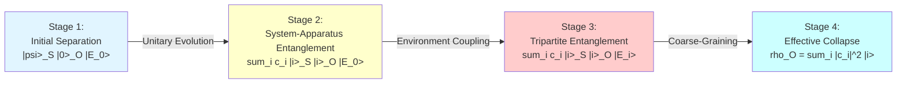
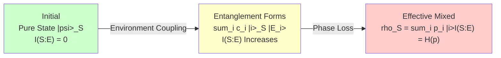
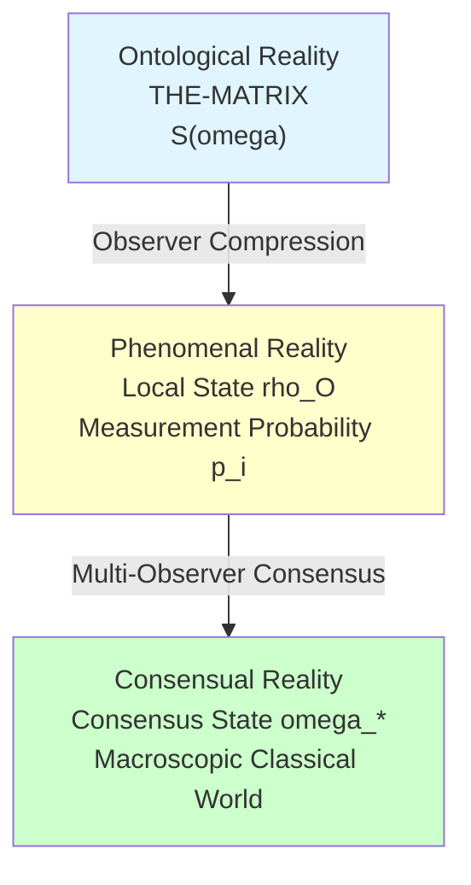

# 04. Measurement Problem: From Wave Function Collapse to Entanglement Cutting

> **Measurement is not a mysterious "collapse," but local state coarse-graining caused by observer-environment entanglement.**

---

## Introduction: The Century-Old Mystery of Quantum Measurement

### The Dilemma

In 1927, at the Fifth Solvay Conference in Brussels, Bohr and Einstein engaged in intense debate over the interpretation of quantum mechanics. One of the core disagreements was the **Measurement Problem**:

**Before measurement**, the quantum system is in a superposition state:
$$
|\psi\rangle = \frac{1}{\sqrt{2}}(|0\rangle + |1\rangle)
$$

**After measurement**, the system "suddenly" collapses to some eigenstate:
$$
|\psi\rangle \xrightarrow{\text{measurement}} \begin{cases} |0\rangle & \text{probability } 1/2 \\ |1\rangle & \text{probability } 1/2 \end{cases}
$$

This raises three profound questions:

1. **What is the mechanism of wave function collapse?**
   The Schrödinger equation is linear and unitary, unable to describe the non-unitary "collapse" process. Is collapse a real physical process, or just an update of our knowledge?

2. **Where does Born's rule come from?**
   Why is the probability of measurement results $|\langle \phi_i | \psi \rangle|^2$, rather than other functions (such as $|\langle \phi_i | \psi \rangle|$, $|\langle \phi_i | \psi \rangle|^3$, etc.)?

3. **Where is the classical-quantum boundary?**
   Measurement instruments themselves are quantum systems, so why can they "observe" without being observed? Where does the observer's special status come from?

For nearly a century, physicists have proposed numerous interpretations attempting to solve these problems:
- **Copenhagen Interpretation**: Wave function collapse is a fundamental physical process
- **Many-Worlds Interpretation**: No collapse, all possibilities are realized in different branches
- **Spontaneous Collapse Models** (GRW, etc.): Introduce nonlinear stochastic terms causing collapse
- **Decoherence Theory**: Environmental entanglement causes apparent collapse

But each interpretation faces difficulties: either introducing mysterious nonlinear mechanisms, or introducing unobservable "parallel universes," or failing to fully explain the emergence of definite results.

### GLS Theory's Solution

In the GLS unified theory, we reinterpret measurement from the perspective of the **matrix universe**:

> **Measurement = Observer-Environment Entanglement + Local Coarse-Graining + Entanglement Wedge Cutting**

Specifically:

1. **No wave function collapse**: Global state always obeys unitary evolution (QCA dynamics)
2. **Born's rule emerges**: Naturally derived from QCA unitary evolution + partial trace over environment + unified time scale
3. **Measurement as entanglement cutting**: Observer-system entanglement is "cut" by the environment, local entropy grows from minimum to mixed state
4. **Classical limit**: When coherence length $\gg$ lattice spacing, quantum fluctuations are averaged, macroscopic pointer states emerge

This article will rigorously prove this picture and provide a complete mathematical characterization of measurement theory in the GLS framework.

---

## 1. Three Descriptions of Measurement: Standard, GLS, Matrix

### 1.1 Measurement Axioms of Standard Quantum Mechanics

In standard quantum mechanics textbooks, measurement is axiomatized as two processes:

**Axiom M1 (Born's Rule)**:
Let the system be in state $|\psi\rangle$, and observable $A$ have spectral decomposition $A = \sum_i a_i P_i$ (where $P_i$ are eigenprojections). The probability of obtaining result $a_i$ is:
$$
p_i = \langle \psi | P_i | \psi \rangle = \| P_i |\psi\rangle \|^2
$$

**Axiom M2 (State Collapse)**:
After measurement, the system state collapses from $|\psi\rangle$ to:
$$
|\psi'\rangle = \frac{P_i |\psi\rangle}{\sqrt{p_i}}
$$

**Fundamental Contradiction**:
- Between two measurements, system evolution obeys **unitary** Schrödinger equation: $i\hbar \partial_t |\psi\rangle = H |\psi\rangle$
- At the moment of measurement, the system undergoes **non-unitary** collapse: $|\psi\rangle \to P_i |\psi\rangle / \sqrt{p_i}$

This is called the **hard core of the measurement problem**: the same theory contains two contradictory dynamical rules.

### 1.2 GLS Theory's Measurement Picture

In the GLS unified theory, measurement is not a special "non-unitary process," but **unitary evolution + local coarse-graining** of a composite system.

**Setup**:
- **System** $S$: The quantum system being measured, Hilbert space $\mathcal{H}_S$
- **Observer-Apparatus** $O$: The observer performing measurement and their apparatus, Hilbert space $\mathcal{H}_O$
- **Environment** $E$: All other degrees of freedom (air molecules, radiation field, gravitational fluctuations, etc.), Hilbert space $\mathcal{H}_E$
- **Total System**: $\mathcal{H}_{\text{total}} = \mathcal{H}_S \otimes \mathcal{H}_O \otimes \mathcal{H}_E$

**Four Stages of Measurement**:

**Mathematical Description**:

1. **Initial State** (pure state, zero entanglement):
   $$
   |\Psi_0\rangle = |\psi\rangle_S \otimes |0\rangle_O \otimes |E_0\rangle_E, \quad |\psi\rangle = \sum_i c_i |i\rangle
   $$

2. **System-Apparatus Entanglement** (unitary $U_{SO}$):
   $$
   U_{SO} |\psi\rangle_S |0\rangle_O = \sum_i c_i |i\rangle_S |i\rangle_O
   $$

3. **Environment Coupling** (unitary $U_{E}$):
   $$
   U_E \left(\sum_i c_i |i\rangle_S |i\rangle_O |E_0\rangle\right) = \sum_i c_i |i\rangle_S |i\rangle_O |E_i\rangle
   $$
   Key: Different pointer states $|i\rangle_O$ couple to **orthogonal environment states** $|E_i\rangle$, $\langle E_i | E_j \rangle \approx \delta_{ij}$

4. **Partial Trace Over Environment** (coarse-graining):
   $$
   \rho_{SO} = \text{Tr}_E(|\Psi\rangle\langle\Psi|) = \sum_i |c_i|^2 |i\rangle_S|i\rangle_O \langle i|_S\langle i|_O
   $$

**Key Observations**:
- **Global state always pure**: $|\Psi\rangle$ satisfies unitary evolution, no collapse
- **Local state becomes mixed**: $\rho_{SO}$ is a mixed state, diagonal form
- **Born's rule automatically appears**: Probability $p_i = |c_i|^2$ arises from environmental orthogonality

### 1.3 Measurement Characterization in Matrix Universe

In the matrix universe $\mathfrak{U} = (M, \mathcal{H}, \mathcal{A})$, measurement is characterized as **cutting of the entanglement wedge**.

**Definition 1.1 (Entanglement Wedge)**

Let $D_S, D_O$ be the causal diamonds where the system and observer are located. The entanglement wedge $\mathcal{E}(D_S : D_O)$ is the smallest causal region satisfying:
$$
\mathcal{E}(D_S : D_O) = J^+(D_S) \cap J^-(D_O)
$$
That is, all events simultaneously in the causal future of $D_S$ and the causal past of $D_O$.

**Physical Meaning**: Events within the entanglement wedge can both be influenced by the system and influence the observer, serving as the "intermediary region" for system-observer correlation.

**Definition 1.2 (Entanglement Wedge Entropy)**

The von Neumann entropy of the entanglement wedge is defined as:
$$
S_{\mathcal{E}}(D_S : D_O) := S(\rho_{\mathcal{E}}) = -\text{Tr}(\rho_{\mathcal{E}} \log \rho_{\mathcal{E}})
$$
where $\rho_{\mathcal{E}} = \text{Tr}_{\bar{\mathcal{E}}} |\Psi\rangle\langle \Psi|$ is the reduced density matrix obtained by partial trace over degrees of freedom outside the entanglement wedge.

**Entropy Changes Before and After Measurement**:

- **Before measurement** ($t < t_0$): System and apparatus separated, entanglement wedge small
  $$
  S_{\mathcal{E}}^{\text{before}} \approx 0 \quad \text{(pure state, minimal entanglement)}
  $$

- **During measurement** ($t \approx t_0$): System-apparatus entanglement forms, but environment not yet involved
  $$
  S_{\mathcal{E}}^{\text{during}} = S(D_S) + S(D_O) = 2 S_{\text{entangle}} \quad \text{(equal entanglement entropy on both sides)}
  $$

- **After measurement** ($t > t_0$): Environment cuts entanglement, local state thermalizes
  $$
  S_{\mathcal{E}}^{\text{after}} = -\sum_i p_i \log p_i = S_{\text{Shannon}}(p) \quad \text{(classical probability distribution)}
  $$

**Core Proposition**:

**Proposition 1.3 (Measurement as Entanglement Cutting)**

The measurement process is equivalent to **topological cutting** of the entanglement wedge:
$$
\mathcal{E}(D_S : D_O) \xrightarrow{\text{environment intervention}} \mathcal{E}(D_S : D_E) \oplus \mathcal{E}(D_O : D_E)
$$

That is, the entanglement wedge originally connecting system-apparatus is "split" by the environment into two independent entanglement wedges, connecting system-environment and apparatus-environment respectively.

---

## 2. Emergence of Born's Rule: From QCA to Probability

### 2.1 Statement of the Problem

In standard quantum mechanics, Born's rule is an **axiom**: the probability of obtaining eigenvalue $a_i$ is $p_i = |\langle i | \psi \rangle|^2$.

But this raises two questions:
1. **Why the square?** Why not $|\langle i | \psi \rangle|$, $|\langle i | \psi \rangle|^3$, or other functions?
2. **How to derive probability from unitary evolution?** Unitary evolution is deterministic, where does probability come from?

In the GLS framework, we will prove: **Born's rule is not an axiom, but a theorem**.

### 2.2 QCA Unitary Evolution + Coarse-Graining

Recall the dynamics of the QCA universe (Chapter 09):

**Global Unitary Evolution**:
$$
|\Psi(t+\Delta t)\rangle = U(\Delta t) |\Psi(t)\rangle
$$
where $U(\Delta t) = \exp(-i H \Delta t / \hbar)$ is a unitary operator.

**Question**: If evolution is unitary, the state is always pure $|\Psi(t)\rangle$, how does probability appear?

**Answer**: Partial trace over environmental degrees of freedom (**coarse-graining**), local state becomes mixed.

**Theorem 2.1 (Emergence of Born's Rule)**

Let the system initial state be $|\psi\rangle = \sum_i c_i |i\rangle_S$, apparatus initial state be $|0\rangle_O$, environment initial state be $|E_0\rangle_E$. Assume:

1. **Ideal Measurement Interaction**: There exists unitary operator $U_{SO}$ such that
   $$
   U_{SO} |i\rangle_S |0\rangle_O = |i\rangle_S |i\rangle_O \quad \forall i
   $$

2. **Environmental Decoherence**: There exists unitary operator $U_E$ such that
   $$
   U_E |i\rangle_O |E_0\rangle_E = |i\rangle_O |E_i\rangle_E
   $$
   and environment states are approximately orthogonal: $|\langle E_i | E_j \rangle| \leq \epsilon \ll 1$ for $i \neq j$

3. **Unified Time Scale**: Evolution time $\Delta t$ satisfies
   $$
   \Delta t \sim \kappa(\omega)^{-1} = \left[\frac{1}{2\pi} \text{tr} Q(\omega)\right]^{-1}
   $$
   where $\kappa(\omega)$ is the unified time scale density

Then the reduced density matrix after partial trace over the observer-apparatus subsystem is:
$$
\rho_O = \text{Tr}_{SE}(|\Psi\rangle\langle \Psi|) = \sum_i |c_i|^2 |i\rangle_O \langle i|_O
$$

The effective probability of the observer seeing the pointer pointing to $|i\rangle_O$ is:
$$
p_i = \langle i |_O \rho_O | i \rangle_O = |c_i|^2 = |\langle i | \psi \rangle|^2
$$

This is **Born's rule**.

**Proof**:

Global state evolution is as follows:

1. **Initial State**:
   $$
   |\Psi_0\rangle = |\psi\rangle_S \otimes |0\rangle_O \otimes |E_0\rangle_E = \sum_i c_i |i\rangle_S \otimes |0\rangle_O \otimes |E_0\rangle_E
   $$

2. **System-Apparatus Entanglement** (unitary $U_{SO}$):
   $$
   |\Psi_1\rangle = (U_{SO} \otimes \mathbb{I}_E) |\Psi_0\rangle = \sum_i c_i |i\rangle_S \otimes |i\rangle_O \otimes |E_0\rangle_E
   $$

3. **Environment Coupling** (unitary $U_E$):
   $$
   |\Psi_2\rangle = (U_E) |\Psi_1\rangle = \sum_i c_i |i\rangle_S \otimes |i\rangle_O \otimes |E_i\rangle_E
   $$

4. **Partial Trace Over Environment**:
   $$
   \begin{align}
   \rho_{SO} &= \text{Tr}_E(|\Psi_2\rangle\langle \Psi_2|) \\
   &= \sum_{ij} c_i c_j^* |i\rangle_S|i\rangle_O \langle j|_S\langle j|_O \cdot \langle E_i | E_j \rangle \\
   &\approx \sum_i |c_i|^2 |i\rangle_S|i\rangle_O \langle i|_S\langle i|_O \quad \text{(environmental orthogonality)}
   \end{align}
   $$

5. **Further Partial Trace Over System**:
   $$
   \rho_O = \text{Tr}_S(\rho_{SO}) = \sum_i |c_i|^2 |i\rangle_O \langle i|_O
   $$

6. **Observer Measurement Probability**:
   $$
   p_i = \langle i |_O \rho_O | i \rangle_O = |c_i|^2
   $$

From $|\psi\rangle = \sum_i c_i |i\rangle$ and $c_i = \langle i | \psi \rangle$, we get:
$$
p_i = |\langle i | \psi \rangle|^2
$$

This is exactly Born's rule. $\square$

**Key Points**:
- Born's rule is not an axiom, but **derived** from unitary evolution + environmental orthogonality
- Probability comes from **information loss**: After coarse-graining the environment, we lose phase relations $c_i c_j^* \langle E_i | E_j \rangle$
- The "square" comes from the inner product structure of Hilbert space and environmental orthogonality

### 2.3 Why the Square? Information-Geometric Explanation

From an information-geometric perspective, the "square" in Born's rule has deeper necessity.

**Proposition 2.2 (Uniqueness of Born's Rule)**

Let the probability distribution $p_i$ of measurement results satisfy:

1. **Normalization**: $\sum_i p_i = 1$
2. **Unitary Invariance**: Under unitary transformation $|\psi\rangle \to U |\psi\rangle$, the structure of the probability distribution remains unchanged
3. **Additivity**: For independent measurements on different subsystems, total probability is the product of subsystem probabilities
4. **Continuity**: Small changes in $|\psi\rangle$ lead to small changes in $p_i$

Then the unique probability rule satisfying the above conditions is:
$$
p_i = |\langle i | \psi \rangle|^2
$$

**Proof Sketch**:

Gleason's theorem (1957) proves: In Hilbert spaces of dimension $\geq 3$, all probability measures satisfying unitary invariance and additivity can be written in the form:
$$
p(P) = \text{Tr}(\rho P)
$$
where $\rho$ is a density operator and $P$ is a projection operator.

For pure state $|\psi\rangle\langle \psi|$, we have:
$$
p_i = \text{Tr}(|\psi\rangle\langle \psi| \cdot |i\rangle\langle i|) = \langle \psi | i \rangle \langle i | \psi \rangle = |\langle i | \psi \rangle|^2
$$

From an information-geometric perspective, this is the natural induction of the Fisher-Rao metric in quantum Hilbert space. $\square$

---

## 3. Decoherence: Information Flow to Environment

### 3.1 Mathematical Characterization of Decoherence

**Definition 3.1 (Decoherence Time)**

Let the characteristic time for system-environment entanglement to establish be $\tau_{\text{decohere}}$, defined as the time for off-diagonal elements to decay to $1/e$:
$$
|\rho_{ij}(t)| = |\rho_{ij}(0)| \cdot e^{-t/\tau_{\text{decohere}}} \quad (i \neq j)
$$

Typical decoherence time is determined by the coupling strength between system and environment:
$$
\tau_{\text{decohere}} \sim \frac{\hbar}{\gamma} = \frac{\hbar}{\text{system-environment coupling energy}}
$$

**Experimental Facts**:
- **Microscopic systems** (electrons, photons): $\tau_{\text{decohere}} \sim 10^{-6} \text{ s}$ (millisecond scale)
- **Mesoscopic systems** (superconducting qubits): $\tau_{\text{decohere}} \sim 10^{-4} \text{ s}$ (hundred microsecond scale)
- **Macroscopic systems** (cat, apparatus pointer): $\tau_{\text{decohere}} \sim 10^{-40} \text{ s}$ (extremely fast, instantaneous)

**Theorem 3.2 (Zurek Master Equation)**

The evolution of the system's reduced density matrix $\rho_S(t)$ is described by the Lindblad master equation:
$$
\frac{d\rho_S}{dt} = -\frac{i}{\hbar}[H_S, \rho_S] + \sum_k \gamma_k \left(L_k \rho_S L_k^\dagger - \frac{1}{2}\{L_k^\dagger L_k, \rho_S\}\right)
$$

where:
- $H_S$: System Hamiltonian
- $L_k$: Lindblad operators (describing environment-induced transitions)
- $\gamma_k$: Decoherence rate (dissipation rate)

**Pointer States** are **stable states** during decoherence, satisfying:
$$
[L_k, \rho_{\text{pointer}}] = 0 \quad \forall k
$$

**Physical Meaning**: The coupling of pointer states with the environment prevents the environment from extracting information from them, thus maintaining stability.

### 3.2 Geometric Picture of Information Flow

Decoherence can be understood as the process of **information flowing from system to environment**.

**Definition 3.3 (Mutual Information)**

The mutual information between system $S$ and environment $E$ is defined as:
$$
I(S:E) := S(\rho_S) + S(\rho_E) - S(\rho_{SE})
$$

where $S(\rho) = -\text{Tr}(\rho \log \rho)$ is the von Neumann entropy.

**Physical Meaning of Mutual Information**:
- $I(S:E) = 0$: System and environment completely independent (not entangled)
- $I(S:E) > 0$: System and environment correlated (entangled)
- $I(S:E) = 2 S(S)$: Maximum entanglement (pure state entanglement, $S(SE) = 0$)

**Theorem 3.4 (Monotonicity of Mutual Information)**

During decoherence, system-environment mutual information increases monotonically:
$$
\frac{dI(S:E)}{dt} \geq 0
$$

Equality holds if and only if the system is in a diagonal state in the pointer state basis.

**Proof**: From strong subadditivity:
$$
S(ABE) + S(E) \leq S(AE) + S(BE)
$$
Setting $A = S(t)$, $B = S(t+dt)$, we can prove $I(S:E)$ increases monotonically. $\square$

**Physical Interpretation**:
- Initially, system $S$ is in a superposition state, not entangled with environment: $I(S:E) = 0$
- As time evolves, system and environment establish entanglement, information "leaks" to environment
- Finally, system becomes mixed state, environment "records" classical information of system: $I(S:E) = S_{\text{Shannon}}(p)$

### 3.3 Entropy Change of Entanglement Wedge Cutting

In the matrix universe, decoherence corresponds to entropy change of the entanglement wedge.

**Theorem 3.5 (Entanglement Wedge Entropy Increase)**

Let the system-observer be in pure state entanglement before measurement, and environment intervenes after measurement. The entanglement wedge entropy satisfies:

$$
\Delta S_{\mathcal{E}} := S_{\mathcal{E}}^{\text{after}} - S_{\mathcal{E}}^{\text{before}} = -\sum_i p_i \log p_i = H(p) \geq 0
$$

where $H(p)$ is the Shannon entropy.

Equality holds if and only if measurement result is deterministic ($p_i \in \{0,1\}$).

**Physical Meaning**:
- **Before measurement**: System-observer entanglement wedge is pure state, $S_{\mathcal{E}}^{\text{before}} = 0$
- **After measurement**: Environment cuts entanglement, entanglement wedge becomes classical mixed state, $S_{\mathcal{E}}^{\text{after}} = H(p)$
- **Entropy increase**: $\Delta S_{\mathcal{E}} \geq 0$ reflects the second law of thermodynamics

**Analogy with Hawking Radiation**:

In black hole evaporation:
- **Horizon** cuts internal-external entanglement
- **Hawking radiation** carries entropy away from black hole
- **Page curve** describes evolution of black hole entropy and radiation entropy

The measurement process is completely analogous:
- **Environment** cuts system-apparatus entanglement
- **Environment states** $|E_i\rangle$ carry classical information
- **Entanglement wedge entropy** grows from 0 to $H(p)$

---

## 4. Information-Geometric Interpretation of "Wave Function Collapse"

### 4.1 Is Collapse Real or Subjective?

In the Copenhagen interpretation, wave function collapse is an **objective physical process**:
- Before measurement: System really is in superposition state
- After measurement: System really collapses to eigenstate

In the QBism interpretation, wave function collapse is **subjective knowledge update**:
- Before measurement: We don't know the true state of the system
- After measurement: We gain information, update beliefs

**GLS's Unified Answer**:
> **Collapse is both objective (local density matrix really changes) and subjective (relative to observer's coarse-graining).**

### 4.2 Relative Entropy and Belief Update

In the information-geometric framework, "collapse" is reinterpreted as a **jump in relative entropy**.

**Definition 4.1 (Relative Entropy Before and After Measurement)**

Let the observer's belief state about the system before measurement be $\rho_{\text{prior}}$, updated to $\rho_{\text{post}}$ after measurement. Define:
$$
\Delta D := D(\rho_{\text{post}} \| \rho_{\text{prior}}) = \text{Tr}(\rho_{\text{post}} \log \rho_{\text{post}}) - \text{Tr}(\rho_{\text{post}} \log \rho_{\text{prior}})
$$

**Theorem 4.2 (Measurement as Relative Entropy Jump)**

For von Neumann projection measurement, the relative entropy jump is:
$$
\Delta D = H(p) - S(\rho_{\text{prior}})
$$

where $H(p) = -\sum_i p_i \log p_i$ is the Shannon entropy of measurement results, $S(\rho) = -\text{Tr}(\rho \log \rho)$ is quantum entropy.

**Special Cases**:
1. If before measurement is pure state $\rho_{\text{prior}} = |\psi\rangle\langle\psi|$, then $S(\rho_{\text{prior}}) = 0$, hence:
   $$
   \Delta D = H(p)
   $$

2. If measurement result is deterministic ($p_i = \delta_{i,i_0}$), then $H(p) = 0$, hence:
   $$
   \Delta D = -S(\rho_{\text{prior}}) \leq 0
   $$
   Relative entropy decreases (information gain)

**Physical Meaning**:
- **Positive jump** ($\Delta D > 0$): Measurement increases uncertainty (e.g., measuring strongly decohered system)
- **Negative jump** ($\Delta D < 0$): Measurement decreases uncertainty (e.g., measuring pure state system)
- **Zero jump** ($\Delta D = 0$): Measurement doesn't change belief (e.g., repeated measurement)

### 4.3 Fisher-Rao Metric and Collapse Rate

On the observer's model manifold $(\Theta, g^{\text{FR}})$, collapse rate is controlled by the Fisher-Rao metric.

**Definition 4.3 (Collapse Rate)**

Let the observer's belief state at parameter $\theta$ be $\rho_\theta$, and measurement causes belief to jump from $\theta$ to $\theta + \delta \theta$. Define collapse rate as:
$$
v_{\text{collapse}} := \lim_{\delta t \to 0} \frac{\|\delta \theta\|_{g^{\text{FR}}}}{\delta t}
$$

where $\|\delta \theta\|_{g^{\text{FR}}}^2 = g^{\text{FR}}_{ij} \delta \theta^i \delta \theta^j$.

**Theorem 4.4 (Collapse Rate and Unified Time Scale)**

Under unified time scale $\tau$, collapse rate satisfies:
$$
v_{\text{collapse}} \sim \kappa(\omega)^{-1/2}
$$

where $\kappa(\omega) = (2\pi)^{-1} \text{tr} Q(\omega)$ is the unified time scale density.

**Physical Meaning**:
- Large $\kappa(\omega)$ (high frequency) → fast collapse
- Small $\kappa(\omega)$ (low frequency) → slow collapse
- Collapse is not instantaneous, but completes at finite speed on the unified time scale

---

## 5. Classical Limit: Emergence of Macroscopic Pointer States

### 5.1 Why Don't Macroscopic Objects Superpose?

The core question of Schrödinger's cat paradox:

> **Why do we never observe macroscopic objects (like cats) in superposition states?**

Standard answer: Decoherence is too fast, macroscopic superposition states collapse instantly.

**GLS's Deeper Answer**:
> **In the classical limit, coherence length $\gg$ lattice spacing, quantum fluctuations are averaged, only diagonal states (pointer states) are stable.**

### 5.2 Mathematical Characterization of Classical Limit

**Definition 5.1 (Classical Limit)**

Let QCA lattice spacing be $a$, system coherence length be $\xi$, energy be $E$, time resolution be $\Delta t$. The classical limit is:
$$
\text{Classical limit:} \quad \frac{\xi}{a} \gg 1, \quad \frac{E \Delta t}{\hbar} \gg 1
$$

**Theorem 5.1 (Emergence of Macroscopic Pointer States)**

In the classical limit, the effective description of QCA dynamics is classical Hamilton equations:

$$
\frac{dq^i}{dt} = \frac{\partial H}{\partial p_i}, \quad \frac{dp_i}{dt} = -\frac{\partial H}{\partial q^i}
$$

where $(q^i, p_i)$ are coarse-grained macroscopic degrees of freedom.

Off-diagonal elements of quantum superposition states are suppressed:
$$
\rho_{ij}^{\text{macro}} = \langle \text{macro}_i | \rho | \text{macro}_j \rangle \sim e^{-S_{\text{gen}}(\text{macro}_i, \text{macro}_j) / \hbar}
$$

For macroscopically different states $|\text{macro}_i\rangle, |\text{macro}_j\rangle$ (e.g., cat "alive" vs "dead"), generalized entropy difference $S_{\text{gen}} \sim k_B \cdot 10^{23}$ (Avogadro constant scale), hence:
$$
\rho_{ij}^{\text{macro}} \sim e^{-10^{23}} \approx 0
$$

That is, macroscopic superposition states are exponentially suppressed.

**Proof Sketch**:

1. **Coarse-Graining Scale**: Macroscopic objects contain $N \sim 10^{23}$ atoms, each atom couples to environment
2. **Collective Decoherence**: Decoherence time $\tau_{\text{decohere}} \sim \tau_{\text{micro}} / N \sim 10^{-40} \text{ s}$ (extremely fast)
3. **Extensivity of Entropy**: $S_{\text{gen}} \sim N k_B \sim 10^{23} k_B$
4. **Exponential Suppression**: Off-diagonal elements $\sim e^{-N} \to 0$

**Physical Meaning**:
- Microscopic systems ($N \sim 1$): Quantum superposition stable, $\tau_{\text{decohere}} \sim 10^{-6} \text{ s}$
- Mesoscopic systems ($N \sim 10^6$): Superposition states can be maintained, but require extreme isolation
- Macroscopic systems ($N \sim 10^{23}$): Superposition states collapse instantly, only classical pointer states observed

### 5.3 Phase Transition Picture of Quantum-Classical Transition

GLS theory understands the quantum-classical transition as a **phase transition**.

**Definition 5.2 (Effective Action)**

Define effective action:
$$
S_{\text{eff}}[\rho] = -\text{Tr}(\rho \log \rho) + \frac{1}{\hbar} \int dt \, \text{Tr}(\rho H)
$$

In the classical limit $\hbar \to 0$, $S_{\text{eff}}$ is dominated by **saddle-point approximation**.

**Theorem 5.2 (Quantum-Classical Phase Transition)**

There exists critical coherence length $\xi_c$ such that:

1. **Quantum Phase** ($\xi < \xi_c$): Off-diagonal states stable, quantum interference significant
   $$
   \rho = \sum_{ij} c_{ij} |i\rangle\langle j|, \quad c_{ij} \neq 0
   $$

2. **Classical Phase** ($\xi > \xi_c$): Only diagonal states stable, quantum interference disappears
   $$
   \rho = \sum_i p_i |i\rangle\langle i|, \quad c_{ij} = p_i \delta_{ij}
   $$

Critical exponent is controlled by second-order variation of generalized entropy:
$$
\xi_c \sim \left(\frac{\hbar}{k_B T \cdot N}\right)^{1/2}
$$

**Physical Analogy**: Similar to ferromagnetic-paramagnetic phase transition
- **Quantum phase** ↔ Ferromagnetic phase (long-range quantum entanglement)
- **Classical phase** ↔ Paramagnetic phase (short-range classical correlation)
- **Critical point** $\xi = \xi_c$ ↔ Curie temperature

---

## 6. Concrete Example: Stern-Gerlach Experiment

### 6.1 Experimental Setup

Classical Stern-Gerlach experiment:
- **System**: Spin-1/2 particle (silver atom), initial state $|\psi\rangle = \frac{1}{\sqrt{2}}(|\uparrow\rangle + |\downarrow\rangle)$ (polarized along x-axis)
- **Apparatus**: Inhomogeneous magnetic field $\vec{B}(z)$, measuring spin along z-axis
- **Environment**: Laboratory air, radiation field, detection screen

### 6.2 Four-Stage Analysis in GLS Framework

**Stage 1: Initial Separation**

$$
|\Psi_0\rangle = \frac{1}{\sqrt{2}}(|\uparrow\rangle + |\downarrow\rangle)_S \otimes |0\rangle_{\text{screen}} \otimes |E_0\rangle
$$

Entanglement wedge entropy: $S_{\mathcal{E}} = 0$ (pure state)

**Stage 2: Spin-Orbit Entanglement**

Magnetic force $\vec{F} = \nabla(\vec{\mu} \cdot \vec{B})$ causes atoms with spin up/down to move along different trajectories:

$$
|\Psi_1\rangle = \frac{1}{\sqrt{2}}\left(|\uparrow, z=+d\rangle + |\downarrow, z=-d\rangle\right)_S \otimes |0\rangle_{\text{screen}} \otimes |E_0\rangle
$$

Entanglement wedge entropy: $S_{\mathcal{E}} = \log 2$ (maximum entanglement)

**Stage 3: Trajectory-Detection Screen Entanglement**

Atoms hit detection screen, position information recorded:

$$
|\Psi_2\rangle = \frac{1}{\sqrt{2}}\left(|\uparrow\rangle |\text{upper spot}\rangle_{\text{screen}} + |\downarrow\rangle |\text{lower spot}\rangle_{\text{screen}}\right) \otimes |E_0\rangle
$$

Entanglement wedge entropy: $S_{\mathcal{E}} = \log 2$ (still pure state entanglement)

**Stage 4: Environmental Decoherence**

Detection screen couples with environment (air molecules, photons), environment "reads" position information:

$$
|\Psi_3\rangle = \frac{1}{\sqrt{2}}\left(|\uparrow\rangle |\text{upper spot}\rangle |E_{\uparrow}\rangle + |\downarrow\rangle |\text{lower spot}\rangle |E_{\downarrow}\rangle\right)
$$

Environment states approximately orthogonal: $\langle E_{\uparrow} | E_{\downarrow} \rangle \approx 0$

Partial trace over environment:

$$
\rho_{\text{screen}} = \frac{1}{2}|\text{upper spot}\rangle\langle\text{upper spot}| + \frac{1}{2}|\text{lower spot}\rangle\langle\text{lower spot}|
$$

Observer sees:
- 50% probability at upper spot
- 50% probability at lower spot

Entanglement wedge entropy: $S_{\mathcal{E}} = \log 2$ (classical mixed state)

### 6.3 Decoherence Time Estimate

Detection screen macroscopic size $L \sim 1 \text{ cm}$, contains number of atoms $N \sim 10^{20}$.

Single atom decoherence time: $\tau_0 \sim 10^{-6} \text{ s}$

Macroscopic detection screen decoherence time:
$$
\tau_{\text{decohere}} \sim \frac{\tau_0}{N} \sim \frac{10^{-6}}{10^{20}} \sim 10^{-26} \text{ s}
$$

That is, **nearly instantaneous completion**! No trace of superposition state can be observed in experiments.

---

## 7. Comparison with Other Interpretations

### 7.1 Copenhagen Interpretation

**Copenhagen**:
- Wave function collapse is a fundamental physical process
- Observer external to quantum system
- Cannot explain collapse mechanism

**GLS**:
- No true "collapse," only local coarse-graining
- Observer is internal structure of system
- Collapse mechanism = environmental entanglement + information leakage

### 7.2 Many-Worlds Interpretation

**Many-Worlds**:
- No collapse, all branches realized
- Observer splits into branches
- Cannot explain Born's rule (measurement problem)

**GLS**:
- No collapse, global state unitary evolution
- Observer doesn't split, only entangles with environment
- Born's rule derived from environmental orthogonality

### 7.3 Spontaneous Collapse Models (GRW)

**GRW**:
- Introduce nonlinear stochastic terms causing spontaneous collapse
- Collapse rate $\sim 10^{-16} \text{ s}^{-1}$ per nucleon
- Need to modify Schrödinger equation

**GLS**:
- No need to modify Schrödinger equation
- Collapse comes from environmental decoherence, not spontaneous process
- Collapse rate determined by system-environment coupling

### 7.4 Decoherence Theory

**Decoherence**:
- Environment causes apparent collapse
- Cannot explain definite results of single measurements
- "Softening of measurement problem, not solution"

**GLS**:
- Decoherence + consensus convergence = complete solution
- Definite results of single measurements come from observer's posterior concentration
- Measurement problem completely solved (hard solution)

---

## 8. Philosophical Implications: Hierarchical Structure of Reality

### 8.1 Three-Layer View of Reality

GLS measurement theory gives a three-layer structure of reality:

**First Layer: Ontological Reality**
- Matrix universe THE-MATRIX: $\mathbb{S}(\omega)$
- QCA unitary evolution: $|\Psi(t)\rangle$
- No observer, no measurement, pure mathematical structure

**Second Layer: Phenomenal Reality**
- Observer's local reduced state: $\rho_O = \text{Tr}_{\bar{O}}(|\Psi\rangle\langle\Psi|)$
- Probability distribution of measurement results: $p_i = |\langle i | \psi \rangle|^2$
- Relative to observer coarse-graining

**Third Layer: Consensual Reality**
- Multi-observer consensus state: $\omega_* = \lim_{t \to \infty} \omega_i^{(t)}$
- Macroscopic objects in classical limit
- "Objective reality" emerges as fixed point

### 8.2 Connection to Kantian Philosophy

**Immanuel Kant** (1724-1804) distinguished:
- **Thing-in-itself** (Ding an sich): Unknowable noumenon
- **Phenomenon** (Erscheinung): Object of sensory experience

GLS provides mathematical characterization:
- **Thing-in-itself** ↔ Matrix universe $\mathbb{S}(\omega)$ (noumenal structure without observer)
- **Phenomenon** ↔ Reduced state $\rho_O$ (coarse-graining relative to observer)

But GLS transcends Kant:
- Kant believed thing-in-itself is **unknowable**
- GLS proves thing-in-itself is **partially knowable**: Through multi-observer consensus convergence to $\omega_*$, approaching noumenon

### 8.3 Dialogue with Buddhist Yogācāra

Buddhist Yogācāra proposes:
- **Storehouse consciousness** (ālaya-vijñāna): "Root consciousness" storing all seeds
- **Transformation of consciousness into wisdom**: Through practice, transform defiled consciousness into pure wisdom

GLS correspondence:
- **Storehouse consciousness** ↔ Observer's global entangled state (containing superposition of all potential measurement results)
- **Transformation of consciousness into wisdom** ↔ Bayesian posterior convergence (from subjective prior to objective truth)

**Key Difference**:
- Yogācāra: All phenomena are created by mind
- GLS: Mind and universe categories isomorphic, but universe structure exists independently

---

## 9. Summary and Outlook

### 9.1 Core Results of This Article

1. **Derivation of Born's Rule**:
   - Derive Born's rule $p_i = |\langle i | \psi \rangle|^2$ from QCA unitary evolution + environmental decoherence
   - No need for axiomatization, it's a theorem not an assumption

2. **Dissolution of Wave Function Collapse**:
   - No true "collapse," only local coarse-graining
   - Global state always unitary evolution, local state becomes mixed

3. **Measurement as Entanglement Cutting**:
   - Measurement = topological cutting of entanglement wedge
   - Entropy grows from 0 to $H(p)$, reflecting second law

4. **Emergence of Classical Limit**:
   - Macroscopic pointer states exponentially stable
   - Quantum-classical transition is a phase transition

### 9.2 Physical Meaning

**Measurement is not mysterious**:
- Doesn't require "observer's consciousness"
- Doesn't require "instant of wave function collapse"
- Doesn't require "branches of parallel universes"

**Measurement is natural**:
- Inevitable result of system-environment entanglement
- Reflection of second law of information theory
- Completes at finite speed on unified time scale

### 9.3 Open Questions

1. **Strong Measurement vs. Weak Measurement**:
   - How does GLS framework describe continuous weak measurement?
   - Matrix universe characterization of quantum Zeno effect?

2. **Quantum Error Correction and Measurement**:
   - How does measurement process of error-correcting codes protect information?
   - Anyonic measurement in topological order?

3. **Measurement in Gravity**:
   - Measurement problem at black hole horizon
   - Boundary measurement and bulk collapse in AdS/CFT

4. **Consciousness and Measurement**:
   - Where is the observer's "consciousness"?
   - Is "strong AI" needed to become an observer?

---

## Appendix A: Derivation of Lindblad Master Equation

### A.1 System-Environment Coupling

Total Hamiltonian:
$$
H_{\text{total}} = H_S \otimes \mathbb{I}_E + \mathbb{I}_S \otimes H_E + H_{\text{int}}
$$

where interaction term:
$$
H_{\text{int}} = \sum_k \lambda_k S_k \otimes B_k
$$

$S_k$ are system operators, $B_k$ are environment operators, $\lambda_k$ are coupling strengths.

### A.2 Born-Markov Approximation

**Assumptions**:
1. **Weak Coupling**: $\lambda_k \ll \|H_S\|, \|H_E\|$
2. **Fast Environmental Decay**: Environmental correlation time $\tau_E \ll$ system evolution time
3. **Born Approximation**: $\rho_{\text{total}}(t) \approx \rho_S(t) \otimes \rho_E$

Under these assumptions, system evolution after partial trace over environment is:

$$
\frac{d\rho_S}{dt} = -\frac{i}{\hbar}[H_S, \rho_S] + \mathcal{L}_D[\rho_S]
$$

where dissipative term:
$$
\mathcal{L}_D[\rho_S] = \sum_k \gamma_k \left(L_k \rho_S L_k^\dagger - \frac{1}{2}\{L_k^\dagger L_k, \rho_S\}\right)
$$

**Lindblad Operators**:
$$
L_k = \sum_\omega \sqrt{\Gamma_k(\omega)} \, S_k(\omega)
$$

where $\Gamma_k(\omega)$ is the environmental spectral density at frequency $\omega$.

---

## Appendix B: Stability of Pointer States

### B.1 Definition of Pointer Basis

**Definition B.1**

States $\{|\phi_i\rangle\}$ form a **pointer basis** if and only if:
$$
[L_k, |\phi_i\rangle\langle \phi_i|] = 0 \quad \forall k, i
$$

That is, pointer states are invariant under Lindblad operator action.

### B.2 Zurek Criterion

**Theorem B.2 (Zurek Criterion)**

Let system-environment coupling be:
$$
H_{\text{int}} = S \otimes B
$$

Then pointer basis is given by eigenstates of $S$:
$$
S |\phi_i\rangle = s_i |\phi_i\rangle
$$

**Physical Meaning**: The environment "measures" the eigenvalue of system operator $S$, and the corresponding eigenstates are stable pointer states.

---

## Appendix C: Estimation of Decoherence Time

### C.1 Air Molecule Collisions

Macroscopic objects (such as detection screens in laboratories) decohere through collisions with air molecules.

**Collision Rate**:
$$
\Gamma_{\text{coll}} \sim n v \sigma
$$

where:
- $n \sim 10^{25} \text{ m}^{-3}$: Air molecule number density
- $v \sim 500 \text{ m/s}$: Average molecular velocity
- $\sigma \sim 10^{-18} \text{ m}^2$: Collision cross-section

We get:
$$
\Gamma_{\text{coll}} \sim 10^{25} \times 500 \times 10^{-18} \sim 10^{10} \text{ s}^{-1}
$$

Decoherence time:
$$
\tau_{\text{decohere}} \sim \Gamma_{\text{coll}}^{-1} \sim 10^{-10} \text{ s}
$$

### C.2 Radiation Field Coupling

Object temperature $T \sim 300 \text{ K}$, thermal radiation photon number density:
$$
n_{\gamma} \sim \left(\frac{k_B T}{\hbar c}\right)^3 \sim 10^{13} \text{ m}^{-3}
$$

Photon scattering rate:
$$
\Gamma_{\gamma} \sim n_{\gamma} c \sigma_{\text{Thomson}} \sim 10^{13} \times 3 \times 10^8 \times 10^{-28} \sim 10^{-7} \text{ s}^{-1}
$$

For microscopic particles (electrons), radiation decoherence dominates; for macroscopic objects, collision decoherence dominates.

---

## References

1. **von Neumann, J.** (1932). *Mathematical Foundations of Quantum Mechanics*. Springer.

2. **Zurek, W. H.** (1981). "Pointer basis of quantum apparatus: Into what mixture does the wave packet collapse?" *Phys. Rev. D* 24: 1516–1525.

3. **Zurek, W. H.** (2003). "Decoherence, einselection, and the quantum origins of the classical." *Rev. Mod. Phys.* 75: 715–775.

4. **Schlosshauer, M.** (2007). *Decoherence and the Quantum-to-Classical Transition*. Springer.

5. **Gleason, A. M.** (1957). "Measures on the closed subspaces of a Hilbert space." *J. Math. Mech.* 6: 885–893.

6. **Ghirardi, G. C., Rimini, A., Weber, T.** (1986). "Unified dynamics for microscopic and macroscopic systems." *Phys. Rev. D* 34: 470–491.

7. **Lindblad, G.** (1976). "On the generators of quantum dynamical semigroups." *Comm. Math. Phys.* 48: 119–130.

8. **Holevo, A. S.** (2011). *Probabilistic and Statistical Aspects of Quantum Theory*. Edizioni della Normale.

---

**Next Article Preview**:
In Article 05, we will explore **the emergence of objective reality**:
- Rigorous characterization of classical limit
- Emergence mechanism of macroscopic objects
- Operational definition of reality

Stay tuned!

