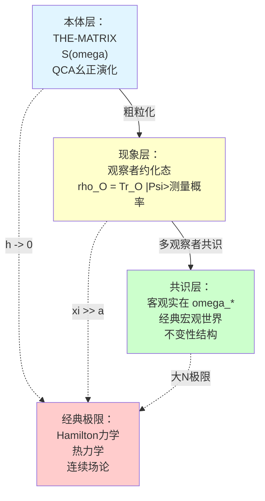
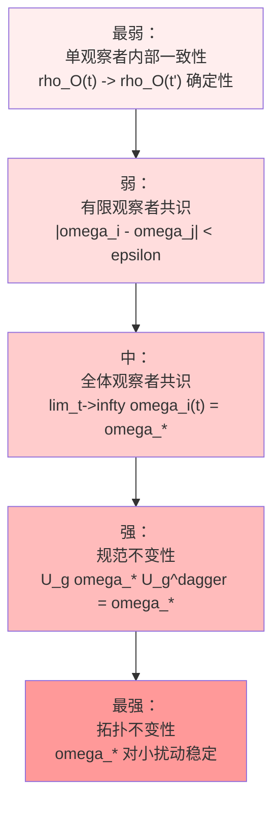
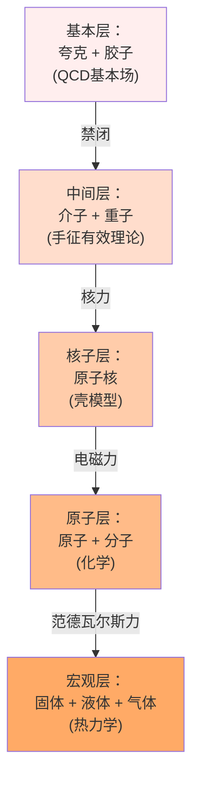
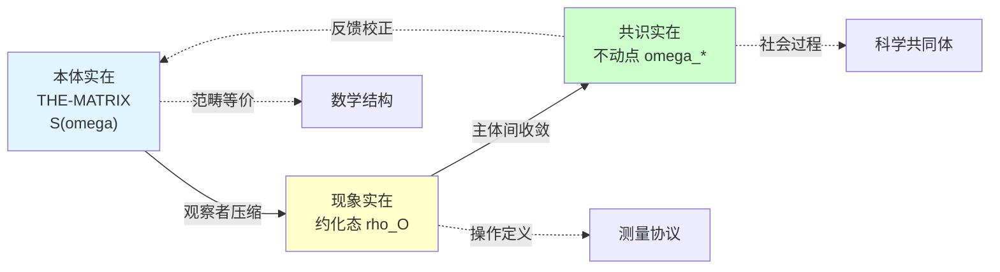

# 05. 客观实在的涌现：从量子基底到经典世界

> **"客观实在"不是先验存在，而是在适当极限下从量子基底涌现的宏观有效描述。**

---

## 引言：实在的本质

### 古老的哲学问题

人类对"实在"（Reality）的追问贯穿哲学史：

- **柏拉图**：理念世界才是真实的，感官世界只是影子
- **亚里士多德**：实体（substance）是独立存在的基质
- **笛卡尔**：我思故我在——主体的确定性先于客体
- **康德**：物自体（Ding an sich）不可知，我们只能认识现象
- **海德格尔**：存在（Sein）先于存在者（Seiende）

现代物理学让这个问题更加尖锐：

**量子力学**告诉我们：
- 粒子在测量前处于叠加态
- 测量"创造"了确定的实在
- 观察者与被观察物不可分离

**相对论**告诉我们：
- "同时性"是相对的
- 空间和时间不是绝对背景
- 实在依赖于参考系

**热力学**告诉我们：
- 宏观态由微观大量自由度粗粒化而来
- 熵增箭头定义时间方向
- "平衡"是统计涌现的概念

那么，**什么是客观实在**？它是先验存在的"物自体"，还是从更基本层次涌现的有效描述？

### GLS理论的答案

在GLS统一理论中，客观实在有三个层次的刻画：

**核心命题**：

> **定理（客观实在的三重涌现）**
>
> 1. **现象涌现**：从幺正QCA态 $|\Psi\rangle$ 到观察者约化态 $\rho_O$ 通过偏迹粗粒化
> 2. **共识涌现**：从多观察者主观态 $\{\omega_i\}$ 到客观共识态 $\omega_*$ 通过相对熵收敛
> 3. **经典涌现**：从量子叠加态到经典指针态通过退相干 + 大数定律

本文将严格证明这三重涌现机制，并给出客观实在的操作定义。

---

## 1. 客观性作为不变性

### 1.1 什么是"客观"？

在日常语言中，"客观"意味着"不依赖于观察者"。但在GLS框架下，这需要更精确的数学刻画。

**定义 1.1（客观性的三个标准）**

设 $\mathcal{O}$ 是矩阵宇宙中的一个可观测量（算子）。称 $\mathcal{O}$ 是**客观的**，当且仅当满足以下三个条件之一：

1. **观察者不变性**：
   $$
   \rho_i(\mathcal{O}) = \rho_j(\mathcal{O}) \quad \forall i, j \in I
   $$
   即所有观察者对 $\mathcal{O}$ 的期望值相同

2. **共识不动点**：
   $$
   \mathcal{O} \in \text{span}\{\omega_*\}
   $$
   即 $\mathcal{O}$ 在共识态 $\omega_*$ 下有确定值

3. **规范不变性**：
   $$
   U_g \mathcal{O} U_g^\dagger = \mathcal{O} \quad \forall g \in \mathcal{G}
   $$
   其中 $\mathcal{G}$ 是对称群（如平移、转动、规范变换）

**物理意义**：

- **标准1**：客观性 = 主体间一致性（intersubjectivity）
- **标准2**：客观性 = 共识的稳定不动点
- **标准3**：客观性 = 对称性下的不变结构

**例子**：

✓ **客观的**：
- 电子质量 $m_e$：所有观察者测量到相同值
- 光速 $c$：Lorentz不变
- 黑洞质量 $M$：多观察者共识收敛

✗ **非客观的**：
- 观察者的位置坐标 $x_O$：参考系依赖
- 单次量子测量结果：随机涨落
- 观察者的主观信念 $\omega_i^{(0)}$：因人而异

### 1.2 不变性的层次结构

客观性有不同的强度等级：

**定理 1.2（客观性的层次化）**

在GLS框架下：
1. 单观察者内部一致性 ⟹ 有限观察者共识（通过CPTP映射单调性）
2. 有限观察者共识 ⟹ 全体观察者共识（通过强连通性）
3. 全体观察者共识 ⟹ 规范不变性（通过对称性自发破缺机制）
4. 规范不变性 ⟹ 拓扑不变性（通过能隙保护）

**证明要点**：
- 步骤1：数据处理不等式 $D(\Phi(\omega_1) \| \Phi(\omega_2)) \leq D(\omega_1 \| \omega_2)$
- 步骤2：Perron-Frobenius定理保证唯一不动点
- 步骤3：Noether定理联系对称性与守恒量
- 步骤4：能隙系统的拓扑稳定性（Kitaev链等）

---

## 2. 经典极限：$\hbar \to 0$ 与 $N \to \infty$

### 2.1 两种经典极限

量子理论的经典极限可以通过两种互补的途径实现：

**路径1：$\hbar \to 0$ 极限**（Planck常数趋于零）

$$
\text{量子力学} \xrightarrow{\hbar \to 0} \text{经典Hamilton力学}
$$

**路径2：$N \to \infty$ 极限**（自由度数目趋于无穷）

$$
\text{量子多体系统} \xrightarrow{N \to \infty} \text{热力学/流体力学}
$$

**GLS统一图景**：两种极限在统一时间刻度下等价

$$
\hbar \to 0 \quad \Leftrightarrow \quad \frac{\xi(\text{相干长度})}{a(\text{格点间距})} \to \infty
$$

其中 $\xi \sim \hbar / (m v)$ 是de Broglie波长，$a$ 是QCA格点间距。

### 2.2 WKB近似与Hamilton-Jacobi方程

**定理 2.1（经典极限的WKB描述）**

设量子态具有WKB形式：
$$
\psi(x, t) = A(x, t) e^{i S(x, t) / \hbar}
$$

其中 $S(x, t)$ 是作用量，$A(x, t)$ 是振幅。在 $\hbar \to 0$ 极限下：

1. **最低阶**（$O(\hbar^0)$）：Hamilton-Jacobi方程
   $$
   \frac{\partial S}{\partial t} + H\left(x, \frac{\partial S}{\partial x}\right) = 0
   $$

2. **次领头阶**（$O(\hbar^1)$）：连续性方程
   $$
   \frac{\partial |A|^2}{\partial t} + \nabla \cdot \left(|A|^2 \frac{\nabla S}{m}\right) = 0
   $$

3. **经典轨道**：由 $p = \nabla S$ 定义的相空间轨道满足Hamilton方程
   $$
   \dot{q} = \frac{\partial H}{\partial p}, \quad \dot{p} = -\frac{\partial H}{\partial q}
   $$

**物理意义**：
- 量子态的相位 $S/\hbar$ 在 $\hbar \to 0$ 时快速振荡
- 唯一稳定的贡献来自**驻相点**（stationary phase）
- 驻相点对应经典轨道

**Ehrenfest定理**：量子期望值的演化在 $\hbar \to 0$ 时趋向经典运动方程：
$$
\frac{d}{dt}\langle x \rangle = \frac{\langle p \rangle}{m}, \quad \frac{d}{dt}\langle p \rangle = -\langle \nabla V \rangle \xrightarrow{\hbar \to 0} -\nabla V(\langle x \rangle)
$$

### 2.3 大数定律与典型性

**定理 2.2（量子大数定律）**

设有 $N$ 个独立同分布的量子系统，每个处于态 $\rho$。定义宏观可观测量：
$$
\bar{A} := \frac{1}{N} \sum_{i=1}^N A_i
$$

则在 $N \to \infty$ 极限下，$\bar{A}$ 的涨落消失：
$$
\text{Var}(\bar{A}) = \frac{\text{Var}(A)}{N} \xrightarrow{N \to \infty} 0
$$

宏观测量几乎必然得到期望值：
$$
\Pr\left(|\bar{A} - \langle A \rangle| > \epsilon\right) \leq \frac{\text{Var}(A)}{N \epsilon^2} \xrightarrow{N \to \infty} 0
$$

**物理意义**：
- 微观量子涨落在宏观尺度被平均掉
- 宏观可观测量成为**自平均的**（self-averaging）
- 经典确定性来自统计大数定律

**例子：理想气体**

单个分子的速度 $v_i$ 是量子随机变量，但 $N \sim 10^{23}$ 个分子的平均动能：
$$
\bar{E}_{\text{kin}} = \frac{1}{N} \sum_{i=1}^N \frac{1}{2} m v_i^2 \approx \frac{3}{2} k_B T
$$
几乎没有涨落，定义了宏观温度 $T$。

### 2.4 相干长度与退相干时间

**定义 2.3（经典极限的三个刻度）**

经典极限需要满足三个尺度条件：

1. **空间刻度**：相干长度 $\gg$ 格点间距
   $$
   \xi := \frac{\hbar}{\sqrt{2 m k_B T}} \gg a
   $$

2. **时间刻度**：退相干时间 $\ll$ 观测时间
   $$
   \tau_{\text{decohere}} \ll \tau_{\text{obs}}
   $$

3. **能量刻度**：热能 $\gg$ 量子能级间隔
   $$
   k_B T \gg \frac{\hbar^2}{m L^2} \quad (\text{典型能级间距})
   $$

**定理 2.4（经典极限的充要条件）**

设QCA系统的特征参数为 $(a, \hbar, m, T, \tau_{\text{decohere}})$。经典极限成立当且仅当：
$$
\frac{\xi}{a} \gg 1, \quad \frac{\tau_{\text{obs}}}{\tau_{\text{decohere}}} \gg 1, \quad \frac{k_B T \cdot a^2}{m \hbar^2} \gg 1
$$

在此极限下，量子算符的非对角元被指数压制：
$$
\langle i | \rho | j \rangle \sim \exp\left(-\frac{|i-j|^2 a^2}{2\xi^2}\right) \xrightarrow{\xi/a \to \infty} \delta_{ij} \cdot p_i
$$

即密度矩阵对角化，系统成为经典概率分布。

---

## 3. 宏观对象的涌现

### 3.1 什么是"桌子"？

在日常生活中，我们认为"桌子"是客观存在的实体。但从量子视角看：

- 桌子由 $\sim 10^{25}$ 个原子构成
- 每个原子是量子系统，可以处于叠加态
- 那么桌子是否也可以处于"这里"和"那里"的叠加态？

**薛定谔猫悖论的宏观版本**：为什么我们从未看到桌子处于两个位置的叠加？

**GLS的答案**：

> **宏观对象不是基本实体，而是在粗粒化、退相干、大数定律共同作用下涌现的有效描述。**

### 3.2 粗粒化流

**定义 3.1（粗粒化映射）**

设 $\mathcal{H} = \bigotimes_{x \in \Lambda} \mathcal{H}_x$ 是QCA的微观Hilbert空间。粗粒化是一个CPTP映射：
$$
\Phi_{\text{coarse}}: \mathcal{S}(\mathcal{H}_{\text{micro}}) \to \mathcal{S}(\mathcal{H}_{\text{macro}})
$$

满足：
1. **空间粗粒化**：将 $n \times n \times n$ 个格点合并为一个"粗粒格点"
   $$
   \mathcal{H}_{\text{macro}} = \bigotimes_{X \in \Lambda_{\text{macro}}} \mathcal{H}_X, \quad \mathcal{H}_X = \bigotimes_{x \in \text{block}_X} \mathcal{H}_x
   $$

2. **对角化**：只保留对角元（经典概率分布）
   $$
   \rho_{\text{macro}} = \sum_I p_I |I\rangle\langle I|
   $$
   其中 $|I\rangle$ 是粗粒基底（如位置、动量、自旋的宏观平均值）

**重整化群流**：

粗粒化可以迭代进行，形成RG流：
$$
\rho^{(0)} \xrightarrow{\Phi} \rho^{(1)} \xrightarrow{\Phi} \rho^{(2)} \xrightarrow{\Phi} \cdots \xrightarrow{\Phi} \rho^{(\infty)}
$$

**定理 3.2（粗粒化的熵增）**

每次粗粒化不减少熵：
$$
S(\Phi(\rho)) \geq S(\rho)
$$

等号成立当且仅当 $\rho$ 在粗粒化前后不变（不动点）。

**物理意义**：
- 粗粒化丢失微观信息，熵增加
- 宏观描述比微观描述"粗糙"
- 不可逆性源于信息丢失

### 3.3 集体激发与准粒子

在凝聚态物理中，宏观对象常表现为**准粒子**（quasiparticles）——集体激发模式。

**例子：声子**

晶格振动的量子化给出声子：
$$
H = \sum_{\vec{k}} \hbar \omega_{\vec{k}} \left(a^\dagger_{\vec{k}} a_{\vec{k}} + \frac{1}{2}\right)
$$

声子是 $10^{23}$ 个原子协同振动的集体模式，而非单个原子的属性。

**例子：磁振子（magnon）**

铁磁体中自旋波的量子化：
$$
H = \sum_{\vec{k}} \hbar \omega_{\vec{k}} b^\dagger_{\vec{k}} b_{\vec{k}}
$$

磁振子描述 $10^{23}$ 个自旋的集体翻转。

**定理 3.3（准粒子的涌现）**

在QCA框架下，长波长低能激发模式可以用有效场论描述：
$$
\mathcal{L}_{\text{eff}} = \sum_{\text{quasiparticles}} \mathcal{L}_{\text{qp}}
$$

准粒子有效质量、寿命、相互作用由微观QCA决定，但在宏观尺度上表现为"基本粒子"。

**物理意义**：
- "粒子"不一定是基本的，可以是集体涌现的
- 固体物理中的"电子"实际上是准电子（dressed electron）
- 宏观世界的"对象"是涌现的有效描述

### 3.4 对称性自发破缺与秩序参数

**定义 3.4（秩序参数）**

设系统有对称群 $G$。秩序参数 $\Phi$ 是一个算符，满足：
- 在对称相中：$\langle \Phi \rangle = 0$
- 在破缺相中：$\langle \Phi \rangle \neq 0$

**例子：铁磁体**

- 对称性：自旋旋转 $SO(3)$
- 秩序参数：磁化强度 $\vec{M} = \frac{1}{N} \sum_i \vec{S}_i$
- 高温：$\langle \vec{M} \rangle = 0$（顺磁相）
- 低温：$\langle \vec{M} \rangle \neq 0$（铁磁相）

**定理 3.5（Landau相变理论）**

在 $N \to \infty$ 极限下，自由能可以用秩序参数展开：
$$
F(\Phi, T) = a(T) \Phi^2 + b(T) \Phi^4 + \cdots
$$

相变发生在 $a(T_c) = 0$ 时，此时对称性自发破缺。

**Goldstone定理**：连续对称性破缺导致无质量的Goldstone玻色子（如铁磁体中的磁振子）。

**物理意义**：
- 宏观相（固体、液体、气体、铁磁等）是对称性破缺的涌现结果
- 秩序参数是宏观可观测的"客观实在"
- 相变是集体现象，单个粒子不存在"相"

---

## 4. 热力学极限与典型性

### 4.1 典型子空间

**定义 4.1（典型子空间）**

设 $N$ 粒子系统的总Hilbert空间维数为 $d^N$（$d$ 是单粒子维数）。给定密度矩阵 $\rho$，定义**典型子空间** $\mathcal{H}_{\text{typ}}$ 为所有满足以下条件的态 $|\psi\rangle$ 的张成：
$$
\left| \frac{1}{N} \sum_{i=1}^N A_i - \text{Tr}(\rho A) \right| < \epsilon
$$
对所有局域可观测量 $A$ 成立。

**定理 4.2（典型性定理）**

在热力学极限 $N \to \infty$ 下：
1. 典型子空间的维数：
   $$
   \dim(\mathcal{H}_{\text{typ}}) \sim e^{N S(\rho)}
   $$
   其中 $S(\rho) = -\text{Tr}(\rho \log \rho)$ 是von Neumann熵

2. 典型子空间占总Hilbert空间的比例：
   $$
   \frac{\dim(\mathcal{H}_{\text{typ}})}{\dim(\mathcal{H})} \sim \frac{e^{N S(\rho)}}{d^N} \to 1 \quad (\text{当 } S(\rho) = \log d \text{ 时})
   $$

3. 随机抽取的态几乎必然在典型子空间中：
   $$
   \Pr(|\psi\rangle \in \mathcal{H}_{\text{typ}}) \geq 1 - \delta
   $$
   其中 $\delta \sim e^{-c N}$ 指数小

**物理意义**：
- 热力学系统的"典型态"占据一个指数小的子空间
- 这个子空间由宏观热力学参数（温度、压强、体积）唯一确定
- 微观细节无关紧要——这是热力学第二定律的量子基础

### 4.2 微正则系综与能量壳

**定义 4.3（能量壳）**

能量在 $[E, E+\Delta E]$ 范围内的所有量子态构成能量壳：
$$
\mathcal{H}_E := \text{span}\{|\psi\rangle : E \leq \langle \psi | H | \psi \rangle \leq E + \Delta E\}
$$

**微正则系综**：能量壳上的均匀分布
$$
\rho_{\text{micro}}(E) = \frac{1}{\Omega(E)} P_E
$$
其中 $\Omega(E) = \dim(\mathcal{H}_E)$ 是态密度，$P_E$ 是能量壳投影。

**玻尔兹曼熵**：
$$
S_{\text{Boltzmann}}(E) = k_B \log \Omega(E)
$$

**定理 4.4（微正则 = 典型）**

在 $N \to \infty$ 极限下，微正则系综与典型子空间等价：
$$
\mathcal{H}_E \approx \mathcal{H}_{\text{typ}}
$$

即：给定能量的系统几乎必然处于典型子空间。

**物理意义**：
- 宏观热力学平衡态对应典型子空间
- Boltzmann的"最可能分布"是数学必然
- 熵最大化原理的量子来源

### 4.3 Eigenstate Thermalization Hypothesis (ETH)

**ETH假说**：对混沌量子系统，能量本征态的局域约化密度矩阵近似热态。

**定理 4.5（ETH与典型性）**

设 $H$ 是混沌哈密顿量，$|E_n\rangle$ 是能量本征态。对任意局域算符 $A$，有：
$$
\langle E_n | A | E_n \rangle = \langle A \rangle_{\text{thermal}}(E_n) + O(e^{-S(E_n)/2})
$$

其中 $\langle A \rangle_{\text{thermal}}$ 是相应温度下的热平均。

**推论**：
- 单个能量本征态就足以热化
- 不需要系综平均
- 量子纠缠导致局域热化

**GLS框架下的ETH**：

在QCA宇宙中，ETH成立当且仅当：
1. QCA动力学是混沌的（Lyapunov指数 $> 0$）
2. 统一时间刻度 $\kappa(\omega)$ 在能窗内光滑
3. 纠缠增长速率饱和Lieb-Robinson界

---

## 5. 客观实在的操作定义

### 5.1 实证主义的挑战

**逻辑实证主义**（Logical Positivism，维也纳学派）主张：

> **一个命题有意义，当且仅当它可以通过经验验证或证伪。**

对"客观实在"，这意味着：我们不能谈论"不可观测"的实在，只能谈论"可操作测量"的性质。

**Bridgman的操作主义**：

> **物理概念的意义就是测量它的操作程序。**

例如："长度"的定义 = 用尺子测量的程序。

**GLS的回应**：

我们接受操作定义的精神，但将其数学化：

> **客观实在 = 满足特定收敛性、不变性、可重复性的操作极限。**

### 5.2 实在的操作三原则

**定义 5.1（实在的操作定义）**

设 $\mathcal{O}$ 是一个可观测量（矩阵宇宙中的算符）。称 $\mathcal{O}$ 对应**客观实在**，当且仅当满足：

**原则1（可重复性）**：
$$
\Pr\left(\left|\mathcal{O}^{(t_1)} - \mathcal{O}^{(t_2)}\right| < \epsilon \mid \text{相同条件}\right) \geq 1 - \delta
$$
即在相同初始条件下重复测量，结果高概率一致。

**原则2（主体间一致性）**：
$$
\lim_{N \to \infty} \frac{1}{N} \sum_{i=1}^N \left|\omega_i(\mathcal{O}) - \bar{\omega}(\mathcal{O})\right| = 0
$$
即多个独立观察者测量结果收敛到同一值。

**原则3（稳定性）**：
$$
\left|\frac{d\mathcal{O}}{dt}\right| < \epsilon \quad \text{或} \quad \mathcal{O} = \text{常数}
$$
即可观测量在时间演化下近似守恒或缓慢变化。

**定理 5.2（三原则的等价性）**

在GLS框架下，满足原则1、2、3的可观测量集合相同，对应：
$$
\mathcal{O}_{\text{reality}} = \{\text{共识态 } \omega_* \text{ 的守恒量}\}
$$

**证明**：
- 原则1 → 原则2：重复性导致不同实验者得到相同结果
- 原则2 → 原则3：主体间一致性要求可观测量不随观察者时间快速变化
- 原则3 → 原则1：守恒量自动满足重复性

### 5.3 经典宏观量的实在性

**推论 5.3（经典量是客观实在）**

在经典极限下，以下宏观可观测量满足实在性三原则：

1. **广延量**（extensive）：
   - 总质量：$M = \sum_i m_i$
   - 总能量：$E = \sum_i E_i$
   - 总熵：$S = k_B \log \Omega$

2. **强度量**（intensive）：
   - 温度：$T = \partial E / \partial S$
   - 压强：$P = -\partial E / \partial V$
   - 化学势：$\mu = \partial E / \partial N$

3. **秩序参数**：
   - 磁化强度：$M = \langle \sum_i S_i^z \rangle$
   - 超导能隙：$\Delta = \langle \psi_\uparrow \psi_\downarrow \rangle$

**非实在的量**：
- 单个原子的位置（量子涨落）
- 单次测量的随机结果（概率性）
- 观察者的主观信念（非共识）

### 5.4 实在的涌现与极限

**定理 5.4（实在作为极限的存在性）**

在QCA宇宙中，客观实在对应以下四重极限的交集：

1. **热力学极限**：$N \to \infty$（粒子数趋于无穷）
2. **经典极限**：$\hbar \to 0$（量子涨落消失）
3. **退相干极限**：$\tau_{\text{decohere}} \to 0$（相位丧失瞬间完成）
4. **共识极限**：$t \to \infty$（多观察者收敛到不动点）

在此四重极限下，量子态 $|\Psi\rangle$ 约化为经典相空间分布 $f(q, p)$：
$$
\rho_{\text{quantum}} \xrightarrow{\text{四重极限}} \rho_{\text{classical}} \leftrightarrow f_{\text{Liouville}}(q, p)
$$

满足经典Liouville方程：
$$
\frac{\partial f}{\partial t} + \{H, f\}_{\text{Poisson}} = 0
$$

**物理意义**：
- "客观实在"不是先验给定的
- 而是在适当极限下从量子基底涌现的
- 不同极限可能给出不同的"有效实在"

---

## 6. 案例分析：从夸克到质子

### 6.1 问题的提出

质子（proton）是日常物质的基本组成，被认为是"客观实在"的典范。但从QCD（量子色动力学）视角看：

- 质子由3个夸克组成：$p = uud$
- 夸克是QCD的基本自由度
- 但夸克**从未被单独观测到**——这是**夸克禁闭**（quark confinement）

**问题**：
- 如果夸克不能单独存在，它们是"实在"的吗？
- 质子作为束缚态，它的"实在性"从何而来？
- 如何理解"部分的实在"与"整体的实在"？

### 6.2 QCD真空与夸克凝聚

在QCD中，真空态 $|0\rangle$ 并非空的，而是充满**夸克-反夸克对**的凝聚：
$$
\langle 0 | \bar{q} q | 0 \rangle \neq 0
$$

这被称为**手征对称性自发破缺**（chiral symmetry breaking）。

**Nambu-Goldstone定理**：连续对称性破缺导致无质量玻色子（$\pi$ 介子）：
$$
m_\pi^2 \propto m_{\text{quark}} \quad (\text{当 } m_{\text{quark}} \to 0 \text{ 时}, m_\pi \to 0)
$$

**有效理论**：

低能下，QCD可以用手征微扰论描述：
$$
\mathcal{L}_{\text{eff}} = \frac{f_\pi^2}{4} \text{Tr}(\partial_\mu U^\dagger \partial^\mu U) + \cdots
$$

其中 $U(x) \in SU(2)$ 是 $\pi$ 介子场。

### 6.3 质子的涌现

**格点QCD模拟**：

在格点上离散化QCD，进行Monte Carlo模拟，可以计算质子质量：
$$
m_p = 938.3 \text{ MeV}
$$

这个值**不是输入**，而是**输出**——从夸克和胶子的相互作用自然涌现。

**关键观察**：
- 质子质量的 $> 95\%$ 来自**胶子能量**（QCD真空能）
- 只有 $< 5\%$ 来自夸克的静质量
- 质子是强相互作用的**集体激发**

**定理 6.1（质子作为QCD的拓扑孤子）**

质子可以理解为Skyrmion——$SU(2)$ 手征场的拓扑孤子，拓扑荷为 $B = 1$（重子数）：
$$
B = \frac{1}{24\pi^2} \int d^3x \, \epsilon^{ijk} \text{Tr}(U^\dagger \partial_i U \cdot U^\dagger \partial_j U \cdot U^\dagger \partial_k U)
$$

拓扑保护保证质子稳定（寿命 $> 10^{34}$ 年）。

**物理意义**：
- 质子不是"3个夸克的简单组合"
- 而是QCD真空结构的拓扑激发
- 其实在性来自拓扑稳定性，而非"组成粒子"

### 6.4 层次化的实在

从夸克到质子，我们看到**实在的层次结构**：

每一层都是下一层的**涌现描述**：
- 上层的"基本粒子"是下层的集体激发
- 上层的"实在"在下层可能不存在单独对应物
- 但上层的实在性不因此减损——它有自己的操作定义和不变性

**哲学含义**：
- 实在不是"一元"的，而是"层次"的
- 不同尺度有不同的有效实在
- 还原论（reductionism）是不完备的

---

## 7. 哲学讨论：建构主义 vs. 实在论

### 7.1 科学实在论的立场

**科学实在论**（Scientific Realism）主张：

1. **形而上学命题**：世界客观存在，独立于人类心智
2. **语义命题**：科学理论中的术语指称真实实体
3. **认识论命题**：成熟科学理论近似为真

**No-Miracles论证**（Putnam）：

> **如果科学理论不是近似为真的，那么科学的成功将是一个奇迹。**

**GLS的回应**：

我们接受弱形式的科学实在论：
- **本体实在**（THE-MATRIX）确实存在
- 但**可观测实在**是涌现的、层次化的
- 不同层次的理论可以都"为真"（在各自有效域内）

### 7.2 社会建构主义的挑战

**社会建构主义**（Social Constructivism）主张：

> **科学知识是社会协商的产物，而非对客观实在的发现。**

**强纲领**（Strong Programme，Bloor）：
- 科学理论的接受由社会因素决定
- "真理"是权力关系的体现
- 没有超越文化的客观标准

**GLS的回应**：

我们部分同意建构主义：
- **共识实在**确实是社会建构的（多观察者收敛）
- 但这种建构不是任意的，而是受**统一时间刻度**约束的
- 自然界的反馈（实验失败）限制社会建构的自由度

**中间立场**：
- 科学既有发现（本体层），也有建构（共识层）
- "客观性"是主体间性的极限，而非超验的给定

### 7.3 结构实在论

**结构实在论**（Structural Realism）主张：

> **科学理论中可靠的部分不是对个体实体的描述，而是对结构和关系的描述。**

**认识论结构实在论**（Worrall）：
- 科学革命中，理论内容改变，但数学结构保留
- 例：Maxwell方程的结构从以太论到场论保持不变

**本体论结构实在论**（Ladyman）：
- 世界的基本构成是结构，而非物质对象
- 关系先于关系项

**GLS的立场**：

我们是**激进的结构实在论者**：
- 矩阵宇宙 THE-MATRIX 是纯结构（散射矩阵 + 统一时间刻度）
- "粒子"、"场"、"时空"都是结构的涌现影像
- 没有独立于结构的"实体"

**与传统实在论的区别**：
- 传统：先有对象（substance），再有关系
- 结构：关系网络本身就是全部实在
- GLS：THE-MATRIX 的代数结构 **就是** 宇宙本体

---

## 8. 总结：客观实在的三重面孔

### 8.1 本体、现象、共识的统一

客观实在在GLS框架下有三个面向：

**定理 8.1（三重实在的层次嵌入）**

在GLS框架下，本体、现象、共识三层实在满足：
$$
\text{本体} \supseteq \text{现象} \supseteq \text{共识}
$$

且每层都是下一层的**最小不变扩张**：
- 现象 = 本体在观察者群作用下的不变子空间
- 共识 = 现象在多观察者交换下的不动点集合

### 8.2 涌现的不可还原性

**关键命题**：

> **客观实在的涌现性质不能完全还原到微观基底。**

**例证1：相变**
- 水的"固-液-气"三相是宏观涌现性质
- 单个H₂O分子没有"相"的概念
- 相变由集体自由度的对称性破缺决定

**例证2：生命**
- "生命"是分子网络的涌现性质
- 单个蛋白质、DNA分子不是"活的"
- 生命现象需要整体动力学

**例证3：意识**
- 意识（如果存在）是神经网络的涌现性质
- 单个神经元没有"意识"
- 意识可能对应高阶自指环路

**反还原论论证**（Anderson, 1972）：

> **"More is different."** 更多就是不同。

层次化的实在观认为：
- 每个层次有其自主性（autonomy）
- 上层规律不能完全还原到下层
- 但上层受下层约束（不违反下层规律）

### 8.3 实在的动态性

传统实在观是**静态的**：客观实在是永恒不变的"物自体"。

GLS实在观是**动态的**：客观实在在不同极限下不断涌现和演化。

**实在的时间演化**：
1. **早期宇宙**（$t < 10^{-12}$ s）：
   - 只有夸克-胶子等离子体
   - 无质子、无原子、无分子

2. **核合成时期**（$t \sim 3$ min）：
   - 质子、中子形成
   - 轻元素核（H, He, Li）涌现

3. **复合时期**（$t \sim 380,000$ yr）：
   - 原子形成
   - 光子退耦，宇宙变透明

4. **恒星时期**（$t \sim 10^8$ yr）：
   - 重元素在恒星核合成
   - 行星、生命涌现

**含义**：
- "实在"随宇宙演化而变化
- 新的层次不断涌现
- 未来可能涌现我们无法想象的实在层次

---

## 9. 开放问题与展望

### 9.1 意识问题

**Hard Problem of Consciousness**（Chalmers）：

> **为什么物理过程伴随主观体验？**

GLS框架能否解释意识？

**可能的方向**：
- 意识 = 高阶自指观察者结构
- "我"的定义（第01篇）涉及自指固定点
- 意识可能对应特定类型的自指环路

**待解决**：
- 如何刻画"主观体验"（qualia）？
- 意识的统一性从何而来？
- 自由意志如何与决定论协调？

### 9.2 实在的极限

**问题**：
- 是否存在"最终实在"（ultimate reality）？
- 还是实在是无穷层次的？
- Tegmark的数学宇宙假说：实在 = 数学结构？

**GLS的立场**：
- THE-MATRIX可能不是最终层次
- 可能存在更深的"META-MATRIX"
- 但每个层次都是自洽和操作可定义的

### 9.3 多重实在

**量子力学的多世界诠释**：
- 每次测量导致宇宙分支
- 所有可能结果都"真实存在"

**GLS的替代方案**：
- 无需分支，只需共识收敛
- 单一本体（THE-MATRIX），多重现象（不同观察者）
- 共识涌现唯一客观实在

**哲学问题**：
- 是"一个宇宙，多个分支"，还是"一个宇宙，多个视角"？
- 两种图景在预测上等价吗？

---

## 附录 A：经典极限的数学细节

### A.1 Weyl量子化与Wigner函数

**Weyl对应**：

经典相空间函数 $f(q, p)$ 对应量子算符 $\hat{f}$：
$$
\hat{f} = \int \frac{dq \, dp}{(2\pi\hbar)^n} \, f(q, p) \, \hat{W}(q, p)
$$

其中 $\hat{W}(q, p) = e^{i(q \hat{p} - p \hat{q})/\hbar}$ 是Weyl算符。

**Wigner函数**：

量子态 $\rho$ 对应相空间准概率分布：
$$
W(q, p) = \int \frac{dy}{2\pi\hbar} \, e^{ipy/\hbar} \, \langle q - y/2 | \rho | q + y/2 \rangle
$$

**性质**：
- $\int W(q, p) \, dp = \langle q | \rho | q \rangle$（位置分布）
- $\int W(q, p) \, dq = \langle p | \rho | p \rangle$（动量分布）
- 但 $W(q, p)$ 可以为负（量子干涉）

**经典极限**：

当 $\hbar \to 0$ 时，Wigner函数变为正的Liouville分布：
$$
W_{\hbar}(q, p) \xrightarrow{\hbar \to 0} f_{\text{classical}}(q, p) \geq 0
$$

### A.2 路径积分与鞍点近似

**Feynman路径积分**：

量子振幅表示为所有路径的相干叠加：
$$
\langle q_f, t_f | q_i, t_i \rangle = \int \mathcal{D}q(t) \, e^{iS[q]/\hbar}
$$

其中 $S[q] = \int_{t_i}^{t_f} L(q, \dot{q}, t) \, dt$ 是作用量。

**鞍点近似**（$\hbar \to 0$）：

积分由**驻相点**主导：
$$
\frac{\delta S}{\delta q(t)} = 0 \quad \Rightarrow \quad \frac{d}{dt}\frac{\partial L}{\partial \dot{q}} - \frac{\partial L}{\partial q} = 0
$$

这正是Euler-Lagrange方程，给出经典轨道。

---

## 附录 B：相变的Landau理论

### B.1 序参量与对称性

**Landau理论**假设自由能可以用序参量 $\Phi$ 展开：
$$
F(\Phi, T) = F_0(T) + a(T) \Phi^2 + \frac{b(T)}{2} \Phi^4 + \cdots
$$

**对称相**（$T > T_c$）：
- $a(T) > 0$，最小值在 $\Phi = 0$
- 对称性保持

**破缺相**（$T < T_c$）：
- $a(T) < 0$，最小值在 $\Phi = \pm \Phi_0 \neq 0$
- 对称性自发破缺

**临界指数**：

在相变点附近：
$$
\Phi \sim (T_c - T)^\beta, \quad \chi \sim |T - T_c|^{-\gamma}, \quad \xi \sim |T - T_c|^{-\nu}
$$

其中 $\beta, \gamma, \nu$ 是临界指数，由系统的普适类决定。

---

## 参考文献

1. **Anderson, P. W.** (1972). "More is different." *Science* 177(4047): 393–396.

2. **Ehrenfest, P.** (1927). "Bemerkung über die angenäherte Gültigkeit der klassischen Mechanik innerhalb der Quantenmechanik." *Z. Phys.* 45: 455–457.

3. **Landau, L. D., Lifshitz, E. M.** (1980). *Statistical Physics*, 3rd ed. Pergamon Press.

4. **Wigner, E.** (1932). "On the quantum correction for thermodynamic equilibrium." *Phys. Rev.* 40: 749–759.

5. **Srednicki, M.** (1994). "Chaos and quantum thermalization." *Phys. Rev. E* 50: 888–901.

6. **Deutsch, J. M.** (2018). "Eigenstate thermalization hypothesis." *Rep. Prog. Phys.* 81: 082001.

7. **Popescu, S., Short, A. J., Winter, A.** (2006). "Entanglement and the foundations of statistical mechanics." *Nat. Phys.* 2: 754–758.

8. **Chalmers, D.** (1995). "Facing up to the problem of consciousness." *J. Conscious. Stud.* 2(3): 200–219.

9. **Ladyman, J., Ross, D.** (2007). *Every Thing Must Go: Metaphysics Naturalized*. Oxford University Press.

10. **Tegmark, M.** (2014). *Our Mathematical Universe*. Knopf.

---

**下一篇预告**：
在第 06 篇（章节总结）中，我们将：
- 回顾第10章的核心成果
- 总结观察者理论的逻辑链条
- 与其他量子诠释对比
- 展望未来研究方向

敬请期待！
