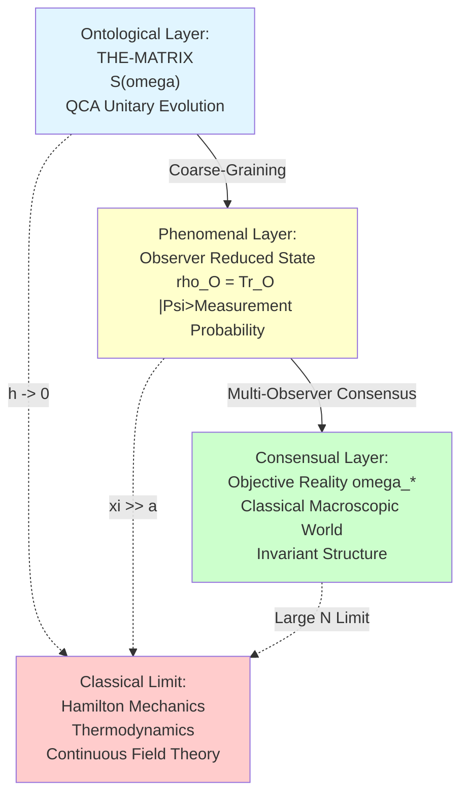
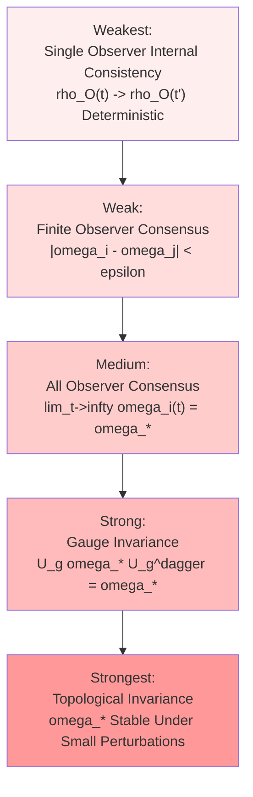
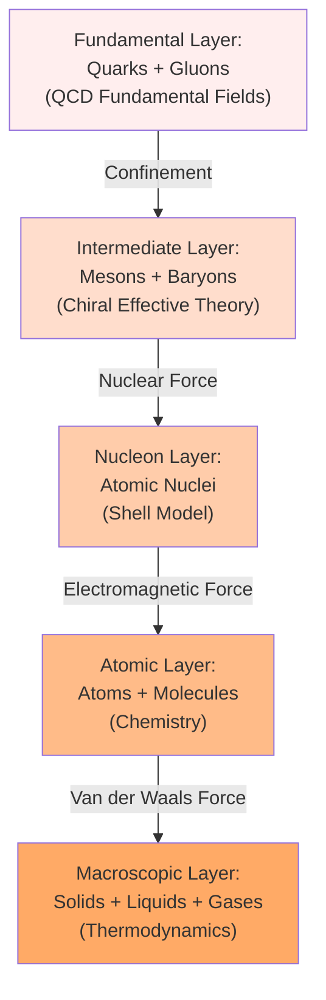
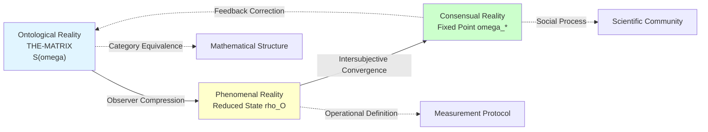

# 05. Emergence of Objective Reality: From Quantum Substrate to Classical World

> **"Objective reality" is not a priori existence, but a macroscopic effective description emerging from the quantum substrate under appropriate limits.**

---

## Introduction: The Nature of Reality

### Ancient Philosophical Questions

Human inquiry into "Reality" runs throughout the history of philosophy:

- **Plato**: The world of ideas is real, the sensory world is but shadows
- **Aristotle**: Substance is an independently existing substrate
- **Descartes**: I think, therefore I am—the certainty of the subject precedes the object
- **Kant**: Thing-in-itself (Ding an sich) is unknowable, we can only know phenomena
- **Heidegger**: Being (Sein) precedes beings (Seiende)

Modern physics makes this question even sharper:

**Quantum mechanics** tells us:
- Particles are in superposition states before measurement
- Measurement "creates" definite reality
- Observer and observed cannot be separated

**Relativity** tells us:
- "Simultaneity" is relative
- Space and time are not absolute backgrounds
- Reality depends on reference frame

**Thermodynamics** tells us:
- Macroscopic states emerge from coarse-graining of many microscopic degrees of freedom
- Entropy increase defines the arrow of time
- "Equilibrium" is a statistically emergent concept

So, **what is objective reality**? Is it an a priori existing "thing-in-itself," or an effective description emerging from more fundamental levels?

### GLS Theory's Answer

In the GLS unified theory, objective reality has three levels of characterization:

**Core Proposition**:

> **Theorem (Triple Emergence of Objective Reality)**
>
> 1. **Phenomenal Emergence**: From unitary QCA state $|\Psi\rangle$ to observer reduced state $\rho_O$ through partial trace coarse-graining
> 2. **Consensual Emergence**: From multi-observer subjective states $\{\omega_i\}$ to objective consensus state $\omega_*$ through relative entropy convergence
> 3. **Classical Emergence**: From quantum superposition states to classical pointer states through decoherence + law of large numbers

This article will rigorously prove these three emergence mechanisms and provide an operational definition of objective reality.

---

## 1. Objectivity as Invariance

### 1.1 What is "Objective"?

In everyday language, "objective" means "independent of observer." But in the GLS framework, this requires more precise mathematical characterization.

**Definition 1.1 (Three Criteria for Objectivity)**

Let $\mathcal{O}$ be an observable (operator) in the matrix universe. We say $\mathcal{O}$ is **objective** if and only if it satisfies one of the following three conditions:

1. **Observer Invariance**:
   $$
   \rho_i(\mathcal{O}) = \rho_j(\mathcal{O}) \quad \forall i, j \in I
   $$
   That is, all observers have the same expectation value for $\mathcal{O}$

2. **Consensus Fixed Point**:
   $$
   \mathcal{O} \in \text{span}\{\omega_*\}
   $$
   That is, $\mathcal{O}$ has a definite value in consensus state $\omega_*$

3. **Gauge Invariance**:
   $$
   U_g \mathcal{O} U_g^\dagger = \mathcal{O} \quad \forall g \in \mathcal{G}
   $$
   where $\mathcal{G}$ is a symmetry group (e.g., translation, rotation, gauge transformation)

**Physical Meaning**:

- **Criterion 1**: Objectivity = intersubjectivity
- **Criterion 2**: Objectivity = stable fixed point of consensus
- **Criterion 3**: Objectivity = invariant structure under symmetry

**Examples**:

✓ **Objective**:
- Electron mass $m_e$: All observers measure the same value
- Speed of light $c$: Lorentz invariant
- Black hole mass $M$: Multi-observer consensus converges

✗ **Non-Objective**:
- Observer's position coordinate $x_O$: Reference frame dependent
- Single quantum measurement result: Random fluctuation
- Observer's subjective belief $\omega_i^{(0)}$: Varies by person

### 1.2 Hierarchical Structure of Invariance

Objectivity has different strength levels:

**Theorem 1.2 (Hierarchy of Objectivity)**

In the GLS framework:
1. Single observer internal consistency ⟹ Finite observer consensus (through CPTP map monotonicity)
2. Finite observer consensus ⟹ All observer consensus (through strong connectivity)
3. All observer consensus ⟹ Gauge invariance (through spontaneous symmetry breaking mechanism)
4. Gauge invariance ⟹ Topological invariance (through gap protection)

**Proof Outline**:
- Step 1: Data processing inequality $D(\Phi(\omega_1) \| \Phi(\omega_2)) \leq D(\omega_1 \| \omega_2)$
- Step 2: Perron-Frobenius theorem guarantees unique fixed point
- Step 3: Noether's theorem links symmetry to conserved quantities
- Step 4: Topological stability of gapped systems (Kitaev chain, etc.)

---

## 2. Classical Limit: $\hbar \to 0$ and $N \to \infty$

### 2.1 Two Types of Classical Limits

The classical limit of quantum theory can be achieved through two complementary paths:

**Path 1: $\hbar \to 0$ Limit** (Planck constant tends to zero)

$$
\text{Quantum Mechanics} \xrightarrow{\hbar \to 0} \text{Classical Hamilton Mechanics}
$$

**Path 2: $N \to \infty$ Limit** (Number of degrees of freedom tends to infinity)

$$
\text{Quantum Many-Body System} \xrightarrow{N \to \infty} \text{Thermodynamics/Fluid Mechanics}
$$

**GLS Unified Picture**: The two limits are equivalent under unified time scale

$$
\hbar \to 0 \quad \Leftrightarrow \quad \frac{\xi(\text{coherence length})}{a(\text{lattice spacing})} \to \infty
$$

where $\xi \sim \hbar / (m v)$ is the de Broglie wavelength, $a$ is the QCA lattice spacing.

### 2.2 WKB Approximation and Hamilton-Jacobi Equation

**Theorem 2.1 (WKB Description of Classical Limit)**

Let the quantum state have WKB form:
$$
\psi(x, t) = A(x, t) e^{i S(x, t) / \hbar}
$$

where $S(x, t)$ is the action, $A(x, t)$ is the amplitude. In the $\hbar \to 0$ limit:

1. **Leading Order** ($O(\hbar^0)$): Hamilton-Jacobi equation
   $$
   \frac{\partial S}{\partial t} + H\left(x, \frac{\partial S}{\partial x}\right) = 0
   $$

2. **Next-to-Leading Order** ($O(\hbar^1)$): Continuity equation
   $$
   \frac{\partial |A|^2}{\partial t} + \nabla \cdot \left(|A|^2 \frac{\nabla S}{m}\right) = 0
   $$

3. **Classical Trajectories**: Phase space trajectories defined by $p = \nabla S$ satisfy Hamilton equations
   $$
   \dot{q} = \frac{\partial H}{\partial p}, \quad \dot{p} = -\frac{\partial H}{\partial q}
   $$

**Physical Meaning**:
- Phase $S/\hbar$ of quantum state oscillates rapidly as $\hbar \to 0$
- Only stable contribution comes from **stationary phase points**
- Stationary phase points correspond to classical trajectories

**Ehrenfest's Theorem**: Evolution of quantum expectation values tends to classical equations of motion as $\hbar \to 0$:
$$
\frac{d}{dt}\langle x \rangle = \frac{\langle p \rangle}{m}, \quad \frac{d}{dt}\langle p \rangle = -\langle \nabla V \rangle \xrightarrow{\hbar \to 0} -\nabla V(\langle x \rangle)
$$

### 2.3 Law of Large Numbers and Typicality

**Theorem 2.2 (Quantum Law of Large Numbers)**

Let there be $N$ independent identically distributed quantum systems, each in state $\rho$. Define macroscopic observable:
$$
\bar{A} := \frac{1}{N} \sum_{i=1}^N A_i
$$

Then in the $N \to \infty$ limit, fluctuations of $\bar{A}$ vanish:
$$
\text{Var}(\bar{A}) = \frac{\text{Var}(A)}{N} \xrightarrow{N \to \infty} 0
$$

Macroscopic measurement almost certainly yields the expectation value:
$$
\Pr\left(|\bar{A} - \langle A \rangle| > \epsilon\right) \leq \frac{\text{Var}(A)}{N \epsilon^2} \xrightarrow{N \to \infty} 0
$$

**Physical Meaning**:
- Microscopic quantum fluctuations are averaged out at macroscopic scale
- Macroscopic observables become **self-averaging**
- Classical determinism comes from statistical law of large numbers

**Example: Ideal Gas**

Individual molecule velocity $v_i$ is a quantum random variable, but average kinetic energy of $N \sim 10^{23}$ molecules:
$$
\bar{E}_{\text{kin}} = \frac{1}{N} \sum_{i=1}^N \frac{1}{2} m v_i^2 \approx \frac{3}{2} k_B T
$$
has almost no fluctuation, defining macroscopic temperature $T$.

### 2.4 Coherence Length and Decoherence Time

**Definition 2.3 (Three Scales of Classical Limit)**

The classical limit requires three scale conditions:

1. **Spatial Scale**: Coherence length $\gg$ lattice spacing
   $$
   \xi := \frac{\hbar}{\sqrt{2 m k_B T}} \gg a
   $$

2. **Temporal Scale**: Decoherence time $\ll$ observation time
   $$
   \tau_{\text{decohere}} \ll \tau_{\text{obs}}
   $$

3. **Energy Scale**: Thermal energy $\gg$ quantum level spacing
   $$
   k_B T \gg \frac{\hbar^2}{m L^2} \quad (\text{typical level spacing})
   $$

**Theorem 2.4 (Necessary and Sufficient Conditions for Classical Limit)**

Let QCA system characteristic parameters be $(a, \hbar, m, T, \tau_{\text{decohere}})$. The classical limit holds if and only if:
$$
\frac{\xi}{a} \gg 1, \quad \frac{\tau_{\text{obs}}}{\tau_{\text{decohere}}} \gg 1, \quad \frac{k_B T \cdot a^2}{m \hbar^2} \gg 1
$$

In this limit, off-diagonal elements of quantum operators are exponentially suppressed:
$$
\langle i | \rho | j \rangle \sim \exp\left(-\frac{|i-j|^2 a^2}{2\xi^2}\right) \xrightarrow{\xi/a \to \infty} \delta_{ij} \cdot p_i
$$

That is, the density matrix diagonalizes, and the system becomes a classical probability distribution.

---

## 3. Emergence of Macroscopic Objects

### 3.1 What is a "Table"?

In everyday life, we consider a "table" to be an objectively existing entity. But from a quantum perspective:

- A table consists of $\sim 10^{25}$ atoms
- Each atom is a quantum system that can be in superposition
- So can a table also be in a superposition of "here" and "there"?

**Macroscopic Version of Schrödinger's Cat Paradox**: Why do we never see a table in a superposition of two positions?

**GLS's Answer**:

> **Macroscopic objects are not fundamental entities, but effective descriptions emerging from the combined action of coarse-graining, decoherence, and the law of large numbers.**

### 3.2 Coarse-Graining Flow

**Definition 3.1 (Coarse-Graining Map)**

Let $\mathcal{H} = \bigotimes_{x \in \Lambda} \mathcal{H}_x$ be the microscopic Hilbert space of QCA. Coarse-graining is a CPTP map:
$$
\Phi_{\text{coarse}}: \mathcal{S}(\mathcal{H}_{\text{micro}}) \to \mathcal{S}(\mathcal{H}_{\text{macro}})
$$

satisfying:
1. **Spatial Coarse-Graining**: Merge $n \times n \times n$ lattice sites into one "coarse-grained site"
   $$
   \mathcal{H}_{\text{macro}} = \bigotimes_{X \in \Lambda_{\text{macro}}} \mathcal{H}_X, \quad \mathcal{H}_X = \bigotimes_{x \in \text{block}_X} \mathcal{H}_x
   $$

2. **Diagonalization**: Only retain diagonal elements (classical probability distribution)
   $$
   \rho_{\text{macro}} = \sum_I p_I |I\rangle\langle I|
   $$
   where $|I\rangle$ are coarse-grained basis states (e.g., macroscopic averages of position, momentum, spin)

**Renormalization Group Flow**:

Coarse-graining can be iterated, forming RG flow:
$$
\rho^{(0)} \xrightarrow{\Phi} \rho^{(1)} \xrightarrow{\Phi} \rho^{(2)} \xrightarrow{\Phi} \cdots \xrightarrow{\Phi} \rho^{(\infty)}
$$

**Theorem 3.2 (Entropy Increase Under Coarse-Graining)**

Each coarse-graining does not decrease entropy:
$$
S(\Phi(\rho)) \geq S(\rho)
$$

Equality holds if and only if $\rho$ is unchanged before and after coarse-graining (fixed point).

**Physical Meaning**:
- Coarse-graining loses microscopic information, entropy increases
- Macroscopic description is "coarser" than microscopic description
- Irreversibility comes from information loss

### 3.3 Collective Excitations and Quasiparticles

In condensed matter physics, macroscopic objects often manifest as **quasiparticles**—collective excitation modes.

**Example: Phonons**

Quantization of lattice vibrations gives phonons:
$$
H = \sum_{\vec{k}} \hbar \omega_{\vec{k}} \left(a^\dagger_{\vec{k}} a_{\vec{k}} + \frac{1}{2}\right)
$$

Phonons are collective modes of $10^{23}$ atoms vibrating cooperatively, not properties of individual atoms.

**Example: Magnons**

Quantization of spin waves in ferromagnets:
$$
H = \sum_{\vec{k}} \hbar \omega_{\vec{k}} b^\dagger_{\vec{k}} b_{\vec{k}}
$$

Magnons describe collective flipping of $10^{23}$ spins.

**Theorem 3.3 (Emergence of Quasiparticles)**

In the QCA framework, long-wavelength low-energy excitation modes can be described by effective field theory:
$$
\mathcal{L}_{\text{eff}} = \sum_{\text{quasiparticles}} \mathcal{L}_{\text{qp}}
$$

Quasiparticle effective mass, lifetime, and interactions are determined by microscopic QCA, but manifest as "elementary particles" at macroscopic scale.

**Physical Meaning**:
- "Particles" are not necessarily fundamental, they can be collectively emergent
- "Electrons" in solid-state physics are actually dressed electrons (quasielectrons)
- "Objects" in the macroscopic world are emergent effective descriptions

### 3.4 Spontaneous Symmetry Breaking and Order Parameters

**Definition 3.4 (Order Parameter)**

Let the system have symmetry group $G$. Order parameter $\Phi$ is an operator satisfying:
- In symmetric phase: $\langle \Phi \rangle = 0$
- In broken phase: $\langle \Phi \rangle \neq 0$

**Example: Ferromagnet**

- Symmetry: Spin rotation $SO(3)$
- Order parameter: Magnetization $\vec{M} = \frac{1}{N} \sum_i \vec{S}_i$
- High temperature: $\langle \vec{M} \rangle = 0$ (paramagnetic phase)
- Low temperature: $\langle \vec{M} \rangle \neq 0$ (ferromagnetic phase)

**Theorem 3.5 (Landau Phase Transition Theory)**

In the $N \to \infty$ limit, free energy can be expanded in order parameter:
$$
F(\Phi, T) = a(T) \Phi^2 + b(T) \Phi^4 + \cdots
$$

Phase transition occurs when $a(T_c) = 0$, at which point symmetry spontaneously breaks.

**Goldstone's Theorem**: Continuous symmetry breaking leads to massless Goldstone bosons (e.g., magnons in ferromagnets).

**Physical Meaning**:
- Macroscopic phases (solid, liquid, gas, ferromagnetic, etc.) are emergent results of symmetry breaking
- Order parameters are macroscopically observable "objective reality"
- Phase transitions are collective phenomena; individual particles do not have "phases"

---

## 4. Thermodynamic Limit and Typicality

### 4.1 Typical Subspace

**Definition 4.1 (Typical Subspace)**

Let the total Hilbert space dimension of an $N$-particle system be $d^N$ ($d$ is single-particle dimension). Given density matrix $\rho$, define **typical subspace** $\mathcal{H}_{\text{typ}}$ as the span of all states $|\psi\rangle$ satisfying:
$$
\left| \frac{1}{N} \sum_{i=1}^N A_i - \text{Tr}(\rho A) \right| < \epsilon
$$
for all local observables $A$.

**Theorem 4.2 (Typicality Theorem)**

In the thermodynamic limit $N \to \infty$:
1. Dimension of typical subspace:
   $$
   \dim(\mathcal{H}_{\text{typ}}) \sim e^{N S(\rho)}
   $$
   where $S(\rho) = -\text{Tr}(\rho \log \rho)$ is von Neumann entropy

2. Proportion of typical subspace in total Hilbert space:
   $$
   \frac{\dim(\mathcal{H}_{\text{typ}})}{\dim(\mathcal{H})} \sim \frac{e^{N S(\rho)}}{d^N} \to 1 \quad (\text{when } S(\rho) = \log d)
   $$

3. Randomly sampled states are almost certainly in typical subspace:
   $$
   \Pr(|\psi\rangle \in \mathcal{H}_{\text{typ}}) \geq 1 - \delta
   $$
   where $\delta \sim e^{-c N}$ is exponentially small

**Physical Meaning**:
- "Typical states" of thermodynamic systems occupy an exponentially small subspace
- This subspace is uniquely determined by macroscopic thermodynamic parameters (temperature, pressure, volume)
- Microscopic details are irrelevant—this is the quantum foundation of the second law of thermodynamics

### 4.2 Microcanonical Ensemble and Energy Shell

**Definition 4.3 (Energy Shell)**

All quantum states with energy in $[E, E+\Delta E]$ form the energy shell:
$$
\mathcal{H}_E := \text{span}\{|\psi\rangle : E \leq \langle \psi | H | \psi \rangle \leq E + \Delta E\}
$$

**Microcanonical Ensemble**: Uniform distribution on energy shell
$$
\rho_{\text{micro}}(E) = \frac{1}{\Omega(E)} P_E
$$
where $\Omega(E) = \dim(\mathcal{H}_E)$ is density of states, $P_E$ is energy shell projection.

**Boltzmann Entropy**:
$$
S_{\text{Boltzmann}}(E) = k_B \log \Omega(E)
$$

**Theorem 4.4 (Microcanonical = Typical)**

In the $N \to \infty$ limit, microcanonical ensemble is equivalent to typical subspace:
$$
\mathcal{H}_E \approx \mathcal{H}_{\text{typ}}
$$

That is: Systems with given energy are almost certainly in typical subspace.

**Physical Meaning**:
- Macroscopic thermodynamic equilibrium states correspond to typical subspace
- Boltzmann's "most probable distribution" is mathematically necessary
- Quantum origin of entropy maximization principle

### 4.3 Eigenstate Thermalization Hypothesis (ETH)

**ETH Hypothesis**: For chaotic quantum systems, local reduced density matrices of energy eigenstates approximate thermal states.

**Theorem 4.5 (ETH and Typicality)**

Let $H$ be a chaotic Hamiltonian, $|E_n\rangle$ be energy eigenstates. For any local operator $A$, we have:
$$
\langle E_n | A | E_n \rangle = \langle A \rangle_{\text{thermal}}(E_n) + O(e^{-S(E_n)/2})
$$

where $\langle A \rangle_{\text{thermal}}$ is thermal average at corresponding temperature.

**Corollary**:
- A single energy eigenstate is sufficient for thermalization
- No ensemble average needed
- Quantum entanglement leads to local thermalization

**ETH in GLS Framework**:

In QCA universe, ETH holds if and only if:
1. QCA dynamics is chaotic (Lyapunov exponent $> 0$)
2. Unified time scale $\kappa(\omega)$ is smooth within energy window
3. Entanglement growth rate saturates Lieb-Robinson bound

---

## 5. Operational Definition of Objective Reality

### 5.1 Challenge of Positivism

**Logical Positivism** (Vienna Circle) claims:

> **A proposition is meaningful if and only if it can be verified or falsified through experience.**

For "objective reality," this means: We cannot talk about "unobservable" reality, only properties that can be "operationally measured."

**Bridgman's Operationalism**:

> **The meaning of a physical concept is the operational procedure for measuring it.**

For example: Definition of "length" = procedure for measuring with a ruler.

**GLS's Response**:

We accept the spirit of operational definition, but mathematize it:

> **Objective reality = operational limits satisfying specific convergence, invariance, and repeatability.**

### 5.2 Three Operational Principles of Reality

**Definition 5.1 (Operational Definition of Reality)**

Let $\mathcal{O}$ be an observable (operator in matrix universe). We say $\mathcal{O}$ corresponds to **objective reality** if and only if it satisfies:

**Principle 1 (Repeatability)**:
$$
\Pr\left(\left|\mathcal{O}^{(t_1)} - \mathcal{O}^{(t_2)}\right| < \epsilon \mid \text{same conditions}\right) \geq 1 - \delta
$$
That is, repeated measurements under same initial conditions yield consistent results with high probability.

**Principle 2 (Intersubjectivity)**:
$$
\lim_{N \to \infty} \frac{1}{N} \sum_{i=1}^N \left|\omega_i(\mathcal{O}) - \bar{\omega}(\mathcal{O})\right| = 0
$$
That is, measurement results from multiple independent observers converge to the same value.

**Principle 3 (Stability)**:
$$
\left|\frac{d\mathcal{O}}{dt}\right| < \epsilon \quad \text{or} \quad \mathcal{O} = \text{constant}
$$
That is, observable is approximately conserved or slowly varying under time evolution.

**Theorem 5.2 (Equivalence of Three Principles)**

In the GLS framework, the set of observables satisfying Principles 1, 2, 3 is the same, corresponding to:
$$
\mathcal{O}_{\text{reality}} = \{\text{conserved quantities of consensus state } \omega_*\}
$$

**Proof**:
- Principle 1 → Principle 2: Repeatability leads to different experimenters getting same results
- Principle 2 → Principle 3: Intersubjectivity requires observable not to change rapidly with observer time
- Principle 3 → Principle 1: Conserved quantities automatically satisfy repeatability

### 5.3 Reality of Classical Macroscopic Quantities

**Corollary 5.3 (Classical Quantities are Objective Reality)**

In the classical limit, the following macroscopic observables satisfy the three principles of reality:

1. **Extensive Quantities**:
   - Total mass: $M = \sum_i m_i$
   - Total energy: $E = \sum_i E_i$
   - Total entropy: $S = k_B \log \Omega$

2. **Intensive Quantities**:
   - Temperature: $T = \partial E / \partial S$
   - Pressure: $P = -\partial E / \partial V$
   - Chemical potential: $\mu = \partial E / \partial N$

3. **Order Parameters**:
   - Magnetization: $M = \langle \sum_i S_i^z \rangle$
   - Superconducting gap: $\Delta = \langle \psi_\uparrow \psi_\downarrow \rangle$

**Non-Real Quantities**:
- Position of individual atom (quantum fluctuation)
- Random result of single measurement (probabilistic)
- Observer's subjective belief (non-consensual)

### 5.4 Emergence and Limits of Reality

**Theorem 5.4 (Existence of Reality as Limit)**

In QCA universe, objective reality corresponds to the intersection of the following four limits:

1. **Thermodynamic Limit**: $N \to \infty$ (number of particles tends to infinity)
2. **Classical Limit**: $\hbar \to 0$ (quantum fluctuations vanish)
3. **Decoherence Limit**: $\tau_{\text{decohere}} \to 0$ (phase loss completes instantly)
4. **Consensus Limit**: $t \to \infty$ (multi-observer convergence to fixed point)

Under these four limits, quantum state $|\Psi\rangle$ reduces to classical phase space distribution $f(q, p)$:
$$
\rho_{\text{quantum}} \xrightarrow{\text{four limits}} \rho_{\text{classical}} \leftrightarrow f_{\text{Liouville}}(q, p)
$$

satisfying classical Liouville equation:
$$
\frac{\partial f}{\partial t} + \{H, f\}_{\text{Poisson}} = 0
$$

**Physical Meaning**:
- "Objective reality" is not a priori given
- But emerges from quantum substrate under appropriate limits
- Different limits may give different "effective realities"

---

## 6. Case Study: From Quarks to Protons

### 6.1 Statement of the Problem

The proton is a fundamental component of everyday matter, considered a paradigm of "objective reality." But from QCD (Quantum Chromodynamics) perspective:

- Proton consists of 3 quarks: $p = uud$
- Quarks are fundamental degrees of freedom of QCD
- But quarks **have never been observed individually**—this is **quark confinement**

**Questions**:
- If quarks cannot exist alone, are they "real"?
- As a bound state, where does the proton's "reality" come from?
- How to understand "reality of parts" vs. "reality of whole"?

### 6.2 QCD Vacuum and Quark Condensation

In QCD, the vacuum state $|0\rangle$ is not empty, but filled with condensation of **quark-antiquark pairs**:
$$
\langle 0 | \bar{q} q | 0 \rangle \neq 0
$$

This is called **chiral symmetry spontaneous breaking**.

**Nambu-Goldstone Theorem**: Continuous symmetry breaking leads to massless bosons ($\pi$ mesons):
$$
m_\pi^2 \propto m_{\text{quark}} \quad (\text{when } m_{\text{quark}} \to 0, m_\pi \to 0)
$$

**Effective Theory**:

At low energy, QCD can be described by chiral perturbation theory:
$$
\mathcal{L}_{\text{eff}} = \frac{f_\pi^2}{4} \text{Tr}(\partial_\mu U^\dagger \partial^\mu U) + \cdots
$$

where $U(x) \in SU(2)$ is the $\pi$ meson field.

### 6.3 Emergence of Proton

**Lattice QCD Simulation**:

Discretizing QCD on a lattice and performing Monte Carlo simulation, proton mass can be calculated:
$$
m_p = 938.3 \text{ MeV}
$$

This value is **not input**, but **output**—naturally emerging from quark and gluon interactions.

**Key Observation**:
- $> 95\%$ of proton mass comes from **gluon energy** (QCD vacuum energy)
- Only $< 5\%$ comes from quark rest mass
- Proton is a **collective excitation** of strong interactions

**Theorem 6.1 (Proton as QCD Topological Soliton)**

Proton can be understood as Skyrmion—topological soliton of $SU(2)$ chiral field, with topological charge $B = 1$ (baryon number):
$$
B = \frac{1}{24\pi^2} \int d^3x \, \epsilon^{ijk} \text{Tr}(U^\dagger \partial_i U \cdot U^\dagger \partial_j U \cdot U^\dagger \partial_k U)
$$

Topological protection ensures proton stability (lifetime $> 10^{34}$ years).

**Physical Meaning**:
- Proton is not "simple combination of 3 quarks"
- But topological excitation of QCD vacuum structure
- Its reality comes from topological stability, not "constituent particles"

### 6.4 Hierarchical Reality

From quarks to protons, we see **hierarchical structure of reality**:

Each layer is an **emergent description** of the next:
- "Elementary particles" of upper layer are collective excitations of lower layer
- "Reality" of upper layer may not have individual correspondents in lower layer
- But reality of upper layer is not diminished—it has its own operational definition and invariance

**Philosophical Meaning**:
- Reality is not "monistic," but "hierarchical"
- Different scales have different effective realities
- Reductionism is incomplete

---

## 7. Philosophical Discussion: Constructivism vs. Realism

### 7.1 Position of Scientific Realism

**Scientific Realism** claims:

1. **Metaphysical Proposition**: World objectively exists, independent of human mind
2. **Semantic Proposition**: Terms in scientific theories refer to real entities
3. **Epistemological Proposition**: Mature scientific theories are approximately true

**No-Miracles Argument** (Putnam):

> **If scientific theories are not approximately true, then the success of science would be a miracle.**

**GLS's Response**:

We accept weak form of scientific realism:
- **Ontological reality** (THE-MATRIX) indeed exists
- But **observable reality** is emergent and hierarchical
- Theories at different levels can all be "true" (within their respective effective domains)

### 7.2 Challenge of Social Constructivism

**Social Constructivism** claims:

> **Scientific knowledge is product of social negotiation, not discovery of objective reality.**

**Strong Programme** (Bloor):
- Acceptance of scientific theories determined by social factors
- "Truth" is manifestation of power relations
- No objective standards transcending culture

**GLS's Response**:

We partially agree with constructivism:
- **Consensual reality** is indeed socially constructed (multi-observer convergence)
- But this construction is not arbitrary, constrained by **unified time scale**
- Feedback from nature (experimental failure) limits freedom of social construction

**Middle Ground**:
- Science has both discovery (ontological layer) and construction (consensual layer)
- "Objectivity" is limit of intersubjectivity, not transcendental given

### 7.3 Structural Realism

**Structural Realism** claims:

> **Reliable parts of scientific theories are not descriptions of individual entities, but descriptions of structures and relations.**

**Epistemic Structural Realism** (Worrall):
- In scientific revolutions, theoretical content changes, but mathematical structures are preserved
- Example: Structure of Maxwell equations remains unchanged from ether theory to field theory

**Ontic Structural Realism** (Ladyman):
- Basic constituents of world are structures, not material objects
- Relations precede relata

**GLS's Position**:

We are **radical structural realists**:
- Matrix universe THE-MATRIX is pure structure (scattering matrix + unified time scale)
- "Particles," "fields," "spacetime" are all emergent images of structure
- There are no "entities" independent of structure

**Difference from Traditional Realism**:
- Traditional: Objects (substance) first, then relations
- Structural: Network of relations itself is all reality
- GLS: Algebraic structure of THE-MATRIX **is** the universe ontology

---

## 8. Summary: Three Faces of Objective Reality

### 8.1 Unity of Ontological, Phenomenal, and Consensual

Objective reality has three aspects in the GLS framework:

**Theorem 8.1 (Hierarchical Embedding of Triple Reality)**

In the GLS framework, ontological, phenomenal, and consensual three-layer reality satisfy:
$$
\text{Ontological} \supseteq \text{Phenomenal} \supseteq \text{Consensual}
$$

And each layer is the **minimal invariant extension** of the next:
- Phenomenal = invariant subspace of ontological under observer group action
- Consensual = fixed point set of phenomenal under multi-observer exchange

### 8.2 Irreducibility of Emergence

**Key Proposition**:

> **Emergent properties of objective reality cannot be completely reduced to microscopic substrate.**

**Evidence 1: Phase Transitions**
- "Solid-liquid-gas" three phases of water are macroscopic emergent properties
- Individual H₂O molecules do not have concept of "phase"
- Phase transitions determined by symmetry breaking of collective degrees of freedom

**Evidence 2: Life**
- "Life" is emergent property of molecular networks
- Individual proteins, DNA molecules are not "alive"
- Life phenomena require holistic dynamics

**Evidence 3: Consciousness**
- Consciousness (if it exists) is emergent property of neural networks
- Individual neurons do not have "consciousness"
- Consciousness may correspond to higher-order self-referential loops

**Anti-Reductionist Argument** (Anderson, 1972):

> **"More is different."**

Hierarchical view of reality holds:
- Each level has its autonomy
- Upper-level laws cannot be completely reduced to lower level
- But upper level is constrained by lower level (does not violate lower-level laws)

### 8.3 Dynamical Nature of Reality

Traditional view of reality is **static**: Objective reality is eternal unchanging "thing-in-itself."

GLS view of reality is **dynamic**: Objective reality continuously emerges and evolves under different limits.

**Temporal Evolution of Reality**:
1. **Early Universe** ($t < 10^{-12}$ s):
   - Only quark-gluon plasma
   - No protons, no atoms, no molecules

2. **Nucleosynthesis Period** ($t \sim 3$ min):
   - Protons, neutrons form
   - Light element nuclei (H, He, Li) emerge

3. **Recombination Period** ($t \sim 380,000$ yr):
   - Atoms form
   - Photons decouple, universe becomes transparent

4. **Stellar Period** ($t \sim 10^8$ yr):
   - Heavy elements synthesized in stellar cores
   - Planets, life emerge

**Implications**:
- "Reality" changes with cosmic evolution
- New levels continuously emerge
- Future may emerge reality levels we cannot imagine

---

## 9. Open Questions and Outlook

### 9.1 Problem of Consciousness

**Hard Problem of Consciousness** (Chalmers):

> **Why do physical processes accompany subjective experience?**

Can GLS framework explain consciousness?

**Possible Directions**:
- Consciousness = higher-order self-referential observer structure
- Definition of "I" (Article 01) involves self-referential fixed point
- Consciousness may correspond to specific types of self-referential loops

**To Be Resolved**:
- How to characterize "subjective experience" (qualia)?
- Where does unity of consciousness come from?
- How to reconcile free will with determinism?

### 9.2 Limits of Reality

**Questions**:
- Does "ultimate reality" exist?
- Or is reality infinitely hierarchical?
- Tegmark's mathematical universe hypothesis: Reality = mathematical structure?

**GLS's Position**:
- THE-MATRIX may not be the ultimate level
- There may be deeper "META-MATRIX"
- But each level is self-consistent and operationally definable

### 9.3 Multiple Realities

**Many-Worlds Interpretation of Quantum Mechanics**:
- Each measurement causes universe branching
- All possible outcomes "really exist"

**GLS's Alternative**:
- No branching needed, only consensus convergence
- Single ontology (THE-MATRIX), multiple phenomena (different observers)
- Consensus emerges unique objective reality

**Philosophical Question**:
- Is it "one universe, many branches," or "one universe, many perspectives"?
- Are the two pictures equivalent in predictions?

---

## Appendix A: Mathematical Details of Classical Limit

### A.1 Weyl Quantization and Wigner Function

**Weyl Correspondence**:

Classical phase space function $f(q, p)$ corresponds to quantum operator $\hat{f}$:
$$
\hat{f} = \int \frac{dq \, dp}{(2\pi\hbar)^n} \, f(q, p) \, \hat{W}(q, p)
$$

where $\hat{W}(q, p) = e^{i(q \hat{p} - p \hat{q})/\hbar}$ is Weyl operator.

**Wigner Function**:

Quantum state $\rho$ corresponds to phase space quasi-probability distribution:
$$
W(q, p) = \int \frac{dy}{2\pi\hbar} \, e^{ipy/\hbar} \, \langle q - y/2 | \rho | q + y/2 \rangle
$$

**Properties**:
- $\int W(q, p) \, dp = \langle q | \rho | q \rangle$ (position distribution)
- $\int W(q, p) \, dq = \langle p | \rho | p \rangle$ (momentum distribution)
- But $W(q, p)$ can be negative (quantum interference)

**Classical Limit**:

When $\hbar \to 0$, Wigner function becomes positive Liouville distribution:
$$
W_{\hbar}(q, p) \xrightarrow{\hbar \to 0} f_{\text{classical}}(q, p) \geq 0
$$

### A.2 Path Integral and Saddle-Point Approximation

**Feynman Path Integral**:

Quantum amplitude expressed as coherent superposition of all paths:
$$
\langle q_f, t_f | q_i, t_i \rangle = \int \mathcal{D}q(t) \, e^{iS[q]/\hbar}
$$

where $S[q] = \int_{t_i}^{t_f} L(q, \dot{q}, t) \, dt$ is the action.

**Saddle-Point Approximation** ($\hbar \to 0$):

Integral dominated by **stationary phase points**:
$$
\frac{\delta S}{\delta q(t)} = 0 \quad \Rightarrow \quad \frac{d}{dt}\frac{\partial L}{\partial \dot{q}} - \frac{\partial L}{\partial q} = 0
$$

This is exactly Euler-Lagrange equation, giving classical trajectories.

---

## Appendix B: Landau Theory of Phase Transitions

### B.1 Order Parameter and Symmetry

**Landau Theory** assumes free energy can be expanded in order parameter $\Phi$:
$$
F(\Phi, T) = F_0(T) + a(T) \Phi^2 + \frac{b(T)}{2} \Phi^4 + \cdots
$$

**Symmetric Phase** ($T > T_c$):
- $a(T) > 0$, minimum at $\Phi = 0$
- Symmetry preserved

**Broken Phase** ($T < T_c$):
- $a(T) < 0$, minimum at $\Phi = \pm \Phi_0 \neq 0$
- Symmetry spontaneously broken

**Critical Exponents**:

Near phase transition point:
$$
\Phi \sim (T_c - T)^\beta, \quad \chi \sim |T - T_c|^{-\gamma}, \quad \xi \sim |T - T_c|^{-\nu}
$$

where $\beta, \gamma, \nu$ are critical exponents, determined by universality class of the system.

---

## References

1. **Anderson, P. W.** (1972). "More is different." *Science* 177(4047): 393–396.

2. **Ehrenfest, P.** (1927). "Bemerkung über die angenäherte Gültigkeit der klassischen Mechanik innerhalb der Quantenmechanik." *Z. Phys.* 45: 455–457.

3. **Landau, L. D., Lifshitz, E. M.** (1980). *Statistical Physics*, 3rd ed. Pergamon Press.

4. **Wigner, E.** (1932). "On the quantum correction for thermodynamic equilibrium." *Phys. Rev.* 40: 749–759.

5. **Srednicki, M.** (1994). "Chaos and quantum thermalization." *Phys. Rev. E* 50: 888–901.

6. **Deutsch, J. M.** (2018). "Eigenstate thermalization hypothesis." *Rep. Prog. Phys.* 81: 082001.

7. **Popescu, S., Short, A. J., Winter, A.** (2006). "Entanglement and the foundations of statistical mechanics." *Nat. Phys.* 2: 754–758.

8. **Chalmers, D.** (1995). "Facing up to the problem of consciousness." *J. Conscious. Stud.* 2(3): 200–219.

9. **Ladyman, J., Ross, D.** (2007). *Every Thing Must Go: Metaphysics Naturalized*. Oxford University Press.

10. **Tegmark, M.** (2014). *Our Mathematical Universe*. Knopf.

---

**Next Article Preview**:
In Article 06 (Chapter Summary), we will:
- Review core results of Chapter 10
- Summarize logical chain of observer theory
- Compare with other quantum interpretations
- Look forward to future research directions

Stay tuned!

