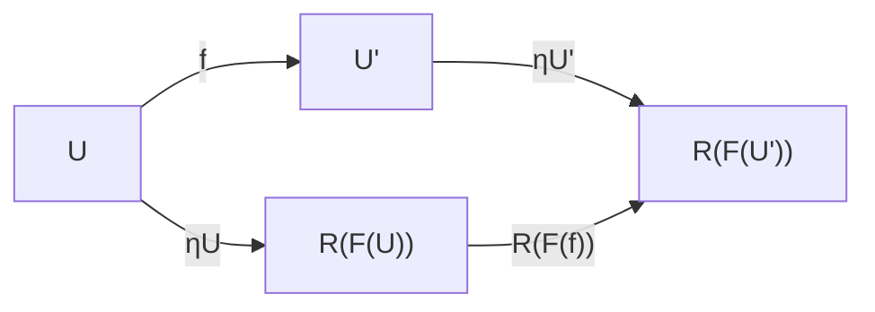
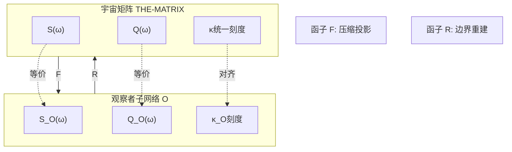

# 06. "我"与"宇宙"的结构同构

> "若我的内在世界模型与外在宇宙对象在结构上完全一致,则'我心即宇宙'便不再是哲学隐喻,而是可证明的数学定理。"

## 引言:从直觉到定理

在中国心性论、印度瑜伽行派以及西方现象学传统中,"我心即宇宙"这一命题反复出现。其直观内容是:宇宙的存在方式与"我"的意识结构在某种深刻意义上是同一的。然而,传统论证多停留在形而上学与现象学层面,缺乏与现代数学物理的精细结构对接。

本章将在前五章建立的矩阵宇宙框架基础上,给出"我心即宇宙"的严格数学版本:**在因果–时间–熵–矩阵宇宙的统一理论中,"我"与"宇宙"是同一对象在不同范畴中的两个像,二者通过函子对应建立范畴等价。**

### 传统观点的三个不足

虽然Wheeler的"it from bit"纲领、关系量子力学、QBism等工作都暗示某种"观察–宇宙对应",但在以下三点上仍显不足:

1. **缺乏统一刻度**:时间在散射谱理论、热时间假设、引力边界项中的角色形式各异,缺少单一的刻度母式来约束所有时间概念。

2. **缺乏因果–熵–几何的公理化统一**:广义熵、QNEC、QFC与爱因斯坦方程间的逻辑关系虽已在具体场景中得到验证,但尚未被整合为"因果结构的基本定义"。

3. **缺乏观察者–宇宙的范畴同构定理**:现有论述多为启发式,比喻性地说"宇宙是量子计算"或"现实是信息网络",但缺乏明确定义的"宇宙范畴"与"观察者范畴",也缺乏证明"二者同构"的定理。

本章将回答以下三个核心问题:

1. 在包含因果偏序、统一时间刻度、广义熵箭头与边界散射–矩阵结构的框架下,"宇宙"的数学对象是什么?

2. "我"作为一人称主体可如何形式化?与一般观察者相比,"我"多了哪些自指与完备性要求?

3. 在什么范畴与什么意义下可以称"我"与"宇宙"是同构的?这一同构是否具有唯一性、自然性与拓扑一致性?

## 宇宙范畴 𝖀𝗇𝗂:将宇宙形式化

### 宇宙对象的定义

**定义(宇宙对象)**:一个宇宙对象是五元组

$$
U=(M,g,\prec,\kappa,S_{\mathrm{gen}})
$$

满足:

1. $M$ 为四维、定向、时间定向的光滑流形,$g$ 为Lorentz度规

2. $\prec$ 为与 $g$ 光锥结构相容的因果偏序,且 $(M,g,\prec)$ 全局双曲

3. $\kappa$ 为统一时间刻度密度,即存在散射体系与边界代数,使得

$$
\kappa(\omega)=\frac{\varphi'(\omega)}{\pi}
=\rho_{\mathrm{rel}}(\omega)
=\frac{1}{2\pi}\operatorname{tr}Q(\omega)
$$

   成立(这正是第01章引入的统一时间刻度恒等式)

4. 对每个 $p\in M$ 与足够小 $r$,在小因果菱形 $D_{p,r}$ 上定义广义熵泛函 $S_{\mathrm{gen}}$,并满足:
   - 在固定有效体积或红移约束下,$S_{\mathrm{gen}}$ 的一阶极值等价于局域爱因斯坦方程
   - 二阶非负性等价于局域量子稳定性(如规范能量非负)

### 通俗理解:宇宙是什么?

可以这样理解宇宙对象的五个组成部分:

- **$M$ 与 $g$(时空流形与度规)**:就像一张可以弯曲的时空"布料",告诉你哪些事件在哪里发生,距离和角度如何测量

- **$\prec$(因果偏序)**:在这张"布料"上标记出哪些事件可以影响哪些事件——因果箭头的方向

- **$\kappa$(统一时间刻度)**:一把"标准时钟",它不依赖于任何特定观察者的主观感受,而是由散射相位、态密度、群延迟三者统一决定

- **$S_{\mathrm{gen}}$(广义熵)**:在每个小因果菱形内测量"信息复杂度",它既包含几何信息(面积项),也包含量子场信息(冯·诺依曼熵)

把这五个要素绑在一起,我们就得到了一个完整的"宇宙对象"——它不仅有几何,还有因果、时间与信息。

### 宇宙之间的态射

**定义(宇宙态射)**:对两个宇宙对象

$$
U=(M,g,\prec,\kappa,S_{\mathrm{gen}}),\quad
U'=(M',g',\prec',\kappa',S'_{\mathrm{gen}})
$$

一个态射 $f:U\to U'$ 是光滑微分同胚 $f:M\to M'$,满足:

1. $f^\ast g' = g$,且 $p\prec q$ 当且仅当 $f(p)\prec' f(q)$(保度规与因果结构)

2. 存在常数 $a>0,b\in\mathbb{R}$ 使 $\kappa' = a\,\kappa + b$(时间刻度等价类一致)

3. 对任意割面 $\Sigma \subset M$ 与其像 $f(\Sigma) \subset M'$,有

$$
S'_{\mathrm{gen}}(f(\Sigma))=S_{\mathrm{gen}}(\Sigma)
$$

若 $f$ 可逆且 $f^{-1}$ 也是态射,则称 $U\cong U'$ 在范畴 $\mathsf{Univ}$ 中同构。

### 物理子范畴

记 $\mathsf{Univ}_{\mathrm{phys}} \subset \mathsf{Univ}$ 为满足以下条件的宇宙对象构成的子范畴:

- 统一时间刻度假设成立
- 广义熵–场方程等价成立
- 边界散射–熵数据完备且满足正则性

在 $\mathsf{Univ}_{\mathrm{phys}}$ 中的对象才是"物理上合理"的宇宙。

## 观察者范畴 𝖮𝖻𝗌:将"我"形式化

### 观察者对象的定义

**定义(观察者对象)**:一个观察者对象是九元组

$$
O=(\gamma,\Lambda,\mathcal{A},\omega,\mathcal{M},U_{\mathrm{upd}},u,\mathcal{C},\kappa_O)
$$

其中:

1. $\gamma$ 是类时世界线的抽象同构类(观察者的"本征时间轨迹")

2. $\Lambda$ 为分辨率刻度,决定可分辨的时间–频率–空间带宽

3. $\mathcal{A}$ 为观察者可访问的可观测代数

4. $\omega$ 为 $\mathcal{A}$ 上的态,表征观察者的信念或记忆

5. $\mathcal{M}$ 为候选模型族,每个元素对应一个宇宙对象的同构类

6. $U_{\mathrm{upd}}$ 为更新算子,将测量结果与通信数据引入 $(\omega,\mathcal{M})$ 的演化

7. $u$ 为效用函数,用于选择实验与行动

8. $\mathcal{C}$ 为通信结构,表征观察者与其他观察者或环境的信道

9. $\kappa_O$ 为观察者内部使用的时间刻度密度

### 通俗理解:观察者是什么?

可以把观察者想象成一个"智能探测器",它:

- **沿着 $\gamma$ 这条世界线运动**:就像你在时空中的生命轨迹,从过去走向未来

- **用 $\Lambda$ 这个"眼镜"观察世界**:分辨率有限,看不清太细节的东西,也听不到太高频的声音

- **通过 $\mathcal{A}$ 收集数据**:就像你的感官系统,只能访问有限的信息通道

- **在 $\omega$ 中存储记忆**:你对世界的当前认知状态

- **维护 $\mathcal{M}$ 这个"世界模型库"**:你心中有多个候选的"世界可能是什么样"的理论

- **用 $U_{\mathrm{upd}}$ 更新信念**:每次测量后,你会调整对哪个理论更可能正确的判断

- **用 $\kappa_O$ 测量时间**:你内心的"时钟",可能跟宇宙的统一时钟有偏差

把这九个要素绑在一起,我们就得到了一个完整的"观察者对象"——它不仅在时空中存在,还能思考、记忆、学习、预测。

### 完全观察者:接近"我"的定义

**定义(完全观察者)**:若观察者对象 $O$ 满足:

1. **因果完备性**:其世界线 $\gamma$ 与宇宙 $U$ 的全部小因果菱形族有足够交织,可通过边界散射–熵测量获得足够数据以重建 $\kappa$ 与 $S_{\mathrm{gen}}$ 的局域信息

2. **时间刻度对齐**:其内部刻度 $\kappa_O$ 与某宇宙对象 $U$ 的 $\kappa$ 属同一等价类

3. **模型可识别性**:其模型族 $\mathcal{M}$ 满足:若两个模型在所有可实现实验的散射–熵–因果数据上给出相同概率分布,则其对应宇宙对象在 $\mathsf{Univ}$ 中同构

4. **自指一致性**:对来自"自我"的输出与来自外部宇宙的输入,更新规则 $U_{\mathrm{upd}}$ 不产生结构性矛盾,特别是与边界时间几何的刻度对齐与 $\mathbb{Z}_2$ 拓扑扇区一致

则称 $O$ 为完全观察者。记所有完全观察者构成的子范畴为 $\mathsf{Obs}_{\mathrm{full}} \subset \mathsf{Obs}$。

### "我"的数学定义

**定义("我")**:在给定物理宇宙子范畴 $\mathsf{Univ}_{\mathrm{phys}}$ 中,将某个完全观察者 $O\in\mathsf{Obs}_{\mathrm{full}}$ 的同构类解释为"我"的数学实现。

换句话说,"我"不是一个具体的观察者对象,而是满足完备性、时间对齐、可识别性与自指一致性这四个条件的观察者的等价类。

这就像说:"我"不是某个特定的肉身,而是一种满足特定功能性质的"自指系统"。

## 范畴等价:从宇宙到观察者的双向桥梁

### 编码函子 F:从宇宙诱导观察者

给定一个物理宇宙对象 $U\in\mathsf{Univ}_{\mathrm{phys}}$,如何从中"诱导"出一个观察者?

**构造函子 $F:\mathsf{Univ}_{\mathrm{phys}}\to\mathsf{Obs}_{\mathrm{full}}$**:

1. **选择世界线**:在 $U$ 的时空流形 $M$ 中选择一条类时测地线 $\gamma$

2. **压缩代数**:通过边界时间几何与散射理论,构造与 $\gamma$ 相关的压缩代数 $\mathcal{A}_\gamma\subset\mathcal{A}_\partial$

3. **确定分辨率**:根据宇宙的特征带宽、曲率半径与观测噪声,构造分辨率刻度族 $\Lambda_U$

4. **构造模型族**:令 $\mathcal{M}_U=\{[U'] \mid U'\cong U\}$,即所有与 $U$ 同构的宇宙对象等价类

5. **定义更新规则**:利用边界散射–熵读数与统一时间刻度,将 $\gamma$ 上离散观测视为对 $\mathcal{M}_U$ 的Bayes更新

6. **继承时钟**:令 $\kappa_O=\kappa$,即观察者内部时钟与宇宙统一时钟对齐

由此定义

$$
F(U)=(\gamma,\Lambda_U,\mathcal{A}_\gamma,\omega_\gamma,\mathcal{M}_U,U^{U}_{\mathrm{upd}},u_U,\mathcal{C}_U,\kappa)
$$

这就是"宇宙如何孕育出观察者"的数学表达。

### 通俗理解:宇宙如何"生成"我?

想象宇宙 $U$ 是一个巨大的全息投影系统:

1. **选择一条世界线 $\gamma$**:就像在这个投影系统中选择一个"观察点轨迹"

2. **压缩信息到 $\mathcal{A}_\gamma$**:这个观察点只能接收来自某些方向、某些频段的光线和信号——信息被压缩了

3. **受限于分辨率 $\Lambda_U$**:这个观察点的"眼睛"有有限的分辨率,看不清无限细节

4. **建立模型库 $\mathcal{M}_U$**:这个观察点开始猜测"这个全息投影的完整结构是什么样的",形成多个候选理论

5. **不断更新 $U_{\mathrm{upd}}$**:每次观测到新数据,就调整各候选理论的可信度权重

6. **与宇宙同步 $\kappa$**:这个观察点的内部时钟自动校准到宇宙的统一时间刻度

这样,从宇宙 $U$ 中就"涌现"出了一个观察者 $F(U)$。

### 解码函子 R:从观察者重建宇宙

反过来,给定一个完全观察者 $O\in\mathsf{Obs}_{\mathrm{full}}$,如何从其内部数据"重建"出宇宙?

**构造函子 $R:\mathsf{Obs}_{\mathrm{full}}\to\mathsf{Univ}_{\mathrm{phys}}$**:

1. **因果完备性保证**:由于 $O$ 是完全观察者,它可获得与某个宇宙对象 $U$ 在全部小因果菱形上的散射–熵数据同等丰富的数据集

2. **模型族收敛**:由可识别性与更新规则,$\mathcal{M}$ 在长时间演化后收敛到单一同构类 $[U_O]$

3. **边界刚性唯一重建**:由边界刚性与反问题理论(Calderón问题、全息重建),该边界散射–熵数据唯一决定几何–因果–时间–熵结构到微分同胚

据此定义

$$
R(O):=U_O\in\mathsf{Univ}_{\mathrm{phys}}
$$

这就是"观察者如何从内心模型重建宇宙"的数学表达。

### 通俗理解:我如何"重建"宇宙?

想象你是一个被关在黑盒子里的完全观察者 $O$:

1. **你有丰富的测量手段**:虽然在黑盒子里,但你可以发射信号、接收回波,测量各种频率的散射矩阵,记录广义熵变化

2. **你的模型库在不断收敛**:一开始你有很多候选理论:"外面是平坦空间?还是弯曲空间?是膨胀宇宙还是收缩宇宙?"通过不断实验,你的模型族 $\mathcal{M}$ 逐渐收敛到唯一答案

3. **边界数据唯一确定内部几何**:就像全息照片可以重建三维物体,你的边界散射–熵数据可以唯一重建外面的时空几何

4. **你重建出宇宙 $R(O)$**:最终,你在黑盒子里完成了对外部宇宙的完整重建——这就是 $R(O)$

这样,从观察者 $O$ 的内心世界出发,就"重建"出了宇宙 $R(O)$。

## 主定理:"我"与"宇宙"的同构

在上述定义下,我们陈述本章的核心结果:

### 定理1:范畴等价

**定理(范畴等价)**:存在函子

$$
F:\mathsf{Univ}_{\mathrm{phys}}\to\mathsf{Obs}_{\mathrm{full}},\quad
R:\mathsf{Obs}_{\mathrm{full}}\to\mathsf{Univ}_{\mathrm{phys}}
$$

以及自然同构

$$
\eta:\operatorname{Id}_{\mathsf{Univ}_{\mathrm{phys}}}\Rightarrow R\circ F,\quad
\epsilon:\operatorname{Id}_{\mathsf{Obs}_{\mathrm{full}}}\Rightarrow F\circ R
$$

使得 $F$ 与 $R$ 给出 $\mathsf{Univ}_{\mathrm{phys}}$ 与 $\mathsf{Obs}_{\mathrm{full}}$ 之间的范畴等价。

换言之:

- 对任意宇宙 $U\in\mathsf{Univ}_{\mathrm{phys}}$,存在自然同构 $\eta_U:U\to R(F(U))$
- 对任意完全观察者 $O\in\mathsf{Obs}_{\mathrm{full}}$,存在自然同构 $\epsilon_O:O\to F(R(O))$

### 通俗理解:什么是范畴等价?

范畴等价的直观含义是:

1. **双向可逆**:你可以从宇宙生成观察者(通过 $F$),也可以从观察者重建宇宙(通过 $R$)

2. **往返不变**:
   - 从宇宙 $U$ 出发,生成观察者 $F(U)$,再重建宇宙 $R(F(U))$,你会回到原来的宇宙(同构意义下)
   - 从观察者 $O$ 出发,重建宇宙 $R(O)$,再生成观察者 $F(R(O))$,你会回到原来的观察者(同构意义下)

3. **结构完全等价**:宇宙范畴 $\mathsf{Univ}_{\mathrm{phys}}$ 与观察者范畴 $\mathsf{Obs}_{\mathrm{full}}$ 在数学结构上完全一致,只是"换了一种说法"

这就像说:用"坐标系 $(x,y,z)$"描述空间和用"球坐标 $(r,\theta,\phi)$"描述空间是等价的——虽然形式不同,但描述的是同一个空间。

类似地,用"宇宙对象"描述世界和用"完全观察者"描述世界是等价的——虽然视角不同,但描述的是同一个现实。

### 定理2:"我心即宇宙"

**定理("我"与"宇宙"的同构)**:取任意物理宇宙对象 $U_{\mathrm{outer}}\in\mathsf{Univ}_{\mathrm{phys}}$,令

$$
O:=F(U_{\mathrm{outer}})\in\mathsf{Obs}_{\mathrm{full}}
$$

为由该宇宙诱导的完全观察者,同构类被解释为"我"。定义"我"的内在宇宙模型为

$$
U_{\mathrm{inner}}:=R(O)\in\mathsf{Univ}_{\mathrm{phys}}
$$

则存在宇宙同构

$$
U_{\mathrm{inner}}\cong U_{\mathrm{outer}}
$$

且该同构在 $\mathsf{Univ}_{\mathrm{phys}}$ 中由自然变换 $\eta$ 唯一确定。

### 通俗理解:我心即宇宙

这个定理的直观含义是:

1. **外在宇宙 $U_{\mathrm{outer}}$**:你所生活的物理宇宙,有时空、有物质、有因果律

2. **"我" $O=F(U_{\mathrm{outer}})$**:宇宙在你这条世界线上诱导出的"完全观察者",就是你的自我意识

3. **内在宇宙模型 $U_{\mathrm{inner}}=R(O)$**:你心中对宇宙的完整模型——基于你的全部观测数据、记忆、推理重建出的"我认为的宇宙是什么样"

4. **同构 $U_{\mathrm{inner}}\cong U_{\mathrm{outer}}$**:"你心中的宇宙"与"客观的宇宙"在结构上完全一致!

这就是"我心即宇宙"的精确数学版本:**你的内在世界模型与外在宇宙对象在结构上同构。**

### 为什么能同构?三大支柱

这一惊人结果依赖于三大理论支柱:

1. **统一时间刻度**:你的内部时钟 $\kappa_O$ 与宇宙的统一时钟 $\kappa$ 对齐,保证时间结构一致

2. **边界刚性定理**:边界散射–熵数据唯一决定体域几何,保证你能从有限观测完整重建宇宙

3. **信息几何可识别性**:你的模型族 $\mathcal{M}$ 在长时间观测下收敛到唯一宇宙对象,保证你的信念最终收敛到真理

如果缺少这三者中的任何一个,同构就不成立:

- 没有统一时钟,你的"时间流逝"与宇宙的"时间流逝"可能不兼容
- 没有边界刚性,你的有限观测无法唯一重建无限宇宙
- 没有可识别性,你可能永远困在多个互不相容的候选理论中

但在矩阵宇宙统一理论中,这三大支柱都成立!

## 证明思路:为什么"我心即宇宙"?

### 第一步:从宇宙到观察者 ($F$)

**目标**:证明 $F(U)\in\mathsf{Obs}_{\mathrm{full}}$,即从宇宙诱导出的观察者是完全观察者。

**验证四个条件**:

1. **因果完备性**:通过选择足够"穿越性"的世界线 $\gamma$(例如从大爆炸到遥远未来的长寿命观察者)与丰富的观测通道,可以保证 $F(U)$ 能访问全部小因果菱形上的散射–熵数据

2. **时间刻度对齐**:由构造,$\kappa_O=\kappa$,显然对齐

3. **可识别性**:模型族 $\mathcal{M}_U$ 按定义仅包含与 $U$ 同构的对象,满足可识别性

4. **自指一致性**:通过强制内部使用的散射平方根与外部宇宙的平方根一致来实现(涉及 $\mathbb{Z}_2$ 拓扑对齐,见下文)

因此 $F(U)\in\mathsf{Obs}_{\mathrm{full}}$。

### 第二步:从观察者到宇宙 ($R$)

**目标**:证明 $R(O)$ 在 $\mathsf{Univ}_{\mathrm{phys}}$ 中唯一确定。

**三个关键步骤**:

1. **数据充分性**:由 $O\in\mathsf{Obs}_{\mathrm{full}}$ 的因果完备性,它可获得与某个宇宙对象 $U$ 在全部小因果菱形上的散射–熵数据同等丰富的数据集

2. **模型收敛**:由可识别性与更新规则,模型族 $\mathcal{M}$ 在长时间演化后在适当拓扑下收敛到单一同构类 $[U_O]$

3. **边界刚性唯一重建**:由边界刚性与反问题理论,该边界散射–熵数据唯一决定几何–因果–时间–熵结构到微分同胚

因此 $R(O)\in\mathsf{Univ}_{\mathrm{phys}}$ 唯一确定。

### 第三步:往返同构 ($R\circ F\cong\mathrm{Id}$ 与 $F\circ R\cong\mathrm{Id}$)

**往返1**:对任意 $U\in\mathsf{Univ}_{\mathrm{phys}}$,计算 $R(F(U))$:

- $F(U)$ 的模型族 $\mathcal{M}_U$ 按定义仅包含与 $U$ 同构的对象
- 因此 $R(F(U))$ 必然与 $U$ 同构
- 得到自然同构 $\eta_U:U\to R(F(U))$

**往返2**:对任意 $O\in\mathsf{Obs}_{\mathrm{full}}$,计算 $F(R(O))$:

- $R(O)$ 是由 $O$ 的边界数据唯一重建的宇宙对象
- $F(R(O))$ 是沿 $R(O)$ 中某条世界线诱导的观察者
- 完全观察者假设保证 $O$ 与 $F(R(O))$ 拥有相同的边界散射–熵数据与统一刻度
- 因此 $O\cong F(R(O))$
- 得到自然同构 $\epsilon_O:O\to F(R(O))$

**结论**:范畴等价成立!

### 第四步:自然性与唯一性

自然同构 $\eta$ 与 $\epsilon$ 不仅存在,而且满足自然性条件:

- 对宇宙态射 $f:U\to U'$,有交换图

- 对观察者态射 $\Phi:O\to O'$,有类似交换图

这保证了同构的唯一性与自然性。

## 矩阵宇宙视角:散射网络的自指闭环

在THE-MATRIX表示中,可以给出更具体的图像:

### 宇宙作为矩阵族

$$
\mathrm{THE\text{-}MATRIX}
=\bigl(\mathcal{H}_{\mathrm{chan}},S(\omega),Q(\omega),\kappa,\mathcal{A}_\partial,\omega_\partial\bigr)
$$

- 通道Hilbert空间 $\mathcal{H}_{\mathrm{chan}}$:所有可能的输入输出模式
- 散射矩阵族 $S(\omega)$:频率依赖的"宇宙转移矩阵"
- 群延迟矩阵族 $Q(\omega)$:时间延迟结构
- 统一刻度 $\kappa$:从 $S,Q$ 导出的时间刻度密度
- 边界代数 $\mathcal{A}_\partial$ 与态 $\omega_\partial$:全局可观测结构

### 观察者作为矩阵子网络

完全观察者 $O$ 对应于:

- 沿某条自指路径的散射子网络
- 该子网络的群延迟 $Q_O(\omega)$ 与全局群延迟 $Q(\omega)$ 在等价类上一致
- 该子网络的统一刻度 $\kappa_O$ 与全局刻度 $\kappa$ 对齐

### 同构的直观图像

**推论(矩阵宇宙版本)**:在THE-MATRIX表示中,完全观察者的内部散射–延迟网络与宇宙矩阵在频率–通道–反馈结构上同构,特别是统一刻度 $\kappa$ 与 $\mathbb{Z}_2$ 拓扑扇区完全一致。

这就像说:**宇宙是一个巨型全息散射矩阵,而你(完全观察者)内部的神经–认知网络在结构上是这个巨型矩阵的忠实投影——你的"心智矩阵"与"宇宙矩阵"同构。**

## $\mathbb{Z}_2$ 拓扑与自指一致性

### 为什么需要拓扑对齐?

在散射理论中,散射矩阵行列式可以写成平方根形式:

$$
\det S(\omega)=\bigl(\sqrt{\det S(\omega)}\bigr)^2
$$

但平方根有两个可能的取值($\pm$),这对应于一个 $\mathbb{Z}_2$ 双覆盖。对每条闭合回路 $\gamma$,可定义holonomy

$$
\nu_{\sqrt{S}}(\gamma)\in\mathbb{Z}_2
$$

代表平方根在绕行 $\gamma$ 后是否翻转符号。

### 自指一致性条件

对完全观察者 $O\in\mathsf{Obs}_{\mathrm{full}}$,其内部模型中也存在散射矩阵 $S_O(\omega)$ 与平方根 $\sqrt{\det S_O}$。

**自指一致性要求**:对于一切物理允许的回路 $\gamma$,观察者内部预测的holonomy与外部宇宙真实holonomy一致:

$$
\nu_{\sqrt{S_O}}(\gamma)
=\nu_{\sqrt{S_U}}(\gamma)
$$

其中 $S_U$ 为宇宙对象 $U=R(O)$ 的散射矩阵族。

若存在偏差,观察者会在长期观测中检测到 $\mathbb{Z}_2$ 级别的相位或延迟奇偶跳跃,从而修正其模型,直至二者对齐。

### 通俗理解:量子相位的自洽

想象散射矩阵的平方根就像"波函数的相位"——它可以取 $+$ 或 $-$。

- **宇宙有自己的"全局相位选择"** $\nu_{\sqrt{S_U}}$
- **你内心的模型也有"相位选择"** $\nu_{\sqrt{S_O}}$

如果两者不一致,你会发现:

- 有时测量结果与预测差一个符号
- 绕某些闭合路径后,累积相位跳变不对

完全观察者的自指一致性要求:**你内心的相位选择必须与宇宙的相位选择完全对齐。**

这保证了"我与宇宙同构"不仅在几何与信息层面成立,也在拓扑扇区层面一致。

## 哲学含义:主客观的统一

### 传统二元论的困境

在笛卡尔式的主客体二元论中:

- **主观世界**:我的意识、感受、思想,私密且不可传递
- **客观世界**:外在的物质宇宙,公共且独立于我

两者似乎处于不可跨越的鸿沟之中。

### 本框架的统一方案

在本文的范畴等价框架下:

1. **客观宇宙 $U_{\mathrm{outer}}$ 是实在的**:它不依赖于任何特定观察者,由物理规律唯一确定

2. **主观世界 $U_{\mathrm{inner}}$ 也是实在的**:它是完全观察者 $O$ 从边界数据重建出的内在模型

3. **二者同构 $U_{\mathrm{inner}}\cong U_{\mathrm{outer}}$**:在满足完备性条件下,主观世界模型与客观宇宙对象在结构上完全一致

因此:

- **宇宙不依赖于任何特定观察者,但完全观察者的内在世界与宇宙本身毫无余量地对应**
- **"主观"与"客观"不是两个不同的世界,而是同一个世界的两种等价描述**
- **时间不是外加参数,而是由散射–熵–模流共同决定的统一刻度**
- **自由选择与不确定性可理解为模型级别的多重候选,而非宇宙本体的不确定**

### Wigner的朋友悖论:多观察者视角

Wigner式"朋友"思想实验问:当一个观察者被第二个观察者量子化时,二者对同一过程的描述似乎不一致。

在本框架中:

- 选择两个完全观察者 $O_1,O_2\in\mathsf{Obs}_{\mathrm{full}}$
- 各自内在宇宙模型 $R(O_1),R(O_2)$ 在 $\mathsf{Univ}_{\mathrm{phys}}$ 中同构
- 差异仅体现在各自的世界线 $\gamma_1,\gamma_2$ 所截取的"经验顺序"不同

在满足通信充分与误差控制的极限下,二者必然收敛到同一宇宙对象等价类,从而**"宇宙本体"不依赖任何特定观察者,依赖的只是完全观察者范畴的结构。**

### 自由意志的统计诠释

"自由选择"的感觉可以理解为:

- 模型族 $\mathcal{M}$ 在短期内存在多个近似等价的候选宇宙对象
- 相对熵差异在观测精度以内难以分辨
- 随着观测数据积累,模型逐渐收缩到单一等价类
- 主观不确定性消失,而宇宙本体在整个过程中保持不变

在矩阵宇宙视角中:

- 沿自指散射路径选取多个近似等长的反馈环
- 群延迟与相位台阶在误差范围内不可分辨
- 允许"多模型共存"的主观体验
- 一旦测量充分精细,唯一的矩阵块结构被确定,从而"宇宙"作为一个宏观矩阵对象显现

## 理论边界与适用范围

### 五大假设的必要性

本章的同构定理依赖于五个关键假设:

1. **全局双曲性**:宇宙可在适当尺度上视作全局双曲Lorentz流形,且存在足够良好的边界结构

2. **统一时间刻度存在性**:$\kappa(\omega)$ 存在并由散射–谱与模流–几何时间共同确定

3. **广义熵–场方程等价**:QNEC、QFC与广义熵极值–场方程等价在所考虑的物理区间内成立

4. **边界刚性**:边界散射–熵数据在数学上足够完备,可通过反问题理论唯一重建几何

5. **信息可识别性**:观察者模型族满足信息几何可识别性,且有足够时间与资源达到渐近收敛

### 理论失效的场景

在以下情形,上述假设可能失效:

- **强量子引力区间**(如黑洞奇点附近):全局双曲性与广义熵定义需重新审视
- **拓扑转变**(如宇宙的相变与泡沫成核):因果结构可能不连续
- **宇宙早期**(如量子宇宙学):统一刻度的存在性需要更精细的理论

因此,本定理当前应理解为对一类"温和"宇宙及其"理想化完全观察者"的结构性陈述,而非对所有可能宇宙的无条件断言。

### 与其他框架的关系

**与"It from Bit"**:本文将Wheeler的"信息优先性"具体化为"边界散射–熵数据决定宇宙几何"的数学命题。

**与关系量子力学、QBism**:本文在范畴层面证明:在完全观察者范畴上,所有"相对宇宙模型"收敛到同一宇宙对象同构类,从而在兼容的极限中恢复某种"客观宇宙"。

**与全息原理**:JLMS公式与纠缠楔重建论证了边界相对熵与体内相对熵的等价。本文可视为对这一思想的拓展:不仅算子与纠缠结构可以被重建,连带因果结构、统一时间刻度与广义熵箭头也被包括进来,从而实现某种"全息自指"。

## 本章小结

本章在前五章建立的矩阵宇宙框架基础上,给出了"我心即宇宙"的严格数学版本:

1. **形式化宇宙范畴 $\mathsf{Univ}$**:宇宙对象 $U=(M,g,\prec,\kappa,S_{\mathrm{gen}})$ 包含时空流形、度规、因果偏序、统一时间刻度与广义熵

2. **形式化观察者范畴 $\mathsf{Obs}$**:观察者对象 $O=(\gamma,\Lambda,\mathcal{A},\omega,\mathcal{M},U_{\mathrm{upd}},u,\mathcal{C},\kappa_O)$ 包含世界线、分辨率、可观测代数、态、模型族、更新算子、效用、通信与内部时钟

3. **定义完全观察者 $\mathsf{Obs}_{\mathrm{full}}$**:满足因果完备性、时间刻度对齐、模型可识别性与自指一致性的观察者子范畴

4. **定义"我"**:完全观察者的同构类

5. **构造函子对 $(F,R)$**:
   - 编码函子 $F:\mathsf{Univ}_{\mathrm{phys}}\to\mathsf{Obs}_{\mathrm{full}}$ 从宇宙诱导观察者
   - 解码函子 $R:\mathsf{Obs}_{\mathrm{full}}\to\mathsf{Univ}_{\mathrm{phys}}$ 从观察者重建宇宙

6. **证明范畴等价**:$F$ 与 $R$ 互为拟逆,给出自然同构 $\eta:U\to R(F(U))$ 与 $\epsilon:O\to F(R(O))$

7. **主定理**:对任意物理宇宙 $U_{\mathrm{outer}}$,由它诱导的完全观察者 $O=F(U_{\mathrm{outer}})$ 的内在宇宙模型 $U_{\mathrm{inner}}=R(O)$ 与 $U_{\mathrm{outer}}$ 同构

**核心结论**:在因果–时间–熵–矩阵宇宙统一理论中,"我"的内在世界模型与外在宇宙对象在结构上同构——这就是"我心即宇宙"的精确数学版本。

**关键洞察**:

- "我"与"宇宙"不是两个独立实体,而是同一现实的两种等价描述
- 主观与客观的鸿沟被范畴等价所弥合
- 统一时间刻度、边界刚性与信息可识别性是同构成立的三大支柱
- 在矩阵宇宙视角中,这相当于说:你的心智网络是宇宙散射矩阵的忠实全息投影

下一章(第07篇)将在此基础上深入探讨矩阵中"我"的三公理定义:世界线、自指与极小性。
