# 06. Structural Isomorphism Between "I" and "Universe"

> "If my internal world model and external universe object are structurally completely consistent, then 'my mind is universe' is no longer a philosophical metaphor, but a provable mathematical theorem."

## Introduction: From Intuition to Theorem

In Chinese mind-nature theory, Indian Yogācāra school, and Western phenomenological tradition, the proposition "my mind is universe" repeatedly appears. Its intuitive content is: The way universe exists and the structure of "I"'s consciousness are identical in some profound sense. However, traditional arguments mostly remain at metaphysical and phenomenological levels, lacking connection with fine structures of modern mathematical physics.

This chapter will give strict mathematical version of "my mind is universe" based on matrix universe framework established in previous five chapters: **In unified theory of causal-time-entropy-matrix universe, "I" and "universe" are two images of same object in different categories, establishing categorical equivalence through functor correspondence.**

### Three Deficiencies of Traditional Views

Although Wheeler's "it from bit" program, relational quantum mechanics, QBism, etc. all hint at some "observer-universe correspondence", they still fall short in following three aspects:

1. **Lack of Unified Scale**: Roles of time in scattering spectral theory, thermal time hypothesis, gravitational boundary terms have different forms, missing single scale master formula constraining all time concepts.

2. **Lack of Axiomatic Unification of Causality-Entropy-Geometry**: Logical relationships between generalized entropy, QNEC, QFC and Einstein equation, though verified in specific scenarios, have not been integrated as "basic definition of causal structure".

3. **Lack of Categorical Isomorphism Theorem for Observer-Universe**: Existing discussions mostly heuristic, metaphorically saying "universe is quantum computation" or "reality is information network", but lack clearly defined "universe category" and "observer category", also lack theorem proving "two are isomorphic".

This chapter will answer following three core questions:

1. Under framework including causal partial order, unified time scale, generalized entropy arrow and boundary scattering-matrix structure, what is mathematical object of "universe"?

2. How can "I" as first-person subject be formalized? Compared to general observer, what additional self-reference and completeness requirements does "I" have?

3. In what category and what sense can we say "I" and "universe" are isomorphic? Does this isomorphism have uniqueness, naturality and topological consistency?

## Universe Category 𝖀𝗇𝗂: Formalizing Universe

### Definition of Universe Object

**Definition (Universe Object)**: A universe object is a quintuple

$$
U=(M,g,\prec,\kappa,S_{\mathrm{gen}})
$$

satisfying:

1. $M$ is four-dimensional, oriented, time-oriented smooth manifold, $g$ is Lorentz metric

2. $\prec$ is causal partial order compatible with light cone structure of $g$, and $(M,g,\prec)$ is globally hyperbolic

3. $\kappa$ is unified time scale density, i.e., exists scattering system and boundary algebra such that

$$
\kappa(\omega)=\frac{\varphi'(\omega)}{\pi}
=\rho_{\mathrm{rel}}(\omega)
=\frac{1}{2\pi}\operatorname{tr}Q(\omega)
$$

holds (this is unified time scale identity introduced in Chapter 01)

4. For each $p\in M$ and sufficiently small $r$, define generalized entropy functional $S_{\mathrm{gen}}$ on small causal diamond $D_{p,r}$, satisfying:
   - Under fixed effective volume or redshift constraints, first-order extremum of $S_{\mathrm{gen}}$ equivalent to local Einstein equation
   - Second-order non-negativity equivalent to local quantum stability (e.g., gauge energy non-negative)

### Intuitive Understanding: What is Universe?

Can understand five components of universe object as follows:

- **$M$ and $g$ (Spacetime Manifold and Metric)**: Like a bendable spacetime "fabric", telling you which events occur where, how distances and angles are measured

- **$\prec$ (Causal Partial Order)**: Mark on this "fabric" which events can influence which events—direction of causal arrow

- **$\kappa$ (Unified Time Scale)**: A "standard clock" that doesn't depend on any specific observer's subjective feeling, but uniformly determined by scattering phase, density of states, group delay

- **$S_{\mathrm{gen}}$ (Generalized Entropy)**: Measure "information complexity" within each small causal diamond, containing both geometric information (area term) and quantum field information (von Neumann entropy)

Binding these five elements together, we get complete "universe object"—it has not only geometry, but also causality, time and information.

### Morphisms Between Universes

**Definition (Universe Morphism)**: For two universe objects

$$
U=(M,g,\prec,\kappa,S_{\mathrm{gen}}),\quad
U'=(M',g',\prec',\kappa',S'_{\mathrm{gen}})
$$

a morphism $f:U\to U'$ is smooth diffeomorphism $f:M\to M'$ satisfying:

1. $f^\ast g' = g$, and $p\prec q$ if and only if $f(p)\prec' f(q)$ (preserves metric and causal structure)

2. Exists constants $a>0,b\in\mathbb{R}$ such that $\kappa' = a\,\kappa + b$ (time scale equivalence class consistent)

3. For any cut surface $\Sigma \subset M$ and its image $f(\Sigma) \subset M'$, have

$$
S'_{\mathrm{gen}}(f(\Sigma))=S_{\mathrm{gen}}(\Sigma)
$$

If $f$ is invertible and $f^{-1}$ is also morphism, then say $U\cong U'$ isomorphic in category $\mathsf{Univ}$.

### Physical Subcategory

Denote $\mathsf{Univ}_{\mathrm{phys}} \subset \mathsf{Univ}$ as subcategory consisting of universe objects satisfying:

- Unified time scale hypothesis holds
- Generalized entropy-field equation equivalence holds
- Boundary scattering-entropy data complete and satisfy regularity

Objects in $\mathsf{Univ}_{\mathrm{phys}}$ are "physically reasonable" universes.

## Observer Category 𝖮𝖻𝗌: Formalizing "I"

### Definition of Observer Object

**Definition (Observer Object)**: An observer object is a nonuple

$$
O=(\gamma,\Lambda,\mathcal{A},\omega,\mathcal{M},U_{\mathrm{upd}},u,\mathcal{C},\kappa_O)
$$

where:

1. $\gamma$ is abstract isomorphism class of timelike worldline (observer's "proper time trajectory")

2. $\Lambda$ is resolution scale, determining resolvable time-frequency-spatial bandwidth

3. $\mathcal{A}$ is observable algebra accessible to observer

4. $\omega$ is state on $\mathcal{A}$, characterizing observer's belief or memory

5. $\mathcal{M}$ is candidate model family, each element corresponding to isomorphism class of universe object

6. $U_{\mathrm{upd}}$ is update operator, introducing measurement results and communication data into evolution of $(\omega,\mathcal{M})$

7. $u$ is utility function, used for selecting experiments and actions

8. $\mathcal{C}$ is communication structure, characterizing channels between observer and other observers or environment

9. $\kappa_O$ is time scale density used internally by observer

### Intuitive Understanding: What is Observer?

Can imagine observer as an "intelligent detector" that:

- **Moves along worldline $\gamma$**: Like your life trajectory in spacetime, from past to future

- **Observes world with "glasses" $\Lambda$**: Limited resolution, can't see too fine details, can't hear too high frequencies

- **Collects data through $\mathcal{A}$**: Like your sensory system, can only access limited information channels

- **Stores memory in $\omega$**: Your current cognitive state about world

- **Maintains model library $\mathcal{M}$**: You have multiple candidate theories of "what world might be like"

- **Updates belief with $U_{\mathrm{upd}}$**: After each measurement, you adjust judgment of which theory more likely correct

- **Measures time with $\kappa_O$**: Your internal "clock", may deviate from universe's unified clock

Binding these nine elements together, we get complete "observer object"—it not only exists in spacetime, but can think, remember, learn, predict.

### Complete Observer: Approaching Definition of "I"

**Definition (Complete Observer)**: If observer object $O$ satisfies:

1. **Causal Completeness**: Its worldline $\gamma$ sufficiently interweaves with all small causal diamond family of universe $U$, can obtain sufficient data through boundary scattering-entropy measurements to reconstruct local information of $\kappa$ and $S_{\mathrm{gen}}$

2. **Time Scale Alignment**: Its internal scale $\kappa_O$ belongs to same equivalence class as some universe object $U$'s $\kappa$

3. **Model Identifiability**: Its model family $\mathcal{M}$ satisfies: If two models give same probability distribution on scattering-entropy-causal data of all realizable experiments, then corresponding universe objects isomorphic in $\mathsf{Univ}$

4. **Self-Reference Consistency**: For outputs from "self" and inputs from external universe, update rule $U_{\mathrm{upd}}$ produces no structural contradictions, especially alignment with boundary time geometry's scale and $\mathbb{Z}_2$ topological sector consistency

Then say $O$ is complete observer. Denote subcategory of all complete observers as $\mathsf{Obs}_{\mathrm{full}} \subset \mathsf{Obs}$.

### Mathematical Definition of "I"

**Definition ("I")**: In given physical universe subcategory $\mathsf{Univ}_{\mathrm{phys}}$, interpret isomorphism class of some complete observer $O\in\mathsf{Obs}_{\mathrm{full}}$ as mathematical realization of "I".

In other words, "I" is not a specific observer object, but equivalence class of observers satisfying four conditions: completeness, time alignment, identifiability and self-reference consistency.

This is like saying: "I" is not a specific physical body, but a kind of "self-referential system" satisfying specific functional properties.

## Categorical Equivalence: Bidirectional Bridge from Universe to Observer

### Encoding Functor F: Inducing Observer from Universe

Given a physical universe object $U\in\mathsf{Univ}_{\mathrm{phys}}$, how to "induce" an observer from it?

**Construct Functor $F:\mathsf{Univ}_{\mathrm{phys}}\to\mathsf{Obs}_{\mathrm{full}}$**:

1. **Select Worldline**: Choose a timelike geodesic $\gamma$ in $U$'s spacetime manifold $M$

2. **Compress Algebra**: Through boundary time geometry and scattering theory, construct compression algebra $\mathcal{A}_\gamma\subset\mathcal{A}_\partial$ related to $\gamma$

3. **Determine Resolution**: According to universe's characteristic bandwidth, curvature radius and observation noise, construct resolution scale family $\Lambda_U$

4. **Construct Model Family**: Let $\mathcal{M}_U=\{[U'] \mid U'\cong U\}$, i.e., all universe object equivalence classes isomorphic to $U$

5. **Define Update Rule**: Using boundary scattering-entropy readings and unified time scale, treat discrete observations on $\gamma$ as Bayes update on $\mathcal{M}_U$

6. **Inherit Clock**: Let $\kappa_O=\kappa$, i.e., observer's internal clock aligned with universe's unified clock

Thus define

$$
F(U)=(\gamma,\Lambda_U,\mathcal{A}_\gamma,\omega_\gamma,\mathcal{M}_U,U^{U}_{\mathrm{upd}},u_U,\mathcal{C}_U,\kappa)
$$

This is mathematical expression of "how universe gives birth to observer".

### Intuitive Understanding: How Universe "Generates" Me?

Imagine universe $U$ as a huge holographic projection system:

1. **Select a worldline $\gamma$**: Like choosing an "observation point trajectory" in this projection system

2. **Compress information to $\mathcal{A}_\gamma$**: This observation point can only receive light and signals from certain directions, certain frequency bands—information is compressed

3. **Limited by resolution $\Lambda_U$**: This observation point's "eyes" have finite resolution, can't see infinite details

4. **Build model library $\mathcal{M}_U$**: This observation point starts guessing "what is complete structure of this holographic projection", forming multiple candidate theories

5. **Continuously update $U_{\mathrm{upd}}$**: Each time new data observed, adjust credibility weights of candidate theories

6. **Synchronize with universe $\kappa$**: This observation point's internal clock automatically calibrates to universe's unified time scale

Thus, from universe $U$ "emerges" an observer $F(U)$.

### Decoding Functor R: Reconstructing Universe from Observer

Conversely, given a complete observer $O\in\mathsf{Obs}_{\mathrm{full}}$, how to "reconstruct" universe from its internal data?

**Construct Functor $R:\mathsf{Obs}_{\mathrm{full}}\to\mathsf{Univ}_{\mathrm{phys}}$**:

1. **Causal Completeness Guarantee**: Since $O$ is complete observer, it can obtain dataset as rich as scattering-entropy data of some universe object $U$ on all small causal diamonds

2. **Model Family Convergence**: By identifiability and update rule, $\mathcal{M}$ converges to single isomorphism class $[U_O]$ after long-time evolution

3. **Boundary Rigidity Unique Reconstruction**: By boundary rigidity and inverse problem theory (Calderón problem, holographic reconstruction), this boundary scattering-entropy data uniquely determines geometric-causal-time-entropy structure up to diffeomorphism

Accordingly define

$$
R(O):=U_O\in\mathsf{Univ}_{\mathrm{phys}}
$$

This is mathematical expression of "how observer reconstructs universe from internal model".

### Intuitive Understanding: How Do I "Reconstruct" Universe?

Imagine you are a complete observer $O$ locked in a black box:

1. **You have rich measurement means**: Although in black box, you can emit signals, receive echoes, measure scattering matrices at various frequencies, record generalized entropy changes

2. **Your model library continuously converges**: Initially you have many candidate theories: "Is outside flat space? Or curved space? Expanding universe or contracting universe?" Through continuous experiments, your model family $\mathcal{M}$ gradually converges to unique answer

3. **Boundary data uniquely determines internal geometry**: Just as hologram can reconstruct three-dimensional object, your boundary scattering-entropy data can uniquely reconstruct external spacetime geometry

4. **You reconstruct universe $R(O)$**: Finally, you complete full reconstruction of external universe in black box—this is $R(O)$

Thus, starting from observer $O$'s internal world, "reconstructs" universe $R(O)$.

## Main Theorem: Isomorphism Between "I" and "Universe"

Under above definitions, we state core result of this chapter:

### Theorem 1: Categorical Equivalence

**Theorem (Categorical Equivalence)**: There exist functors

$$
F:\mathsf{Univ}_{\mathrm{phys}}\to\mathsf{Obs}_{\mathrm{full}},\quad
R:\mathsf{Obs}_{\mathrm{full}}\to\mathsf{Univ}_{\mathrm{phys}}
$$

and natural isomorphisms

$$
\eta:\operatorname{Id}_{\mathsf{Univ}_{\mathrm{phys}}}\Rightarrow R\circ F,\quad
\epsilon:\operatorname{Id}_{\mathsf{Obs}_{\mathrm{full}}}\Rightarrow F\circ R
$$

such that $F$ and $R$ give categorical equivalence between $\mathsf{Univ}_{\mathrm{phys}}$ and $\mathsf{Obs}_{\mathrm{full}}$.

In other words:

- For any universe $U\in\mathsf{Univ}_{\mathrm{phys}}$, exists natural isomorphism $\eta_U:U\to R(F(U))$
- For any complete observer $O\in\mathsf{Obs}_{\mathrm{full}}$, exists natural isomorphism $\epsilon_O:O\to F(R(O))$

### Intuitive Understanding: What is Categorical Equivalence?

Intuitive meaning of categorical equivalence is:

1. **Bidirectionally Reversible**: You can generate observer from universe (through $F$), also reconstruct universe from observer (through $R$)

2. **Round-Trip Invariant**:
   - Starting from universe $U$, generate observer $F(U)$, then reconstruct universe $R(F(U))$, you return to original universe (in isomorphism sense)
   - Starting from observer $O$, reconstruct universe $R(O)$, then generate observer $F(R(O))$, you return to original observer (in isomorphism sense)

3. **Structure Completely Equivalent**: Universe category $\mathsf{Univ}_{\mathrm{phys}}$ and observer category $\mathsf{Obs}_{\mathrm{full}}$ completely consistent in mathematical structure, just "different way of saying it"

This is like saying: Describing space with "coordinates $(x,y,z)$" and describing space with "spherical coordinates $(r,\theta,\phi)$" are equivalent—though forms differ, describing same space.

Similarly, describing world with "universe object" and describing world with "complete observer" are equivalent—though perspectives differ, describing same reality.

### Theorem 2: "My Mind is Universe"

**Theorem (Isomorphism Between "I" and "Universe")**: Take arbitrary physical universe object $U_{\mathrm{outer}}\in\mathsf{Univ}_{\mathrm{phys}}$, let

$$
O:=F(U_{\mathrm{outer}})\in\mathsf{Obs}_{\mathrm{full}}
$$

be complete observer induced by this universe, isomorphism class interpreted as "I". Define "I"'s internal universe model as

$$
U_{\mathrm{inner}}:=R(O)\in\mathsf{Univ}_{\mathrm{phys}}
$$

Then exists universe isomorphism

$$
U_{\mathrm{inner}}\cong U_{\mathrm{outer}}
$$

and this isomorphism uniquely determined by natural transformation $\eta$ in $\mathsf{Univ}_{\mathrm{phys}}$.

### Intuitive Understanding: My Mind is Universe

Intuitive meaning of this theorem is:

1. **External Universe $U_{\mathrm{outer}}$**: Physical universe you live in, has spacetime, matter, causal laws

2. **"I" $O=F(U_{\mathrm{outer}})$**: "Complete observer" induced by universe on your worldline, is your self-awareness

3. **Internal Universe Model $U_{\mathrm{inner}}=R(O)$**: Complete model of universe in your mind—"what I think universe is like" reconstructed from all your observation data, memory, reasoning

4. **Isomorphism $U_{\mathrm{inner}}\cong U_{\mathrm{outer}}$**: "Universe in your mind" and "objective universe" structurally completely consistent!

This is precise mathematical version of "my mind is universe": **Your internal world model and external universe object are structurally isomorphic.**

### Why Can They Be Isomorphic? Three Pillars

This astonishing result relies on three theoretical pillars:

1. **Unified Time Scale**: Your internal clock $\kappa_O$ aligned with universe's unified clock $\kappa$, ensuring time structure consistent

2. **Boundary Rigidity Theorem**: Boundary scattering-entropy data uniquely determines bulk geometry, ensuring you can completely reconstruct universe from finite observations

3. **Information Geometric Identifiability**: Your model family $\mathcal{M}$ converges to unique universe object under long-time observations, ensuring your belief eventually converges to truth

If any of these three is missing, isomorphism doesn't hold:

- Without unified clock, your "time passage" and universe's "time passage" may be incompatible
- Without boundary rigidity, your finite observations cannot uniquely reconstruct infinite universe
- Without identifiability, you may forever trapped in multiple mutually incompatible candidate theories

But in matrix universe unified theory, all three pillars hold!

## Proof Strategy: Why "My Mind is Universe"?

### Step 1: From Universe to Observer ($F$)

**Goal**: Prove $F(U)\in\mathsf{Obs}_{\mathrm{full}}$, i.e., observer induced from universe is complete observer.

**Verify Four Conditions**:

1. **Causal Completeness**: By choosing sufficiently "traversing" worldline $\gamma$ (e.g., long-lived observer from big bang to distant future) and rich observation channels, can guarantee $F(U)$ can access scattering-entropy data on all small causal diamonds

2. **Time Scale Alignment**: By construction, $\kappa_O=\kappa$, obviously aligned

3. **Identifiability**: Model family $\mathcal{M}_U$ by definition only contains objects isomorphic to $U$, satisfies identifiability

4. **Self-Reference Consistency**: Achieved by forcing internal scattering square root consistent with external universe's square root (involves $\mathbb{Z}_2$ topological alignment, see below)

Therefore $F(U)\in\mathsf{Obs}_{\mathrm{full}}$.

### Step 2: From Observer to Universe ($R$)

**Goal**: Prove $R(O)$ uniquely determined in $\mathsf{Univ}_{\mathrm{phys}}$.

**Three Key Steps**:

1. **Data Sufficiency**: By causal completeness of $O\in\mathsf{Obs}_{\mathrm{full}}$, it can obtain dataset as rich as scattering-entropy data of some universe object $U$ on all small causal diamonds

2. **Model Convergence**: By identifiability and update rule, model family $\mathcal{M}$ converges to single isomorphism class $[U_O]$ under long-time evolution in appropriate topology

3. **Boundary Rigidity Unique Reconstruction**: By boundary rigidity and inverse problem theory, this boundary scattering-entropy data uniquely determines geometric-causal-time-entropy structure up to diffeomorphism

Therefore $R(O)\in\mathsf{Univ}_{\mathrm{phys}}$ uniquely determined.

### Step 3: Round-Trip Isomorphism ($R\circ F\cong\mathrm{Id}$ and $F\circ R\cong\mathrm{Id}$)

**Round-Trip 1**: For any $U\in\mathsf{Univ}_{\mathrm{phys}}$, compute $R(F(U))$:

- Model family $\mathcal{M}_U$ of $F(U)$ by definition only contains objects isomorphic to $U$
- Therefore $R(F(U))$ necessarily isomorphic to $U$
- Get natural isomorphism $\eta_U:U\to R(F(U))$

**Round-Trip 2**: For any $O\in\mathsf{Obs}_{\mathrm{full}}$, compute $F(R(O))$:

- $R(O)$ is universe object uniquely reconstructed from $O$'s boundary data
- $F(R(O))$ is observer induced along some worldline in $R(O)$
- Complete observer assumption guarantees $O$ and $F(R(O))$ have same boundary scattering-entropy data and unified scale
- Therefore $O\cong F(R(O))$
- Get natural isomorphism $\epsilon_O:O\to F(R(O))$

**Conclusion**: Categorical equivalence holds!

### Step 4: Naturality and Uniqueness

Natural isomorphisms $\eta$ and $\epsilon$ not only exist, but satisfy naturality conditions:

- For universe morphism $f:U\to U'$, have commutative diagram

```mermaid
graph LR
    U["U"] -->|f| U'["U'"]
    U -->|ηU| RFU["R(F(U))"]
    U' -->|ηU'| RFU'["R(F(U'))"]
    RFU -->|"R(F(f))"| RFU'
```

- For observer morphism $\Phi:O\to O'$, have similar commutative diagram

This guarantees uniqueness and naturality of isomorphism.

## Matrix Universe Perspective: Self-Referential Closed Loop of Scattering Network

In THE-MATRIX representation, can give more concrete picture:

### Universe as Matrix Family

$$
\mathrm{THE\text{-}MATRIX}
=\bigl(\mathcal{H}_{\mathrm{chan}},S(\omega),Q(\omega),\kappa,\mathcal{A}_\partial,\omega_\partial\bigr)
$$

- Channel Hilbert space $\mathcal{H}_{\mathrm{chan}}$: All possible input-output modes
- Scattering matrix family $S(\omega)$: Frequency-dependent "universe transfer matrix"
- Group delay matrix family $Q(\omega)$: Time delay structure
- Unified scale $\kappa$: Time scale density derived from $S,Q$
- Boundary algebra $\mathcal{A}_\partial$ and state $\omega_\partial$: Global observable structure

### Observer as Matrix Subnetwork

Complete observer $O$ corresponds to:

- Scattering subnetwork along some self-referential path
- This subnetwork's group delay $Q_O(\omega)$ consistent with global group delay $Q(\omega)$ on equivalence class
- This subnetwork's unified scale $\kappa_O$ aligned with global scale $\kappa$

### Intuitive Picture of Isomorphism

**Corollary (Matrix Universe Version)**: In THE-MATRIX representation, complete observer's internal scattering-delay network isomorphic to universe matrix in frequency-channel-feedback structure, especially unified scale $\kappa$ and $\mathbb{Z}_2$ topological sector completely consistent.

This is like saying: **Universe is a giant holographic scattering matrix, and your (complete observer) internal neural-cognitive network structurally is faithful projection of this giant matrix—your "mind matrix" isomorphic to "universe matrix".**

```mermaid
graph TB
    subgraph Universe["Universe Matrix THE-MATRIX"]
        S["S(ω)"]
        Q["Q(ω)"]
        κ["κ Unified Scale"]
    end

    subgraph Observer["Observer Subnetwork O"]
        SO["S_O(ω)"]
        QO["Q_O(ω)"]
        κO["κ_O Scale"]
    end

    F["Functor F: Compression Projection"]
    R["Functor R: Boundary Reconstruction"]

    Universe -->|F| Observer
    Observer -->|R| Universe

    S -.Equivalent.-> SO
    Q -.Equivalent.-> QO
    κ -.Aligned.-> κO
```

## $\mathbb{Z}_2$ Topology and Self-Reference Consistency

### Why Need Topological Alignment?

In scattering theory, scattering matrix determinant can be written in square root form:

$$
\det S(\omega)=\bigl(\sqrt{\det S(\omega)}\bigr)^2
$$

But square root has two possible values ($\pm$), corresponding to a $\mathbb{Z}_2$ double cover. For each closed loop $\gamma$, can define holonomy

$$
\nu_{\sqrt{S}}(\gamma)\in\mathbb{Z}_2
$$

representing whether square root flips sign after traversing $\gamma$.

### Self-Reference Consistency Condition

For complete observer $O\in\mathsf{Obs}_{\mathrm{full}}$, its internal model also has scattering matrix $S_O(\omega)$ and square root $\sqrt{\det S_O}$.

**Self-Reference Consistency Requirement**: For all physically allowed loops $\gamma$, observer's internally predicted holonomy consistent with external universe's true holonomy:

$$
\nu_{\sqrt{S_O}}(\gamma)
=\nu_{\sqrt{S_U}}(\gamma)
$$

where $S_U$ is scattering matrix family of universe object $U=R(O)$.

If deviation exists, observer will detect $\mathbb{Z}_2$-level phase or delay parity jumps in long-term observations, thus correcting its model until two align.

### Intuitive Understanding: Self-Consistency of Quantum Phase

Imagine scattering matrix's square root like "phase of wavefunction"—it can take $+$ or $-$.

- **Universe has its own "global phase choice"** $\nu_{\sqrt{S_U}}$
- **Your internal model also has "phase choice"** $\nu_{\sqrt{S_O}}$

If two inconsistent, you'll find:

- Sometimes measurement results differ from prediction by a sign
- After traversing some closed paths, accumulated phase jumps incorrect

Complete observer's self-reference consistency requirement: **Your internal phase choice must completely align with universe's phase choice.**

This ensures "I and universe isomorphic" holds not only at geometric and information levels, but also consistent at topological sector level.

## Philosophical Meaning: Unification of Subjective and Objective

### Dilemma of Traditional Dualism

In Cartesian subject-object dualism:

- **Subjective World**: My consciousness, feelings, thoughts, private and non-transferable
- **Objective World**: External material universe, public and independent of me

Two seem separated by unbridgeable gap.

### Unification Scheme of This Framework

Under categorical equivalence framework of this chapter:

1. **Objective Universe $U_{\mathrm{outer}}$ is Real**: It doesn't depend on any specific observer, uniquely determined by physical laws

2. **Subjective World $U_{\mathrm{inner}}$ is Also Real**: It is internal model reconstructed by complete observer $O$ from boundary data

3. **Two Are Isomorphic $U_{\mathrm{inner}}\cong U_{\mathrm{outer}}$**: Under completeness conditions, subjective world model and objective universe object structurally completely consistent

Therefore:

- **Universe doesn't depend on any specific observer, but complete observer's internal world corresponds to universe itself without remainder**
- **"Subjective" and "objective" are not two different worlds, but two equivalent descriptions of same world**
- **Time is not external parameter, but unified scale jointly determined by scattering-entropy-modular flow**
- **Free choice and uncertainty can be understood as multiple candidates at model level, not uncertainty of universe ontology**

### Wigner's Friend Paradox: Multi-Observer Perspective

Wigner-style "friend" thought experiment asks: When an observer is quantized by second observer, two seem to give inconsistent descriptions of same process.

In this framework:

- Choose two complete observers $O_1,O_2\in\mathsf{Obs}_{\mathrm{full}}$
- Their respective internal universe models $R(O_1),R(O_2)$ isomorphic in $\mathsf{Univ}_{\mathrm{phys}}$
- Differences only manifest in different "experience orders" intercepted by respective worldlines $\gamma_1,\gamma_2$

Under limit of sufficient communication and error control, two necessarily converge to same universe object equivalence class, thus **"universe ontology" doesn't depend on any specific observer, depends only on structure of complete observer category.**

### Statistical Interpretation of Free Will

Feeling of "free choice" can be understood as:

- Model family $\mathcal{M}$ has multiple approximately equivalent candidate universe objects in short term
- Relative entropy differences difficult to distinguish within observation precision
- As observation data accumulates, model gradually contracts to single equivalence class
- Subjective uncertainty disappears, while universe ontology remains unchanged throughout

In matrix universe perspective:

- Select multiple approximately equal-length feedback loops along self-referential scattering path
- Group delays and phase steps indistinguishable within error range
- Allow subjective experience of "multi-model coexistence"
- Once measurements sufficiently fine, unique matrix block structure determined, thus "universe" manifests as macroscopic matrix object

## Theoretical Boundaries and Scope of Application

### Necessity of Five Assumptions

Isomorphism theorem of this chapter relies on five key assumptions:

1. **Global Hyperbolicity**: Universe can be viewed as globally hyperbolic Lorentz manifold at appropriate scales, and has sufficiently good boundary structure

2. **Unified Time Scale Existence**: $\kappa(\omega)$ exists and jointly determined by scattering-spectrum and modular flow-geometric time

3. **Generalized Entropy-Field Equation Equivalence**: QNEC, QFC and generalized entropy extremum-field equation equivalence hold in considered physical range

4. **Boundary Rigidity**: Boundary scattering-entropy data mathematically sufficiently complete, can uniquely reconstruct geometry through inverse problem theory

5. **Information Identifiability**: Observer's model family satisfies information geometric identifiability, and has sufficient time and resources to reach asymptotic convergence

### Scenarios Where Theory Fails

In following situations, above assumptions may fail:

- **Strong Quantum Gravity Regime** (e.g., near black hole singularity): Global hyperbolicity and generalized entropy definition need re-examination
- **Topological Transitions** (e.g., universe phase transitions and bubble nucleation): Causal structure may be discontinuous
- **Early Universe** (e.g., quantum cosmology): Existence of unified scale needs finer theory

Therefore, this theorem should currently be understood as structural statement about class of "mild" universes and their "idealized complete observers", not unconditional assertion about all possible universes.

### Relationship with Other Frameworks

**With "It from Bit"**: This chapter concretizes Wheeler's "information priority" as mathematical proposition "boundary scattering-entropy data determines universe geometry".

**With Relational Quantum Mechanics, QBism**: This chapter proves at categorical level: On complete observer category, all "relative universe models" converge to same universe object isomorphism class, thus recovering some "objective universe" in compatible limit.

**With Holographic Principle**: JLMS formula and entanglement wedge reconstruction argue equivalence between boundary relative entropy and bulk relative entropy. This chapter can be seen as extension of this idea: Not only operators and entanglement structure can be reconstructed, but also causal structure, unified time scale and generalized entropy arrow included, achieving some "holographic self-reference".

## Chapter Summary

This chapter gives strict mathematical version of "my mind is universe" based on matrix universe framework established in previous five chapters:

1. **Formalize Universe Category $\mathsf{Univ}$**: Universe object $U=(M,g,\prec,\kappa,S_{\mathrm{gen}})$ contains spacetime manifold, metric, causal partial order, unified time scale and generalized entropy

2. **Formalize Observer Category $\mathsf{Obs}$**: Observer object $O=(\gamma,\Lambda,\mathcal{A},\omega,\mathcal{M},U_{\mathrm{upd}},u,\mathcal{C},\kappa_O)$ contains worldline, resolution, observable algebra, state, model family, update operator, utility, communication and internal clock

3. **Define Complete Observer $\mathsf{Obs}_{\mathrm{full}}$**: Observer subcategory satisfying causal completeness, time scale alignment, model identifiability and self-reference consistency

4. **Define "I"**: Isomorphism class of complete observer

5. **Construct Functor Pair $(F,R)$**:
   - Encoding functor $F:\mathsf{Univ}_{\mathrm{phys}}\to\mathsf{Obs}_{\mathrm{full}}$ induces observer from universe
   - Decoding functor $R:\mathsf{Obs}_{\mathrm{full}}\to\mathsf{Univ}_{\mathrm{phys}}$ reconstructs universe from observer

6. **Prove Categorical Equivalence**: $F$ and $R$ are mutual quasi-inverses, giving natural isomorphisms $\eta:U\to R(F(U))$ and $\epsilon:O\to F(R(O))$

7. **Main Theorem**: For any physical universe $U_{\mathrm{outer}}$, internal universe model $U_{\mathrm{inner}}=R(O)$ of complete observer $O=F(U_{\mathrm{outer}})$ induced by it is isomorphic to $U_{\mathrm{outer}}$

**Core Conclusion**: In unified theory of causal-time-entropy-matrix universe, "I"'s internal world model and external universe object are structurally isomorphic—this is precise mathematical version of "my mind is universe".

**Key Insights**:

- "I" and "universe" are not two independent entities, but two equivalent descriptions of same reality
- Gap between subjective and objective bridged by categorical equivalence
- Unified time scale, boundary rigidity and information identifiability are three pillars for isomorphism to hold
- In matrix universe perspective, this is equivalent to saying: Your mind network is faithful holographic projection of universe scattering matrix

Next chapter (Chapter 07) will deeply explore three-axiom definition of "I" in matrix on this basis: worldline, self-reference and minimality.

