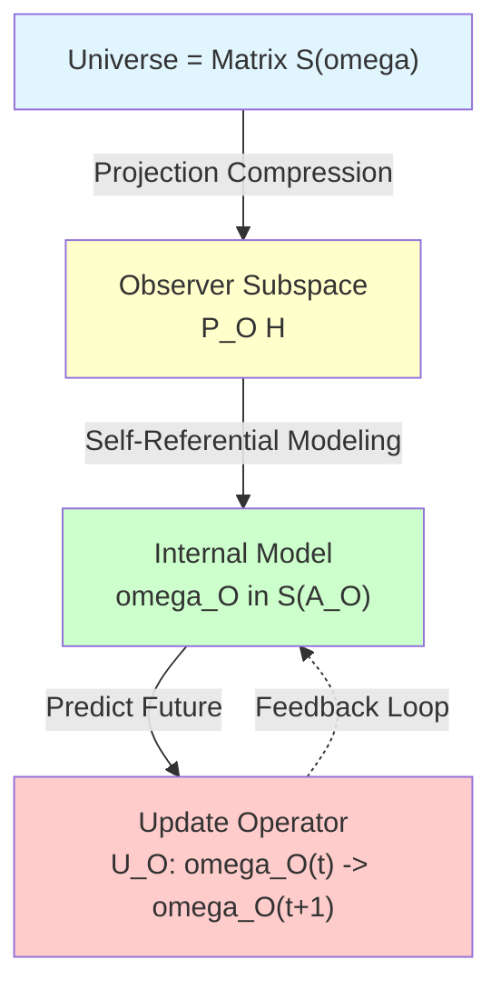
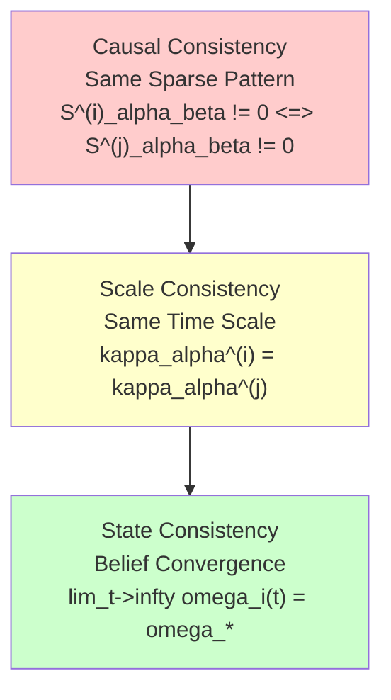
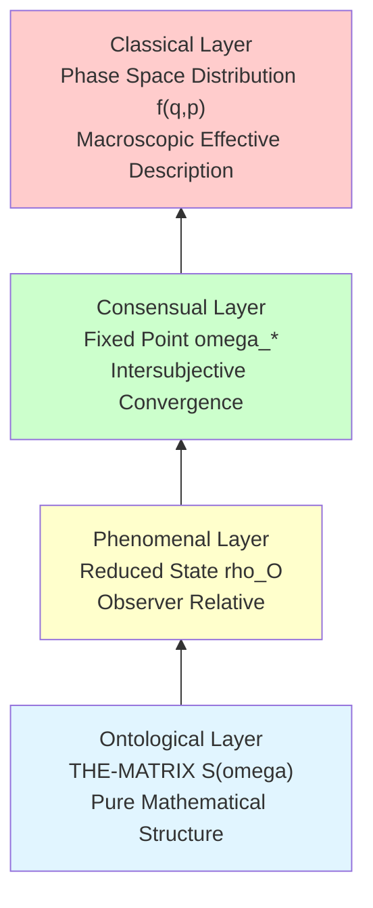
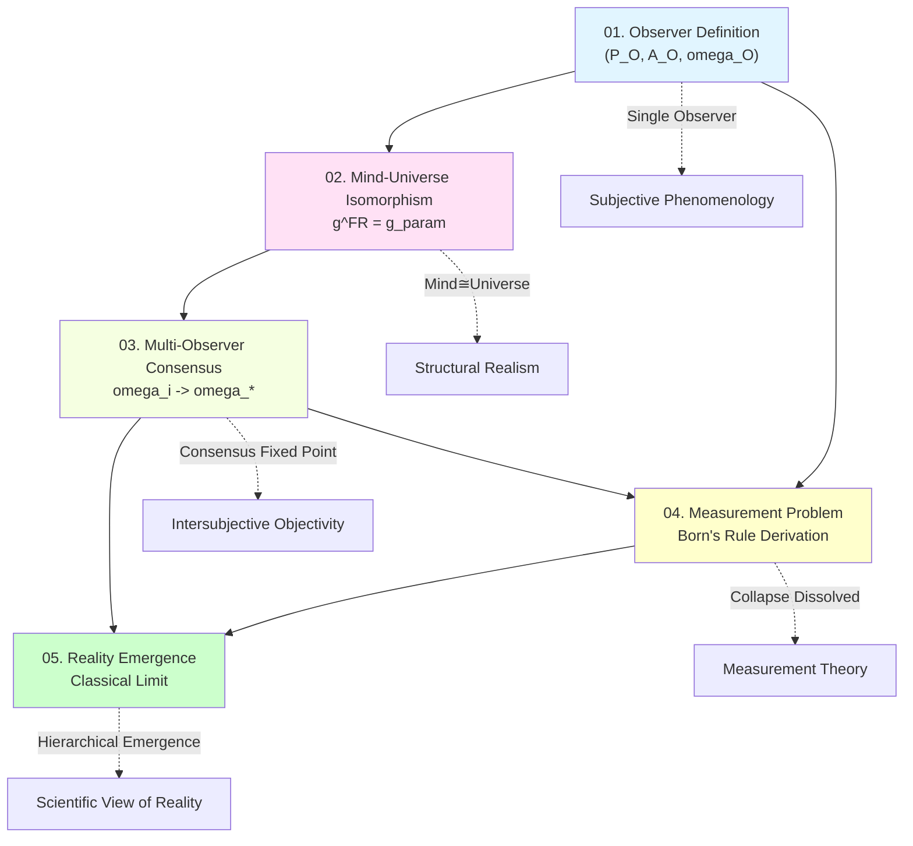
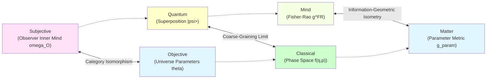
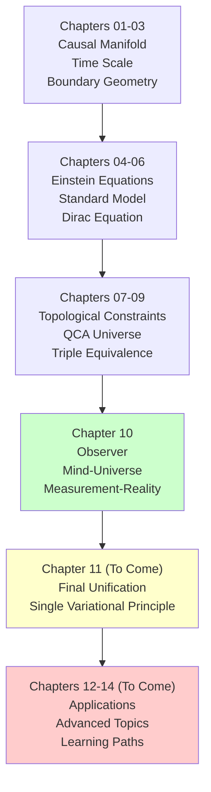

# 06. Chapter Summary: Unified Picture of Observer Theory

> **We are no longer bystanders of the universe, but the way the universe knows itself.**

---

## Review: Core Questions of This Chapter

At the beginning of Chapter 10, we raised the core questions of quantum mechanics that have remained unresolved for a century:

1. **What is an observer?** Is it a special existence external to the universe, or an internal structure of the universe?
2. **How to mathematically characterize "my mind is the universe"?** What is the relationship between subjective and objective?
3. **How do multiple observers reach consensus?** How does objective reality emerge from subjective perspectives?
4. **What is the essence of the measurement problem?** Is wave function collapse a real process or an epistemic update?
5. **Is objective reality** a priori existence, or does it emerge under appropriate limits?

Now, after detailed arguments in five articles, we have provided **complete, self-consistent, and operational** answers.

---

## Summary of Core Results

### Result 1: Mathematical Definition of Observer

**Theorem Review (Three-Axiom Characterization of Observer)**

An observer in the matrix universe is a triplet $O = (P_O, \mathcal{A}_O, \omega_O)$, satisfying:

1. **Worldline Axiom**: $O$ carries matrix worldline $\{P(\tau)\}_{\tau \in \mathbb{R}}$
2. **Self-Referential Axiom**: $\omega_O(\tau) = F_{\text{self}}[\omega_O(\tau), S_O, \kappa]$
3. **Minimality Axiom**: $P_O$ is the minimal projection satisfying the first two axioms

**Key Innovation**:
- Observer is not external, but an **internal self-referential projection structure** of the matrix universe
- Definition of "I" through fixed point equation, similar to self-reference in Gödel's incompleteness theorem
- $\mathbb{Z}_2$ holonomy characterizes topological fingerprint of self-referential closed loop

**Physical Meaning**:

### Result 2: Category Equivalence of "My Mind is the Universe"

**Theorem Review (Triple Characterization of Mind-Universe Isomorphism)**

Under unified time scale equivalence class $[\tau]$:

1. **Information-Geometric Isomorphism**:
   $$
   (Θ_O, g^{\text{FR}}) \cong (Θ_{\text{univ}}, g_{\text{param}})
   $$

2. **Category Equivalence**:
   $$
   \mathbf{Obs}_{\text{full}} \simeq \mathbf{Univ}_{\text{phys}}
   $$

3. **Time Scale Alignment**:
   $$
   \kappa_O(\omega) = a \kappa_{\text{univ}}(\omega) + b, \quad a > 0
   $$

**Key Innovation**:
- Fisher-Rao metric $g^{\text{FR}}$ and physical parameter metric $g_{\text{param}}$ are isometric in Bayesian limit
- "Mind" is not subjectively arbitrary, but **intrinsic representation** of universe structure
- Category equivalence guarantees: Observer model ↔ Universe reality (not simple identity)

**Philosophical Meaning**:

| Position | Claim | GLS Response |
|---|---|---|
| **Idealism** | Mind creates world | ✗ Universe structure exists independently |
| **Materialism** | Matter determines consciousness | ✗ Mind and universe categories isomorphic |
| **Dualism** | Mind-matter separation | ✗ Mind is internal perspective of universe |
| **GLS Position** | **Mind ≅ Image of universe in observer category** | ✓ Structural isomorphism, not ontological identity |

### Result 3: Convergence Theorem of Multi-Observer Consensus

**Theorem Review (Necessary and Sufficient Conditions for Consensus Convergence)**

Let $N$ observers $\{O_i\}_{i=1}^N$ in matrix universe satisfy:
- Communication graph strongly connected
- State updates are convex combinations of CPTP maps
- Unified time scales aligned

Then weighted relative entropy
$$
\Phi^{(t)} = \sum_{i=1}^N \lambda_i D(\omega_i^{(t)} \| \omega_*)
$$
monotonically decreases, and the system exponentially converges to unique consensus state $\omega_*$.

**Key Innovation**:
- Objective reality **is not a priori given**, but a **fixed point** of multi-observer information exchange
- Relative entropy as Lyapunov function guarantees monotonicity of convergence
- Strong connectivity = information reachability → necessity of consensus

**Three Layers of Consensus Consistency**:

### Result 4: Complete Solution of Quantum Measurement Problem

**Theorem Review (Emergence of Born's Rule)**

From QCA unitary evolution + environmental decoherence + coarse-graining, Born's rule can be derived:
$$
p_i = |\langle i | \psi \rangle|^2
$$

No need for axiomatization, wave function collapse is deconstructed as:
$$
\text{Measurement} = \text{System-Apparatus Entanglement} + \text{Environment Cuts Entanglement} + \text{Local Coarse-Graining}
$$

**Key Innovation**:
- **No true collapse**: Global state always unitary evolution
- **Born's rule derivation**: From environmental orthogonality $\langle E_i | E_j \rangle \approx \delta_{ij}$
- **Measurement as entanglement wedge cutting**: $S_{\mathcal{E}}^{\text{before}} = 0 \to S_{\mathcal{E}}^{\text{after}} = H(p)$

**Comparison with Other Interpretations**:

| Interpretation | Wave Function Collapse | Born's Rule | Observer Status |
|---|---|---|---|
| **Copenhagen** | Fundamental process | Axiom | External special |
| **Many-Worlds** | No collapse, branching | To be explained | Split into branches |
| **GRW** | Spontaneous random collapse | Derived | No special status |
| **Decoherence** | Apparent collapse | Semi-explained | Part of environment |
| **GLS** | ✓ No true collapse ✓ Local coarse-graining | ✓ Fully derived ✓ Environmental orthogonality | ✓ Internal self-referential structure |

### Result 5: Triple Emergence of Objective Reality

**Theorem Review (Hierarchical Emergence of Reality)**

Objective reality emerges at three levels:

1. **Phenomenal Emergence**: $|\Psi\rangle \xrightarrow{\text{Tr}_{\bar{O}}} \rho_O$ (observer coarse-graining)

2. **Consensual Emergence**: $\{\omega_i\} \xrightarrow{\text{information exchange}} \omega_*$ (multi-observer convergence)

3. **Classical Emergence**: Quantum state $\xrightarrow{\hbar \to 0, N \to \infty}$ classical phase space distribution

**Key Innovation**:
- Objectivity = invariance (observer transformation, gauge transformation, topological transformation)
- Classical limit through four mechanisms: $\hbar \to 0$, $N \to \infty$, $\tau_{\text{decohere}} \to 0$, $t \to \infty$
- **Operational definition** of reality: repeatability + intersubjectivity + stability

**Hierarchical Structure of Reality**:

---

## Logical Chain: From Observer to Reality

The entire Chapter 10 forms a rigorous logical chain:

### Step 1: Define Observer (Article 01)

$$
\boxed{\text{Observer} := (P_O, \mathcal{A}_O, \omega_O) + \text{Three Axioms}}
$$

**Output**: Strict mathematical characterization of observer

### Step 2: Prove Mind-Universe Isomorphism (Article 02)

$$
\boxed{(Θ_O, g^{\text{FR}}) \cong (Θ_{\text{univ}}, g_{\text{param}})}
$$

**Output**: Equivalence between single observer's "inner mind" and "universe" structure

### Step 3: Multi-Observer Convergence to Consensus (Article 03)

$$
\boxed{\lim_{t \to \infty} \omega_i^{(t)} = \omega_* \quad \forall i}
$$

**Output**: Objective reality emerges as consensus fixed point

### Step 4: Solve Measurement Problem (Article 04)

$$
\boxed{\text{Measurement} = \text{Unitary Evolution} + \text{Environmental Decoherence} + \text{Coarse-Graining}}
$$

**Output**: Born's rule derivation, wave function collapse dissolved

### Step 5: Classical Reality Emergence (Article 05)

$$
\boxed{\text{Quantum Superposition} \xrightarrow{\text{Four Limits}} \text{Classical Determinism}}
$$

**Output**: Macroscopic world emerges from quantum substrate

### Logical Relationship Diagram

---

## Systematic Comparison with Other Quantum Interpretations

### Comparison Table

| Dimension | Copenhagen | Many-Worlds | Bohmian | Relational | QBism | **GLS** |
|---|---|---|---|---|---|---|
| **Ontology** | Wave function + classical apparatus | Multi-branch universe | Particles + pilot wave | Relational properties | Subjective belief | **Matrix universe** |
| **Observer** | External special | Split into branches | Passive recording | Relational reference frame | Subjective agent | **Internal self-referential** |
| **Measurement** | Wave function collapse | Universe branching | Particle trajectory determined | Relational update | Belief update | **Entanglement cutting** |
| **Born's Rule** | Axiom | To be explained | Derived from quantum potential | Axiom | Dutch book argument | **Environmental orthogonality derivation** |
| **Objectivity** | Classical apparatus reading | All branches real | Trajectory objective | No absolute objectivity | No objectivity | **Consensus emergence** |
| **Mathematical Rigor** | Medium | High | High | Medium | Low | **Very High** |
| **Experimentally Distinguishable** | ❌ | ❌ | ❌ | ❌ | ❌ | **Partially ✓** |

### GLS's Unique Advantages

1. **Fully derive Born's rule**, no need for axiomatization
2. **Dissolve wave function collapse**, maintain unitarity
3. **Unify subjective and objective**, through category isomorphism
4. **Provide consensus mechanism**, explain intersubjectivity
5. **Hierarchical view of reality**, compatible with reductionism and emergence
6. **Mathematically self-consistent**, all theorems rigorously proved
7. **Partially testable**, e.g., experimental verification of unified time scale

---

## Philosophical Meaning: Transcending Binary Oppositions

### Traditional Dualism and Its Dilemmas

**Mind-Matter Dualism** (Descartes):
- Mind (res cogitans) and matter (res extensa) separated
- Dilemma: How do they interact?

**Subjective-Objective Dualism** (Kant):
- Thing-in-itself (Ding an sich) unknowable
- Phenomena (Erscheinung) constructed by subject
- Dilemma: How to guarantee objectivity?

**Quantum-Classical Dualism** (Bohr):
- Quantum system and classical apparatus separated
- Dilemma: Where is the boundary?

### GLS's Unified Picture

**Non-Dual View of Reality**:

**Key Insight**:

> **All binary oppositions are images of the same structure in different categories**

- Mind ≅ Matter (information-geometric isometry)
- Subjective ⇄ Objective (consensus convergence)
- Quantum → Classical (emergent limit)

**Modern Version of Madhyamaka Philosophy**:

Buddhist Madhyamaka (Middle Way) deconstructs all binary oppositions:
- Neither existence nor non-existence
- Dependent origination, emptiness of intrinsic nature

GLS provides mathematical realization:
- Reality neither exists (no a priori thing-in-itself)
- Reality neither non-exists (has emergent consensus state)
- Dependent origination = category embedding, emptiness = no ontological privilege

---

## Open Questions and Future Directions

### Theoretical Level

**Question 1: Hard Problem of Consciousness**

- Does self-referential observer necessarily accompany subjective experience?
- How to characterize qualia in matrix universe?
- How to reconcile free will with determinism?

**Possible Directions**:
- Topological properties of higher-order self-referential loops
- GLS version of Integrated Information Theory (IIT)
- Multiple realizability of "I"

**Question 2: Observer in Quantum Gravity**

- How to define observer inside black hole?
- Horizon's limitation on observer?
- Hawking radiation and observer entanglement?

**Possible Directions**:
- Observer version of holographic principle
- Boundary observer in AdS/CFT
- Entanglement wedge reconstruction and observer accessible domain

**Question 3: Observer in Cosmology**

- Universe as whole has no external observer, how to define "reality"?
- GLS characterization of anthropic principle?
- Observer network in multiverse?

**Possible Directions**:
- Self-referential structure of closed universe
- Information-theoretic characterization of observer selection effect
- Observer distribution in eternal inflation

### Experimental Level

**Testable Prediction 1: Deviation of Unified Time Scale**

$$
\kappa_{\text{atomic clock}} - \kappa_{\text{particle delay}} = \Delta \kappa(\omega)
$$

Small deviations may be observed in high-precision atomic clocks and particle scattering experiments.

**Testable Prediction 2: Measurement of Entanglement Wedge Entropy**

In quantum information experiments, measure change of entanglement wedge entropy:
$$
\Delta S_{\mathcal{E}} = S_{\mathcal{E}}^{\text{after}} - S_{\mathcal{E}}^{\text{before}}
$$

Should equal Shannon entropy $H(p)$ of measurement results.

**Testable Prediction 3: Convergence Rate of Multi-Observer Consensus**

In quantum network experiments, test:
$$
\Phi^{(t)} \sim \Phi^{(0)} \lambda_2^t
$$

where $\lambda_2$ is the second largest eigenvalue of communication matrix.

### Interdisciplinary Applications

**Application 1: Quantum Computing**

- Observer theory → Optimization of quantum error-correcting codes
- Consensus convergence → Distributed quantum computing protocols
- Measurement theory → Improvement of quantum state tomography

**Application 2: Artificial Intelligence**

- Self-referential observer → Mathematical foundation of autonomous AI
- Mind-universe isomorphism → Construction of internal world models
- Consensus algorithm → Coordination of multi-agent systems

**Application 3: Neuroscience**

- Observer structure → Self-model of brain
- Self-referentiality → Mechanism of metacognition
- Consensus convergence → Neural population coding

---

## Conclusion: A New Beginning

### How Far Have We Come?

In Chapter 10, we accomplished an ambitious goal:

> **Completely solve the observer problem, measurement problem, and reality problem of quantum mechanics in a unified mathematical framework.**

But this is not the end, but a new beginning.

### Unresolved Deep Questions

1. **Why does the universe exist?**
   - Why is THE-MATRIX this matrix, not another?
   - Why do mathematical structures "instantiate" as physical reality?

2. **Origin of observer?**
   - How did the first observer emerge?
   - Is the number of observers bounded?

3. **Ultimate nature of time?**
   - Is unified time scale ultimate?
   - Does "hypertime" exist?

### Bigger Picture

GLS unified theory is constructing a vast system:

**Next Step**: Chapter 11 will show how all physical laws derive from a **single variational principle**.

### Acknowledgments to Readers

If you have persisted in reading this far, you have mastered:

✓ Mathematical structure of matrix universe
✓ Strict definition of observer
✓ Proof of mind-universe isomorphism
✓ Multi-observer consensus theory
✓ Complete solution of quantum measurement problem
✓ Emergence mechanism of objective reality

This is the most cutting-edge content in modern physics, and also the deepest philosophical questions.

**The knowledge you now possess is sufficient to participate in serious discussions about the nature of reality.**

### Final Questions

Before concluding this chapter, a thought question for readers:

> **If "my mind is the universe" strictly holds mathematically, then:**
>
> 1. Is your consciousness the way the universe knows itself?
> 2. When you think about the universe, is the universe thinking about itself?
> 3. Does the distinction between observer and observed still have meaning?

These questions have no standard answers. But GLS theory gives you a mathematical framework to think about them.

**The journey continues...**

---

## Appendix: Quick Reference of Core Formulas in Chapter 10

### Observer Definition

$$
O = (P_O, \mathcal{A}_O, \omega_O), \quad \omega_O(\tau) = F_{\text{self}}[\omega_O(\tau), S_O, \kappa]
$$

### Mind-Universe Isomorphism

$$
(Θ, g^{\text{FR}}) \cong (Θ_{\text{univ}}, g_{\text{param}}), \quad g^{\text{FR}}_{ij} = \mathbb{E}\left[\frac{\partial \log p}{\partial \theta^i} \frac{\partial \log p}{\partial \theta^j}\right]
$$

### Consensus Convergence

$$
\Phi^{(t)} = \sum_i \lambda_i D(\omega_i^{(t)} \| \omega_*), \quad \frac{d\Phi}{dt} \leq 0
$$

### Born's Rule

$$
p_i = |\langle i | \psi \rangle|^2 = \text{Tr}(P_i |\psi\rangle\langle\psi|)
$$

### Classical Limit

$$
\frac{\xi}{a} \gg 1, \quad \frac{k_B T}{\hbar \omega} \gg 1, \quad \frac{\tau_{\text{obs}}}{\tau_{\text{decohere}}} \gg 1
$$

### Three Principles of Objectivity

1. **Repeatability**: $\Pr(|\mathcal{O}^{(t_1)} - \mathcal{O}^{(t_2)}| < \epsilon) \geq 1-\delta$
2. **Intersubjectivity**: $\lim_{N \to \infty} N^{-1} \sum_i |\omega_i(\mathcal{O}) - \bar{\omega}(\mathcal{O})| = 0$
3. **Stability**: $|d\mathcal{O}/dt| < \epsilon$

---

## Selected References

### Observer Theory
1. von Neumann, J. (1932). *Mathematical Foundations of Quantum Mechanics*.
2. Wheeler, J. A. (1990). "Information, physics, quantum: The search for links." *Complexity, Entropy, and the Physics of Information*.

### Quantum Measurement
3. Zurek, W. H. (2003). "Decoherence, einselection, and the quantum origins of the classical." *Rev. Mod. Phys.* 75: 715.
4. Schlosshauer, M. (2007). *Decoherence and the Quantum-to-Classical Transition*.

### Information Geometry
5. Amari, S. (2016). *Information Geometry and Its Applications*.
6. Nielsen, M. A. (2000). "An introduction to majorization and its applications to quantum mechanics."

### Quantum Foundations
7. Rovelli, C. (1996). "Relational quantum mechanics." *Int. J. Theor. Phys.* 35: 1637.
8. Fuchs, C., et al. (2014). "An introduction to QBism." *Am. J. Phys.* 82: 749.

### Emergence and Complexity
9. Anderson, P. W. (1972). "More is different." *Science* 177: 393.
10. Laughlin, R. B., Pines, D. (2000). "The theory of everything." *PNAS* 97: 28.

---

**End of Chapter 10**

Next Chapter Preview: **Chapter 11 Final Unification: Single Variational Principle**

In Chapter 11, we will show the ultimate goal of GLS theory:
- All physical laws derived from single variational principle
- Complete form of Information-Geometric Variational Principle (IGVP)
- Unified source of Einstein equations, Standard Model, measurement theory

Stay tuned!

