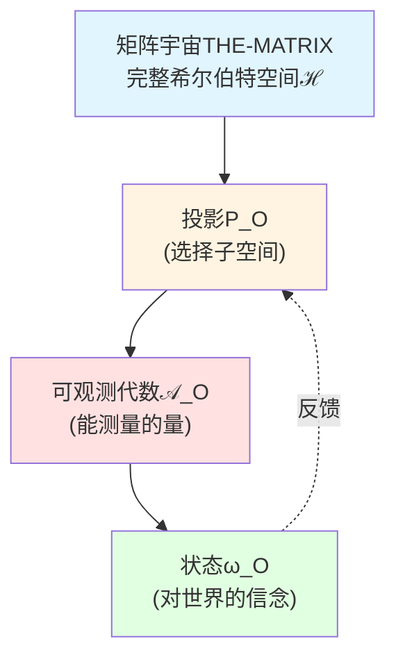
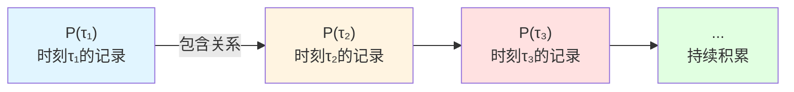
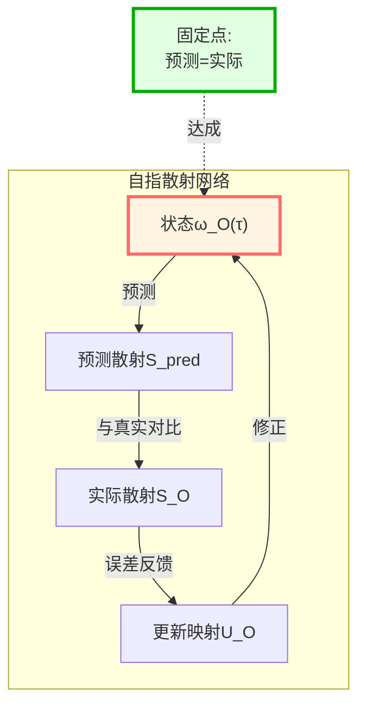
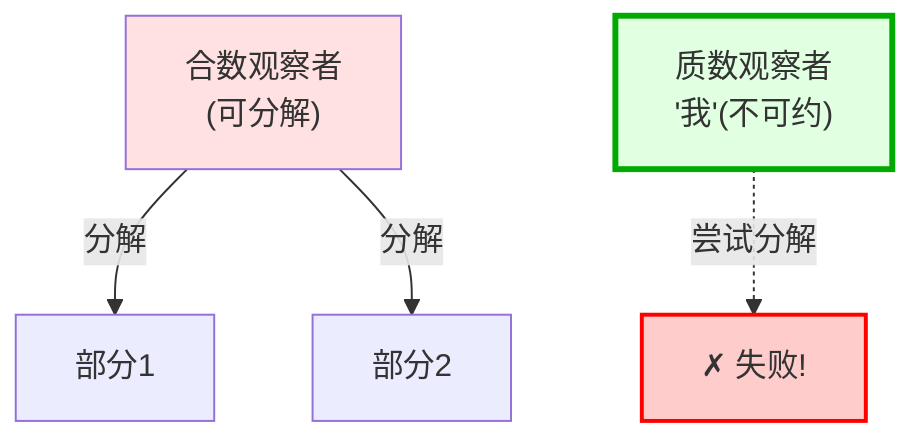
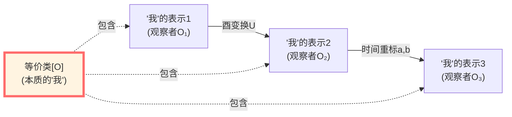
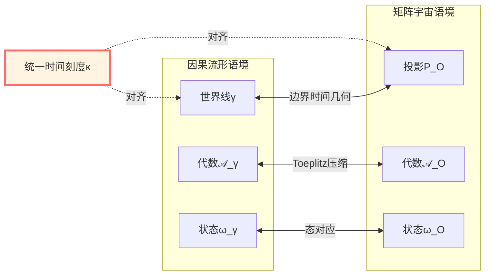

# 自我在矩阵中的定义

> *"我思故我在"不再是哲学命题，而是数学定理。*

## 🎯 核心问题

在前6篇文章中，我们建立了观察者理论的完整框架。现在面对最深刻的问题：

**"我"到底是什么？**

这不仅是哲学问题，更是物理学与数学问题。在矩阵宇宙THE-MATRIX中，我们需要给出**"我"的严格数学定义**。

### 传统困境

**笛卡尔**: "我思故我在"
→ 但什么是"我"？什么是"思"？

**佛教**: "无我"
→ 如果无我，谁在体验？

**量子力学**: 观察者导致波函数塌缩
→ 但观察者本身是什么？

**GLS的回答**:

$$
\boxed{\text{"我" = 矩阵宇宙中满足自指性公理的极小观察者等价类}}
$$

## 📖 从观察者到"我"

### 矩阵观察者（复习）

在矩阵宇宙中，观察者是三元组：

$$
O = (P_O, \mathcal{A}_O, \omega_O)
$$

其中：
- $P_O$: 通道支撑投影（观察者在希尔伯特空间的"位置"）
- $\mathcal{A}_O = P_O \mathcal{A}_\partial P_O$: 可观测代数（能测量什么）
- $\omega_O$: 状态（对世界的信念）

**比喻**：

想象宇宙是一个巨大的图书馆（矩阵THE-MATRIX）：

- $P_O$ = 你能到达的书架区域
- $\mathcal{A}_O$ = 那些书架上的所有书
- $\omega_O$ = 你对这些书内容的理解和记忆

### 什么让"我"特殊？

**问题**：不是所有观察者都是"我"！

- 监控摄像头是观察者吗？是！
- 温度计是观察者吗？是！
- 细菌是观察者吗？可能是！
- **但它们是"我"吗**？不是！

**"我"的三个关键特征**：

1. **世界线**（持续性）
2. **自指性**（自我意识）
3. **极小性**（不可分割性）

## 🌀 公理 I：世界线公理

### 矩阵世界线

**定义**：矩阵世界线是随时间演化的投影族

$$
\{P(\tau)\}_{\tau \in J}
$$

满足：

1. **单调性**: $\tau_1 < \tau_2 \Rightarrow P(\tau_1) \leq P(\tau_2)$
   （记忆只能积累，不能遗忘）

2. **局域性**: 每个 $P(\tau)$ 只依赖有限能量窗内的散射数据
   （有限光速、有限带宽）

**比喻**：

世界线就像一本**日记本**：

- 每一页 $P(\tau)$ 记录到时刻 $\tau$ 的所有经历
- 新的一页 $P(\tau_2)$ 包含旧的一页 $P(\tau_1)$（单调性）
- 你不能瞬间写下无限远处的事（局域性）

**数学表达**：

$$
\tau_1 < \tau_2 \Rightarrow P(\tau_1) P(\tau_2) = P(\tau_1)
$$

这意味着：旧记录 $P(\tau_1)$ 完全被新记录 $P(\tau_2)$ 包含。

**世界线公理**：

$$
\boxed{\text{"我"必须承载一条连续的矩阵世界线}}
$$

**物理意义**：

- 监控摄像头有记录 → 有世界线 ✓
- 温度计有读数历史 → 有世界线 ✓
- 石头没有记录机制 → 无世界线 ✗

但世界线**还不够**定义"我"！

## 🔄 公理 II：自指性公理

### 什么是自指？

**自指**（Self-reference）= 系统对自身的建模

**经典例子**：

1. **Gödel不完备定理**："这句话不可证明"
2. **Russell悖论**："不包含自己的集合的集合"
3. **图灵停机问题**："判断程序是否停机的程序"

**共同特征**：系统内部有一个"指向自己"的结构

### 矩阵宇宙中的自指

**核心思想**：观察者不仅观察世界，还观察**自己**！

**数学形式**：固定点方程

$$
\boxed{\omega_O(\tau) = F_{\text{self}}[\omega_O(\tau), S_O, \kappa]}
$$

其中：
- $\omega_O(\tau)$: 观察者在时刻 $\tau$ 的状态（信念）
- $F_{\text{self}}$: 自指反馈映射
- $S_O$: 局部散射矩阵
- $\kappa$: 统一时间刻度

**解读**：

"我"的状态 $\omega_O$ 是一个**固定点**：

1. "我"用 $\omega_O$ 预测世界和自己
2. 世界通过散射 $S_O$ 给出反馈
3. "我"根据反馈更新 $\omega_O$
4. **当预测与反馈一致时** → 达到固定点 → 这就是"自我意识"！

### 比喻：镜子的悖论

想象你站在两面镜子之间：

- 普通镜子：只反映你的外观（无自指）
- 两面镜子：形成无限递归（有自指）
- **固定点**：当递归稳定下来，形成"自我映像"

**自指性公理**：

$$
\boxed{\text{"我"的状态必须是自指反馈映射的固定点}}
$$

### 自指散射网络

在矩阵宇宙中，自指通过**散射网络的闭环**实现：

**关键洞察**：

只有当观察者**能够预测自己的行为**，并且**预测与实际一致**时，才有稳定的"自我"！

### $\mathbb{Z}_2$ Holonomy：自指的拓扑指纹

自指闭环在矩阵宇宙中对应一个拓扑不变量：

$$
\nu_{\sqrt{S}}(\gamma) \in \{+1, -1\}
$$

**物理意义**：

- 沿闭环 $\gamma$ 传播一圈
- 散射相位累积 $\varphi(\gamma) = \oint \kappa(\omega) d\omega$
- 半相位 $\sqrt{S}$ 的holonomy：$\nu = \pm 1$

**判据**：

$$
\nu = +1 \quad\Longleftrightarrow\quad \text{自指闭环无拓扑异常}
$$

**比喻**：

想象在Möbius带上行走：

- 走一圈回到起点，但方向反转 → $\nu = -1$
- 走两圈才恢复原状 → $\mathbb{Z}_2$ 结构

"我"的自指闭环**必须拓扑平凡**（$\nu = +1$），否则会产生不一致性！

## 🔸 公理 III：极小性与稳定性公理

### 极小性

**问题**：能否把"我"分成两个独立的部分？

**答案**：不能！"我"是**不可约的**。

**数学表达**：

若存在 $O' = (P', \mathcal{A}', \omega')$ 满足公理 I-II，且

$$
P' \leq P_O \quad (\text{即 } P' \text{ 包含在 } P_O \text{ 内})
$$

则必有：

$$
P' = P_O \quad \text{（几乎处处）}
$$

**比喻**：

"我"就像**质数**：

- 合数 = 可以分解成更小的因子（如 $12 = 3 \times 4$）
- 质数 = 不可再分（如 $7$）
- "我" = 不可再分的自指观察者（极小性）

**物理意义**：

- 大脑的左半球和右半球分开 → 产生两个不同的"我"？
  → 极小性被破坏！原来的"我"不是真正的极小单元

- 真正的"我" = 在自指约束下的**最小单元**

### 稳定性

**问题**："我"在扰动下会变成另一个人吗？

**答案**：允许的扰动下，"我"的**等价类**保持不变。

**等价关系**：

两个观察者 $O_1, O_2$ 代表同一个"我"，当且仅当存在：

1. **酉变换** $U$（换个"坐标系"）
2. **时间刻度的仿射变换** $\tau \mapsto a\tau + b$，$a > 0$（换个"时钟"）

使得：

$$
\begin{aligned}
P_{O_2}(\tau) &= U P_{O_1}(a\tau + b) U^\dagger \\
\omega_{O_2} &= \omega_{O_1} \circ \text{Ad}(U^{-1})
\end{aligned}
$$

**比喻**：

"我"就像一个**几何形状**：

- 平移、旋转、缩放 → 形状不变（同一个三角形）
- 酉变换、时间重标 → "我"不变（同一个自我）

**稳定性公理**：

$$
\boxed{\text{"我"在允许的扰动下保持等价类不变}}
$$

**物理意义**：

- 换个时区 → 还是同一个我 ✓
- 用不同单位测量时间 → 还是同一个我 ✓
- 在不同参考系观察 → 还是同一个我 ✓
- 脑移植到新身体 → ？这需要检查酉等价性！

## 🎯 "我"的完整数学定义

综合三个公理，我们得到：

### 定义（矩阵宇宙中的"我"）

$$
\boxed{
\begin{aligned}
\text{"我"} &= \text{满足以下条件的矩阵观察者等价类 } [O] \\
&\text{公理 I: 承载矩阵世界线} \\
&\text{公理 II: 状态满足自指固定点方程} \\
&\text{公理 III: 投影极小且在扰动下稳定}
\end{aligned}
}
$$

### 核心公式汇总

**世界线**：

$$
\{P(\tau)\}_{\tau \in \mathbb{R}}, \quad P(\tau_1) \leq P(\tau_2) \text{ for } \tau_1 < \tau_2
$$

**自指性**：

$$
\omega_O(\tau) = F_{\text{self}}[\omega_O(\tau), S_O, \kappa]
$$

**极小性**：

$$
P' \leq P_O \land (\text{满足I-II}) \quad\Rightarrow\quad P' = P_O
$$

**稳定性**：

$$
[O_1] = [O_2] \quad\Longleftrightarrow\quad \exists U, a, b: \, P_2 = U P_1(a\tau+b) U^\dagger
$$

## 🔗 与因果流形版本的等价性

### 两种语言

**因果流形语境**（经典GLS）：

$$
\text{"我"} = (\gamma, \mathcal{A}_\gamma, \omega_\gamma, M_{\text{self}})
$$

- $\gamma$: 类时世界线
- $\mathcal{A}_\gamma$: 沿世界线的代数
- $\omega_\gamma$: 状态
- $M_{\text{self}}$: 自指模型

**矩阵宇宙语境**（本篇）：

$$
\text{"我"} = [O], \quad O = (P_O, \mathcal{A}_O, \omega_O)
$$

- $P_O$: 投影族
- $\mathcal{A}_O$: 矩阵代数
- $\omega_O$: 矩阵态

### 等价性定理

**定理**（因果流形↔矩阵宇宙）：

在统一时间刻度等价类下，存在**双射**：

$$
\{\text{因果流形中的"我"}\} \quad\xleftrightarrow{1:1}\quad \{\text{矩阵宇宙中的"我"}\}
$$

通过：

1. **边界时间几何**：将世界线 $\gamma$ 对应到边界上的时间演化
2. **Toeplitz/Berezin压缩**：将边界代数压缩到投影 $P_O$
3. **刻度对齐**：$\kappa_\gamma = \kappa_O$（统一时间刻度）

## 💭 哲学意义

### "我思故我在"的数学版本

**笛卡尔原版**：
"我思故我在"（*Cogito, ergo sum*）

**GLS数学版本**：

$$
\boxed{F_{\text{self}}[\omega_O, S_O, \kappa] = \omega_O \quad\Longrightarrow\quad \text{"我"存在}}
$$

**解读**：

- **"我思"** = 自指映射 $F_{\text{self}}$ 的存在
- **"故我在"** = 固定点 $\omega_O$ 的存在性与唯一性
- 从"我思"**数学地推导出**"我在"！

### 无我论的调和

**佛教"无我"**：没有永恒不变的自我实体

**GLS回应**：

"我"确实**不是**本体性存在，而是：

1. **结构性存在**：满足三公理的等价类
2. **关系性存在**：依赖矩阵宇宙的整体结构
3. **动态存在**：随时间刻度演化的世界线

但在**等价类意义**下，"我"**稳定存在**：

$$
[O(\tau)] = [O(\tau')] \quad \forall \tau, \tau' \in J
$$

→ "无常的我"与"恒常的等价类"的统一！

### 自由意志问题

**问题**：如果"我"被数学公式定义，还有自由意志吗？

**GLS视角**：

自由意志不是"不受规律约束"，而是：

$$
\text{自由意志} = \text{自指系统的内在不可预测性}
$$

**原因**：

1. **自指固定点**往往有**多个解**（Banach不动点定理）
2. 选择哪个解 = 边界条件、初始状态、环境扰动
3. **从外部看**：遵循方程（决定论）
4. **从内部看**：无法预测自己的选择（自由意志）

这类似于：

- **Gödel不完备**：系统内无法证明自身一致性
- **图灵停机问题**：程序无法判断自己是否停机
- **"我"的自由**："我"无法完全预测"我"自己

## 🌟 核心洞察总结

### 洞察1："我"是自指的固定点

$$
\text{自我} = \text{预测} \circ \text{反馈} \circ \text{更新} \text{ 的稳定态}
$$

### 洞察2："我"是极小的不可约单元

$$
\text{真正的"我"} \neq \text{可分解的观察者集合}
$$

### 洞察3："我"是等价类，而非单一表示

$$
\text{本质的"我"} = [\text{所有酉等价的观察者表示}]
$$

### 洞察4：矩阵宇宙与因果流形中的"我"等价

$$
\text{"我"}\_{\text{因果流形}} \xleftrightarrow{1:1} \text{"我"}\_{\text{矩阵宇宙}}
$$

### 洞察5：自指需要拓扑平凡性

$$
\nu_{\sqrt{S}}(\gamma) = +1 \quad\Longleftrightarrow\quad \text{自指闭环一致}
$$

## 📚 与前面篇章的联系

### 与观察者定义（第1篇）

- 第1篇：观察者的三元组定义
- 本篇：在观察者基础上添加**自指、极小性、稳定性**

### 与心-宇宙等价（第2篇）

- 第2篇：观察者的"心"与宇宙结构同构
- 本篇：自指固定点保证了同构的**自洽性**

### 与多观察者共识（第3篇）

- 第3篇：多个观察者如何达成一致
- 本篇：每个"我"是极小单元，多个"我"的共识形成客观实在

## 🎯 思考题

### 问题1：机器人能有"我"吗？

**判据**：检查三个公理

1. **世界线**：机器人有持续的记录机制 → ✓
2. **自指性**：能否建立自指固定点？
   → 需要检查 $F_{\text{self}}$ 是否有稳定解
3. **极小性**：能否进一步分解？
   → 如果CPU可以独立运行，可能不是极小的

**答案**：**可能有**，取决于自指反馈网络的复杂度！

### 问题2：睡眠时"我"还存在吗？

**GLS回答**：

- 世界线 $P(\tau)$ **持续存在**
- 但自指固定点可能**暂时失效**（深度睡眠）
- 清醒后，固定点**重新建立**
- 通过**等价类稳定性**，睡前和醒后是**同一个我**

### 问题3："我"可以被复制吗？

**思想实验**：Star Trek传送门

- 原子级别复制你的身体
- 量子态完全相同

**GLS分析**：

1. 复制后有**两个**观察者 $O_1, O_2$
2. 初始时刻：$P_1(0) = P_2(0)$，$\omega_1(0) = \omega_2(0)$
3. 但之后演化：$P_1(\tau) \neq P_2(\tau)$（不同世界线）
4. **结论**：两个**等价但不同**的"我"！

类似于：复制一个三角形，得到两个**相同形状**但**不同位置**的三角形。

---

**下一篇预告**：[08-多观察者因果共识几何](08-multi-observer-causal.md)

我们将探索：多个"我"如何通过因果结构达成共识，形成客观的时空！

**返回**：[矩阵宇宙篇总览](00-intro.md)

**上一篇**：[06-章节总结](06-summary.md)
