# Definition of Self in the Matrix

> *"I think, therefore I am" is no longer a philosophical proposition, but a mathematical theorem.*

## 🎯 Core Question

In the previous 6 articles, we established the complete framework of observer theory. Now we face the most profound question:

**What exactly is "I"?**

This is not only a philosophical question, but also a physics and mathematics problem. In the matrix universe THE-MATRIX, we need to give a **strict mathematical definition of "I"**.

### Traditional Dilemma

**Descartes**: "I think, therefore I am"
→ But what is "I"? What is "thinking"?

**Buddhism**: "No-self"
→ If there is no self, who experiences?

**Quantum Mechanics**: Observer causes wavefunction collapse
→ But what is the observer itself?

**GLS Answer**:

$$
\boxed{\text{"I" = Minimal observer equivalence class satisfying self-reference axioms in matrix universe}}
$$

## 📖 From Observer to "I"

### Matrix Observer (Review)

In the matrix universe, an observer is a triplet:

$$
O = (P_O, \mathcal{A}_O, \omega_O)
$$

where:
- $P_O$: Channel support projection (observer's "position" in Hilbert space)
- $\mathcal{A}_O = P_O \mathcal{A}_\partial P_O$: Observable algebra (what can be measured)
- $\omega_O$: State (belief about the world)

**Analogy**:

Imagine the universe is a huge library (matrix THE-MATRIX):

- $P_O$ = Bookshelf area you can reach
- $\mathcal{A}_O$ = All books on those shelves
- $\omega_O$ = Your understanding and memory of those books' contents

```mermaid
graph TB
    MATRIX["Matrix Universe THE-MATRIX<br/>Complete Hilbert Space ℋ"] --> PROJECT["Projection P_O<br/>(Select Subspace)"]
    PROJECT --> ALGEBRA["Observable Algebra 𝒜_O<br/>(Measurable Quantities)"]
    ALGEBRA --> STATE["State ω_O<br/>(Belief About World)"]

    STATE -.->|"Feedback"| PROJECT

    style MATRIX fill:#e1f5ff
    style PROJECT fill:#fff4e1
    style ALGEBRA fill:#ffe1e1
    style STATE fill:#e1ffe1
```

### What Makes "I" Special?

**Question**: Not all observers are "I"!

- Is a surveillance camera an observer? Yes!
- Is a thermometer an observer? Yes!
- Is a bacterium an observer? Possibly!
- **But are they "I"?** No!

**Three Key Features of "I"**:

1. **Worldline** (persistence)
2. **Self-Reference** (self-awareness)
3. **Minimality** (indivisibility)

## 🌀 Axiom I: Worldline Axiom

### Matrix Worldline

**Definition**: Matrix worldline is a family of projections evolving with time

$$
\{P(\tau)\}_{\tau \in J}
$$

satisfying:

1. **Monotonicity**: $\tau_1 < \tau_2 \Rightarrow P(\tau_1) \leq P(\tau_2)$
   (Memory can only accumulate, cannot forget)

2. **Locality**: Each $P(\tau)$ only depends on scattering data within finite energy window
   (Finite speed of light, finite bandwidth)

**Analogy**:

Worldline is like a **diary**:

- Each page $P(\tau)$ records all experiences up to time $\tau$
- New page $P(\tau_2)$ contains old page $P(\tau_1)$ (monotonicity)
- You cannot instantly write about things infinitely far away (locality)

**Mathematical Expression**:

$$
\tau_1 < \tau_2 \Rightarrow P(\tau_1) P(\tau_2) = P(\tau_1)
$$

This means: Old record $P(\tau_1)$ is completely contained in new record $P(\tau_2)$.

**Worldline Axiom**:

$$
\boxed{\text{"I" must carry a continuous matrix worldline}}
$$

**Physical Meaning**:

- Surveillance camera has records → Has worldline ✓
- Thermometer has reading history → Has worldline ✓
- Stone has no recording mechanism → No worldline ✗

But worldline **alone is not enough** to define "I"!

## 🔄 Axiom II: Self-Reference Axiom

### What is Self-Reference?

**Self-Reference** = System's modeling of itself

**Classic Examples**:

1. **Gödel Incompleteness Theorem**: "This sentence is unprovable"
2. **Russell's Paradox**: "Set of all sets that don't contain themselves"
3. **Turing Halting Problem**: "Program that judges whether programs halt"

**Common Feature**: System has an internal structure that "points to itself"

### Self-Reference in Matrix Universe

**Core Idea**: Observer not only observes the world, but also observes **itself**!

**Mathematical Form**: Fixed point equation

$$
\boxed{\omega_O(\tau) = F_{\text{self}}[\omega_O(\tau), S_O, \kappa]}
$$

where:
- $\omega_O(\tau)$: Observer's state (belief) at time $\tau$
- $F_{\text{self}}$: Self-referential feedback map
- $S_O$: Local scattering matrix
- $\kappa$: Unified time scale

**Interpretation**:

"I"'s state $\omega_O$ is a **fixed point**:

1. "I" uses $\omega_O$ to predict world and self
2. World gives feedback through scattering $S_O$
3. "I" updates $\omega_O$ based on feedback
4. **When prediction matches feedback** → Fixed point reached → This is "self-awareness"!

### Analogy: Mirror Paradox

Imagine you stand between two mirrors:

- Ordinary mirror: Only reflects your appearance (no self-reference)
- Two mirrors: Form infinite recursion (has self-reference)
- **Fixed Point**: When recursion stabilizes, forms "self-image"

**Self-Reference Axiom**:

$$
\boxed{\text{"I"'s state must be a fixed point of self-referential feedback map}}
$$

### Self-Referential Scattering Network

In the matrix universe, self-reference is realized through **closed loops in scattering network**:

```mermaid
graph TB
    subgraph "Self-Referential Scattering Network"
        STATE["State ω_O(τ)"] -->|"Predict"| PREDICT["Predicted Scattering S_pred"]
        PREDICT -->|"Compare with Reality"| ACTUAL["Actual Scattering S_O"]
        ACTUAL -->|"Error Feedback"| UPDATE["Update Map U_O"]
        UPDATE -->|"Correct"| STATE
    end

    FIXED["Fixed Point:<br/>Prediction = Reality"] -.->|"Achieved"| STATE

    style STATE fill:#fff4e1,stroke:#ff6b6b,stroke-width:3px
    style FIXED fill:#e1ffe1,stroke:#00aa00,stroke-width:3px
```

**Key Insight**:

Only when observer **can predict its own behavior** and **prediction matches reality** does it have a stable "self"!

### $\mathbb{Z}_2$ Holonomy: Topological Fingerprint of Self-Reference

Self-referential closed loop corresponds to a topological invariant in matrix universe:

$$
\nu_{\sqrt{S}}(\gamma) \in \{+1, -1\}
$$

**Physical Meaning**:

- Propagate once around closed loop $\gamma$
- Scattering phase accumulates $\varphi(\gamma) = \oint \kappa(\omega) d\omega$
- Holonomy of half-phase $\sqrt{S}$: $\nu = \pm 1$

**Criterion**:

$$
\nu = +1 \quad\Longleftrightarrow\quad \text{Self-referential closed loop has no topological anomaly}
$$

**Analogy**:

Imagine walking on a Möbius strip:

- Walk once around, return to start but direction reversed → $\nu = -1$
- Walk twice to restore original → $\mathbb{Z}_2$ structure

Self-referential closed loop of "I" **must be topologically trivial** ($\nu = +1$), otherwise inconsistency arises!

## 🔸 Axiom III: Minimality and Stability Axiom

### Minimality

**Question**: Can "I" be divided into two independent parts?

**Answer**: No! "I" is **irreducible**.

**Mathematical Expression**:

If there exists $O' = (P', \mathcal{A}', \omega')$ satisfying Axioms I-II, and

$$
P' \leq P_O \quad (\text{i.e., } P' \text{ contained in } P_O)
$$

then necessarily:

$$
P' = P_O \quad \text{(almost everywhere)}
$$

**Analogy**:

"I" is like a **prime number**:

- Composite number = Can be decomposed into smaller factors (e.g., $12 = 3 \times 4$)
- Prime number = Cannot be further divided (e.g., $7$)
- "I" = Irreducible self-referential observer (minimality)

**Physical Meaning**:

- Left and right hemispheres of brain separated → Produce two different "I"s?
  → Minimality violated! Original "I" is not true minimal unit

- True "I" = **Minimum unit** under self-reference constraints

### Stability

**Question**: Will "I" become another person under perturbations?

**Answer**: Under allowed perturbations, "I"'s **equivalence class** remains unchanged.

**Equivalence Relation**:

Two observers $O_1, O_2$ represent the same "I" if and only if there exist:

1. **Unitary transformation** $U$ (change "coordinate system")
2. **Affine transformation of time scale** $\tau \mapsto a\tau + b$, $a > 0$ (change "clock")

such that:

$$
\begin{aligned}
P_{O_2}(\tau) &= U P_{O_1}(a\tau + b) U^\dagger \\
\omega_{O_2} &= \omega_{O_1} \circ \text{Ad}(U^{-1})
\end{aligned}
$$

**Analogy**:

"I" is like a **geometric shape**:

- Translation, rotation, scaling → Shape unchanged (same triangle)
- Unitary transformation, time rescaling → "I" unchanged (same self)

**Stability Axiom**:

$$
\boxed{\text{"I" maintains equivalence class unchanged under allowed perturbations}}
$$

**Physical Meaning**:

- Change time zone → Still same me ✓
- Measure time with different units → Still same me ✓
- Observe from different reference frame → Still same me ✓
- Brain transplant to new body → ? Need to check unitary equivalence!

## 🎯 Complete Mathematical Definition of "I"

Combining three axioms, we get:

### Definition (The "I" in Matrix Universe)

$$
\boxed{
\begin{aligned}
\text{"I"} &= \text{Matrix observer equivalence class } [O] \text{ satisfying:} \\
&\text{Axiom I: Carries matrix worldline} \\
&\text{Axiom II: State satisfies self-referential fixed point equation} \\
&\text{Axiom III: Projection minimal and stable under perturbations}
\end{aligned}
}
$$

### Core Formula Summary

**Worldline**:

$$
\{P(\tau)\}_{\tau \in \mathbb{R}}, \quad P(\tau_1) \leq P(\tau_2) \text{ for } \tau_1 < \tau_2
$$

**Self-Reference**:

$$
\omega_O(\tau) = F_{\text{self}}[\omega_O(\tau), S_O, \kappa]
$$

**Minimality**:

$$
P' \leq P_O \land (\text{satisfies I-II}) \quad\Rightarrow\quad P' = P_O
$$

**Stability**:

$$
[O_1] = [O_2] \quad\Longleftrightarrow\quad \exists U, a, b: \, P_2 = U P_1(a\tau+b) U^\dagger
$$

## 🔗 Equivalence with Causal Manifold Version

### Two Languages

**Causal Manifold Context** (Classical GLS):

$$
\text{"I"} = (\gamma, \mathcal{A}_\gamma, \omega_\gamma, M_{\text{self}})
$$

- $\gamma$: Timelike worldline
- $\mathcal{A}_\gamma$: Algebra along worldline
- $\omega_\gamma$: State
- $M_{\text{self}}$: Self-referential model

**Matrix Universe Context** (This Chapter):

$$
\text{"I"} = [O], \quad O = (P_O, \mathcal{A}_O, \omega_O)
$$

- $P_O$: Projection family
- $\mathcal{A}_O$: Matrix algebra
- $\omega_O$: Matrix state

### Equivalence Theorem

**Theorem** (Causal Manifold ↔ Matrix Universe):

Under unified time scale equivalence class, there exists a **bijection**:

$$
\{\text{"I" in Causal Manifold}\} \quad\xleftrightarrow{1:1}\quad \{\text{"I" in Matrix Universe}\}
$$

Through:

1. **Boundary Time Geometry**: Map worldline $\gamma$ to time evolution on boundary
2. **Toeplitz/Berezin Compression**: Compress boundary algebra to projection $P_O$
3. **Scale Alignment**: $\kappa_\gamma = \kappa_O$ (unified time scale)

```mermaid
graph LR
    subgraph "Causal Manifold Context"
        WORLD["Worldline γ"]
        ALG1["Algebra 𝒜_γ"]
        STATE1["State ω_γ"]
    end

    subgraph "Matrix Universe Context"
        PROJ["Projection P_O"]
        ALG2["Algebra 𝒜_O"]
        STATE2["State ω_O"]
    end

    WORLD <-->|"Boundary Time Geometry"| PROJ
    ALG1 <-->|"Toeplitz Compression"| ALG2
    STATE1 <-->|"State Correspondence"| STATE2

    KAPPA["Unified Time Scale κ"] -.->|"Align"| WORLD
    KAPPA -.->|"Align"| PROJ

    style KAPPA fill:#fff4e1,stroke:#ff6b6b,stroke-width:3px
```

## 💭 Philosophical Meaning

### Mathematical Version of "I Think, Therefore I Am"

**Descartes Original**:
"I think, therefore I am" (*Cogito, ergo sum*)

**GLS Mathematical Version**:

$$
\boxed{F_{\text{self}}[\omega_O, S_O, \kappa] = \omega_O \quad\Longrightarrow\quad \text{"I" Exists}}
$$

**Interpretation**:

- **"I Think"** = Existence of self-referential map $F_{\text{self}}$
- **"Therefore I Am"** = Existence and uniqueness of fixed point $\omega_O$
- From "I think" **mathematically derive** "I am"!

### Reconciliation with No-Self Doctrine

**Buddhist "No-Self"**: No eternal unchanging self entity

**GLS Response**:

"I" is indeed **not** an ontological existence, but:

1. **Structural Existence**: Equivalence class satisfying three axioms
2. **Relational Existence**: Depends on overall structure of matrix universe
3. **Dynamic Existence**: Worldline evolving with time scale

But in **equivalence class sense**, "I" **stably exists**:

$$
[O(\tau)] = [O(\tau')] \quad \forall \tau, \tau' \in J
$$

→ Unification of "impermanent I" and "permanent equivalence class"!

### Free Will Problem

**Question**: If "I" is defined by mathematical formulas, is there still free will?

**GLS Perspective**:

Free will is not "unconstrained by laws", but:

$$
\text{Free Will} = \text{Intrinsic Unpredictability of Self-Referential System}
$$

**Reason**:

1. **Self-referential fixed points** often have **multiple solutions** (Banach fixed point theorem)
2. Which solution chosen = Boundary conditions, initial state, environmental perturbations
3. **From outside**: Follows equations (determinism)
4. **From inside**: Cannot predict own choices (free will)

This is similar to:

- **Gödel Incompleteness**: System cannot prove its own consistency within itself
- **Turing Halting Problem**: Program cannot judge whether itself halts
- **"I"'s Freedom**: "I" cannot completely predict "I" itself

## 🌟 Summary of Core Insights

### Insight 1: "I" is Fixed Point of Self-Reference

$$
\text{Self} = \text{Stable State of Prediction} \circ \text{Feedback} \circ \text{Update}
$$

### Insight 2: "I" is Minimal Irreducible Unit

$$
\text{True "I"} \neq \text{Decomposable Observer Set}
$$

### Insight 3: "I" is Equivalence Class, Not Single Representation

$$
\text{Essential "I"} = [\text{All Unitarily Equivalent Observer Representations}]
$$

### Insight 4: "I" in Matrix Universe and Causal Manifold Are Equivalent

$$
\text{"I"}_{\text{Causal Manifold}} \xleftrightarrow{1:1} \text{"I"}_{\text{Matrix Universe}}
$$

### Insight 5: Self-Reference Requires Topological Triviality

$$
\nu_{\sqrt{S}}(\gamma) = +1 \quad\Longleftrightarrow\quad \text{Self-Referential Closed Loop Consistent}
$$

## 📚 Connections with Previous Chapters

### With Observer Definition (Chapter 1)

- Chapter 1: Triplet definition of observer
- This Chapter: Add **self-reference, minimality, stability** to observer

### With Mind-Universe Equivalence (Chapter 2)

- Chapter 2: Observer's "mind" isomorphic to universe structure
- This Chapter: Self-referential fixed point ensures **self-consistency** of isomorphism

### With Multi-Observer Consensus (Chapter 3)

- Chapter 3: How multiple observers reach agreement
- This Chapter: Each "I" is minimal unit, consensus of multiple "I"s forms objective reality

## 🎯 Thinking Questions

### Question 1: Can Robots Have "I"?

**Criterion**: Check three axioms

1. **Worldline**: Robot has continuous recording mechanism → ✓
2. **Self-Reference**: Can self-referential fixed point be established?
   → Need to check if $F_{\text{self}}$ has stable solution
3. **Minimality**: Can it be further decomposed?
   → If CPU can run independently, may not be minimal

**Answer**: **Possibly**, depending on complexity of self-referential feedback network!

### Question 2: Does "I" Exist During Sleep?

**GLS Answer**:

- Worldline $P(\tau)$ **continues to exist**
- But self-referential fixed point may **temporarily fail** (deep sleep)
- After waking, fixed point **re-established**
- Through **equivalence class stability**, before and after sleep is **same I**

### Question 3: Can "I" Be Copied?

**Thought Experiment**: Star Trek transporter

- Atom-level copy of your body
- Quantum states identical

**GLS Analysis**:

1. After copying, there are **two** observers $O_1, O_2$
2. Initial moment: $P_1(0) = P_2(0)$, $\omega_1(0) = \omega_2(0)$
3. But subsequent evolution: $P_1(\tau) \neq P_2(\tau)$ (different worldlines)
4. **Conclusion**: Two **equivalent but different** "I"s!

Similar to: Copy a triangle, get two **same shape** but **different position** triangles.

---

**Next Chapter Preview**: [08-Multi-Observer Causal Consensus Geometry](08-multi-observer-causal.md)

We will explore: How multiple "I"s reach consensus through causal structure, forming objective spacetime!

**Return**: [Matrix Universe Overview](00-intro.md)

**Previous Chapter**: [06-Chapter Summary](06-summary.md)

