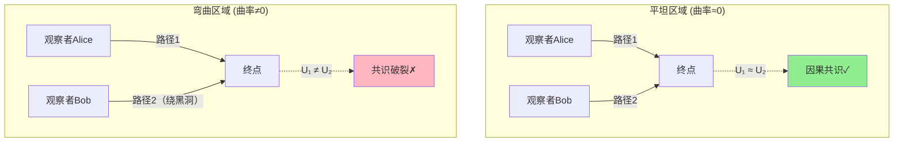
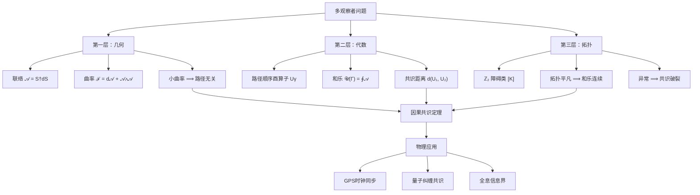

# 第8篇：多观察者因果共识几何

## 1. 从"我"到"我们"

上一篇我们定义了矩阵宇宙中的"我"——通过三个公理（世界线、自指、极小性）刻画的观察者等价类。但宇宙中不止一个"我"。

**核心问题**：多个观察者如何就同一现实达成共识？

这不是哲学思辨，而是精确的数学问题：

- 你看到的"红色"和我看到的"红色"是同一个吗？
- 两个观察者分别测量同一事件，如何保证结果一致？
- GPS卫星网络如何协调时间，确保定位精确到米级？

在GLS理论中，**因果共识**是矩阵宇宙的核心性质。本篇将揭示：

> **因果共识 = 一个巨大的矩阵计算的自洽性**

## 2. 问题的难度：为什么共识不是显然的

### 2.1 路径依赖问题

想象两个观察者Alice和Bob：

- 都从地球出发
- 都到达火星
- 但Alice直飞，Bob绕道木星

他们经历的散射矩阵链条不同：

$$
U_{\text{Alice}} = S_{\text{火星}} \cdot S_{\text{途中1}} \cdot \cdots \cdot S_{\text{地球}}
$$

$$
U_{\text{Bob}} = S_{\text{火星}} \cdot S_{\text{木星}} \cdot \cdots \cdot S_{\text{地球}}
$$

**问题**：$U_{\text{Alice}}$ 和 $U_{\text{Bob}}$ 相等吗？

如果不相等，他们对"从地球到火星发生了什么"会有不同的理解——**因果共识破裂**。

### 2.2 经典物理的答案：时空是平直的

在经典力学中，时空像一张平坦的白纸：

- 路径可以不同
- 但只要起点终点相同，所有观察者的体验等价
- 这是**平直时空的交换性**：矩阵乘法的顺序不重要

但在弯曲时空或量子环境中，这一性质不再显然。

### 2.3 GLS的回答：平坦性 ≈ 因果共识

在矩阵宇宙框架中：

| 经典概念 | 矩阵宇宙对应 | 因果意义 |
|---------|------------|---------|
| 时空平直 | 联络曲率 $\mathcal{F} \approx 0$ | 路径无关性 |
| 闭合回路零面积 | $\mathrm{Area}(\Gamma) \to 0$ | 局部一致性 |
| 拓扑平凡 | $\mathbb{Z}_2$ 和乐 $= +1$ | 无全局异常 |

**因果共识定理**（非正式）：

$$
\text{曲率小} + \text{闭合回路面积有界} + \text{拓扑平凡} \implies \text{路径等价}
$$

精确版本见**定理3.3**。

## 3. 数学框架：观察者路径与联络

### 3.1 观察者作为路径

一个观察者在矩阵宇宙中的体验，用一条路径表示：

$$
\gamma: [0,1] \to M
$$

其中 $M$ 是时空流形，$\gamma(t)$ 是观察者在"时刻" $t$ 的位置。

但在矩阵宇宙中，路径不仅在时空中移动，还在频率参数空间 $X^\circ$ 中移动：

$$
(\gamma(t), \chi(t)) \in M \times X^\circ
$$

- $\gamma(t)$：空间位置
- $\chi(t)$：观察的频谱/能量窗口

### 3.2 路径顺序酉算子

沿路径 $\gamma$，观察者累积的总体验由**路径顺序酉算子**刻画：

$$
U_\gamma(\omega) = \mathcal{P} \exp \int_\gamma \mathcal{A}(\omega; x, \chi)
$$

其中：

- $\mathcal{A}$：算子值联络一形式（上一篇定义的"引力 = 散射梯度"）
- $\mathcal{P}$：路径顺序算子，确保矩阵乘法按路径方向排列
- $\exp$：路径顺序指数（类比普通指数，但不可交换）

**物理意义**：

- $U_\gamma$ 是观察者沿 $\gamma$ 累积的所有局部散射矩阵的乘积
- 包含了观察者"看到"的所有因果信息

### 3.3 联络与曲率

联络 $\mathcal{A}$ 由局部散射矩阵定义：

$$
\mathcal{A}(\omega; x, \chi) = S(\omega; x, \chi)^\dagger \, \mathrm{d} S(\omega; x, \chi)
$$

其曲率二形式为：

$$
\mathcal{F} = \mathrm{d}\mathcal{A} + \mathcal{A} \wedge \mathcal{A}
$$

**几何意义**：

- $\mathcal{F} = 0$：联络平坦，路径无关
- $\mathcal{F} \neq 0$：存在曲率，不同路径产生不同体验

类比：

- 平直时空（欧氏空间）：平行移动一个矢量绕一圈回到原点，矢量方向不变
- 弯曲时空（球面）：平行移动一个矢量绕赤道一圈，方向会改变

曲率 $\mathcal{F}$ 衡量"矩阵宇宙的弯曲程度"。

## 4. 因果共识的量化定义

### 4.1 和乐（Holonomy）

考虑两条路径 $\gamma_1$ 和 $\gamma_2$，起点终点相同：

$$
\gamma_1(0) = \gamma_2(0), \quad \gamma_1(1) = \gamma_2(1)
$$

将 $\gamma_1$ 和 $\gamma_2$ 的逆拼接成闭合回路：

$$
\Gamma = \gamma_1 \circ \gamma_2^{-1}
$$

沿 $\Gamma$ 的和乐为：

$$
\mathcal{U}(\Gamma) = \mathcal{P} \exp \oint_\Gamma \mathcal{A}(\omega; x, \chi)
$$

**物理意义**：

- 如果 $\mathcal{U}(\Gamma) = \mathbb{I}$（单位算子），两条路径完全等价
- 如果 $\mathcal{U}(\Gamma) \neq \mathbb{I}$，存在路径差异，共识破裂

### 4.2 共识距离

定义两个酉算子的**规范不变距离**：

$$
d(U_{\gamma_1}(\omega), U_{\gamma_2}(\omega)) := \inf_{V \in \mathcal{U}(\mathcal{H})} \, |U_{\gamma_1}(\omega) - V U_{\gamma_2}(\omega) V^\dagger|
$$

其中 $V$ 是任意酉算子，对应"观察者选择不同参考系"的自由度。

**含义**：

- $d = 0$：两个观察者的体验在物理上等价（最多相差一个参考系变换）
- $d > 0$：存在不可消除的差异

### 4.3 因果共识定理（精确版）

**定理 3.3（强因果共识）**

设矩阵宇宙 $\mathfrak{U} = (M, \mathcal{H}, \mathcal{A})$ 满足：

1. **几何条件**：$\gamma_1, \gamma_2 \subset \Omega \subset M$，在 $\Omega$ 内同伦（可连续变形）
2. **曲率界**：$\|\mathcal{F}\|_{L^\infty(\Omega \times I)} \leq \delta$
3. **拓扑平凡**：$\mathbb{Z}_2$ 障碍类 $[K] = 0$

则存在常数 $C > 0$，使得对所有 $\omega \in I$：

$$
d(U_{\gamma_1}(\omega), U_{\gamma_2}(\omega)) \leq C \, \delta \, \mathrm{Area}(\Gamma)
$$

**推论**：当 $\delta \to 0$（曲率趋于零）且 $\mathrm{Area}(\Gamma)$ 有界时：

$$
U_{\gamma_1}(\omega) \sim U_{\gamma_2}(\omega)
$$

即：**在近似平坦的区域，同伦路径产生等价的观察者体验**。

## 5. 因果缺口（Causal Gap）：共识的量化偏差

### 5.1 什么是因果缺口

即使在理想条件下，真实物理系统也存在微小的"信息泄漏"或"记忆效应"，导致因果链条不完全马尔可夫。

**马尔可夫性**：未来只依赖现在，与过去无关：

$$
P(\text{未来}|\text{现在}, \text{过去}) = P(\text{未来}|\text{现在})
$$

**因果缺口**：偏离马尔可夫性的程度。

### 5.2 条件互信息

考虑三个相邻的因果菱形 $D_{j-1}, D_j, D_{j+1}$（嵌套的时空区域），定义：

$$
I(D_{j-1} : D_{j+1} \mid D_j) := S(D_{j-1}D_j) + S(D_jD_{j+1}) - S(D_j) - S(D_{j-1}D_jD_{j+1})
$$

其中 $S$ 是冯·诺依曼熵。

**意义**：

- $I = 0$：完美马尔可夫，$D_j$ 完全屏蔽 $D_{j-1}$ 和 $D_{j+1}$ 的关联
- $I > 0$：存在"越过 $D_j$ 的信息泄漏"，因果链条有"缺口"

### 5.3 因果缺口密度

将 $I$ 写成沿类空零边界的积分：

$$
I(D_{j-1} : D_{j+1} \mid D_j) = \iint \mathfrak{g}(v, x_\perp) \, \mathrm{d}v \, \mathrm{d}^{d-2}x_\perp
$$

其中 $\mathfrak{g}(v, x_\perp)$ 称为**因果缺口密度**。

**物理意义**：

- $\mathfrak{g}$ 大的地方：因果信息传递"有损耗"
- $\mathfrak{g}$ 小的地方：因果链条几乎完美

量子零能条件（QNEC）给出：

$$
\mathfrak{g}(v, x_\perp) \geq f(\text{应力张量}, \text{零测地线聚焦})
$$

因果缺口与时空几何紧密关联。

## 6. 实例：GPS与因果共识

### 6.1 问题设定

GPS系统由约30颗卫星组成，每颗卫星：

- 携带原子钟（观察者时钟）
- 广播信号（散射矩阵）
- 在不同轨道运动（不同路径）

地面接收器通过接收多颗卫星信号，计算自己的位置和时间。

**关键**：不同卫星的时钟必须**因果共识**——尽管它们走过不同路径。

### 6.2 GLS视角的分析

每颗卫星 $i$ 的路径：

$$
\gamma_i(t) \in M \quad (\text{时空中的轨道})
$$

卫星间的"时钟同步"对应：

$$
U_{\gamma_i}(\omega) \approx U_{\gamma_j}(\omega) \quad \forall i, j
$$

**为什么成立？**

1. **近似平坦**：地球附近时空曲率小（$\delta \sim 10^{-9}$）
2. **同伦路径**：卫星轨道可以连续变形到彼此（不绕黑洞）
3. **面积有界**：闭合回路 $\Gamma$ 的面积 $\sim 10^7 \, \text{m}^2$（地球尺度）

由定理3.3：

$$
d(U_{\gamma_i}, U_{\gamma_j}) \leq C \cdot 10^{-9} \cdot 10^7 \approx 10^{-2} \, \text{m}
$$

这与GPS的实际精度（~米级）一致！

### 6.3 广义相对论修正

卫星时钟比地面快约 $38 \, \mu\text{s}/\text{day}$（引力红移 + 狭义相对论），这正是曲率 $\mathcal{F} \neq 0$ 的体现。

GPS系统通过软件修正这一偏差，实质上是：

$$
U_{\text{卫星}}(\omega) \to U_{\text{卫星}}(\omega) \cdot e^{i\Delta\varphi} \quad (\text{相位修正})
$$

使得不同路径的酉算子重新对齐——**人工恢复因果共识**。

## 7. 几何图景：联络、曲率与共识

**核心洞见**：

- 联络 $\mathcal{A}$ = 散射矩阵的变化率
- 曲率 $\mathcal{F}$ = 联络沿闭合回路的累积变化
- 和乐 $\mathcal{U}(\Gamma)$ = 路径差异的测度
- 因果共识 ≈ 和乐接近单位算子

## 8. 拓扑异常：$\mathbb{Z}_2$ 和乐

### 8.1 什么是 $\mathbb{Z}_2$ 和乐

即使曲率为零，仍可能存在**拓扑障碍**。

例子：莫比乌斯带

- 沿中心线走一圈回到起点
- 但方向翻转（$+1 \to -1$）
- 这是 $\mathbb{Z}_2$ 和乐（二元群：只有 $\pm 1$）

在矩阵宇宙中：

$$
\nu_{\sqrt{S}}(\gamma) \in \{+1, -1\}
$$

对应散射矩阵行列式的平方根绕闭合回路的符号变化。

### 8.2 物理意义

- $\nu_{\sqrt{S}}(\gamma) = +1$：拓扑平凡，共识可达成
- $\nu_{\sqrt{S}}(\gamma) = -1$：存在全局拓扑异常，共识破裂

**障碍类**：

$$
[K] \in H^2(Y, \partial Y; \mathbb{Z}_2)
$$

其中 $Y = M \times X^\circ$（时空与频率的乘积空间）。

**定理要求**：$[K] = 0$（拓扑平凡），确保和乐连续依赖于曲率。

### 8.3 例子：费米子统计

在量子场论中，费米子（如电子）绕一圈产生 $-1$ 相位（自旋统计定理）。

这可以解释为 $\mathbb{Z}_2$ 和乐的体现：

$$
\nu_{\text{费米子}}(\gamma) = (-1)^{N_{\text{费米子}}}
$$

在GLS理论中，这对应散射矩阵的**自指反馈回路**产生的拓扑项。

## 9. 信息容量界：矩阵大小的上限

### 9.1 广义熵界

对于有限因果区域 $\mathcal{R} \subset M$，其边界 $\partial\mathcal{R}$ 的广义熵为：

$$
S_{\text{gen}}[\partial\mathcal{R}] = \frac{\mathrm{Area}[\partial\mathcal{R}]}{4G\hbar} + S_{\text{out}}
$$

- 第一项：Bekenstein-Hawking 面积项（黑洞熵）
- 第二项：量子场纠缠熵

### 9.2 矩阵维数界

**定理 3.5（信息容量界）**

矩阵宇宙中，区域 $\mathcal{R}$ 的有效希尔伯特空间 $\mathcal{H}_{\mathcal{R}}$ 满足：

$$
\log \dim \mathcal{H}_{\mathcal{R}} \lesssim S_{\text{gen}}[\partial\mathcal{R}]
$$

**意义**：

- 矩阵大小 $\lesssim e^{S_{\text{gen}}}$（指数于面积）
- 有限区域只能容纳有限维度的矩阵
- 与全息原理一致（信息存储在边界上）

**推论**：

宇宙的"矩阵计算能力"受广义熵约束——无法无限细分因果结构。

## 10. 小结：因果共识的三层结构

**核心要点**：

1. **因果共识 ≈ 联络平坦性**
   - 曲率 $\mathcal{F}$ 衡量共识偏差
   - 和乐 $\mathcal{U}(\Gamma)$ 量化路径差异

2. **定量控制**
   - 共识距离 $\leq C \delta \mathrm{Area}(\Gamma)$
   - 因果缺口 $= I(D_{j-1} : D_{j+1} \mid D_j)$

3. **拓扑约束**
   - $\mathbb{Z}_2$ 和乐 $= +1$ 保证共识可能性
   - 障碍类 $[K] = 0$ 排除全局异常

4. **信息容量**
   - 矩阵维数 $\lesssim e^{S_{\text{gen}}}$
   - 有限区域有限计算能力

## 11. 思考题

1. **GPS与量子纠缠**
   - GPS依赖经典信号同步；量子纠缠能否实现更精确的"因果共识"？
   - 纠缠态的非定域关联如何在矩阵宇宙框架中表示？

2. **宇宙学常数问题**
   - 暗能量导致宇宙加速膨胀，远离区域的因果联系被切断
   - 这对应 $\mathcal{F}$ 的什么性质？能否用"因果缺口"解释？

3. **量子计算与因果共识**
   - 量子计算机通过并行路径（叠加态）计算，对应多条 $\gamma_i$
   - 测量时"塌缩"到一个结果，对应什么共识机制？

4. **黑洞与信息悖论**
   - 黑洞内部观察者与外部观察者的路径无法同伦
   - 这是否意味着 $d(U_{\text{内}}, U_{\text{外}}) = \infty$？
   - 信息悖论能否理解为"共识不可达"？

---

**下一篇预告**：我们将从多观察者进一步推广到**观察者算子网络**，揭示整个矩阵宇宙如何作为一个巨大的分布式计算系统运行——每个因果菱形是一个节点，联络是通信协议，因果共识是全局一致性证明。
