# Chapter 8: Multi-Observer Causal Consensus Geometry

## 1. From "I" to "We"

In the previous chapter, we defined "I" in the matrix universe—observer equivalence class characterized by three axioms (worldline, self-reference, minimality). But the universe contains more than one "I".

**Core Question**: How do multiple observers reach consensus on the same reality?

This is not philosophical speculation, but a precise mathematical problem:

- Is the "red" you see the same as the "red" I see?
- Two observers measure the same event separately, how to ensure consistent results?
- How does GPS satellite network coordinate time to ensure positioning accuracy to meter level?

In GLS theory, **causal consensus** is a core property of the matrix universe. This chapter will reveal:

> **Causal Consensus = Self-Consistency of a Huge Matrix Computation**

## 2. Difficulty of the Problem: Why Consensus Is Not Obvious

### 2.1 Path Dependence Problem

Imagine two observers Alice and Bob:

- Both start from Earth
- Both reach Mars
- But Alice flies directly, Bob detours via Jupiter

They experience different scattering matrix chains:

$$
U_{\text{Alice}} = S_{\text{Mars}} \cdot S_{\text{en route 1}} \cdot \cdots \cdot S_{\text{Earth}}
$$

$$
U_{\text{Bob}} = S_{\text{Mars}} \cdot S_{\text{Jupiter}} \cdot \cdots \cdot S_{\text{Earth}}
$$

**Question**: Are $U_{\text{Alice}}$ and $U_{\text{Bob}}$ equal?

If not, they will have different understandings of "what happened from Earth to Mars"—**causal consensus breaks**.

### 2.2 Classical Physics Answer: Spacetime is Flat

In classical mechanics, spacetime is like a flat white paper:

- Paths can differ
- But as long as start and end points are same, all observers' experiences are equivalent
- This is **commutativity of flat spacetime**: Order of matrix multiplication doesn't matter

But in curved spacetime or quantum environments, this property is no longer obvious.

### 2.3 GLS Answer: Flatness ≈ Causal Consensus

In matrix universe framework:

| Classical Concept | Matrix Universe Correspondence | Causal Meaning |
|---------|------------|---------|
| Flat Spacetime | Connection Curvature $\mathcal{F} \approx 0$ | Path Independence |
| Zero Area Closed Loop | $\mathrm{Area}(\Gamma) \to 0$ | Local Consistency |
| Topologically Trivial | $\mathbb{Z}_2$ Holonomy $= +1$ | No Global Anomaly |

**Causal Consensus Theorem** (Informal):

$$
\text{Small Curvature} + \text{Bounded Closed Loop Area} + \text{Topologically Trivial} \implies \text{Path Equivalence}
$$

Precise version see **Theorem 3.3**.

## 3. Mathematical Framework: Observer Paths and Connections

### 3.1 Observer as Path

An observer's experience in matrix universe is represented by a path:

$$
\gamma: [0,1] \to M
$$

where $M$ is spacetime manifold, $\gamma(t)$ is observer's position at "time" $t$.

But in matrix universe, paths move not only in spacetime, but also in frequency parameter space $X^\circ$:

$$
(\gamma(t), \chi(t)) \in M \times X^\circ
$$

- $\gamma(t)$: Spatial position
- $\chi(t)$: Observed spectrum/energy window

### 3.2 Path-Ordered Unitary Operator

Along path $\gamma$, observer's accumulated total experience is characterized by **path-ordered unitary operator**:

$$
U_\gamma(\omega) = \mathcal{P} \exp \int_\gamma \mathcal{A}(\omega; x, \chi)
$$

where:

- $\mathcal{A}$: Operator-valued connection one-form (defined in previous chapter: "gravity = scattering gradient")
- $\mathcal{P}$: Path-ordering operator, ensures matrix multiplication arranged along path direction
- $\exp$: Path-ordered exponential (analogous to ordinary exponential, but non-commutative)

**Physical Meaning**:

- $U_\gamma$ is product of all local scattering matrices accumulated along $\gamma$
- Contains all causal information observer "sees"

### 3.3 Connection and Curvature

Connection $\mathcal{A}$ is defined by local scattering matrix:

$$
\mathcal{A}(\omega; x, \chi) = S(\omega; x, \chi)^\dagger \, \mathrm{d} S(\omega; x, \chi)
$$

Its curvature two-form is:

$$
\mathcal{F} = \mathrm{d}\mathcal{A} + \mathcal{A} \wedge \mathcal{A}
$$

**Geometric Meaning**:

- $\mathcal{F} = 0$: Connection flat, path independent
- $\mathcal{F} \neq 0$: Curvature exists, different paths produce different experiences

Analogy:

- Flat spacetime (Euclidean space): Parallel transport vector around loop back to origin, vector direction unchanged
- Curved spacetime (sphere): Parallel transport vector around equator, direction changes

Curvature $\mathcal{F}$ measures "curvature degree of matrix universe".

## 4. Quantitative Definition of Causal Consensus

### 4.1 Holonomy

Consider two paths $\gamma_1$ and $\gamma_2$ with same start and end points:

$$
\gamma_1(0) = \gamma_2(0), \quad \gamma_1(1) = \gamma_2(1)
$$

Concatenate $\gamma_1$ and inverse of $\gamma_2$ into closed loop:

$$
\Gamma = \gamma_1 \circ \gamma_2^{-1}
$$

Holonomy along $\Gamma$ is:

$$
\mathcal{U}(\Gamma) = \mathcal{P} \exp \oint_\Gamma \mathcal{A}(\omega; x, \chi)
$$

**Physical Meaning**:

- If $\mathcal{U}(\Gamma) = \mathbb{I}$ (identity operator), two paths completely equivalent
- If $\mathcal{U}(\Gamma) \neq \mathbb{I}$, path difference exists, consensus breaks

### 4.2 Consensus Distance

Define **gauge-invariant distance** between two unitary operators:

$$
d(U_{\gamma_1}(\omega), U_{\gamma_2}(\omega)) := \inf_{V \in \mathcal{U}(\mathcal{H})} \, |U_{\gamma_1}(\omega) - V U_{\gamma_2}(\omega) V^\dagger|
$$

where $V$ is arbitrary unitary operator, corresponding to freedom of "observer choosing different reference frame".

**Meaning**:

- $d = 0$: Two observers' experiences physically equivalent (at most differ by reference frame transformation)
- $d > 0$: Irreducible difference exists

### 4.3 Causal Consensus Theorem (Precise Version)

**Theorem 3.3 (Strong Causal Consensus)**

Let matrix universe $\mathfrak{U} = (M, \mathcal{H}, \mathcal{A})$ satisfy:

1. **Geometric Condition**: $\gamma_1, \gamma_2 \subset \Omega \subset M$, homotopic within $\Omega$ (can be continuously deformed)
2. **Curvature Bound**: $\|\mathcal{F}\|_{L^\infty(\Omega \times I)} \leq \delta$
3. **Topologically Trivial**: $\mathbb{Z}_2$ obstruction class $[K] = 0$

Then there exists constant $C > 0$ such that for all $\omega \in I$:

$$
d(U_{\gamma_1}(\omega), U_{\gamma_2}(\omega)) \leq C \, \delta \, \mathrm{Area}(\Gamma)
$$

**Corollary**: When $\delta \to 0$ (curvature tends to zero) and $\mathrm{Area}(\Gamma)$ bounded:

$$
U_{\gamma_1}(\omega) \sim U_{\gamma_2}(\omega)
$$

That is: **In approximately flat regions, homotopic paths produce equivalent observer experiences**.

## 5. Causal Gap: Quantitative Deviation of Consensus

### 5.1 What is Causal Gap

Even under ideal conditions, real physical systems have tiny "information leakage" or "memory effects", causing causal chains to be not completely Markov.

**Markov Property**: Future only depends on present, independent of past:

$$
P(\text{Future}|\text{Present}, \text{Past}) = P(\text{Future}|\text{Present})
$$

**Causal Gap**: Degree of deviation from Markov property.

### 5.2 Conditional Mutual Information

Consider three adjacent causal diamonds $D_{j-1}, D_j, D_{j+1}$ (nested spacetime regions), define:

$$
I(D_{j-1} : D_{j+1} \mid D_j) := S(D_{j-1}D_j) + S(D_jD_{j+1}) - S(D_j) - S(D_{j-1}D_jD_{j+1})
$$

where $S$ is von Neumann entropy.

**Meaning**:

- $I = 0$: Perfect Markov, $D_j$ completely screens correlation between $D_{j-1}$ and $D_{j+1}$
- $I > 0$: Exists "information leakage bypassing $D_j$", causal chain has "gap"

### 5.3 Causal Gap Density

Write $I$ as integral along spacelike null boundary:

$$
I(D_{j-1} : D_{j+1} \mid D_j) = \iint \mathfrak{g}(v, x_\perp) \, \mathrm{d}v \, \mathrm{d}^{d-2}x_\perp
$$

where $\mathfrak{g}(v, x_\perp)$ is called **causal gap density**.

**Physical Meaning**:

- Where $\mathfrak{g}$ large: Causal information transfer "has loss"
- Where $\mathfrak{g}$ small: Causal chain almost perfect

Quantum Null Energy Condition (QNEC) gives:

$$
\mathfrak{g}(v, x_\perp) \geq f(\text{Stress Tensor}, \text{Null Geodesic Focusing})
$$

Causal gap closely related to spacetime geometry.

## 6. Example: GPS and Causal Consensus

### 6.1 Problem Setup

GPS system consists of about 30 satellites, each satellite:

- Carries atomic clock (observer clock)
- Broadcasts signals (scattering matrix)
- Moves in different orbits (different paths)

Ground receiver calculates its own position and time by receiving signals from multiple satellites.

**Key**: Clocks of different satellites must be **causally consensus**—despite traveling different paths.

### 6.2 GLS Perspective Analysis

Path of each satellite $i$:

$$
\gamma_i(t) \in M \quad (\text{orbit in spacetime})
$$

"Clock synchronization" between satellites corresponds to:

$$
U_{\gamma_i}(\omega) \approx U_{\gamma_j}(\omega) \quad \forall i, j
$$

**Why Does This Hold?**

1. **Approximately Flat**: Spacetime curvature near Earth small ($\delta \sim 10^{-9}$)
2. **Homotopic Paths**: Satellite orbits can be continuously deformed to each other (not orbiting black hole)
3. **Bounded Area**: Area of closed loop $\Gamma$ $\sim 10^7 \, \text{m}^2$ (Earth scale)

By Theorem 3.3:

$$
d(U_{\gamma_i}, U_{\gamma_j}) \leq C \cdot 10^{-9} \cdot 10^7 \approx 10^{-2} \, \text{m}
$$

This matches GPS actual accuracy (~meter level)!

### 6.3 General Relativity Correction

Satellite clocks run about $38 \, \mu\text{s}/\text{day}$ faster than ground (gravitational redshift + special relativity), which is exactly manifestation of curvature $\mathcal{F} \neq 0$.

GPS system corrects this deviation through software, essentially:

$$
U_{\text{satellite}}(\omega) \to U_{\text{satellite}}(\omega) \cdot e^{i\Delta\varphi} \quad (\text{phase correction})
$$

Making unitary operators of different paths realign—**artificially restoring causal consensus**.

## 7. Geometric Picture: Connection, Curvature, and Consensus

```mermaid
graph TB
    subgraph Flat["Flat Region (Curvature≈0)"]
        A["Observer Alice"] -->|"Path 1"| C["Destination"]
        B["Observer Bob"] -->|"Path 2"| C
        C -.->|"U₁ ≈ U₂"| D["Causal Consensus✓"]
    end

    subgraph Curved["Curved Region (Curvature≠0)"]
        E["Observer Alice"] -->|"Path 1"| G["Destination"]
        F["Observer Bob"] -->|"Path 2 (Around Black Hole)"| G
        G -.->|"U₁ ≠ U₂"| H["Consensus Breaks✗"]
    end

    style D fill:#90EE90
    style H fill:#FFB6C1
```

**Core Insight**:

- Connection $\mathcal{A}$ = Rate of change of scattering matrix
- Curvature $\mathcal{F}$ = Accumulated change of connection along closed loop
- Holonomy $\mathcal{U}(\Gamma)$ = Measure of path difference
- Causal Consensus ≈ Holonomy close to identity operator

## 8. Topological Anomaly: $\mathbb{Z}_2$ Holonomy

### 8.1 What is $\mathbb{Z}_2$ Holonomy

Even when curvature is zero, **topological obstacles** may still exist.

Example: Möbius strip

- Walk once around center line back to start
- But direction flipped ($+1 \to -1$)
- This is $\mathbb{Z}_2$ holonomy (binary group: only $\pm 1$)

In matrix universe:

$$
\nu_{\sqrt{S}}(\gamma) \in \{+1, -1\}
$$

Corresponds to sign change of square root of scattering matrix determinant around closed loop.

### 8.2 Physical Meaning

- $\nu_{\sqrt{S}}(\gamma) = +1$: Topologically trivial, consensus achievable
- $\nu_{\sqrt{S}}(\gamma) = -1$: Global topological anomaly exists, consensus breaks

**Obstruction Class**:

$$
[K] \in H^2(Y, \partial Y; \mathbb{Z}_2)
$$

where $Y = M \times X^\circ$ (product space of spacetime and frequency).

**Theorem Requirement**: $[K] = 0$ (topologically trivial), ensuring holonomy continuously depends on curvature.

### 8.3 Example: Fermion Statistics

In quantum field theory, fermions (e.g., electrons) acquire $-1$ phase when going around once (spin-statistics theorem).

This can be interpreted as manifestation of $\mathbb{Z}_2$ holonomy:

$$
\nu_{\text{fermion}}(\gamma) = (-1)^{N_{\text{fermions}}}
$$

In GLS theory, this corresponds to topological term produced by **self-referential feedback loop** of scattering matrix.

## 9. Information Capacity Bound: Upper Limit of Matrix Size

### 9.1 Generalized Entropy Bound

For finite causal region $\mathcal{R} \subset M$, generalized entropy of its boundary $\partial\mathcal{R}$ is:

$$
S_{\text{gen}}[\partial\mathcal{R}] = \frac{\mathrm{Area}[\partial\mathcal{R}]}{4G\hbar} + S_{\text{out}}
$$

- First term: Bekenstein-Hawking area term (black hole entropy)
- Second term: Quantum field entanglement entropy

### 9.2 Matrix Dimension Bound

**Theorem 3.5 (Information Capacity Bound)**

In matrix universe, effective Hilbert space $\mathcal{H}_{\mathcal{R}}$ of region $\mathcal{R}$ satisfies:

$$
\log \dim \mathcal{H}_{\mathcal{R}} \lesssim S_{\text{gen}}[\partial\mathcal{R}]
$$

**Meaning**:

- Matrix size $\lesssim e^{S_{\text{gen}}}$ (exponential in area)
- Finite region can only accommodate finite-dimensional matrix
- Consistent with holographic principle (information stored on boundary)

**Corollary**:

Universe's "matrix computational capacity" constrained by generalized entropy—cannot infinitely subdivide causal structure.

## 10. Summary: Three-Layer Structure of Causal Consensus

```mermaid
graph TB
    START["Multi-Observer Problem"] --> LEVEL1["Layer 1: Geometry"]
    START --> LEVEL2["Layer 2: Algebra"]
    START --> LEVEL3["Layer 3: Topology"]

    LEVEL1 --> G1["Connection 𝒜 = S†dS"]
    LEVEL1 --> G2["Curvature ℱ = d𝒜 + 𝒜∧𝒜"]
    LEVEL1 --> G3["Small Curvature ⟹ Path Independent"]

    LEVEL2 --> A1["Path-Ordered Unitary Operator Uγ"]
    LEVEL2 --> A2["Holonomy 𝒰(Γ) = ∮𝒜"]
    LEVEL2 --> A3["Consensus Distance d(U₁, U₂)"]

    LEVEL3 --> T1["ℤ₂ Obstruction Class [K]"]
    LEVEL3 --> T2["Topologically Trivial ⟹ Holonomy Continuous"]
    LEVEL3 --> T3["Anomaly ⟹ Consensus Breaks"]

    G3 --> RESULT["Causal Consensus Theorem"]
    A3 --> RESULT
    T2 --> RESULT

    RESULT --> PHYSICS["Physical Applications"]
    PHYSICS --> P1["GPS Clock Synchronization"]
    PHYSICS --> P2["Quantum Entanglement Consensus"]
    PHYSICS --> P3["Holographic Information Bound"]
```

**Core Points**:

1. **Causal Consensus ≈ Connection Flatness**
   - Curvature $\mathcal{F}$ measures consensus deviation
   - Holonomy $\mathcal{U}(\Gamma)$ quantifies path difference

2. **Quantitative Control**
   - Consensus distance $\leq C \delta \mathrm{Area}(\Gamma)$
   - Causal gap $= I(D_{j-1} : D_{j+1} \mid D_j)$

3. **Topological Constraints**
   - $\mathbb{Z}_2$ holonomy $= +1$ ensures consensus possibility
   - Obstruction class $[K] = 0$ excludes global anomalies

4. **Information Capacity**
   - Matrix dimension $\lesssim e^{S_{\text{gen}}}$
   - Finite region has finite computational capacity

## 11. Thinking Questions

1. **GPS and Quantum Entanglement**
   - GPS relies on classical signal synchronization; can quantum entanglement achieve more precise "causal consensus"?
   - How are non-local correlations of entangled states represented in matrix universe framework?

2. **Cosmological Constant Problem**
   - Dark energy causes cosmic accelerated expansion, causal connections between distant regions cut off
   - What property of $\mathcal{F}$ does this correspond to? Can it be explained by "causal gap"?

3. **Quantum Computation and Causal Consensus**
   - Quantum computers compute through parallel paths (superposition states), corresponding to multiple $\gamma_i$
   - When measuring, "collapse" to one result, what consensus mechanism does this correspond to?

4. **Black Holes and Information Paradox**
   - Paths of observers inside and outside black hole cannot be homotopic
   - Does this mean $d(U_{\text{inside}}, U_{\text{outside}}) = \infty$?
   - Can information paradox be understood as "consensus unreachable"?

---

**Next Chapter Preview**: We will further generalize from multi-observers to **observer operator networks**, revealing how the entire matrix universe operates as a huge distributed computing system—each causal diamond is a node, connection is communication protocol, causal consensus is global consistency proof.

