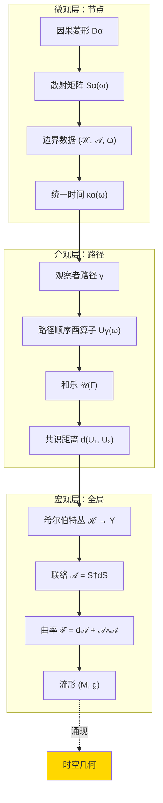

# 第9篇：观察者算子网络——宇宙作为分布式计算系统

## 1. 从孤立观察者到网络

前两篇我们定义了：

- **第7篇**：单个"我"——自指的矩阵观察者
- **第8篇**：多个"我们"——因果共识的几何

现在的问题：如果整个宇宙是一个**由无数观察者节点组成的网络**，它如何协同工作？

这不是比喻——GLS理论揭示：

> **矩阵宇宙 = 一个巨大的算子值网络，每个因果菱形是节点，联络是边，因果共识是全局一致性协议**

本篇将展示这一深刻对应。

## 2. 网络的基本结构

### 2.1 因果菱形复形

回顾时空中的小因果菱形：

$$
D_{p,r} = J^+(p^-) \cap J^-(p^+)
$$

- $p^\pm = \exp_p(\pm r \, u^a)$（沿时间方向的未来/过去点）
- $J^\pm$ 是因果未来/过去
- $D_{p,r}$ 是时间尺度 $2r$ 的小菱形

将所有这样的小菱形组成一个**复形**（simplicial complex）：

$$
\mathcal{D} = \{D_\alpha\}_{\alpha \in A}
$$

其 Čech 神经（nerve）$\mathsf{K}(\mathcal{D})$ 定义为：

- **顶点**：每个菱形 $D_\alpha$ 对应一个顶点
- **边**：若 $D_\alpha \cap D_\beta \neq \varnothing$，连一条边 $[\alpha, \beta]$
- **$k$-单形**：若 $D_{\alpha_0} \cap \cdots \cap D_{\alpha_k} \neq \varnothing$，存在 $k$-单形 $[\alpha_0 \cdots \alpha_k]$

**几何重构定理**（定理3.1）：

若 $\mathcal{D}$ 形成良好覆盖（good cover），则：

$$
|\mathsf{K}(\mathcal{D})| \simeq M \quad (\text{同伦等价})
$$

即：**因果菱形网络完全恢复时空流形的拓扑**。

### 2.2 网络节点的数据结构

每个节点（因果菱形 $D_\alpha$）携带：

| 数据项 | 符号 | 含义 |
|-------|------|-----|
| 边界希尔伯特空间 | $\mathcal{H}_{\partial D_\alpha}$ | 可观测自由度 |
| 边界代数 | $\mathcal{A}_{\partial D_\alpha}$ | 可观测量算子 |
| 参考态 | $\omega_{\partial D_\alpha}$ | 真空或热态 |
| 散射矩阵 | $S_{D_\alpha}(\omega)$ | 输入→输出映射 |
| 模哈密顿量 | $K_{D_\alpha}$ | 内禀时间演化 |
| 统一时间刻度 | $\kappa_{D_\alpha}(\omega)$ | 物理时间测度 |

这些数据不是任意的，必须满足**局部一致性条件**。

### 2.3 边的通信协议

两个相邻节点 $D_\alpha$ 和 $D_\beta$（$D_\alpha \cap D_\beta \neq \varnothing$）通过**转移算子**通信：

$$
U_{\alpha\beta}(x, \chi): \mathcal{H}_\beta|_{(x,\chi)} \to \mathcal{H}_\alpha|_{(x,\chi)}
$$

满足：

1. **酉性**：$U_{\alpha\beta}^\dagger U_{\alpha\beta} = \mathbb{I}$（信息守恒）
2. **相容性**：散射矩阵通过 $U_{\alpha\beta}$ 变换
   $$
   S_\alpha(\omega; x, \chi) = U_{\alpha\beta}(x, \chi) \, S_\beta(\omega; x, \chi) \, U_{\alpha\beta}(x, \chi)^\dagger
   $$
3. **循环一致性**（Čech 1-上链条件）：
   $$
   U_{\alpha\beta} U_{\beta\gamma} = U_{\alpha\gamma} \quad \text{on } D_\alpha \cap D_\beta \cap D_\gamma
   $$

**网络意义**：

- $U_{\alpha\beta}$：节点间的"通信协议"或"参考系变换"
- 循环一致性：防止信息在网络中循环时累积错误

## 3. 全局希尔伯特丛与联络

### 3.1 从局部到全局：丛的粘合

局部数据 $\{\mathcal{H}_\alpha, U_{\alpha\beta}\}$ 满足 Čech 上链条件，可粘合成全局结构：

**定理 3.2（矩阵宇宙的存在唯一性）**

在公理 G（几何）、T（时间）、A（拓扑）下，存在：

1. **希尔伯特丛**：$\pi: \mathcal{H} \to Y$（$Y = M \times X^\circ$）
2. **全局散射场**：$S(\omega; x, \chi) \in \mathcal{U}(\mathcal{H}_{(x,\chi)})$
3. **算子值联络**：
   $$
   \mathcal{A}(\omega; x, \chi) = S(\omega; x, \chi)^\dagger \, \mathrm{d} S(\omega; x, \chi)
   $$

满足统一时间刻度恒等式：

$$
\kappa(\omega; x, \chi) = \frac{1}{2\pi} \mathrm{tr} Q(\omega; x, \chi) = \frac{\partial \varphi(\omega; x, \chi)}{\partial \omega}
$$

且唯一性模酉规范变换。

**网络意义**：

- 希尔伯特丛 $\mathcal{H}$：全局状态空间（整个网络的"内存"）
- 联络 $\mathcal{A}$：网络传播信息时的"路由规则"
- 统一时间刻度 $\kappa$：网络全局同步的"时钟"

### 3.2 联络的物理意义

联络 $\mathcal{A}$ 有多个分量：

$$
\mathcal{A} = \mathcal{A}_\omega \, \mathrm{d}\omega + \mathcal{A}_x \, \mathrm{d}x + \mathcal{A}_\chi \, \mathrm{d}\chi
$$

| 分量 | 物理意义 | 对应算子 |
|------|----------|---------|
| $\mathcal{A}_\omega$ | 频率方向的变化 | Wigner-Smith 时延算子 $Q(\omega) = -iS^\dagger \partial_\omega S$ |
| $\mathcal{A}_x$ | 空间移动的相位 | 几何相位/Berry 联络 |
| $\mathcal{A}_\chi$ | 参数调制的响应 | 调制哈密顿量 |

**综合意义**：

$$
\mathcal{A} = \text{"网络拓扑"的微分几何表示"}
$$

沿任意路径 $\gamma$ 的**路径顺序积分**：

$$
U_\gamma(\omega) = \mathcal{P} \exp \int_\gamma \mathcal{A}(\omega; x, \chi)
$$

编码了观察者沿 $\gamma$ 累积的所有网络交互。

## 4. 观察者作为网络路径

### 4.1 观察者的多层结构

一个观察者 $O_i$ 在网络中由以下数据刻画（引自论文2.4节）：

$$
O_i = (C_i, \prec_i, \Lambda_i, \mathcal{A}_i, \omega_i, \mathcal{M}_i, U_i, u_i, \mathcal{C}_{ij})
$$

| 符号 | 名称 | 含义 |
|------|------|-----|
| $C_i \subset X$ | 可访问域 | 观察者能接触的事件集合 |
| $\prec_i$ | 局部偏序 | 观察者感知的因果顺序 |
| $\Lambda_i$ | 分辨率刻度 | 时空与频谱的截断函数 |
| $\mathcal{A}_i$ | 可观测代数 | 观察者能测量的算子集合 |
| $\omega_i$ | 信念态 | 观察者当前的知识状态 |
| $\mathcal{M}_i$ | 模型族 | 观察者的理论假设空间 |
| $U_i$ | 更新算子 | 学习/贝叶斯更新规则 |
| $u_i$ | 效用函数 | 决策偏好 |
| $\mathcal{C}_{ij}$ | 通信信道 | 与其他观察者 $O_j$ 的信息交换 |

**核心洞见**：

观察者不是被动的"照相机"，而是主动的**信息处理节点**，具备：

- 感知（$\mathcal{A}_i, \omega_i$）
- 推理（$\mathcal{M}_i, U_i$）
- 决策（$u_i$）
- 通信（$\mathcal{C}_{ij}$）

### 4.2 观察者路径 = 网络遍历

观察者在时空中的历史对应网络中的一条路径：

$$
\gamma: [0, 1] \to M, \quad \gamma(t) \in D_{\alpha(t)}
$$

沿路径累积的信息：

$$
U_\gamma(\omega) = S_{D_{\alpha_n}}(\omega) \cdot \cdots \cdot S_{D_{\alpha_1}}(\omega)
$$

（离散版本；连续极限为路径顺序指数）

**类比**：

- **互联网数据包**：从源到目标，经过一系列路由器（节点），每个路由器施加一个变换（散射矩阵）
- **观察者体验**：从出生到现在，经过一系列因果菱形，每个菱形施加散射，最终形成"我"的总体验 $U_\gamma$

## 5. 因果共识 = 网络一致性

### 5.1 网络的曲率与一致性

在分布式系统中，一致性问题是核心挑战：

- **一致性**：所有节点对全局状态有相同理解
- **分区容错**：网络部分断开时仍能运行
- **可用性**：请求能及时响应

CAP 定理指出：**无法同时满足三者**。

在矩阵宇宙网络中：

| 网络术语 | GLS 对应 | 数学刻画 |
|---------|---------|---------|
| 一致性 | 因果共识 | $d(U_{\gamma_1}, U_{\gamma_2}) \approx 0$ |
| 分区容错 | 拓扑平凡 | $[K] = 0$（无 $\mathbb{Z}_2$ 异常） |
| 可用性 | 马尔可夫性 | $I(D_{j-1}:D_{j+1} \mid D_j) \approx 0$ |

**曲率 $\mathcal{F}$ 的网络意义**：

$$
\mathcal{F} = \mathrm{d}\mathcal{A} + \mathcal{A} \wedge \mathcal{A}
$$

- $\mathcal{F} = 0$：网络完全一致（平坦）
- $\mathcal{F} \neq 0$：存在"信息扭曲"，不同路径产生不同结果

### 5.2 和乐 = 闭合路径的全局误差

考虑闭合网络路径 $\Gamma$（从节点 $A$ 出发，绕一圈回到 $A$）：

$$
\mathcal{U}(\Gamma) = \mathcal{P} \exp \oint_\Gamma \mathcal{A}
$$

**网络意义**：

- $\mathcal{U}(\Gamma) = \mathbb{I}$：信息绕一圈回来，完全恢复（无损）
- $\mathcal{U}(\Gamma) \neq \mathbb{I}$：存在累积相位或损耗（有损）

由 Stokes 定理（非交换版）：

$$
\mathcal{U}(\Gamma) \approx \mathbb{I} + \iint_\Sigma \mathcal{F} + O(\|\mathcal{F}\|^2)
$$

其中 $\Sigma$ 是 $\Gamma$ 围成的曲面。

**推论**：

$$
|\mathcal{U}(\Gamma) - \mathbb{I}| \leq C \, \|\mathcal{F}\| \, \mathrm{Area}(\Sigma)
$$

**网络诠释**：

- 曲率 $\|\mathcal{F}\|$：单位面积的信息损耗率
- 面积 $\mathrm{Area}(\Sigma)$：闭合路径的"通信成本"
- 和乐偏差：绕一圈的累积误差

## 6. 因果缺口 = 马尔可夫破缺

### 6.1 理想网络：马尔可夫性

理想的因果网络应该是**马尔可夫链**：

$$
P(\text{节点 } j+1 \mid \text{节点 } j, j-1, \ldots) = P(\text{节点 } j+1 \mid \text{节点 } j)
$$

即：未来只依赖当前节点，与过去无关。

在量子情形，马尔可夫性表现为**条件互信息为零**：

$$
I(D_{j-1} : D_{j+1} \mid D_j) = 0
$$

这意味着：

- $D_j$ 完全"屏蔽" $D_{j-1}$ 和 $D_{j+1}$ 的直接关联
- 信息从 $D_{j-1}$ 到 $D_{j+1}$ 必须经过 $D_j$，无"抄近道"

### 6.2 真实网络：因果缺口

现实中，量子场论在弯曲时空或强相互作用区域，马尔可夫性被破坏。

**因果缺口密度**：

$$
\mathfrak{g}(v, x_\perp) = \frac{\delta I(D_{j-1} : D_{j+1} \mid D_j)}{\delta v \, \delta x_\perp}
$$

积分得总缺口：

$$
G[D_{j-1}, D_j, D_{j+1}] = \iint \mathfrak{g}(v, x_\perp) \, \mathrm{d}v \, \mathrm{d}^{d-2} x_\perp
$$

**物理意义**：

- $\mathfrak{g}$ 大：信息"泄漏"严重，网络有"隐藏通道"
- $\mathfrak{g}$ 小：几乎马尔可夫，网络行为可预测

### 6.3 量子零能条件（QNEC）的约束

QNEC 给出：

$$
\mathfrak{g}(v, x_\perp) \geq -\frac{\hbar}{2\pi} \langle T_{kk} \rangle + \text{(几何项)}
$$

其中 $T_{kk}$ 是类空零方向的应力张量分量。

**网络诠释**：

- 能量密度 $\langle T_{kk} \rangle$ 越大，因果缺口越小（能量"强化"马尔可夫性）
- 负能量（如 Casimir 效应）会增大缺口（破坏因果局域性）

这是**能量-信息-因果的深刻关联**。

## 7. 完整网络的涌现几何

### 7.1 从网络到流形：逆向构造

我们已知：因果菱形网络 $\mathcal{D}$ $\Rightarrow$ 时空流形 $M$（定理3.1）

**逆向问题**：给定抽象网络（如互联网、神经网络），能否涌现出"几何"？

GLS 框架的答案：**能，在满足一致性条件时**。

要求：

1. **Čech 因果一致性**：局部偏序可粘合成全局偏序 $\prec$
2. **体积一致性**：局部"大小"（熵、维数）可粘合成整体测度 $\mu$
3. **曲率有界**：联络曲率 $\|\mathcal{F}\| \leq \delta < \infty$

满足这些条件，可重构：

$$
\text{网络} \xrightarrow{\text{Čech 粘合}} (M, \prec, \mu) \xrightarrow{\text{因果几何}} (M, g_{\text{共形}}) \xrightarrow{\text{纠缠平衡}} (M, g)
$$

最终得到完整的 Lorentz 流形 $(M, g)$。

### 7.2 网络的"物理性"标准

不是所有网络都对应物理时空。物理网络的判据：

| 条件 | 数学表达 | 物理意义 |
|------|---------|---------|
| 全局双曲性 | 存在 Cauchy 面 | 因果完备性 |
| 稳定因果性 | 无闭合类时曲线 | 无时间机器 |
| 局部洛伦兹 | 每个节点近似平直 | 等效原理 |
| 熵界有限 | $S_{\text{gen}}[\partial\mathcal{R}] < \infty$ | 信息有界性 |
| 马尔可夫近似 | $I(D_{j-1}:D_{j+1} \mid D_j) \approx 0$ | 局部性 |

**非物理网络例子**：

- 社交网络：无因果偏序（朋友关系无时间方向）
- 互联网（静态拓扑）：无内禀时间刻度
- 随机图：局部偏序不一致

**物理网络例子**：

- 量子场论的格点正则化（lattice QFT）
- 因果集（causal set）量子引力
- 张量网络（如 MERA、AdS/CFT 对应）

## 8. 实例：AdS/CFT 作为网络对偶

### 8.1 AdS/CFT 的标准表述

反德西特/共形场论对偶（AdS/CFT）：

- **AdS 侧**：$(d+1)$ 维引力理论（体）
- **CFT 侧**：$d$ 维共形场论（边界）

标准对应：

$$
Z_{\text{CFT}}[J] = Z_{\text{gravity}}[\phi|_{\partial\text{AdS}} = J]
$$

（配分函数对应）

### 8.2 GLS 网络诠释

在矩阵宇宙框架中，AdS/CFT 可理解为：

**体（AdS）= 因果菱形网络**

- 节点：AdS 时空中的小因果菱形 $D_\alpha$
- 数据：局部散射矩阵 $S_{D_\alpha}(\omega)$
- 联络：$\mathcal{A} = S^\dagger \mathrm{d} S$

**边界（CFT）= 网络的全局观察者**

- CFT 算子：边界观察者的可观测量
- CFT 态：边界观察者的信念态 $\omega_{\text{CFT}}$
- 相关函数：不同边界点观察者的因果共识测度

**对偶关系**：

$$
U_{\gamma}^{\text{AdS}}(\omega) \xleftrightarrow{\text{全息}} \langle O_{\text{CFT}}(\gamma) \rangle
$$

- 左边：体内观察者路径的酉算子
- 右边：边界 CFT 算子的真空期望值
- 全息：体内路径编码在边界纠缠结构中

### 8.3 Ryu-Takayanagi 公式的网络意义

RT 公式：

$$
S_{\text{CFT}}(A) = \frac{\mathrm{Area}(\gamma_A)}{4G_N}
$$

- $A \subset \partial\text{AdS}$：边界区域
- $\gamma_A$：连接 $A$ 边界的极小曲面
- $S_{\text{CFT}}(A)$：CFT 约化态的纠缠熵

**GLS 网络诠释**：

- $\gamma_A$：网络中连接边界区域 $A$ 的"最优路径束"
- $\mathrm{Area}(\gamma_A)$：该路径束的"通信瓶颈"（最小割）
- $S_{\text{CFT}}(A)$：边界观察者对体内信息的不确定性

RT 公式本质上是**最大流-最小割定理的量子引力版本**！

## 9. 工程应用提议

### 9.1 模拟矩阵宇宙网络

可构造实验系统模拟因果网络：

**方案 A：微波散射网络**

- 节点：微波腔或波导耦合器
- 散射矩阵：矢量网络分析仪测量的 $S$-参数
- 联络：频率导数 $Q(\omega) = -iS^\dagger \partial_\omega S$
- 曲率：闭合回路的相位累积

**方案 B：数字模拟器**

- 节点：有限维酉矩阵 $S_\alpha \in U(N)$
- 路径：矩阵乘积态（MPS）
- 共识距离：$d(U_{\gamma_1}, U_{\gamma_2})$ 的数值计算
- 优化目标：最小化曲率 $\|\mathcal{F}\|$

### 9.2 因果一致性协议

将网络共识问题翻译为工程协议：

| 网络设计目标 | GLS 条件 | 实现方法 |
|------------|---------|---------|
| 路径无关性 | $\mathcal{F} = 0$ | 对称网络拓扑 |
| 误差容忍度 $\epsilon$ | $C\delta \mathrm{Area}(\Gamma) \leq \epsilon$ | 限制回路长度/曲率 |
| 马尔可夫性 | $I(D_{j-1}:D_{j+1} \mid D_j) = 0$ | 单向信息流 |
| 拓扑稳定性 | $[K] = 0$ | 避免自指反馈 |

**应用场景**：

- 分布式量子计算：保证不同量子比特路径的相干性
- GPS 时钟同步：多卫星路径的因果共识
- 区块链：节点间的账本一致性

## 10. 小结：网络的三层视角

**核心洞见**：

1. **节点 = 局部因果单元**
   - 每个菱形 $D_\alpha$ 有自己的希尔伯特空间、散射矩阵、时间刻度
   - 局部数据满足统一时间刻度恒等式

2. **路径 = 观察者体验**
   - 路径 $\gamma$ 穿过一系列节点
   - 累积的酉算子 $U_\gamma$ 编码观察者的总体验
   - 闭合路径的和乐测量信息损耗

3. **全局 = 涌现几何**
   - 局部数据通过 Čech 粘合成全局希尔伯特丛
   - 联络 $\mathcal{A}$ 定义网络的微分结构
   - 曲率 $\mathcal{F}$ 决定因果共识的可达性
   - 满足一致性条件时，涌现出 Lorentz 流形 $(M, g)$

## 11. 思考题

1. **神经网络与矩阵宇宙**
   - 深度神经网络的每一层类似因果菱形链条
   - 反向传播算法能否理解为"因果共识的优化"？
   - 梯度消失/爆炸问题对应什么几何病态？

2. **区块链的因果结构**
   - 区块链是严格的马尔可夫链（每个块只依赖前一块）
   - 分叉（fork）对应 $\mathbb{Z}_2$ 和乐吗？
   - 共识算法（PoW、PoS）如何在 GLS 框架中表述？

3. **量子纠缠网络**
   - 纠缠态在多个节点间分布（如量子互联网）
   - 纠缠熵 $S(A)$ 与因果菱形链的 $I(D_{j-1}:D_{j+1} \mid D_j)$ 有何关系？
   - 纠缠蒸馏能否理解为"降低因果缺口"？

4. **黑洞作为网络奇点**
   - 黑洞视界内的因果菱形网络断开（与外界无通信）
   - 这对应希尔伯特丛的什么奇点？
   - Hawking 辐射能否理解为"网络边界的隧穿泄漏"？

---

**下一篇预告**：我们将给出**矩阵宇宙与现实时空的等价性定理的完整证明**——证明在适当条件下，矩阵网络描述与传统时空场论描述是完全等价的。这将完成整个矩阵宇宙理论的逻辑闭环。
