# Chapter 9: Observer Operator Network—Universe as Distributed Computing System

## 1. From Isolated Observer to Network

In the previous two chapters, we defined:

- **Chapter 7**: Single "I"—self-referential matrix observer
- **Chapter 8**: Multiple "We"—geometry of causal consensus

Now the question: If the entire universe is a **network composed of countless observer nodes**, how does it coordinate?

This is not a metaphor—GLS theory reveals:

> **Matrix Universe = A Huge Operator-Valued Network, Each Causal Diamond is a Node, Connection is an Edge, Causal Consensus is Global Consistency Protocol**

This chapter will demonstrate this profound correspondence.

## 2. Basic Structure of Network

### 2.1 Causal Diamond Complex

Recall small causal diamond in spacetime:

$$
D_{p,r} = J^+(p^-) \cap J^-(p^+)
$$

- $p^\pm = \exp_p(\pm r \, u^a)$ (future/past points along time direction)
- $J^\pm$ are causal future/past
- $D_{p,r}$ is small diamond of time scale $2r$

Compose all such small diamonds into a **complex** (simplicial complex):

$$
\mathcal{D} = \{D_\alpha\}_{\alpha \in A}
$$

Its Čech nerve $\mathsf{K}(\mathcal{D})$ is defined as:

- **Vertices**: Each diamond $D_\alpha$ corresponds to a vertex
- **Edges**: If $D_\alpha \cap D_\beta \neq \varnothing$, connect an edge $[\alpha, \beta]$
- **$k$-Simplex**: If $D_{\alpha_0} \cap \cdots \cap D_{\alpha_k} \neq \varnothing$, exists $k$-simplex $[\alpha_0 \cdots \alpha_k]$

**Geometric Reconstruction Theorem** (Theorem 3.1):

If $\mathcal{D}$ forms a good cover, then:

$$
|\mathsf{K}(\mathcal{D})| \simeq M \quad (\text{homotopy equivalent})
$$

That is: **Causal diamond network completely recovers topology of spacetime manifold**.

### 2.2 Data Structure of Network Nodes

Each node (causal diamond $D_\alpha$) carries:

| Data Item | Symbol | Meaning |
|-------|------|-----|
| Boundary Hilbert Space | $\mathcal{H}_{\partial D_\alpha}$ | Observable degrees of freedom |
| Boundary Algebra | $\mathcal{A}_{\partial D_\alpha}$ | Observable operators |
| Reference State | $\omega_{\partial D_\alpha}$ | Vacuum or thermal state |
| Scattering Matrix | $S_{D_\alpha}(\omega)$ | Input→Output mapping |
| Modular Hamiltonian | $K_{D_\alpha}$ | Intrinsic time evolution |
| Unified Time Scale | $\kappa_{D_\alpha}(\omega)$ | Physical time measure |

These data are not arbitrary, must satisfy **local consistency conditions**.

### 2.3 Communication Protocol of Edges

Two adjacent nodes $D_\alpha$ and $D_\beta$ ($D_\alpha \cap D_\beta \neq \varnothing$) communicate through **transfer operator**:

$$
U_{\alpha\beta}(x, \chi): \mathcal{H}_\beta|_{(x,\chi)} \to \mathcal{H}_\alpha|_{(x,\chi)}
$$

satisfying:

1. **Unitarity**: $U_{\alpha\beta}^\dagger U_{\alpha\beta} = \mathbb{I}$ (information conservation)
2. **Compatibility**: Scattering matrix transforms through $U_{\alpha\beta}$
   $$
   S_\alpha(\omega; x, \chi) = U_{\alpha\beta}(x, \chi) \, S_\beta(\omega; x, \chi) \, U_{\alpha\beta}(x, \chi)^\dagger
   $$
3. **Cyclic Consistency** (Čech 1-cocycle condition):
   $$
   U_{\alpha\beta} U_{\beta\gamma} = U_{\alpha\gamma} \quad \text{on } D_\alpha \cap D_\beta \cap D_\gamma
   $$

**Network Meaning**:

- $U_{\alpha\beta}$: "Communication protocol" or "reference frame transformation" between nodes
- Cyclic consistency: Prevents error accumulation when information cycles in network

## 3. Global Hilbert Bundle and Connection

### 3.1 From Local to Global: Bundle Gluing

Local data $\{\mathcal{H}_\alpha, U_{\alpha\beta}\}$ satisfy Čech cocycle condition, can be glued into global structure:

**Theorem 3.2 (Existence and Uniqueness of Matrix Universe)**

Under Axioms G (Geometry), T (Time), A (Topology), there exists:

1. **Hilbert Bundle**: $\pi: \mathcal{H} \to Y$ ($Y = M \times X^\circ$)
2. **Global Scattering Field**: $S(\omega; x, \chi) \in \mathcal{U}(\mathcal{H}_{(x,\chi)})$
3. **Operator-Valued Connection**:
   $$
   \mathcal{A}(\omega; x, \chi) = S(\omega; x, \chi)^\dagger \, \mathrm{d} S(\omega; x, \chi)
   $$

satisfying unified time scale identity:

$$
\kappa(\omega; x, \chi) = \frac{1}{2\pi} \mathrm{tr} Q(\omega; x, \chi) = \frac{\partial \varphi(\omega; x, \chi)}{\partial \omega}
$$

and uniqueness modulo unitary gauge transformation.

**Network Meaning**:

- Hilbert bundle $\mathcal{H}$: Global state space ("memory" of entire network)
- Connection $\mathcal{A}$: "Routing rules" when network propagates information
- Unified time scale $\kappa$: "Clock" for global synchronization of network

### 3.2 Physical Meaning of Connection

Connection $\mathcal{A}$ has multiple components:

$$
\mathcal{A} = \mathcal{A}_\omega \, \mathrm{d}\omega + \mathcal{A}_x \, \mathrm{d}x + \mathcal{A}_\chi \, \mathrm{d}\chi
$$

| Component | Physical Meaning | Corresponding Operator |
|------|----------|---------|
| $\mathcal{A}_\omega$ | Change in frequency direction | Wigner-Smith delay operator $Q(\omega) = -iS^\dagger \partial_\omega S$ |
| $\mathcal{A}_x$ | Phase of spatial movement | Geometric phase/Berry connection |
| $\mathcal{A}_\chi$ | Response to parameter modulation | Modulation Hamiltonian |

**Comprehensive Meaning**:

$$
\mathcal{A} = \text{"Differential geometric representation of network topology"}
$$

**Path-ordered integral** along arbitrary path $\gamma$:

$$
U_\gamma(\omega) = \mathcal{P} \exp \int_\gamma \mathcal{A}(\omega; x, \chi)
$$

encodes all network interactions accumulated by observer along $\gamma$.

## 4. Observer as Network Path

### 4.1 Multi-Layer Structure of Observer

An observer $O_i$ in network is characterized by following data (from Section 2.4 of paper):

$$
O_i = (C_i, \prec_i, \Lambda_i, \mathcal{A}_i, \omega_i, \mathcal{M}_i, U_i, u_i, \mathcal{C}_{ij})
$$

| Symbol | Name | Meaning |
|------|------|-----|
| $C_i \subset X$ | Accessible Domain | Set of events observer can access |
| $\prec_i$ | Local Partial Order | Causal order perceived by observer |
| $\Lambda_i$ | Resolution Scale | Truncation function of spacetime and spectrum |
| $\mathcal{A}_i$ | Observable Algebra | Set of operators observer can measure |
| $\omega_i$ | Belief State | Observer's current knowledge state |
| $\mathcal{M}_i$ | Model Family | Observer's theoretical hypothesis space |
| $U_i$ | Update Operator | Learning/Bayesian update rule |
| $u_i$ | Utility Function | Decision preference |
| $\mathcal{C}_{ij}$ | Communication Channel | Information exchange with other observer $O_j$ |

**Core Insight**:

Observer is not passive "camera", but active **information processing node**, with:

- Perception ($\mathcal{A}_i, \omega_i$)
- Reasoning ($\mathcal{M}_i, U_i$)
- Decision ($u_i$)
- Communication ($\mathcal{C}_{ij}$)

### 4.2 Observer Path = Network Traversal

Observer's history in spacetime corresponds to a path in network:

$$
\gamma: [0, 1] \to M, \quad \gamma(t) \in D_{\alpha(t)}
$$

Information accumulated along path:

$$
U_\gamma(\omega) = S_{D_{\alpha_n}}(\omega) \cdot \cdots \cdot S_{D_{\alpha_1}}(\omega)
$$

(Discrete version; continuous limit is path-ordered exponential)

**Analogy**:

- **Internet Data Packet**: From source to destination, passes through series of routers (nodes), each router applies a transformation (scattering matrix)
- **Observer Experience**: From birth to now, passes through series of causal diamonds, each diamond applies scattering, finally forms "I"'s total experience $U_\gamma$

## 5. Causal Consensus = Network Consistency

### 5.1 Network Curvature and Consistency

In distributed systems, consistency is core challenge:

- **Consistency**: All nodes have same understanding of global state
- **Partition Tolerance**: System can still operate when network partially disconnected
- **Availability**: Requests can be responded to promptly

CAP theorem states: **Cannot satisfy all three simultaneously**.

In matrix universe network:

| Network Term | GLS Correspondence | Mathematical Characterization |
|---------|---------|---------|
| Consistency | Causal Consensus | $d(U_{\gamma_1}, U_{\gamma_2}) \approx 0$ |
| Partition Tolerance | Topologically Trivial | $[K] = 0$ (no $\mathbb{Z}_2$ anomaly) |
| Availability | Markov Property | $I(D_{j-1}:D_{j+1} \mid D_j) \approx 0$ |

**Network Meaning of Curvature $\mathcal{F}$**:

$$
\mathcal{F} = \mathrm{d}\mathcal{A} + \mathcal{A} \wedge \mathcal{A}
$$

- $\mathcal{F} = 0$: Network completely consistent (flat)
- $\mathcal{F} \neq 0$: "Information distortion" exists, different paths produce different results

### 5.2 Holonomy = Global Error of Closed Path

Consider closed network path $\Gamma$ (start from node $A$, go around once back to $A$):

$$
\mathcal{U}(\Gamma) = \mathcal{P} \exp \oint_\Gamma \mathcal{A}
$$

**Network Meaning**:

- $\mathcal{U}(\Gamma) = \mathbb{I}$: Information goes around once, completely recovered (lossless)
- $\mathcal{U}(\Gamma) \neq \mathbb{I}$: Accumulated phase or loss exists (lossy)

By Stokes theorem (non-commutative version):

$$
\mathcal{U}(\Gamma) \approx \mathbb{I} + \iint_\Sigma \mathcal{F} + O(\|\mathcal{F}\|^2)
$$

where $\Sigma$ is surface bounded by $\Gamma$.

**Corollary**:

$$
|\mathcal{U}(\Gamma) - \mathbb{I}| \leq C \, \|\mathcal{F}\| \, \mathrm{Area}(\Sigma)
$$

**Network Interpretation**:

- Curvature $\|\mathcal{F}\|$: Information loss rate per unit area
- Area $\mathrm{Area}(\Sigma)$: "Communication cost" of closed path
- Holonomy deviation: Accumulated error going around once

## 6. Causal Gap = Markov Breaking

### 6.1 Ideal Network: Markov Property

Ideal causal network should be **Markov chain**:

$$
P(\text{Node } j+1 \mid \text{Node } j, j-1, \ldots) = P(\text{Node } j+1 \mid \text{Node } j)
$$

That is: Future only depends on current node, independent of past.

In quantum case, Markov property manifests as **conditional mutual information zero**:

$$
I(D_{j-1} : D_{j+1} \mid D_j) = 0
$$

This means:

- $D_j$ completely "screens" direct correlation between $D_{j-1}$ and $D_{j+1}$
- Information from $D_{j-1}$ to $D_{j+1}$ must pass through $D_j$, no "shortcut"

### 6.2 Real Network: Causal Gap

In reality, quantum field theory in curved spacetime or strong interaction regions, Markov property is broken.

**Causal Gap Density**:

$$
\mathfrak{g}(v, x_\perp) = \frac{\delta I(D_{j-1} : D_{j+1} \mid D_j)}{\delta v \, \delta x_\perp}
$$

Integrating gives total gap:

$$
G[D_{j-1}, D_j, D_{j+1}] = \iint \mathfrak{g}(v, x_\perp) \, \mathrm{d}v \, \mathrm{d}^{d-2} x_\perp
$$

**Physical Meaning**:

- $\mathfrak{g}$ large: Information "leakage" severe, network has "hidden channels"
- $\mathfrak{g}$ small: Almost Markov, network behavior predictable

### 6.3 Constraint of Quantum Null Energy Condition (QNEC)

QNEC gives:

$$
\mathfrak{g}(v, x_\perp) \geq -\frac{\hbar}{2\pi} \langle T_{kk} \rangle + \text{(geometric terms)}
$$

where $T_{kk}$ is stress tensor component along spacelike null direction.

**Network Interpretation**:

- Larger energy density $\langle T_{kk} \rangle$, smaller causal gap (energy "strengthens" Markov property)
- Negative energy (e.g., Casimir effect) increases gap (destroys causal locality)

This is **profound connection between energy-information-causality**.

## 7. Emergent Geometry of Complete Network

### 7.1 From Network to Manifold: Reverse Construction

We know: Causal diamond network $\mathcal{D}$ $\Rightarrow$ Spacetime manifold $M$ (Theorem 3.1)

**Reverse Problem**: Given abstract network (e.g., internet, neural network), can "geometry" emerge?

GLS framework answer: **Yes, when consistency conditions satisfied**.

Requirements:

1. **Čech Causal Consistency**: Local partial orders can be glued into global partial order $\prec$
2. **Volume Consistency**: Local "size" (entropy, dimension) can be glued into overall measure $\mu$
3. **Bounded Curvature**: Connection curvature $\|\mathcal{F}\| \leq \delta < \infty$

Satisfying these conditions, can reconstruct:

$$
\text{Network} \xrightarrow{\text{Čech Gluing}} (M, \prec, \mu) \xrightarrow{\text{Causal Geometry}} (M, g_{\text{conformal}}) \xrightarrow{\text{Entanglement Equilibrium}} (M, g)
$$

Finally get complete Lorentz manifold $(M, g)$.

### 7.2 "Physicality" Criteria of Network

Not all networks correspond to physical spacetime. Criteria for physical networks:

| Condition | Mathematical Expression | Physical Meaning |
|------|---------|---------|
| Global Hyperbolicity | Exists Cauchy surface | Causal completeness |
| Stable Causality | No closed timelike curves | No time machines |
| Local Lorentz | Each node approximately flat | Equivalence principle |
| Finite Entropy Bound | $S_{\text{gen}}[\partial\mathcal{R}] < \infty$ | Information boundedness |
| Markov Approximation | $I(D_{j-1}:D_{j+1} \mid D_j) \approx 0$ | Locality |

**Non-Physical Network Examples**:

- Social network: No causal partial order (friendship has no time direction)
- Internet (static topology): No intrinsic time scale
- Random graph: Local partial orders inconsistent

**Physical Network Examples**:

- Lattice regularization of quantum field theory (lattice QFT)
- Causal set quantum gravity
- Tensor networks (e.g., MERA, AdS/CFT correspondence)

## 8. Example: AdS/CFT as Network Duality

### 8.1 Standard Formulation of AdS/CFT

Anti-de Sitter/Conformal Field Theory duality (AdS/CFT):

- **AdS Side**: $(d+1)$-dimensional gravity theory (bulk)
- **CFT Side**: $d$-dimensional conformal field theory (boundary)

Standard correspondence:

$$
Z_{\text{CFT}}[J] = Z_{\text{gravity}}[\phi|_{\partial\text{AdS}} = J]
$$

(Partition function correspondence)

### 8.2 GLS Network Interpretation

In matrix universe framework, AdS/CFT can be understood as:

**Bulk (AdS) = Causal Diamond Network**

- Nodes: Small causal diamonds $D_\alpha$ in AdS spacetime
- Data: Local scattering matrices $S_{D_\alpha}(\omega)$
- Connection: $\mathcal{A} = S^\dagger \mathrm{d} S$

**Boundary (CFT) = Global Observer of Network**

- CFT operators: Observables of boundary observer
- CFT state: Belief state $\omega_{\text{CFT}}$ of boundary observer
- Correlation functions: Measure of causal consensus of observers at different boundary points

**Duality Relation**:

$$
U_{\gamma}^{\text{AdS}}(\omega) \xleftrightarrow{\text{holographic}} \langle O_{\text{CFT}}(\gamma) \rangle
$$

- Left: Unitary operator of observer path in bulk
- Right: Vacuum expectation value of boundary CFT operator
- Holographic: Bulk path encoded in boundary entanglement structure

### 8.3 Network Meaning of Ryu-Takayanagi Formula

RT formula:

$$
S_{\text{CFT}}(A) = \frac{\mathrm{Area}(\gamma_A)}{4G_N}
$$

- $A \subset \partial\text{AdS}$: Boundary region
- $\gamma_A$: Minimal surface connecting boundaries of $A$
- $S_{\text{CFT}}(A)$: Entanglement entropy of CFT reduced state

**GLS Network Interpretation**:

- $\gamma_A$: "Optimal path bundle" in network connecting boundary region $A$
- $\mathrm{Area}(\gamma_A)$: "Communication bottleneck" of this path bundle (minimum cut)
- $S_{\text{CFT}}(A)$: Boundary observer's uncertainty about bulk information

RT formula is essentially **quantum gravity version of max-flow min-cut theorem**!

## 9. Engineering Application Proposals

### 9.1 Simulating Matrix Universe Network

Can construct experimental systems simulating causal networks:

**Scheme A: Microwave Scattering Network**

- Nodes: Microwave cavities or waveguide couplers
- Scattering matrix: $S$-parameters measured by vector network analyzer
- Connection: Frequency derivative $Q(\omega) = -iS^\dagger \partial_\omega S$
- Curvature: Phase accumulation of closed loop

**Scheme B: Digital Simulator**

- Nodes: Finite-dimensional unitary matrices $S_\alpha \in U(N)$
- Paths: Matrix product states (MPS)
- Consensus distance: Numerical computation of $d(U_{\gamma_1}, U_{\gamma_2})$
- Optimization target: Minimize curvature $\|\mathcal{F}\|$

### 9.2 Causal Consistency Protocol

Translate network consensus problem into engineering protocol:

| Network Design Goal | GLS Condition | Implementation Method |
|------------|---------|---------|
| Path Independence | $\mathcal{F} = 0$ | Symmetric network topology |
| Error Tolerance $\epsilon$ | $C\delta \mathrm{Area}(\Gamma) \leq \epsilon$ | Limit loop length/curvature |
| Markov Property | $I(D_{j-1}:D_{j+1} \mid D_j) = 0$ | Unidirectional information flow |
| Topological Stability | $[K] = 0$ | Avoid self-referential feedback |

**Application Scenarios**:

- Distributed quantum computing: Ensure coherence of different qubit paths
- GPS clock synchronization: Causal consensus of multi-satellite paths
- Blockchain: Ledger consistency between nodes

## 10. Summary: Three-Layer Perspective of Network

```mermaid
graph TB
    subgraph Micro["Micro Layer: Nodes"]
        N1["Causal Diamond Dα"] --> N2["Scattering Matrix Sα(ω)"]
        N2 --> N3["Boundary Data (ℋ, 𝒜, ω)"]
        N3 --> N4["Unified Time κα(ω)"]
    end

    subgraph Meso["Meso Layer: Paths"]
        P1["Observer Path γ"] --> P2["Path-Ordered Unitary Operator Uγ(ω)"]
        P2 --> P3["Holonomy 𝒰(Γ)"]
        P3 --> P4["Consensus Distance d(U₁, U₂)"]
    end

    subgraph Macro["Macro Layer: Global"]
        G1["Hilbert Bundle ℋ → Y"] --> G2["Connection 𝒜 = S†dS"]
        G2 --> G3["Curvature ℱ = d𝒜 + 𝒜∧𝒜"]
        G3 --> G4["Manifold (M, g)"]
    end

    N4 --> P1
    P4 --> G1
    G4 -.->|"Emerges"| TIME["Spacetime Geometry"]

    style TIME fill:#FFD700
```

**Core Insights**:

1. **Node = Local Causal Unit**
   - Each diamond $D_\alpha$ has its own Hilbert space, scattering matrix, time scale
   - Local data satisfy unified time scale identity

2. **Path = Observer Experience**
   - Path $\gamma$ passes through series of nodes
   - Accumulated unitary operator $U_\gamma$ encodes observer's total experience
   - Holonomy of closed path measures information loss

3. **Global = Emergent Geometry**
   - Local data glued into global Hilbert bundle through Čech gluing
   - Connection $\mathcal{A}$ defines differential structure of network
   - Curvature $\mathcal{F}$ determines reachability of causal consensus
   - When consistency conditions satisfied, Lorentz manifold $(M, g)$ emerges

## 11. Thinking Questions

1. **Neural Networks and Matrix Universe**
   - Each layer of deep neural network similar to causal diamond chain
   - Can backpropagation algorithm be understood as "optimization of causal consensus"?
   - What geometric pathology does gradient vanishing/explosion correspond to?

2. **Causal Structure of Blockchain**
   - Blockchain is strict Markov chain (each block only depends on previous block)
   - Does fork correspond to $\mathbb{Z}_2$ holonomy?
   - How are consensus algorithms (PoW, PoS) formulated in GLS framework?

3. **Quantum Entanglement Network**
   - Entangled states distributed among multiple nodes (e.g., quantum internet)
   - What is relationship between entanglement entropy $S(A)$ and $I(D_{j-1}:D_{j+1} \mid D_j)$ of causal diamond chain?
   - Can entanglement distillation be understood as "reducing causal gap"?

4. **Black Hole as Network Singularity**
   - Causal diamond network inside black hole horizon disconnected (no communication with outside)
   - What singularity of Hilbert bundle does this correspond to?
   - Can Hawking radiation be understood as "tunneling leakage at network boundary"?

---

**Next Chapter Preview**: We will give **complete proof of equivalence theorem between matrix universe and real spacetime**—proving that under appropriate conditions, matrix network description and traditional spacetime field theory description are completely equivalent. This will complete the logical closure of entire matrix universe theory.

