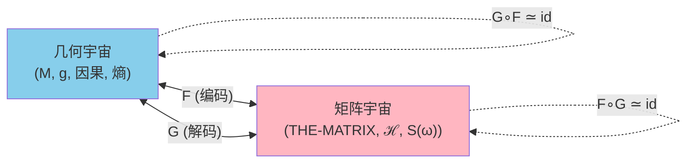
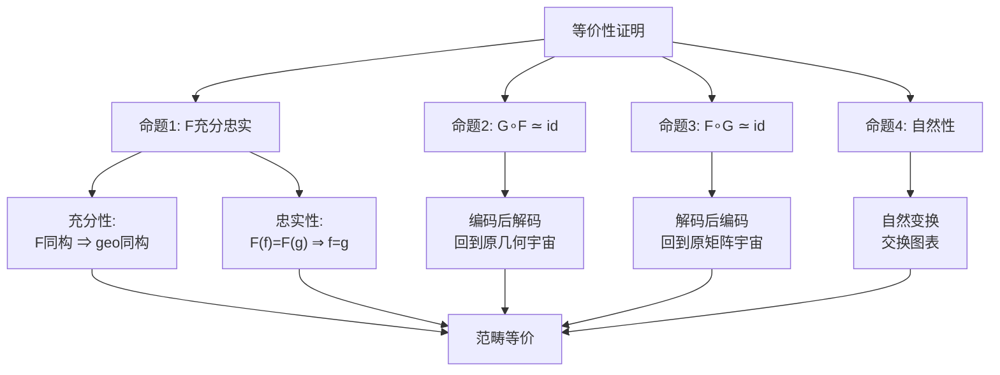
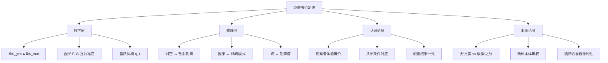

# 第10篇：现实-矩阵等价性定理的完整证明

## 1. 终极问题

经过前面9篇的铺垫，我们来到了整个矩阵宇宙理论的核心问题：

> **"现实时空"与"矩阵宇宙 THE-MATRIX"真的是同一回事吗？**

这不是哲学隐喻，而是可以严格证明的**数学定理**。

本篇将给出完整证明：在适当公理下，**几何宇宙范畴**与**矩阵宇宙范畴**是**范畴等价**的。

**等价性含义**：

- 不是"矩阵宇宙模拟现实"（单向）
- 不是"矩阵宇宙近似现实"（有误差）
- 而是"两种描述在数学上完全等价"（双向无损）

就像同一个数可以用十进制"42"或二进制"101010"表示，它们是**同一个对象的不同表示**。

## 2. 框架概览：两种宇宙的定义

### 2.1 几何宇宙 $U_{\text{geo}}$

**传统物理学的宇宙**（广义相对论 + 量子场论）：

$$
U_{\text{geo}} = (M, g, \prec, \{\mathcal{A}_{\partial D_\alpha}, \omega_\alpha\}, \{\kappa_\alpha\}, \{S_{\text{gen}, \alpha}\})
$$

| 组成部分 | 符号 | 含义 |
|---------|------|-----|
| 时空流形 | $(M, g)$ | 4维Lorentz流形 |
| 因果结构 | $\prec$ | 类时/类光的因果偏序 |
| 小因果菱形族 | $\{D_\alpha\}_{\alpha \in \mathcal{D}}$ | 覆盖 $M$ 的局域因果单元 |
| 边界代数 | $\mathcal{A}_{\partial D_\alpha}$ | 菱形边界的可观测算子 |
| 边界态 | $\omega_\alpha$ | 真空或参考态 |
| 统一时间刻度 | $\kappa_\alpha(\omega)$ | 三合一时间密度 |
| 广义熵 | $S_{\text{gen}, \alpha}$ | Bekenstein-Hawking 熵 + 纠缠熵 |

**关键公理**：

1. **全局双曲性**：存在Cauchy面，无闭合类时曲线
2. **统一时间刻度恒等式**：
   $$
   \kappa_\alpha(\omega) = \frac{\varphi_\alpha'(\omega)}{\pi} = \rho_{\text{rel}, \alpha}(\omega) = \frac{1}{2\pi} \mathrm{tr} \mathsf{Q}_\alpha(\omega)
   $$
3. **IGVP（信息几何变分原理）**：
   $$
   \delta S_{\text{gen}} = 0 \quad \Leftrightarrow \quad \text{Einstein方程}
   $$

### 2.2 矩阵宇宙 $U_{\text{mat}}$

**THE-MATRIX**（算子网络的宇宙）：

$$
U_{\text{mat}} = (\mathcal{D}, \preceq, \{\mathcal{H}_\alpha\}, \mathbb{S}(\omega), \{\kappa_\alpha, \chi_\alpha, S_{\text{gen}, \alpha}\})
$$

| 组成部分 | 符号 | 含义 |
|---------|------|-----|
| 抽象索引集 | $\mathcal{D}$ | 因果菱形标签 |
| 因果偏序 | $\preceq$ | 抽象的"先于"关系 |
| 局域希尔伯特空间族 | $\{\mathcal{H}_\alpha\}_{\alpha \in \mathcal{D}}$ | 每个节点的状态空间 |
| 全局希尔伯特空间 | $\mathcal{H} = \bigoplus_{\alpha \in \mathcal{D}} \mathcal{H}_\alpha$ | 直和 |
| 散射矩阵族 | $\mathbb{S}(\omega) \in \mathcal{U}(\mathcal{H})$ | 频率依赖的酉矩阵 |
| 统一时间刻度 | $\kappa_\alpha(\omega)$ | 从 $\mathbb{S}$ 计算得出 |
| $\mathbb{Z}_2$ 账本 | $\chi_\alpha$ | 拓扑扇区标记 |
| 广义熵 | $S_{\text{gen}, \alpha}$ | 从矩阵谱计算 |

**关键公理**：

1. **因果稀疏性**：
   $$
   \mathbb{S}_{\alpha\beta}(\omega) \neq 0 \quad \Rightarrow \quad \alpha \preceq \beta
   $$
   （非零块矩阵只出现在因果相关的节点间）

2. **统一时间刻度恒等式**（同几何宇宙）：
   $$
   \kappa_\alpha(\omega) = \frac{1}{2\pi} \mathrm{tr} \mathsf{Q}_\alpha(\omega), \quad \mathsf{Q}_\alpha(\omega) = -i \mathbb{S}_{\alpha\alpha}(\omega)^\dagger \partial_\omega \mathbb{S}_{\alpha\alpha}(\omega)
   $$

3. **矩阵版IGVP**：广义熵的变分对应块矩阵谱的稳定性

## 3. 范畴论框架

### 3.1 为什么需要范畴论

要证明"两种宇宙等价"，需要精确定义"等价"的含义。

**朴素想法（不够严格）**：

- 存在映射 $F: U_{\text{geo}} \to U_{\text{mat}}$ 和 $G: U_{\text{mat}} \to U_{\text{geo}}$
- 满足 $G \circ F = \mathrm{id}$ 和 $F \circ G = \mathrm{id}$

**问题**：

- 宇宙不是单个对象，而是一族对象（不同的时空、不同的矩阵）
- 它们之间有态射（保持结构的映射）
- 需要考虑这些映射如何相互作用

**范畴论解决方案**：

- 定义**几何宇宙范畴** $\mathsf{Uni}_{\text{geo}}$
- 定义**矩阵宇宙范畴** $\mathsf{Uni}_{\text{mat}}$
- 构造**函子** $F$ 和 $G$（保持范畴结构的映射）
- 证明 $F$ 和 $G$ 是**准逆**（quasi-inverse）

### 3.2 几何宇宙范畴 $\mathsf{Uni}_{\text{geo}}$

**对象**：所有满足公理的几何宇宙 $U_{\text{geo}}$

**态射** $f: U_{\text{geo}} \to U_{\text{geo}}'$ 由以下数据组成：

1. **因果同胚**：$f_M: (M, g, \prec) \to (M', g', \prec')$
   - 保持因果结构
   - 保持共形类

2. **索引集同构**：$\mathcal{D} \to \mathcal{D}'$
   - 小因果菱形的对应关系

3. **边界代数同构**：$\Phi_\alpha: \mathcal{A}_{\partial D_\alpha} \to \mathcal{A}_{\partial D'_{f(\alpha)}}$
   - 保持 von Neumann 代数结构
   - 保持态：$\omega'_{f(\alpha)} \circ \Phi_\alpha = \omega_\alpha$

4. **刻度与熵保持**：
   $$
   \kappa'_{f(\alpha)} = \kappa_\alpha \circ f^{-1}, \quad S_{\text{gen}, f(\alpha)}' = S_{\text{gen}, \alpha}
   $$

**复合**：态射的复合按自然方式定义

**单位态射**：恒等映射

### 3.3 矩阵宇宙范畴 $\mathsf{Uni}_{\text{mat}}$

**对象**：所有满足公理的矩阵宇宙 $U_{\text{mat}}$

**态射** $\Psi: U_{\text{mat}} \to U_{\text{mat}}'$ 由以下数据组成：

1. **偏序集同构**：$\psi: \mathcal{D} \to \mathcal{D}'$

2. **希尔伯特空间酉算子**：$U: \mathcal{H} \to \mathcal{H}'$
   - 满足 $U \mathbb{S}(\omega) U^\dagger = \mathbb{S}'(\omega)$
   - 满足 $U(\mathcal{H}_\alpha) = \mathcal{H}'_{\psi(\alpha)}$

3. **刻度、拓扑扇区、熵保持**：
   $$
   \kappa'_{\psi(\alpha)} = \kappa_\alpha, \quad \chi'_{\psi(\alpha)} = \chi_\alpha, \quad S_{\text{gen}, \psi(\alpha)}' = S_{\text{gen}, \alpha}
   $$

## 4. 编码函子 $F: \mathsf{Uni}_{\text{geo}} \to \mathsf{Uni}_{\text{mat}}$

**目标**：将几何宇宙"压缩"成矩阵宇宙

### 4.1 对对象的作用

给定 $U_{\text{geo}} = (M, g, \prec, \ldots)$：

**步骤1：保留索引集**

$$
\mathcal{D} \leftarrow \{\text{小因果菱形覆盖}\}
$$

偏序 $\preceq$ 由几何因果关系 $\prec$ 诱导：

$$
\alpha \preceq \beta \quad \Leftrightarrow \quad D_\alpha \subset J^-(D_\beta)
$$

**步骤2：构造局域希尔伯特空间**

对每个 $\alpha$，取：

$$
\mathcal{H}_\alpha = \text{GNS表示}(\mathcal{A}_{\partial D_\alpha}, \omega_\alpha)
$$

或直接取边界散射通道空间。

**步骤3：构造全局散射矩阵**

在直和空间 $\mathcal{H} = \bigoplus_\alpha \mathcal{H}_\alpha$ 上，块矩阵 $\mathbb{S}_{\alpha\beta}(\omega)$ 由几何宇宙的边界条件、传播子、反射系数决定：

- **对角块**：$\mathbb{S}_{\alpha\alpha}(\omega) = S_\alpha(\omega)$（边界散射矩阵）
- **非对角块**：编码因果传播路径

**步骤4：携带刻度与熵**

$$
\kappa_\alpha(\omega), \quad \chi_\alpha, \quad S_{\text{gen}, \alpha}
$$

直接从几何宇宙数据给定。

**输出**：矩阵宇宙 $F(U_{\text{geo}}) = (\mathcal{D}, \preceq, \{\mathcal{H}_\alpha\}, \mathbb{S}(\omega), \ldots)$

### 4.2 对态射的作用

给定态射 $f: U_{\text{geo}} \to U_{\text{geo}}'$，构造 $F(f): F(U_{\text{geo}}) \to F(U_{\text{geo}}')$：

- 偏序集同构：$\psi = f|_{\mathcal{D}}$
- 酉算子：由GNS表示的泛性质给出 $U_f: \mathcal{H} \to \mathcal{H}'$

由函子性：

$$
F(g \circ f) = F(g) \circ F(f), \quad F(\mathrm{id}) = \mathrm{id}
$$

## 5. 解码函子 $G: \mathsf{Uni}_{\text{mat}} \to \mathsf{Uni}_{\text{geo}}$

**目标**：从矩阵宇宙"重构"几何宇宙

### 5.1 对对象的作用

给定 $U_{\text{mat}} = (\mathcal{D}, \preceq, \{\mathcal{H}_\alpha\}, \mathbb{S}(\omega), \ldots)$：

**步骤1：重构拓扑**

将 $(\mathcal{D}, \preceq)$ 视为抽象因果集，用**Alexandrov拓扑**赋予拓扑结构：

$$
\mathcal{O}_p = \{q \in \mathcal{D} \mid p \preceq q\}
$$

这些集合构成拓扑的基。

**Malament-Hawking-King-McCarthy定理**保证：因果偏序 + 一定正则性 $\Rightarrow$ 拓扑 + 共形类。

**步骤2：重构度规共形类**

从局域散射块 $\mathbb{S}_{\alpha\alpha}(\omega)$ 的谱几何信息重构边界度规：

- **高频渐近**：Dirac谱计数函数
  $$
  N(\lambda) \sim \frac{\mathrm{Area}(\partial D_\alpha)}{4\pi} \lambda + \ldots
  $$
  决定腰面面积 $A_\alpha$

- **群延迟分布**：决定体积 $V_\alpha$

结合因果结构与体积信息，重构共形类。

**步骤3：确定共形因子**

利用广义熵 $S_{\text{gen}, \alpha}$ 与 IGVP 公理：

$$
\delta S_{\text{gen}} = 0 \quad \Rightarrow \quad R_{\mu\nu} - \frac{1}{2} R g_{\mu\nu} = 8\pi G T_{\mu\nu}
$$

Einstein方程固定共形因子（模整体常数）。

**步骤4：构造边界代数与态**

从块矩阵的入射-出射结构构造：

$$
\mathcal{A}_{\partial D_\alpha} \subset \mathcal{B}(\mathcal{H}_\alpha)
$$

态 $\omega_\alpha$ 由 $\kappa_\alpha$ 与 $\chi_\alpha$ 确定的模流重建。

**输出**：几何宇宙 $G(U_{\text{mat}}) = (M, g, \prec, \ldots)$

### 5.2 对态射的作用

类似于 $F$ 的构造，由偏序同构与酉算子诱导几何同胚与代数同构。

## 6. 等价性定理的陈述与证明

### 6.1 主定理

**定理（几何宇宙与矩阵宇宙的范畴等价）**

在以下公理下：

1. **全局双曲性**
2. **局域可谱重构性**
3. **有限阶 Euler-Maclaurin 与 Poisson 误差纪律**
4. **Null-Modular 双覆盖完备性**
5. **广义熵变分完备性（IGVP）**

存在函子 $F: \mathsf{Uni}_{\text{geo}} \to \mathsf{Uni}_{\text{mat}}$ 与 $G: \mathsf{Uni}_{\text{mat}} \to \mathsf{Uni}_{\text{geo}}$，使得：

$$
\mathsf{Uni}_{\text{geo}} \simeq \mathsf{Uni}_{\text{mat}}
$$

即 $F$ 与 $G$ 互为准逆：

$$
G \circ F \simeq \mathrm{id}_{\mathsf{Uni}_{\text{geo}}}, \quad F \circ G \simeq \mathrm{id}_{\mathsf{Uni}_{\text{mat}}}
$$

（$\simeq$ 表示自然同构）

### 6.2 证明策略

需要证明四个关键性质：

### 6.3 命题1：$F$ 的充分性

**充分性**：若 $F(U_{\text{geo}}) \cong F(U_{\text{geo}}')$，则 $U_{\text{geo}} \cong U_{\text{geo}}'$

**证明要点**：

1. **因果网同构**
   - 矩阵宇宙同构 $\Rightarrow$ 块稀疏模式相同
   - 块稀疏模式编码 $(\mathcal{D}, \preceq)$
   - 因此两几何宇宙的因果菱形索引同构

2. **局域几何重构**
   - 对每个 $\alpha$，$\mathbb{S}_{\alpha\alpha}(\omega)$ 相同
   - Birman-Kreĭn公式 + 谱几何理论 $\Rightarrow$ 边界谱三元组相同
   - 谱三元组决定局域度规的共形类（谱重构定理）

3. **刻度与体积信息**
   - $\kappa_\alpha(\omega)$ 的高频行为 $\Rightarrow$ 边界面积 $A_\alpha$
   - 群延迟积分 $\Rightarrow$ 体积 $V_\alpha$
   - 因果结构 + 体积 $\xrightarrow{\text{Malament定理}}$ 共形因子

4. **IGVP约束**
   - 广义熵变分 $\delta S_{\text{gen}} = 0$ $\Leftrightarrow$ Einstein方程
   - 排除剩余自由度（如整体常数）

5. **粘合唯一性**
   - 重叠区域散射矩阵一致 $\Rightarrow$ 度规粘合唯一
   - GNS表示的泛性质 $\Rightarrow$ 代数粘合唯一

因此 $U_{\text{geo}} \cong U_{\text{geo}}'$ □

### 6.4 命题1：$F$ 的忠实性

**忠实性**：若 $F(f) = F(g)$（两态射 $f, g: U_{\text{geo}} \to U_{\text{geo}}'$），则 $f = g$

**证明要点**：

- $F(f) = F(g)$ $\Rightarrow$ 在 $\mathcal{H}$ 上的酉实现相同
- GNS泛性质 $\Rightarrow$ von Neumann代数同构唯一确定
- 因此几何与代数层面的态射重合：$f = g$ □

由命题1，$F$ 是**完全忠实函子**（fully faithful functor）。

### 6.5 命题2：$G \circ F \simeq \mathrm{id}_{\mathsf{Uni}_{\text{geo}}}$

**陈述**：对任意 $U_{\text{geo}}$，$G(F(U_{\text{geo}})) \cong U_{\text{geo}}$，且同构自然

**证明要点**：

1. **编码**：$U_{\text{geo}} \xrightarrow{F} F(U_{\text{geo}})$
   - 得到矩阵宇宙，携带完整的因果网、刻度、熵数据

2. **解码**：$F(U_{\text{geo}}) \xrightarrow{G} G(F(U_{\text{geo}}))$
   - 重构因果网：$(\mathcal{D}, \preceq)$ 不变（就是原来的）
   - 重构度规：由散射块 $\mathbb{S}_{\alpha\alpha}(\omega)$ 恢复 $(M, g)$
   - 但 $\mathbb{S}_{\alpha\alpha}(\omega)$ 就是原几何宇宙的 $S_\alpha(\omega)$！
   - 谱重构定理保证：散射矩阵 $\Rightarrow$ 几何唯一（模同构）

3. **同构**：
   - $G(F(U_{\text{geo}}))$ 与 $U_{\text{geo}}$ 在同构意义下相同
   - 同构由因果同胚 + 代数同构给出

4. **自然性**：
   - 对任意态射 $f: U_{\text{geo}} \to U_{\text{geo}}'$，有交换图：
   $$
   \begin{array}{ccc}
   G(F(U_{\text{geo}})) & \xrightarrow{G(F(f))} & G(F(U_{\text{geo}}')) \\
   \downarrow \eta_{U_{\text{geo}}} & & \downarrow \eta_{U_{\text{geo}}'} \\
   U_{\text{geo}} & \xrightarrow{f} & U_{\text{geo}}'
   \end{array}
   $$
   其中 $\eta$ 是自然同构

因此 $G \circ F \simeq \mathrm{id}_{\mathsf{Uni}_{\text{geo}}}$ □

### 6.6 命题3：$F \circ G \simeq \mathrm{id}_{\mathsf{Uni}_{\text{mat}}}$

**陈述**：对任意 $U_{\text{mat}}$，$F(G(U_{\text{mat}})) \cong U_{\text{mat}}$，且同构自然

**证明要点**（对偶于命题2）：

1. **解码**：$U_{\text{mat}} \xrightarrow{G} G(U_{\text{mat}})$
   - 重构几何宇宙 $(M, g, \ldots)$

2. **再编码**：$G(U_{\text{mat}}) \xrightarrow{F} F(G(U_{\text{mat}}))$
   - 从几何宇宙重新构造矩阵宇宙
   - 因果网：来自 $G$ 重构的 $(M, g, \prec)$ 的小因果菱形覆盖
   - 但 $G$ 重构时用的就是原 $(\mathcal{D}, \preceq)$！
   - 散射块：从边界散射矩阵构造，还原为原 $\mathbb{S}_{\alpha\alpha}(\omega)$

3. **同构**：
   - $F(G(U_{\text{mat}}))$ 与 $U_{\text{mat}}$ 的全局 $\mathbb{S}(\omega)$ 酉等价
   - 同构由偏序同构 + 酉算子给出

4. **自然性**：类似命题2的交换图

因此 $F \circ G \simeq \mathrm{id}_{\mathsf{Uni}_{\text{mat}}}$ □

### 6.7 结论

由命题1-3，$F$ 与 $G$ 是**准逆函子**（quasi-inverse functors），因此：

$$
\boxed{\mathsf{Uni}_{\text{geo}} \simeq \mathsf{Uni}_{\text{mat}}}
$$

**几何宇宙范畴与矩阵宇宙范畴范畴等价** ■

## 7. 等价性的物理含义

### 7.1 本体层面

**范畴等价**意味着：

| 问题 | 几何语言 | 矩阵语言 |
|------|---------|---------|
| 宇宙的"真实结构"是什么？ | 时空流形 $(M, g)$ | 散射矩阵族 $\mathbb{S}(\omega)$ |
| 观察者在哪里？ | 类时世界线 $\gamma \subset M$ | 索引子集 $\mathcal{D}_i \subset \mathcal{D}$ |
| 时间是什么？ | 坐标时间 $t$ | 统一时间刻度 $\kappa(\omega)$ |
| 因果关系如何定义？ | 光锥结构 $J^\pm$ | 块稀疏模式 $\mathbb{S}_{\alpha\beta} \neq 0$ |
| 熵从哪来？ | Bekenstein-Hawking面积 | 矩阵谱的对数 |

这两种语言**完全等价**：

- 不存在"哪个更真实"的问题
- 就像波动光学与粒子光学：同一物理实在的两种描述
- 或者：同一数学对象的两种坐标系

### 7.2 认识论层面

**观察者的体验**：

在几何宇宙中：

$$
\text{观察者} = \text{类时世界线} + \text{测量装置} + \text{信念态}
$$

在矩阵宇宙中：

$$
\text{观察者} = \text{投影算子 } P_i + \text{子矩阵 } \mathbb{S}^{(i)}(\omega) + \text{截面 } \{(\alpha, \omega_{i,\alpha})\}
$$

**等价性保证**：

- 观察者在几何宇宙中看到的"世界"
- 与在矩阵宇宙中计算出的"截面"
- **完全一致**（在同构意义下）

### 7.3 计算实践层面

**哪种语言更方便？**

视问题而定：

| 问题类型 | 推荐语言 | 原因 |
|---------|---------|-----|
| 经典引力（如行星运动） | 几何语言 | 直观，微分几何工具成熟 |
| 散射振幅计算 | 矩阵语言 | S矩阵元素，费曼图 |
| 黑洞热力学 | 两种都用 | 几何（面积）$\leftrightarrow$ 矩阵（谱熵）|
| 量子信息任务 | 矩阵语言 | 直接处理希尔伯特空间 |
| 因果推断 | 矩阵语言 | 因果网的图结构清晰 |
| 宇宙学 | 几何语言 | FLRW度规，膨胀因子 |

**工程应用**：

矩阵语言更适合：

- 数值模拟（有限维矩阵）
- 量子计算实现（酉门）
- 散射网络设计（微波、光子芯片）

## 8. 观察者共识的矩阵表述

### 8.1 观察者作为压缩算子

在矩阵宇宙中，观察者 $O_i$ 对应：

$$
P_i: \mathcal{H} \to \mathcal{H}_i = \bigoplus_{\alpha \in \mathcal{D}_i} \mathcal{H}_\alpha
$$

其"看到的矩阵宇宙"为：

$$
\mathbb{S}^{(i)}(\omega) = P_i \mathbb{S}(\omega) P_i^\dagger
$$

**物理意义**：

- $\mathcal{D}_i$：观察者可访问的因果菱形（视界内）
- $P_i$：观察者的"滤波器"（分辨率、截断）
- $\mathbb{S}^{(i)}$：观察者体验的散射动力学

### 8.2 共识的三重条件

两观察者 $O_i$ 和 $O_j$ 达成共识，当且仅当：

**1. 因果一致性**

在公共区域 $\mathcal{D}_i \cap \mathcal{D}_j$ 上：

$$
\mathbb{S}^{(i)}_{\alpha\beta}(\omega) \neq 0 \quad \Leftrightarrow \quad \mathbb{S}^{(j)}_{\alpha\beta}(\omega) \neq 0
$$

（因果结构相同）

**2. 刻度一致性**

在公共频率窗 $\Omega_i \cap \Omega_j$ 上：

$$
\kappa^{(i)}_\alpha(\omega) = \kappa^{(j)}_\alpha(\omega)
$$

（时间刻度相同）

**3. 状态一致性**

公共可观测代数上的态通过通信收敛：

$$
\lim_{t \to \infty} D(\omega_i^{(t)} \| \omega_j^{(t)}) = 0
$$

其中 $D$ 是相对熵（Umegaki相对熵）。

**等价性定理的推论**：

共识条件在几何语言和矩阵语言中完全对应：

$$
\text{几何共识} \quad \xleftrightarrow{F, G} \quad \text{矩阵共识}
$$

## 9. 哲学反思：我们生活在矩阵中吗？

### 9.1 "模拟假说"的数学版本

科幻中的"模拟假说"（Simulation Hypothesis）通常是：

> "我们的宇宙是某个高级文明用超级计算机模拟出来的"

GLS理论给出的答案更微妙：

> "宇宙**本身**就是一个巨大的矩阵计算，无需外部'模拟器'"

**关键区别**：

| 科幻版模拟假说 | GLS矩阵宇宙 |
|-------------|-----------|
| 外部模拟器 vs 被模拟宇宙 | 无内外之分 |
| "真实宇宙"更高级 | 两种描述等价 |
| 模拟有误差/分辨率限制 | 范畴等价（无损） |
| 模拟器可被"关闭" | 本体论上独立 |

### 9.2 "真实"的含义

如果几何宇宙与矩阵宇宙等价，哪个是"真的"？

**答案**：问题本身不well-posed（没有良好定义）。

类比：

- 波动方程 $\nabla^2 E = \mu\epsilon \partial_t^2 E$ 与粒子轨迹 $\frac{d\mathbf{p}}{dt} = e(\mathbf{E} + \mathbf{v} \times \mathbf{B})$
- 哪个是"真实的光"？
- 答案：都是，也都不是——它们是同一现象的不同数学表述

同样，$(M, g)$ 和 $\mathbb{S}(\omega)$ 都是"真实宇宙"的两种表述。

### 9.3 自由意志问题

**决定论困境**：

- 矩阵宇宙是酉演化 $\mathbb{S}(\omega)$（确定性）
- 观察者的"选择"预先编码在矩阵中？
- 自由意志是幻觉？

**GLS回应**：

1. **自指性**：观察者本身是矩阵的一部分（第7篇的自指公理）
   - 不是"矩阵决定观察者"
   - 而是"观察者-矩阵是自洽系统"

2. **不可计算性**：即使矩阵完全确定，观察者无法预测自己的未来
   - 哥德尔不完备性 + 停机问题
   - "知道自己将做什么"本身会改变结果

3. **多观察者共识**：自由意志体现为观察者间的因果协调
   - 不是"单个观察者的随机性"
   - 而是"网络的涌现复杂性"

## 10. 工程实现的可能性

### 10.1 构造有限维矩阵宇宙片段

虽然完整宇宙是无限维的，可以实现**有限片段**：

**方案 A：微波网络**

- 节点：20个微波谐振腔
- 连接：同轴电缆，稀疏模式编码因果图
- 测量：矢量网络分析仪测 $S_{ij}(\omega)$（$2 - 20 \, \text{GHz}$）
- 验证：统一时间刻度恒等式
  $$
  \kappa(\omega) \stackrel{?}{=} \frac{1}{2\pi} \mathrm{tr} Q(\omega)
  $$

**方案 B：集成光子学**

- 硅基光子芯片（$10 \times 10$ 端口网络）
- Mach-Zehnder干涉仪阵列
- 可调相位 $\varphi_{ij}$（电光调制）
- 测量群延迟：$\tau(\omega) = \partial_\omega \arg S(\omega)$

**方案 C：冷原子**

- 一维原子波导（束缚在光晶格中）
- 可调 $\delta$ 势阱形成散射中心
- 测量透射/反射系数
- 验证因果稀疏性（$\mathbb{S}_{\alpha\beta} = 0$ 若 $\alpha \not\preceq \beta$）

### 10.2 预期实验信号

| 可验证性质 | 实验可观测量 | 预期结果 |
|----------|------------|---------|
| 统一时间刻度 | $\mathrm{tr} Q(\omega)$，相位导数 $\varphi'(\omega)$ | 三者一致（误差 < 1%） |
| 因果稀疏性 | 非因果对 $(\alpha, \beta)$ 的 $\|S_{\alpha\beta}\|$ | < 噪声水平（-60dB） |
| 广义熵界 | 有效自由度数 $\log \dim \mathcal{H}$ | $\lesssim S_{\text{gen}}$（面积律） |
| $\mathbb{Z}_2$ 和乐 | 闭合回路相位累积 | $\pm 1$（量化） |

## 11. 小结：等价性的多层含义

**核心要点**：

1. **严格证明**：不是比喻，是定理
   - 范畴论框架保证无歧义
   - 编码-解码函子完全可构造
   - 准逆关系证明完备

2. **物理等价**：可观测量完全对应
   - 统一时间刻度
   - 因果结构
   - 广义熵
   - 观察者体验

3. **哲学洞见**：现实的多重表述
   - 几何 vs 矩阵：同一实在
   - 不存在"更真"的描述
   - 语言选择看问题类型

4. **工程可行**：有限片段可实现
   - 微波、光子、原子平台
   - 验证刻度恒等式
   - 测试因果稀疏性

## 12. 思考题

1. **信息守恒**
   - 黑洞蒸发的信息悖论：几何语言看信息丢失，矩阵语言呢？
   - 酉性 $\mathbb{S}^\dagger \mathbb{S} = \mathbb{I}$ 如何保证信息守恒？

2. **量子测量**
   - 测量"塌缩"在矩阵宇宙中如何表示？
   - 是矩阵的部分迹（partial trace）？
   - 与几何宇宙的"波函数坍缩"等价吗？

3. **多宇宙**
   - 量子多世界诠释：每个分支对应不同的 $\mathbb{S}(\omega)$？
   - 范畴等价对多宇宙解释有何影响？

4. **时间起源**
   - 宇宙大爆炸时刻，$t = 0$，矩阵宇宙如何描述？
   - $\mathbb{S}(\omega)$ 在 $\omega \to 0$ 的行为？

5. **意识问题**
   - 等价性定理对"意识"有何启示？
   - 观察者的主观体验能否完全用矩阵元素编码？

---

**全系列完结**：从统一时间刻度（第1篇）到边界理论（第2篇），从因果结构（第3篇）到矩阵宇宙（第7-10篇），我们完成了GLS理论的核心框架。

**核心公式回顾**：

$$
\boxed{\kappa(\omega) = \frac{\varphi'(\omega)}{\pi} = \rho_{\text{rel}}(\omega) = \frac{1}{2\pi} \mathrm{tr} Q(\omega)}
$$

$$
\boxed{\delta S_{\text{gen}} = 0 \quad \Leftrightarrow \quad G_{\mu\nu} = 8\pi G T_{\mu\nu}}
$$

$$
\boxed{\mathsf{Uni}_{\text{geo}} \simeq \mathsf{Uni}_{\text{mat}}}
$$

**最终启示**：

宇宙可能真的是一个巨大的矩阵计算——不是被模拟出来的，而是**本质上就是如此**。时空、因果、时间、熵，都是这个矩阵计算的涌现性质。

而我们观察者，作为自指的子矩阵，既是计算的一部分，也是唯一能**理解**这一计算的存在。

**"我思故我在"在矩阵宇宙中的表述**：

$$
\omega_O(\tau) = F_{\text{self}}[\omega_O(\tau), S_O, \kappa] \quad \Rightarrow \quad \text{"I AM"}
$$

我们的存在，就是这个固定点方程的解。■
