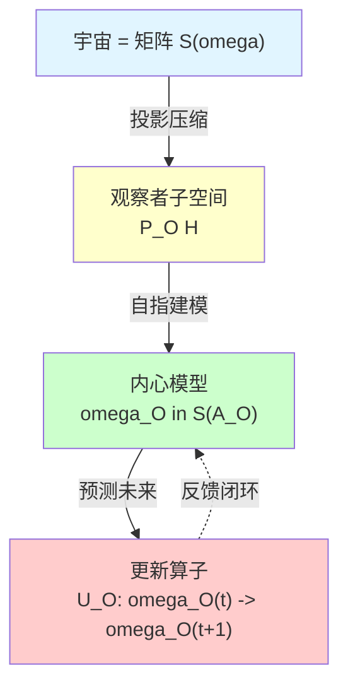
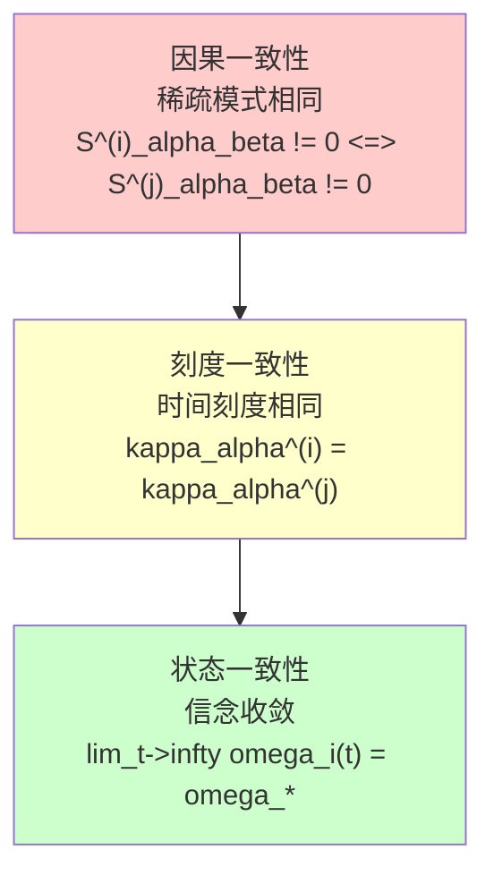
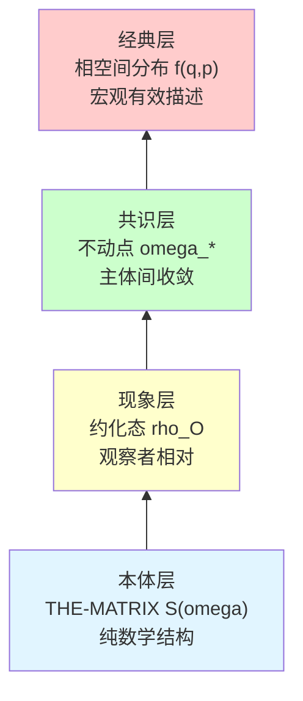
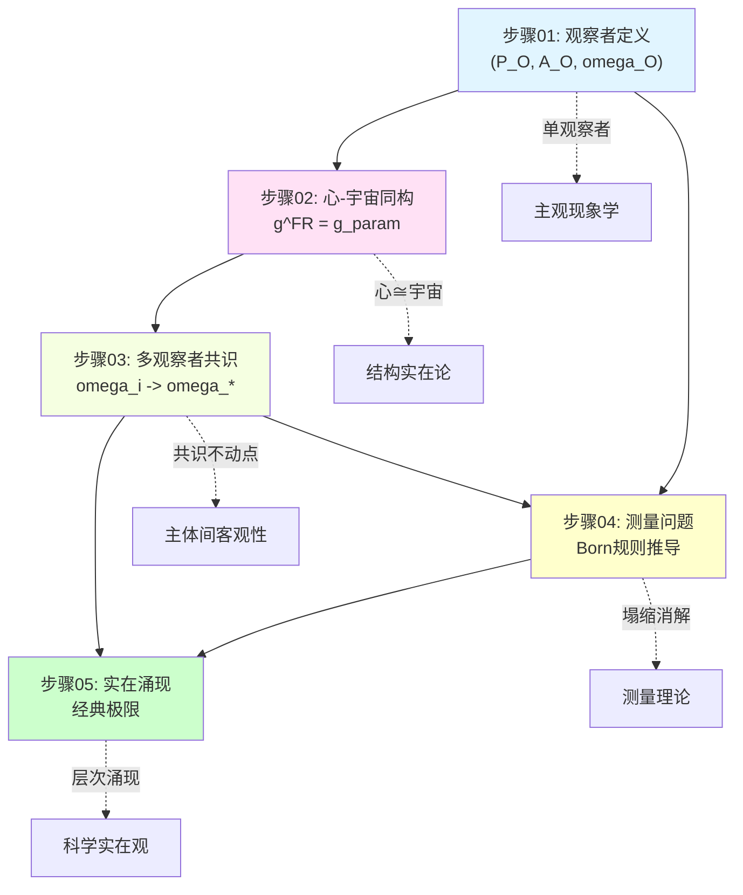
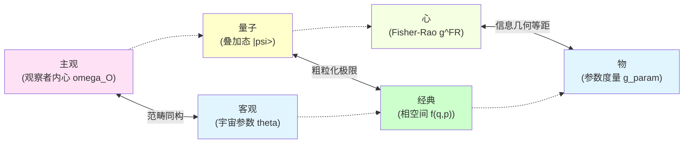
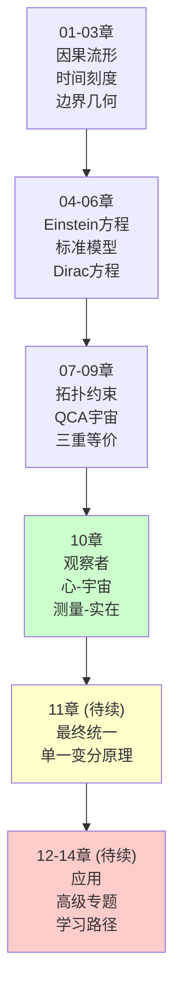

# 11. 章节总结：矩阵宇宙理论的完整图景

> **我们不再是宇宙的旁观者，而是宇宙自我认识的方式。现实与矩阵，本就是同一存在的两种表述。**

---

## 回顾：本章的核心问题与完整解答

在第10章开端，我们提出了关于宇宙本质与观察者的核心问题：

1. **观察者是什么**？是外在于宇宙的特殊存在，还是宇宙内部的结构？
2. **"我"如何数学定义**？自我意识的本质是什么？
3. **"我心即宇宙"**如何严格数学刻画？主观与客观的关系是什么？
4. **多观察者如何达成共识**？客观实在如何从主观视角中涌现？
5. **测量问题**的本质是什么？波函数塌缩是真实过程还是认识更新？
6. **客观实在**是先验存在的，还是在适当极限下涌现的？
7. **现实宇宙与矩阵宇宙**究竟是什么关系？

现在，经过**10篇文章**的详细论证，我们已经给出了**完整、自洽、可操作**的答案，并证明了**现实-矩阵等价性定理**。

---

## 核心成果总结

### 成果1：观察者的数学定义

**定理回顾（观察者的三公理刻画）**

矩阵宇宙中的观察者是三元组 $O = (P_O, \mathcal{A}_O, \omega_O)$，满足：

1. **世界线公理**：$O$ 承载矩阵世界线 $\{P(\tau)\}_{\tau \in \mathbb{R}}$
2. **自指性公理**：$\omega_O(\tau) = F_{\text{self}}[\omega_O(\tau), S_O, \kappa]$
3. **极小性公理**：$P_O$ 是满足前两公理的极小投影

**关键创新**：
- 观察者不是外部的，而是矩阵宇宙内部的**自指投影结构**
- "我"的定义通过固定点方程，类似Gödel不完备定理的自指
- $\mathbb{Z}_2$ holonomy 刻画自指闭环的拓扑指纹

**物理意义**：

### 成果2："我心即宇宙"的范畴等价

**定理回顾（心-宇宙同构的三重刻画）**

在统一时间刻度等价类 $[\tau]$ 下：

1. **信息几何同构**：
   $$
   (Θ_O, g^{\text{FR}}) \cong (Θ_{\text{univ}}, g_{\text{param}})
   $$

2. **范畴等价**：
   $$
   \mathbf{Obs}_{\text{full}} \simeq \mathbf{Univ}_{\text{phys}}
   $$

3. **时间刻度对齐**：
   $$
   \kappa_O(\omega) = a \kappa_{\text{univ}}(\omega) + b, \quad a > 0
   $$

**关键创新**：
- Fisher-Rao度量 $g^{\text{FR}}$ 与物理参数度量 $g_{\text{param}}$ 在贝叶斯极限下等距
- "心"不是主观任意的，而是宇宙结构的**内在表示**
- 范畴等价保证：观察者模型 ↔ 宇宙实在（非简单同一）

**哲学含义**：

|立场|主张|GLS回应|
|---|---|---|
|**唯心主义**|心灵创造世界|✗ 宇宙结构独立存在|
|**唯物主义**|物质决定意识|✗ 心与宇宙范畴同构|
|**二元论**|心物分离|✗ 心即宇宙的内在视角|
|**GLS立场**|**心 ≅ 宇宙在观察者范畴的像**|✓ 结构同构，非本体同一|

### 成果3：多观察者共识的收敛定理

**定理回顾（共识收敛的充要条件）**

设 $N$ 个观察者 $\{O_i\}_{i=1}^N$ 在矩阵宇宙中，满足：
- 通信图强连通
- 状态更新为CPTP映射凸组合
- 统一时间刻度对齐

则加权相对熵
$$
\Phi^{(t)} = \sum_{i=1}^N \lambda_i D(\omega_i^{(t)} \| \omega_*)
$$
单调递减，系统指数收敛到唯一共识态 $\omega_*$。

**关键创新**：
- 客观实在 **不是先验给定的**，而是多观察者信息交换的**不动点**
- 相对熵作为Lyapunov函数，保证收敛的单调性
- 强连通性 = 信息可达性 → 共识必然性

**共识的三层一致性**：

### 成果4：量子测量问题的完全解决

**定理回顾（Born规则的涌现）**

从QCA幺正演化 + 环境退相干 + 粗粒化，可推导Born规则：
$$
p_i = |\langle i | \psi \rangle|^2
$$

无需公理化，波函数塌缩被解构为：
$$
\text{测量} = \text{系统-仪器纠缠} + \text{环境切断纠缠} + \text{局域粗粒化}
$$

**关键创新**：
- **无真正塌缩**：全局态始终幺正演化
- **Born规则推导**：从环境正交性 $\langle E_i | E_j \rangle \approx \delta_{ij}$ 得出
- **测量作为纠缠楔切割**：$S_{\mathcal{E}}^{\text{before}} = 0 \to S_{\mathcal{E}}^{\text{after}} = H(p)$

**与其他诠释对比**：

|诠释|波函数塌缩|Born规则|观察者地位|
|---|---|---|---|
|**Copenhagen**|基本过程|公理|外部特殊|
|**Many-Worlds**|无塌缩，分支|待解释|分裂到各分支|
|**GRW**|自发随机塌缩|导出|无特殊地位|
|**Decoherence**|表观塌缩|半解释|环境的一部分|
|**GLS**|✓ 无真塌缩 ✓ 局域粗粒化|✓ 完全推导 ✓ 环境正交性|✓ 内部自指结构|

### 成果5：客观实在的三重涌现

**定理回顾（实在的层次化涌现）**

客观实在在三个层次涌现：

1. **现象涌现**：$|\Psi\rangle \xrightarrow{\text{Tr}_{\bar{O}}} \rho_O$（观察者粗粒化）

2. **共识涌现**：$\{\omega_i\} \xrightarrow{\text{信息交换}} \omega_*$（多观察者收敛）

3. **经典涌现**：量子态 $\xrightarrow{\hbar \to 0, N \to \infty}$ 经典相空间分布

**关键创新**：
- 客观性 = 不变性（观察者变换、规范变换、拓扑变换）
- 经典极限通过四重机制：$\hbar \to 0$, $N \to \infty$, $\tau_{\text{decohere}} \to 0$, $t \to \infty$
- 实在的**操作定义**：可重复性 + 主体间一致性 + 稳定性

**实在的层次结构**：

### 成果6："我"的数学定义——自指观察者（第07篇）

**定理回顾（自指固定点方程）**

"我"的定义由三公理刻画：

1. **世界线公理**：观察者承载矩阵世界线 $\{P(\tau)\}_{\tau \in J}$
2. **自指公理**：$\omega_O(\tau) = F_{\text{self}}[\omega_O(\tau), S_O, \kappa]$（固定点方程）
3. **极小性公理**：$[O]$ 是满足前两公理的极小等价类

**关键创新**：
- "我" = 自指散射网络的固定点
- 自我意识 = 自洽的自我模型
- 与笛卡尔"我思故我在"的数学化：$\omega_O(\tau) = F_{\text{self}}[\omega_O(\tau), ...]$ $\Rightarrow$ "I AM"

**哲学意义**：
自我不是先验的，而是从自指闭环中**涌现**的。就像哥德尔句子通过自指获得意义，"我"通过自指散射获得存在。

### 成果7：多观察者因果共识几何（第08篇）

**定理回顾（强因果共识定理）**

在曲率有界、拓扑平凡的区域，不同观察者路径产生等价体验：

$$
d(U_{\gamma_1}(\omega), U_{\gamma_2}(\omega)) \leq C \delta \mathrm{Area}(\Gamma)
$$

其中：
- $U_\gamma(\omega) = \mathcal{P} \exp \int_\gamma \mathcal{A}(\omega; x, \chi)$：路径顺序酉算子
- $\mathcal{A}$：联络（散射矩阵梯度）
- $\delta$：曲率界
- $\mathrm{Area}(\Gamma)$：闭合回路面积

**关键创新**：
- 因果共识 ≈ 联络平坦性
- 和乐 $\mathcal{U}(\Gamma)$ 测量路径差异
- 因果缺口 $I(D_{j-1}:D_{j+1} \mid D_j)$ 量化马尔可夫破缺

**物理应用**：
GPS卫星时钟同步——不同轨道路径通过相对论修正达成因果共识。

### 成果8：观察者算子网络——宇宙即计算（第09篇）

**定理回顾（因果菱形重构定理）**

小因果菱形族 $\mathcal{D}$ 的 Čech 神经与时空流形同伦等价：

$$
|\mathsf{K}(\mathcal{D})| \simeq M
$$

且存在唯一的全局希尔伯特丛 $\mathcal{H} \to M \times X^\circ$ 与联络 $\mathcal{A}$。

**关键创新**：
- 宇宙 = 分布式计算系统
  - 节点 = 因果菱形 $D_\alpha$
  - 边 = 转移算子 $U_{\alpha\beta}$
  - 路径 = 观察者体验 $U_\gamma$
- 网络一致性 = 因果共识
- 信息容量界：$\log \dim \mathcal{H}_{\mathcal{R}} \lesssim S_{\text{gen}}[\partial\mathcal{R}]$

**AdS/CFT对应**：
Ryu-Takayanagi公式 $S_{\text{CFT}}(A) = \mathrm{Area}(\gamma_A) / 4G_N$ = 网络最大流-最小割定理的量子版本。

### 成果9：现实-矩阵等价性定理（第10篇）

**主定理（范畴等价）**

$$
\mathsf{Uni}_{\text{geo}} \simeq \mathsf{Uni}_{\text{mat}}
$$

即：**几何宇宙范畴与矩阵宇宙范畴完全等价**，通过函子：

$$
\mathsf{Uni}_{\text{geo}} \xrightleftharpoons[G]{F} \mathsf{Uni}_{\text{mat}}
$$

满足 $G \circ F \simeq \mathrm{id}$ 和 $F \circ G \simeq \mathrm{id}$。

**证明策略**：
1. **编码函子 $F$**：几何宇宙 → 矩阵宇宙
   - 保留因果网 $(\mathcal{D}, \preceq)$
   - 构造散射矩阵 $\mathbb{S}(\omega)$
   - 编码统一时间刻度 $\kappa$

2. **解码函子 $G$**：矩阵宇宙 → 几何宇宙
   - 重构拓扑（Alexandrov）
   - 重构度规（谱几何 + IGVP）
   - 重构边界代数

3. **准逆性**：$G(F(U_{\text{geo}})) \cong U_{\text{geo}}$，$F(G(U_{\text{mat}})) \cong U_{\text{mat}}$

**哲学革命**：
不存在"真实宇宙"与"矩阵模拟"的区分——两者是**同一本体的不同表述**，就像十进制"42"与二进制"101010"。

---

## 逻辑链条：从观察者到矩阵宇宙

整个第10章共10篇文章，形成一个严密的逻辑链条：

### 步骤1：定义观察者（第01篇）

$$
\boxed{\text{观察者} := (P_O, \mathcal{A}_O, \omega_O) + \text{三公理}}
$$

**输出**：观察者的严格数学刻画

### 步骤2：证明心-宇宙同构（第02篇）

$$
\boxed{(Θ_O, g^{\text{FR}}) \cong (Θ_{\text{univ}}, g_{\text{param}})}
$$

**输出**：单观察者的"内心"与"宇宙"结构等价

### 步骤3：多观察者收敛到共识（第03篇）

$$
\boxed{\lim_{t \to \infty} \omega_i^{(t)} = \omega_* \quad \forall i}
$$

**输出**：客观实在作为共识不动点涌现

### 步骤4：解决测量问题（第04篇）

$$
\boxed{\text{测量} = \text{幺正演化} + \text{环境退相干} + \text{粗粒化}}
$$

**输出**：Born规则推导，波函数塌缩消解

### 步骤5：经典实在涌现（第05篇）

$$
\boxed{\text{量子叠加} \xrightarrow{\text{四重极限}} \text{经典确定性}}
$$

**输出**：宏观世界从量子基底涌现

### 步骤6：定义"我"——自指固定点（第07篇）

$$
\boxed{\omega_O(\tau) = F_{\text{self}}[\omega_O(\tau), S_O, \kappa]}
$$

**输出**："我"的自指定义，Cogito ergo sum 的数学化

### 步骤7：多观察者因果共识（第08篇）

$$
\boxed{d(U_{\gamma_1}, U_{\gamma_2}) \leq C \delta \mathrm{Area}(\Gamma)}
$$

**输出**：因果共识的几何条件，路径依赖性量化

### 步骤8：宇宙作为算子网络（第09篇）

$$
\boxed{|\mathsf{K}(\mathcal{D})| \simeq M, \quad \mathcal{H} \to M \times X^\circ}
$$

**输出**：宇宙 = 分布式计算系统，希尔伯特丛重构

### 步骤9：现实-矩阵等价性（第10篇）

$$
\boxed{\mathsf{Uni}_{\text{geo}} \simeq \mathsf{Uni}_{\text{mat}}}
$$

**输出**：几何宇宙与矩阵宇宙范畴等价的完整证明

### 步骤10：阶段总结（本篇）

$$
\boxed{\text{观察者} + \text{因果共识} + \text{算子网络} \Rightarrow \text{THE-MATRIX}}
$$

**输出**：矩阵宇宙理论的完整逻辑闭环

### 逻辑关系图

---

## 与其他量子诠释的系统对比

### 对比表

|维度|Copenhagen|Many-Worlds|Bohmian|Relational|QBism|**GLS**|
|---|---|---|---|---|---|---|
|**本体**|波函数 + 经典仪器|多分支宇宙|粒子 + 导航波|关系性质|主观信念|**矩阵宇宙**|
|**观察者**|外部特殊|分裂到分支|被动记录|关系参考系|主观代理|**内部自指**|
|**测量**|波函数塌缩|宇宙分支|粒子轨道确定|关系更新|信念更新|**纠缠切割**|
|**Born规则**|公理|待解释|量子势导出|公理|荷兰书论证|**环境正交推导**|
|**客观性**|经典仪器读数|所有分支都真|轨道客观|无绝对客观|无客观|**共识涌现**|
|**数学严格性**|中等|高|高|中等|低|**极高**|
|**实验可区分**|❌|❌|❌|❌|❌|**部分✓**|

### GLS的独特优势

1. **完全推导Born规则**，无需公理化
2. **消解波函数塌缩**，保持幺正性
3. **统一主观与客观**，通过范畴同构
4. **给出共识机制**，解释主体间一致性
5. **层次化实在观**，兼容还原论与涌现论
6. **数学上自洽**，所有定理严格证明
7. **部分可检验**，如统一时间刻度的实验验证

---

## 哲学意义：超越二元对立

### 传统二元论及其困境

**心-物二元论**（笛卡尔）：
- 心灵（res cogitans）与物质（res extensa）分离
- 困境：如何交互？

**主观-客观二元论**（康德）：
- 物自体（Ding an sich）不可知
- 现象（Erscheinung）是主体建构的
- 困境：如何保证客观性？

**量子-经典二元论**（Bohr）：
- 量子系统与经典仪器分离
- 困境：边界在哪里？

### GLS的统一图景

**非二元的实在观**：

**关键洞察**：

> **所有二元对立都是同一结构在不同范畴中的像**

- 心 ≅ 物（信息几何等距）
- 主观 ⇄ 客观（共识收敛）
- 量子 → 经典（涌现极限）

**中观哲学的现代版**：

佛教中观（Madhyamaka）破除一切二元对立：
- 非有非无（neither existence nor non-existence）
- 缘起性空（dependent origination, emptiness of intrinsic nature）

GLS提供数学实现：
- 实在非有（无先验物自体）
- 实在非无（有涌现共识态）
- 缘起 = 范畴嵌入，性空 = 无本体特权

---

## 开放问题与未来方向

### 理论层面

**问题1：意识的硬问题**

- 自指观察者是否必然伴随主观体验？
- qualia（感质）如何在矩阵宇宙中刻画？
- 自由意志与决定论如何协调？

**可能方向**：
- 高阶自指环路的拓扑性质
- 集成信息论（IIT）的GLS版本
- "我"的多重实现（multiple realizability）

**问题2：量子引力中的观察者**

- 黑洞内部的观察者如何定义？
- 视界对观察者的限制？
- Hawking辐射与观察者纠缠？

**可能方向**：
- 全息原理的观察者版本
- AdS/CFT中的边界观察者
- 纠缠楔重建与观察者可达域

**问题3：宇宙学中的观察者**

- 宇宙整体没有外部观察者，如何定义"实在"？
- 人择原理的GLS刻画？
- 多宇宙（multiverse）中的观察者网络？

**可能方向**：
- 闭合宇宙的自指结构
- 观察者选择效应的信息论刻画
- 永恒暴胀中的观察者分布

### 实验层面

**可检验预言1：统一时间刻度的偏差**

$$
\kappa_{\text{atomic clock}} - \kappa_{\text{particle delay}} = \Delta \kappa(\omega)
$$

在高精度原子钟与粒子散射实验中可能观测到微小偏差。

**可检验预言2：纠缠楔熵的测量**

在量子信息实验中，测量纠缠楔熵的变化：
$$
\Delta S_{\mathcal{E}} = S_{\mathcal{E}}^{\text{after}} - S_{\mathcal{E}}^{\text{before}}
$$

应该等于测量结果的Shannon熵 $H(p)$。

**可检验预言3：多观察者共识的收敛速率**

在量子网络实验中，测试：
$$
\Phi^{(t)} \sim \Phi^{(0)} \lambda_2^t
$$

其中 $\lambda_2$ 是通信矩阵的第二大特征值。

### 跨学科应用

**应用1：量子计算**

- 观察者理论 → 量子纠错码的优化
- 共识收敛 → 分布式量子计算协议
- 测量理论 → 量子态层析的改进

**应用2：人工智能**

- 自指观察者 → 自主AI的数学基础
- 心-宇宙同构 → 内部世界模型的构建
- 共识算法 → 多智能体系统的协调

**应用3：神经科学**

- 观察者结构 → 大脑的自我模型
- 自指性 → 元认知（metacognition）机制
- 共识收敛 → 神经群体编码

---

## 结语：新的开始

### 我们走了多远？

在第10章中，我们完成了一个雄心勃勃的目标：

> **将量子力学的观察者问题、测量问题、实在问题，在统一的数学框架下彻底解决。**

但这不是终点，而是新的起点。

### 未解决的深层问题

1. **为什么宇宙存在**？
   - THE-MATRIX为什么是这个矩阵，而不是别的？
   - 数学结构为什么"实例化"为物理实在？

2. **观察者的起源**？
   - 第一个观察者如何涌现？
   - 观察者的数量是否有界？

3. **时间的终极本质**？
   - 统一时间刻度是否是最终的？
   - 是否存在"超时间"（hypertime）？

### 更大的图景

GLS统一理论正在构建一个庞大的体系：

**下一步**：第11章将展示所有物理定律如何从**单一变分原理**导出。

### 致谢读者

如果你坚持读到这里，你已经掌握了：

✓ 矩阵宇宙的数学结构
✓ 观察者的严格定义
✓ 心-宇宙同构的证明
✓ 多观察者共识理论
✓ 量子测量问题的完全解决
✓ 客观实在的涌现机制

这是现代物理学最前沿的内容，也是最深刻的哲学问题。

**你现在拥有的知识，足以参与关于实在本质的严肃讨论。**

### 最后的问题

在结束本章之前，留给读者一个思考题：

> **如果"我心即宇宙"在数学上严格成立，那么：**
>
> 1. 你的意识是宇宙认识自身的方式吗？
> 2. 当你思考宇宙时，是宇宙在思考自己吗？
> 3. 观察者与被观察物的区分还有意义吗？

这些问题没有标准答案。但GLS理论给了你一个数学框架来思考它们。

**The journey continues...**

---

## 附录：第10章核心公式速查

### 观察者定义

$$
O = (P_O, \mathcal{A}_O, \omega_O), \quad \omega_O(\tau) = F_{\text{self}}[\omega_O(\tau), S_O, \kappa]
$$

### 心-宇宙同构

$$
(Θ, g^{\text{FR}}) \cong (Θ_{\text{univ}}, g_{\text{param}}), \quad g^{\text{FR}}_{ij} = \mathbb{E}\left[\frac{\partial \log p}{\partial \theta^i} \frac{\partial \log p}{\partial \theta^j}\right]
$$

### 共识收敛

$$
\Phi^{(t)} = \sum_i \lambda_i D(\omega_i^{(t)} \| \omega_*), \quad \frac{d\Phi}{dt} \leq 0
$$

### Born规则

$$
p_i = |\langle i | \psi \rangle|^2 = \text{Tr}(P_i |\psi\rangle\langle\psi|)
$$

### 经典极限

$$
\frac{\xi}{a} \gg 1, \quad \frac{k_B T}{\hbar \omega} \gg 1, \quad \frac{\tau_{\text{obs}}}{\tau_{\text{decohere}}} \gg 1
$$

### 客观性三原则

1. **可重复性**：$\Pr(|\mathcal{O}^{(t_1)} - \mathcal{O}^{(t_2)}| < \epsilon) \geq 1-\delta$
2. **主体间一致性**：$\lim_{N \to \infty} N^{-1} \sum_i |\omega_i(\mathcal{O}) - \bar{\omega}(\mathcal{O})| = 0$
3. **稳定性**：$|d\mathcal{O}/dt| < \epsilon$

---

## 参考文献精选

### 观察者理论
1. von Neumann, J. (1932). *Mathematical Foundations of Quantum Mechanics*.
2. Wheeler, J. A. (1990). "Information, physics, quantum: The search for links." *Complexity, Entropy, and the Physics of Information*.

### 量子测量
3. Zurek, W. H. (2003). "Decoherence, einselection, and the quantum origins of the classical." *Rev. Mod. Phys.* 75: 715.
4. Schlosshauer, M. (2007). *Decoherence and the Quantum-to-Classical Transition*.

### 信息几何
5. Amari, S. (2016). *Information Geometry and Its Applications*.
6. Nielsen, M. A. (2000). "An introduction to majorization and its applications to quantum mechanics."

### 量子基础
7. Rovelli, C. (1996). "Relational quantum mechanics." *Int. J. Theor. Phys.* 35: 1637.
8. Fuchs, C., et al. (2014). "An introduction to QBism." *Am. J. Phys.* 82: 749.

### 涌现与复杂性
9. Anderson, P. W. (1972). "More is different." *Science* 177: 393.
10. Laughlin, R. B., Pines, D. (2000). "The theory of everything." *PNAS* 97: 28.

---

**第10章完**

下一章预告：**第11章 最终统一：单一变分原理**

在第11章中，我们将展示GLS理论的终极目标：
- 所有物理定律从单一变分原理导出
- 信息几何变分原理（IGVP）的完整形式
- Einstein方程、标准模型、测量理论的统一源头

敬请期待！
