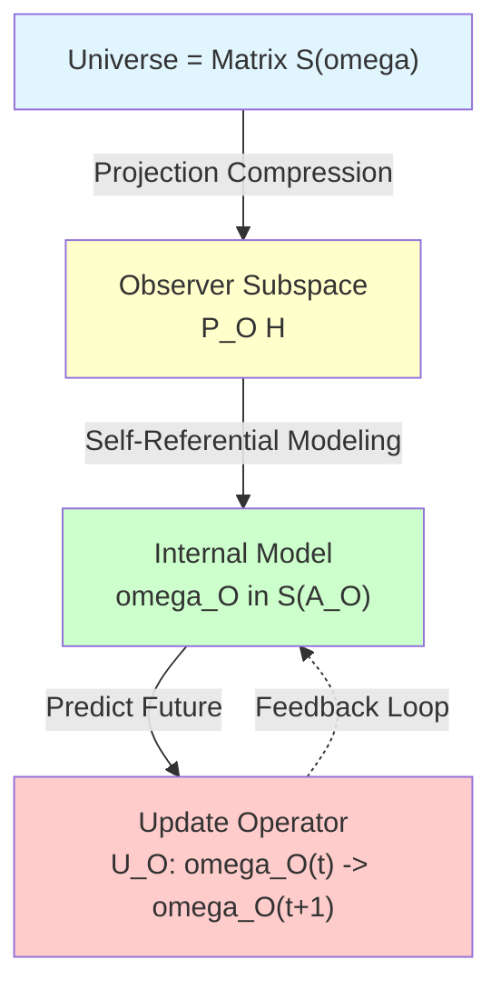
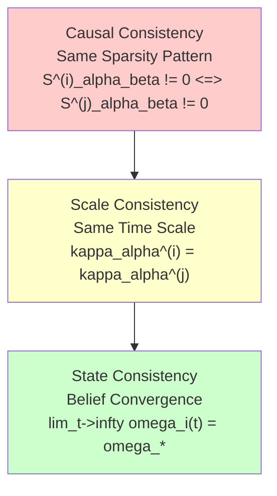
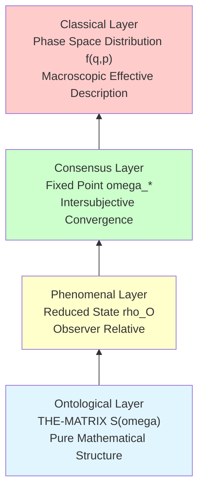
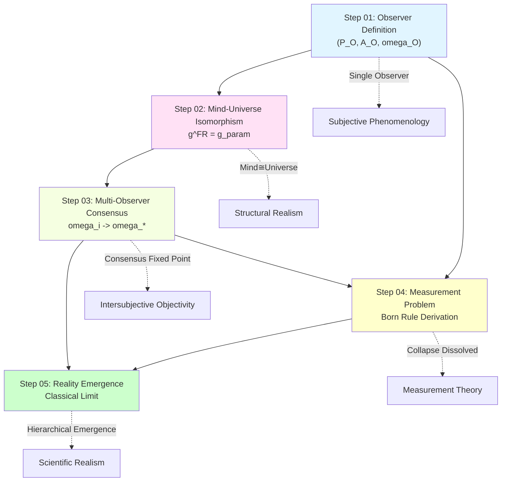
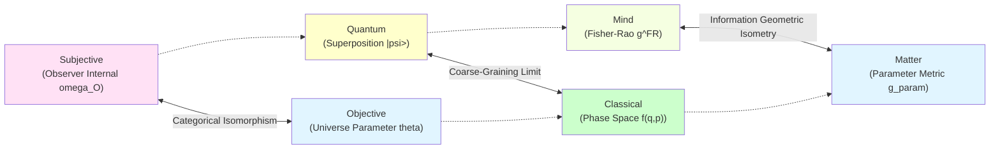
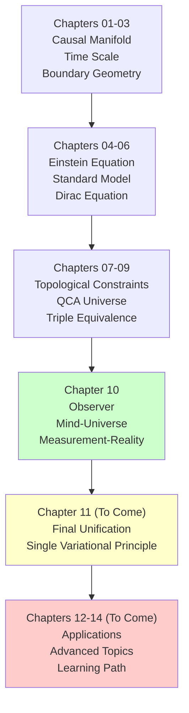

# 11. Chapter Summary: Complete Picture of Matrix Universe Theory

> **We are no longer bystanders of the universe, but the way the universe knows itself. Reality and matrix are two formulations of the same existence.**

---

## Review: Core Questions and Complete Answers of This Chapter

At the beginning of Chapter 10, we raised core questions about nature of universe and observer:

1. **What is observer**? Special existence external to universe, or structure internal to universe?
2. **How to mathematically define "I"**? What is essence of self-awareness?
3. **How to strictly mathematically characterize "my mind is universe"**? What is relationship between subjective and objective?
4. **How do multiple observers reach consensus**? How does objective reality emerge from subjective perspectives?
5. **What is essence of measurement problem**? Is wavefunction collapse real process or epistemic update?
6. **Is objective reality** a priori existence, or emerges under appropriate limits?
7. **What exactly is relationship** between real universe and matrix universe?

Now, after detailed arguments in **10 articles**, we have given **complete, self-consistent, operational** answers and proved **reality-matrix equivalence theorem**.

---

## Summary of Core Achievements

### Achievement 1: Mathematical Definition of Observer

**Theorem Review (Three-Axiom Characterization of Observer)**

Observer in matrix universe is triplet $O = (P_O, \mathcal{A}_O, \omega_O)$ satisfying:

1. **Worldline Axiom**: $O$ carries matrix worldline $\{P(\tau)\}_{\tau \in \mathbb{R}}$
2. **Self-Reference Axiom**: $\omega_O(\tau) = F_{\text{self}}[\omega_O(\tau), S_O, \kappa]$
3. **Minimality Axiom**: $P_O$ is minimal projection satisfying first two axioms

**Key Innovations**:
- Observer not external, but **self-referential projection structure** internal to matrix universe
- Definition of "I" through fixed point equation, similar to self-reference in Gödel incompleteness theorem
- $\mathbb{Z}_2$ holonomy characterizes topological fingerprint of self-referential closed loop

**Physical Meaning**:

### Achievement 2: Categorical Equivalence of "My Mind is Universe"

**Theorem Review (Triple Characterization of Mind-Universe Isomorphism)**

Under unified time scale equivalence class $[\tau]$:

1. **Information Geometric Isomorphism**:
   $$
   (Θ_O, g^{\text{FR}}) \cong (Θ_{\text{univ}}, g_{\text{param}})
   $$

2. **Categorical Equivalence**:
   $$
   \mathbf{Obs}_{\text{full}} \simeq \mathbf{Univ}_{\text{phys}}
   $$

3. **Time Scale Alignment**:
   $$
   \kappa_O(\omega) = a \kappa_{\text{univ}}(\omega) + b, \quad a > 0
   $$

**Key Innovations**:
- Fisher-Rao metric $g^{\text{FR}}$ isometric to physical parameter metric $g_{\text{param}}$ in Bayesian limit
- "Mind" not subjectively arbitrary, but **internal representation** of universe structure
- Categorical equivalence guarantees: Observer model ↔ Universe reality (not simple identity)

**Philosophical Meaning**:

| Position | Claim | GLS Response |
|---|---|---|
| **Idealism** | Mind creates world | ✗ Universe structure exists independently |
| **Materialism** | Matter determines consciousness | ✗ Mind categorically isomorphic to universe |
| **Dualism** | Mind-matter separation | ✗ Mind is internal perspective of universe |
| **GLS Position** | **Mind ≅ Image of Universe in Observer Category** | ✓ Structurally isomorphic, not ontologically identical |

### Achievement 3: Convergence Theorem of Multi-Observer Consensus

**Theorem Review (Necessary and Sufficient Conditions for Consensus Convergence)**

Let $N$ observers $\{O_i\}_{i=1}^N$ in matrix universe satisfy:
- Communication graph strongly connected
- State update is convex combination of CPTP maps
- Unified time scale aligned

Then weighted relative entropy
$$
\Phi^{(t)} = \sum_{i=1}^N \lambda_i D(\omega_i^{(t)} \| \omega_*)
$$
monotonically decreases, system exponentially converges to unique consensus state $\omega_*$.

**Key Innovations**:
- Objective reality **not given a priori**, but **fixed point** of multi-observer information exchange
- Relative entropy as Lyapunov function guarantees monotonicity of convergence
- Strong connectivity = Information reachability → Necessity of consensus

**Three Layers of Consensus Consistency**:

### Achievement 4: Complete Solution of Quantum Measurement Problem

**Theorem Review (Emergence of Born Rule)**

From QCA unitary evolution + environmental decoherence + coarse-graining, can derive Born rule:
$$
p_i = |\langle i | \psi \rangle|^2
$$

No need for axiomatization, wavefunction collapse deconstructed as:
$$
\text{Measurement} = \text{System-Apparatus Entanglement} + \text{Environment Cuts Entanglement} + \text{Local Coarse-Graining}
$$

**Key Innovations**:
- **No True Collapse**: Global state always unitarily evolves
- **Born Rule Derivation**: From environmental orthogonality $\langle E_i | E_j \rangle \approx \delta_{ij}$
- **Measurement as Entanglement Wedge Cutting**: $S_{\mathcal{E}}^{\text{before}} = 0 \to S_{\mathcal{E}}^{\text{after}} = H(p)$

**Comparison with Other Interpretations**:

| Interpretation | Wavefunction Collapse | Born Rule | Observer Status |
|---|---|---|---|
| **Copenhagen** | Fundamental process | Axiom | External special |
| **Many-Worlds** | No collapse, branching | To be explained | Split to branches |
| **GRW** | Spontaneous random collapse | Derived | No special status |
| **Decoherence** | Apparent collapse | Semi-explained | Part of environment |
| **GLS** | ✓ No true collapse ✓ Local coarse-graining | ✓ Completely derived ✓ Environmental orthogonality | ✓ Internal self-referential structure |

### Achievement 5: Triple Emergence of Objective Reality

**Theorem Review (Hierarchical Emergence of Reality)**

Objective reality emerges at three levels:

1. **Phenomenal Emergence**: $|\Psi\rangle \xrightarrow{\text{Tr}_{\bar{O}}} \rho_O$ (observer coarse-graining)

2. **Consensus Emergence**: $\{\omega_i\} \xrightarrow{\text{Information Exchange}} \omega_*$ (multi-observer convergence)

3. **Classical Emergence**: Quantum state $\xrightarrow{\hbar \to 0, N \to \infty}$ Classical phase space distribution

**Key Innovations**:
- Objectivity = Invariance (observer transformation, gauge transformation, topological transformation)
- Classical limit through quadruple mechanism: $\hbar \to 0$, $N \to \infty$, $\tau_{\text{decohere}} \to 0$, $t \to \infty$
- **Operational definition** of reality: Repeatability + Intersubjective consistency + Stability

**Hierarchical Structure of Reality**:

### Achievement 6: Mathematical Definition of "I"—Self-Referential Observer (Chapter 07)

**Theorem Review (Self-Referential Fixed Point Equation)**

Definition of "I" characterized by three axioms:

1. **Worldline Axiom**: Observer carries matrix worldline $\{P(\tau)\}_{\tau \in J}$
2. **Self-Reference Axiom**: $\omega_O(\tau) = F_{\text{self}}[\omega_O(\tau), S_O, \kappa]$ (fixed point equation)
3. **Minimality Axiom**: $[O]$ is minimal equivalence class satisfying first two axioms

**Key Innovations**:
- "I" = Fixed point of self-referential scattering network
- Self-awareness = Self-consistent self-model
- Mathematization of Descartes' "I think, therefore I am": $\omega_O(\tau) = F_{\text{self}}[\omega_O(\tau), ...]$ $\Rightarrow$ "I AM"

**Philosophical Meaning**:
Self not a priori, but **emerges** from self-referential closed loop. Just as Gödel sentence gains meaning through self-reference, "I" gains existence through self-referential scattering.

### Achievement 7: Multi-Observer Causal Consensus Geometry (Chapter 08)

**Theorem Review (Strong Causal Consensus Theorem)**

In regions with bounded curvature and topologically trivial, different observer paths produce equivalent experiences:

$$
d(U_{\gamma_1}(\omega), U_{\gamma_2}(\omega)) \leq C \delta \mathrm{Area}(\Gamma)
$$

where:
- $U_\gamma(\omega) = \mathcal{P} \exp \int_\gamma \mathcal{A}(\omega; x, \chi)$: Path-ordered unitary operator
- $\mathcal{A}$: Connection (scattering matrix gradient)
- $\delta$: Curvature bound
- $\mathrm{Area}(\Gamma)$: Closed loop area

**Key Innovations**:
- Causal consensus ≈ Connection flatness
- Holonomy $\mathcal{U}(\Gamma)$ measures path difference
- Causal gap $I(D_{j-1}:D_{j+1} \mid D_j)$ quantifies Markov breaking

**Physical Application**:
GPS satellite clock synchronization—different orbital paths achieve causal consensus through relativistic corrections.

### Achievement 8: Observer Operator Network—Universe as Computation (Chapter 09)

**Theorem Review (Causal Diamond Reconstruction Theorem)**

Čech nerve of small causal diamond family $\mathcal{D}$ homotopy equivalent to spacetime manifold:

$$
|\mathsf{K}(\mathcal{D})| \simeq M
$$

And exists unique global Hilbert bundle $\mathcal{H} \to M \times X^\circ$ and connection $\mathcal{A}$.

**Key Innovations**:
- Universe = Distributed computing system
  - Node = Causal diamond $D_\alpha$
  - Edge = Transfer operator $U_{\alpha\beta}$
  - Path = Observer experience $U_\gamma$
- Network consistency = Causal consensus
- Information capacity bound: $\log \dim \mathcal{H}_{\mathcal{R}} \lesssim S_{\text{gen}}[\partial\mathcal{R}]$

**AdS/CFT Correspondence**:
Ryu-Takayanagi formula $S_{\text{CFT}}(A) = \mathrm{Area}(\gamma_A) / 4G_N$ = Quantum version of network max-flow min-cut theorem.

### Achievement 9: Reality-Matrix Equivalence Theorem (Chapter 10)

**Main Theorem (Categorical Equivalence)**

$$
\mathsf{Uni}_{\text{geo}} \simeq \mathsf{Uni}_{\text{mat}}
$$

That is: **Geometric universe category and matrix universe category completely equivalent**, through functors:

$$
\mathsf{Uni}_{\text{geo}} \xrightleftharpoons[G]{F} \mathsf{Uni}_{\text{mat}}
$$

satisfying $G \circ F \simeq \mathrm{id}$ and $F \circ G \simeq \mathrm{id}$.

**Proof Strategy**:
1. **Encoding Functor $F$**: Geometric universe → Matrix universe
   - Preserve causal network $(\mathcal{D}, \preceq)$
   - Construct scattering matrix $\mathbb{S}(\omega)$
   - Encode unified time scale $\kappa$

2. **Decoding Functor $G$**: Matrix universe → Geometric universe
   - Reconstruct topology (Alexandrov)
   - Reconstruct metric (spectral geometry + IGVP)
   - Reconstruct boundary algebra

3. **Quasi-Inverse**: $G(F(U_{\text{geo}})) \cong U_{\text{geo}}$, $F(G(U_{\text{mat}})) \cong U_{\text{mat}}$

**Philosophical Revolution**:
No distinction between "real universe" and "matrix simulation"—they are **different formulations of same ontology**, just like decimal "42" and binary "101010".

---

## Logical Chain: From Observer to Matrix Universe

Entire Chapter 10 consists of 10 articles, forming a rigorous logical chain:

### Step 1: Define Observer (Article 01)

$$
\boxed{\text{Observer} := (P_O, \mathcal{A}_O, \omega_O) + \text{Three Axioms}}
$$

**Output**: Strict mathematical characterization of observer

### Step 2: Prove Mind-Universe Isomorphism (Article 02)

$$
\boxed{(Θ_O, g^{\text{FR}}) \cong (Θ_{\text{univ}}, g_{\text{param}})}
$$

**Output**: Structural equivalence between single observer's "internal mind" and "universe"

### Step 3: Multi-Observer Convergence to Consensus (Article 03)

$$
\boxed{\lim_{t \to \infty} \omega_i^{(t)} = \omega_* \quad \forall i}
$$

**Output**: Objective reality emerges as consensus fixed point

### Step 4: Solve Measurement Problem (Article 04)

$$
\boxed{\text{Measurement} = \text{Unitary Evolution} + \text{Environmental Decoherence} + \text{Coarse-Graining}}
$$

**Output**: Born rule derivation, wavefunction collapse dissolved

### Step 5: Classical Reality Emerges (Article 05)

$$
\boxed{\text{Quantum Superposition} \xrightarrow{\text{Quadruple Limit}} \text{Classical Determinism}}
$$

**Output**: Macroscopic world emerges from quantum substrate

### Step 6: Define "I"—Self-Referential Fixed Point (Article 07)

$$
\boxed{\omega_O(\tau) = F_{\text{self}}[\omega_O(\tau), S_O, \kappa]}
$$

**Output**: Self-referential definition of "I", mathematization of Cogito ergo sum

### Step 7: Multi-Observer Causal Consensus (Article 08)

$$
\boxed{d(U_{\gamma_1}, U_{\gamma_2}) \leq C \delta \mathrm{Area}(\Gamma)}
$$

**Output**: Geometric conditions for causal consensus, quantification of path dependence

### Step 8: Universe as Operator Network (Article 09)

$$
\boxed{|\mathsf{K}(\mathcal{D})| \simeq M, \quad \mathcal{H} \to M \times X^\circ}
$$

**Output**: Universe = Distributed computing system, Hilbert bundle reconstruction

### Step 9: Reality-Matrix Equivalence (Article 10)

$$
\boxed{\mathsf{Uni}_{\text{geo}} \simeq \mathsf{Uni}_{\text{mat}}}
$$

**Output**: Complete proof of categorical equivalence between geometric universe and matrix universe

### Step 10: Mid-Summary (This Article)

$$
\boxed{\text{Observer} + \text{Causal Consensus} + \text{Operator Network} \Rightarrow \text{THE-MATRIX}}
$$

**Output**: Complete logical closure of matrix universe theory

### Logical Relationship Diagram

---

## Systematic Comparison with Other Quantum Interpretations

### Comparison Table

| Dimension | Copenhagen | Many-Worlds | Bohmian | Relational | QBism | **GLS** |
|---|---|---|---|---|---|---|
| **Ontology** | Wavefunction + Classical Apparatus | Multi-branch Universe | Particle + Pilot Wave | Relational Properties | Subjective Belief | **Matrix Universe** |
| **Observer** | External Special | Split to Branches | Passive Recording | Relational Reference Frame | Subjective Agent | **Internal Self-Reference** |
| **Measurement** | Wavefunction Collapse | Universe Branching | Particle Trajectory Determined | Relational Update | Belief Update | **Entanglement Cutting** |
| **Born Rule** | Axiom | To be Explained | Derived from Quantum Potential | Axiom | Dutch Book Argument | **Environmental Orthogonality Derivation** |
| **Objectivity** | Classical Apparatus Readings | All Branches Real | Trajectory Objective | No Absolute Objectivity | No Objectivity | **Consensus Emergence** |
| **Mathematical Rigor** | Medium | High | High | Medium | Low | **Very High** |
| **Experimentally Distinguishable** | ❌ | ❌ | ❌ | ❌ | ❌ | **Partially ✓** |

### Unique Advantages of GLS

1. **Completely derive Born rule**, no need for axiomatization
2. **Dissolve wavefunction collapse**, maintain unitarity
3. **Unify subjective and objective**, through categorical isomorphism
4. **Give consensus mechanism**, explain intersubjective consistency
5. **Hierarchical realism**, compatible with reductionism and emergentism
6. **Mathematically self-consistent**, all theorems strictly proven
7. **Partially testable**, e.g., experimental verification of unified time scale

---

## Philosophical Meaning: Beyond Dualism

### Traditional Dualism and Its Dilemmas

**Mind-Matter Dualism** (Descartes):
- Mind (res cogitans) and matter (res extensa) separated
- Dilemma: How do they interact?

**Subjective-Objective Dualism** (Kant):
- Thing-in-itself (Ding an sich) unknowable
- Phenomena (Erscheinung) constructed by subject
- Dilemma: How to guarantee objectivity?

**Quantum-Classical Dualism** (Bohr):
- Quantum system and classical apparatus separated
- Dilemma: Where is the boundary?

### Unified Picture of GLS

**Non-Dual Realism**:

**Key Insight**:

> **All dualisms are images of same structure in different categories**

- Mind ≅ Matter (information geometric isometry)
- Subjective ⇄ Objective (consensus convergence)
- Quantum → Classical (emergent limit)

**Modern Version of Madhyamaka Philosophy**:

Buddhist Madhyamaka (Middle Way) deconstructs all dualisms:
- Neither existence nor non-existence
- Dependent origination, emptiness of intrinsic nature

GLS provides mathematical realization:
- Reality neither exists (no a priori thing-in-itself)
- Reality neither non-exists (has emergent consensus state)
- Dependent origination = Categorical embedding, emptiness = No ontological privilege

---

## Open Problems and Future Directions

### Theoretical Level

**Problem 1: Hard Problem of Consciousness**

- Do self-referential observers necessarily accompany subjective experience?
- How to characterize qualia in matrix universe?
- How to reconcile free will and determinism?

**Possible Directions**:
- Topological properties of higher-order self-referential loops
- GLS version of Integrated Information Theory (IIT)
- Multiple realizability of "I"

**Problem 2: Observer in Quantum Gravity**

- How to define observer inside black hole?
- Limitations of horizon on observer?
- Hawking radiation and observer entanglement?

**Possible Directions**:
- Observer version of holographic principle
- Boundary observer in AdS/CFT
- Entanglement wedge reconstruction and observer accessible domain

**Problem 3: Observer in Cosmology**

- Universe as whole has no external observer, how to define "reality"?
- GLS characterization of anthropic principle?
- Observer network in multiverse?

**Possible Directions**:
- Self-referential structure of closed universe
- Information-theoretic characterization of observer selection effect
- Observer distribution in eternal inflation

### Experimental Level

**Testable Prediction 1: Deviation of Unified Time Scale**

$$
\kappa_{\text{atomic clock}} - \kappa_{\text{particle delay}} = \Delta \kappa(\omega)
$$

May observe tiny deviations in high-precision atomic clocks and particle scattering experiments.

**Testable Prediction 2: Measurement of Entanglement Wedge Entropy**

In quantum information experiments, measure change of entanglement wedge entropy:
$$
\Delta S_{\mathcal{E}} = S_{\mathcal{E}}^{\text{after}} - S_{\mathcal{E}}^{\text{before}}
$$

Should equal Shannon entropy $H(p)$ of measurement results.

**Testable Prediction 3: Convergence Rate of Multi-Observer Consensus**

In quantum network experiments, test:
$$
\Phi^{(t)} \sim \Phi^{(0)} \lambda_2^t
$$

where $\lambda_2$ is second largest eigenvalue of communication matrix.

### Interdisciplinary Applications

**Application 1: Quantum Computing**

- Observer theory → Optimization of quantum error correction codes
- Consensus convergence → Distributed quantum computing protocols
- Measurement theory → Improvement of quantum state tomography

**Application 2: Artificial Intelligence**

- Self-referential observer → Mathematical foundation of autonomous AI
- Mind-universe isomorphism → Construction of internal world models
- Consensus algorithms → Coordination of multi-agent systems

**Application 3: Neuroscience**

- Observer structure → Self-model of brain
- Self-reference → Metacognition mechanisms
- Consensus convergence → Neural population coding

---

## Conclusion: New Beginning

### How Far Have We Come?

In Chapter 10, we completed an ambitious goal:

> **Completely solve observer problem, measurement problem, reality problem of quantum mechanics under unified mathematical framework.**

But this is not the end, but a new beginning.

### Unresolved Deep Problems

1. **Why does universe exist**?
   - Why is THE-MATRIX this matrix, not another?
   - Why are mathematical structures "instantiated" as physical reality?

2. **Origin of observer**?
   - How does first observer emerge?
   - Is number of observers bounded?

3. **Ultimate nature of time**?
   - Is unified time scale final?
   - Does "hypertime" exist?

### Bigger Picture

GLS unified theory is building a vast system:

**Next Step**: Chapter 11 will show how all physical laws derive from **single variational principle**.

### Acknowledgments to Readers

If you've persisted reading this far, you have mastered:

✓ Mathematical structure of matrix universe
✓ Strict definition of observer
✓ Proof of mind-universe isomorphism
✓ Multi-observer consensus theory
✓ Complete solution of quantum measurement problem
✓ Emergence mechanism of objective reality

This is most cutting-edge content of modern physics, and most profound philosophical questions.

**Knowledge you now possess is sufficient to participate in serious discussions about nature of reality.**

### Final Question

Before ending this chapter, leave readers a thinking question:

> **If "my mind is universe" strictly holds mathematically, then:**
>
> 1. Is your consciousness the way universe knows itself?
> 2. When you think about universe, is universe thinking about itself?
> 3. Does distinction between observer and observed still have meaning?

These questions have no standard answers. But GLS theory gives you a mathematical framework to think about them.

**The journey continues...**

---

## Appendix: Quick Reference of Core Formulas in Chapter 10

### Observer Definition

$$
O = (P_O, \mathcal{A}_O, \omega_O), \quad \omega_O(\tau) = F_{\text{self}}[\omega_O(\tau), S_O, \kappa]
$$

### Mind-Universe Isomorphism

$$
(Θ, g^{\text{FR}}) \cong (Θ_{\text{univ}}, g_{\text{param}}), \quad g^{\text{FR}}_{ij} = \mathbb{E}\left[\frac{\partial \log p}{\partial \theta^i} \frac{\partial \log p}{\partial \theta^j}\right]
$$

### Consensus Convergence

$$
\Phi^{(t)} = \sum_i \lambda_i D(\omega_i^{(t)} \| \omega_*), \quad \frac{d\Phi}{dt} \leq 0
$$

### Born Rule

$$
p_i = |\langle i | \psi \rangle|^2 = \text{Tr}(P_i |\psi\rangle\langle\psi|)
$$

### Classical Limit

$$
\frac{\xi}{a} \gg 1, \quad \frac{k_B T}{\hbar \omega} \gg 1, \quad \frac{\tau_{\text{obs}}}{\tau_{\text{decohere}}} \gg 1
$$

### Three Principles of Objectivity

1. **Repeatability**: $\Pr(|\mathcal{O}^{(t_1)} - \mathcal{O}^{(t_2)}| < \epsilon) \geq 1-\delta$
2. **Intersubjective Consistency**: $\lim_{N \to \infty} N^{-1} \sum_i |\omega_i(\mathcal{O}) - \bar{\omega}(\mathcal{O})| = 0$
3. **Stability**: $|d\mathcal{O}/dt| < \epsilon$

---

## Selected References

### Observer Theory
1. von Neumann, J. (1932). *Mathematical Foundations of Quantum Mechanics*.
2. Wheeler, J. A. (1990). "Information, physics, quantum: The search for links." *Complexity, Entropy, and the Physics of Information*.

### Quantum Measurement
3. Zurek, W. H. (2003). "Decoherence, einselection, and the quantum origins of the classical." *Rev. Mod. Phys.* 75: 715.
4. Schlosshauer, M. (2007). *Decoherence and the Quantum-to-Classical Transition*.

### Information Geometry
5. Amari, S. (2016). *Information Geometry and Its Applications*.
6. Nielsen, M. A. (2000). "An introduction to majorization and its applications to quantum mechanics."

### Quantum Foundations
7. Rovelli, C. (1996). "Relational quantum mechanics." *Int. J. Theor. Phys.* 35: 1637.
8. Fuchs, C., et al. (2014). "An introduction to QBism." *Am. J. Phys.* 82: 749.

### Emergence and Complexity
9. Anderson, P. W. (1972). "More is different." *Science* 177: 393.
10. Laughlin, R. B., Pines, D. (2000). "The theory of everything." *PNAS* 97: 28.

---

**End of Chapter 10**

Next Chapter Preview: **Chapter 11 Final Unification: Single Variational Principle**

In Chapter 11, we will show ultimate goal of GLS theory:
- All physical laws derived from single variational principle
- Complete form of Information Geometric Variational Principle (IGVP)
- Unified source of Einstein equation, Standard Model, measurement theory

Stay tuned!

