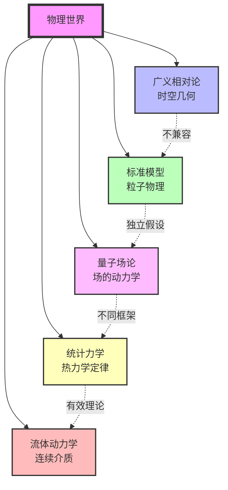
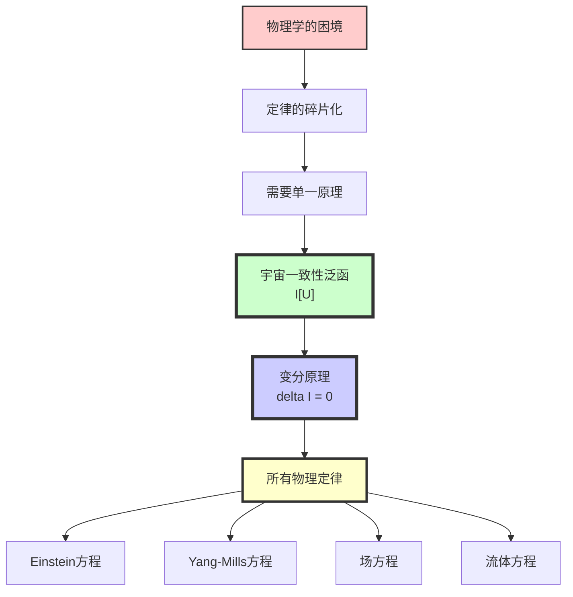

# 第11章第0节：引言——最终统一的必要性

> **"宇宙不是由多条互不相干的物理定律支配，而是由单一的一致性原理决定。"**

## 本章导览

在前面的章节中，我们已经建立了GLS理论的完整框架：

- **第1-3章**：数学工具与核心思想（几何、逻辑、散射的统一）
- **第4章**：信息几何变分原理（IGVP）框架
- **第5章**：统一时间刻度
- **第6章**：边界理论
- **第7章**：因果结构
- **第8章**：拓扑约束
- **第9章**：QCA宇宙
- **第10章**：矩阵宇宙与观察者理论

现在，我们来到了整个理论的**终极目标**：证明所有物理定律都源自**单一的宇宙一致性变分原理**。

## 1. 物理学的困境：定律的碎片化

### 1.1 当前物理学的"拼接"结构

尽管现代物理学取得了巨大成功，但它仍然呈现出一种**碎片化**的结构：

**核心问题**：
1. **Einstein方程**仍被单独假设为"几何定律"
2. **Yang-Mills方程**与**Dirac方程**仍被单独引入为"场论定律"
3. **Navier-Stokes方程**仍被单独建模为"流体定律"
4. 这些定律之间**缺乏统一的来源**

### 1.2 "统一"的不同层次

历史上，物理学经历了多次统一：

| 统一 | 成就 | 局限 |
|------|------|------|
| **Maxwell统一** | 电与磁 | 仍是独立的电磁理论 |
| **Einstein统一** | 时空与引力 | 与量子力学不兼容 |
| **Weinberg-Salam统一** | 弱力与电磁力 | 仍需外加Higgs机制 |
| **标准模型** | 三种基本力 | 19+个自由参数 |
| **弦论尝试** | 所有力的几何化 | 无法验证 |

但这些都只是**部分统一**，它们：
- 统一了**结构**，但未统一**来源**
- 统一了**力**，但未统一**定律本身**
- 统一了**舞台与演员**，但未统一**剧本的唯一来源**

## 2. GLS理论的终极目标

### 2.1 不是"大统一理论"，而是"定律的统一"

GLS理论的目标不是找到一个"包含所有力的更大对称群"，而是回答一个更根本的问题：

> **所有物理定律能否从单一的原理中必然涌现？**

这意味着：
- **Einstein方程**不应被假设，而应被**导出**
- **规范场方程**不应被假设，而应被**导出**
- **量子场论**不应被假设，而应被**导出**
- **流体动力学**不应被假设，而应被**导出**

### 2.2 单一变分原理的哲学

变分原理在物理学中有着悠久的历史：

**经典例子**：
- **最小作用量原理**（Euler-Lagrange方程）
- **Fermat原理**（光线路径）
- **Hamilton原理**（经典力学）

但这些都是**在给定动力学框架下**的变分原理。GLS理论要做的是：

> **构造一个更原始的变分原理，使得框架本身也从中涌现。**

### 2.3 宇宙一致性泛函

本章的核心对象是**宇宙一致性泛函**：

$$
\mathcal{I}[\mathfrak{U}] = \mathcal{I}_{\mathrm{grav}} + \mathcal{I}_{\mathrm{gauge}} + \mathcal{I}_{\mathrm{QFT}} + \mathcal{I}_{\mathrm{hydro}} + \mathcal{I}_{\mathrm{obs}}
$$

其中：
- $\mathcal{I}_{\mathrm{grav}}$：引力-熵项（导出Einstein方程）
- $\mathcal{I}_{\mathrm{gauge}}$：规范-几何项（导出Yang-Mills方程）
- $\mathcal{I}_{\mathrm{QFT}}$：量子场论-散射项（导出场方程）
- $\mathcal{I}_{\mathrm{hydro}}$：流体-分辨率项（导出Navier-Stokes方程）
- $\mathcal{I}_{\mathrm{obs}}$：观察者-共识项（导出多智能体动力学）

**核心命题**：

$$
\boxed{\delta \mathcal{I}[\mathfrak{U}] = 0}
$$

这一条变分原理的不同层级展开，就是我们所熟知的**所有物理定律**。

## 3. 本章的逻辑结构

本章将分六个部分完成最终统一：

### 第1节：宇宙一致性泛函的构造

我们将基于三类**不可让步的物理要求**：
1. **因果-散射一致性**：幺正性与宏观因果性
2. **广义熵单调与稳定性**：统一时间刻度下的第二定律
3. **观察者-共识一致性**：所有局部观察者的模型可嵌入同一宇宙

构造出单一的一致性泛函$\mathcal{I}[\mathfrak{U}]$。

### 第2节：信息几何变分原理（IGVP）

从**广义熵**的变分出发：

$$
S_{\mathrm{gen}} = \frac{A(\partial D)}{4G\hbar} + S_{\mathrm{out}}
$$

建立**信息几何变分原理**：在小因果菱形上，$S_{\mathrm{gen}}$在保持体积约束下取极值。

### 第3节：从IGVP导出Einstein方程

通过：
- **面积变分**与**曲率**的关系
- **熵变分**与**应力-能量张量**的关系（纠缠第一定律）
- **Raychaudhuri方程**的几何光学

导出：

$$
G_{\mu\nu} + \Lambda g_{\mu\nu} = 8\pi G \langle T_{\mu\nu} \rangle
$$

### 第4节：规范场论与QFT的涌现

在固定几何下，对**边界通道丛**与**总联络**作变分，导出：
- **Yang-Mills方程**
- **场内容约束**（异常抵消）
- **Ward恒等式**

### 第5节：物质场与流体的涌现

在粗粒化极限下，导出：
- **Dirac/Klein-Gordon场方程**
- **Navier-Stokes方程**
- **多智能体熵梯度流**

### 第6节：总结

展示所有物理定律如何统一在单一变分原理之下。

## 4. 为什么需要这种统一？

### 4.1 理论的必然性

如果物理定律不是从单一原理导出，而是独立假设的，那么：
- 为什么这些定律**恰好兼容**？
- 为什么它们**共享相同的数学结构**（微分几何、对称性、守恒律）？
- 为什么宇宙**选择了这些定律**而非其他？

单一变分原理给出答案：**因为这是唯一一致的可能性。**

### 4.2 预言的能力

从单一原理导出意味着：
- 定律之间的关系不再是**巧合**，而是**必然**
- 对一处的修正会**自动约束**其他地方
- 新物理必须**在同一框架内**才能自洽

### 4.3 深层理解

变分原理揭示了物理定律的**本质**：
- 不是"宇宙遵守某些方程"
- 而是"宇宙满足某种一致性条件"
- 方程只是一致性条件的**必然后果**

## 5. 与其他统一尝试的对比

| 理论 | 统一对象 | 基本假设 | GLS的位置 |
|------|----------|----------|-----------|
| **标准模型** | 三种力 | 规范群+Higgs | 规范群从边界K类涌现 |
| **弦论** | 所有力 | 弦的振动模式 | QCA为更基础的离散结构 |
| **圈量子引力** | 时空几何 | 自旋网络 | 自旋网络为QCA的极限 |
| **因果集** | 时空因果 | 离散因果偏序 | 因果结构从统一刻度涌现 |
| **全息原理** | 引力-场论 | AdS/CFT对偶 | 边界理论为更普遍的结构 |
| **GLS理论** | **所有物理定律** | 单一变分原理 | **终极本体** |

## 6. 本章的数学深度

本章将是整个教程中**数学最深入**的部分，会涉及：

**数学工具**：
- 变分法与Euler-Lagrange方程
- 信息几何与Fisher-Rao度量
- 相对熵与Umegaki熵
- 因果菱形几何与Raychaudhuri方程
- K理论与Dirac指标
- Wigner-Smith群延迟

**物理概念**：
- 广义熵与纠缠
- 模哈密顿量与KMS态
- 边界时间几何
- 规范场与异常
- 量子场论重整化
- 流体动力学极限

但我们将保持通俗解释，用比喻帮助理解。

## 7. 从这里出发

从下一节开始，我们将逐步构造宇宙一致性泛函$\mathcal{I}[\mathfrak{U}]$，并展示如何从

$$
\delta \mathcal{I}[\mathfrak{U}] = 0
$$

这一条原理，导出：
- Einstein场方程
- Yang-Mills方程
- Dirac方程
- Navier-Stokes方程
- 多智能体动力学

最终实现：**物理定律的终极统一**。

---

## 核心问题预览

在接下来的章节中，我们将回答：

1. **第1节**：什么是"宇宙一致性"？如何量化它？
2. **第2节**：信息几何变分原理的数学基础是什么？
3. **第3节**：为什么广义熵的极值给出Einstein方程？
4. **第4节**：规范场和场内容如何从边界数据涌现？
5. **第5节**：流体动力学如何作为量子场论的粗粒化？
6. **第6节**：这一统一框架的物理预言是什么？

## 本节要点回顾

**核心洞察**：
> 物理定律不是宇宙的"规则列表"，而是宇宙一致性的必然后果。单一的变分原理$\delta\mathcal{I}[\mathfrak{U}]=0$在不同层级上的展开，就是我们所知的全部物理学。

---

**下一节预告**：在第1节中，我们将详细构造宇宙一致性泛函$\mathcal{I}[\mathfrak{U}]$的每一项，并阐明三类基本一致性要求：因果-散射一致性、广义熵单调性、观察者-共识一致性。
