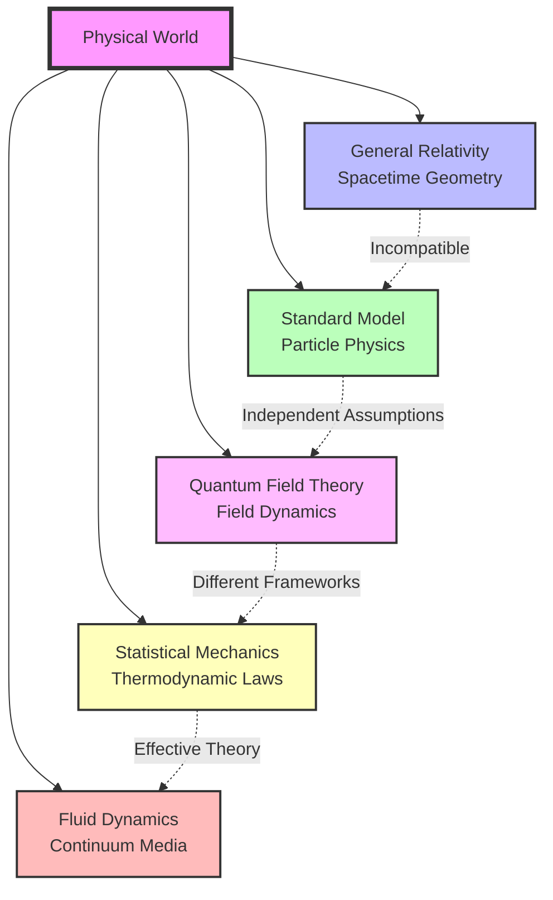
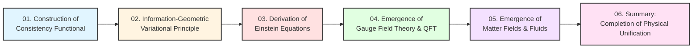
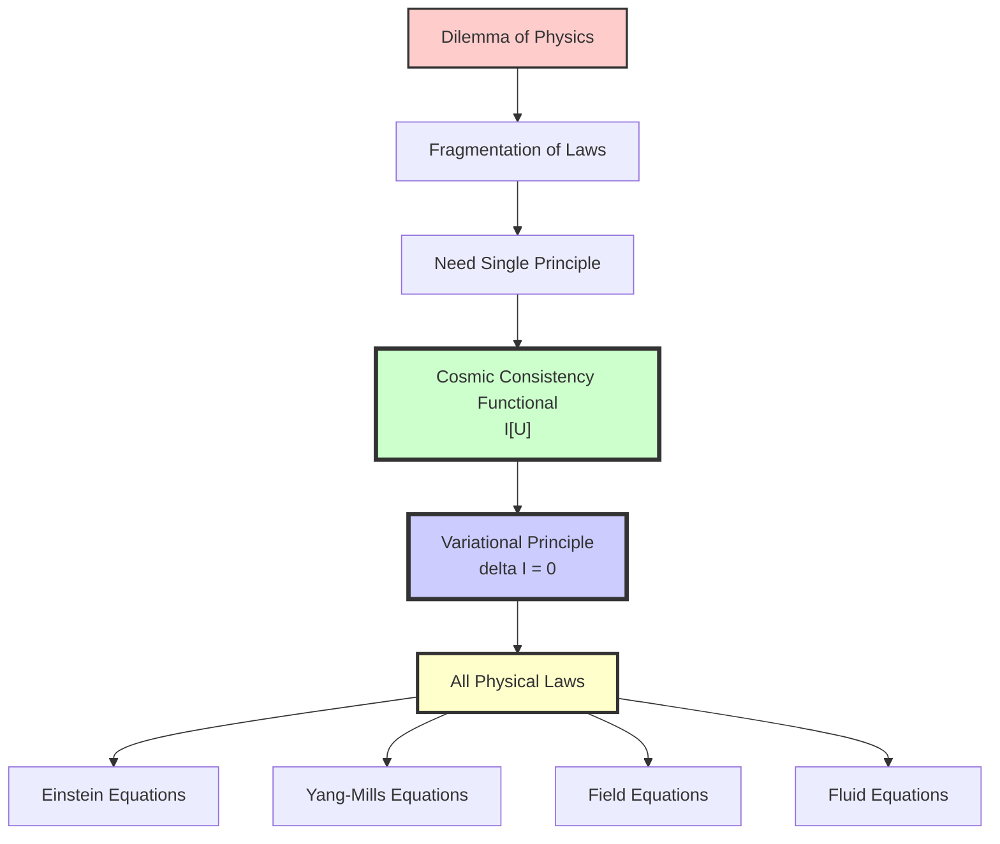

# Chapter 11 Section 0: Introduction—The Necessity of Final Unification

> **"The universe is not governed by multiple unrelated physical laws, but determined by a single consistency principle."**

## Chapter Overview

In previous chapters, we have established the complete framework of GLS theory:

- **Chapters 1-3**: Mathematical tools and core ideas (unification of geometry, logic, scattering)
- **Chapter 4**: Information-Geometric Variational Principle (IGVP) framework
- **Chapter 5**: Unified time scale
- **Chapter 6**: Boundary theory
- **Chapter 7**: Causal structure
- **Chapter 8**: Topological constraints
- **Chapter 9**: QCA universe
- **Chapter 10**: Matrix universe and observer theory

Now, we arrive at the **ultimate goal** of the entire theory: proving that all physical laws derive from a **single cosmic consistency variational principle**.

## 1. The Dilemma of Physics: Fragmentation of Laws

### 1.1 Current Physics' "Pieced-Together" Structure

Despite the great success of modern physics, it still exhibits a **fragmented** structure:

**Core Problems**:
1. **Einstein equations** are still separately assumed as "geometric laws"
2. **Yang-Mills equations** and **Dirac equations** are still separately introduced as "field theory laws"
3. **Navier-Stokes equations** are still separately modeled as "fluid laws"
4. These laws **lack a unified source**

### 1.2 Different Levels of "Unification"

Historically, physics has undergone multiple unifications:

| Unification | Achievement | Limitation |
|------------|-------------|------------|
| **Maxwell Unification** | Electricity and magnetism | Still independent electromagnetic theory |
| **Einstein Unification** | Spacetime and gravity | Incompatible with quantum mechanics |
| **Weinberg-Salam Unification** | Weak force and electromagnetic force | Still requires external Higgs mechanism |
| **Standard Model** | Three fundamental forces | 19+ free parameters |
| **String Theory Attempt** | Geometricization of all forces | Unverifiable |

But these are only **partial unifications**; they:
- Unified **structure**, but not **source**
- Unified **forces**, but not **laws themselves**
- Unified **stage and actors**, but not **the single source of the script**

## 2. Ultimate Goal of GLS Theory

### 2.1 Not "Grand Unified Theory," but "Unification of Laws"

The goal of GLS theory is not to find a "larger symmetry group containing all forces," but to answer a more fundamental question:

> **Can all physical laws necessarily emerge from a single principle?**

This means:
- **Einstein equations** should not be assumed, but **derived**
- **Gauge field equations** should not be assumed, but **derived**
- **Quantum field theory** should not be assumed, but **derived**
- **Fluid dynamics** should not be assumed, but **derived**

### 2.2 Philosophy of Single Variational Principle

Variational principles have a long history in physics:

**Classical Examples**:
- **Principle of least action** (Euler-Lagrange equations)
- **Fermat's principle** (light ray paths)
- **Hamilton's principle** (classical mechanics)

But these are all variational principles **within a given dynamical framework**. What GLS theory aims to do is:

> **Construct a more primitive variational principle from which the framework itself also emerges.**

### 2.3 Cosmic Consistency Functional

The core object of this chapter is the **cosmic consistency functional**:

$$
\mathcal{I}[\mathfrak{U}] = \mathcal{I}_{\mathrm{grav}} + \mathcal{I}_{\mathrm{gauge}} + \mathcal{I}_{\mathrm{QFT}} + \mathcal{I}_{\mathrm{hydro}} + \mathcal{I}_{\mathrm{obs}}
$$

where:
- $\mathcal{I}_{\mathrm{grav}}$: Gravity-entropy term (derives Einstein equations)
- $\mathcal{I}_{\mathrm{gauge}}$: Gauge-geometric term (derives Yang-Mills equations)
- $\mathcal{I}_{\mathrm{QFT}}$: Quantum field theory-scattering term (derives field equations)
- $\mathcal{I}_{\mathrm{hydro}}$: Fluid-resolution term (derives Navier-Stokes equations)
- $\mathcal{I}_{\mathrm{obs}}$: Observer-consensus term (derives multi-agent dynamics)

**Core Proposition**:

$$
\boxed{\delta \mathcal{I}[\mathfrak{U}] = 0}
$$

Different level expansions of this single variational principle are **all physical laws** we know.

## 3. Logical Structure of This Chapter

This chapter will complete final unification in six parts:

### Section 1: Construction of Cosmic Consistency Functional

We will construct a single consistency functional $\mathcal{I}[\mathfrak{U}]$ based on three types of **non-negotiable physical requirements**:
1. **Causal-scattering consistency**: Unitarity and macroscopic causality
2. **Generalized entropy monotonicity and stability**: Second law under unified time scale
3. **Observer-consensus consistency**: All local observers' models can be embedded in the same universe

### Section 2: Information-Geometric Variational Principle (IGVP)

Starting from variation of **generalized entropy**:

$$
S_{\mathrm{gen}} = \frac{A(\partial D)}{4G\hbar} + S_{\mathrm{out}}
$$

Establish **Information-Geometric Variational Principle**: On small causal diamonds, $S_{\mathrm{gen}}$ takes extremum under volume constraint.

### Section 3: Deriving Einstein Equations from IGVP

Through:
- Relationship between **area variation** and **curvature**
- Relationship between **entropy variation** and **stress-energy tensor** (first law of entanglement)
- Geometric optics of **Raychaudhuri equation**

Derive:

$$
G_{\mu\nu} + \Lambda g_{\mu\nu} = 8\pi G \langle T_{\mu\nu} \rangle
$$

### Section 4: Emergence of Gauge Field Theory and QFT

Under fixed geometry, varying **boundary channel bundle** and **total connection**, derive:
- **Yang-Mills equations**
- **Field content constraints** (anomaly cancellation)
- **Ward identities**

### Section 5: Emergence of Matter Fields and Fluids

Under coarse-graining limit, derive:
- **Dirac/Klein-Gordon field equations**
- **Navier-Stokes equations**
- **Multi-agent entropy gradient flow**

### Section 6: Summary

Demonstrate how all physical laws are unified under a single variational principle.

## 4. Why Is This Unification Needed?

### 4.1 Theoretical Necessity

If physical laws are not derived from a single principle but independently assumed, then:
- Why do these laws **happen to be compatible**?
- Why do they **share the same mathematical structure** (differential geometry, symmetry, conservation laws)?
- Why did the universe **choose these laws** rather than others?

A single variational principle provides the answer: **Because this is the only consistent possibility.**

### 4.2 Predictive Power

Deriving from a single principle means:
- Relationships between laws are no longer **coincidences**, but **necessities**
- Corrections in one place **automatically constrain** other places
- New physics must be **within the same framework** to be self-consistent

### 4.3 Deep Understanding

Variational principles reveal the **essence** of physical laws:
- Not "the universe obeys certain equations"
- But "the universe satisfies certain consistency conditions"
- Equations are just **necessary consequences** of consistency conditions

## 5. Comparison with Other Unification Attempts

| Theory | Unified Object | Basic Assumptions | GLS Position |
|--------|---------------|-------------------|--------------|
| **Standard Model** | Three forces | Gauge group + Higgs | Gauge group emerges from boundary K-class |
| **String Theory** | All forces | String vibration modes | QCA is more fundamental discrete structure |
| **Loop Quantum Gravity** | Spacetime geometry | Spin networks | Spin networks as limit of QCA |
| **Causal Sets** | Spacetime causality | Discrete causal partial order | Causal structure emerges from unified scale |
| **Holographic Principle** | Gravity-field theory | AdS/CFT duality | Boundary theory is more universal structure |
| **GLS Theory** | **All physical laws** | Single variational principle | **Ultimate ontology** |

## 6. Mathematical Depth of This Chapter

This chapter will be the **most mathematically deep** part of the entire tutorial, involving:

**Mathematical Tools**:
- Variational calculus and Euler-Lagrange equations
- Information geometry and Fisher-Rao metric
- Relative entropy and Umegaki entropy
- Causal diamond geometry and Raychaudhuri equation
- K-theory and Dirac index
- Wigner-Smith group delay

**Physical Concepts**:
- Generalized entropy and entanglement
- Modular Hamiltonian and KMS states
- Boundary time geometry
- Gauge fields and anomalies
- Quantum field theory renormalization
- Fluid dynamics limit

But we will maintain accessible explanations, using analogies to aid understanding.

## 7. Starting from Here

Starting from the next section, we will gradually construct the cosmic consistency functional $\mathcal{I}[\mathfrak{U}]$ and demonstrate how from

$$
\delta \mathcal{I}[\mathfrak{U}] = 0
$$

this single principle, derive:
- Einstein field equations
- Yang-Mills equations
- Dirac equations
- Navier-Stokes equations
- Multi-agent dynamics

Finally achieving: **Ultimate unification of physical laws**.

---

## Core Questions Preview

In the following sections, we will answer:

1. **Section 1**: What is "cosmic consistency"? How to quantify it?
2. **Section 2**: What is the mathematical foundation of Information-Geometric Variational Principle?
3. **Section 3**: Why does extremum of generalized entropy give Einstein equations?
4. **Section 4**: How do gauge fields and field content emerge from boundary data?
5. **Section 5**: How does fluid dynamics emerge as coarse-graining of quantum field theory?
6. **Section 6**: What are the physical predictions of this unified framework?

## Key Points Review

**Core Insight**:
> Physical laws are not a "list of rules" for the universe, but necessary consequences of cosmic consistency. Different level expansions of the single variational principle $\delta\mathcal{I}[\mathfrak{U}]=0$ are all the physics we know.

---

**Next Section Preview**: In Section 1, we will detail the construction of each term of the cosmic consistency functional $\mathcal{I}[\mathfrak{U}]$ and clarify three types of basic consistency requirements: causal-scattering consistency, generalized entropy monotonicity, and observer-consensus consistency.

