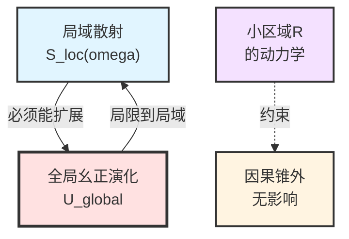
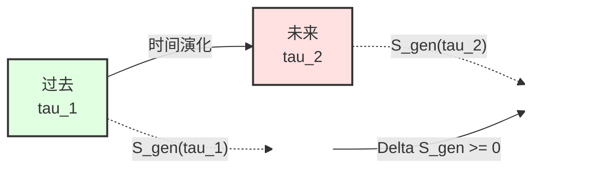
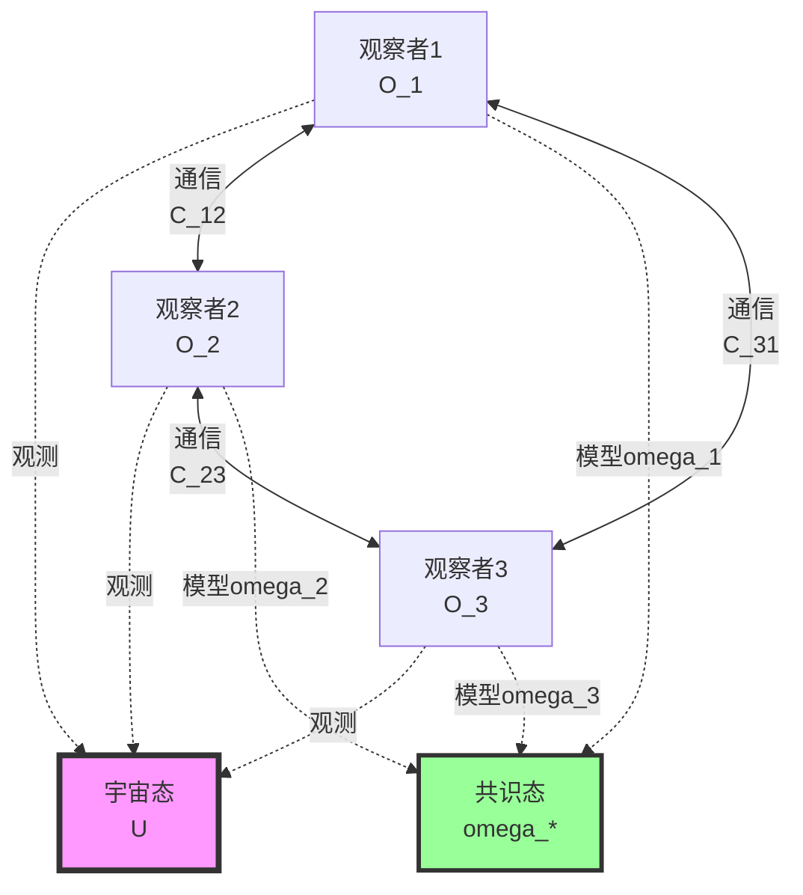
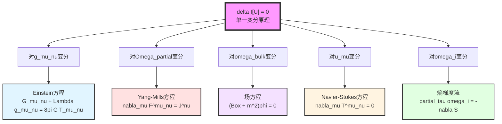
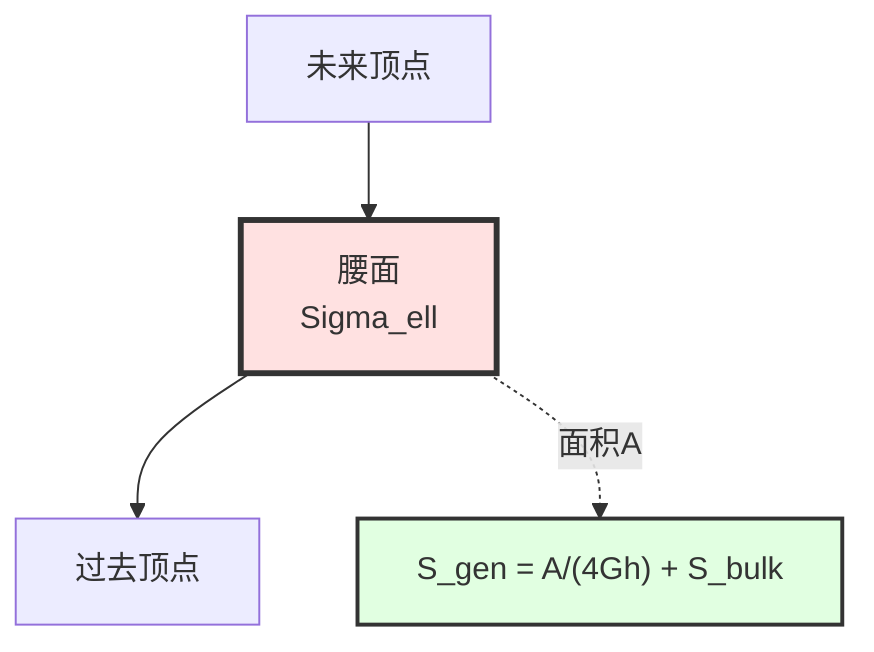
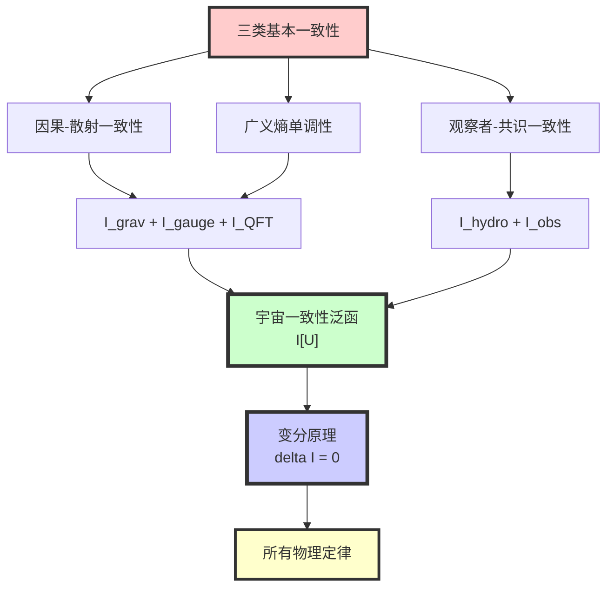

# 第11章第1节：宇宙一致性泛函的构造

> **"一致性不是可选的——宇宙必须自洽，这一要求本身就足以决定所有物理定律。"**

## 本节导览

在上一节中，我们提出了终极目标：从单一变分原理导出所有物理定律。本节将构造核心对象——**宇宙一致性泛函** $\mathcal{I}[\mathfrak{U}]$。

## 1. 什么是"一致性"？

### 1.1 日常类比：拼图的一致性

想象一个巨大的拼图游戏：
- 每块拼图必须与相邻的拼图**边缘吻合**（局域一致性）
- 整幅画面必须**连贯**（全局一致性）
- 如果有一块拼图不吻合，整个拼图就**无法完成**

宇宙的一致性与此类似，但更强：
- 不仅边缘要吻合（**因果一致性**）
- 信息量也要守恒（**熵一致性**）
- 所有观察者的描述也要兼容（**观察者一致性**）

### 1.2 物理的一致性要求

**问题**：假如宇宙在某处"不一致"会怎样？

**回答**：
1. **因果不一致**→信息可以超光速传播→违反相对论
2. **熵不一致**→可以永动机→违反热力学第二定律
3. **观察者不一致**→不同观察者观测矛盾→物理学不可能

因此，**一致性不是假设，而是物理可能性的必要条件**。

## 2. 三类基本一致性

### 2.1 因果-散射一致性

**物理要求**：任何局域的散射过程必须能嵌入到全局幺正演化中。

**数学表述**：
- 散射矩阵 $S(\omega)$ 必须**幺正**：$S^\dagger S = I$
- 格林函数的支撑必须**尊重因果锥**
- 不能有**因果悖论**（如祖父悖论）

**比喻**：
> 想象你在电影院看电影。每个座位（局域区域）看到的画面（散射）必须是同一部电影（全局演化）的不同角度。如果不同座位看到的剧情矛盾，电影就不一致。

### 2.2 广义熵单调与稳定性

**物理要求**：在统一时间刻度下，小因果菱形的广义熵必须满足单调性与稳定性。

**广义熵的定义**（回顾第4章）：

$$
S_{\mathrm{gen}}(D) = \frac{A(\partial D)}{4G\hbar} + S_{\mathrm{bulk}}(D)
$$

其中：
- $A(\partial D)$：因果菱形边界的面积
- $S_{\mathrm{bulk}}(D)$：体域的冯·诺依曼熵
- $G$：引力常数，$\hbar$：约化普朗克常数

**单调性要求**：沿着统一时间刻度 $\tau$，

$$
\frac{dS_{\mathrm{gen}}}{d\tau} \geq 0
$$

**稳定性要求**：二阶变分非负，

$$
\delta^2 S_{\mathrm{gen}} \geq 0
$$

**比喻**：
> 想象一个沙漏。沙子从上到下流（熵增加）是单调的。如果某一刻沙子突然往上流，沙漏就"不一致"了。广义熵的单调性确保宇宙有明确的**时间箭头**。

### 2.3 观察者-共识一致性

**物理要求**：任何有限观察者网络的模型与读数必须可嵌入同一宇宙态。

**数学表述**：
观察者 $O_i$ 的模型 $\omega_i$ 与真实宇宙态 $\omega_{\mathrm{bulk}}$ 之间的**相对熵**：

$$
S(\omega_i \| \omega_{\mathrm{bulk}}|_{C_i})
$$

必须通过通信与更新达成**共识**：

$$
\lim_{t\to\infty} \omega_i(t) = \omega_*
$$

**比喻**：
> 想象三个盲人摸象。虽然每个人摸到的部分不同（局部观测），但通过交流（通信），他们最终能拼出一致的图景（共识）。如果无法达成共识，那么不是观察者有问题，就是"象"（宇宙）本身不一致。

## 3. 宇宙一致性泛函的构造

### 3.1 基本思路

我们将三类一致性要求**量化**为一个泛函：

$$
\mathcal{I}[\mathfrak{U}] = \mathcal{I}_{\mathrm{grav}} + \mathcal{I}_{\mathrm{gauge}} + \mathcal{I}_{\mathrm{QFT}} + \mathcal{I}_{\mathrm{hydro}} + \mathcal{I}_{\mathrm{obs}}
$$

其中每一项对应一类一致性要求的**偏离惩罚**：
- 如果宇宙态 $\mathfrak{U}$ 完全一致，则 $\mathcal{I}[\mathfrak{U}]$ 达到极值
- 如果有不一致，则 $\mathcal{I}[\mathfrak{U}]$ 偏离极值

### 3.2 引力-熵项 $\mathcal{I}_{\mathrm{grav}}$

**作用**：约束小因果菱形上的几何与熵结构。

$$
\mathcal{I}_{\mathrm{grav}} = \frac{1}{16\pi G} \int_M (R - 2\Lambda) \sqrt{|g|} \, d^4x
+ \frac{1}{8\pi G} \int_{\partial M} K \sqrt{|h|} \, d^3x
- \lambda_{\mathrm{ent}} \sum_{D} [S_{\mathrm{gen}}(D) - S_{\mathrm{gen}}^*(D)]
$$

**组成部分**：
1. **Einstein-Hilbert作用量**：$\frac{1}{16\pi G} \int (R - 2\Lambda) \sqrt{|g|}$（几何部分）
2. **Gibbons-Hawking-York边界项**：$\frac{1}{8\pi G} \int K \sqrt{|h|}$（边界一致性）
3. **熵惩罚项**：$\sum [S_{\mathrm{gen}} - S_{\mathrm{gen}}^*]$（熵偏离极值的惩罚）

**物理意义**：
> 这一项确保几何与熵在每个小因果菱形上都达到一致性极值。其变分将给出**Einstein方程**。

### 3.3 规范-几何项 $\mathcal{I}_{\mathrm{gauge}}$

**作用**：约束边界通道丛与规范结构。

$$
\mathcal{I}_{\mathrm{gauge}} = \int_{\partial M \times \Lambda} \left[ \mathrm{tr}(F_{\mathrm{YM}} \wedge \star F_{\mathrm{YM}}) + \mu_{\mathrm{top}} \cdot \mathrm{CS}(A_{\mathrm{YM}}) + \mu_K \cdot \mathrm{Index}(D_{[E]}) \right]
$$

**组成部分**：
1. **Yang-Mills作用量**：$\mathrm{tr}(F \wedge \star F)$（规范场强）
2. **Chern-Simons项**：$\mu_{\mathrm{top}} \cdot \mathrm{CS}(A)$（拓扑项）
3. **Dirac指标**：$\mu_K \cdot \mathrm{Index}(D_{[E]})$（K类与指标配对）

**物理意义**：
> 这一项确保规范结构与K类一致，并惩罚违反Ward恒等式的配置。其变分将给出**Yang-Mills方程**与**场内容约束**（异常抵消）。

### 3.4 QFT-散射项 $\mathcal{I}_{\mathrm{QFT}}$

**作用**：约束体域QFT与散射数据的一致性。

$$
\mathcal{I}_{\mathrm{QFT}} = \sum_{D \in \mathcal{D}_{\mathrm{micro}}} S(\omega_{\mathrm{bulk}}^D \| \omega_{\mathrm{scat}}^D)
$$

其中：
- $\omega_{\mathrm{bulk}}^D$：实际的体域态（在因果菱形 $D$ 上）
- $\omega_{\mathrm{scat}}^D$：由散射数据与统一刻度预测的参考态
- $S(\cdot \| \cdot)$：Umegaki相对熵

**物理意义**：
> 这一项要求局域QFT模型与散射-刻度预测相容。其变分给出**场方程**与**Ward恒等式**。

### 3.5 流体-分辨率项 $\mathcal{I}_{\mathrm{hydro}}$

**作用**：在粗粒化极限中约束流体动力学。

$$
\mathcal{I}_{\mathrm{hydro}} = \int_M \left[ \zeta (\nabla_\mu u^\mu)^2 + \eta \sigma_{\mu\nu} \sigma^{\mu\nu} + \sum_k D_k (\nabla_\mu n_k)^2 \right] \sqrt{|g|} \, d^4x
$$

其中：
- $u^\mu$：宏观速度场
- $\sigma_{\mu\nu}$：剪切张量
- $n_k$：守恒量密度
- $\zeta, \eta, D_k$：由分辨率联络 $\Gamma_{\mathrm{res}}$ 决定的黏度与扩散系数

**物理意义**：
> 这一项要求宏观演化遵循熵产生最小化原则。其变分给出**Navier-Stokes方程**与**扩散方程**。

### 3.6 观察者-共识项 $\mathcal{I}_{\mathrm{obs}}$

**作用**：约束观察者网络的一致性。

$$
\mathcal{I}_{\mathrm{obs}} = \sum_i S(\omega_i \| \omega_{\mathrm{bulk}}|_{C_i}) + \sum_{(i,j)} S(\mathcal{C}_{ij*}(\omega_i) \| \omega_j)
$$

其中：
- 第一项：观察者内部模型与真实宇宙态的偏差
- 第二项：通信后模型之间的不一致
- $\mathcal{C}_{ij*}$：通信通道的推前映射

**物理意义**：
> 这一项惩罚观察者模型之间的不一致。其变分给出**多智能体熵梯度流**。

## 4. 统一一致性原理

### 4.1 变分原理的表述

**核心命题**：

$$
\boxed{\delta \mathcal{I}[\mathfrak{U}] = 0}
$$

对所有允许的变分——包括对度规 $g$、通道丛 $E$、总联络 $\Omega_\partial$、体域态 $\omega_{\mathrm{bulk}}$、观察者模型 $\{O_i\}$ 的变分——成立。

### 4.2 变分的含义

对 $\mathcal{I}[\mathfrak{U}]$ 作变分，相当于问：
> "如果宇宙稍微偏离当前状态，一致性会增加还是减少？"

极值条件 $\delta \mathcal{I} = 0$ 意味着：
> "当前状态已经是一致性的极大值，任何偏离都会破坏一致性。"

### 4.3 不同层级的展开

**关键洞察**：变分原理 $\delta \mathcal{I}[\mathfrak{U}] = 0$ 在不同自由度上的展开，给出不同的物理定律！

## 5. 物理定律的统一意义

### 5.1 不再有"独立的定律"

在这个框架下：
- **Einstein方程**不是关于引力的独立假设，而是几何一致性的必然结果
- **Yang-Mills方程**不是关于规范场的独立假设，而是边界数据一致性的必然结果
- **场方程**不是关于物质的独立假设，而是散射-场论一致性的必然结果

### 5.2 定律之间的关系

由于所有定律都来自同一变分原理，它们之间**不再是偶然兼容**，而是**必然相容**：

| 传统视角 | 统一视角 |
|----------|----------|
| Einstein方程与Yang-Mills方程**恰好兼容** | 它们都是 $\delta \mathcal{I}_{\mathrm{grav}} = 0$ 与 $\delta \mathcal{I}_{\mathrm{gauge}} = 0$ |
| 引力与量子场论**难以统一** | 它们共享同一时间刻度与同一一致性条件 |
| 流体动力学是**有效理论** | 它是 $\mathcal{I}_{\mathrm{QFT}} + \mathcal{I}_{\mathrm{hydro}}$ 在粗粒化极限下的自然涌现 |

### 5.3 宇宙为什么"选择"这些定律？

**传统回答**：我们不知道，这是自然的选择。

**统一框架的回答**：
> 宇宙没有"选择"，这是**唯一一致的可能性**。任何其他定律都会导致因果悖论、熵下降或观察者矛盾，因此在逻辑上不可能。

## 6. 具体例子：小因果菱形上的一致性

### 6.1 问题设置

考虑时空中一点 $p$ 附近的小因果菱形 $D_{p,r}$：

### 6.2 一致性要求

在这个小菱形上：
1. **因果一致性**：散射必须幺正，$S^\dagger S = I$
2. **熵一致性**：$S_{\mathrm{gen}}$ 必须极值，$\delta S_{\mathrm{gen}} = 0$
3. **观察者一致性**：局域观察者的模型必须与全局态相容

### 6.3 导出的方程

从 $\delta S_{\mathrm{gen}} = 0$ 出发（详见第3节）：

$$
\frac{\delta A}{4G\hbar} + \delta S_{\mathrm{bulk}} = 0
$$

利用：
- $\delta A \approx -\int \lambda R_{kk} \, d\lambda \, dA$（面积变分与曲率）
- $\delta S_{\mathrm{bulk}} = \frac{\delta \langle H_{\mathrm{mod}} \rangle}{T}$（纠缠第一定律）
- $\delta \langle H_{\mathrm{mod}} \rangle = \int \lambda T_{kk} \, d\lambda \, dA$（模哈密顿量）

可得：

$$
R_{kk} = 8\pi G T_{kk}
$$

在所有零方向成立，从而推出**Einstein方程**（第3节详述）。

## 7. 本节要点回顾

**核心洞察**：
> 宇宙一致性泛函 $\mathcal{I}[\mathfrak{U}]$ 量化了三类基本的物理一致性要求。极值原理 $\delta \mathcal{I}[\mathfrak{U}] = 0$ 不是额外假设，而是一致性的数学表达。所有物理定律都是这一原理在不同自由度上的展开。

---

**下一节预告**：在第2节中，我们将深入探讨**信息几何变分原理（IGVP）**的数学基础，特别是如何从广义熵 $S_{\mathrm{gen}}$ 的变分导出几何方程。这是从抽象一致性原理到具体物理定律的关键桥梁。
