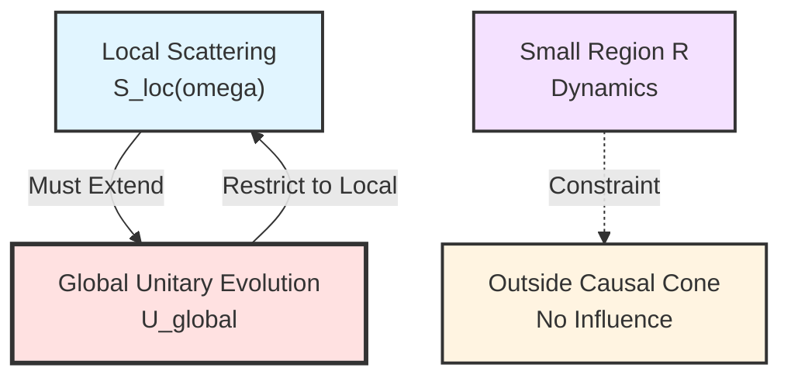
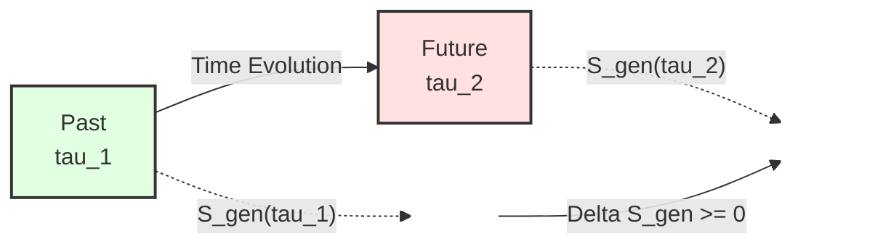
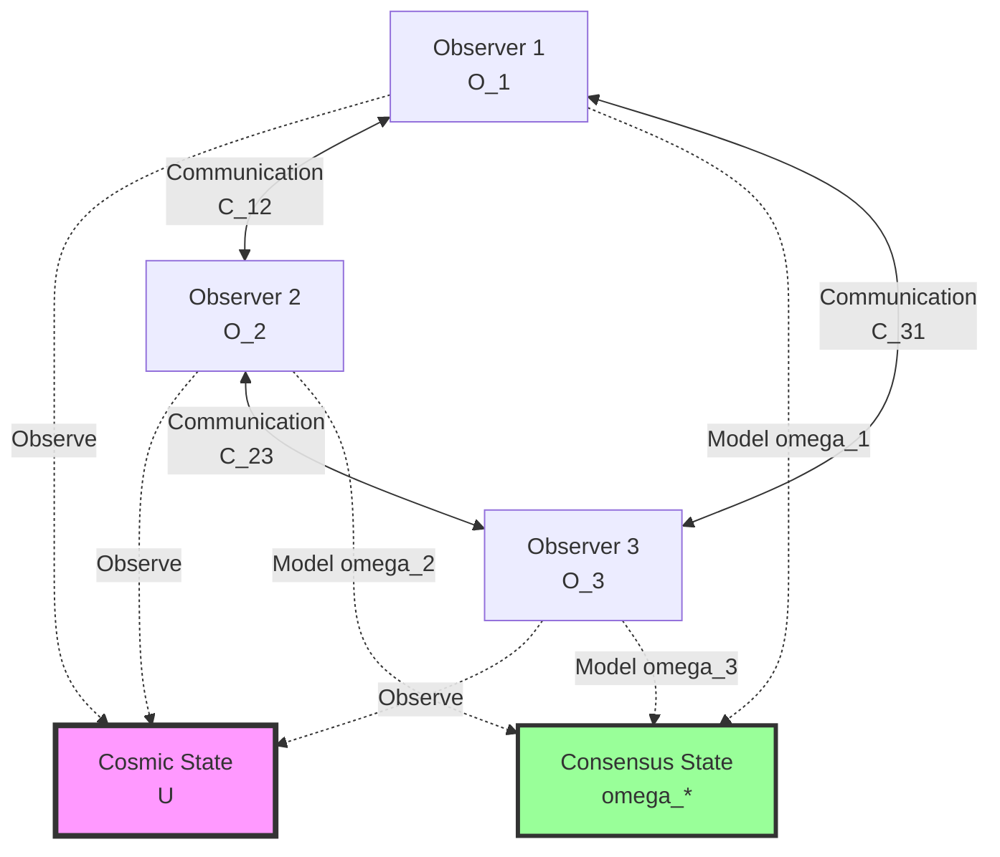
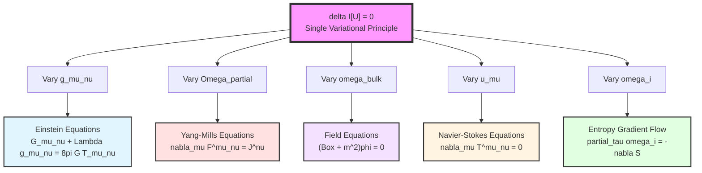
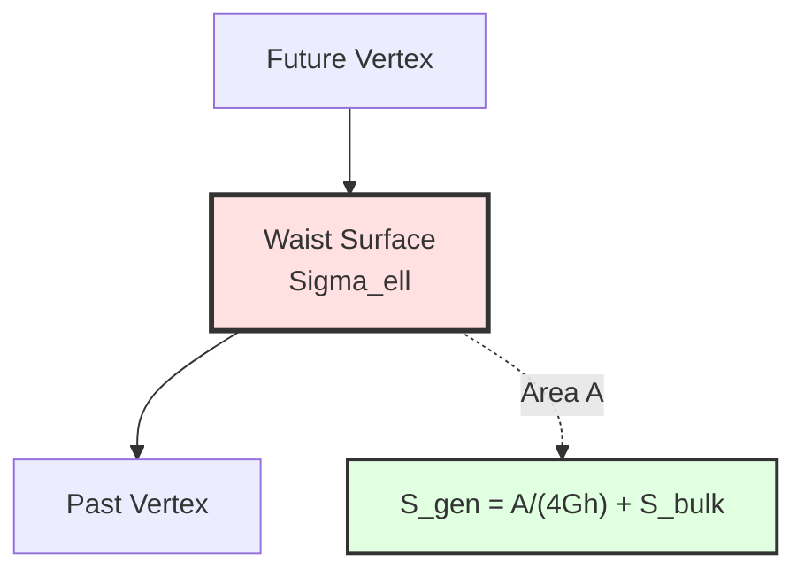
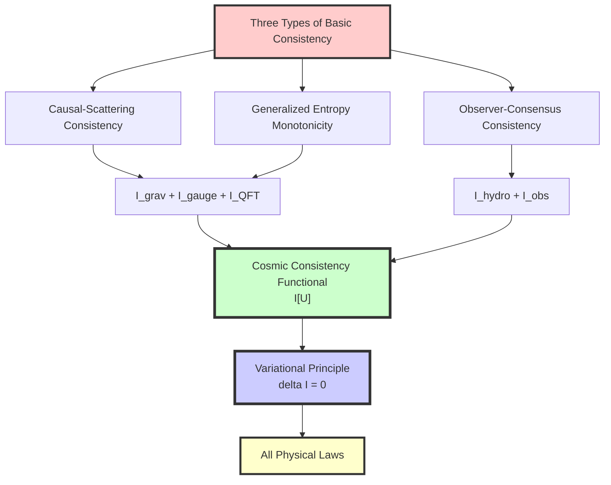

# Chapter 11 Section 1: Construction of Cosmic Consistency Functional

> **"Consistency is not optional—the universe must be self-consistent, and this requirement alone is sufficient to determine all physical laws."**

## Section Overview

In the previous section, we proposed the ultimate goal: deriving all physical laws from a single variational principle. This section will construct the core object—the **cosmic consistency functional** $\mathcal{I}[\mathfrak{U}]$.

## 1. What is "Consistency"?

### 1.1 Everyday Analogy: Consistency of a Jigsaw Puzzle

Imagine a huge jigsaw puzzle:
- Each piece must **match edges** with adjacent pieces (local consistency)
- The entire picture must be **coherent** (global consistency)
- If one piece doesn't match, the entire puzzle **cannot be completed**

Cosmic consistency is similar, but stronger:
- Not only edges must match (**causal consistency**)
- Information must be conserved (**entropy consistency**)
- All observers' descriptions must be compatible (**observer consistency**)

### 1.2 Physical Consistency Requirements

**Question**: What if the universe is "inconsistent" somewhere?

**Answer**:
1. **Causal inconsistency** → Information can propagate faster than light → Violates relativity
2. **Entropy inconsistency** → Perpetual motion machine possible → Violates second law of thermodynamics
3. **Observer inconsistency** → Different observers observe contradictions → Physics impossible

Therefore, **consistency is not an assumption, but a necessary condition for physical possibility**.

## 2. Three Types of Basic Consistency

### 2.1 Causal-Scattering Consistency

**Physical Requirement**: Any local scattering process must be embeddable into global unitary evolution.

**Mathematical Formulation**:
- Scattering matrix $S(\omega)$ must be **unitary**: $S^\dagger S = I$
- Support of Green's functions must **respect causal cone**
- Cannot have **causal paradoxes** (e.g., grandfather paradox)

**Analogy**:
> Imagine watching a movie in a cinema. The picture (scattering) seen from each seat (local region) must be different angles of the same movie (global evolution). If different seats see contradictory plots, the movie is inconsistent.

### 2.2 Generalized Entropy Monotonicity and Stability

**Physical Requirement**: Under unified time scale, generalized entropy of small causal diamonds must satisfy monotonicity and stability.

**Definition of Generalized Entropy** (recall Chapter 4):

$$
S_{\mathrm{gen}}(D) = \frac{A(\partial D)}{4G\hbar} + S_{\mathrm{bulk}}(D)
$$

where:
- $A(\partial D)$: Area of causal diamond boundary
- $S_{\mathrm{bulk}}(D)$: von Neumann entropy of bulk region
- $G$: Gravitational constant, $\hbar$: Reduced Planck constant

**Monotonicity Requirement**: Along unified time scale $\tau$,

$$
\frac{dS_{\mathrm{gen}}}{d\tau} \geq 0
$$

**Stability Requirement**: Second-order variation non-negative,

$$
\delta^2 S_{\mathrm{gen}} \geq 0
$$

**Analogy**:
> Imagine an hourglass. Sand flowing from top to bottom (entropy increase) is monotonic. If at some moment sand suddenly flows upward, the hourglass is "inconsistent." Monotonicity of generalized entropy ensures the universe has a clear **arrow of time**.

### 2.3 Observer-Consensus Consistency

**Physical Requirement**: Models and readings of any finite observer network must be embeddable in the same cosmic state.

**Mathematical Formulation**:
**Relative entropy** between observer $O_i$'s model $\omega_i$ and true cosmic state $\omega_{\mathrm{bulk}}$:

$$
S(\omega_i \| \omega_{\mathrm{bulk}}|_{C_i})
$$

Must reach **consensus** through communication and updates:

$$
\lim_{t\to\infty} \omega_i(t) = \omega_*
$$

**Analogy**:
> Imagine three blind men touching an elephant. Although each touches different parts (local observations), through communication, they can eventually piece together a consistent picture (consensus). If consensus cannot be reached, then either the observers have problems, or the "elephant" (universe) itself is inconsistent.

## 3. Construction of Cosmic Consistency Functional

### 3.1 Basic Idea

We **quantify** three types of consistency requirements into a functional:

$$
\mathcal{I}[\mathfrak{U}] = \mathcal{I}_{\mathrm{grav}} + \mathcal{I}_{\mathrm{gauge}} + \mathcal{I}_{\mathrm{QFT}} + \mathcal{I}_{\mathrm{hydro}} + \mathcal{I}_{\mathrm{obs}}
$$

Each term corresponds to a **deviation penalty** for a type of consistency requirement:
- If cosmic state $\mathfrak{U}$ is completely consistent, then $\mathcal{I}[\mathfrak{U}]$ reaches extremum
- If there is inconsistency, then $\mathcal{I}[\mathfrak{U}]$ deviates from extremum

### 3.2 Gravity-Entropy Term $\mathcal{I}_{\mathrm{grav}}$

**Role**: Constrain geometry and entropy structure on small causal diamonds.

$$
\mathcal{I}_{\mathrm{grav}} = \frac{1}{16\pi G} \int_M (R - 2\Lambda) \sqrt{|g|} \, d^4x
+ \frac{1}{8\pi G} \int_{\partial M} K \sqrt{|h|} \, d^3x
- \lambda_{\mathrm{ent}} \sum_{D} [S_{\mathrm{gen}}(D) - S_{\mathrm{gen}}^*(D)]
$$

**Components**:
1. **Einstein-Hilbert action**: $\frac{1}{16\pi G} \int (R - 2\Lambda) \sqrt{|g|}$ (geometric part)
2. **Gibbons-Hawking-York boundary term**: $\frac{1}{8\pi G} \int K \sqrt{|h|}$ (boundary consistency)
3. **Entropy penalty term**: $\sum [S_{\mathrm{gen}} - S_{\mathrm{gen}}^*]$ (penalty for entropy deviation from extremum)

**Physical Meaning**:
> This term ensures geometry and entropy reach consistency extremum on each small causal diamond. Its variation will give **Einstein equations**.

### 3.3 Gauge-Geometric Term $\mathcal{I}_{\mathrm{gauge}}$

**Role**: Constrain boundary channel bundle and gauge structure.

$$
\mathcal{I}_{\mathrm{gauge}} = \int_{\partial M \times \Lambda} \left[ \mathrm{tr}(F_{\mathrm{YM}} \wedge \star F_{\mathrm{YM}}) + \mu_{\mathrm{top}} \cdot \mathrm{CS}(A_{\mathrm{YM}}) + \mu_K \cdot \mathrm{Index}(D_{[E]}) \right]
$$

**Components**:
1. **Yang-Mills action**: $\mathrm{tr}(F \wedge \star F)$ (gauge field strength)
2. **Chern-Simons term**: $\mu_{\mathrm{top}} \cdot \mathrm{CS}(A)$ (topological term)
3. **Dirac index**: $\mu_K \cdot \mathrm{Index}(D_{[E]})$ (K-class and index pairing)

**Physical Meaning**:
> This term ensures gauge structure is consistent with K-class and penalizes configurations violating Ward identities. Its variation will give **Yang-Mills equations** and **field content constraints** (anomaly cancellation).

### 3.4 QFT-Scattering Term $\mathcal{I}_{\mathrm{QFT}}$

**Role**: Constrain consistency between bulk QFT and scattering data.

$$
\mathcal{I}_{\mathrm{QFT}} = \sum_{D \in \mathcal{D}_{\mathrm{micro}}} S(\omega_{\mathrm{bulk}}^D \| \omega_{\mathrm{scat}}^D)
$$

where:
- $\omega_{\mathrm{bulk}}^D$: Actual bulk state (on causal diamond $D$)
- $\omega_{\mathrm{scat}}^D$: Reference state predicted by scattering data and unified scale
- $S(\cdot \| \cdot)$: Umegaki relative entropy

**Physical Meaning**:
> This term requires local QFT models to be compatible with scattering-scale predictions. Its variation gives **field equations** and **Ward identities**.

### 3.5 Fluid-Resolution Term $\mathcal{I}_{\mathrm{hydro}}$

**Role**: Constrain fluid dynamics in coarse-graining limit.

$$
\mathcal{I}_{\mathrm{hydro}} = \int_M \left[ \zeta (\nabla_\mu u^\mu)^2 + \eta \sigma_{\mu\nu} \sigma^{\mu\nu} + \sum_k D_k (\nabla_\mu n_k)^2 \right] \sqrt{|g|} \, d^4x
$$

where:
- $u^\mu$: Macroscopic velocity field
- $\sigma_{\mu\nu}$: Shear tensor
- $n_k$: Conserved quantity density
- $\zeta, \eta, D_k$: Viscosity and diffusion coefficients determined by resolution connection $\Gamma_{\mathrm{res}}$

**Physical Meaning**:
> This term requires macroscopic evolution to follow entropy production minimization principle. Its variation gives **Navier-Stokes equations** and **diffusion equations**.

### 3.6 Observer-Consensus Term $\mathcal{I}_{\mathrm{obs}}$

**Role**: Constrain consistency of observer network.

$$
\mathcal{I}_{\mathrm{obs}} = \sum_i S(\omega_i \| \omega_{\mathrm{bulk}}|_{C_i}) + \sum_{(i,j)} S(\mathcal{C}_{ij*}(\omega_i) \| \omega_j)
$$

where:
- First term: Deviation between observer's internal model and true cosmic state
- Second term: Inconsistency between models after communication
- $\mathcal{C}_{ij*}$: Push-forward map of communication channel

**Physical Meaning**:
> This term penalizes inconsistency between observer models. Its variation gives **multi-agent entropy gradient flow**.

## 4. Unified Consistency Principle

### 4.1 Formulation of Variational Principle

**Core Proposition**:

$$
\boxed{\delta \mathcal{I}[\mathfrak{U}] = 0}
$$

Holds for all allowed variations—including variations of metric $g$, channel bundle $E$, total connection $\Omega_\partial$, bulk state $\omega_{\mathrm{bulk}}$, observer models $\{O_i\}$.

### 4.2 Meaning of Variation

Varying $\mathcal{I}[\mathfrak{U}]$ is equivalent to asking:
> "If the universe slightly deviates from current state, will consistency increase or decrease?"

Extremum condition $\delta \mathcal{I} = 0$ means:
> "Current state is already maximum of consistency, any deviation will destroy consistency."

### 4.3 Expansions at Different Levels

**Key Insight**: Expansions of variational principle $\delta \mathcal{I}[\mathfrak{U}] = 0$ on different degrees of freedom give different physical laws!

## 5. Unified Meaning of Physical Laws

### 5.1 No More "Independent Laws"

In this framework:
- **Einstein equations** are not independent assumptions about gravity, but necessary consequences of geometric consistency
- **Yang-Mills equations** are not independent assumptions about gauge fields, but necessary consequences of boundary data consistency
- **Field equations** are not independent assumptions about matter, but necessary consequences of scattering-field theory consistency

### 5.2 Relationships Between Laws

Since all laws come from the same variational principle, they are **no longer accidentally compatible**, but **necessarily compatible**:

| Traditional View | Unified View |
|------------------|--------------|
| Einstein equations and Yang-Mills equations **happen to be compatible** | They are both $\delta \mathcal{I}_{\mathrm{grav}} = 0$ and $\delta \mathcal{I}_{\mathrm{gauge}} = 0$ |
| Gravity and quantum field theory **difficult to unify** | They share the same time scale and same consistency conditions |
| Fluid dynamics is an **effective theory** | It naturally emerges as coarse-graining limit of $\mathcal{I}_{\mathrm{QFT}} + \mathcal{I}_{\mathrm{hydro}}$ |

### 5.3 Why Did the Universe "Choose" These Laws?

**Traditional Answer**: We don't know, this is nature's choice.

**Unified Framework Answer**:
> The universe didn't "choose," this is the **only consistent possibility**. Any other laws would lead to causal paradoxes, entropy decrease, or observer contradictions, hence logically impossible.

## 6. Concrete Example: Consistency on Small Causal Diamond

### 6.1 Problem Setup

Consider a small causal diamond $D_{p,r}$ near point $p$ in spacetime:

### 6.2 Consistency Requirements

On this small diamond:
1. **Causal consistency**: Scattering must be unitary, $S^\dagger S = I$
2. **Entropy consistency**: $S_{\mathrm{gen}}$ must be extremum, $\delta S_{\mathrm{gen}} = 0$
3. **Observer consistency**: Local observer's model must be compatible with global state

### 6.3 Derived Equations

Starting from $\delta S_{\mathrm{gen}} = 0$ (details in Section 3):

$$
\frac{\delta A}{4G\hbar} + \delta S_{\mathrm{bulk}} = 0
$$

Using:
- $\delta A \approx -\int \lambda R_{kk} \, d\lambda \, dA$ (area variation and curvature)
- $\delta S_{\mathrm{bulk}} = \frac{\delta \langle H_{\mathrm{mod}} \rangle}{T}$ (first law of entanglement)
- $\delta \langle H_{\mathrm{mod}} \rangle = \int \lambda T_{kk} \, d\lambda \, dA$ (modular Hamiltonian)

We get:

$$
R_{kk} = 8\pi G T_{kk}
$$

Holds for all null directions, thus deriving **Einstein equations** (detailed in Section 3).

## 7. Key Points Review

**Core Insight**:
> The cosmic consistency functional $\mathcal{I}[\mathfrak{U}]$ quantifies three types of basic physical consistency requirements. The extremum principle $\delta \mathcal{I}[\mathfrak{U}] = 0$ is not an additional assumption, but the mathematical expression of consistency. All physical laws are expansions of this principle on different degrees of freedom.

---

**Next Section Preview**: In Section 2, we will delve into the mathematical foundation of **Information-Geometric Variational Principle (IGVP)**, particularly how to derive geometric equations from variation of generalized entropy $S_{\mathrm{gen}}$. This is the key bridge from abstract consistency principle to concrete physical laws.

