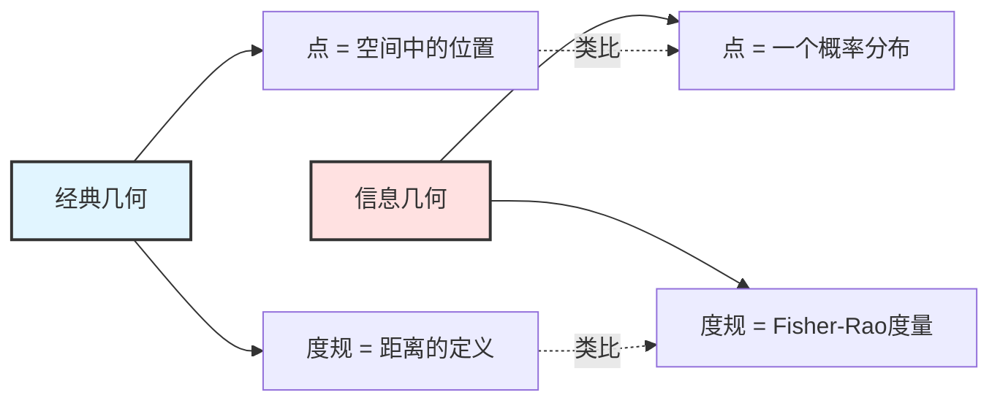
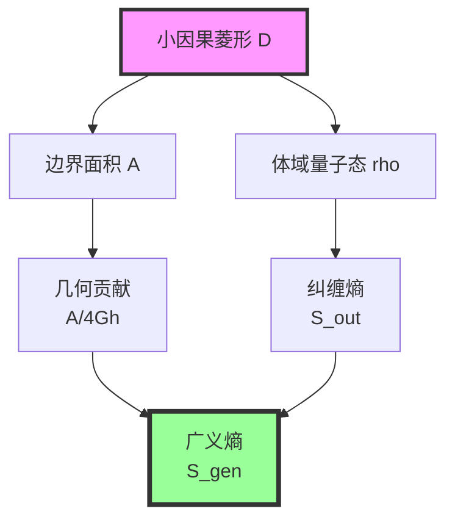
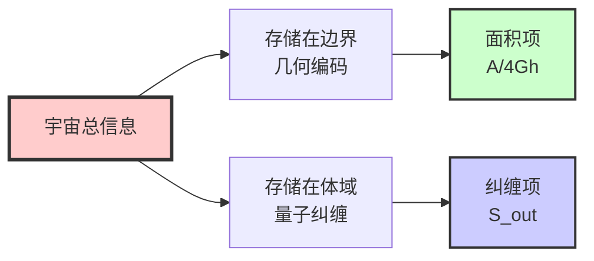
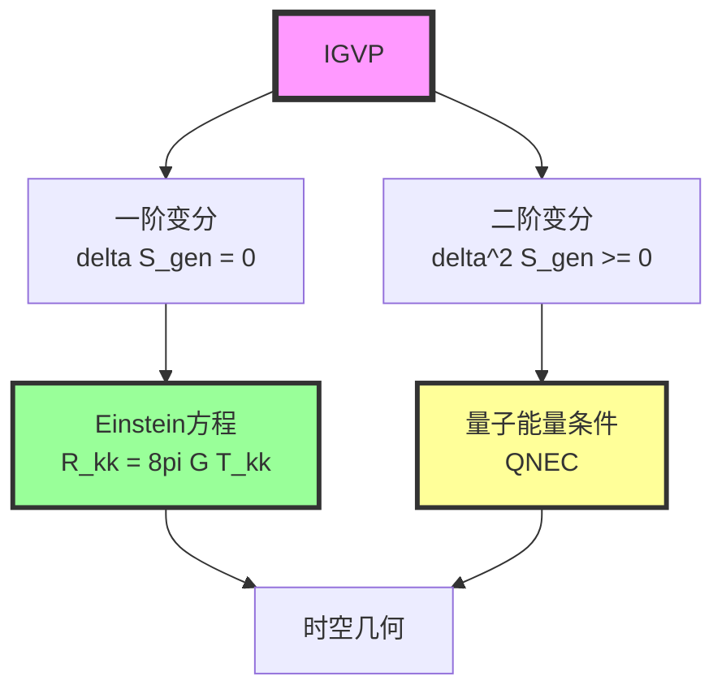
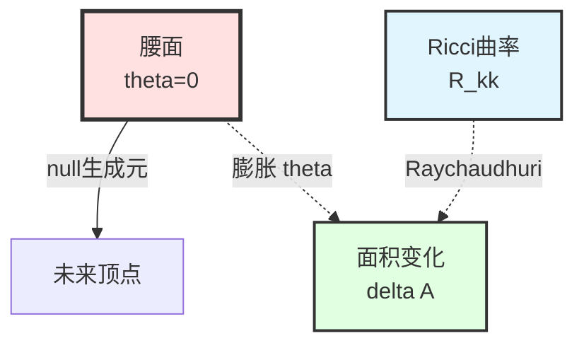
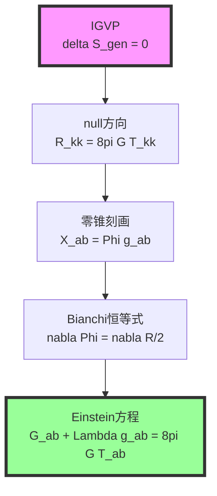
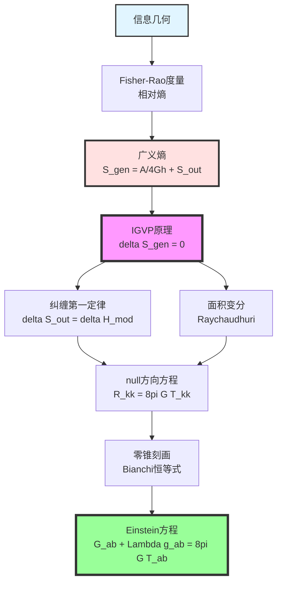

# 第11章第2节：信息几何变分原理（IGVP）

> **"广义熵不仅是热力学量，更是时空几何与量子信息的深层联系。"**

## 本节导览

在上一节中，我们构造了宇宙一致性泛函。本节将深入探讨其核心组成部分——**信息几何变分原理（Information-Geometric Variational Principle, IGVP）**，它是从抽象一致性条件到具体Einstein方程的关键桥梁。

## 1. 什么是信息几何？

### 1.1 经典几何 vs. 信息几何

**经典微分几何**研究的是：
- 点、线、面在空间中的形状
- 度规、曲率、测地线
- 例子：球面、环面、双曲面

**信息几何**研究的是：
- **概率分布**构成的空间
- 分布之间的"距离"与"曲率"
- 例子：所有正态分布、所有玻尔兹曼分布

### 1.2 Fisher-Rao度量

对参数化的概率分布族 $p(x;\theta)$，**Fisher-Rao度量**定义为：

$$
g_{ij}^{\mathrm{FR}}(\theta) = \mathbb{E}\left[ \frac{\partial \ln p}{\partial \theta^i} \frac{\partial \ln p}{\partial \theta^j} \right]
$$

**物理意义**：
- 它度量了**参数微小变化**对分布的影响
- 它是**数据处理不等式**下唯一的不变度量（Čencov定理）
- 它的二阶变分给出**Fisher信息矩阵**

**比喻**：
> 想象你在调节收音机的频率旋钮。Fisher-Rao度量告诉你：旋转旋钮一点点，信号（概率分布）会变化多少。有些方向（参数）转一点就变化很大（高曲率），有些方向转很多才变化（平坦）。

### 1.3 相对熵与Umegaki熵

对两个量子态 $\rho, \sigma$，**相对熵**（Umegaki熵）定义为：

$$
S(\rho \| \sigma) = \mathrm{Tr}(\rho \ln \rho) - \mathrm{Tr}(\rho \ln \sigma)
$$

**核心性质**：
1. **非负性**：$S(\rho \| \sigma) \geq 0$，等号成立当且仅当 $\rho = \sigma$
2. **凸性**：对 $\rho$ 是凸函数
3. **单调性**：在量子通道下不增

**比喻**：
> 相对熵度量两个量子态的"距离"。如果把 $\sigma$ 看作"标准态"，$S(\rho \| \sigma)$ 告诉你 $\rho$ 偏离标准有多远。就像用标准尺（$\sigma$）去度量实际尺子（$\rho$）的误差。

## 2. 广义熵：面积 + 体域纠缠

### 2.1 广义熵的定义

对时空中的小因果菱形 $D_{p,r}$，**广义熵**定义为：

$$
S_{\mathrm{gen}}(D) = \underbrace{\frac{A(\partial D)}{4G\hbar}}_{\text{几何项：面积}} + \underbrace{S_{\mathrm{out}}(D)}_{\text{量子项：纠缠熵}}
$$

### 2.2 为什么是"面积 + 纠缠"？

**面积项的来源**：
- Bekenstein-Hawking黑洞熵公式：$S_{\mathrm{BH}} = \frac{A}{4G}$
- 全息原理：边界面积编码体域信息
- Ryu-Takayanagi公式：纠缠熵的全息对偶

**纠缠项的来源**：
- 体域量子场的冯·诺依曼熵
- 在Hadamard态下UV有限（经过重整化）
- 代表真实的量子纠缠

**统一的物理图像**：

**比喻**：
> 想象一个图书馆（宇宙）。信息有两种存储方式：
> 1. **目录卡片**（面积）：每本书在目录中占一张卡片，卡片数量正比于书架面积
> 2. **书本内容**（纠缠）：书本内部的文字，代表实际的知识
>
> 广义熵 = 目录信息 + 内容信息。

### 2.3 统一时间刻度的作用

**关键问题**：为什么要用统一时间刻度 $\kappa(\omega)$？

**回答**：
1. **校准不同时钟**：模时间、热时间、几何时间必须对齐
2. **连接散射与几何**：$\kappa(\omega) = \frac{1}{2\pi} \mathrm{tr} \mathsf{Q}(\omega)$ 连接Wigner-Smith群延迟与面积变分
3. **确保因果一致**：所有观察者的时间读数在 $\kappa$ 上可比

$$
\kappa(\omega) = \frac{\varphi'(\omega)}{\pi} = \rho_{\mathrm{rel}}(\omega) = \frac{1}{2\pi} \mathrm{tr} \mathsf{Q}(\omega)
$$

## 3. IGVP的数学表述

### 3.1 变分设置

**场景**：在流形每一点 $p$，取小因果菱形 $D_{p,r}$（半径 $r \ll L_{\mathrm{curv}}$）

**固定的数据**：
- 腰面的体积 $V(B_\ell)$
- 统一时间刻度 $\kappa(\omega)$
- 边界条件（Dirichlet类）

**可变的数据**：
- 腰面的形状（改变度规 $g_{\mu\nu}$）
- 体域量子态 $\omega_{\mathrm{bulk}}$

### 3.2 IGVP原理

**核心命题**：

$$
\boxed{\delta S_{\mathrm{gen}} = 0 \quad \text{在固定体积约束下}}
$$

等价地，引入Lagrange乘子 $\mu$：

$$
\delta \left( S_{\mathrm{gen}} - \mu V \right) = 0
$$

**物理解释**：
> 在保持小菱形"大小"（体积）不变的前提下，广义熵达到极值。这类似于热力学中的"等温等容"过程寻找自由能极小值。

### 3.3 两层变分

IGVP包含两层变分条件：

**一阶层**：极值条件

$$
\delta S_{\mathrm{gen}} = \frac{\delta A}{4G\hbar} + \delta S_{\mathrm{out}} = 0
$$

这将导出**Einstein方程的线性化**。

**二阶层**：稳定性条件

$$
\delta^2 S_{\mathrm{gen}} \geq 0
$$

这对应**相对熵的非负性**与**量子能量条件（QNEC）**。

## 4. 纠缠第一定律

### 4.1 模哈密顿量

在小因果菱形的腰面上，选取近似Killing向量 $\chi^a$（boost生成元），定义**模哈密顿量**：

$$
H_{\mathrm{mod}} = 2\pi \int_{B_\ell} \xi^\mu T_{\mu\nu} d\Sigma^\nu
$$

其中 $\xi^\mu$ 是局域化的boost向量场，满足：

$$
\xi^\mu = \frac{\ell^2 - r^2}{2\ell} u^\mu + O(\ell^3)
$$

### 4.2 纠缠第一定律

**定理4.1（纠缠第一定律）**：

在小菱形极限与Hadamard态下，

$$
\delta S_{\mathrm{out}} = \delta \langle H_{\mathrm{mod}} \rangle
$$

精确到 $O(\varepsilon^2)$，其中 $\varepsilon = r / L_{\mathrm{curv}}$。

**物理意义**：
> 纠缠熵的变化等于模哈密顿量的变化。这类似于热力学第一定律 $dS = \frac{dQ}{T}$，但这里的"温度"由局域几何决定（$T = \hbar |\kappa_\chi| / 2\pi$）。

**证明思路**（详见附录）：
1. 利用Bisognano-Wichmann定理：Rindler楔中的真空态是热态
2. 模流与KMS条件
3. 相对熵的变分性质

### 4.3 模哈密顿量的展开

在小菱形极限下，

$$
\delta \langle H_{\mathrm{mod}} \rangle = \frac{2\pi}{\hbar} \int_{\mathcal{H}} \lambda \, T_{kk} \, d\lambda \, dA + O(\varepsilon^2)
$$

其中：
- $\mathcal{H}$：零测地丛（从腰面出发的null生成元）
- $\lambda$：沿null生成元的仿射参数
- $T_{kk} := T_{\mu\nu} k^\mu k^\nu$（零方向的应力）

**比喻**：
> 模哈密顿量测量的是"从腰面看出去，沿着光线方向的能量流"。就像站在山顶（腰面），测量沿着不同方向（null生成元）流下的水流（能量）。

## 5. 面积变分与Raychaudhuri方程

### 5.1 零测地丛与膨胀

从腰面 $\partial B_\ell$ 出发的null生成元 $k^\mu$ 满足：

$$
k^\mu \nabla_\mu k^\nu = 0 \quad \text{（仿射参数化）}
$$

定义**膨胀**（expansion）：

$$
\theta := \nabla_\mu k^\mu
$$

它度量null束的"张开"或"收缩"。

### 5.2 Raychaudhuri方程

沿null生成元，膨胀满足：

$$
\frac{d\theta}{d\lambda} = -\frac{1}{d-2} \theta^2 - \sigma^2 + \omega^2 - R_{kk}
$$

其中：
- $\sigma$：剪切（shear）
- $\omega$：扭曲（twist）
- $R_{kk} = R_{\mu\nu} k^\mu k^\nu$（Ricci曲率在null方向的投影）

**关键观察**：在腰面处 $\theta(0) = 0$（最大体积条件），且 $\omega = 0$（Frobenius可积性），故：

$$
\theta'(0) = -R_{kk}(0) - \sigma^2(0)
$$

### 5.3 面积变分公式

通过Raychaudhuri方程积分，可得：

$$
\frac{\delta A}{A} = -\int_0^{\lambda_*} \theta \, d\lambda = \int_0^{\lambda_*} \lambda \, R_{kk} \, d\lambda + O(\varepsilon^3)
$$

（忽略 $\sigma^2$ 的高阶贡献）

**物理意义**：
> 边界面积的变化由时空曲率沿null方向的积分决定。曲率越大，null束会聚越快，面积减小越快。

## 6. 一阶变分的闭合

### 6.1 组合面积与熵

将面积变分与纠缠第一定律组合：

$$
\delta S_{\mathrm{gen}} = \frac{\delta A}{4G\hbar} + \delta S_{\mathrm{out}}
$$

代入：

$$
\delta S_{\mathrm{gen}} = \frac{1}{4G\hbar} \int_{\mathcal{H}} \lambda \, R_{kk} \, d\lambda \, dA + \frac{2\pi}{\hbar} \int_{\mathcal{H}} \lambda \, T_{kk} \, d\lambda \, dA + O(\varepsilon^2)
$$

### 6.2 极值条件

要求 $\delta S_{\mathrm{gen}} = 0$，得：

$$
\frac{1}{4G\hbar} \int_{\mathcal{H}} \lambda \, R_{kk} \, d\lambda \, dA + \frac{2\pi}{\hbar} \int_{\mathcal{H}} \lambda \, T_{kk} \, d\lambda \, dA = 0
$$

简化：

$$
\int_{\mathcal{H}} \lambda \left( R_{kk} - 8\pi G T_{kk} \right) d\lambda \, dA = 0
$$

### 6.3 局域化到点态

通过**Radon型闭包**（详见第3节）：
- 对所有腰面上的测试函数 $\varphi(x)$
- 对所有null方向 $\hat{k}$

上述积分为零，可推出**在每一点、每个null方向**：

$$
R_{kk} = 8\pi G T_{kk}
$$

**比喻**：
> 想象你在测量一个曲面的"平均高度"。如果对所有测量线（null生成元）、所有起始点（腰面），积分都是零，那么曲面在每一点的高度都必须是零。

## 7. 从null方向到完整张量

### 7.1 零锥刻画引理

**引理7.1**（$d \geq 3$ 维必要）：

若对称张量 $X_{ab}$ 满足 $X_{ab} k^a k^b = 0$ 对所有null向量 $k^a$ 成立，则：

$$
X_{ab} = \Phi \, g_{ab}
$$

对某标量函数 $\Phi$。

**证明**（略）：利用null锥的维度与对称张量的自由度计数。

### 7.2 应用到Einstein张量

定义：

$$
X_{ab} := R_{ab} - 8\pi G T_{ab}
$$

由 $R_{kk} = 8\pi G T_{kk}$ 在所有null方向成立，得：

$$
X_{ab} = \Phi \, g_{ab}
$$

### 7.3 利用Bianchi恒等式

收缩的Bianchi恒等式：

$$
\nabla^a R_{ab} = \frac{1}{2} \nabla_b R
$$

能量-动量守恒：

$$
\nabla^a T_{ab} = 0
$$

因此：

$$
\nabla^a X_{ab} = \nabla^a R_{ab} - 8\pi G \nabla^a T_{ab} = \frac{1}{2} \nabla_b R
$$

另一方面，由 $X_{ab} = \Phi \, g_{ab}$：

$$
\nabla^a X_{ab} = \nabla_b \Phi
$$

故：

$$
\nabla_b \left( \Phi - \frac{R}{2} \right) = 0
$$

即 $\Phi - \frac{R}{2} = \Lambda$（常数）。

### 7.4 Einstein方程

重新整理：

$$
R_{ab} - 8\pi G T_{ab} = \Phi \, g_{ab} = \left( \frac{R}{2} + \Lambda \right) g_{ab}
$$

即：

$$
R_{ab} - \frac{R}{2} g_{ab} + \Lambda g_{ab} = 8\pi G T_{ab}
$$

$$
\boxed{G_{ab} + \Lambda g_{ab} = 8\pi G T_{ab}}
$$

**这就是Einstein场方程！**

## 8. 二阶变分与量子能量条件

### 8.1 相对熵的凸性

相对熵 $S(\rho \| \sigma)$ 对 $\rho$ 是凸函数，故：

$$
\delta^2 S(\rho \| \sigma) \geq 0
$$

### 8.2 量子零能条件（QNEC）

沿null方向作二阶形变，定义：

$$
s_{\mathrm{out}}'' := \lim_{\mathcal{A} \to 0} \frac{1}{\mathcal{A}} \frac{d^2 S_{\mathrm{out}}}{d\lambda^2}
$$

**定理8.1（QNEC）**：

$$
\langle T_{kk} \rangle \geq \frac{\hbar}{2\pi} s_{\mathrm{out}}''
$$

**物理意义**：
> null方向的能量密度有一个**量子下界**，由纠缠熵的二阶导数决定。这是经典能量条件的量子推广。

### 8.3 与IGVP的一致性

IGVP的二阶条件 $\delta^2 S_{\mathrm{gen}} \geq 0$ 在小菱形极限下等价于QNEC。这确保了：
- Einstein方程的解**稳定**
- 无不受控的负能量
- 时间箭头的**单向性**

## 9. 本节要点回顾

**核心洞察**：

> **信息几何变分原理（IGVP）将广义熵的极值条件与Einstein方程联系起来。这不是偶然，而是深层的必然：时空几何由信息结构决定，Einstein方程是信息一致性的必然后果。**

具体推导链：

$$
\text{IGVP: } \delta S_{\mathrm{gen}} = 0 \quad \Rightarrow \quad \frac{\delta A}{4G\hbar} + \delta S_{\mathrm{out}} = 0
$$

$$
\Rightarrow \quad \int \lambda (R_{kk} - 8\pi G T_{kk}) d\lambda \, dA = 0
$$

$$
\Rightarrow \quad R_{kk} = 8\pi G T_{kk} \quad \forall k
$$

$$
\Rightarrow \quad G_{ab} + \Lambda g_{ab} = 8\pi G T_{ab}
$$

## 10. 哲学反思

### 10.1 引力的本质

传统观点：引力是**时空曲率**。

IGVP观点：引力是**信息熵极值的几何表现**。

> 时空不是先验存在的舞台，而是量子信息与纠缠的**涌现结构**。Einstein方程不是关于引力的假设，而是关于信息一致性的必然结果。

### 10.2 为什么是广义熵？

**问题**：为什么要用 $S_{\mathrm{gen}} = \frac{A}{4G\hbar} + S_{\mathrm{out}}$ 而不是单独的面积或纠缠熵？

**回答**：
1. **仅用面积**：无法包含量子修正，违反量子信息守恒
2. **仅用纠缠熵**：在UV发散，且忽略几何自由度
3. **广义熵**：统一了几何与量子，UV有限，满足量子Focussing猜想

### 10.3 从信息到几何的桥梁

IGVP揭示了一个深刻的对应：

| 信息概念 | 几何概念 |
|----------|----------|
| 广义熵 $S_{\mathrm{gen}}$ | 因果菱形的"大小" |
| 纠缠第一定律 | Raychaudhuri方程 |
| 相对熵非负 | 量子能量条件 |
| 模哈密顿量 | 应力-能量张量 |
| Fisher-Rao度量 | 物理度规 |

> 信息几何不是物理几何的类比，而是**同一结构的两种表述**。

---

**下一节预告**：在第3节中，我们将把本节建立的IGVP框架应用到具体的小因果菱形上，**逐步推导Einstein方程的每一个细节**，包括面积展开、Raychaudhuri方程的精确形式、Radon型闭包的数学证明，以及从null方向到完整张量的严格论证。
