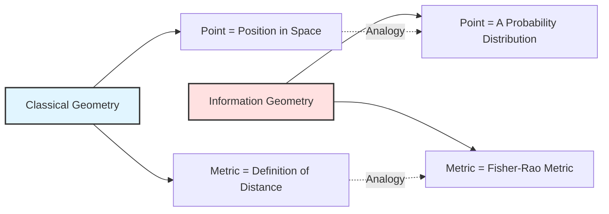
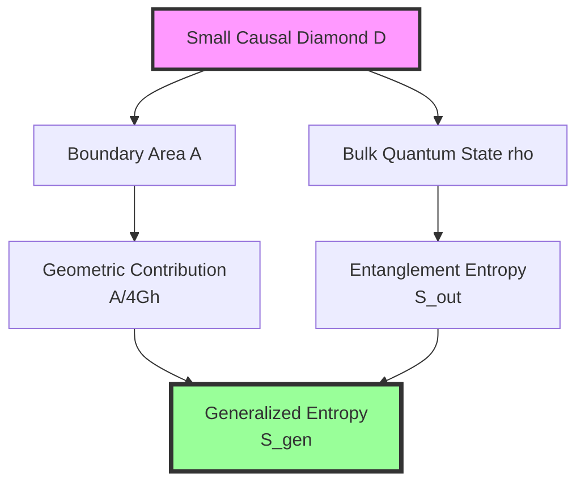
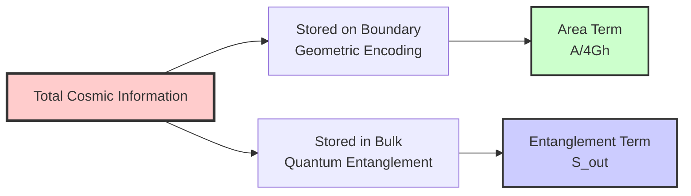
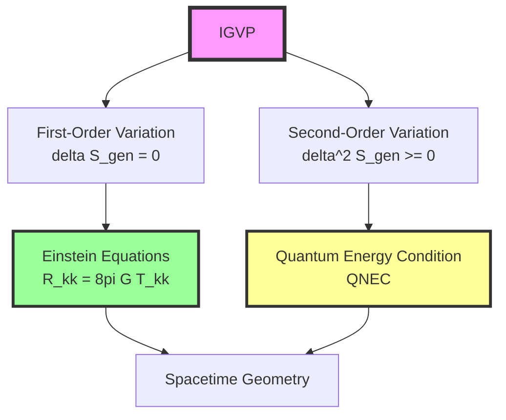
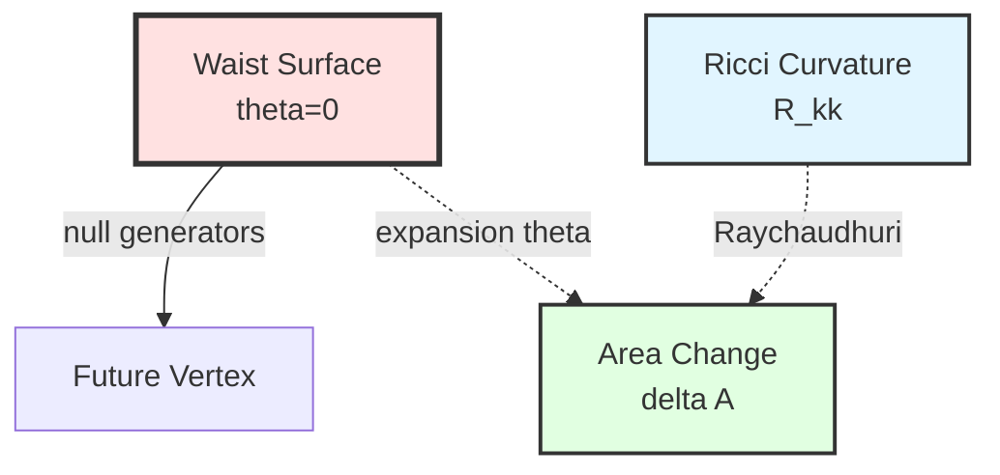
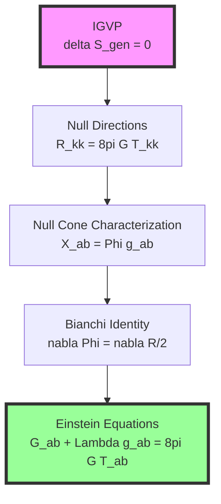
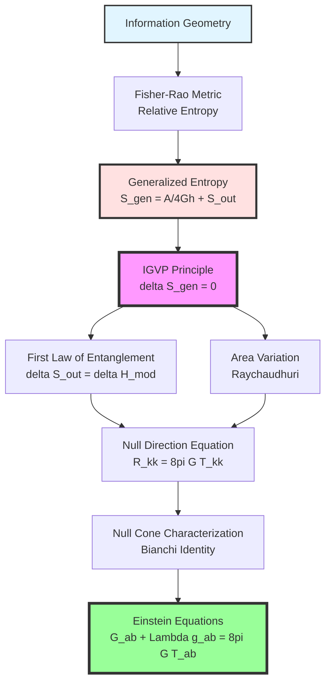

# Chapter 11 Section 2: Information-Geometric Variational Principle (IGVP)

> **"Generalized entropy is not only a thermodynamic quantity, but also a deep connection between spacetime geometry and quantum information."**

## Section Overview

In the previous section, we constructed the cosmic consistency functional. This section will delve into its core component—the **Information-Geometric Variational Principle (IGVP)**, which is the key bridge from abstract consistency conditions to concrete Einstein equations.

## 1. What is Information Geometry?

### 1.1 Classical Geometry vs. Information Geometry

**Classical Differential Geometry** studies:
- Shapes of points, lines, surfaces in space
- Metrics, curvature, geodesics
- Examples: sphere, torus, hyperboloid

**Information Geometry** studies:
- Spaces formed by **probability distributions**
- "Distance" and "curvature" between distributions
- Examples: all normal distributions, all Boltzmann distributions

### 1.2 Fisher-Rao Metric

For a parameterized family of probability distributions $p(x;\theta)$, the **Fisher-Rao metric** is defined as:

$$
g_{ij}^{\mathrm{FR}}(\theta) = \mathbb{E}\left[ \frac{\partial \ln p}{\partial \theta^i} \frac{\partial \ln p}{\partial \theta^j} \right]
$$

**Physical Meaning**:
- It measures the effect of **small parameter changes** on the distribution
- It is the **unique invariant metric** under data processing inequality (Čencov theorem)
- Its second-order variation gives **Fisher information matrix**

**Analogy**:
> Imagine adjusting a radio's frequency knob. Fisher-Rao metric tells you: rotating the knob a little, how much does the signal (probability distribution) change. Some directions (parameters) change a lot with small rotation (high curvature), some directions change little even with large rotation (flat).

### 1.3 Relative Entropy and Umegaki Entropy

For two quantum states $\rho, \sigma$, **relative entropy** (Umegaki entropy) is defined as:

$$
S(\rho \| \sigma) = \mathrm{Tr}(\rho \ln \rho) - \mathrm{Tr}(\rho \ln \sigma)
$$

**Core Properties**:
1. **Non-negativity**: $S(\rho \| \sigma) \geq 0$, equality holds if and only if $\rho = \sigma$
2. **Convexity**: Convex function in $\rho$
3. **Monotonicity**: Non-increasing under quantum channels

**Analogy**:
> Relative entropy measures the "distance" between two quantum states. If $\sigma$ is viewed as "standard state," $S(\rho \| \sigma)$ tells you how far $\rho$ deviates from standard. Like using a standard ruler ($\sigma$) to measure the error of an actual ruler ($\rho$).

## 2. Generalized Entropy: Area + Bulk Entanglement

### 2.1 Definition of Generalized Entropy

For a small causal diamond $D_{p,r}$ in spacetime, **generalized entropy** is defined as:

$$
S_{\mathrm{gen}}(D) = \underbrace{\frac{A(\partial D)}{4G\hbar}}_{\text{Geometric Term: Area}} + \underbrace{S_{\mathrm{out}}(D)}_{\text{Quantum Term: Entanglement Entropy}}
$$

### 2.2 Why "Area + Entanglement"?

**Source of Area Term**:
- Bekenstein-Hawking black hole entropy formula: $S_{\mathrm{BH}} = \frac{A}{4G}$
- Holographic principle: Boundary area encodes bulk information
- Ryu-Takayanagi formula: Holographic dual of entanglement entropy

**Source of Entanglement Term**:
- von Neumann entropy of bulk quantum fields
- UV finite under Hadamard states (after renormalization)
- Represents real quantum entanglement

**Unified Physical Picture**:

**Analogy**:
> Imagine a library (universe). Information has two storage methods:
> 1. **Catalog cards** (area): Each book occupies one card in catalog, number of cards proportional to shelf area
> 2. **Book content** (entanglement): Text inside books, representing actual knowledge
>
> Generalized entropy = Catalog information + Content information.

### 2.3 Role of Unified Time Scale

**Key Question**: Why use unified time scale $\kappa(\omega)$?

**Answer**:
1. **Calibrate different clocks**: Modular time, thermal time, geometric time must align
2. **Connect scattering and geometry**: $\kappa(\omega) = \frac{1}{2\pi} \mathrm{tr} \mathsf{Q}(\omega)$ connects Wigner-Smith group delay with area variation
3. **Ensure causal consistency**: All observers' time readings comparable on $\kappa$

$$
\kappa(\omega) = \frac{\varphi'(\omega)}{\pi} = \rho_{\mathrm{rel}}(\omega) = \frac{1}{2\pi} \mathrm{tr} \mathsf{Q}(\omega)
$$

## 3. Mathematical Formulation of IGVP

### 3.1 Variational Setup

**Scenario**: At each point $p$ on manifold, take small causal diamond $D_{p,r}$ (radius $r \ll L_{\mathrm{curv}}$)

**Fixed Data**:
- Volume of waist surface $V(B_\ell)$
- Unified time scale $\kappa(\omega)$
- Boundary conditions (Dirichlet type)

**Variable Data**:
- Shape of waist surface (changing metric $g_{\mu\nu}$)
- Bulk quantum state $\omega_{\mathrm{bulk}}$

### 3.2 IGVP Principle

**Core Proposition**:

$$
\boxed{\delta S_{\mathrm{gen}} = 0 \quad \text{under fixed volume constraint}}
$$

Equivalently, introducing Lagrange multiplier $\mu$:

$$
\delta \left( S_{\mathrm{gen}} - \mu V \right) = 0
$$

**Physical Interpretation**:
> Under the premise of keeping the small diamond's "size" (volume) constant, generalized entropy reaches extremum. This is similar to finding free energy minimum in "isothermal isochoric" process in thermodynamics.

### 3.3 Two-Level Variation

IGVP contains two levels of variational conditions:

**First Level**: Extremum condition

$$
\delta S_{\mathrm{gen}} = \frac{\delta A}{4G\hbar} + \delta S_{\mathrm{out}} = 0
$$

This will derive **linearization of Einstein equations**.

**Second Level**: Stability condition

$$
\delta^2 S_{\mathrm{gen}} \geq 0
$$

This corresponds to **non-negativity of relative entropy** and **Quantum Null Energy Condition (QNEC)**.

## 4. First Law of Entanglement

### 4.1 Modular Hamiltonian

On waist surface of small causal diamond, choose approximate Killing vector $\chi^a$ (boost generator), define **modular Hamiltonian**:

$$
H_{\mathrm{mod}} = 2\pi \int_{B_\ell} \xi^\mu T_{\mu\nu} d\Sigma^\nu
$$

where $\xi^\mu$ is localized boost vector field, satisfying:

$$
\xi^\mu = \frac{\ell^2 - r^2}{2\ell} u^\mu + O(\ell^3)
$$

### 4.2 First Law of Entanglement

**Theorem 4.1 (First Law of Entanglement)**:

In small diamond limit and Hadamard states,

$$
\delta S_{\mathrm{out}} = \delta \langle H_{\mathrm{mod}} \rangle
$$

accurate to $O(\varepsilon^2)$, where $\varepsilon = r / L_{\mathrm{curv}}$.

**Physical Meaning**:
> Change in entanglement entropy equals change in modular Hamiltonian. This is similar to thermodynamic first law $dS = \frac{dQ}{T}$, but here "temperature" is determined by local geometry ($T = \hbar |\kappa_\chi| / 2\pi$).

**Proof Sketch** (details in appendix):
1. Use Bisognano-Wichmann theorem: Vacuum state in Rindler wedge is thermal
2. Modular flow and KMS condition
3. Variational properties of relative entropy

### 4.3 Expansion of Modular Hamiltonian

In small diamond limit,

$$
\delta \langle H_{\mathrm{mod}} \rangle = \frac{2\pi}{\hbar} \int_{\mathcal{H}} \lambda \, T_{kk} \, d\lambda \, dA + O(\varepsilon^2)
$$

where:
- $\mathcal{H}$: Null geodesic bundle (null generators from waist surface)
- $\lambda$: Affine parameter along null generators
- $T_{kk} := T_{\mu\nu} k^\mu k^\nu$ (stress in null direction)

**Analogy**:
> Modular Hamiltonian measures "energy flow along light ray directions as seen from waist surface." Like standing on mountaintop (waist surface), measuring water flow (energy) along different directions (null generators).

## 5. Area Variation and Raychaudhuri Equation

### 5.1 Null Geodesic Bundle and Expansion

Null generators $k^\mu$ from waist surface $\partial B_\ell$ satisfy:

$$
k^\mu \nabla_\mu k^\nu = 0 \quad \text{(affine parameterization)}
$$

Define **expansion**:

$$
\theta := \nabla_\mu k^\mu
$$

It measures "opening" or "contraction" of null bundle.

### 5.2 Raychaudhuri Equation

Along null generators, expansion satisfies:

$$
\frac{d\theta}{d\lambda} = -\frac{1}{d-2} \theta^2 - \sigma^2 + \omega^2 - R_{kk}
$$

where:
- $\sigma$: Shear
- $\omega$: Twist
- $R_{kk} = R_{\mu\nu} k^\mu k^\nu$ (projection of Ricci curvature in null direction)

**Key Observation**: At waist surface $\theta(0) = 0$ (maximum volume condition), and $\omega = 0$ (Frobenius integrability), hence:

$$
\theta'(0) = -R_{kk}(0) - \sigma^2(0)
$$

### 5.3 Area Variation Formula

Through integration of Raychaudhuri equation:

$$
\frac{\delta A}{A} = -\int_0^{\lambda_*} \theta \, d\lambda = \int_0^{\lambda_*} \lambda \, R_{kk} \, d\lambda + O(\varepsilon^3)
$$

(ignoring higher-order contributions of $\sigma^2$)

**Physical Meaning**:
> Change in boundary area is determined by integral of spacetime curvature along null directions. Larger curvature, faster null bundle convergence, faster area decrease.

## 6. Closure of First-Order Variation

### 6.1 Combining Area and Entropy

Combining area variation and first law of entanglement:

$$
\delta S_{\mathrm{gen}} = \frac{\delta A}{4G\hbar} + \delta S_{\mathrm{out}}
$$

Substituting:

$$
\delta S_{\mathrm{gen}} = \frac{1}{4G\hbar} \int_{\mathcal{H}} \lambda \, R_{kk} \, d\lambda \, dA + \frac{2\pi}{\hbar} \int_{\mathcal{H}} \lambda \, T_{kk} \, d\lambda \, dA + O(\varepsilon^2)
$$

### 6.2 Extremum Condition

Requiring $\delta S_{\mathrm{gen}} = 0$, we get:

$$
\frac{1}{4G\hbar} \int_{\mathcal{H}} \lambda \, R_{kk} \, d\lambda \, dA + \frac{2\pi}{\hbar} \int_{\mathcal{H}} \lambda \, T_{kk} \, d\lambda \, dA = 0
$$

Simplifying:

$$
\int_{\mathcal{H}} \lambda \left( R_{kk} - 8\pi G T_{kk} \right) d\lambda \, dA = 0
$$

### 6.3 Localization to Pointwise

Through **Radon-type closure** (details in Section 3):
- For all test functions $\varphi(x)$ on waist surface
- For all null directions $\hat{k}$

The above integral being zero implies **at each point, each null direction**:

$$
R_{kk} = 8\pi G T_{kk}
$$

**Analogy**:
> Imagine measuring "average height" of a surface. If integrals are zero for all measurement lines (null generators), all starting points (waist surface), then surface height must be zero at each point.

## 7. From Null Directions to Full Tensor

### 7.1 Null Cone Characterization Lemma

**Lemma 7.1** (necessary for $d \geq 3$ dimensions):

If symmetric tensor $X_{ab}$ satisfies $X_{ab} k^a k^b = 0$ for all null vectors $k^a$, then:

$$
X_{ab} = \Phi \, g_{ab}
$$

for some scalar function $\Phi$.

**Proof** (sketch): Use dimension of null cone and degree of freedom counting of symmetric tensors.

### 7.2 Application to Einstein Tensor

Define:

$$
X_{ab} := R_{ab} - 8\pi G T_{ab}
$$

Since $R_{kk} = 8\pi G T_{kk}$ holds in all null directions, we get:

$$
X_{ab} = \Phi \, g_{ab}
$$

### 7.3 Using Bianchi Identity

Contracted Bianchi identity:

$$
\nabla^a R_{ab} = \frac{1}{2} \nabla_b R
$$

Energy-momentum conservation:

$$
\nabla^a T_{ab} = 0
$$

Therefore:

$$
\nabla^a X_{ab} = \nabla^a R_{ab} - 8\pi G \nabla^a T_{ab} = \frac{1}{2} \nabla_b R
$$

On the other hand, from $X_{ab} = \Phi \, g_{ab}$:

$$
\nabla^a X_{ab} = \nabla_b \Phi
$$

Hence:

$$
\nabla_b \left( \Phi - \frac{R}{2} \right) = 0
$$

That is, $\Phi - \frac{R}{2} = \Lambda$ (constant).

### 7.4 Einstein Equations

Rearranging:

$$
R_{ab} - 8\pi G T_{ab} = \Phi \, g_{ab} = \left( \frac{R}{2} + \Lambda \right) g_{ab}
$$

That is:

$$
R_{ab} - \frac{R}{2} g_{ab} + \Lambda g_{ab} = 8\pi G T_{ab}
$$

$$
\boxed{G_{ab} + \Lambda g_{ab} = 8\pi G T_{ab}}
$$

**This is the Einstein field equations!**

## 8. Second-Order Variation and Quantum Energy Condition

### 8.1 Convexity of Relative Entropy

Relative entropy $S(\rho \| \sigma)$ is convex in $\rho$, hence:

$$
\delta^2 S(\rho \| \sigma) \geq 0
$$

### 8.2 Quantum Null Energy Condition (QNEC)

Under second-order deformation along null direction, define:

$$
s_{\mathrm{out}}'' := \lim_{\mathcal{A} \to 0} \frac{1}{\mathcal{A}} \frac{d^2 S_{\mathrm{out}}}{d\lambda^2}
$$

**Theorem 8.1 (QNEC)**:

$$
\langle T_{kk} \rangle \geq \frac{\hbar}{2\pi} s_{\mathrm{out}}''
$$

**Physical Meaning**:
> Energy density in null direction has a **quantum lower bound**, determined by second derivative of entanglement entropy. This is quantum generalization of classical energy conditions.

### 8.3 Consistency with IGVP

Second-order condition $\delta^2 S_{\mathrm{gen}} \geq 0$ of IGVP is equivalent to QNEC in small diamond limit. This ensures:
- Solutions of Einstein equations are **stable**
- No uncontrolled negative energy
- **Unidirectionality** of arrow of time

## 9. Key Points Review

**Core Insight**:

> **Information-Geometric Variational Principle (IGVP) connects extremum condition of generalized entropy with Einstein equations. This is not accidental, but deep necessity: spacetime geometry is determined by information structure, Einstein equations are necessary consequences of information consistency.**

Specific derivation chain:

$$
\text{IGVP: } \delta S_{\mathrm{gen}} = 0 \quad \Rightarrow \quad \frac{\delta A}{4G\hbar} + \delta S_{\mathrm{out}} = 0
$$

$$
\Rightarrow \quad \int \lambda (R_{kk} - 8\pi G T_{kk}) d\lambda \, dA = 0
$$

$$
\Rightarrow \quad R_{kk} = 8\pi G T_{kk} \quad \forall k
$$

$$
\Rightarrow \quad G_{ab} + \Lambda g_{ab} = 8\pi G T_{ab}
$$

## 10. Philosophical Reflection

### 10.1 Nature of Gravity

Traditional view: Gravity is **spacetime curvature**.

IGVP view: Gravity is **geometric manifestation of information entropy extremum**.

> Spacetime is not an a priori existing stage, but an **emergent structure** of quantum information and entanglement. Einstein equations are not assumptions about gravity, but necessary consequences of information consistency.

### 10.2 Why Generalized Entropy?

**Question**: Why use $S_{\mathrm{gen}} = \frac{A}{4G\hbar} + S_{\mathrm{out}}$ instead of area or entanglement entropy alone?

**Answer**:
1. **Area alone**: Cannot include quantum corrections, violates quantum information conservation
2. **Entanglement entropy alone**: UV divergent, and ignores geometric degrees of freedom
3. **Generalized entropy**: Unifies geometry and quantum, UV finite, satisfies quantum focusing conjecture

### 10.3 Bridge from Information to Geometry

IGVP reveals a profound correspondence:

| Information Concept | Geometric Concept |
|---------------------|-------------------|
| Generalized entropy $S_{\mathrm{gen}}$ | "Size" of causal diamond |
| First law of entanglement | Raychaudhuri equation |
| Non-negativity of relative entropy | Quantum energy condition |
| Modular Hamiltonian | Stress-energy tensor |
| Fisher-Rao metric | Physical metric |

> Information geometry is not an analogy to physical geometry, but **two formulations of the same structure**.

---

**Next Section Preview**: In Section 3, we will apply the IGVP framework established in this section to specific small causal diamonds, **step by step deriving every detail of Einstein equations**, including area expansion, exact form of Raychaudhuri equation, mathematical proof of Radon-type closure, and rigorous argument from null directions to full tensor.

